# 记一次Net代码审计之mou应用云平台-先知社区

> **来源**: https://xz.aliyun.com/news/18824  
> **文章ID**: 18824

---

# 环境准备：

反编译bin下面的所有dll文件

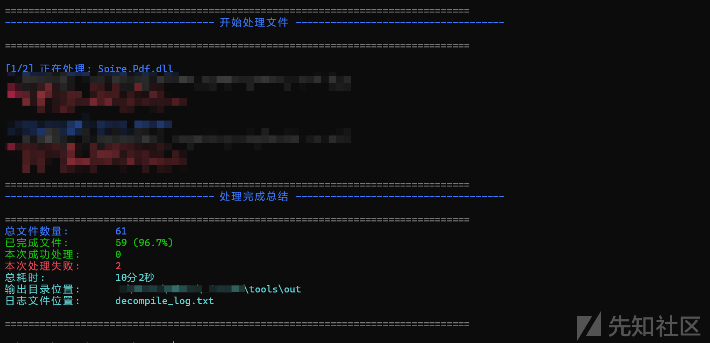

接着进行代码审计即可。

# 鉴权分析：

## API 权限控制

Web API 部分动作采用 “请求头 token 校验 + 服务鉴权” 机制（如 APPController 的大部分 API）：仅当 Authorize 鉴权通过后，才允许执行后续业务逻辑；若鉴权失败，则直接返回错误字符串，权限控制逻辑相对规范。

## MVC Controller 权限风险

MVC Controller 中大量动作标注 IgnoreRightFilter，直接绕过系统统一权限过滤器，导致此类接口支持匿名访问。典型场景包括：

* 内容管理类接口（如 NewsManage/UploadNewsImg）；
* 开关查询类接口（如 Swicth/\* 下多数查询接口）；
* 数据导出与统计类接口（若干导出 / 统计 / 地图接口）。

## 会话管理不规范

系统存在会话标识（响应中常见 ASP.NET\_SessionId），但会话机制未实现统一有效利用：多数接口未依赖 Session 进行鉴权或授权，会话标识仅存在却未发挥权限管控作用，导致会话资源浪费，也无法通过 Session 强化身份验证安全性。

### API 中存在部分Header token 鉴权

鉴权比较简单，在读取 Header 中 token，调用 Authorize 判断是否继续。


### MVC 使用 IgnoreRightFilter

MVC Controller 使用IgnoreRightFilter 当作统一权限过滤器，导致接口匿名可访问，还返回直达 Web 根目录的 URL。


# 文件上传漏洞

执行文件操作时，先定位上传文件，需调用工具路径 AVA.ResourcesPlatform.WebUI.Tools.Video.VideoPath，接着继续看。

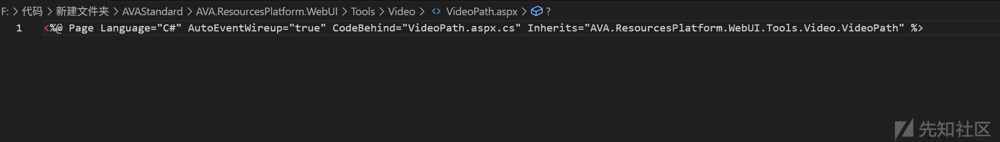

```
<%@ Page Language="C#" AutoEventWireup="true" CodeBehind="VideoPath.aspx.cs" Inherits="AVA.ResourcesPlatform.WebUI.Tools.Video.VideoPath" %>
```

然后全局搜UploadFile接口，发现很多处调用

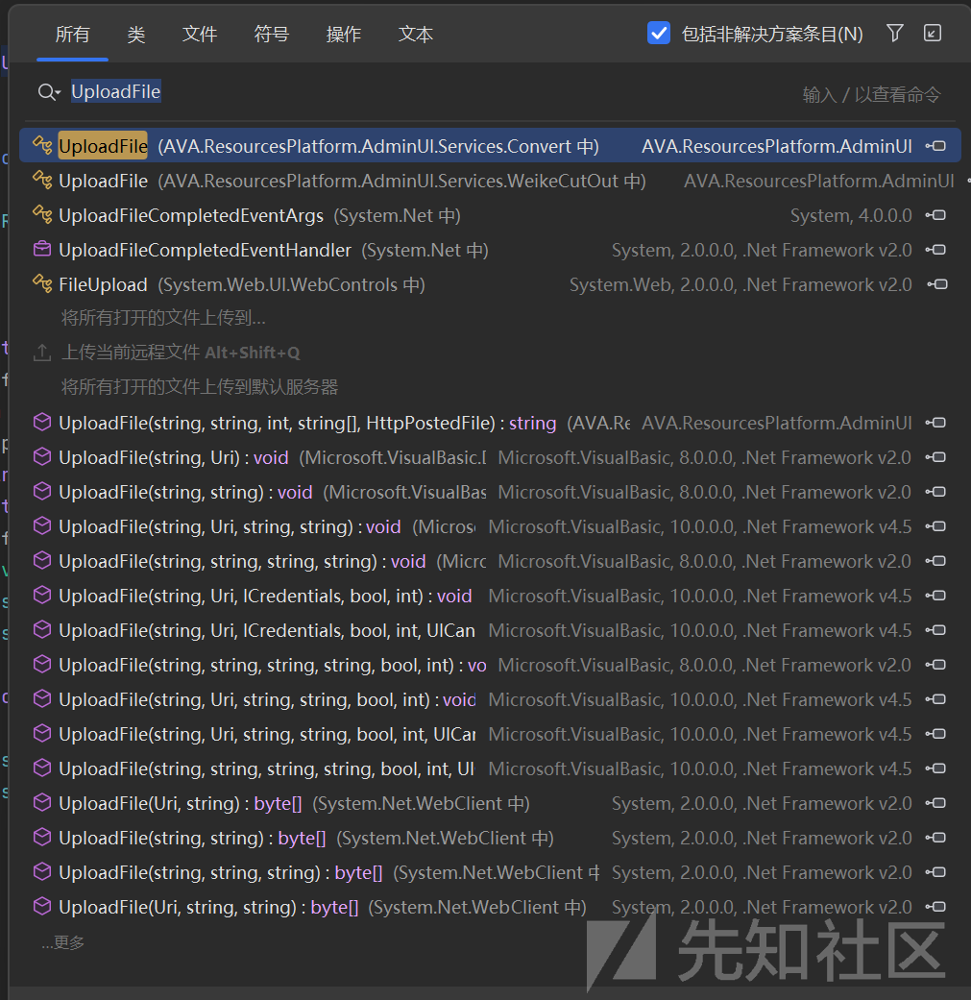

定位到漏洞点，

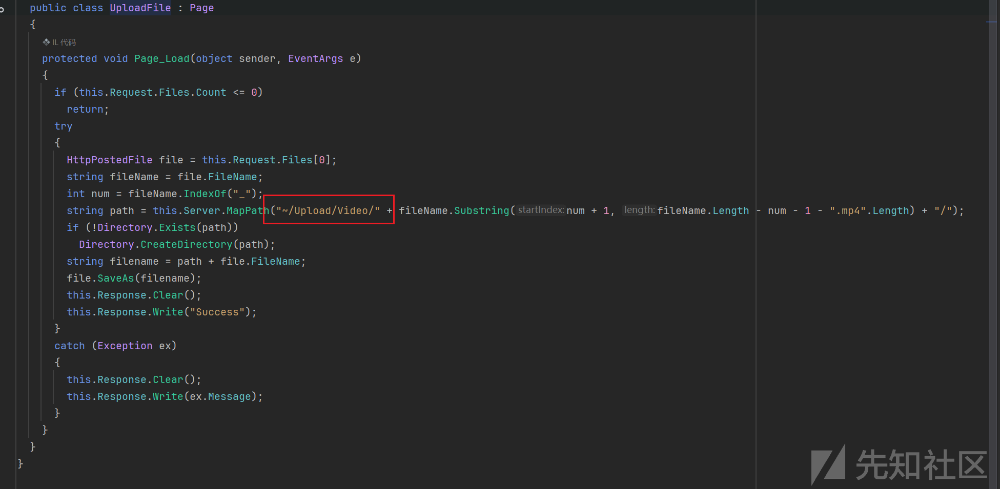

发现这段代码位于`Page_Load`事件中，意味着每次页面加载时都会执行。

文件检查：

* 首先检查请求中是否包含上传的文件（`Request.Files.Count`）
* 如果没有文件则直接返回，不执行后续操作

文件处理逻辑：

* 获取第一个上传的文件（`Request.Files[0]`）
* 提取文件名并查找下划线`_`的位置
* 根据文件名的特定格式（以下划线分割）构建保存路径：

* 保存根目录是`~/Upload/Video/`
* 从下划线后截取部分字符串作为子目录名（同时去掉`.mp4`扩展名）

* 检查目录是否存在，如果不存在则创建
* 拼接完整的保存路径并保存文件（`file.SaveAs`）

响应处理：

* 成功保存后返回 "Success" 字符串
* 如果发生异常，返回异常信息（`ex.Message`）

```
if (this.Request.Files.Count <= 0)
        return;
      try
      {
```

主要是文件上传未做任何限制，然后直接上传到服务器里面。

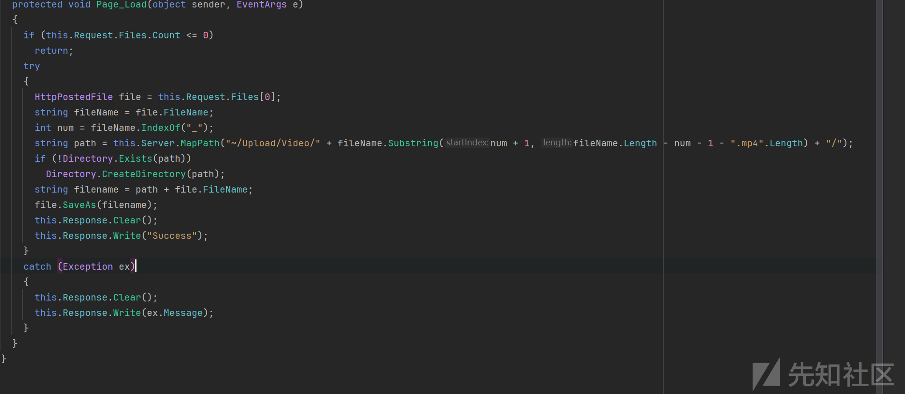

## 漏洞复现

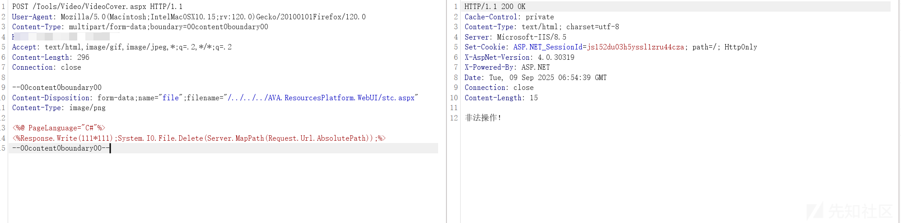

# 第二处文件上传

## 代码分析

定位上传功能处，进行分析

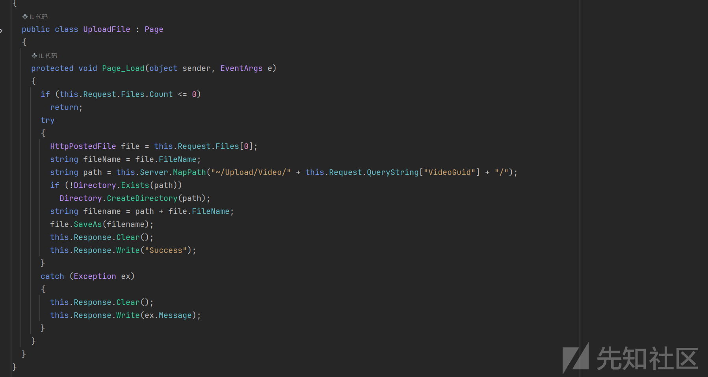

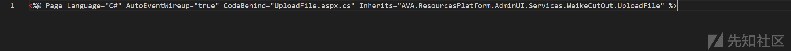

发现代码调用page\_load方法，然后未对上传文件内容等进行过滤。

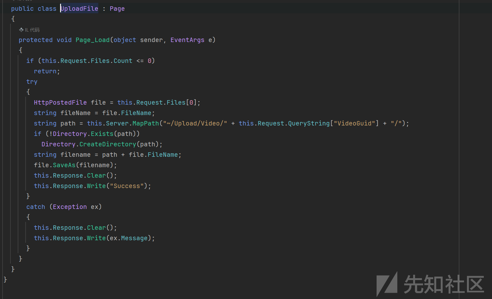

## 漏洞复现

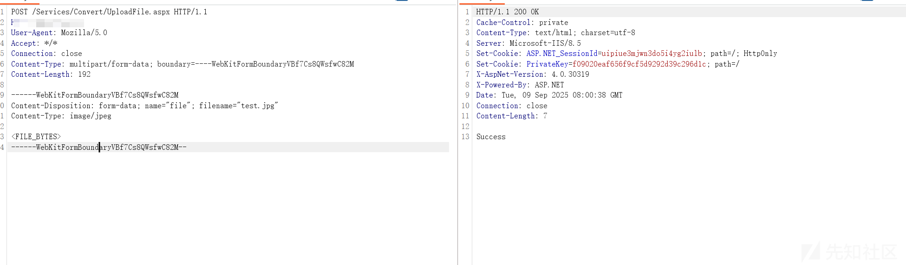

# 第三处文件上传：

## 漏洞分析

* 在 WebUI 中定位该页的类与引用：
* 相关类/控件名：LLUserFileUpload.aspx

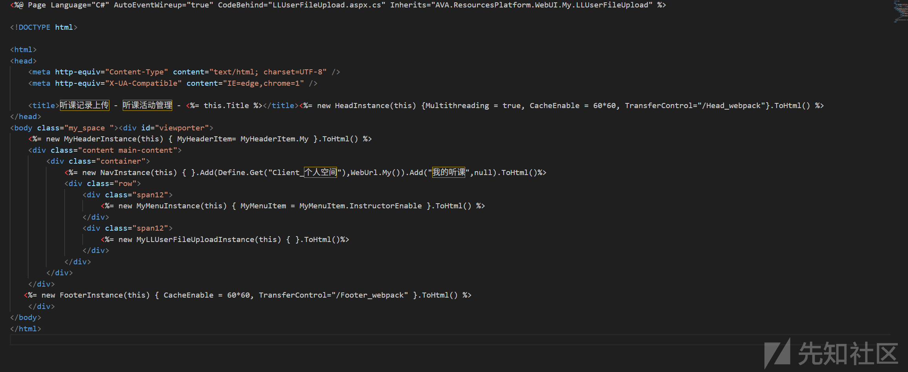

## 文件接收与路径构造

* HttpPostedFile = Request.Files[...]
* 保存路径变量的构造（Server.MapPath("~/Upload/...") 或 SettingGroupConfig.\*UploadPath）
* 目标文件名来源：是否直接用 httpPostedFile.FileName 或表单中的 filename

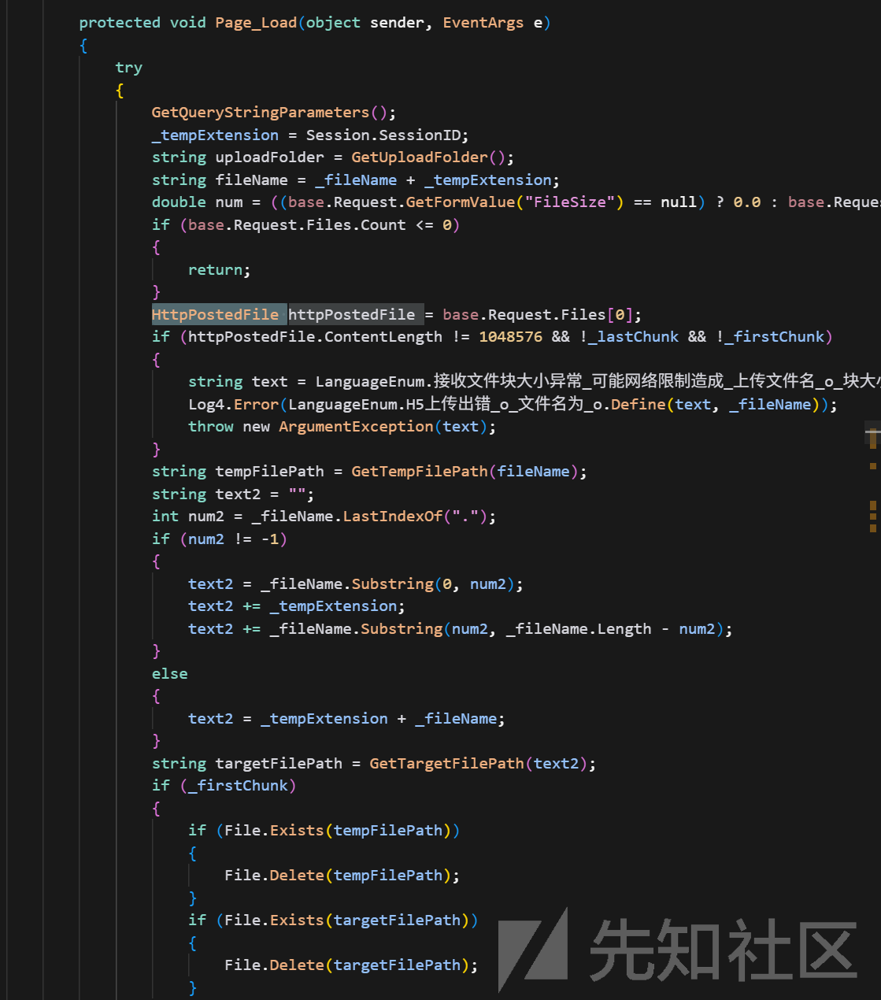

## 过滤检测绕过

* 扩展白名单来源：SettingGroupConfig.UploadIMGType、UploadFileType 等
* 是否对 Path.GetExtension(safeName) 校验（大小写、全角/同形字符）
* 是否仅信任 Content-Type（不可作为强约束）
* 内容校验：
* 是否检测魔数（如图片头），有无图像二次处理（可阻断脚本执行）
* 是否允许任意二进制（pdf/zip）直传进站点可执行目录
* 双扩展/可执行：
* 是否防 poc.aspx;.jpg、poc.asp%00.jpg、poc.aspx::$DATA（NTFS）、poc.asa、poc.cdx
* 是否禁止 .aspx/.ashx/.asmx 等可执行扩展

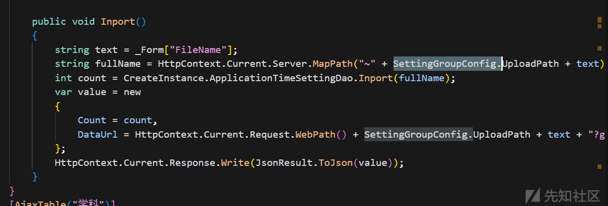

```
public void CaptureImage(string sFromFilePath, float zoom, int width, int height, int spaceX, int spaceY)
		{
			Log4.Error("UploadCut:" + sFromFilePath);
			System.Drawing.Image image = System.Drawing.Image.FromFile(sFromFilePath);
			Bitmap bitmap = new Bitmap(Convert.ToInt32((float)image.Width * zoom), Convert.ToInt32((float)image.Height * zoom));
			Graphics graphics = Graphics.FromImage(bitmap);
			graphics.InterpolationMode = InterpolationMode.HighQualityBicubic;
			graphics.FillRectangle(Brushes.White, 0, 0, bitmap.Width, bitmap.Height);
			graphics.DrawImage(image, 0, 0, bitmap.Width, bitmap.Height);
			System.Drawing.Image image2 = System.Drawing.Image.FromHbitmap(bitmap.GetHbitmap());
			int x = 0;
			int y = 0;
			int num = image2.Width - width;
			int num2 = image2.Height - height;
			if (num > 0)
			{
				x = ((num > spaceX) ? spaceX : num);
			}
			else
			{
				width = image2.Width;
			}
			if (num2 > 0)
			{
				y = ((num2 > spaceY) ? spaceY : num2);
			}
			else
			{
				height = image2.Height;
			}
			Bitmap bitmap2 = new Bitmap(width, height);
			Graphics graphics2 = Graphics.FromImage(bitmap2);
			graphics2.InterpolationMode = InterpolationMode.HighQualityBicubic;
			graphics2.DrawImage(image2, 0, 0, new Rectangle(x, y, width, height), GraphicsUnit.Pixel);
			System.Drawing.Image image3 = System.Drawing.Image.FromHbitmap(bitmap2.GetHbitmap());
			image3.Save(sFromFilePath + "temp", ImageFormat.Jpeg);
			image3.Dispose();
			bitmap2.Dispose();
			graphics2.Dispose();
			image.Dispose();
			bitmap.Dispose();
			graphics.Dispose();
			File.Delete(sFromFilePath);
			File.Move(sFromFilePath + "temp", sFromFilePath);
		}
	}
```

然后根据过滤内容，然后进行构造poc即可。

## 漏洞复现

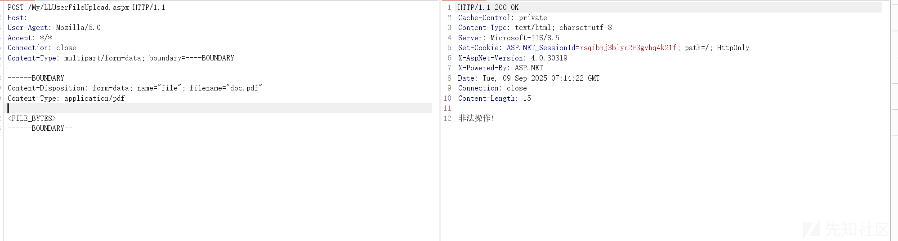

# 任意文件下载：

## 代码分析：

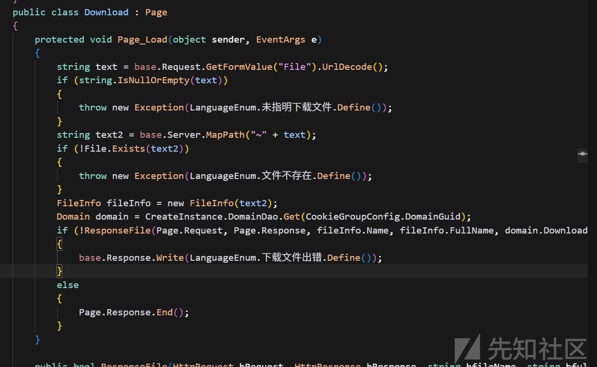

```
protected void Page_Load(object sender, EventArgs e)
		{
			string text = base.Request.GetFormValue("File").UrlDecode();
			if (string.IsNullOrEmpty(text))
			{
				throw new Exception(LanguageEnum.未指明下载文件.Define());
			}
			string text2 = base.Server.MapPath("~" + text);
			if (!File.Exists(text2))
			{
				throw new Exception(LanguageEnum.文件不存在.Define());
			}
			FileInfo fileInfo = new FileInfo(text2);
			Domain domain = CreateInstance.DomainDao.Get(CookieGroupConfig.DomainGuid);
			if (!ResponseFile(Page.Request, Page.Response, fileInfo.Name, fileInfo.FullName, domain.DownloadSpeed * 1024 * 1024))
			{
				base.Response.Write(LanguageEnum.下载文件出错.Define());
			}
```

当前代码存在显著安全隐患：未对 “file” 参数进行有效性校验，直接将其拼入 Server.MapPath("~" + file) 路径中。这一操作允许用户指定站点根目录内的任意虚拟路径，进而触发任意文件下载漏洞

```
Domain domain = CreateInstance.DomainDao.Get(CookieGroupConfig.DomainGuid);
			if (!ResponseFile(Page.Request, Page.Response, fileInfo.Name, fileInfo.FullName, domain.DownloadSpeed * 1024 * 1024))
			{
				base.Response.Write(LanguageEnum.下载文件出错.Define());
			}
			else
			{
				Page.Response.End();
			}
```

获取文件信息

```
FileInfo fileInfo = new FileInfo(text2);  
Domain domain = CreateInstance.DomainDao.Get(CookieGroupConfig.DomainGuid);
```

然后调用 ResponseFile 方法，成功下载文件。

```
if (!ResponseFile(Page.Request, Page.Response, fileInfo.Name, fileInfo.FullName, domain.DownloadSpeed \* 1024 \* 1024))
```

## 漏洞复现：

## image.png

## 漏洞修复：

将可下载文件移出 Web 根目录，仅通过受控接口按 ID 映射到物理文件，彻底避免路径拼接

对历史日志排查是否有异常下载访问（web.config、.aspx、.dll 等）

为下载接口增加最小权限校验与记录（用户、IP、文件、时间、结果）

```
// 固定基目录（建议站点根外的安全目录；此处示例根内某子目录）
var baseVirtual = "~/DownloadSafe/";
var basePhysical = Server.MapPath(baseVirtual);

var userPath = Request["file"]; // 兼容 Query/Form
if (string.IsNullOrWhiteSpace(userPath)) throw new Exception("未指明下载文件");

// 仅允许相对子路径，拒绝以 / 或 \ 开头的虚拟根路径
if (userPath.StartsWith("/") || userPath.StartsWith("\")) throw new Exception("非法路径");

// 归一化并拼接
var candidate = Path.GetFullPath(Path.Combine(basePhysical, userPath.Replace('/', '\')));

// 越界检测：必须位于 basePhysical 子树内
if (!candidate.StartsWith(Path.GetFullPath(basePhysical), StringComparison.OrdinalIgnoreCase))
    throw new Exception("非法路径");

// 扩展白名单
var allowedExt = new HashSet<string>(StringComparer.OrdinalIgnoreCase)
{ ".pdf", ".doc", ".docx", ".jpg", ".jpeg", ".png", ".zip" };
var ext = Path.GetExtension(candidate);
if (string.IsNullOrEmpty(ext) || !allowedExt.Contains(ext))
    throw new Exception("不允许的文件类型");

// 黑名单（双保险）
var denyExt = new HashSet<string>(StringComparer.OrdinalIgnoreCase)
{ ".config", ".aspx", ".asmx", ".ashx", ".cs", ".dll", ".exe" };
if (denyExt.Contains(ext)) throw new Exception("不允许的文件类型");

// 存在性检查
if (!System.IO.File.Exists(candidate)) throw new Exception("文件不存在");

// 鉴权（按需）
if (!User.Identity.IsAuthenticated) throw new Exception("未登录");

// 输出（可沿用现有 ResponseFile，但建议设置 X-Content-Type-Options: nosniff）
Response.Clear();
Response.Headers["X-Content-Type-Options"] = "nosniff";
var name = Path.GetFileName(candidate);
Response.ContentType = "application/octet-stream";
Response.AddHeader("Content-Disposition", $"attachment; filename="{HttpUtility.UrlEncode(name)}"");
Response.TransmitFile(candidate);
Response.End();
```

​

REF：

http://mp.weixin.qq.com/s?search\_click\_id=17710134741822833135-1757577180010-2926091602&\_\_biz=MzkzMzI3OTczNA==&mid=2247488083&idx=1&sn=ff3cfe0fda9788754fb3cd0e9b53d247&chksm=c38c09baa2509295bfdb717d0bcf9795fdcff4ca621221fc1dd335d9599f5f70bd896572332a&scene=7#rd

https://mp.weixin.qq.com/s/EmcxJUEGJGwpcDbrvFu7jQ
