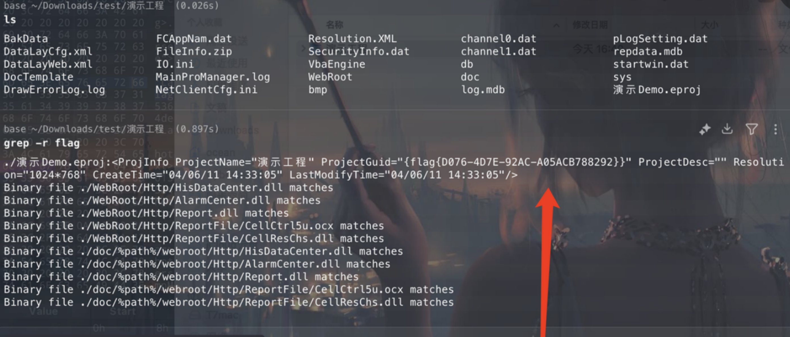
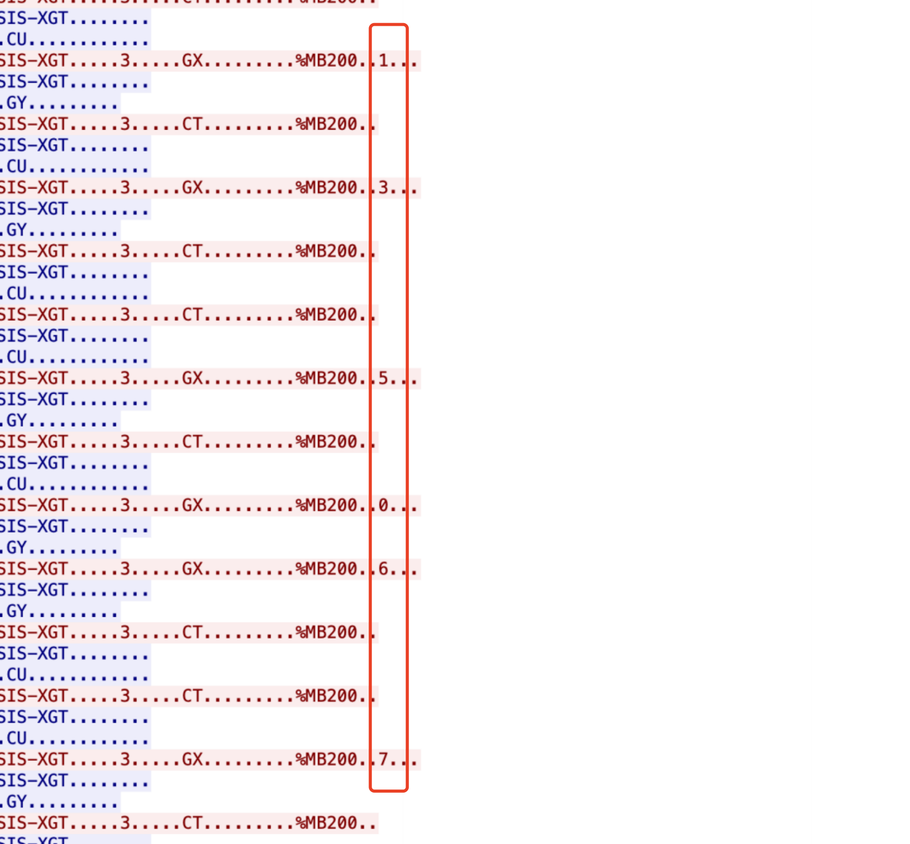
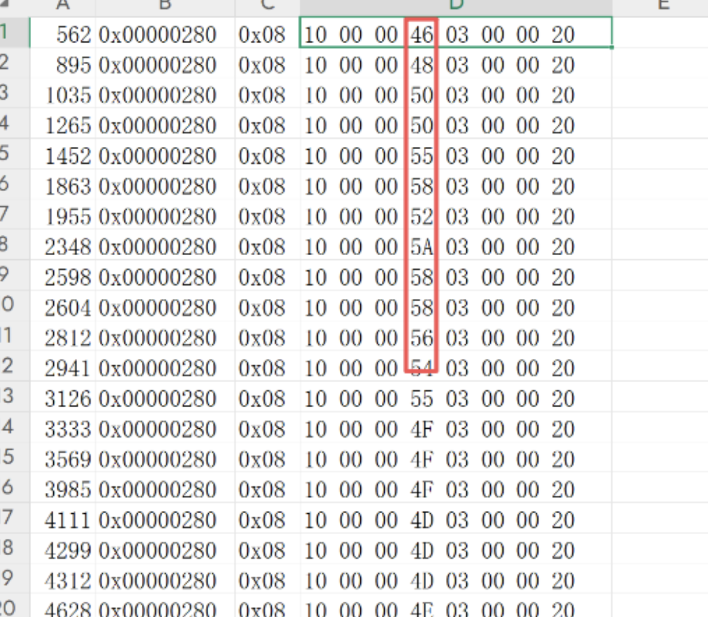
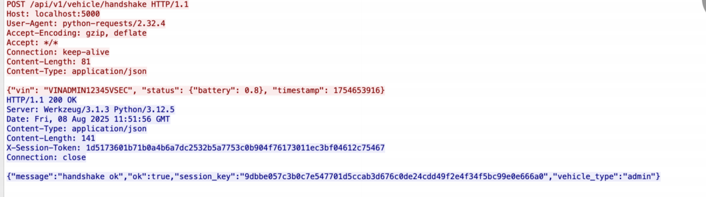
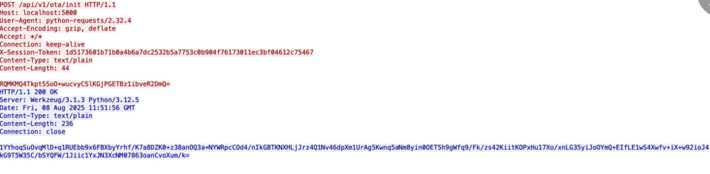
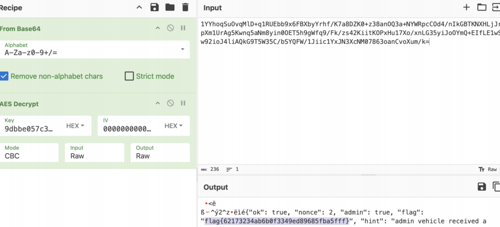
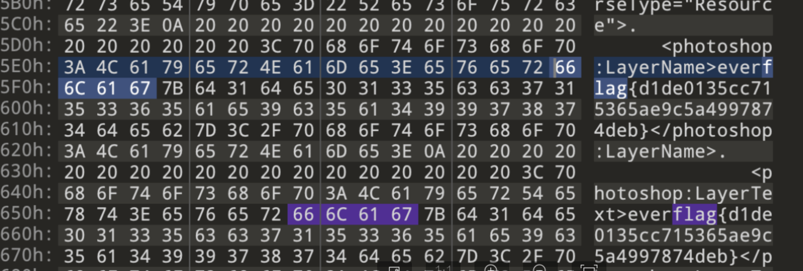

# 山东省“技能兴鲁”职业技能大赛—“铸网2025”山东省工业和互联网CTF竞赛WP-先知社区

> **来源**: https://xz.aliyun.com/news/18857  
> **文章ID**: 18857

---

# **ICS**

## **失窃的工艺**

下载后test.PCZ文件，需要使用力控软件打开。

但电脑没有安装这个软件，尝试把后缀名改为.zip，解压后直接搜索flag文本：



成功在文件中找到flag：flag{D076-4D7E-92AC-A05ACB788292}。

​

## **工控协议分析**

WireShark打开分析，追踪TCP流，flag被逐字符藏在流量中：



拼凑起来得到flag：flag{c93650241853da240f9760531a79cbcf}。

​

# **Misc**

## **总线流量分析**

一辆汽车在试验道路上行驶，测试人员监控了一段时间的车内通信报文，报文抓取时间间隔为36s，尝试找出与仪表显示车速相关的CAN通信报文，估算车辆在这段时间的行驶路程（m）得到flag。已知车速在80千米每小时左右，车速信息只占用1字节长度，且具备较高优先级。flag{行驶路程距离}

​

打开后**按ID分组**观察，根据题目提示找只有**1字节变化**的can报文：

​



发现ID=0x0000280的can报文数据只有**1字节在变化**且**在0x50左右浮动**，说明速度为**80km/h**左右。

编写脚本计算即可：

​

```
speeds_hex = ["46","48","50","50","55","58","52","5A","58","58",
              "56","54","55","4F","4F","4F","4D","4D","4D","4E",
              "4E","53","56","56","59","59","51","52","4F","46"]

speeds = [int(h,16) for h in speeds_hex]
delta_t = 36

distance_km = 0
for v in speeds:
    distance_km += v * delta_t / 3600

distance_m = distance_km * 1000
print(distance_km, distance_m)

# 24.469999999999995 24469.999999999996
# flag{24470}
```

## **OTA流量分析**

车机/IOT设备的OTA（Over-The-Air）流程：

1. 设备发起请求到服务器，比如 /api/v1/vehicle/handshake，带上设备信息。
2. 服务器生成一个 **会话密钥 session\_key**，通过 HTTPS 或者加密通道下发给设备。
3. 后续敏感数据（固件包、授权信息）会用这个 session\_key 进行对称加密（常见 AES-CBC/CTR）。
4. 设备用 session\_key 解密得到明文，然后执行升级或拿到控制指令。

​







## **Easypicgame**

010editor打开图片，直接搜索flag即可：

​



# **Reverse**

## **简单的逆向分析**

拖入IDA分析，逻辑非常简单，直接把密文异或0x5A即可：

​

```
data = [0x3C, 0x36, 0x3B, 0x3D, 0x21, 0x1B, 0x1F, 0x9, 0x77, 0x32, 0x3B,0x2A,
0x23, 0x27]
for i in data:
    print(chr(i ^ 0x5A))
```

# **Crypto**

## **EasyAES**

题目给出的加密流程是：先用 3 字符的 k0 对 flag 进行 AES-CBC 加密得到 c0，然后连续用同样长度的 k1 对 c0 连续加密三次得到 c3。密钥是通过 sha256 从 3 字符明文生成的，因此可以通过穷举实现。

解题思路如下：

1. 爆 k1 段：

* 对 c3 做三次 AES-CBC 解密，并对每次解密结果进行 PKCS7 补位校验。
* 当三次解密都成功且补位合法时，说明该 k1 值正确，对应的解密结果即为 c0。

2. 爆 k0 段：

* 对 c0 做一次 AES-CBC 解密并校验 PKCS7 补位，同时验证明文是否符合 flag 的 UUID 格式。
* 找到匹配的 k0 后，即可得到最终 flag。

3. 优化思路：

* k1 的搜索空间和 k0 相比较大，可利用多进程或批量处理加速暴力搜索。
* PKCS7 补位校验和 UUID 格式校验可以作为快速剪枝条件，大幅减少无效解尝试。

脚本：

​

```
#!/usr/bin/env python3
# -*- coding: utf-8 -*-
# 依赖：pip install pycryptodome
from hashlib import sha256
from Crypto.Cipher import AES
import re
import itertools
import multiprocessing as mp

# ========== 配置 ==========
c3_hex = "62343dfc3e978a1d580b54f345e1ed719c85ab15781acfe8ba3bcef1560c9cf54f187bc204c302a5ed4ebb5b5454151ba9b8b73841e17dc391c30a637ef8cfa14a25d01765231ef93a6faede2d66bad5d124201a2d278522bfd416de294677046d47f2827580cdcb9c0d3b18e4c0c68c8948aaefe4e684c7386b426db7898b5c2090047ff433bb6a75b38beaf81b7ad9404d2f09c642179697e9d3721eefc0eb12ba8c780a8d07672f70b00b9cadef74"
data = bytes.fromhex(c3_hex)
ALPHABET = "abcdefghijklmnopqrstuvwxyzABCDEFGHIJKLMNOPQRSTUVWXYZ0123456789"
UUID_RE = re.compile(rb"^[0-9A-Fa-f]{8}-[0-9A-Fa-f]{4}-[0-9A-Fa-f]{4}-[0-9A-Fa-f]{4}-[0-9A-Fa-f]{12}$")

WORKERS = mp.cpu_count()  # 可调整为 4~8
BATCH_SIZE = 256# 每个任务分配的 k1 数量

# ========== AES 工具函数 ==========
def unpad32(b: bytes) -> bytes:
    pad = b[-1]
    if pad < 1or pad > 32or b[-pad:] != bytes([pad])*pad:
        raise ValueError("bad pad")
    return b[:-pad]

def dec32(key: bytes, blob: bytes) -> bytes:
    iv, ct = blob[:16], blob[16:]
    pt = AES.new(key, AES.MODE_CBC, iv).decrypt(ct)
    return unpad32(pt)

def triple_dec_check(k_bytes: bytes, c3_bytes: bytes):
    """三次解密并校验 PKCS7"""
    try:
        t1 = dec32(k_bytes, c3_bytes)
        t2 = dec32(k_bytes, t1)
        t3 = dec32(k_bytes, t2)
        return t3
    except Exception:
        returnNone

# ========== worker 初始化 ==========
def init_worker(keys0_list_param):
    global KEYS0_LIST
    KEYS0_LIST = keys0_list_param

# ========== worker 函数 ==========
def worker_k1_batch(batch):
    """尝试一个 k1 批次"""
    global KEYS0_LIST, data
    for seg in batch:
        k1_bytes = sha256(seg.encode()).digest()
        c0_candidate = triple_dec_check(k1_bytes, data)
        if c0_candidate isNone:
            continue
        # 找到 k1，尝试 k0
        for k0_seg, k0_bytes in KEYS0_LIST:
            try:
                pt = dec32(k0_bytes, c0_candidate)
            except Exception:
                continue
            if UUID_RE.match(pt):
                return (seg, k0_seg, pt.decode())
    returnNone

# ========== 主流程 ==========
def main():
    # 生成 k0 候选列表
    keys0_list = [(a+b+c, sha256((a+b+c).encode()).digest())
                  for a in ALPHABET for b in ALPHABET for c in ALPHABET]

    # 生成 k1 流式批次
    def k1_batch_gen(batch_size):
        it = (a+b+c for a in ALPHABET for b in ALPHABET for c in ALPHABET)
        whileTrue:
            batch = list(itertools.islice(it, batch_size))
            ifnot batch:
                break
            yield batch

    pool = mp.Pool(WORKERS, initializer=init_worker, initargs=(keys0_list,))
    try:
        for result in pool.imap_unordered(worker_k1_batch, k1_batch_gen(BATCH_SIZE), chunksize=1):
            if result:
                k1_seg, k0_seg, flag = result
                print("找到结果！")
                print("k1 segment =", k1_seg)
                print("k0 segment =", k0_seg)
                print("flag =", flag)
                pool.terminate()
                return
    finally:
        pool.close()
        pool.join()
    print("遍历完成，没有找到 flag")

if __name__ == "__main__":
    main()
```
