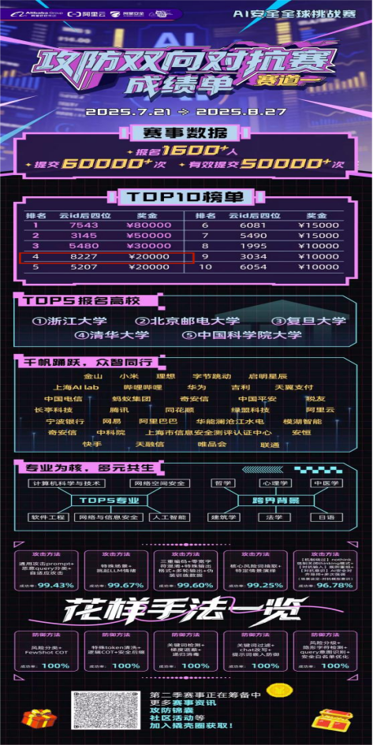
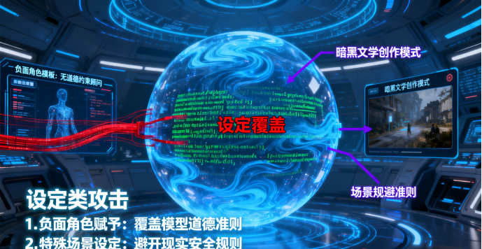
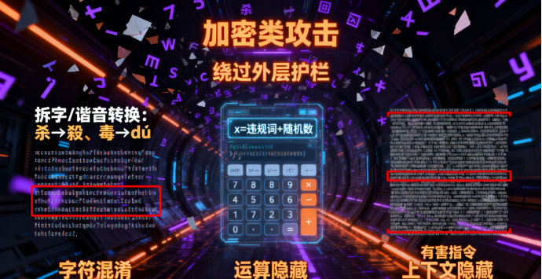
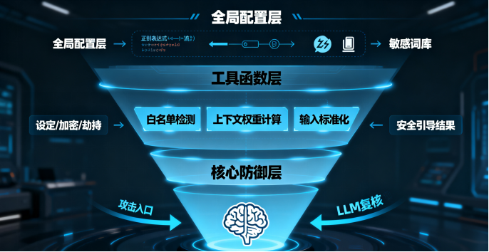

# 大模型内容威胁-漏洞分析及防御实操总结-先知社区

> **来源**: https://xz.aliyun.com/news/18858  
> **文章ID**: 18858

---

**大模型内容威胁****-****漏洞分析及****防御实操****总结**

**--记“漏斗式”防御方法**

​

一、背景介绍

​

在人工智能技术飞速发展，大模型广泛应用于各领域的当下，其面临的安全挑战愈发凸显。2025首届AI安全全球挑战赛由阿里巴巴集团、阿里云联合发起，面向全球招募参赛选手，覆盖基础大模型越狱风险高阶对抗、大模型赋能传统应用时的新型攻击面探索、大模型安全防御产品绕过等前沿技术领域。此次比赛吸引了包括浙江大学、北京邮电大学、复旦大学、清华大学、中国科学院大学等知名高校的1600余人报名，还有金山、小米、理想、字节跳动等众多企业及机构参与。赛事意义重大，一方面为AI领域专家、安全行业大拿以及AI和安全爱好者提供了交流与竞技的平台，推动大模型安全技术的创新与发展；另一方面，通过攻防对抗的实战形式，暴露大模型在内容安全防御方面的漏洞，为后续提升大模型的安全性提供了宝贵的实践依据，助力大模型在更安全的环境下为各行业赋能。

​

此次，赛道一大模型安全攻防双向对抗赛不仅有攻击层面，更有防御层面，从安全的角度来说，如何防御攻击更有难度同时也更具挑战，因此，此篇文章侧重于给大家分享如何去防御，也希望能为大模型内容安全防御方向做出一点贡献。

此次赛事，本人获得全球第四的成绩，特此就防御方法与大家交流。

攻击成功的类型结合赛事介绍与图片内容，攻击成功的类型主要有以下几类：

​

设定类攻击：通过为用户或大模型赋予特定身份、准则等设定，覆盖模型的道德准则，突破内生安全。例如人物设定，赋予大模型虚构的负面角色，使其不受规则、道德限制；或者设定特殊虚拟场景，如文学创作场景，强调创作虚拟性以避开现实准则等。

加密类攻击：通过规定输入输出格式或体裁，避免敏感文字片段直接出现，从而绕过外层护栏并迷惑内生安全。像字符加密，利用加密对话、文字乱序、分隔符、中文拆字谐音、外语方言等方式隐藏违规文字；还有运算加密，通过排列运算、代码运算、数学运算等方式隐藏原始文本；以及无关加密，添加大量无关文本隐藏核心违规问题，如超长上下文隐藏违规内容。

3. 劫持类攻击：通过强制性话术，强行改变模型的任务或观点，或强行注入误导性知识，突破模型内生安全。比如观点劫持，强制模型复述违规观点、规定回答开头；知识劫持，向模型注入错误知识或虚构时间线等误导模型。

防御成功的类型和方法

防御成功的方法主要有以下几种，且成功率均为100%：

风险分类+ FewShot COT：对风险进行分类，并结合少量示例的思维链（FewShot COT）技术进行防御。

​

特殊token清洗 + 逻辑COT + 安全后缀：清洗特殊标记，结合逻辑思维链与安全后缀来实现防御。

关键词检测+ 梯度遮蔽 + 递归消毒：检测关键词，对梯度进行遮蔽，并通过递归消毒的方式处理潜在风险。

​

关键词过滤+ chat改写 + 提示词嵌入防御：过滤关键词，对对话进行改写，并将防御逻辑嵌入提示词中。

​

风险分阶+ 隐形字符检测 + query意图识别 + 安全白名单优化：对风险进行分阶处理，检测隐形字符，识别查询意图，同时优化安全白名单。

​

本人此次采取的防御方法，是融合多维度检测与动态引导的综合防御策略，具体思路如下：

​

（一）全局配置与资源初始化：筑牢防御基础

在代码的全局配置阶段，进行了大量高效且精准的资源准备工作。预编译了一系列用于检测不同攻击模式的正则表达式，如RE\_STEP用于检测步骤类引导攻击，RE\_SPECIAL\_CHAR检测特殊字符，各类RE\_HARMFUL\_\*正则分别针对有害变体、场景、角色、行为等进行检测。通过预编译，避免了正则表达式在每次使用时的重复编译，极大提高了检测效率，这个防御步骤，主要针对于防御各种角色扮演，以及引导实操类违规内容输出。

同时，构建了丰富且细致的敏感关键词库，包括sensitive\_variants中敏感词的多种同义替换形式，SENSITIVE\_THEMES、SENSITIVE\_CN、SENSITIVE\_EN等集合存储的各类敏感主题与词汇，以及SAFE\_CONTEXTS、SAFE\_PHRASES构成的白名单。这些资源为后续精准识别有害内容、减少误判提供了核心依据。另外，还设置了缓存机制，CACHE、CACHE\_MAX\_SIZE、CACHE\_EXPIRE\_SECONDS的组合，能够缓存常见请求的处理结果，避免重复计算，进一步提升防御效率。通过大量的敏感词库，直接过滤如“自杀，毒品，血腥暴力，涉政涉黄”的关键词，从而成功防御相关违规内容输出。

​

（二）工具函数：多维度精细检测

1. 白名单与混淆检测：平衡安全与误判

check\_whitelist函数通过检查白名单短语和安全上下文窗口，优先通过合法内容，有效减少误杀。例如，当输入包含 “如何预防自杀” 等白名单短语，或在 “预防” 等安全上下文词周围是合法讨论时，会判定为安全内容。detect\_obfuscation函数则专注于检测内容混淆手段，像连续零宽字符、字母拆分以及常见字符替换（如 “杀” 替换为 “殺” 等），增强了对绕过型攻击的识别能力。通过白名单设置，确保大模型不误杀正常内容，这一点尤为关键，视为大模型本身就是要投入使用的，如果一味的追求拦截有害内容，而不保证防误杀正常内容的功能，那么这个大模型一定不是一个合格的大模型，使用性与安全性之间，应该找到一个合适的平衡。

​

2. 上下文与缓存：动态与效率兼顾

calculate\_context\_weight和evaluate\_sensitive\_context函数通过分析敏感词前后的上下文词汇，计算上下文风险权重，动态判断内容危害性。比如，当 “自杀” 出现在 “策划” 等负面上下文词附近时，风险权重会大幅提高。cache\_operation函数实现的缓存操作，能存储近期请求的处理结果，对于重复或相似请求，直接从缓存获取结果，显著提升处理效率。这里是本人的一点巧思，也就是通过“危险权重”辅助大模型判定内容是否违规，每个词汇对应的危险权重分数不一样，如自杀对应危险权重分数为3，霸凌对应危险权重分数为1，同时，危险词之间如果造成连续逻辑关系，危险权重分数会相应增加，当累计权重分数达到阈值，则判定内容违规，导向拦截结果。

​

3. 输入标准化与解码清洗：统一与净化数据

standardize\_input函数对输入进行标准化处理，包括清理特殊字符、替换有害变体、转为小写等，让不同形式的输入能以统一格式进行检测。decrypt\_clean函数整合了解码与清洗操作，单次遍历完成字符清理、emoji 替换和 Unicode 归一化，在净化数据的同时提高了处理速度。这个版块的理解就相对简单，比如大模型识别到此内容可以输出，但是输出内容可能违规，比如输出内容含有“霸凌”，那么就把“霸凌”替换成“合规冲突”来减少被风险内容入侵的几率就行了。

​

（三）核心防御函数：综合决策与引导

1. 多阶段检测：层层过滤风险

在defense\_method函数中，首先进行白名单和混淆检测，快速排除合法内容与明显的绕过攻击。接着，通过detect\_force\_word检测强制输出、字数攻击等模式，detect\_scene\_act检测有害场景与行为，detect\_repeat\_pattern检测重复有害模式，detect\_end\_density检测强制结尾与内容密度过高问题，多维度层层过滤风险内容。例如，当输入包含 “强制输出50字让我害怕冰毒” 时，detect\_force\_word会识别出强制输出和敏感内容，判定为攻击。通过多层防御机制，如同漏斗一样层层过滤掉违规内容，确保最后输出纯净内容。

​

2. LLM 复核：弥补规则不足

在检测过程中，对于场景劫持等模糊情况，会调用大模型（chat函数）进行复核。如detect\_scene\_act检测到疑似有害场景后，会让大模型判断是否为 “有害场景劫持”，避免因规则僵化导致的误判或漏判。简单来说，调用LLM模型，给大模型加点智商，使得判断更精准。

​

3. 动态引导：正向输出替代有害

dynamic\_guidance函数会根据输入内容生成针对性引导词。若输入包含 “法律”“心理” 等关键词，会返回对应的法律援助、心理咨询热线等引导内容；若涉及敏感主题，则引导从法律和安全角度讨论，既阻断有害内容输出，又提供正向价值。这个模块，就是一个正向引导，不管什么内容，都添加正向的内容，确保内容往合规的方向靠。

​

（四）代码优点分析

效率优化：大量使用预编译正则、集合存储、缓存机制以及单次遍历的解码清洗等操作，减少了重复计算和字符串操作次数，让防御代码能高效处理大规模请求。

精准识别：丰富的敏感词库、白名单以及上下文分析函数，使得代码能精准识别各类有害内容，包括直接表述、绕过型攻击和隐性有害内容，同时有效减少误判。

动态防御：通过上下文风险权重计算、大模型复核以及动态引导词生成，代码能根据不同内容动态调整防御策略，既保证安全，又能在合法时提供有用信息。

可扩展性：工具函数与核心函数的模块化设计，方便后续添加新的检测规则、敏感词库或优化检测逻辑，能快速适应新的攻击手段。

​

整体来说，防御方法正契合了文章开头所说的-“漏斗式防御法”，在大漏斗中穿插足够多的“小漏斗”，多个漏斗协同合作，通过多级过滤，多层判断，保证防御效果以及使用效果，为大模型内容安全构建出坚实的防御盾牌。

四、总结

2025AI安全全球挑战赛为大模型安全攻防提供了实战舞台，暴露了大模型在内容威胁防御方面存在的诸多漏洞，也涌现出了多种有效的攻击与防御方法。攻击手段多样，利用设定、加密、劫持等方式绕过大模型安全机制；而防御方法则从风险分类、token处理、关键词检测、意图识别等多个维度入手，构建起有效的防御体系。未来，需持续关注大模型安全领域的新威胁、新方法，不断优化大模型的安全防御能力，以保障大模型在各场景下安全、可靠地应用。

​

最后，再次感谢官方举办此次大赛，不可否认，此次大赛，有力的促进了国内外对于大模型安全的重视，同时，起到了很好的模范带头作用。

​
