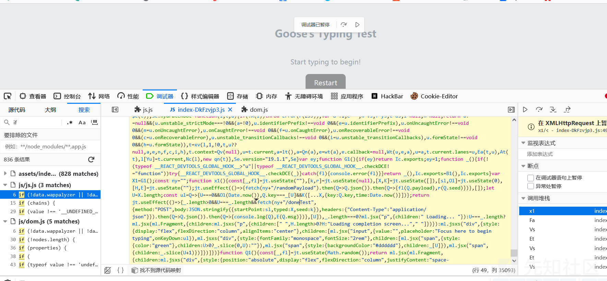
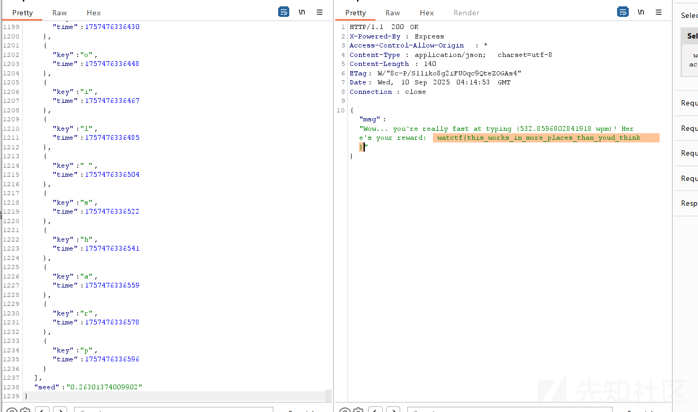
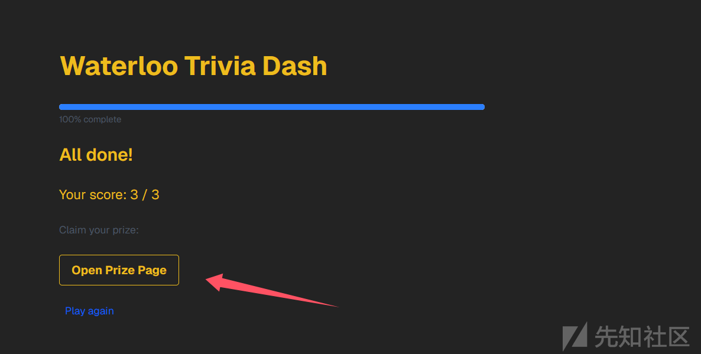
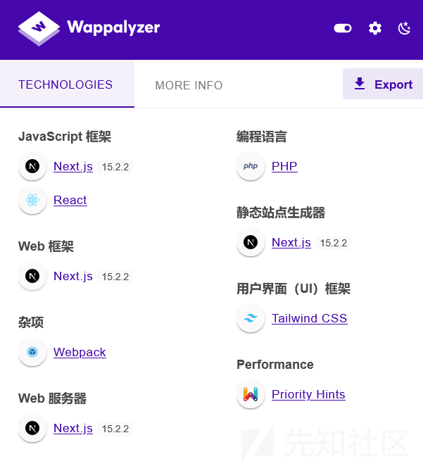
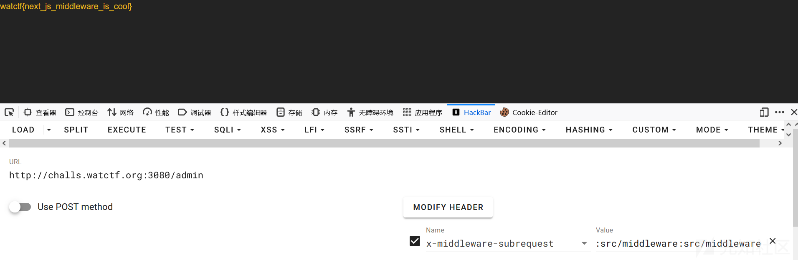

# 2025 WatCTF web 题解-先知社区

> **来源**: https://xz.aliyun.com/news/18868  
> **文章ID**: 18868

---

# gooses-typing-test



关键代码

> fetch(ny+"/doneTest",{method:"POST",body:JSON.stringify({startPoint:sl,typed:X,seed:k}),headers:{"Content-Type":"application/json"}}).then(Q=>Q.json()).then(Q=>{console.log(Q),E(Q.msg)})},[U]),\_.length===0?ml.jsx("p",{children:" Loading... "})

打完之后会发送请求判断速度是否超过500

数据格式特定，并且打字内容和seed要对得上，所以我们正常打字发送请求后抓包

获取正规的数据，再重新模拟数据



脚本如下

```
import json

# 原始数据文件
with open('typed_raw.json', 'r', encoding='utf-8') as f:
    data = json.load(f)

typed = data['typed']

# 计算总字符数
total_chars = len(typed)

# 假设目标 WPM，例如 500 WPM
target_wpm = 650

# 计算目标总时间（分钟），总时间 = (总字符数 / 5) / WPM
target_minutes = (total_chars / 5) / target_wpm
target_ms = target_minutes * 60 * 1000  # 转换成毫秒

# startPoint 不变，endTime = startPoint + target_ms
start_time = typed[0]['time']
end_time = start_time + target_ms

# 平均间隔时间
interval = (end_time - start_time) / (total_chars - 1)

# 生成新的时间戳列表
new_typed = []
for i, entry in enumerate(typed):
    new_entry = entry.copy()
    new_entry['time'] = int(start_time + i * interval)
    new_typed.append(new_entry)

# 更新 data
data['typed'] = new_typed

# 保存为新文件
with open('typed_fast.json', 'w', encoding='utf-8') as f:
    json.dump(data, f, ensure_ascii=False, indent=2)

print("✅ 已生成快速打字数据 typed_fast.json")

```

# Waterloo Trivia Dash

答完三题之后有一个超链接，但是点了没反应，我们复制链接发现是/admin



但是会 307 重定向到根目录。

经过目录扫描可以发现 /admin 有关的路由全是 307，而其他不存在的为 404。

这里肯定要想办法绕过重定向，我们看一下相关版本



Next.js版本>=15.0，<15.2.3，可以利用CVE-2025-29927来绕过重定向

这个原理大概就是Next.js 中间件在请求到达页面处理之前进行身份验证、授权、路径重写和安全头设置，为了防止中间件递归调用导致的无限循环，Next.js 引入了 `x-middleware-subrequest` 头部，用于标识内部子请求，**阻止中间件再次对自己发起递归调用 ，但是它的值基于中间件文件的路径，Next.js 会记录哪些中间件路径已经执行过，防止无限循环**，我们就利用这一点构造恶意请求

Next.js**只检查头是否存在，而不严格验证值是否合法**，我们就能自己设置 `x-middleware-subrequest`，从而伪装成内部请求，绕过中间件执行的授权逻辑

但是如何构造payload呢？

我们设置的值必须是**真实存在的中间件路径**才能达到我们预期的效果，根据约定，middleware文件的名称是middleware.ts，路径要么是在项目根路径，与pages或app目录同级别，要么是在/src目录下，即params.name的值或者是middleware，或者是src/middleware

简单来讲，默认中间件文件通常放在 `src/middleware.js` 或 `middleware.js`

我们pyload的组成也就是middleware和src/middleware

同时`x-middleware-subrequest`支持冒号`:`分隔的“路径链” ，多次重复 `src/middleware`达成“多次标记自己已经执行过”，从而确保原本的认证逻辑被跳过，就形成了伪子请求链

那么payload就明显了

> x-middleware-subrequest: middleware:middleware:middleware:middleware:middleware
>
> 或者
>
> x-middleware-subrequest: src/middleware:src/middleware:src/middleware:src/middleware:src/middleware


