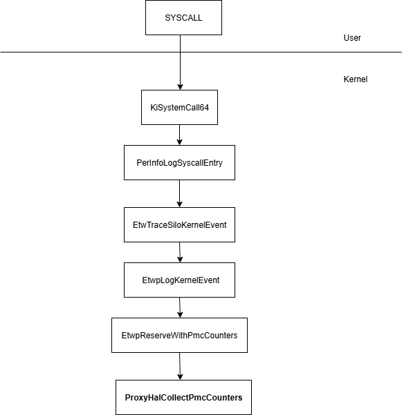
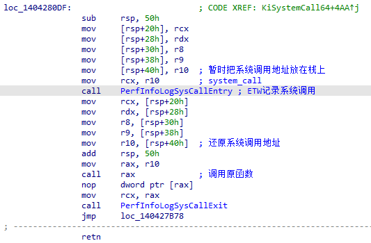
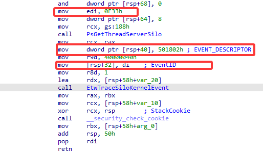
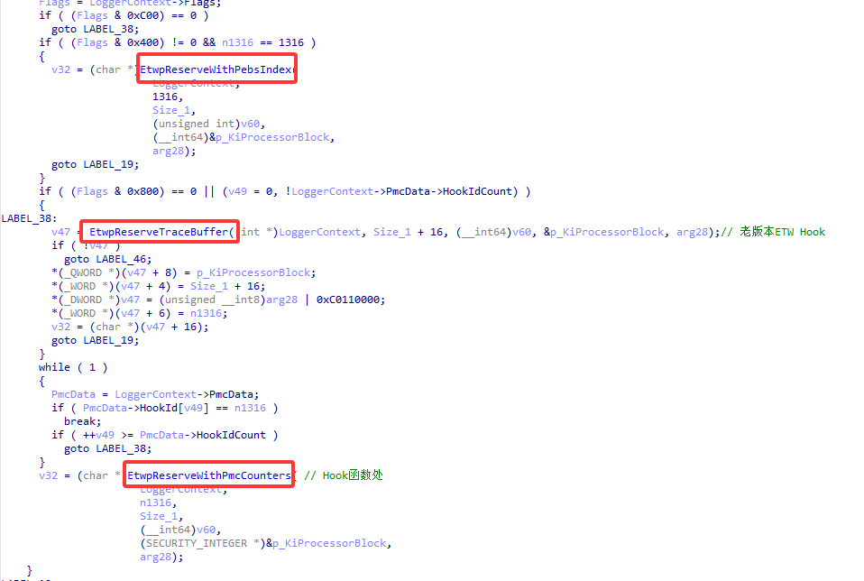
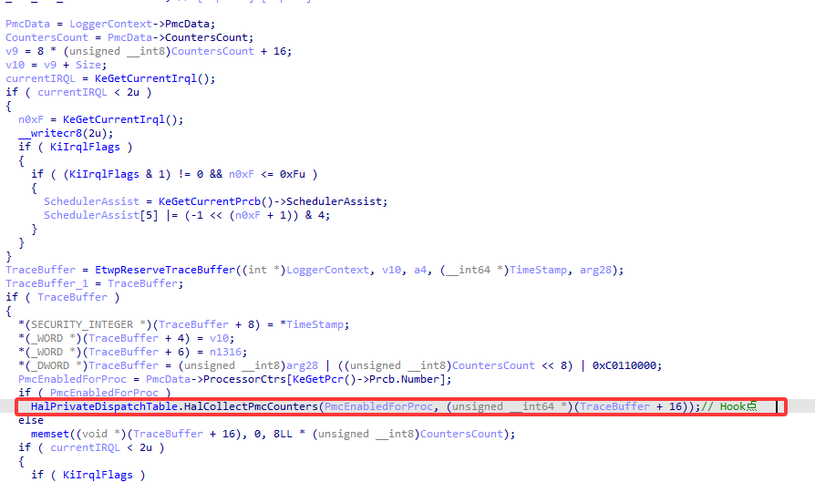
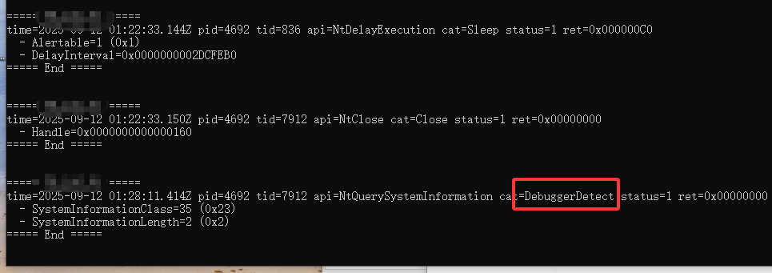

# 基于ETW Hook的内核级沙箱设计与实现-先知社区

> **来源**: https://xz.aliyun.com/news/18872  
> **文章ID**: 18872

---

## 前言

本文中的沙箱，均指一个受控、虚拟化的环境，专门用来自动运行、监控和分析可疑程序的行为。传统的沙箱根据监控、收集恶意软件行为的方式，可以分为两种模式：一种是基于**API Hook**的沙箱，如Cuckoo；一种是基于虚拟化技术(VT-x with EPT)的沙箱，如DrakVuf。

其中，Cuckoo沙箱通过Inject.exe启动样本并挂起，向其中注入monitor.dll对一百多个Native API做了Inline Hook，收集恶意软件的API的调用信息，再解析这些调用信息，打上对应的行为标签。

这样做的缺陷很显然：由于monitor.dll与恶意软件共存，再加上Inline Hook的痕迹过于明显，很容易被探测出监控环境的存在。并且，在Ring-3下的Hook能力是很有限的，像**ntdll重载、syscall**这些方法都能轻易规避Hook，使得沙箱跑不出任何行为。

因此，本文在Cuckoo沙箱工作原理的基础上进行拓展，从内核Hook的角度出发，设计一个更隐蔽、强大的沙箱（或者说是监控系统），以来减少安全分析员们的工作量。

## ETW Hook：核心原理

在64位Windows操作系统上，微软引入了Patch Guard对操作系统中易受攻击的结构、函数进行监控，常规的[SSDT Hook](%5B%E5%86%85%E6%A0%B8%E6%A8%A1%E5%BC%8F%20Rootkits%EF%BC%8C%E7%AC%AC%E4%B8%80%E9%83%A8%E5%88%86%20%7C%20SSDT%20%E9%92%A9%E5%AD%90%20%E2%80%A2%20Adlice%20%E8%BD%AF%E4%BB%B6%20---%20KernelMode%20Rootkits,%20Part%201%20%7C%20SSDT%20hooks%20%E2%80%A2%20Adlice%20Software%5D(https://www.adlice.com/kernelmode-rootkits-part-1-ssdt-hooks/))将会引发蓝屏。因此ETW Hook被提出，其核心原理就是利用ETW在遥测syscall时的**“漏洞”**劫持控制流实现Native API Hook。这一漏洞的成因是PG对一些内核函数指针表监控不严（通常在.data段中），我们可以替换某些指针实现Hook而不触发PG，整个调用链如下：



本文讲解的这个Hook点来自[Oxygen](%5B%5B%E5%8E%9F%E5%88%9B%5C%5DInfinityHook%20%E5%8F%AF%E5%85%BC%E5%AE%B9%E6%9C%80%E6%96%B0%E7%89%88windows-%E8%BD%AF%E4%BB%B6%E9%80%86%E5%90%91-%E7%9C%8B%E9%9B%AA%E8%AE%BA%E5%9D%9B-%E5%AE%89%E5%85%A8%E7%A4%BE%E5%8C%BA%7C%E9%9D%9E%E8%90%A5%E5%88%A9%E6%80%A7%E8%B4%A8%E6%8A%80%E6%9C%AF%E4%BA%A4%E6%B5%81%E7%A4%BE%E5%8C%BA%5D(https://bbs.kanxue.com/thread-281479.htm))以及[Daax](%5B%E3%80%8AFun%20with%20another%20PatchGuard-compliant%20Hook%20-%20Reverse%20Engineering%E3%80%8B%20---%20Fun%20with%20another%20PatchGuard-compliant%20Hook%20-%20Reverse%20Engineering%5D(https://revers.engineering/fun-with-pg-compliant-hook/))，向他们表示感谢！

在Ring-3调用系统API后，最终会通过syscall指令进入内核（一般来说已经不用调用门了）。首先进入的就是内核中的KiSystemCall64函数；在这里，如果开启了syscall Nt Kernel Logger，ETW-Ti就会记录这条系统调用信息，如下：



在ETW记录系统调用前，会把真实的函数地址暂存在栈上，调用完毕后恢复。这也就给了我们可乘之机，只要在PerfInfoLogSysCallEntry的调用链中寻到一处函数指针替换点，就可以**劫持控制流修改栈上暂存的函数地址**，从而实现Hook。

在PerfInfoLogSysCallEntry中同样保存了EventID和EVENT\_DESCRIPTOR在栈上：

F33:501802

将之作为辅助定位栈上函数地址的Magic Number

继续跟进到EtwpLogKernelEvent中，会发现一些有意思的函数：



根据ETW Logger的配置情况，上面的三个函数可能会被执行；最开始的替换点是在EtwpReserveTraceBuffer中的GetCpuClock，但这个函数在高版本Windows已被修复，不适合替换了，因此我们跟进EtwpReserveWithPmcCounters



这里暴露出一个函数指针的调用，这正是我们想要的，查阅HalPrivateDispatchTable的[结构](%5BVergilius%20Project%20%7C%20HAL_PRIVATE_DISPATCH%5D(https://www.vergiliusproject.com/kernels/x64/windows-11/21h2/HAL_PRIVATE_DISPATCH))，替换掉Table + 0x248处的函数指针即可接管控制流，此时在栈上搜索两个Magic Number去定位到系统调用的函数地址并替换就实现了Hook，如下：

```
//
//@brief 代理函数，劫持栈上的函数地址到自己的函数上，同时也是高频执行函数.
//
void ProxyEtwpReserveWithPmcCounters(PVOID Context, ULONGLONG TraceBuff) {
    USHORT Magic = 0xF33;//Magic 1
    ULONG Signate = 0x501802;//Magic 2
    ULONG Magic2 = 0x601802;
    #define INFINITYHOOK_MAGIC_501802 ((unsigned long)0x501802) //Win11 23606 以前系统特征码
    #define INFINITYHOOK_MAGIC_601802 ((unsigned long)0x601802) //Win11 23606 及以后系统的特征码
    #define INFINITYHOOK_MAGIC_F33 ((unsigned short)0xF33)
    PULONG RspPos = _AddressOfReturnAddress();
    PULONG RspLimit = __readgsqword(0x1a8);
    // KPCR->Pcrb.CurrentThread Type:_KTHREAD*
    ULONG64 currentThread = __readgsqword(0x188);// OFFSET_KPCR_CURRENT_THREAD
    ULONG systemCallIndex = *(ULONG*)(currentThread + 0x80);// OFFSET_KTHREAD_SYSTEM_CALL_NUMBER


    do {
        if (KeGetCurrentIrql() <= DISPATCH_LEVEL) {
            // 不接管内核调用
            if (ExGetPreviousMode() == KernelMode)
                return g_oriHalCollectPmcCounters(Context, TraceBuff);
            while (RspPos <= RspLimit)
            {
                if (*((PUSHORT)(RspPos)) == INFINITYHOOK_MAGIC_F33)
                {
                    // Win11 24H2兼容
                    if (RspPos[2] == INFINITYHOOK_MAGIC_501802 || RspPos[2] == INFINITYHOOK_MAGIC_601802)
                    {

                        for (; (ULONG64)RspPos <= (ULONG64)RspLimit; ++RspPos)
                        {
                            // 执行到这里则已经确认是SYSCALL的ETW记录，可以开始遍历栈
                            // 找在SSDT表范围内的地址，找到既是SYSCALL的地址


                            ULONG64* pllValue = (ULONG64*)RspPos;
                            if ((*pllValue >= PAGE_ALIGN(g_SystemCallTable) &&
                                 (*pllValue <= PAGE_ALIGN(g_SystemCallTable + PAGE_SIZE * 2))))
                            {

                                HANDLE pid = PsGetCurrentProcessId();

                                if (LogManagerIsTargetProcess(pid)) {
                                    // 此时IRQL == DISPATCH_LEVEL
                                    // 只有目标进程才Hook，其他进程正常放行
                                    ProcessSyscall(systemCallIndex, RspPos);
                                    return g_oriHalCollectPmcCounters(Context, TraceBuff);
                                }
                                else {
                                    return g_oriHalCollectPmcCounters(Context, TraceBuff);
                                }


                            }
                        }
                    }

                }
                ++RspPos;

            }
        }
    } while (FALSE);

    return g_oriHalCollectPmcCounters(Context, TraceBuff);
}
```

但此时离ETW Hook还差了一步，由于正常来说控制流不会走到Hook点，所以需要参考一些文档手动配置ETW Logger走到我们替换的地方。

## ETW Hook：合理的配置

离实现ETW Hook只剩一步，那就是配置ETW Logger使其正确执行到我们想要劫持的EtwpReserveWithPmcCounter，这分为两部分：

* 配置ETW NT Kernel Logger以及系统调用事件开启
* 配置Event Trace类使得控制流走到EtwpReserveWithPmcCounter

第一步不困难，CKCL\_TRACE\_PROPERTIES是一个相对公开的结构体：

```
//
//@brief ֹ开启Nt kernel logger etw
//
// 
NTSTATUS StartOrStopTrace(BOOLEAN control) {
    NTSTATUS status = STATUS_UNSUCCESSFUL;
    CKCL_TRACE_PROPERTIES* ckclProperty = 0;
    ULONG lengthReturned = 0;
    do {

        ckclProperty = ExAllocatePoolWithTag(NonPagedPool, PAGE_SIZE, POOL_TAG);
        if (!ckclProperty) {
            DbgPrintEx(77, 0, "Failed to allocate memory for ckcl property.
");
            status = STATUS_INSUFFICIENT_RESOURCES;
            break;
        }
        memset(ckclProperty, 0, PAGE_SIZE);
        UNICODE_STRING tmp = { 0 };
        RtlInitUnicodeString(&tmp, L"Circular Kernel Context Logger");
        ckclProperty->Wnode.BufferSize = PAGE_SIZE;
        ckclProperty->Wnode.Flags = WNODE_FLAG_TRACED_GUID;
        ckclProperty->ProviderName = tmp;
        ckclProperty->Wnode.Guid = CkclSessionGuid;
        ckclProperty->Wnode.ClientContext = 1;
        ckclProperty->BufferSize = sizeof(ULONG);
        ckclProperty->MinimumBuffers = ckclProperty->MaximumBuffers = 2;
        ckclProperty->LogFileMode = EVENT_TRACE_BUFFERING_MODE;

        status = ZwTraceControl(control ? EtwpStartTrace : EtwpStopTrace, ckclProperty, PAGE_SIZE, ckclProperty, PAGE_SIZE, &lengthReturned);
        // STATUS_OBJECT_NAME_COLLISION
        if (!NT_SUCCESS(status) && status != STATUS_OBJECT_NAME_COLLISION) {
            DbgPrintEx(77, 0, "Failed to enable kernel logger etw trace,status=%x", status);
            break;
        }
        if (control)
        {
            ckclProperty->EnableFlags = EVENT_TRACE_FLAG_SYSTEMCALL;

            status = ZwTraceControl(EtwpUpdateTrace, ckclProperty, PAGE_SIZE, ckclProperty, PAGE_SIZE, &lengthReturned);
            if (!NT_SUCCESS(status))
            {
                DbgPrintEx(77, 0, "Failed to enable syscall etw, errcode=%x", status);
                StartOrStopTrace(FALSE);
                break;
            }
        }
    } while (FALSE);
    if (ckclProperty)
        ExFreePool(ckclProperty);
    return status;
}
```

对于第二步，由于没有公开的结构文档，所以需要自己配置相关的内容，从上面的代码中抠出条件：

```
Flags & 0x800 && 
    LoggerContext->PmcData->HookIdCount != 0 && 
    PmcData->HookId[index] == HookID
```

这里的Flags是这样一个Union Struct：

```
union
{
    ULONG Flags;                                                        //0x330
    struct
    {
        ULONG Persistent:1;                                             //0x330
        ULONG AutoLogger:1;                                             //0x330
        ULONG FsReady:1;                                                //0x330
        ULONG RealTime:1;                                               //0x330
        ULONG Wow:1;                                                    //0x330
        ULONG KernelTrace:1;                                            //0x330
        ULONG NoMoreEnable:1;                                           //0x330
        ULONG StackTracing:1;                                           //0x330
        ULONG ErrorLogged:1;                                            //0x330
        ULONG RealtimeLoggerContextFreed:1;                             //0x330
        ULONG PebsTracing:1;                                            //0x330
        ULONG PmcCounters:1;  // 我们关注的位                                     
        ULONG PageAlignBuffers:1;                                       //0x330
        ULONG StackLookasideListAllocated:1;                            //0x330
        ULONG SecurityTrace:1;                                          //0x330
        ULONG LastBranchTracing:1;                                      //0x330
        ULONG SystemLoggerIndex:8;                                      //0x330
        ULONG StackCaching:1;                                           //0x330
        ULONG ProviderTracking:1;                                       //0x330
        ULONG ProcessorTrace:1;                                         //0x330
        ULONG QpcDeltaTracking:1;                                       //0x330
        ULONG MarkerBufferSaved:1;                                      //0x330
        ULONG LargeMdlPages:1;                                          //0x330
        ULONG ExcludeKernelStack:1;                                     //0x330
        ULONG BootLogger:1;                                             //0x330
    };
};
```

在[这篇文档中](%5B%E4%BA%8B%E4%BB%B6%E8%B7%9F%E8%B8%AA%E4%BF%A1%E6%81%AF%E7%B1%BB%20---%20EVENT_TRACE_INFORMATION_CLASS%5D(https://www.geoffchappell.com/studies/windows/km/ntoskrnl/inc/api/ntetw/event_trace_information_class.htm))告诉我们，需要调用NtSetThreadInformation来设置Flags以及HookID。


我们跟进NtSetThreadInformation -> EtwSetPerformanceTraceInformation去找到具体的内容


对照上面的控制流条件以及相关配置文档，需要进行两步操作：

* 调用ZwSetSystemInformation分配一个PMC Profile Source，将Flags.PmcCounters置位
* 调用ZwSetSystemInfomration设置HookId为0xF33

参考如下代码：

```
//
//@brief 开启PMC计数器 PerformanceCounter
//
NTSTATUS OpenPmcCounter() {
    NTSTATUS status = STATUS_SUCCESS;
    PEVENT_TRACE_PROFILE_COUNTER_INFORMATION countInfo = 0;
    PEVENT_TRACE_SYSTEM_EVENT_INFORMATION eventInfo = 0;
    if (!g_isActive)return STATUS_UNSUCCESSFUL;
    do {
        countInfo = ExAllocatePoolWithTag(NonPagedPool, sizeof(EVENT_TRACE_PROFILE_COUNTER_INFORMATION),POOL_TAG);
        if (!countInfo) {
            DbgPrintEx(77, 0, "Failed to allocate memory for PMC count.
");
            status = STATUS_INSUFFICIENT_RESOURCES;
            break;
        }
        countInfo->EventTraceInformationClass = EventTraceProfileCounterListInformation;
        countInfo->TraceHandle = 2;
        countInfo->ProfileSource[0] = 1;
        //  STATUS_WMI_ALREADY_ENABLED
        // 第一步
        status = ZwSetSystemInformation(SystemPerformanceTraceInformation, countInfo, sizeof(EVENT_TRACE_PROFILE_COUNTER_INFORMATION));
        if (!NT_SUCCESS(status) && status != STATUS_WMI_ALREADY_ENABLED) {
            DbgPrintEx(77, 0, "Failed to configure PMC counter.status=%x
", status);
            break;
        }

        eventInfo = ExAllocatePoolWithTag(NonPagedPool,  sizeof(EVENT_TRACE_SYSTEM_EVENT_INFORMATION),POOL_TAG);
        if (!eventInfo) {
            DbgPrintEx(77, 0, "Failed to allocate memory for event info.
");
            status = STATUS_INSUFFICIENT_RESOURCES;
            break;
        }

        eventInfo->EventTraceInformationClass = EventTraceProfileEventListInformation;
        eventInfo->TraceHandle = 2;
        eventInfo->HookId[0] = SyscallHookId;// 0xF33
        // 第二步
        status = ZwSetSystemInformation(SystemPerformanceTraceInformation, eventInfo, sizeof(EVENT_TRACE_SYSTEM_EVENT_INFORMATION));
        if (!NT_SUCCESS(status))
        {
            DbgPrintEx(77,0,"failed to configure pmc event, status=%x", status);
            break;
        }

    } while (FALSE);
    if (countInfo)ExFreePool(countInfo);
    if (eventInfo)ExFreePool(eventInfo);
    if (status == STATUS_WMI_ALREADY_ENABLED)return STATUS_SUCCESS;
    return status;
}
```

## 打造一个沙箱

可以说，ETW Hook是一个比较完美的沙箱监控手段。因为其只接管应用态的系统调用，不需要特别过滤内核调用；同时其工作环境皆在内核之中，不会对应用态程序暴露出Hook特征。

因此我们可以参照Cuckoo，Hook一些常见的NT API来收集恶意软件的行为，然后将之传入我们的3环程序解析成易处理的JSON或者BSON格式的数据，再手写一个分析模块来自动化研究其恶意行为。同时由于我们的Hook运行在调用链的最底层，还可以用该Hook去遥测恶意程序的堆栈信息，检测如Hell's Gate及其变种的Ring-3脱钩手段。

以下是一个简单的Demo，首先考虑使用MiniFilter框架将收集的调用信息作为日志传入Ring-3

```
// MiniFilter发送数据到 3 环
NTSTATUS SendToUser(PVOID buffer, ULONG bufSize) {
    if (!g_ClientPort) return STATUS_INVALID_DEVICE_STATE;

    LARGE_INTEGER timeout;
    timeout.QuadPart = -10 * 1000 * 1000;  // 1 秒 超时时间

    NTSTATUS status = FltSendMessage(
        g_FilterHandle,
        &g_ClientPort,
        buffer,
        bufSize,
        NULL,
        NULL,
        &timeout);

    if (!NT_SUCCESS(status)) {
        DbgPrintEx(77, 0, "[%s] failed: 0x%X
", __FUNCTION__,status);
    }
    return status;
}
```

比如想要监控跨进程的线程创建，可以这么写Hook函数：

```
NTSTATUS DetourNtCreateThreadEx(
    _Out_ PHANDLE ThreadHandle,
    _In_ ACCESS_MASK DesiredAccess,
    _In_opt_ POBJECT_ATTRIBUTES ObjectAttributes,
    _In_ HANDLE ProcessHandle,
    _In_ PVOID StartRoutine,
    _In_opt_ PVOID Argument,
    _In_ ULONG CreateFlags,
    _In_ ULONG_PTR ZeroBits,
    _In_opt_ SIZE_T StackSize,
    _In_opt_ SIZE_T MaximumStackSize,
    _In_opt_ PVOID AttributeList
) {

    NTSTATUS status = STATUS_SUCCESS;
    RETURN_IF_NOT_PASSIVE(g_NtCreateThreadEx(ThreadHandle, DesiredAccess, ObjectAttributes, ProcessHandle, StartRoutine, Argument, CreateFlags, ZeroBits, StackSize, MaximumStackSize, AttributeList));

    StackDetect();
    status = g_NtCreateThreadEx(ThreadHandle, DesiredAccess, ObjectAttributes, ProcessHandle, StartRoutine, Argument, CreateFlags, ZeroBits, StackSize, MaximumStackSize, AttributeList);

    HANDLE targetPid = NULL;
    // cross-process
    if (NT_SUCCESS(status) && !_IsCurrentProcessHandle(ProcessHandle) && NT_SUCCESS(_GetPidFromProcessHandle(ProcessHandle, &targetPid)) && targetPid != PsGetCurrentProcessId()) {
        (VOID)LogManagerSetTargetProcess(targetPid, TRUE);
        SYSCALL_PARAMETER params[MAX_SYSCALL_PARAMETERS];
        RtlZeroMemory(params, sizeof(params));
        _FillParamHandle(L"TargetPid", targetPid, &params[0]);
        _FillParamPtr(L"StartRoutine", StartRoutine, &params[1]);
        _FillParamUlong(L"CreateFlags", CreateFlags, &params[2]);
        _FillParamImageName(L"ImageName", targetPid, &params[3]);

        LogManagerSendLog(PsGetCurrentProcessId(), PsGetCurrentThreadId(), L"NtCreateThreadEx", L"RemoteThread", status, 4, params);
    }
    else {
        #define THREAD_CREATE_FLAGS_HIDE_FROM_DEBUGGER 0x4
        if(CreateFlags == THREAD_CREATE_FLAGS_HIDE_FROM_DEBUGGER)
            LogManagerSendLog(PsGetCurrentProcessId(), PsGetCurrentThreadId(), L"NtCreateThreadEx", L"DetectDebugger", status, 0, NULL);
    }
    InterlockedDecrement(&gHooksActive);
    return status;
}
```

普通的ETW Hook是全局的Hook，即所有的应用态系统调用都会被我们接管。因此还需要维护一个ProcessList记录样本的PID；对于跨进程的操作，比如有的样本注入shellcode至白进程，或者释放了新进程并拉起，则需要将新进程的PID也加入到ProcessList中，避免遗漏行为。上文中的LogManagerSetTargetProcess正是在做这件事。

## 沙箱拓展：堆栈检测

上文中提到的Hell's Gate指的是一种构造gadget直接调用syscall指令进入内核的手法，能够做到规避3环的挂钩。但这样做导致其堆栈不正常，呈现出malware.exe -> ntoskrnl.exe这样的调用链，因此我们可以在Hook开头加一个堆栈检测，检测其返回地址（存放在TrapFrame中）是否位于正常的模块（如ntdll.dll），否则判为一次恶意调用。

```
// 直接系统调用检测(SYSCALL)
for (int i = 0; i < MODULE_NUM; i++) {
    if (rip >= g_UserModule[i].BaseAddress
        && rip <= (ULONG64)g_UserModule[i].BaseAddress + g_UserModule[i].Size)
    {
        abnormalSyscall = FALSE;
        // ntdll.dll需特殊判定，对抗间接系统调用 - 检测点1
        UNICODE_STRING tmp = { 0 };
        RtlInitUnicodeString(&tmp, L"ntdll.dll");
        if (!RtlCompareUnicodeString(&g_UserModule[i].ModuleName, &tmp, TRUE))
            abnormalSyscall = SpecialDetectSyscall(rip, systemCallIndex, TRUE);
        goto log;

    }
    log:

    if (abnormalSyscall) {
        SYSCALL_PARAMETER params[1];
        params[0].Type = 2;
        RtlStringCchCopyW(params[0].Name, ARRAYSIZE(params[0].Name), L"name");
        RtlStringCchCopyW((WCHAR*)params[0].Data, ARRAYSIZE(params[0].Data) / sizeof(WCHAR), g_SyscallTable[systemCallIndex].Name);
        params[0].Size = (ULONG)(wcslen(g_SyscallTable[systemCallIndex].Name) * sizeof(WCHAR));
        LogManagerSendLog(PsGetCurrentProcessId(), PsGetCurrentThreadId(), L"Syscall", L"Abnormal Syscall", 0, 1, params);
    }
```

从对抗的层面来讲这种检测是有欠缺的，因为现在武器化的SYSCALL通常是间接系统调用，调用链通常为malware.exe -> ntdll.dll -> ntoskrnl.exe，或者更加合法的malware.exe -> kernel32.dll -> ntdll.dll -> ntoskrnl.exe ；更高级别的检测就是检测跳转处是否为正常的CALL，还是恶意软件自己维护的跳板。

堆栈数据是EDR内存扫描的一个重要指标，但对于沙箱来说，跑出更多的行为才是最重要的，因此这里就不展开讨论了。

## 演示

演示的样本为某厂攻击队的样本，采用了间接系统调用的API执行手段，普通的3环Hook无法捕捉到调用



我仅实现了自动化拉起样本、传递调用数据等功能；更进一步地，可以考虑实现自动化重启虚拟机、分析调用数据并打行为标签、自动提取C2（可以通过网络过滤驱动实现）。

## 参考文章及项目

[1] [[原创]InfinityHook 可兼容最新版windows-软件逆向-看雪论坛-安全社区|非营利性质技术交流社区](https://bbs.kanxue.com/thread-281479.htm)

[2] [《Fun with another PatchGuard-compliant Hook - Reverse Engineering》 --- Fun with another PatchGuard-compliant Hook - Reverse Engineering](https://revers.engineering/fun-with-pg-compliant-hook/)

[3] <https://github.com/zhutingxf/InfinityHookPro>

[4] [https://github.com/Oxygen1a1/InfinityHook\_latest](https://bbs.kanxue.com/elink@610K9s2c8@1M7s2y4Q4x3@1q4Q4x3V1k6Q4x3V1k6Y4K9i4c8Z5N6h3u0Q4x3X3g2U0L8$3#2Q4x3V1k6a6P5s2W2Y4k6h3%5E5I4j5e0q4Q4x3V1k6u0L8X3k6A6L8X3W2@1P5f1S2G2L8$3E0Q4y4h3k6D9j5i4c8W2M7K7%60.)
