# 大语言模型隐私保护技术全解析-先知社区

> **来源**: https://xz.aliyun.com/news/18876  
> **文章ID**: 18876

---

# 前言

近年来，以 ChatGPT、Bard 等为代表的大语言模型（LLM）取得了突破性进展，展现出在自然语言理解、生成、代码编写及复杂推理等任务上的卓越能力。这些模型已广泛渗透至科研、商业及日常生活的诸多领域，成为推动人工智能发展的重要引擎。  
然而，LLM 的强大能力与其对海量数据的依赖密不可分。其训练过程通常需要利用涵盖广泛来源的庞大数据集，这不可避免地引发了严峻的数据隐私挑战。  
在之前的文章中我们已经提到，训练数据中可能包含个人身份信息（PII）、商业机密或其他敏感内容，存在被模型“记忆”并在后续交互中无意泄露的风险。此外，用户与模型交互过程中产生的输入数据，同样面临潜在的隐私暴露问题。成员推断、属性推断等攻击手段的出现，进一步加剧了对 LLM 隐私安全的重视。  
我们在本文中主要基于之前调研的典型技术，梳理主流的隐私保护技术。本文省去了公式描述，主要关注核心思想，并且给出了代码说明（代码仅做示例用），最后一章节其实是最重要的，就是几乎所有的隐私保护技术都会对性能等方面带来权衡，而这常常是大家会忽视的。

# 数据预处理与脱敏

## 匿名化与假名化

​

在为大型模型准备训练数据时，首要也是最关键的一环是妥善处理那些能够直接或间接指向特定个人的敏感信息。这通常涉及两种核心策略：匿名化和假名化。进行匿名化处理时，我们的目标是彻底移除或不可逆地改变数据中所有的个人身份标识符（PII），例如姓名、地址、电话号码等，使得数据使用者无法再通过任何方式将数据与原始个体关联起来。这就像是把所有人的名字都抹掉，只留下他们做了什么事。  
在示例代码中，用正则表达式来识别并替换数据中的姓名、地址和电话号码。  
正则表达式 ：

* \b[A-Z][a-z]*\s[A-Z][a-z]*\b ：匹配姓名（如 "John Doe"）。
* \d+\s[A-Za-z]+\s[A-Za-z]+ ：匹配地址（如 "123 Main Street"）。
* ?\d[\d -]{8,12}\d ：匹配电话号码（如 "+1-555-123-4567"）。
* 替换结果 ：所有匹配的PII将被替换为 [REDACTED\_NAME] 、 [REDACTED\_ADDRESS] 和 [REDACTED\_PHONE]

​

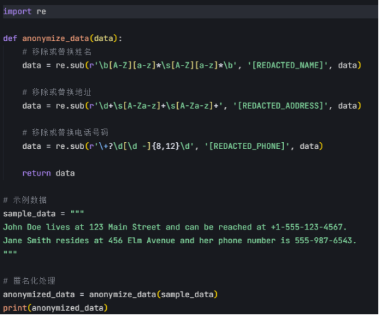

然而，在很多场景下，完全抹去身份信息可能会使得数据失去其分析价值。这时，假名化就显得更为实用。假名化并非移除标识符，而是用一个人工生成、不具实际意义的代号或假名来替换真实的身份信息。比如，把“张三”替换成“用户A001”。这样做的好处在于，模型在训练时仍然能够区分不同的个体（通过他们的代号），分析个体行为模式或群体特征，但却不知道这些代号背后真实的身份是谁。这种方法在保留数据结构和分析潜力的同时，显著降低了直接泄露个人身份的风险。

在示例代码中-seudonymize\_data函数使用正则表达式识别姓名，并用唯一的代号替换。uuid4().hex[:4].upper()生成一个4位的唯一代号（如 "用户A001"）。

pseudonym\_map用于存储真实姓名与假名的映射关系，确保同一姓名始终映射到同一个假名。

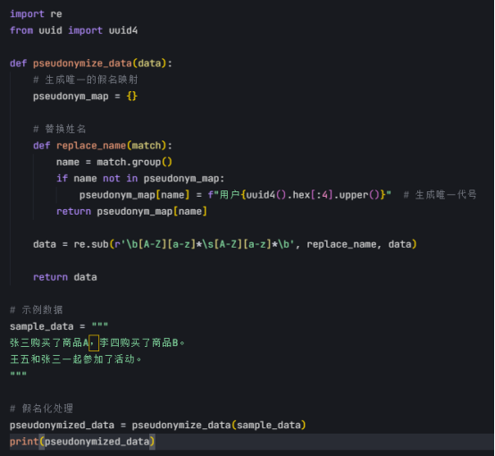

尽管如此，需要清醒地认识到，无论是匿名化还是假名化，都存在被“重识别”的潜在风险，尤其是在数据与其他公开信息结合时，如何平衡隐私保护与数据效用始终是一个复杂的挑战。

​

## 降低数据粒度

除了直接的身份标识符，数据中的其他属性，即使本身不直接暴露身份，当其粒度过细或组合起来时，也可能具有很强的识别性。

为了应对这种风险，数据泛化和抑制成为了重要的补充手段。数据泛化是指降低数据属性的精细程度，用更宽泛的类别或范围来代替具体的精确值。例如，将具体的年龄“35岁”泛化为“30-40岁”的年龄段，将详细的邮政编码泛化为更大的区域编码。这种处理方式减少了特定值与个体的唯一关联性，使得单凭这些泛化后的属性难以准确锁定某个人。

在示例代码中展示了数据泛化，包含两个函数：

1. generalize\_age(age) ：将具体年龄转换为年龄段

2. generalize\_zipcode(zipcode) ：将详细邮政编码转换为更大的区域编码

​

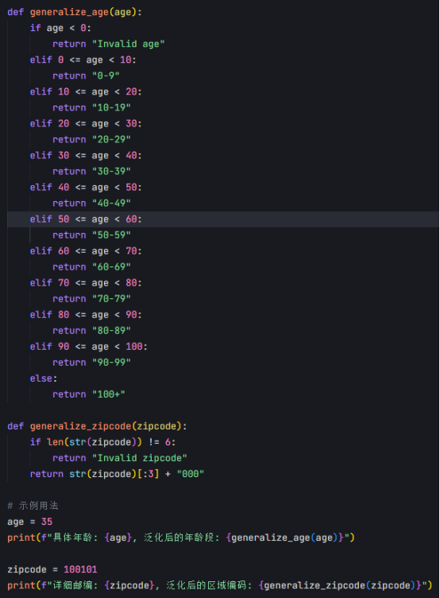

与泛化不同，数据抑制则更为直接，它涉及在数据中完全移除或隐藏那些特别敏感、出现频率极低（可能指向少数特定个体）或者组合起来极具识别性的属性值。比如，如果某个数据集里只有极少数人拥有某种非常罕见的职业或疾病，为了保护这部分人的隐私，这些特定的职业或疾病属性值可能会被直接删除或标记为缺失。

在示例代码中通过标记[SUPPRESSED] 来抑制敏感数据，适用于处理包含罕见职业或疾病等敏感信息的数据集

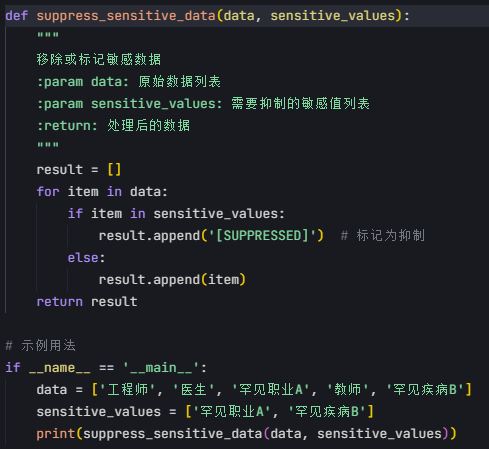

泛化和抑制都是通过牺牲一部分数据精度或完整性来实现隐私保护，这无疑会对模型的训练效果产生一定影响，可能导致模型对细节的捕捉能力下降。因此，在应用这些技术时，需要仔细权衡隐私需求与模型的性能目标，寻找一个最优的平衡点。

​

​

# 差分隐私（Differential Privacy, DP）：

## 核心思想

在训练和部署大型模型的过程中，海量数据是其智能的基石，但也带来了前所未有的隐私挑战。个体用户的行为、偏好甚至敏感信息，都有可能在不经意间被模型“学习”并潜在地泄露。为了应对这一风险，差分隐私（Differential Privacy, DP）应运而生，它并非一种加密技术，而是一种提供强有力隐私保护的统计学框架。

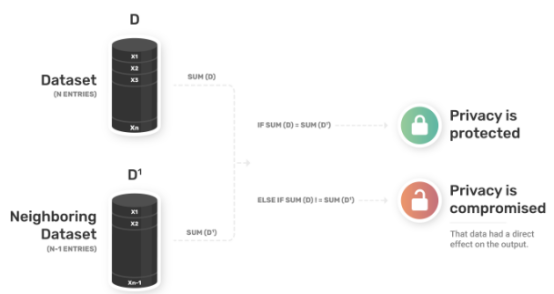

差分隐私的核心理念在于“不可区分性”。想象一下，我们有一个包含许多用户数据的数据集。差分隐私的目标是，在对这个数据集进行任何分析（比如计算统计数据或训练模型）时，加入或移除其中任何一个用户的数据，对最终输出结果的影响都应该是极其微小、在统计上难以察觉的。为了实现这一点，差分隐私的核心操作是在数据处理流程中引入精心设计的随机噪声。这种噪声的大小需要精确控制，既要足够大以掩盖个体数据的贡献，又要足够小以保证分析结果的整体可用性。

这种方法提供了一种数学上可证明的、与攻击者能力无关的隐私保证。无论攻击者拥有多少背景知识或计算资源，只要差分隐私机制被正确实施，他们就无法从公开的、经过处理的结果中确信地推断出任何关于特定个体的信息。这为在敏感数据集上进行分析和模型训练提供了一种原则性的安全保障，让我们在利用数据价值的同时，能够量化并控制隐私泄露的风险。

​

## 技术实现

将差分隐私的理论应用于实际的大型模型场景，需要具体的工程技术和策略。其中，差分隐私随机梯度下降（DP-SGD）是模型训练阶段最常用的技术之一。在传统的梯度下降优化过程中，每一步计算的梯度都直接反映了训练数据的信息。DP-SGD通过在计算梯度后对其进行裁剪（限制其大小）并添加高斯噪声，有效地模糊了单个训练样本对模型参数更新的具体影响，从而在训练过程中就嵌入了隐私保护。

在示例代码中包含了一个简单的神经网络模型，并在梯度计算后进行了裁剪和添加高斯噪声的操作，实现了差分隐私保护。

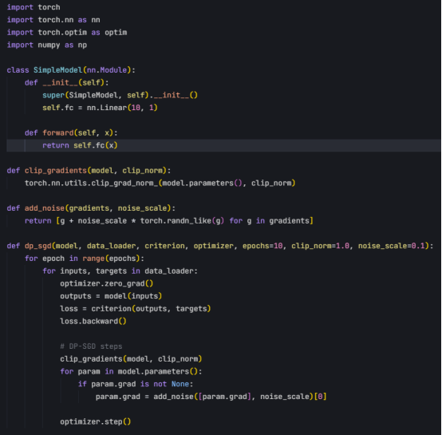

除了在训练端进行保护，差分隐私也可以应用于模型的输出端，即所谓的“输出扰动”。当模型需要发布统计结果、或者对外提供查询接口时，可以直接对最终的输出值（例如预测概率、统计计数）添加满足差分隐私定义的噪声。这种方式相对简单，适用于保护聚合查询结果或模型预测本身所可能泄露的训练集信息。

示例代码中包含以下关键功能：

1. 实现了一个DifferentialPrivacy类，封装了差分隐私的核心逻辑

2. 提供了add\_noise方法，用于对输出值添加拉普拉斯噪声

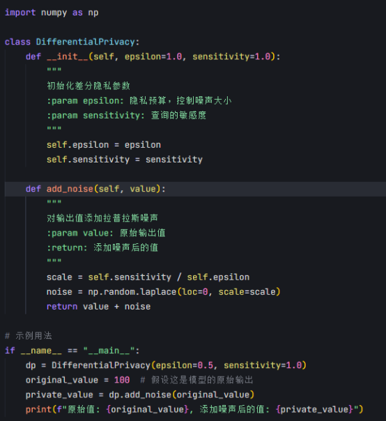

在部署差分隐私时，还需要考虑噪声添加的位置，这引出了本地差分隐私（Local DP）和中心化差分隐私（Centralized DP）两种主要模式。本地模式下，每个用户在自己的数据发送给数据收集方之前就进行加噪处理，用户无需信任任何第三方，隐私保护最强，但通常需要添加更多的噪声，对数据效用的影响也更大。中心化模式则依赖一个可信的数据管理者，它收集原始数据后，在进行聚合分析或模型训练时统一添加噪声。这种方式通常能在相同的隐私保护水平下，保留更高的数据效用，但前提是数据管理者必须是完全可信的。

在示例代码中含两个类：

1. LocalDifferentialPrivacy 类演示了本地差分隐私的实现，用户在发送数据前自行添加拉普拉斯噪声。

2. CentralizedDifferentialPrivacy 类展示了中心化差分隐私的实现，数据管理者在聚合时统一添加噪声。

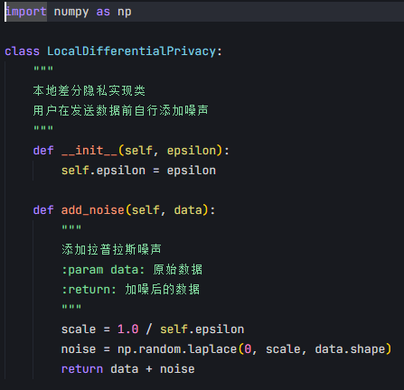

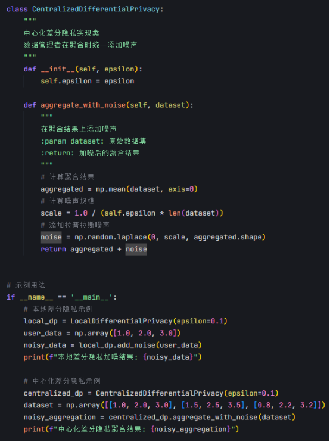

然而，差分隐私的应用并非没有挑战。最核心的权衡在于隐私保护强度与模型（或数据分析结果）的效用。添加的噪声越多，隐私保护水平越高（通常用隐私预算ε 来衡量，ε 越小保护越强），但同时也会降低数据的精度和模型的性能（如准确率）。如何在具体的应用场景中，根据风险承受能力和任务需求，选择合适的差分隐私技术、设定恰当的隐私预算，并优化算法以尽可能减少对模型效用的影响，是实践中必须仔细考量的关键问题。

​

​

​

# 联邦学习（Federated Learning, FL）：

## 核心思想

训练强大的大型模型往往需要丰富多样的数据，但将来自不同用户或机构的数据集中存储，不仅面临巨大的隐私合规压力，也可能因数据主权、传输成本等问题而难以实现。联邦学习提供了一种创新的解决方案，它颠覆了传统的数据集中式训练模式。

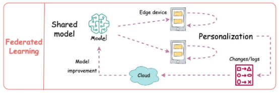

其核心思想可以概括为“数据不动，模型动”。在这个框架下，原始数据永远不会离开其产生的地方，例如用户的个人设备或机构的本地服务器。取而代之的是，中央服务器将初始模型或当前版本的模型分发给选定的参与方（如大量手机用户或几家合作医院）。这些参与方利用自己本地的数据对模型进行训练，计算出模型的改进方向或参数更新量（例如梯度）。关键在于，这个训练过程完全在本地进行，敏感的原始数据从未暴露或传输。训练完成后，参与方仅将计算出的模型更新量（而非原始数据）发送回中央服务器。

中央服务器的角色是协调者，它收集来自各个参与方的模型更新，并运用特定的聚合算法（如简单的平均）将这些更新融合，用以改进全局模型。然后，这个更新后的全局模型又可以被分发出去，开始下一轮的迭代训练。这种分布式的协作训练方式，在不直接访问原始数据的前提下，使得模型能够从广泛分布的数据中学习，极大地降低了因数据集中化带来的隐私风险。

## 技术实现

基于上述思想，联邦学习在实际应用中依赖一系列具体技术来实现隐私保护和模型训练的目标。其中，最核心的实现方式是分布式模型训练与更新聚合。

在这一过程中，每个参与训练的设备首先基于本地数据对模型进行优化，计算出模型参数的更新信息（如梯度的变化）。随后，这些更新信息被上传至中央服务器，服务器通过加权平均或其他聚合方法，将来自所有设备的更新信息整合为一个全局模型更新，从而完成一次训练迭代。在这一过程中，原始数据始终保留在本地设备上，仅有模型更新信息在设备与服务器之间传输。

在示例代码中包括：

1. 本地模型优化：通过 client\_update 方法计算本地梯度更新

2. 更新信息上传：将本地梯度更新返回给中央服务器

3. 全局模型更新：通过 aggregate\_updates 方法对所有客户端的更新进行加权平均

这演示了如何在保护隐私的同时进行分布式训练，原始数据始终保留在本地设备，仅传输模型更新信息。

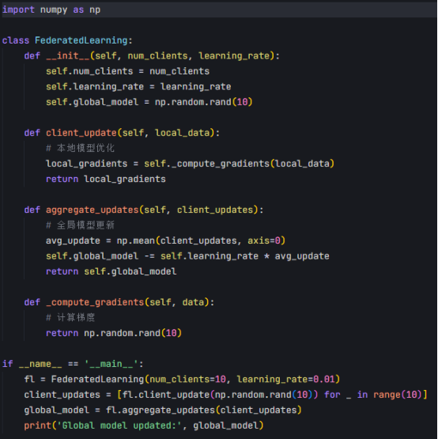

为了进一步增强隐私保护，联邦学习通常会结合一些专门的安全技术。其中，一种重要的技术是通过加密手段确保服务器无法直接获取单个设备的模型更新信息。

具体而言，可以利用安全多方计算等方法，在聚合模型更新之前对每个设备的更新信息进行加密，使得服务器只能看到加密后的聚合结果，而无法访问任何单个设备的具体贡献。这种技术能够在不牺牲模型训练效果的前提下，进一步降低隐私泄露的风险，特别适用于参与方互不信任的场景，例如跨机构的联合建模。

此外，为了在更强的隐私保护需求下运行，联邦学习还可以与其他隐私保护技术相结合。例如，可以在模型更新过程中引入随机扰动，使得单个设备的更新信息在统计意义上难以被区分。这种方式能够在保护个体数据的同时，增强整个系统的隐私保障能力。

然而，这些技术的应用也带来了一些挑战，例如计算和通信开销的增加。加密和扰动操作可能会显著提高设备的计算负担，同时也可能增加设备与服务器之间的通信成本。因此，在实际部署联邦学习系统时，需要根据具体场景的需求，合理选择和优化这些技术，以在隐私保护、模型性能和系统效率之间找到平衡点。

​

​

# 同态加密（Homomorphic Encryption, HE）：

## 核心思想

在涉及敏感数据的大模型训练和推理过程中，如何在保护数据隐私的同时实现有效计算是一个关键问题。一种被广泛研究的隐私保护方法，其核心思想是允许在加密后的数据上直接进行计算，而计算得到的结果在解密后，与在未加密的明文数据上进行相同计算所得到的结果完全一致。这种方法的核心优势在于，数据在整个计算过程中始终保持加密状态，无需在任何阶段解密为明文，从而从根本上避免了数据泄露的风险。

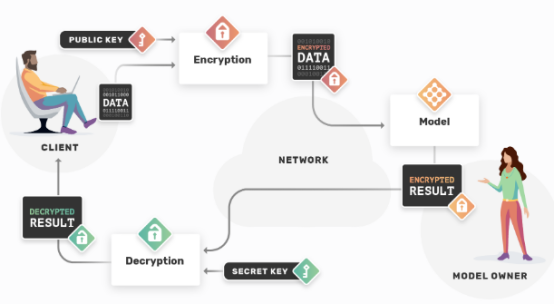

这种思想的意义在于，它将传统的“先解密再计算”模式转变为“直接在密文上计算”，为隐私保护提供了一种全新的范式。通过这种方式，数据的拥有者可以将加密后的数据交给第三方（如云服务器）进行处理，而无需担心数据内容被第三方获取。这种方法特别适用于数据敏感性极高的场景，例如医疗数据的分析、金融交易的处理等。通过数学理论的支持，这种方法能够提供强有力的安全保障，使得即使攻击者截获了加密数据或计算过程中的中间结果，也无法推导出原始数据的内容。

​

## 技术实现

基于上述思想，同态加密在实际应用中依赖一系列具体技术来实现隐私保护和计算目标。其实现方式的核心在于设计特殊的加密算法，使得加密后的数据在数学上支持特定的运算操作（如加法、乘法等），并且这些操作的结果在解密后与明文上的运算结果一致。根据支持的运算类型，这种技术可以分为不同的类别：有些技术仅支持简单的加法或乘法运算，而更高级的技术则能够支持复杂的函数计算。无论采用哪种类别，其核心目标都是确保数据在加密状态下能够被直接用于计算，而无需在计算过程中解密。

在示例代码中包含以下功能：

1. 使用Paillier库生成公钥和私钥

2. 实现了加密和解密函数

3. 演示了同态加法和乘法运算

4. 验证了加密运算结果与明文运算结果的一致性

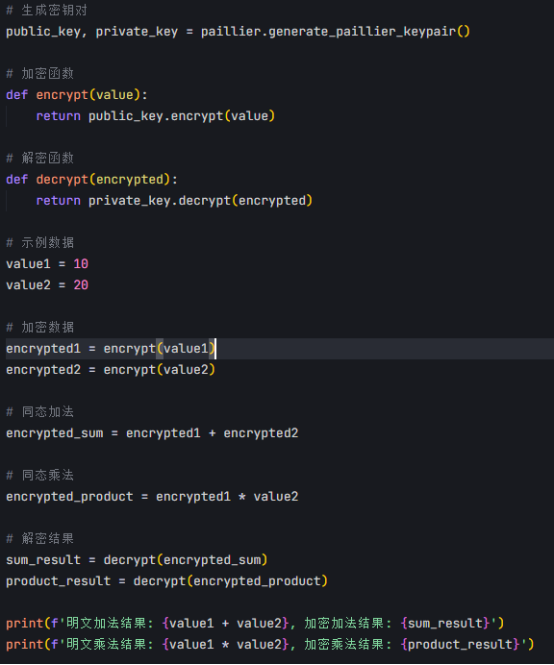

在实际应用中，这种技术在大模型的隐私保护中具有一定的潜力，尤其是在模型推理阶段。例如，在医疗领域，患者的敏感数据可以被加密后上传至云端服务器，服务器在加密数据上直接运行模型进行诊断预测，并将加密的预测结果返回给用户，用户再通过解密得到最终结果。在这一过程中，服务器始终无法访问明文数据，从而有效保护了患者的隐私。类似地，在金融领域，这种技术可以用于在加密的交易数据上进行风险评估，而无需暴露用户的具体交易信息。

​

然而，这种技术在实际应用中也面临一些显著的挑战。首先，计算开销是其主要瓶颈。由于加密算法的复杂性以及密文计算的特殊要求，这种技术在计算效率上远低于传统的明文计算，尤其是在需要处理大规模数据或复杂模型时，计算资源的消耗可能达到不可接受的程度。因此，目前这种技术在大规模模型训练中的应用受到较大限制，而更多地被探索用于特定的隐私保护场景，例如小规模的模型推理任务。其次，算法设计和实现的技术门槛较高，需要在安全性和计算效率之间进行权衡，这也增加了实际部署的难度。因此，在未来发展中，如何优化算法以降低计算开销，同时扩展其在大模型训练和推理中的应用范围，是这一领域的重要研究方向。

​

​

# 安全多方计算（Secure Multi-Party Computation, SMPC）：

## 核心思想

在许多场景下，多个互不完全信任的参与方需要基于各自的私有数据共同完成一项计算任务，但任何一方都不愿意将自己的原始数据透露给其他参与方。例如，几家公司想联合统计行业平均薪资，但不想泄露各自员工的具体薪酬。安全多方计算（Secure Multi-Party Computation, SMPC，有时也缩写为 MPC）正是为解决这类挑战而设计的密码学技术。

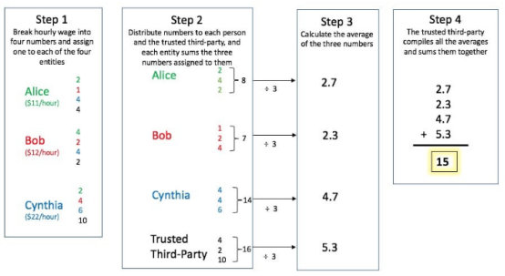

其核心思想在于：允许多个参与方协同工作，计算出一个共同的目标函数值（比如总和、平均值、或者更复杂的函数），而在此过程中，没有任何一方能够获取到其他方输入的具体私有数据内容，除了从最终的计算结果中可能推断出的信息之外。它依赖于精巧的密码学协议，将计算任务分解，并通过各方之间加密信息的交互来完成。形象地说，就像一群人可以在不展示各自底牌的情况下，共同玩一局牌并确定最终的赢家。

​

SMPC的精髓在于它实现了计算过程本身的分散化和对输入的保密性。它提供了一种强有力的保证：只要协议被正确执行（并且通常假设大多数参与方是诚实的或遵循协议的），即使部分参与方相互勾结，也无法窥探到其他诚实参与方的私有输入。这为跨组织或跨个体的安全数据协作开辟了道路。

​

## 技术实现

基于上述思想，安全多方计算在实际应用中依赖一系列具体技术来实现隐私保护和计算目标。其实现方式的核心在于设计特殊的协议，使得参与方能够在不暴露私有数据的情况下，协同完成计算任务。这些协议通常基于密码学技术，例如秘密共享、混淆电路或同态加密等。具体而言，在秘密共享技术中，每个参与方的私有数据被分割成多个片段并分发给其他参与方，每个片段本身不包含任何有意义的信息，只有当所有片段被正确组合时才能还原出原始数据或计算结果。而在混淆电路技术中，计算任务被转化为一个加密的逻辑电路，各方在加密状态下执行计算，从而确保数据隐私。

在示例代码中演示了如何将私有数据分割成多个片段并分发给参与方，以及如何组合这些片段来还原原始数据。代码的主要功能：

定义了一个SecretSharing 类，用于实现秘密共享技术

提供了generate\_shares 方法，将秘密分割成多个份额

提供了reconstruct\_secret 方法，通过组合份额来还原原始秘密

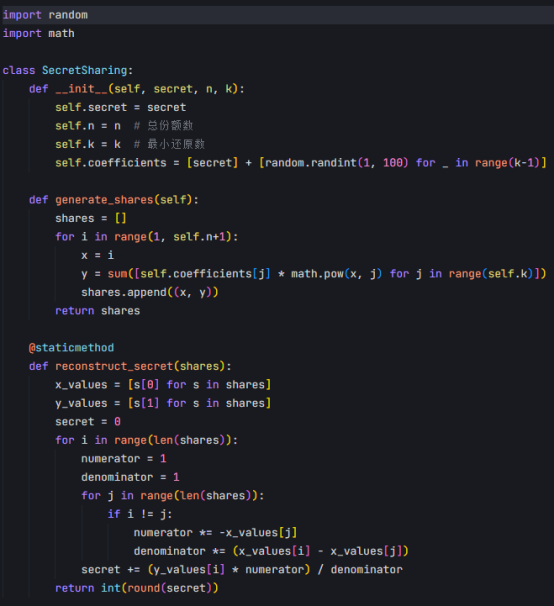

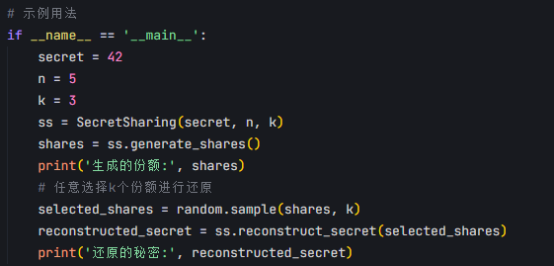

在实际应用中，这种技术在大模型的隐私保护中具有重要价值，尤其是在需要多方协作的场景中。其中一个典型的应用是在联邦学习的模型更新聚合阶段。在联邦学习中，每个参与设备基于本地数据计算模型更新（如梯度），并将更新信息上传至中央服务器进行汇总。为了防止服务器或其他参与方推断出单个设备的私有数据，可以利用安全多方计算技术对各设备的更新信息进行加密，使得服务器只能看到加密后的聚合结果，而无法访问任何单个设备的具体贡献。通过这种方式，即使服务器或某些参与方被攻击，私有数据仍然能够得到保护。

​

尽管这种技术在理论上能够提供强有力的隐私保障，但在实际应用中也面临一些挑战。首先，计算和通信开销是其主要瓶颈。由于协议的复杂性以及加密操作的要求，这种技术在计算效率和通信成本上远高于传统的明文计算，尤其是在参与方数量较多或计算任务较复杂时，资源的消耗可能显著增加。其次，协议的设计和实现需要较高的技术门槛，不同的应用场景可能需要定制化的解决方案。因此，在实际部署时，需要根据具体场景的需求，合理选择和优化协议，以在隐私保护、计算效率和系统可扩展性之间找到平衡点。

​

​

# 模型压缩与知识蒸馏：

## 核心思想

在大模型的开发和部署过程中，如何在提升效率的同时减少潜在的隐私风险是一个值得关注的问题。一种被广泛研究的方法，其核心思想是通过简化模型结构或提取关键信息来降低模型的复杂度和资源需求。这种方法主要包括两个方面：一是通过压缩模型的规模，例如减少参数数量或简化网络结构，使模型更加轻量化；二是通过从复杂模型中提取核心知识，将其迁移到较小的模型中，从而在保持性能的同时降低计算成本。这种方法虽然并非直接针对隐私保护设计，但在某些情况下可能会对隐私保护产生间接的积极影响。

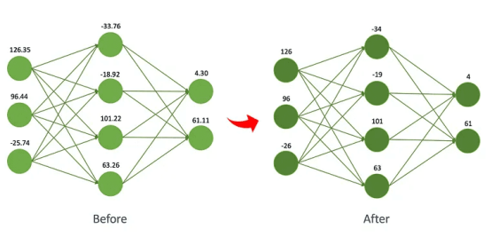

这种思想的核心在于，通过减少模型的复杂度和对训练数据的依赖，可能在一定程度上降低模型对训练数据中个体信息的记忆程度。例如，一个过于复杂的模型可能会无意中记住训练数据中的细节，从而在推理过程中泄露敏感信息。而通过压缩模型或提取关键知识，可以使模型更多地关注数据的整体模式，而非具体的个体数据点。然而，需要明确的是，这种方法的主要目标是提升模型效率和降低部署成本，其对隐私保护的作用是附带的，而非核心功能。因此，在隐私保护的场景中，这种方法通常需要与其他专门的隐私保护技术结合使用。

## 技术实现

基于上述思想，模型压缩与知识蒸馏在实际应用中依赖一系列具体技术来实现模型简化和知识迁移的目标。在模型压缩方面，常见的技术包括参数剪枝、量化、低秩分解等。例如，参数剪枝通过识别并移除模型中对性能贡献较小的参数，减少模型的规模和计算需求；量化技术则通过降低参数的数值精度（例如从浮点数转换为整数），在保持模型性能的同时减少存储和计算开销。在知识蒸馏方面，其实现方式通常是通过一个较大的“教师模型”指导一个较小的“学生模型”进行训练。具体而言，学生模型不仅学习训练数据的标签，还学习教师模型在数据上的预测分布，从而在较小的模型规模下尽可能接近教师模型的性能。在实际应用中，这些技术在大模型的部署中具有重要价值，尤其是在资源受限的场景中，例如移动设备或边缘计算设备。例如，在个性化推荐系统中，通过将一个复杂的大模型压缩为轻量级模型，可以在用户设备上直接运行，从而减少对云端服务器的依赖。

然而，从隐私保护的角度来看，这些技术的间接作用体现在降低模型对训练数据中个体信息的记忆程度。例如，一个经过压缩或蒸馏的模型，由于参数数量的减少或知识的抽象化，可能更难以被攻击者用来反推出训练数据中的具体信息。然而，这种作用是有限的，因为这些技术并非专门为隐私保护设计，其效果在很大程度上取决于模型的训练数据、结构以及攻击方式。

​

尽管这些技术在效率提升方面表现出色，但在隐私保护中的应用也面临一些挑战。首先，其对隐私保护的贡献是间接的，无法提供像其他专门隐私保护技术那样的可量化保障。因此，在隐私敏感的场景中，这些技术通常需要与其他方法结合使用，例如在模型训练或推理过程中引入额外的隐私保护机制。其次，压缩和蒸馏的过程可能会影响模型的性能，尤其是在过度压缩的情况下，可能导致模型的预测精度下降。因此，在实际部署时，需要根据具体场景的需求，在模型效率、性能和隐私保护之间找到合理的平衡点。

​

​

# 权衡

在大模型的隐私保护中，尽管多种技术手段为数据隐私提供了不同程度的保障，但在实际应用中仍然面临诸多挑战。这些挑战不仅涉及技术本身的局限性，还包括与模型性能、系统效率以及外部威胁的复杂权衡。

## 隐私与效用的权衡

在设计和应用隐私保护技术时，一个核心的挑战是如何在保护数据隐私与维持模型性能之间找到平衡点。

通常情况下，更强的隐私保护措施往往伴随着模型性能的下降，例如预测准确率的降低。以引入随机扰动为例，这种方法可以通过在数据处理或模型训练过程中添加噪声来保护个体信息，但噪声的强度越大，模型对数据的学习能力就越容易受到干扰，从而导致性能下降。类似地，其他隐私保护技术，如加密计算或分布式训练，虽然能够在一定程度上保护数据隐私，但也可能因为数据可用性的降低或计算方式的改变而影响模型的最终效用。

​

## 计算与通信开销的增加

许多隐私保护技术在提供隐私保障的同时，也显著增加了计算和通信的开销，这对系统的效率和可扩展性构成了挑战。例如，在加密计算中，数据需要在加密状态下进行复杂的数学运算，这相比于明文计算需要消耗更多的计算资源，尤其是在处理大规模数据或训练复杂模型时，计算开销可能达到不可接受的程度。类似地，在分布式训练场景中，为了保护各参与方的隐私，可能需要在数据传输之前对数据进行加密或扰动处理，这不仅增加了计算负担，还可能显著增加设备与服务器之间的通信成本。此外，一些技术在多方协作的场景中需要额外的协议来协调各方操作，这进一步加剧了通信开销。

​

## 技术实施的复杂性

将隐私保护技术有效集成到大模型的训练和部署流程中，是另一个重要的挑战。大模型的开发和应用通常涉及复杂的系统架构，包括数据预处理、模型训练、推理部署等多个环节，而隐私保护技术的引入需要在这些环节中进行深度改造。例如，在模型训练阶段引入随机扰动，需要对优化算法进行调整，以确保模型在噪声干扰下的收敛性；在分布式训练中引入加密协议，则需要设计额外的通信和协调机制，以确保各方在安全的前提下高效协作。此外，不同的隐私保护技术可能需要针对特定的应用场景进行定制化设计，这进一步增加了技术实施的复杂性。

​

## 标准化与评估的缺失

在隐私保护技术的应用中，缺乏统一的评估标准和框架也是一个重要的挑战。目前，不同的隐私保护技术往往采用各自的评估指标和方法，这使得不同技术之间的效果难以直接比较。例如，一些技术可能通过数学理论提供隐私保护强度的量化指标，而另一些技术则可能更依赖于实验验证或攻击模拟，这导致了评估结果的不一致性。此外，对于隐私保护的实际效果，不同的应用场景可能有不同的需求，例如医疗领域可能更关注个体数据的不可识别性，而金融领域可能更关注数据泄露的经济损失。然而，目前缺乏一个通用的评估框架，能够综合考虑这些需求并提供标准化的评估方法。

​

## 攻击模型的不断演进

随着隐私保护技术的发展，攻击模型的演进也对现有防御手段提出了新的挑战。攻击者不断开发新的方法，试图从模型的输出、训练过程或通信环节中提取敏感信息。例如，一些攻击方法可以通过分析模型的预测结果，推断出训练数据中的个体信息；另一些攻击方法则可能利用系统实现中的漏洞，绕过隐私保护机制。在分布式训练场景中，攻击者还可能伪装成合法参与方，试图窃取其他参与方的私有数据。这些新型攻击方法的出现，使得现有的隐私保护技术可能面临失效的风险。

​

# 参考

1. <https://medium.com/@meta_heuristic/data-leaks-in-llm-02f85accbf58>

2. <https://arstechnica.com/security/2024/01/ars-reader-reports-chatgpt-is-sending-him-conversations-from-unrelated-ai-users/>

3. <https://openmined.org/blog/privacy-series-basics-definition/>

4. <https://www.dailydoseofds.com/federated-learning-a-critical-step-towards-privacy-preserving-machine-learning/>

5. <https://openmined.org/blog/what-is-homomorphic-encryption/>

6. <https://chain.link/education-hub/secure-multiparty-computation-mcp>

7. <https://www.goml.io/shrinking-giants-innovative-techniques-for-compressing-llms/>

​

​
