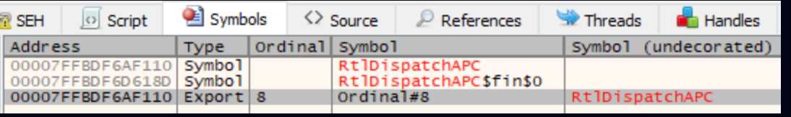

# 高级进程注入之利用线程名和APC实现进程注入（上）-先知社区

> **来源**: https://xz.aliyun.com/news/18877  
> **文章ID**: 18877

---

# 前言

进程注入是攻击方武器库中最重要的技术之一，本文将会介绍如何使用线程描述相关的API实现绕过AV/EDR的进程注入，最后会提供相应的检测方式。（线程描述相关的API，线程描述和线程名是一个意思）

进程注入是高级恶意软件中一定会使用的技术，它的用途包括：  
1、AV/EDR躲避：隐藏恶意代码在一个合法的进程中  
2、操作现有进程：经典的就是lsass进程的dump  
3、权限提升

由于读取现有进程的内存危害很大，所以各种AV/EDR都会重点监控并阻止这个行为，不过监控也是基于已知的技术，一旦有未知技术，AV/EDR将很难监控，这本质是一个猫鼠游戏，并且永远不会结束。攻击方一直在尝试使用新技术躲避检测，比如在2016年FortiGuard Labs公开的[原子爆炸技术](https://www.fortinet.com/blog/threat-research/atombombing-brand-new-code-injection-technique-for-windows)，它使用[原子表](https://learn.microsoft.com/en-us/windows/win32/api/winbase/nf-winbase-globaladdatoma)传递代码到远程进程中，再比如2023年SafeBreach公开的[池聚会技术](https://www.safebreach.com/blog/process-injection-using-windows-thread-pools)，线程池被滥用在远程进程的上下文执行代码，想了解各种注入技术，可以查看2019年BlackHat UAS中分享的[Windows Process Injection in 2019](https://i.blackhat.com/USA-19/Thursday/us-19-Kotler-Process-Injection-Techniques-Gotta-Catch-Them-All-wp.pdf)

本文要介绍的技术称之为“线程名调用”，这项技术允许植入shellcode到一个远程进程中，通过下列的API：  
1、GetThreadDescription/SetThreadDescription（Windows 10 1607中引入的），用于获取/设置线程描述  
2、ZwQueueApcThreadEx2（Windows 10 19045中引入的），APC相关的一个新型API

这项技术中，在远程进程中分配内存并写入shellcode是通过没有写权限的handle实现，关于进程访问权限的概念，可以查看[这里](https://learn.microsoft.com/en-us/windows/win32/procthread/process-security-and-access-rights)，由于这个特性以及我们使用的API不是进程注入中常用的API，我们可以绕过多数的AV/EDR，下面的内容中，我们将阐述这项技术的实现细节，以及对应的检测方法

由于内容较多，本文分为上下两部分

# 线程名在攻击中的各种场景

### IPC

IPC全称Inter-Process Communication，意思是进程间通信，比如C2开发中，内部各个模块间的通信就要用到IPC，线程名可以作为两个通信进程的“邮箱”，发送方进程发送信息通过设置线程描述，也就是SetThreadDescription，接收方进程接收信息通过获取线程描述，也就是GetThreadDescription，具体实现可以参考：<https://github.com/LloydLabs/dearg-thread-ipc-stealth>

### 躲避内存扫描

AV/EDR会扫描可疑进程的内存，来匹配内存中的shellcode是否是已知恶意软件的IoC，为此我们需要躲避内存扫描。已公开的方案是，shellcode不使用时对其进行加密，如果借助线程名的话，可以在不使用时将shellcode存到线程名中，由于线程名是一个内核模式结构，天然的可以躲避用户模式的内存扫描，具体实现可以参考：<https://gitlab.com/ORCA000/t.d.p>

### 辅助内核模式利用

借助线程名，可以在用户层为内核层分配内存空间，以方便进一步的内核模式利用，具体实现可以参考：<https://web.archive.org/web/20221009194014/https://blahcat.github.io/posts/2019/03/17/small-dumps-in-the-big-pool.html>

### 进程注入 之 双管枪

这项技术是2022年由Sam Russel发布，通过线程劫持的变种实现代码注入，重定向线程执行到一个ROP链，这个ROP链就是通过线程名传递内容实现，这项技术没有创建额外的可执行内存空间，因此可以躲避一些安全检测，缺点是shellcode需要符合特定Windows版本（这是一个硬编码的ROP链，也就是说需要特定的Windows版本），以及shellcode执行后可能导致目标应用程序不稳定，最后是使用了直接对线程操作的API，导致容易触发告警，代码实现：<https://www.lodsb.com/shellcode-injection-using-threadnameinformation>

### 进程注入 之 线程名调用

就是本篇文章要介绍的技术，要注入的代码通过线程描述发送到目标进程，接下来让目标进程通过APC调用GetThreadDescription，来将线程描述拷贝到目标进程内存中，修改内存为可执行，最终通过另外一个APC来执行它，这项技术对shellcode没有限制，也不会干扰原始线程，目标应用程序会继续它的执行。

### DLL注入变种

通常的DLL注入，是将要注入的DLL地址写到目标进程的地址空间中，然后远程调用LoadLibrary执行目标进程中的DLL，相比较经典的DLL注入使用VirtualAllocEx和WriteProcessMemory，在这里DLL的路径通过线程名传递

# 使用的API

先看一下这项技术用到的API，理解它们的实现细节，对于使用它们攻击以及针对它们防守至关重要。

### GetThreadDescription / SetThreadDescription

从Windows 10 1607开始，下面的API被添加到Windows中

```
HRESULT GetThreadDescription(
 [in] HANDLE hThread,
 [out] PWSTR *ppszThreadDescription 
);

HRESULT SetThreadDescription(
 [in] HANDLE hThread,
 [in] PCWSTR lpThreadDescription 
);
```

这两个函数被创建是用于设置/获取线程描述，有助于调试中识别某个线程功能。当我们从攻击方视角查看这个API，可以发现一些用途，想要对线程设置描述，需要打开一个带有THREAD\_SET\_LIMITED\_INFORMATION标识的线程句柄，然后我们就可以关联我们的内存缓冲区和远程进程的任意线程，另外缓冲区必须是Unicode字符串，那意味着缓冲区需要以L' '结尾，我们可以申请的尺寸是0x10000，是65536字节，根据经验，我们可以使用65536-2字节，约等于16个页（每个页是4Kb）的大小，这是非常充足的容纳shellcode

### API实现

这两个API实现在Kernelbase.dll中，其中SetThreadDescripton的实现细节如下

```
#define ThreadNameInformation 0x26

HRESULT __stdcall SetThreadDescription(HANDLE hThread, PCWSTR lpThreadDescription)
{
  NTSTATUS status; // eax
  struct _UNICODE_STRING DestinationString;

  status = RtlInitUnicodeStringEx(&DestinationString, lpThreadDescription);
  if ( status >= 0 )
    status = NtSetInformationThread(hThread, ThreadNameInformation, &DestinationString, 0x10u);
  return status | 0x10000000;
}
```

可以看到，这个函数需要2个参数，一个是线程指针，另一个是包含Unicode字符串的缓冲区，并且将Unicode字符串转换为UNICODE\_STRING结构，为线程设置字符串是通过NtSetInformationThread实现的，返回的结果将NTSTATUS类型的status转换为HRESULT类型。在下面的shellcode写入远程进程中，我们通过在远程线程上调用SetThreadDescription实现。

GetThreadDescription的实现细节如下

```
HRESULT __stdcall GetThreadDescription(HANDLE hThread, PWSTR *ppszThreadDescription)
{
  SIZE_T struct_len; // rbx
  SIZE_T struct_size; // r8
  NTSTATUS res; // eax
  NTSTATUS status; // ebx
  const UNICODE_STRING *struct_buf; // rdi
  ULONG ReturnLength; // [rsp+58h] [rbp+10h] BYREF

  *ppszThreadDescription = nullptr;
  LODWORD(struct_len) = 144;
  RtlFreeHeap(NtCurrentPeb()->ProcessHeap, 0, 0);
  for ( struct_size = 146; ; struct_size = struct_len + 2 )
  {
    struct_buf = (const UNICODE_STRING *)RtlAllocateHeap(NtCurrentPeb()->ProcessHeap, 0, struct_size);
    if ( !struct_buf )
    {
      status = 0xC0000017;
      goto finish;
    }
    res = NtQueryInformationThread(
            hThread,
            ThreadNameInformation,
            (PVOID)struct_buf,
            struct_len,
            &ReturnLength);
    status = res;
    if ( res != 0xC0000004 && res != 0xC0000023 && res != 0x80000005 )
      break;
    struct_len = ReturnLength;
    RtlFreeHeap(NtCurrentPeb()->ProcessHeap, 0, (PVOID)struct_buf);
  }
  if ( res >= 0 )
  {
    ReturnLength = struct_buf->Length;
    // move the buffer to the beginning of the structure
    memmove_0((void *)struct_buf, struct_buf->Buffer, ReturnLength);
    // null terminate the buffer
    *(&struct_buf->Length + ((unsigned __int64)ReturnLength >> 1)) = 0;
    // fill in the passed pointer
    *ppszThreadDescription = &struct_buf->Length;
    struct_buf = 0i64;
  }
finish:
  RtlFreeHeap(NtCurrentPeb()->ProcessHeap, 0, (PVOID)struct_buf);
  return status | 0x10000000;
}
```

分析这个函数可以发现一些有趣的细节，在目标进程中装有线程描述的缓冲区位于堆上，函数会自动分配一个UNICODE\_STRING大小的尺寸，初始化后，将UNICODE\_STRING转化为一个简单的宽字符串（以null作为结尾），然后指向新缓冲区的指针返回给调用者传递的变量，就是PWSTR \*ppszThreadDescription。

### UNICODE\_STRING位置

查看上面的代码实现可以注意到，调用GetThreadDescription后在目标进程缓冲区中的线程描述只是拷贝，那原始的UNICODE\_STRING在哪？想要了解更多，我们需要查看Windows内核ntoskrnl.exe，进而发现SetThreadDescription/GetThreadDescription的syscall实现（NtSetInformationThread and NtQueryInformationThread），可以看到原始的UNICODE\_STRING存储在内核模式，位于ETHREAD->ThreadName

```
   lkd> dt nt!_ETHREAD
   [...]
   +0x610 ThreadName       : Ptr64 _UNICODE_STRING
   [...]
```

内核模式中，负责设置线程名的NtSetInformationThread的部分代码

```
[...]
          Length = Src.Length;
          if ( (Src.Length & 1) != 0 || Src.Length > Src.MaximumLength )
          {
            status = 0xC000000D; // STATUS_INVALID_PARAMETER -> invalid buffer size supplied
          }
          else
          {
            PoolWithTag = ExAllocatePoolWithTag(NonPagedPoolNx, Src.Length + 16i64, 'mNhT'); // allocating a buffer on non paged pool, with tag 'ThNm'
            threadName = PoolWithTag;
            v113 = PoolWithTag;
            if ( PoolWithTag )
            {
              p_Length = &PoolWithTag[1].Length;
              threadName->Buffer = p_Length;
              threadName->Length = Length;
              threadName->MaximumLength = Length;
              memmove(p_Length, Src.Buffer, Length);
              eThread = Object;
              PspLockThreadSecurityExclusive(Object, CurrentThread);
              v105 = 1;
              P = eThread->ThreadName;
              eThread->ThreadName = threadName;
              threadName = 0i64;
              v113 = 0i64;
              EtwTraceThreadSetName(eThread);
              goto finish;
            }
            status = 0xC000009A;
          }
        }
        else
        {
          status = 0xC0000004;
        }
        v104 = status;
finish:
[...]
```

可以看到，缓冲区被分配在NonPagedPoolNx（不可执行的，非页面的池），分配的缓冲区被UNICODE\_STRING填充，缓冲区的指针位于ETHREAD中的ThreadName。

可以看到设置线程名已经被ETW注册，因此我们可以使用它来检测这项技术，生成的事件数据包括进程ID、线程ID、等，这些数据可以用来标识线程和线程描述

```
__int64 __fastcall EtwTraceThreadSetName(_ETHREAD *thread)
{
  int v1; // r10d
  _UNICODE_STRING *ThreadName; // rax
  __int64 *Buffer; // rcx
  unsigned int Length; // edx
  unsigned __int64 len; // rax
  int v7[4]; // [rsp+30h] [rbp-50h] BYREF
  __int64 v8[2]; // [rsp+40h] [rbp-40h] BYREF
  __int64 *buf; // [rsp+50h] [rbp-30h]
  __int64 v10; // [rsp+58h] [rbp-28h]
  __int64 *v11; // [rsp+60h] [rbp-20h]
  __int64 v12; // [rsp+68h] [rbp-18h]

  v7[0] = thread->Cid.UniqueProcess;
  v1 = 2;
  v7[1] = thread->Cid.UniqueThread;
  v8[0] = v7;
  ThreadName = thread->ThreadName;
  v7[2] = 0;
  v8[1] = 8i64;
  if ( ThreadName && (Buffer = ThreadName->Buffer) != 0i64 )
  {
    Length = ThreadName->Length;
    len = 0x800i64;
    if ( Length < 0x800u )
      len = Length;
    buf = Buffer;
    v10 = len;
    if ( !len || *(Buffer + (len >> 1) - 1) )
    {
      v12 = 2i64;
      v11 = &EtwpNull;
      v1 = 3;
    }
  }
  else
  {
    v10 = 2i64;
    buf = &EtwpNull;
  }
  return EtwTraceKernelEvent(v8, v1, 2, 1352, 0x501802);
}
```

上述代码中，一些基本概念的解释  
\_\_int64：表示Windows平台下64位有符号整数  
\_\_fastcall：和\_\_stdcall类似的调用约定，前两个参数通过寄存器传递，其余参数从右向左入栈，由子函数清理堆栈  
int：表示有符号整型  
unsinged int：表示无符号整型  
2i64：表示64位有符号整数常量，意味着即使是32位系统中也会被强制解释为64位有符号整数  
0x800i64：表示十六进制形式的800，其他和2i64一样

### 移除空字节限制

使用Windows官方的API设置线程名时，会对名称的字符有一些限制，名称必须是有效的Unicode字符串，有效意味着以一个空的WCHAR字符作为结尾。一个WCHAR字符占用2字节，一个空的WCHAR字符也占用2字节，也就是说，如果我们的shellcode中有2个连续NULL字符（一个NULL字符占1个字节），那么后面的部分将被忽略。每当shellcode需要通过装有字符串的缓冲区传递时，都会遇到这个问题。为了解决这个问题，shellcode编码器被发明出来，它们可以将缓冲区转换为不含空字节的格式。

但是通过分析上面的API，我们发现可以从根本上解决这个限制，当线程描述在不同缓冲区之间复制时，将使用UNICODE\_STRING结构中声明的长度，并且使用memmove函数拷贝时，该函数不将NULL字节视为终止符。唯一使用NULL字节作为终止符的是SetThreadDescription，但是在底层实现中，它调用RtlInitUnicodeStringEx，使用宽字符来初始化UNICODE\_STRING结构，输入缓冲区一定是NULL字节作为终止符，以及长度是通过NULL字节决定的。

这个函数初始化UNICODE\_STRING，基于指定长度的虚假缓冲区，并且填充它使用实际的内容（可能会包含空字节），然后使用低级API NtSetInformationThread将准备好的UNICODE\_STRING传递给线程

```
HRESULT mySetThreadDescription(HANDLE hThread, const BYTE* buf, size_t buf_size) {
    UNICODE_STRING DestinationString = { 0 };
    BYTE* padding = (BYTE*)::calloc(buf_size + sizeof(WCHAR), 1)
    ::memset(padding, 'A', buf_size);

    auto pRtlInitUnicodeStringEx = reinterpret_cast<decltype(&RtlInitUnicodeStringEx)>(
        GetProcAddress(GetModuleHandle("ntdll.dll"), "RtlInitUnicodeStringEx")
    );
    pRtlInitUnicodeStringEx(&Destination, (PCWSTR)padding);
    ::memcpy(DestinationString.Buffer, buf, buf_size);

    auto pNtSetInformationThread = reinterpret_cast<decltype(*NtSetInformationThread)>(
        GetProcAddress(GetModuleHandle("ntdll.dll"), "NtSetInformationThread")
    );
    NTSTATUS status = pNtSetInformationThread(hThread, (THREADINFOCLASS)(ThreadNameInformation), &DestinationString, 0x10u);
    ::free(padding);

    return HRESULT_FROM_NT(status);
}
```

### NtQueueApcThreadEx2

想要实现进程注入，就需要在目标进程中调用API，Windows支持添加函数到现有线程的APC队列中，让我们能够在远程进程运行代码，而无需创建线程，在底层这个函数是NtQueueApcThreadEx或者NtQueueApcThread，NtQueueApcThreadEx是Windows Vista及之后引入的，NtQueueApcThread是Windows XP及之前使用的，从名字就能知道，NtQueueApcThreadEx是扩展版本，功能更多。对应的Win32 API是QueueUserAPC。只要线程句柄被打开时带有THREAD\_SET\_CONTEXT权限，我们就可以向远程线程的队列中添加函数。

APC注入相关的API经常被用在各种新老注入技术中，可以看一下MITRE矩阵中APC的部分，APC允许在已经存在的远程线程中运行代码，相比创建一个远程线程的方式更隐蔽，创建一个新的线程通常会触发AV/EDR在内核层部署的回调函数PsSetCreateThreadNotifyRoutine/PsSetCreateThreadNotifyRoutineEx。而且，APC在传参方面更加灵活，创建线程我们只能传递一个参数，使用APC的方式我们可以传递3个参数。

直接使用NtQueueApcThread有一个缺点，想要添加函数到APC队列中，前提是我们需要发现一个处于alertable状态的线程，因为仅当线程处于alertable状态时才会执行我们添加到APC队列的函数。依赖alertable状态的线程限制了我们对目标的选择，并且寻找目标也增加了注入器的复杂性。

幸运的是，新版APC被引入Windows后有了一个解决方案，是QUEUE\_USER\_APC\_FLAGS。QUEUE\_USER\_APC\_FLAGS是一个枚举类型，在QueueUserAPC2函数中使用，这两个东西都是Windows 10中新引入的，之前的系统中没有，定义如下

```
BOOL QueueUserAPC2(
    PAPCFUNC pfnAPC,                // APC 回调函数（待执行的代码）
    HANDLE hThread,                 // 目标线程句柄
    ULONG_PTR dwData,               // 传递给 APC 回调的参数
    QUEUE_USER_APC_FLAGS Flags      // 标志位（QUEUE_USER_APC_FLAGS 枚举值）
);


typedef enum _QUEUE_USER_APC_FLAGS {
  QUEUE_USER_APC_FLAGS_NONE,
  QUEUE_USER_APC_FLAGS_SPECIAL_USER_APC,
  QUEUE_USER_APC_CALLBACK_DATA_CONTEXT
} QUEUE_USER_APC_FLAGS;
虽然定义4个值，一般用到的就是QUEUE_USER_APC_FLAGS_NONE 和 QUEUE_USER_APC_FLAGS_SPECIAL_USER_APC
QUEUE_USER_APC_FLAGS_NONE：表示需要alertable才能触发的常规APC
QUEUE_USER_APC_FLAGS_SPECIAL_USER_APC：表示无需alertable，只需触发特定系统事件即可触发

参考链接：
https://learn.microsoft.com/en-us/windows/win32/api/processthreadsapi/nf-processthreadsapi-queueuserapc2
https://learn.microsoft.com/en-us/windows/win32/api/processthreadsapi/ne-processthreadsapi-queue_user_apc_flags
```

现在我们梳理一下这几个API的关系：Windows NT 4.0引入内核态API NtQueueApcThread，对应的用户态API是QueueUserAPCWindows Vista引入内核态API NtQueueApcThreadEx，无对应的用户态APIWindows 10 1703引入用户态API QueueUserAPC2，对应的内核态API是NtQueueApcThreadExWindows 10 1903引入内核态API NtQueueApcThreadEx2，无对应的用户态API在NtQueueApcThreadEx中有一个参数ReserveHandle，后期被微软替换为UserApcOption，UserApcOption是一个结构体，它们的原型如下

```
NtQueueApcThreadEx(
    _In_ HANDLE ThreadHandle,
    _In_opt_ HANDLE ReserveHandle, // NtAllocateReserveObject // QUEUE_USER_APC_SPECIAL_USER_APC
    _In_ PPS_APC_ROUTINE ApcRoutine, // RtlDispatchAPC
    _In_opt_ PVOID ApcArgument1,
    _In_opt_ PVOID ApcArgument2,
    _In_opt_ PVOID ApcArgument3
);


typedef struct _USER_APC_OPTION {
    ULONG Flags;          // APC 行为控制标志
    HANDLE ReservedHandle; // 保留字段，兼容早期 ReverseHandle 功能
    // 其他扩展字段（如 APC 优先级、触发条件等）
} USER_APC_OPTION, *PUSER_APC_OPTION;


参考链接：
https://ntdoc.m417z.com/ntqueueapcthreadex
```

看完函数原型，可以很清晰的知道是将第2个参数ReserveHandle替换为结构体UserApcOption，然后在UserApcOption中的Flags传入QUEUE\_USER\_APC\_SPECIAL\_USER\_APC后，允许我们注入到一个不需要alertable状态的线程

这种新的APC类型也因引入稳定性问题的风险而受到批评，并使线程同步变得更加困难。但在我们的情况下这不是一个问题，因为我们正在使用它来运行一个与运行应用程序完全独立且不存在并发的场景。最新的APC类型被正式添加到了Windows 11 Build 22000中，对应的用户层API是QueueUserAPC2，底层对应的内核层API是NtQueueApcThreadEx2，函数原型是

```
NtQueueApcThreadEx2(
    _In_ HANDLE ThreadHandle,
    _In_opt_ HANDLE ReserveHandle, // NtAllocateReserveObject
    _In_ ULONG ApcFlags, // QUEUE_USER_APC_FLAGS
    _In_ PPS_APC_ROUTINE ApcRoutine, // RtlDispatchAPC
    _In_opt_ PVOID ApcArgument1,
    _In_opt_ PVOID ApcArgument2,
    _In_opt_ PVOID ApcArgument3
);
```

实际上，这个API在Windows 10 19045中就已经存在了，这是一个相对新的API，也就有相对新的Syscall，使用它可以增大我们绕过AV/EDR的机会。在我们的注入器中，我们将使用这个API在远程线程执行代码

### RtlDispatchAPC

这个函数不是我们这项技术中的必须项，但可以帮助我们的shellcode执行更隐蔽，shellcode拷贝到目标进程后，下一步是添加shellcode的起始地址到远程线程的APC队列中。但是我们的shellcode是私有内存，并不是映射内存，直接执行私有内存可能会触发一些告警，想要躲避这类告警我们需要一些合法函数作为代理，有很多函数允许我们通过回调函数执行，多数被总结如下

函数RtlDispatchAPC看起来像是一个完美的候选，它有3个参数，因此它是兼容APC的，实现如下

```
void __fastcall RtlDispatchAPC(void (__fastcall *callback)(__int64), __int64 callback_arg, void *a3)
{
  __int64 v6 = 72LL;
  int v7 = 1;
  __int128 v8 = 0LL;
  __int128 v9 = 0LL;
  __int128 v10 = 0LL;
  __int64 v11 = 0LL;

  if ( a3 == (void *)-1LL )
  {
    callback(callback_arg);
  }
  else
  {
    RtlActivateActivationContextUnsafeFast(&v6, a3);
    callback(callback_arg);
    RtlDeactivateActivationContextUnsafeFast(&v6);
    RtlReleaseActivationContext(a3);
  }
}
```

想要使上面的函数执行我们的shellcode，我们需要给他传递下列的参数

```
RtlDispatchAPC(shellcodePtr, 0, (void *)(-1))
```

需要注意，RtlDispatchAPC没有导出函数名，我们需要通过序号调用它  


允许我们通过回调执行的函数

```
acmDriverEnumCallback
acmDriverProc
acmFilterChooseHookProc
acmFilterEnumCallback
acmFilterTagEnumCallback
acmFormatChooseHookProc
acmFormatEnumCallback
acmFormatTagEnumCallback
acmStreamConvertCallback
AddInterface
AddPropSheetPageProc
AddSecureMemoryCacheCallback
agePaintHook
ageSetupHook
AllocateMemory
APCProc
ApplicationRecoveryCallback
ApplyCallbackFunction
asswordChangeNotify
asswordFilter
AuthzAccessCheckCallback
AuthzComputeGroupsCallback
AuthzFreeGroupsCallback
BindIoCompletionCallback
BlockConvertServicesToStatic
BlockDeleteStaticServices
BrowseCallbackProc
BufferCallback
CallWndProc
CallWndRetProc
capControlCallback
capErrorCallback
capStatusCallback
capVideoStreamCallback
capWaveStreamCallback
capYieldCallback
CBTProc
CCHookProc
CertChainFindByIssuerCallback
CertDllOpenStoreProv
CertEnumPhysicalStoreCallback
CertEnumSystemStoreCallback
CertEnumSystemStoreLocationCallback
CertStoreProvCloseCallback
CertStoreProvDeleteCertCallback
CertStoreProvDeleteCRLCallback
CertStoreProvDeleteCTL
CertStoreProvFindCert
CertStoreProvFindCRL
CertStoreProvFindCTL
CertStoreProvFreeFindCert
CertStoreProvFreeFindCRL
CertStoreProvFreeFindCTL
CertStoreProvGetCertProperty
CertStoreProvGetCRLProperty
CertStoreProvGetCTLProperty
CertStoreProvReadCertCallback
CertStoreProvReadCRLCallback
CertStoreProvReadCTL
CertStoreProvSetCertPropertyCallback
CertStoreProvSetCRLPropertyCallback
CertStoreProvSetCTLProperty
CertStoreProvWriteCertCallback
CertStoreProvWriteCRLCallback
CertStoreProvWriteCTL
CFHookProc
ClaimMediaLabel
CleanupGroupCancelCallback
ClientCallback
ClientCallback_Function
CloseServiceEnumerationHandle
CollectPerformanceData
CompletionProc
ConnectClient
ControlCallback
CopyProgressRoutine
CounterPathCallBack
CQPageProc
CreateServiceEnumerationHandle
CreateStaticService
CryptGetSignerCertificateCallback
CRYPT_ENUM_KEYID_PROP
CRYPT_ENUM_OID_FUNCTION
CRYPT_ENUM_OID_INFO
CRYPT_RETURN_HWND
CRYPT_VERIFY_IMAGE
CspGetDHAgreement
DavAuthCallback
DavFreeCredCallback
DavRegisterAuthCallback
DavUnregisterAuthCallback
DdeCallback
DdeEnableCallback
DeleteInterface
DeleteStaticService
DemandDialRequest
DhcpAddressDelHook
DhcpAddressOfferHook
DhcpControlHook
DhcpDeleteClientHook
DhcpHandleOptionsHook
DhcpNewPktHook
DhcpPktDropHook
DhcpPktSendHook
DhcpServerCalloutEntry
DialogProc
DigestFunction
DisassociateCurrentThreadFromCallback
DisconnectClient
DllCallbackProc
DllGetClassObject
DoUpdateRoutes
DoUpdateServices
DPA_DestroyCallback
DPA_EnumCallback
DrawStateProc
DriverCallback
DSA_DestroyCallback
DSA_EnumCallback
DSEnumAttributesCallback
EditStreamCallback
EditWordBreakProc
EditWordBreakProcEx
EmbeddedUIHandler
EnableCallback
EnhMetaFileProc
EnumCalendarInfoProc
EnumCalendarInfoProcEx
EnumCalendarInfoProcExEx
EnumChildProc
EnumCodePagesProc
EnumDateFormatsProc
EnumDateFormatsProcEx
EnumDateFormatsProcExEx
EnumDesktopProc
EnumDirTreeProc
EnumerateGetNextService
EnumerateLoadedModulesProc64
EnumFontFamExProc
EnumFontFamProc
EnumFontsProc
EnumGeoInfoProc
EnumICMProfilesProcCallback
EnumInputContext
EnumLanguageGroupLocalesProc
EnumLanguageGroupsProc
EnumLocalesProc
EnumLocalesProcEx
EnumMetaFileProc
EnumObjectsProc
EnumPageFilesProc
EnumRegisterWordProc
EnumResLangProc
EnumResNameProc
EnumResTypeProc
EnumThreadWndProc
EnumTimeFormatsProc
EnumTimeFormatsProcEx
EnumUILanguagesProc
EnumWindowsProc
EnumWindowStationProc
EventCallback
EventClassCallback
EventRecordCallback
Event_Handler_Function_Name
EVT_SUBSCRIBE_CALLBACK
ExportCallback
FaxLineCallback
FaxRouteAddFile
FaxRouteDeleteFile
FaxRouteEnumFile
FaxRouteEnumFiles
FaxRouteGetFile
FaxRouteModifyRoutingData
FaxRoutingInstallationCallback
FaxSendCallback
FAX_RECIPIENT_CALLBACK
FExecuteInAppDomainCallback
FiberProc
FileIOCompletionRoutine
FILE_RESTORE_CALLBACK
FindDebugInfoFileProc
FindExecutableImageProc
FLockClrVersionCallback
FlsCallback
FNCCERTDISPLAYPROC
FNCFILTERPROC
FNCMFILTERPROC
FNCMHOOKPROC
FNDAENUMCALLBACK
FNDPAENUMCALLBACK
FNDSAENUMCALLBACK
FNPEER_FREE_SECURITY_DATA
FNPEER_SECURE_RECORD
FNPEER_VALIDATE_RECORD
FN_AUTHENTICATION_CALLBACK
FN_AUTHENTICATION_CALLBACK_EX
FN_BLUETOOTH_ENUM_ATTRIBUTES_CALLBACK
FN_CDF_PARSE_ERROR_CALLBACK
FN_CERT_CHAIN_FIND_BY_ISSUER_CALLBACK
FN_CERT_DLL_OPEN_STORE_PROV_FUNC
FN_CERT_ENUM_PHYSICAL_STORE
FN_CERT_ENUM_SYSTEM_STORE
FN_CERT_STORE_PROV_CLOSE
FN_CERT_STORE_PROV_DELETE_CERT
FN_CERT_STORE_PROV_DELETE_CRL
FN_CERT_STORE_PROV_READ_CERT
FN_CERT_STORE_PROV_READ_CRL
FN_CERT_STORE_PROV_SET_CERT_PROPERTY
FN_CERT_STORE_PROV_SET_CRL_PROPERTY
FN_CERT_STORE_PROV_SET_CTL_PROPERTY
FN_CERT_STORE_PROV_WRITE_CERT
FN_CERT_STORE_PROV_WRITE_CRL
FN_CERT_STORE_PROV_WRITE_CTL
FN_CRYPT_XML_CREATE_TRANSFORM
FN_CRYPT_XML_DATA_PROVIDER_CLOSE
FN_CRYPT_XML_DATA_PROVIDER_READ
FN_CRYPT_XML_ENUM_ALG_INFO
FN_CRYPT_XML_WRITE_CALLBACK
FN_DEVICE_CALLBACK
FN_WdsCliCallback
FN_WdsCliTraceFunction
FN_WdsTransportClientReceiveContents
FN_WdsTransportClientReceiveMetadata
FN_WdsTransportClientSessionComplete
FN_WdsTransportClientSessionStart
FN_WdsTransportClientSessionStartEx
ForegroundIdleProc
FreeMemory
FRHookProc
FuncReturnhWnd
FunctionTableAccessProc64
FuncVerifyImage
GenerateGroupPolicy
GetApplicationRecoveryCallback
GetEventMessage
GetFirstOrderedService
GetGlobalInfo
GetInterfaceInfo
GetMfeStatus
GetModuleBaseProc64
GetMsgProc
GetNeighbors
GetNextOrderedService
GetRequest
GetResponse
GetServiceCount
GetSize
GetTSAudioEndpointEnumeratorForSession
gluNurbsCallback
gluQuadricCallback
gluTessCallback
GopherAttributeEnumerator
HandlerEx
HandlerRoutine
honeCallbackFunc
hone_Event
HyphenateProc
ICMProgressProcCallback
ImportCallback
InitHelperDll
InitializeChangeNotify
InitializeEmbeddedUI
InitOnceCallback
InsertAt
InstalluiHandler
InstalluiHandlerRecord
INSTALLUI_HANDLER
InterfaceStatus
InternetSetStatusCallback
InternetStatusCallback
INTERNET_STATUS_CALLBACK
IoCompletionCallback
IOProc
IsService
JournalPlaybackProc
JournalRecordProc
KeyboardProc
lineCallbackFunc
LineDDAProc
Line_Event
LOG_FULL_HANDLER_CALLBACK
LOG_TAIL_ADVANCE_CALLBACK
LOG_UNPINNED_CALLBACK
LowLevelKeyboardProc
LowLevelMouseProc
LPCQADDFORMSPROC
LPCQADDPAGESPROC
LPCQPAGEPROC
LPDISPLAYVAL
LPDSENUMATTRIBUTES
LPEVALCOMCALLBACK
LPFNDFMCALLBACK
LPFNVIEWCALLBACK
MagGetImageScalingCallback
MagImageScalingCallback
MagSetImageScalingCallback
MappingCallbackProc
MaxMediaLabel
MessageProc
MFAddPeriodicCallback
MFInvokeCallback
MFPERIODICCALLBACK
MFRemovePeriodicCallback
MgmCreationAlertCallback
MgmDisableIgmpCallback
MgmJoinAlertCallback
MgmLocalJoinCallback
MgmLocalLeaveCallback
MgmPruneAlertCallback
MgmRpfCallback
MgmWrongIfCallback
MGM_ENABLE_IGMP_CALLBACK
MibCreate
MibDelete
MIBEntryCreate
MIBEntryDelete
MIBEntryGet
MIBEntryGetFirst
MIBEntryGetNext
MIBEntrySet
MibGet
MibGetFirst
MibGetNext
MibGetTrapInfo
MibSet
MibSetTrapInfo
MidiInProc
MidiOutProc
MiniDumpCallback
MMCFreeNotifyHandle
MMCPropertyChangeNotify
MMCPropertyHelp
MMCPropPageCallback
MMIOProc
MonitorEnumProc
MouseProc
MRUCMPPROC
MyStatusProc
OFNHookProc
OFNHookProcOldStyle
OpenPerformanceData
ORASADFunc
OutOfProcessExceptionEventCallback
OutOfProcessExceptionEventDebuggerLaunchCallback
OutOfProcessExceptionEventSignatureCallback
OutputProc
PIO_APC_ROUTINE
QueryPower
RadiusExtensionFreeAttributes
RadiusExtensionInit
RadiusExtensionProcess
RadiusExtensionProcess2
RadiusExtensionProcessEx
RadiusExtensionTerm
RASADFunc
RasAdminAcceptNewConnection
RasAdminConnectionHangupNotification
RasAdminGetIpAddressForUser
RasAdminReleaseIpAddress
RasCustomDeleteEntryNotify
RasCustomDial
RasCustomDialDlg
RasCustomEntryDlg
RasCustomHangUp
RasCustomScriptExecute
RasDialFunc
RasDialFunc1
RasDialFunc2
RasEapBegin
RasEapEnd
RasEapFreeMemory
RasEapGetIdentity
RasEapGetInfo
RasEapInitialize
RasEapInvokeConfigUI
RasEapInvokeInteractiveUI
RasEapMakeMessage
RasFreeBuffer
RasGetBuffer
RasPBDlgFunc
RasReceiveBuffer
RasRetrieveBuffer
RasSecurityDialogBegin
RasSecurityDialogEnd
RasSendBuffer
RasSetCommSettings
ReaderScroll
ReadProcessMemoryProc64
RegisterApplicationRecoveryCallback
RegisterCallback
RegisterProtocol
RegisterWaitChainCOMCallback
RemoveAt
RemoveSecureMemoryCacheCallback
RemoveTraceCallback
rintHookProc
RM_WRITE_STATUS_CALLBACK
rocessGroupPolicy
rocessGroupPolicyEx
rogressNotificationCallback
ropEnumProc
ropEnumProcEx
ropSheetPageProc
ropSheetProc
RpcAuthKeyRetrievalFn
RpcMgmtAuthorizationFn
RpcnotificationRoutine
RpcObjectInqFn
RPC_IF_CALLBACK_FN
RtlInstallFunctionTableCallback
RTM_ENTITY_EXPORT_METHOD
RTM_EVENT_CALLBACK
SampleCommand
SampleCommit
SampleConnect
SampleDump
SampleOsVersionCheck
SampleStartHelper
SampleStop
SampleStopHelper
SceSvcAttachmentAnalyze
SceSvcAttachmentConfig
SceSvcAttachmentUpdate
SecureMemoryCacheCallback
SendAsyncProc
SendMessageCallback
ServiceMain
SetAt
SetGlobalInfo
SetInterfaceInfo
SetInterfaceReceiveType
SetLineRecoCallback
SetPower
SetProviderStatusFunc
SetProviderStatusInfoFreeFunc
SetResponseType
SetTraceCallback
SetupDefaultQueueCallback
SetupHookProc
SetupInitDefaultQueueCallback
SetupTermDefaultQueueCallback
ShellProc
ShutdownEmbeddedUI
SimpleCallback
SNMPAPI_CALLBACK
SnmpExtensionClose
SnmpExtensionInit
SnmpExtensionInitEx
SnmpExtensionMonitor
SnmpExtensionQuery
SnmpExtensionQueryEx
SnmpExtensionTrap
SoundSentryProc
SP_FILE_CALLBACK
StackSnapshotCallback
StartComplete
StartProtocol
StatusCallback
StatusMessageCallback
StatusRoutine
StopProtocol
SymEnumerateModulesProc64
SymEnumerateSymbolsProc64
SymEnumLinesProc
SymEnumProcessesProc
SymEnumSourceFilesProc
SymEnumSourceFileTokensProc
SymEnumSymbolsProc
SymFindFileInPathProc
SymRegisterCallback
SymRegisterCallbackProc64
SymRegisterFunctionEntryCallback
SymRegisterFunctionEntryCallbackProc64
SyncUpdateProc
SysMsgProc
TaskDialogCallbackProc
ThreadProc
TimeProc
TimeProvClose
TimeProvCommand
TimeProvOpen
TimerAPCProc
TimerCallback
TimerProc
TranslateAddressProc64
TranslateDispatch
TrySubmitThreadpoolCallback
UiaEventCallback
UiaProviderCallback
UiaRegisterProviderCallback
UmsSchedulerProc
UnbindInterface
UndeleteFile
UnregisterApplicationRecoveryCallback
ValidateRoute
VectoredHandler
VERIFYSERVERCERT
WaitCallback
WaitChainCallback
WaitOrTimerCallback
waveInProc
waveOutProc
WdsTransportClientRegisterCallback
WdsTransportProviderCloseContent
WdsTransportProviderCloseInstance
WdsTransportProviderCompareContent
WdsTransportProviderCreateInstance
WdsTransportProviderDumpState
WdsTransportProviderGetContentMetadata
WdsTransportProviderGetContentSize
WdsTransportProviderInitialize
WdsTransportProviderOpenContent
WdsTransportProviderReadContent
WdsTransportProviderRefreshSettings
WdsTransportProviderShutdown
WdsTransportProviderUserAccessCheck
WdsTransportServerRegisterCallback
WinBioCaptureSampleWithCallback
WinBioEnrollCaptureWithCallback
WinBioIdentifyWithCallback
WinBioLocateSensorWithCallback
WinBioVerifyWithCallback
WindowProc
WinEventProc
WinHttpSetStatusCallback
WINHTTP_STATUS_CALLBACK
WLAN_NOTIFICATION_CALLBACK
WorkCallback
WPUQueryBlockingCallback
xeProviderInitialize
xeProviderRecvRequest
xeProviderServiceControl
xeProviderShutdown
xeRegisterCallback
```

# 参考

<https://www.hexacorn.com/blog/2016/12/17/shellcode-ill-call-you-back/>  
<https://research.checkpoint.com/2024/thread-name-calling-using-thread-name-for-offense/>
