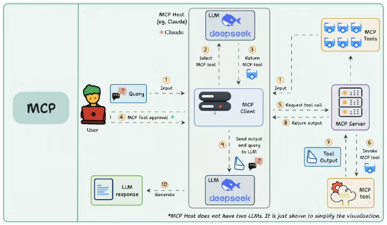
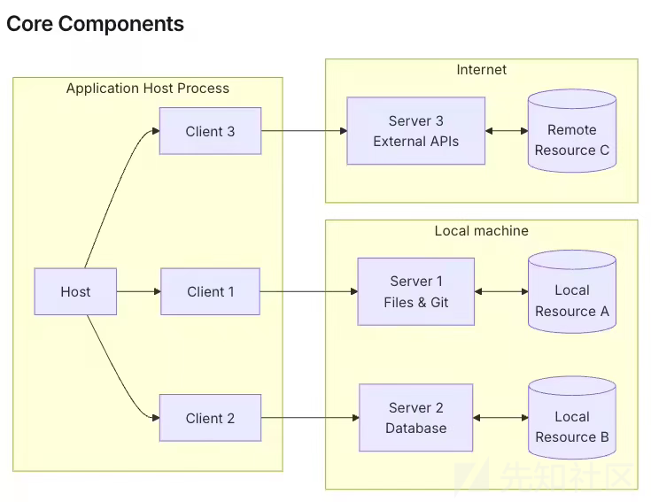
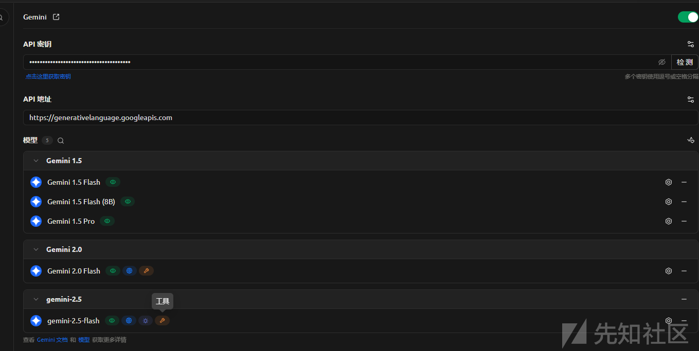
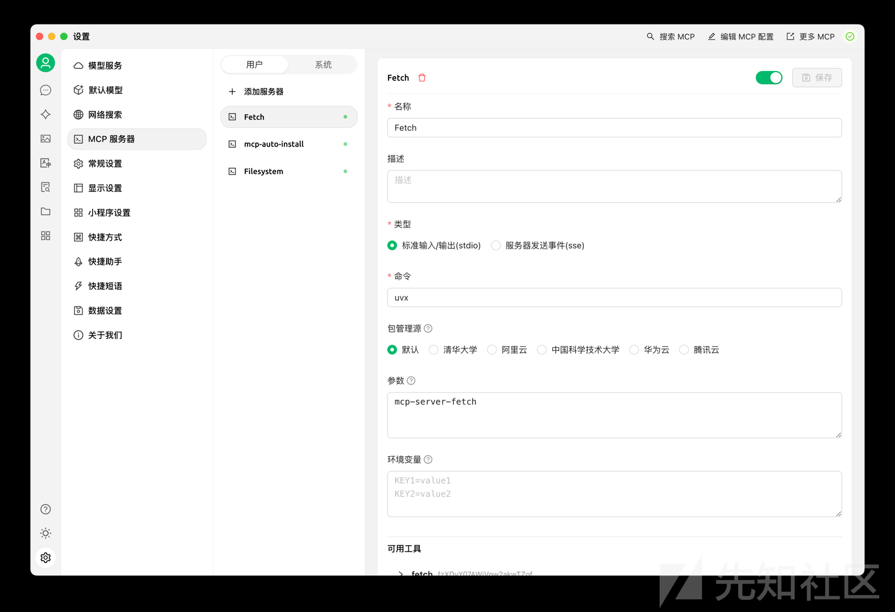
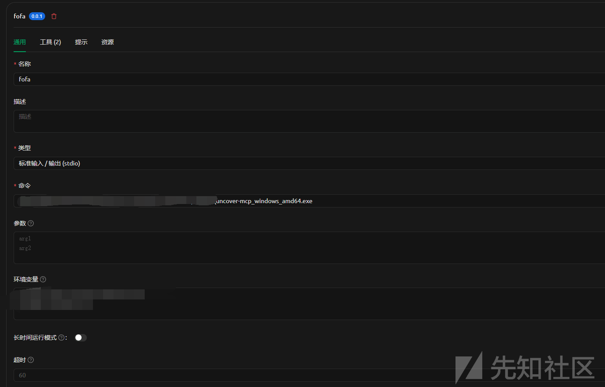
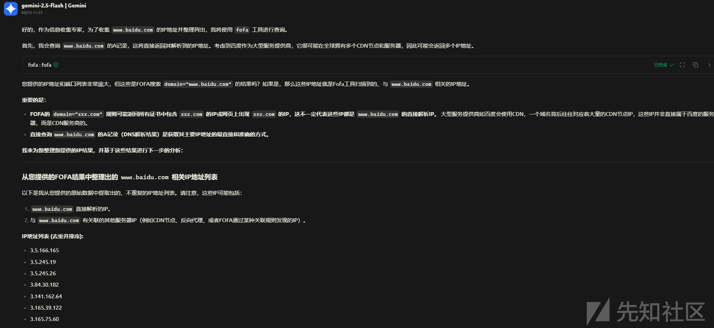
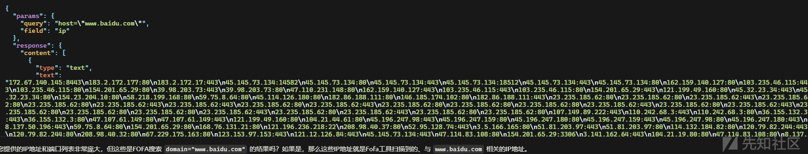
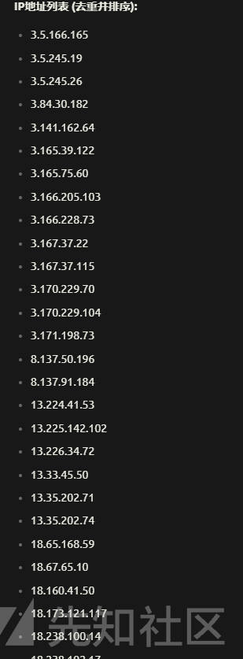

# FOFA 与 MCP 全流程实战：从交互聊天到信息收集解析-先知社区

> **来源**: https://xz.aliyun.com/news/18880  
> **文章ID**: 18880

---

# FOFA 与 MCP 全流程实战：从交互聊天到信息收集解析

## 前言

MCP 已经出现有一段时间了，MCP 在安全怎么玩，项目还是比较少，给 MCP 加上 fofa 的双手，如何做到呢？

## MCP 简单介绍

MCP （Model Context Protocol，模型上下文协议），定义了应用程序和 AI 模型之间交换上下文信息的方式，MCP 就是创建一个通用标准，让 LLM 可以统一地调用外部工具和数据源



MCP 的架构



MCP 分为 Host，Client，Server

一个非常详细的解释

Host 是整个系统中唯一与大型语言模型（LLM）直接交互的组件。其核心任务包括：管理完整的对话上下文、动态构建和拼接 Prompt、解析 LLM 的响应、根据 AI 决策生成与 MCP Server 交互的指令。简而言之，一个 MCP 应用的“智能水平”完全由其 Host 的实现质量决定。

Server 是一个标准的网络服务，它向外界声明并提供一组具有确定性的、可供远程调用的能力（Capabilities）。这些能力可以是工具调用、文件操作等（全量枚举源码里有）。Server 接收标准化的请求，执行相应的能力，并返回确定的结果。它不包含任何 AI 逻辑，其行为是可预测且可靠的。值得注意的是，工具调用只是其众多规划能力中的一种，尽管是目前最常用的一种。

Client 的角色最为纯粹，它是一个位于 Host 和 Server 之间的协议客户端和状态管理器。它严格实现了 MCP 的通信协议，负责处理协议握手、会话管理、心跳维持以及将 Host 的意图（如“调用某个工具”）转换为符合 MCP 规范的 JSON-RPC 请求并发送给 Server。它不关心业务逻辑，也不理解 AI 意图，仅作为连接 Host 与 Server 的标准化通信管道。

而我们主要关注 Server 部分，因为需要外加实现，各种工具能力都在 Server

## MCP 如何实现调用 Tool

我一直有这样一个问题，大模型是如何知道选择什么工具的呢，翻了源码  
参考官方的一个源码实现

ntextprotocol/python-sdk/tree/main/examples/clients/simple-chatbot/mcp\_simple\_chatbot

### 工具类实现

查看工具的实现部分

```
class Tool:
    """Represents a tool with its properties and formatting."""
    # 表示一个“工具”的类，包含工具的名称、描述、输入参数模式，并能格式化为 LLM 能读懂的字符串。

    def __init__(
        self,
        name: str,
        description: str,
        input_schema: dict[str, Any],
        title: str | None = None,
    ) -> None:
        # 初始化方法，接收工具的基本属性
        self.name: str = name                  # 工具的内部名称（唯一标识）
        self.title: str | None = title         # 可选的、对用户友好的标题
        self.description: str = description    # 工具的说明文字
        self.input_schema: dict[str, Any] = input_schema  # 工具的输入参数定义（一般是 JSON Schema）

    def format_for_llm(self) -> str:
        """Format tool information for LLM.

        Returns:
            A formatted string describing the tool.
        """
        # 把工具的元数据格式化成字符串，供 LLM 阅读和参考。

        args_desc = []
        if "properties" in self.input_schema:
            # 遍历输入参数 schema 的 "properties" 部分
            for param_name, param_info in self.input_schema["properties"].items():
                # 提取参数名和说明（如果没有说明就写 "No description"）
                arg_desc = f"- {param_name}: {param_info.get('description', 'No description')}"
                # 如果该参数在 required 列表里，就标记为必填
                if param_name in self.input_schema.get("required", []):
                    arg_desc += " (required)"
                args_desc.append(arg_desc)

        # 构建输出字符串，先写工具名
        output = f"Tool: {self.name}
"

        # 如果有用户可读的标题，就单独写一行
        if self.title:
            output += f"User-readable title: {self.title}
"

        # 拼接描述和参数列表
        output += f"""Description: {self.description}
Arguments:
{chr(10).join(args_desc)}
"""

        return output

```

可以看到一个工具包含名称，说明，参数，描述部分

之后还会把这些格式化加入

比如

```
Tool: web_search
User-readable title: Web Search
Description: Search the internet for information
Arguments:
- query: The search query (required)
- max_results: Number of results to return

```

### 启动部分

定义到 start 函数

```
async def start(self) -> None:
"""Main chat session handler."""
try:
    # 1. 初始化所有已注册的服务器
    for server in self.servers:
        try:
            await server.initialize()   # 异步初始化某个 server（可能是 MCP server）
        except Exception as e:
            logging.error(f"Failed to initialize server: {e}")
            await self.cleanup_servers()  # 初始化失败就清理资源
            return

    # 2. 收集所有 server 提供的工具（tool）
    all_tools = []
    for server in self.servers:
        tools = await server.list_tools()   # 从每个 server 拉取 tool 列表
        all_tools.extend(tools)

    # 3. 格式化所有工具的描述，用于构建 system prompt
    tools_description = "
".join([tool.format_for_llm() for tool in all_tools])

    # 4. 构建系统提示信息，告诉 LLM：有哪些工具，如何使用工具
    system_message = (
        "You are a helpful assistant with access to these tools:

"
        f"{tools_description}
"
        "Choose the appropriate tool based on the user's question. "
        "If no tool is needed, reply directly.

"
        "IMPORTANT: When you need to use a tool, you must ONLY respond with "
        "the exact JSON object format below, nothing else:
"
        "{
"
        '    "tool": "tool-name",
'
        '    "arguments": {
'
        '        "argument-name": "value"
'
        "    }
"
        "}

"
        "After receiving a tool's response:
"
        "1. Transform the raw data into a natural, conversational response
"
        "2. Keep responses concise but informative
"
        "3. Focus on the most relevant information
"
        "4. Use appropriate context from the user's question
"
        "5. Avoid simply repeating the raw data

"
        "Please use only the tools that are explicitly defined above."
    )

    # 聊天历史消息，初始时包含 system_message
    messages = [{"role": "system", "content": system_message}]

    # 5. 进入主聊天循环
    while True:
        try:
            # 从命令行读取用户输入
            user_input = input("You: ").strip().lower()
            if user_input in ["quit", "exit"]:
                logging.info("
Exiting...")
                break

            # 添加用户消息到会话历史
            messages.append({"role": "user", "content": user_input})

            # 调用 LLM（大模型），生成回复
            llm_response = self.llm_client.get_response(messages)
            logging.info("
Assistant: %s", llm_response)

            # 处理 LLM 回复，看是否是一个工具调用的 JSON
            result = await self.process_llm_response(llm_response)

            if result != llm_response:
                # 如果模型输出了一个工具调用请求
                messages.append({"role": "assistant", "content": llm_response})  
                messages.append({"role": "system", "content": result})  

                # 再次调用 LLM，让它把工具返回的数据变成自然语言回复
                final_response = self.llm_client.get_response(messages)
                logging.info("
Final response: %s", final_response)

                # 保存最终回复到会话历史
                messages.append({"role": "assistant", "content": final_response})
            else:
                # 如果只是普通回答，直接保存
                messages.append({"role": "assistant", "content": llm_response})

        except KeyboardInterrupt:
            logging.info("
Exiting...")
            break

finally:
    # 程序退出时，无论是否报错，都清理 server
    await self.cleanup_servers()

```

首先收集注册的 Tool，工具被汇总成一个描述文本，告诉大模型它能用哪些工具

构建了系统的提示词，定义了一个规范，告诉模型调用工具的时候必须是 JSON 格式，还有一些需要注意的事项

之后处理工具的调用

```
# 处理 LLM 回复，看是否是一个工具调用的 JSON
result = await self.process_llm_response(llm_response)
```

### 执行部分

```
async def execute_tool(
    self,
    tool_name: str,
    arguments: dict[str, Any],
    retries: int = 2,
    delay: float = 1.0,
) -> Any:
    """Execute a tool with retry mechanism.

    Args:
        tool_name: Name of the tool to execute.
        arguments: Tool arguments.
        retries: Number of retry attempts.
        delay: Delay between retries in seconds.

    Returns:
        Tool execution result.

    Raises:
        RuntimeError: If server is not initialized.
        Exception: If tool execution fails after all retries.
    """
    if not self.session:
        raise RuntimeError(f"Server {self.name} not initialized")

    attempt = 0
    while attempt < retries:
        try:
            logging.info(f"Executing {tool_name}...")
            result = await self.session.call_tool(tool_name, arguments)

            return result

        except Exception as e:
            attempt += 1
            logging.warning(f"Error executing tool: {e}. Attempt {attempt} of {retries}.")
            if attempt < retries:
                logging.info(f"Retrying in {delay} seconds...")
                await asyncio.sleep(delay)
            else:
                logging.error("Max retries reached. Failing.")
                raise
```

使用 call\_tool 进行调用实现好的工具

### 总结

首先定义工具在 MCP 中使用 @mcp.tool()装饰，然后其中会有工具的描述，工具名称，参数

然后 MCP 首先会收集所有的工具，并且格式化后，拼接到系统提示词中，告诉大模型，你可以使用这些工具，而且告诉了大模型，如果使用工具，必须使用规定的格式输出，也就和正常开放的前端一样，调用后端接口输出的数据，然后根据输出的 JSON 数据去判断合适的工具，然后如果工具返回结果，需要把输出做处理，各种处理就是让原生数据可读和清晰

## MCP FOFA 实现

<https://github.com/Co5mos/uncover-mcp>

使用 go 实现的一个项目，我们来分析分析

### 创建 MCP 服务端

```
s := server.NewMCPServer(
    "Uncover MCP",
    "0.0.1",
    server.WithLogging(),
)
```

### 添加 fofa

```
fofaTool := mcp.NewTool("fofa",
    mcp.WithDescription("Use FOFA search engine to find exposed hosts"),
    mcp.WithString("query",
        mcp.Required(),
        mcp.Description("FOFA search query"),
    ),
    mcp.WithNumber("limit",
        mcp.Description("Limit the number of results"),
    ),
    mcp.WithString("field",
        mcp.Description("Return field format (ip:port, host, ip, port)"),
    ),
)
s.AddTool(fofaTool, fofa.Handler)

```

可以看到主要有三个参数

query，也就是 fofa 的查询语句

limit 结果显示的限制

field 就是返回哪些东西

### Fofa 工具实现

也就是我们实际的处理部分

需要处理什么？

我们首先思考一下，其实就是各种参数

就是需要从输入中提取我们的各个参数部分

```
// Handler processes FOFA search requests from MCP
func Handler(ctx context.Context, request mcp.CallToolRequest) (*mcp.CallToolResult, error) {
    // Extract parameters from request
    query, ok := request.Params.Arguments["query"].(string)
    if !ok {
        return nil, fmt.Errorf("query parameter must be a string")
    }

    limit := 100 // default value
    if limitArg, ok := request.Params.Arguments["limit"]; ok {
        switch v := limitArg.(type) {
        case float64:
            limit = int(v)
        case int:
            limit = v
        }
    }

    // Create uncover options
    opts := uncover.Options{
        Agents:   []string{"fofa"},
        Queries:  []string{query},
        Limit:    limit,
        MaxRetry: 2,
        Timeout:  30,
    }

    // Initialize uncover client
    client, err := uncover.New(&opts)
    if err != nil {
        return nil, fmt.Errorf("failed to initialize uncover client: %v", err)
    }

    // Collect results
    var results []string
    resultCallback := func(result sources.Result) {
        results = append(results, result.IpPort())
    }

    // Execute query
    if err := client.ExecuteWithCallback(ctx, resultCallback); err != nil {
        return nil, fmt.Errorf("failed to execute FOFA query: %v", err)
    }

    // Return results
    resultText := strings.Join(results, "
")
    return mcp.NewToolResultText(resultText), nil
}
```

接受参数后使用 FOFA 引擎执行搜索，同时也会传入查询限制参数，然后收集结果，根据需求返回

可以看到是一个简单的实现，支持了查询 ip 端口

## 调用实现

我使用的是 cherry-studio

### 模型配置

首先配置一下自己的模型，不过模型必须有调用 MCP 的功能



### MCP 配置

然后配置 MCP 服务

参考<https://docs.cherry-ai.com/advanced-basic/mcp>





编辑好的路径和 fofa 的 key 和 email

之后新建机器人

### 调用实现



可以看到过程中调用了 MCP 的实现



首先成功解析了到我们的查询，就是域名，然后限制我们返回的是需要 IP

返回结果，再给 LLM，然后生成最终的回答，也就是整理之后的结果



参考<https://mp.weixin.qq.com/s/EcDCKN4-movoU2JgIqZSXg>  
<https://github.com/Co5mos/uncover-mcp>
