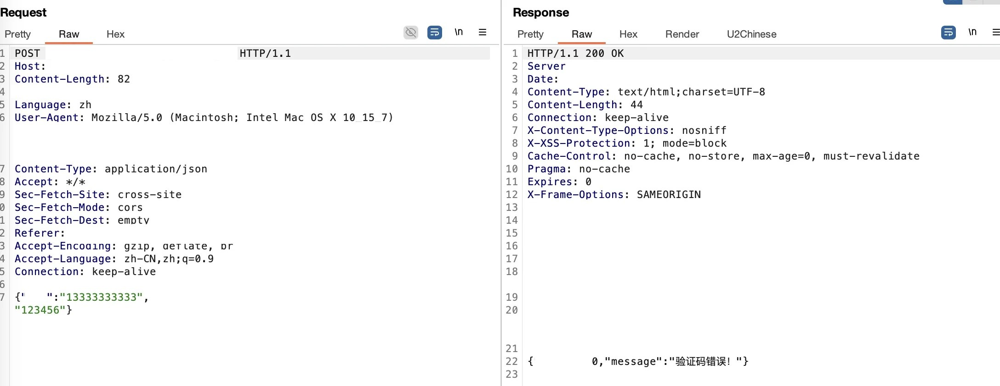
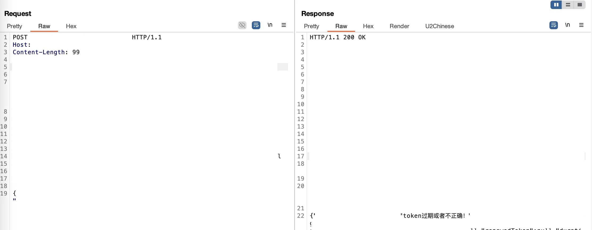
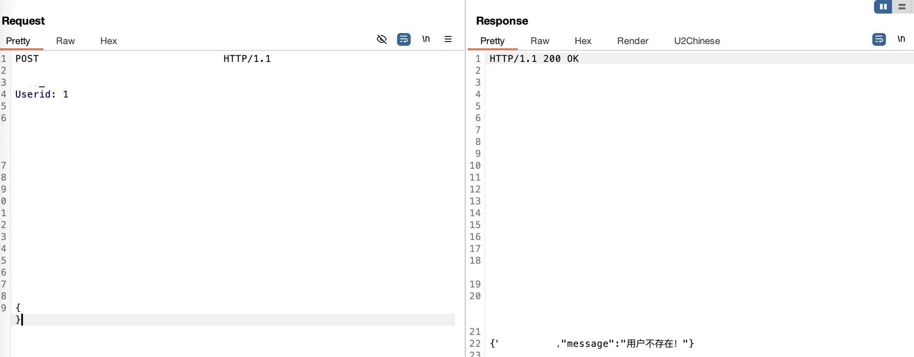
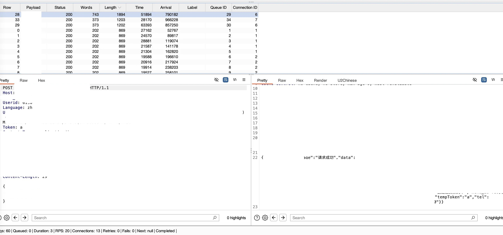

# 某移动端任意用户接管漏洞的发现与利用-先知社区

> **来源**: https://xz.aliyun.com/news/18889  
> **文章ID**: 18889

---

# 0x01 漏洞简介

最近在挖某SRC时，发现一个比较有意思的漏洞。这个漏洞允许我不需要任何认证就能接管此应用任意用户账号。漏洞的主要问题出在后端API的设计上，只需简单修改几个请求头参数，就能绕过整个认证​机制。

作为一个开发，我简单的猜测是由于开发偷懒，复用了接口来实现从而导致的"认证逻辑缺陷"，虽然原理简单，但危害巨大。

# 0x02 漏洞危害

1. 完全接管任意用户的账号，且账号是可以被遍历的。
2. 敏感信息泄漏：手机号、真实姓名、地址、身份证等大量敏感信息未脱敏显示。
3. 敏感操作，由于此站点存在不同权限的用户，高权限账号允许完成大量的敏感操作。

# 0x03 漏洞复现过程

## 挖掘过程

### 1. 初步观察与疑点

打开这个移动应用第一眼就发现它没有注册功能，只能登录。按理说外部人员不应该能进入系统。

*这里理应有登录界面，但是比较敏感就不放了*

登录需要使用验证码，尝试输入几个随机手机号和可能的万能验证码（6个6、8 个8之类的），都提示"验证码错误"，使用自己的手机号登录，会提未“非本系统用户”，这意味着服务端会校验用户，符合预期。

> 小技巧：挖掘小程序漏洞时，即使无法完成正常登录，也可以通过分析请求和响应来寻找潜在突破口。即便是错误信息也可能包含有用的线索。

### 2. 代码审计与端点搜索

那既然无法登录，那就只能尝试看看是否存在未授权的接口了，直接反编译应用，搜索已知的登录接口名称，然后根据API规则，写个脚本将所有的接口提取出来，然后扔到BP跑一轮。

很不幸的是，所有的接口均存在权限校验，返回的结果都是“token过期或者不正确”：

​

那就这么放弃吗？是的，当时我确实已经放弃了！但是过了几天之后，我又看到了这个APP，我又有了一个想法：我最起码需要看一下它的验证方式是什么，万一在Token上存在什么问题呢？

### 3. 分析鉴权机制

再次对代码进行审计，通过分析，可以知道除了登录以外的所有的正常接口请求中都需要包含两个关键请求头：

* Userid: 用户标识符
* Token: 认证令牌

这是“常见的”基于令牌的认证方式，登录之后获取到对应的用户Token，服务器通过这两个值验证用户身份。

为什么常见的需要打引号？因为这个Userid在这里就有点不合理了，一般来说，我们只需要Token就可以完成鉴权操作了，通过Token自然可以获取到对应的用户，前端传递Userid的作用在哪里？

### 4. 再次验证

既然不知道，我们就只能试一下了，随便找了一个接口，尝试随机构造Userid和Token进行请求，发现还是一样的，提示“token不存在或者已失效”，而且不论我们对Userid 头进行修改或删除，都没有任何影响，那意味着核心的鉴权令牌还是Token请求头。 那Userid完全没作用？

如果有过开发经验，相信都有了解过**奥卡姆剃刀原理**。这个参数既然存在，那就必然有它应用的场景，只是我没有发现而已。我决定再跑一轮所有的接口，不过这次不同的是，我会在所有的请求中都加上这两个参数，看看是不是会有什么不一样的发现。

​

### 5. 发现异常响应

这次跑完之后，我发现一个有趣的现象：登录接口居然返回了“用户不存在”：

​

这很有意思，正常登录接口应该只验证手机号和验证码，但它现在却在尝试根据我提供的Userid查找用户。这说明登录接口不仅是提供了登录功能，可能还有其它的功能。

于是我做了几个实验：

1. 传入超大数值的Userid引发了未知错误
2. 传入字符串类型的Userid返回未知错误
3. 传入不同的Token值对响应没影响

这确认了两点：Userid是整型，而且我可以遍历它来寻找有效用户。

> 小技巧：发现疑似整型ID时，尝试传入-1、0、非常大的值等边界情况或者字符串，通过异常要吧了解系统实现。

### 6. 发现关键漏洞

既然是整形ID，那么FUZZ起来就比较简单了，写了个简单的Python脚本开爆，从0开始，每左移一位，随机取10^n个数，很快就找到几个有效ID。

当使用有效的Userid值发送请求时，系统返回了完整的用户信息和一个tempToken，而这个tempToken正是我们通过Token请求头传递的Token，这意味着：**系统允许将我随意提供的Token值绑定到任何有效用户ID上**，相当于直接创建了一个"后门"。

​

这意味着登录接口存在严重的逻辑缺陷：它同时承担了普通登录和令牌续期（猜测）两种功能，且在令牌验证过程中仅检查用户ID的有效性，而没有验证令牌本身。

### 7. 完全接管测试

接下来就简单了，使用获取到的有效Userid和系统返回的tempToken，所有功能都能正常访问：

*数据太敏感，假装这里有图*

但是到这里只是一个普通用户，但是从登录的返回值中，可以看到有一个type字段，这一般用于标识用户的类型，这意味着大概率存在不同权限的用户区分，如果可以获取到管理员的账号权限，那可以显著的提升危害。

一般情况下，对于这种自增ID的账号，那肯定是找最开始的ID，越小越好，因为早期注册的用户往往是管理员或者测试账号，权限更高。 那后面的处理就比较简单了，找到之前FUZZ出来的ID最小的账号开始往前遍历，直到找到最小的可用账号为止。

## 为啥会有这个漏洞？

拆解一下这个漏洞的本质：

1. 接口职责混淆：登录接口不当地兼具普通登录和令牌验证双重功能
2. 权限校验缺失：系统未验证用户对所请求ID的访问权限
3. 会话管理不当：允许任意Token值与有效用户ID绑定，无需验证原有凭证

我猜测可能是开发者为了方便APP端的"记住登录状态"功能，给登录接口加了这个双重职责，但没考虑到安全影响。

# 0x04 修复建议

这类逻辑漏洞往往不需要复杂技术，只需要对应用流程有深入理解和系统性思考，通过合理的安全设计可以有效避免此类问题。

### 职责分离

* 登录接口仅处理账号验证和初始令牌发放
* 令牌刷新/验证应使用独立接口，且必须验证原令牌有效性

### 加强认证机制

* 登录接口不应处理Userid和Token请求头
* 使用标准令牌格式（如JWT），加入过期时间机制
