# CVE-2024-35250：ks.sys驱动中基于属性反序列化的提权漏洞分析-先知社区

> **来源**: https://xz.aliyun.com/news/18904  
> **文章ID**: 18904

---

# 0x00 漏洞信息

1. 漏洞编号：CVE-2024-35250

2. 漏洞介绍：该漏洞存在于ks.sys 驱动程序中对属性请求的处理中。具体来说，当提供 KSPROPERTY\_TYPE\_UNSERIALIZESET 标志时，可以启动一系列操作，最终导致任意 IOCTL 调用。在此过程中，用户提供的缓冲区被复制到新分配的空间中，并在未经适当验证的情况下执行。导致有一个允许我们执行任意 IOCTL\_KS\_PROPERTY 操作的原语，这使得该缺陷成为权限提升攻击的主要目标。

**​**

# 0x01 基本概念

ks.sys 是 Windows 操作系统中的一个核心驱动程序，它属于 Kernel Streaming (KS) 子系统。Kernel Streaming 提供了一种在内核级别处理多媒体流数据的方法，使得应用程序能够高效地访问音频和视频硬件。这个驱动程序对于多媒体功能的正常运行非常重要，因为它允许操作系统与声卡、摄像头等设备进行通信。

1、ks.sys 的功能

实时媒体流处理：它支持实时传输和处理音频和视频流。

低延迟：通过直接在内核级别操作，它可以提供较低的延迟，这对于游戏、视频会议和其他需要即时反馈的应用来说至关重要。

资源管理：ks.sys 也参与了多媒体设备资源的管理和分配。

​

2、ks.sys 的问题

如果 ks.sys 出现问题，可能会导致以下几种情况：

音频或视频播放异常。

系统蓝屏（Blue Screen of Death, BSOD）。

多媒体相关设备无法正常工作。

​

3、目的

ks.sys 的主要目的是为了提供一个高性能的接口来处理音频和视频流，使得这些流能够以尽可能低的延迟和最小的 CPU 使用率进行传输。这对于需要高精度时间同步的应用程序来说非常重要，比如数字音频工作站（DAWs）、专业视频编辑软件以及游戏等。

​

4、IRP结构

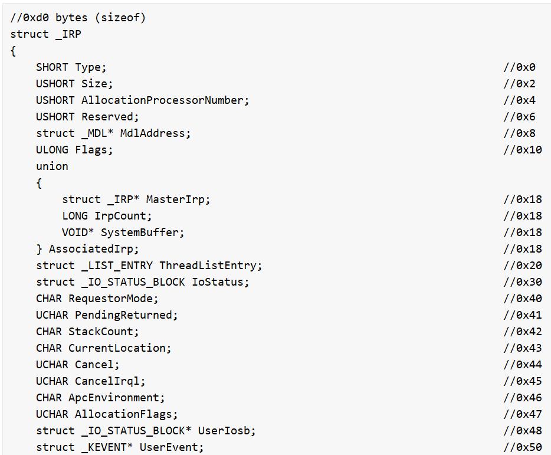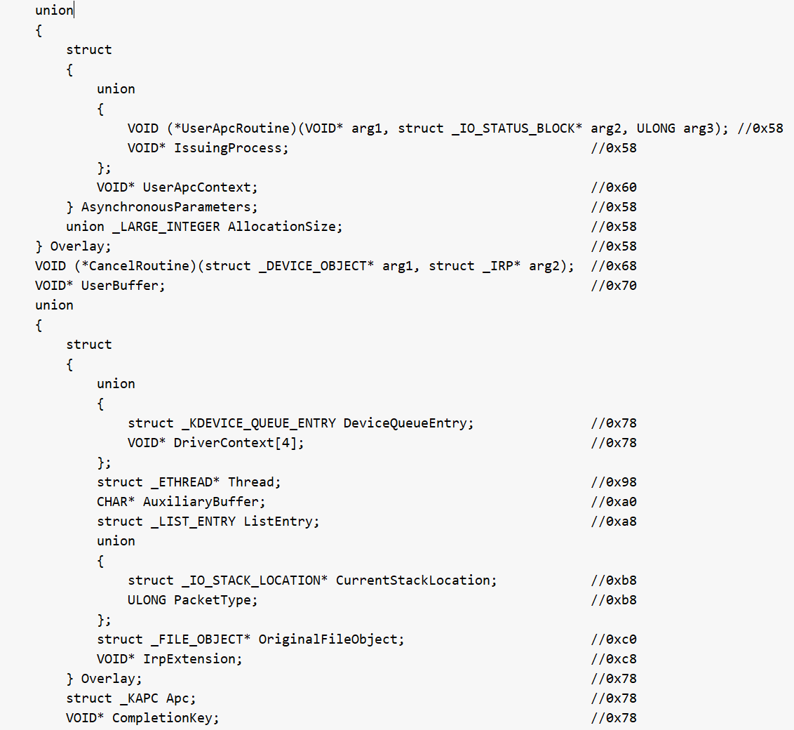

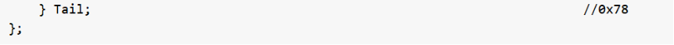

# 0x02 工具、环境

1. 调试工具：IDA pro x64 windbg x64

2. 目标机：Windows 10.0.19044.1415 关闭windows defender的实时防护模式、云查杀模式和自动提交样本功能

3. 目标模块：ks.sys ksthunk.sys

4. 配置好双机调试模式

​

# 0x03 利用代码

总共有两种提权的方法，首先介绍第一种，针对于PreviousMode。

​

1、GetObjPtr 函数，获得内核对象地址

该函数用于通过进程ID（ulPid）和句柄值（handle）获取内核对象的地址（ppObjAddr），返回值为操作状态（成功为0，失败为错误码）。核心依赖Windows未公开的NtQuerySystemInformation API。

​

关键操作

（1）动态缓冲区分配

NtQuerySystemInformation 需要精确的缓冲区大小。首次调用时故意传入ulBytes=0触发STATUS\_INFO\_LENGTH\_MISMATCH，通过循环逐步扩大缓冲区直至成功。

​

（2）句柄信息查询

SystemHandleInformation 类请求返回所有进程的句柄表，包含每个句柄的所属进程ID（UniqueProcessId）、句柄值（HandleValue）和内核对象地址（Object）。

​

（3）匹配逻辑

遍历句柄表，通过ulPid和handle匹配目标句柄，提取其指向的内核对象地址到ppObjAddr。注意：句柄值需强制转换为unsigned short，因系统返回的是低16位有效值。

​

（4）资源管理

使用HeapAlloc/HeapReAlloc/HeapFree管理内存，避免内存泄漏。HEAP\_ZERO\_MEMORY标志确保缓冲区初始化为零

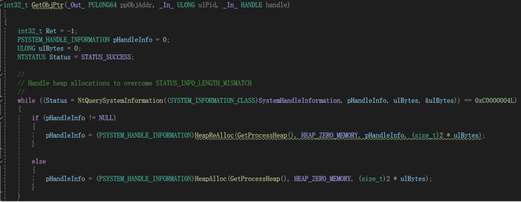

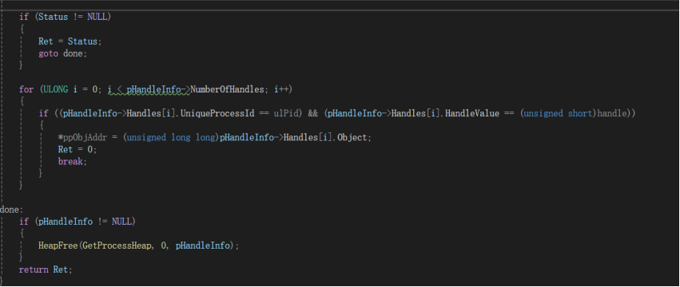

2、获得当前进线程对象地址

该代码段通过GetObjPtr函数泄露内核对象地址（如\_EPROCESS和\_KTHREAD），并初始化一个用于内核漏洞利用的输入/输出缓冲区结构。核心目标是获取系统关键数据结构的内核地址，为后续提权或内存篡改做准备。

​

（1）通过OpenThread获得线程句柄，然后通过GetObjPtr得内核结构。进程的获得方法同理。

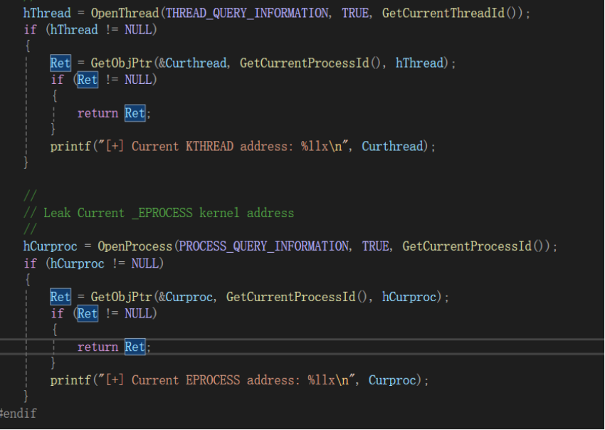

（2）初始化输入buffer时设置属性集为DRM音频流，标记为反序列化属性集，可能作用于音频驱动。通过调用AllocateBitmap在0x10000000地址处申请为fakeBitmate结构，将位图指针返回。

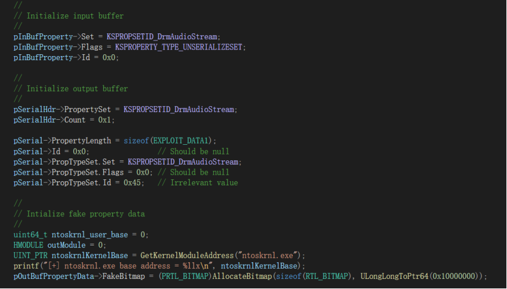

（3）在位图各数据位赋值，将Buffer处赋值为线程加特定偏移指向线程的Previousmode，调用leak\_gadget\_Address获得RtlClearAllBits函数地址用于后续将线程Previousmode覆写为0（kernelmode）

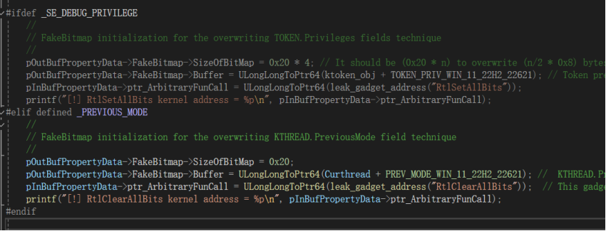

3、AllocateBitmap 函数

该函数用于在指定基地址（baseAddress）处分配一块可读写（PAGE\_READWRITE）的虚拟内存区域，模拟伪造的RTL\_BITMAP结构，常用于内核漏洞利用中实现任意内存读写操作。

​

（1）内存分配机制

VirtualAlloc参数解析：

baseAddress：若指定非NULL值，系统会尝试从该地址开始分配（需对齐到64KB边界）；若为NULL，系统自动选择合适地址。

MEM\_COMMIT | MEM\_RESERVE：同时保留虚拟地址空间并提交物理存储（如分页文件），确保内存立即可用。

PAGE\_READWRITE：允许后续代码对内存进行读写操作，为漏洞利用中篡改内核数据提供条件。

​

（2）伪造RTL\_BITMAP的目的

RTL\_BITMAP是Windows内核中管理位图的数据结构，包含大小和位图缓冲区指针。通过伪造该结构并配合驱动漏洞，可诱使内核将其视为合法对象，进而实现：

任意地址读写：通过修改伪造的RTL\_BITMAP指针，指向目标内核地址。

内存布局操控：精确控制分配地址（如baseAddress）以绕过ASLR防护。

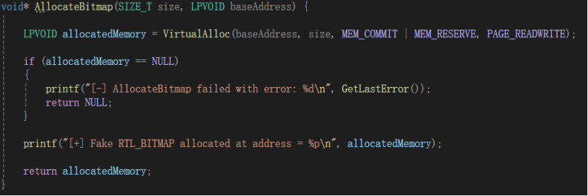

4、leak\_gadget\_address 函数

函数用于通过用户态模拟加载内核模块（ntoskrnl.exe），获取指定Gadget（如RtlClearAllBits）的符号地址，并计算其在内核中的实际地址。核心原理是通过用户态与内核态模块的基址偏移转换，实现内核Gadget地址的动态泄露。

​

（1）用户态模块加载

使用LoadLibraryExW 加载 ntoskrnl.exe 并设置 DONT\_RESOLVE\_DLL\_REFERENCES 标志，避免解析依赖项，仅获取模块基址。

注意：用户态加载的内核模块代码不可执行，仅用于符号地址解析。

​

（2）符号地址解析

GetProcAddress 获取Gadget（如 RtlClearAllBits）在用户态模块中的偏移地址。

​

（3）内核基址泄露

GetKernelModuleAddress 需通过其他技术（如驱动通信、内核漏洞或硬件寄存器读取）获取内核中 ntoskrnl.exe 的实际基址，绕过KASLR（内核地址空间布局随机化）。

​

（4）地址转换公式

通过用户态与内核态的模块基址差，将用户态符号地址转换为内核实际地址

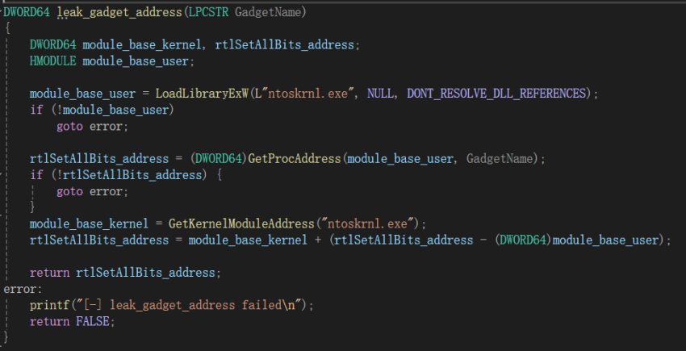

5、触发&&收尾

目的：通过DeviceIoControl函数发送向内核层发送请求，将我们构造好的输入输出缓冲区以IRP的形式传递过去。

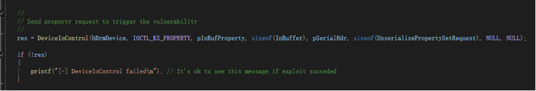

然后通过调用Write64函数，用系统的token替换掉当前进程的token进行提权，并且将当前线程的PreviousMode恢复成用户态，因为要确保后面的cmd进程的创建被视为用户态请求，如果不修改回去会导致状态不匹配导致崩溃。

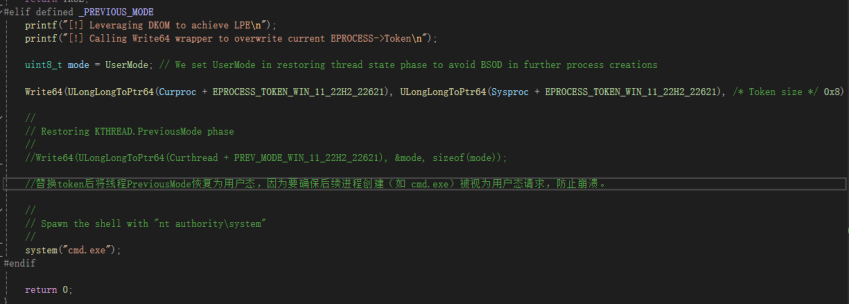最后通过system启动system权限的cmd进程。

​

接下来是另外一种，从高权限进程创建新进程

1、调用OpenProcessToken函数获得当前进程的token句柄，然后传入token句柄获得token的地址到ktoken\_obj变量中。

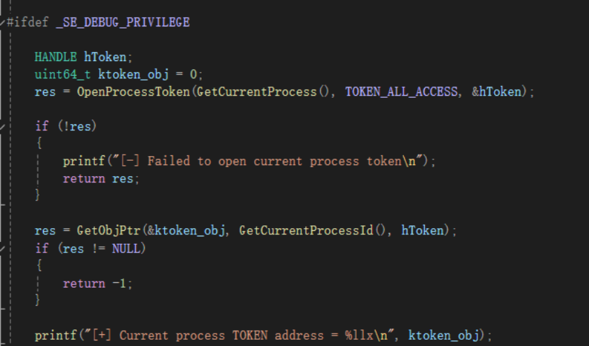

2、将token地址加特定偏移指向Privileges字段放到伪造位图的Buffer，并且将RtlSetAllBits函数地址放到构建的数据结构中

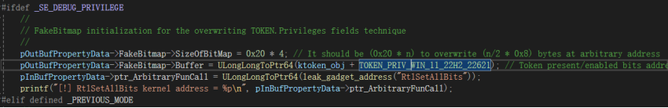

3、通过GetPidByName函数获取winlogon的进程ID，再通过OpenProcess获取进程句柄，然后调用CreateProcessFromHandle，创建cmd进程。

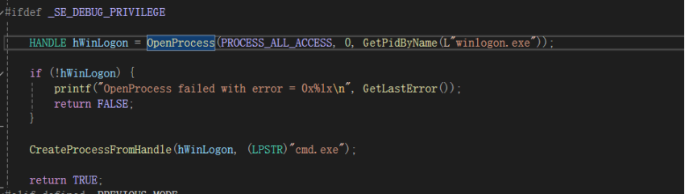

4、GetPidByName函数，通过CreateToolhelp32Snapshot函数获取所有进程信息，然后进行枚举匹配获得进程ID。

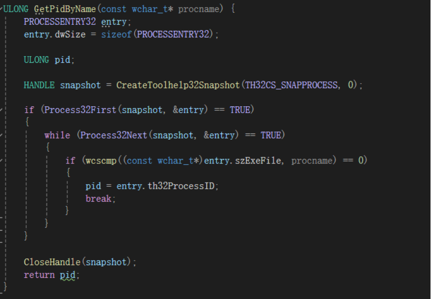

5、CreateProcessFromHandle函数核心目标是通过指定父进程句柄（HANDLE Handle）创建新进程，并执行命令行指令（LPSTR command）。其实现依赖 Windows 的 扩展进程属性机制（PROC\_THREAD\_ATTRIBUTE\_PARENT\_PROCESS）

（1）初始化扩展启动信息结构（STARTUPINFOEXA）

目的：支持进程属性列表（LPPROC\_THREAD\_ATTRIBUTE\_LIST），用于传递特殊属性。

关键步骤：

ZeroMemory(&si, sizeof(STARTUPINFOEXA)); // 清空结构体

si.StartupInfo.cb = sizeof(STARTUPINFOEXA); // 明确结构体大小（必须）

此处清零操作确保无残留数据，避免属性传递错误。

​

（2）构建进程属性列表（Attribute List）

作用：指定新进程的父进程句柄，突破默认继承关系。

流程分解：

A. 计算属性列表所需大小：InitializeProcThreadAttributeList(NULL, 1, 0, &size); // 获取缓冲区大小

B. 分配堆内存：si.lpAttributeList = (LPPROC\_THREAD\_ATTRIBUTE\_LIST)HeapAlloc(GetProcessHeap(), 0, size);

C. 初始化属性列表：InitializeProcThreadAttributeList(si.lpAttributeList, 1, 0, &size);

D. 设置父进程属性：

UpdateProcThreadAttribute(

si.lpAttributeList,

0,

PROC\_THREAD\_ATTRIBUTE\_PARENT\_PROCESS, // 关键属性

&Handle, // 传入的父进程句柄

sizeof(HANDLE),

NULL,

NULL

);

关键点：PROC\_THREAD\_ATTRIBUTE\_PARENT\_PROCESS 强制新进程以 Handle 为父进程，而非调用者进程。

​

（3） 调用CreateProcessA 创建新进程

参数解析：

ret = CreateProcessA(

NULL, // 可执行文件路径（NULL表示从命令行解析）

command, // 命令行字符串（如 "cmd.exe /c dir"）

NULL, NULL, // 进程/线程安全属性（默认）

TRUE, // 允许句柄继承（关键！）

EXTENDED\_STARTUPINFO\_PRESENT | CREATE\_NEW\_CONSOLE, // 标志位

NULL, NULL, // 环境变量/工作目录（继承父进程）

reinterpret\_cast<LPSTARTUPINFOA>(&si), // 扩展启动信息

&pi // 输出进程/线程信息

);

​

关键标志位：

EXTENDED\_STARTUPINFO\_PRESENT：启用扩展启动信息（支持属性列表）。

CREATE\_NEW\_CONSOLE：为新进程创建独立控制台窗口。

​

​

句柄继承（bInheritHandles=TRUE）：

确保新进程继承父进程（即 Handle 指向的进程）的可继承句柄（如管道、文件等）。

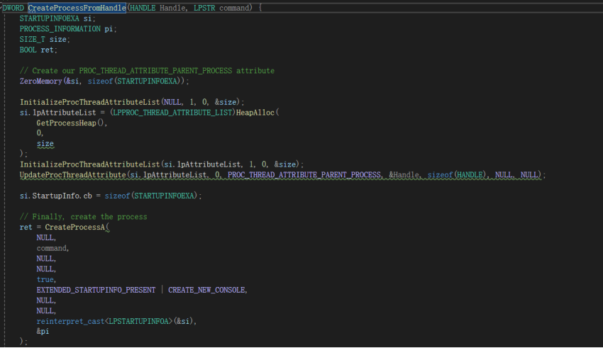

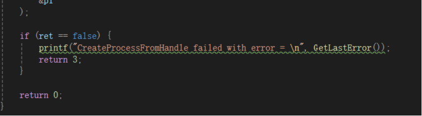

此时，当前进程token的Privileges字段已经被置为高权限，那么此时就有足够的权限去开启winlogon进程，winlogon进程权限是系统权限，所以最后由于上面的进程权限继承设计，启动的cmd也就具有系统权限。

​

# 0x04 调试分析

1. 调用链

UnserializePropertySet

KsSynchronousIoControlDevice //RequestMode置为0

CKSThunkDevice::DispatchIoctl

\_\_fastcall CKSThunkDevice::CheckIrpForStackAdjustmentNative //调用函数指针

RtlClearAllBits

2、断点

bp ks!UnserializePropertySet

bp ks!KsSynchronousIoControlDevice

bp ksthunk!CKSThunkDevice::DispatchIoctl

bp ksthunk!CKSThunkDevice::CheckIrpForStackAdjustmentNative

bp nt!RtlClearAllBits

CheckIrpForStackAdjustmentNative部分代码

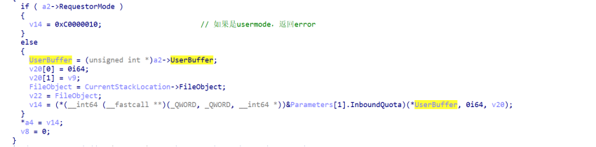

可以看到如果是usermode就直接返回error，如果是kernelmode则会去将我们传入的userbuffer作为函数参数去执行。

​

那么也就是说如果能够使得requestmode是kernelmode的话，就可以执行用户层传过来的函数指针并且第一个参数是可控的。

​

v5 = \*(\_QWORD \*)(a1 + 24);

// 从 a1+0x18 获取 SystemBuffer 地址

v6 = \*(\_QWORD \*)(a1 + 0xB8);

// 从 a1+0xB8 获取 CurrentStackLocation

​

3、首先断点断在UnserializePropertySet函数

SystemBuffer

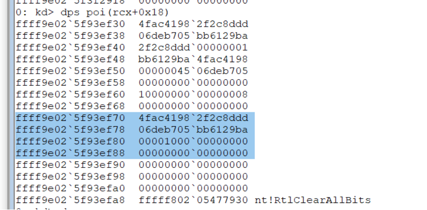

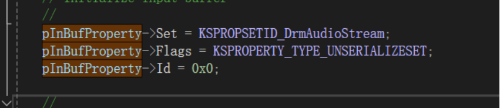

一一对应上。

​

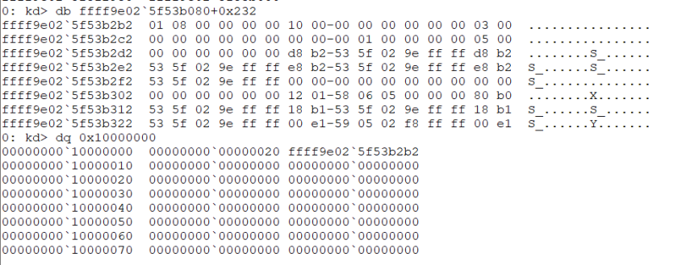

0x10000000位置放的是FakeBitmap->SizeOfBitMap(0x20)

和FakeBitmap->Buffer(KTHREAD.PreviousMode field address) 此时是1 即用户态

​

这个伪造的位图结构，被当作RtlClearAllBits函数的第一参数，然后在RtlClearAllBits函数内部，将KTHREAD.PreviousMode field address进行取值，并调用memset，将后四位置为0，从而实现了用户态向内核态的转换。

​

PreviousMode 决定了内核如何验证线程发起的请求。若为 UserMode（1），内核会严格检查用户态传入的指针和缓冲区（如通过 ProbeForRead/Write 验证内存有效性）；若为 KernelMode（0），则跳过这些检查，默认参数来自可信的内核源。

4、断点接下来断在ks!KsSynchronousIoControlDevice，查看r9，即第四个参数，发现内部是将上一层函数，即ks!UnserializePropertySet中的IRP的input复制到PoolWithTag传递下来

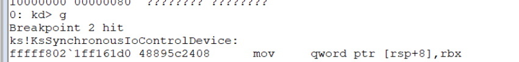

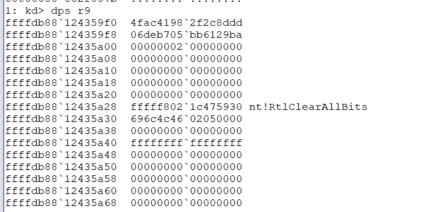

并且可以从IDA可以看到，从UnserializePropertySet函数中调用时传入的requestmode为0，即kernelmode，这也就导致下面CKSThunkDevice::CheckIrpForStackAdjustmentNative函数中恶意函数指针的执行。

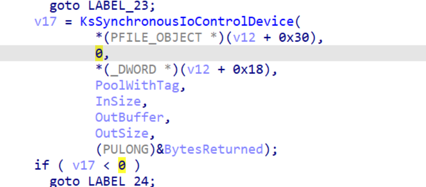

5、接下来断点断在ksthunk!CKSThunkDevice::DispatchIoctl。

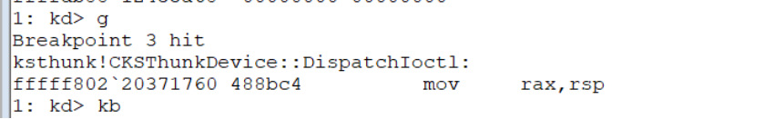

Kb查看栈回溯，看到调用链非常清晰。

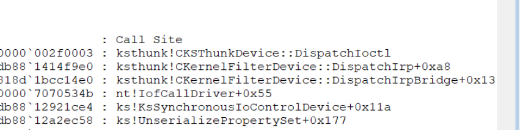

从IDA中可以看到

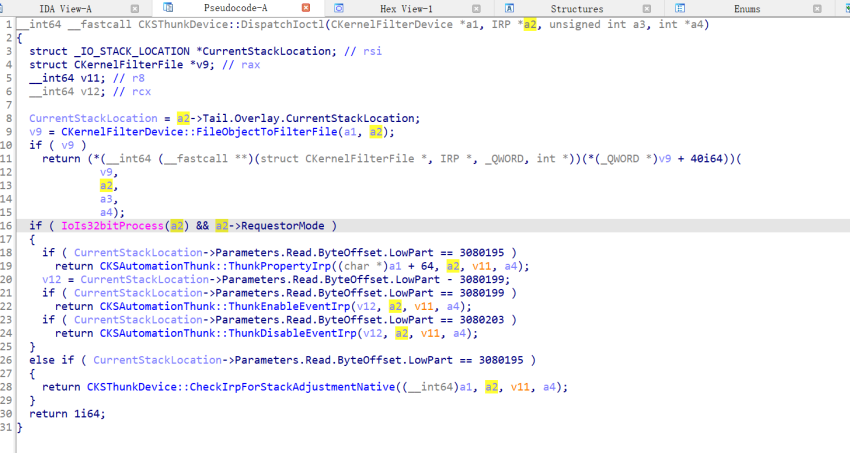

64位的话会调用CKSThunkDevice::CheckIrpForStackAdjustmentNative函数，并将a2（IRP）进行传入。

接下来断点断在ksthunk!CKSThunkDevice::CheckIrpForStackAdjustmentNative

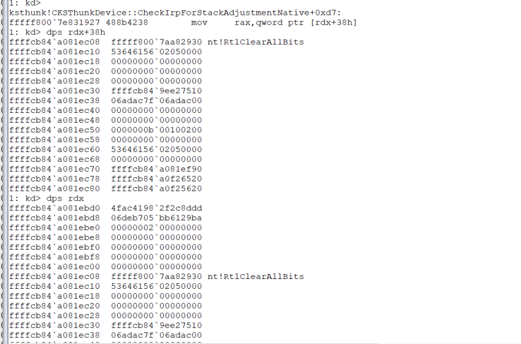

可以看到能够执行到+0xd7的位置，并且调用了rdx+0x38，也就是RtlClearAllBits函数指针，根据下面ida代码看也就说明此时的requestmode为0，即kernelmode，并且看到UserBuffer这个值作为调用RtlClearAllBits的参数，是从用户层传过来的，可以追踪到。

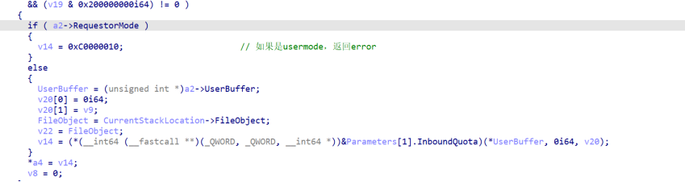

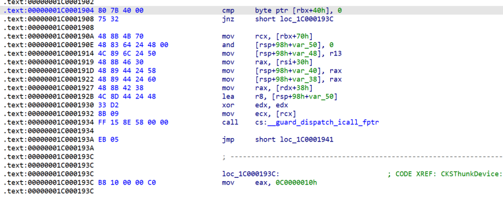

可以看到UserBuffer来自a2，也就是IRP加偏移。

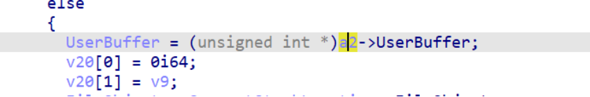

看汇编是rbx+0x70

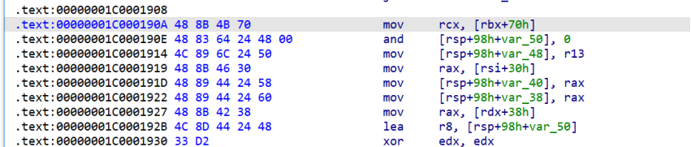

6、接下来在windbg中查看里面的数据，可以看到rbx+0x70处是一个指针，这个指针指向一个很熟悉的地址（0x0000000010000000），没错，查看这个地址后看到是我们的伪造位图结构，里面指向的是线程token的PreviousMode位，也就是说接下来就会调用RtlClearAllBits函数将其置为0，赋予线程权限去访问内核数据从而最终实现进程token替换。

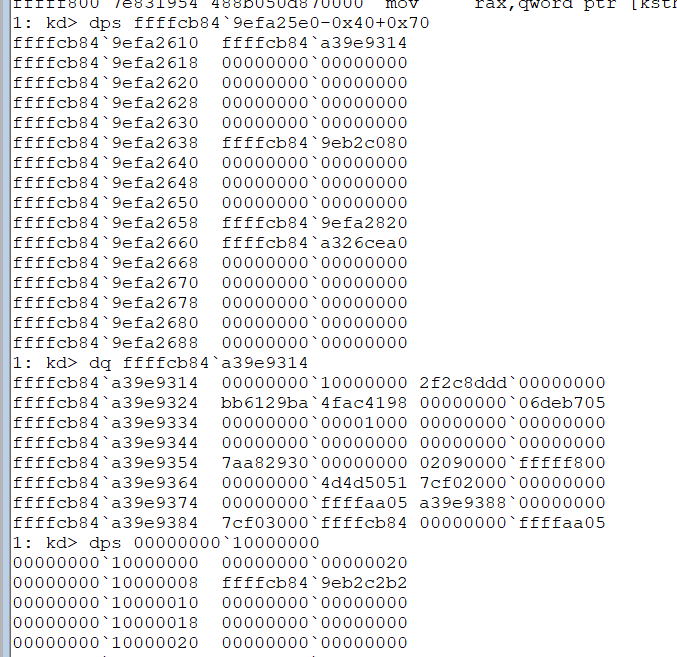

​

7、接下来去断点断到RtlClearAllBits函数，查看参数列表，看到rcx指向的就是位图地址。

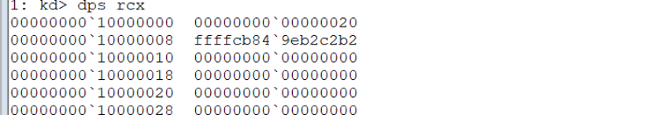

可以看到函数内部操作是，将rcx+8赋给rcx，然后后面调用了memset。

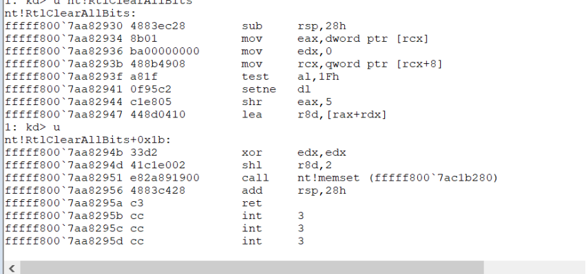

这是调用memset之前的

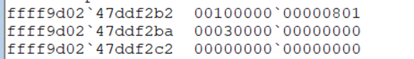

这是运行完memset之后

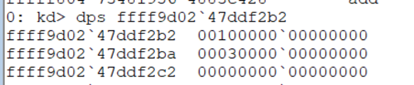

8、接下来查看进程token

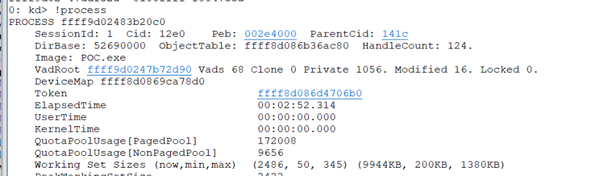

9、然后断点断在第二次nt!NtWriteVirtualMemory，exp中调用了两次，第一次是替换token，所以断点断在第二处NtWriteVirtualMemory，再次查看进程token，发现当前进程token已经被替换为系统进程token。

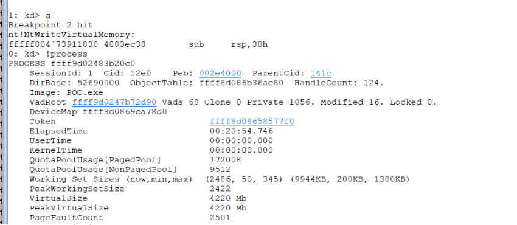

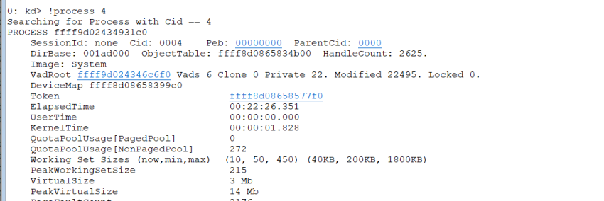

至此完成权限提升。

​

​

下面分析第二种情况，即以高权限进程创建cmd达到提权的效果。

第二种相比于第一种方法，改变的是传到内核层的函数指针以及函数指针的参数不同，函数指针为RtlSetAllBits，参数是当前进程token的权限位，因为要打开权限位才能够打开winlogon这个系统进程。

​

接下来依旧断点先断在ks!UnserializePropertySet

然后再下断点在nt!RtlSetAllBits

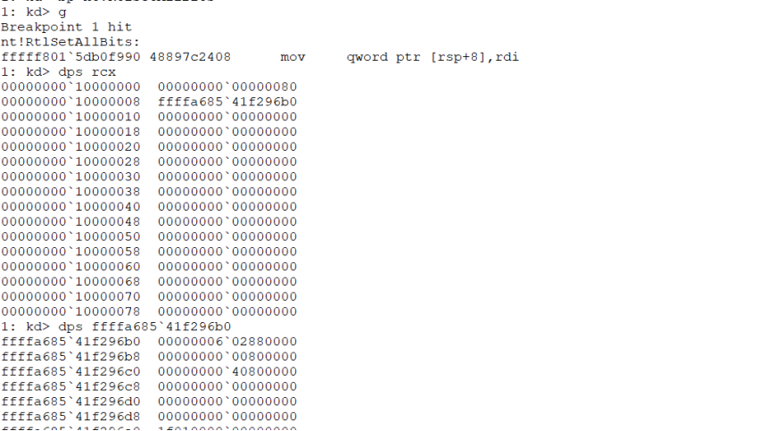

单步执行到ret前，发现将缓冲区所有数据设置为 0xFF（全1），意味着权限全开。

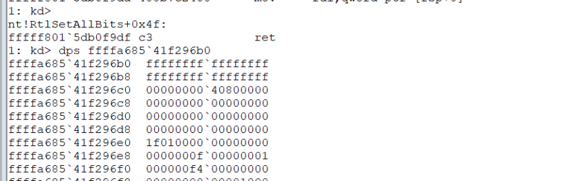

至此准备工作完成，后续成功开启winlogon进程并创建高权限的cmd进程，完成提权。

​

# 0x05 复现结果

第一种

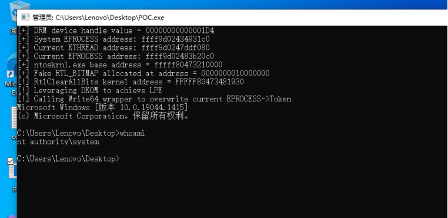

最后实现是本线程执行system(“cmd”)

​

第二种

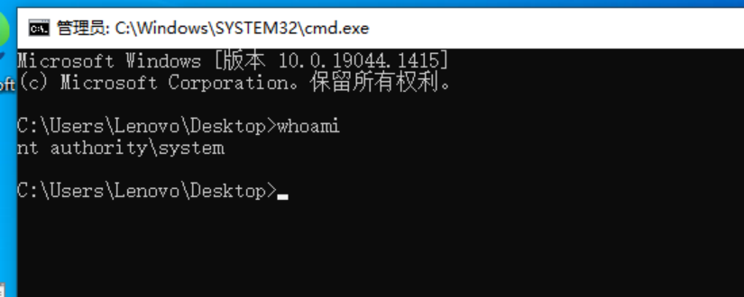

最后实现是以winlogon进程又创建一个新的cmd进程。
