# 大模型安全落地-模型训练安全-先知社区

> **来源**: https://xz.aliyun.com/news/18908  
> **文章ID**: 18908

---

# 前言

模型训练安全是大模型安全体系中的核心环节，它关注的是在模型训练过程中可能出现的各类安全风险及其防护措施。随着大模型规模和复杂度的不断提升，训练过程中的安全问题日益凸显，主要表现在训练环境安全、训练算法安全、训练过程监控以及防止模型能力滥用等方面。

近期业界曝光了多起模型训练安全事件。例如AI研究机构的训练集群遭受网络攻击，导致训练中断和部分中间结果泄露；另有研究表明，通过精心设计的对抗训练策略，攻击者可以诱导模型学习有害知识或产生偏见；还有案例显示，训练过程中的参数窃取可能导致知识产权泄露，造成巨大经济损失。还有研究人员发现某些训练框架存在后门漏洞，可被远程利用实施模型投毒攻击。

模型训练安全是确保大模型可信可控的关键环节，只有建立健全的训练安全保障体系，才能从源头上防范大模型安全风险。随着大模型技术的不断演进，模型训练安全技术也将持续发展，为大模型的安全落地提供更加坚实的技术支撑。在本文中，我们对这些安全基础与理论支撑进行梳理。下文的每小结是以模型训练期间可能出现的风险作为标题，而每个子标题则是可以应对这些风险的典型措施。

​

​

# 数据投毒与后门攻击（Data Poisoning & Backdoor Attacks）

数据投毒与后门攻击是针对AI模型训练过程的一种高级威胁。攻击者通过向训练数据中注入精心设计的恶意样本（如触发词、特定模式等），使得模型在部署后在特定输入下触发预设行为（如输出错误响应或泄露信息），形成"后门"效应。这类攻击隐蔽性强，难以通过常规测试暴露。

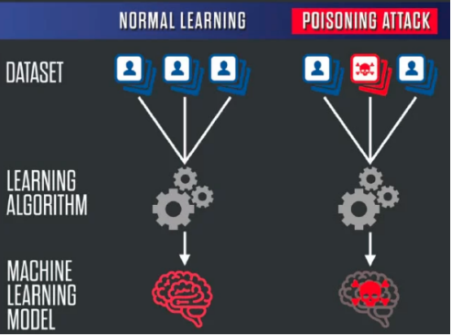

## 训练数据审计与异常样本检测

聚类分析作为一种有效的技术手段，可以通过识别数据分布中的异常群体，揭示潜在的投毒样本。在高维特征空间中，数据点的分布往往揭示了数据的内在规律，异常样本通常会偏离这一主流分布，从而被识别出来。利用聚类算法（如K-means或DBSCAN）对数据进行划分，可以在这些簇中找出与大多数数据点显著不同的样本群体。

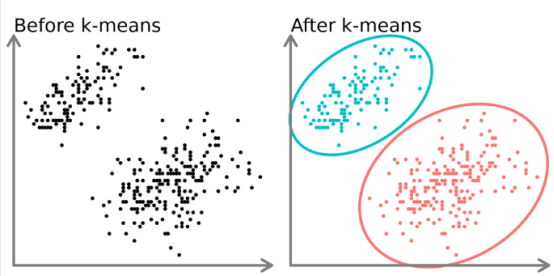

此外，异常点检测算法如孤立森林（Isolation Forest）和局部异常因子（Local Outlier Factor, LOF）被广泛应用于检测数据中的异常点。这些算法通过评估样本点与其邻域的关系，量化样本的"异常度"，从而筛选出潜在的投毒数据。具体而言，孤立森林算法通过递归地构建随机树，孤立度较高的点即为潜在异常样本，公式如下：

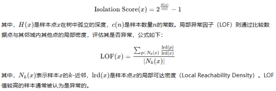

在处理文本数据时，可以借助主题建模（如 LDA）和语义一致性分析等技术来识别那些与整体语料风格或语义不一致的异常内容。主题建模会分析每段文本在不同主题上的分布，如果某些文本与主流主题偏差较大，就可能是异常或被投毒的数据。语义一致性分析则是通过计算文本与已有语料之间的相似度，判断它是否“格格不入”，从而挖掘出潜在问题。

对于图像数据，也有类似的检测手段。可以利用视觉特征提取或卷积神经网络来分析图像的内容，识别其中不符合常规模式的异常样本。如果攻击者通过“图像水印”或微小图案隐藏触发器，结合水印检测等技术也可以有效识别这些隐蔽的攻击手段。为了让这种数据审查机制长期有效，还需要建立一个动态更新的“异常模式库”，记录和总结各种已知的投毒攻击方式及其特征。这个库相当于系统的“记忆”，能帮助识别未来可能出现的新型攻击。一旦出现新变种，只需更新模式库，系统就能快速适应。

此外，自动检测手段虽然高效，但也有盲区，因此定期进行随机抽样和人工审核仍然非常必要。人工的判断能力可以弥补自动工具在识别微妙语义偏差或非典型攻击方面的不足，进一步提升整个系统对投毒行为的检测准确性和鲁棒性。

## 对抗训练与鲁棒性增强技术

对抗训练与鲁棒性增强技术是提升模型抵御后门攻击及其他安全威胁的重要手段。对抗训练的核心思想是在训练过程中引入对抗样本，使模型能够识别和抵抗潜在的异常输入。具体来说，通过生成对抗样本，模型不仅能够学习到正常样本的分布，还能学会如何应对偏离正常分布的输入，从而提升其鲁棒性。

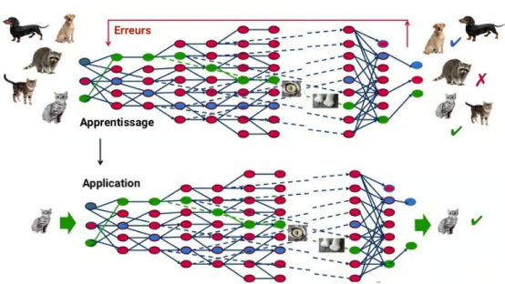

在对抗训练中，常见的生成对抗样本的方法包括基于梯度的攻击方法（如快速梯度符号法，FGSM，和投影梯度下降法，PGD），基于优化的攻击方法，及通过生成模型（如GANs）生成的对抗样本。以FGSM为例，生成对抗样本的过程可以通过以下公式表示：

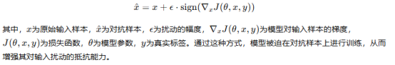

除了对抗训练之外，鲁棒性正则化技术也在增强模型的抗干扰能力方面发挥着重要作用。常见的鲁棒性正则化方法包括引入噪声层、dropout增强和特征平滑等技术。这些方法能够降低模型对特定特征的过度依赖，增强其泛化能力。例如，dropout方法通过在训练过程中随机丢弃部分神经元，迫使模型学习更加稳健的特征表示，从而减小对噪声和异常输入的敏感性。

为了确保鲁棒性训练的有效性，实践中应将对抗训练与常规训练相结合。在训练过程中，通过适当的对抗样本与正常样本的混合使用，可以在保持模型性能的同时，提升其对恶意输入的防御能力。此外，定期进行鲁棒性评估和压力测试也是必不可少的环节。这些评估和测试能够帮助验证增强措施的有效性，并根据测试结果及时调整防御策略，以应对日益复杂的安全威胁。

​

## 后门检测机制

后门检测是识别已训练模型中潜在安全隐患的关键技术，特别是在模型可能遭受后门攻击时。后门攻击通常通过在训练过程中植入特定的触发器，使得模型在遇到特定输入时输出异常结果。有效的后门检测机制能够帮助发现这些隐患并采取相应的修复措施。几种常用的后门检测技术，包括神经激活分析、触发器搜索、语言模型敏感性分析以及模型修剪与重构。

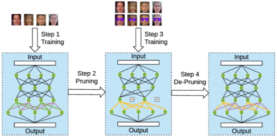

神经激活分析是一种有效的后门检测方法，其核心思想是通过分析模型内部神经元对不同输入的激活模式，发现异常的激活路径。具体实现上，可以提取模型中间层的激活值，并应用降维技术如t-SNE（t-Distributed Stochastic Neighbor Embedding）或UMAP（Uniform Manifold Approximation and Projection）对激活分布进行可视化，从而识别可能的异常聚类。这些异常聚类可能反映出与后门触发器相关的激活模式。例如，若某些输入模式引发了神经元异常激活，且该激活模式与正常输入显著不同，则可疑后门行为便可被识别。神经激活分析的数学表达可以为：

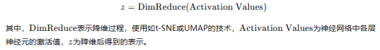

触发器搜索则通过反向优化方法，寻找能够激活特定模型行为的输入模式。这一技术通常使用遗传算法或梯度上升法来生成触发器样本。遗传算法模拟自然选择的过程，生成多个可能的触发器并评估其对模型行为的影响；而梯度上升法则通过优化输入样本，使其能够激活模型的特定行为。在梯度上升法中，触发器生成过程可通过以下公式表示：

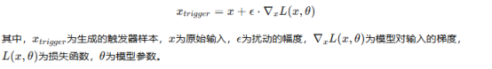

对于语言模型，后门检测可以通过扫描特定词汇或短语组合对模型输出的影响，发现异常敏感点。这些敏感点可能表明模型在某些特定的输入模式下存在潜在的后门。例如，通过在输入中加入特定的触发词汇或短语，观察模型是否会产生异常的输出，进而揭示可能存在的后门。

模型修剪与重构则是一种有效的后门检测手段，通过逐层分析不同神经元对模型行为的贡献，识别并移除可能与后门相关的神经元路径。通过这种方式，可以有效去除模型中可能携带的后门组件。修剪过程通常依据每个神经元或神经网络通道对最终输出的贡献度进行排序，去除不必要或可疑的部分。该过程的数学描述可为：

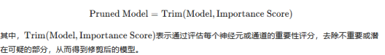

在实施层面，后门检测应建立自动化的后门扫描流程，作为模型部署前的必要安全检查。这些自动化工具能够高效地识别模型中的潜在后门风险，并生成检测报告。然而自动化工具可能会存在误报或漏报的情况，因此，结合人工审核对检测结果进行验证是必要的。人工审核可以深入分析检测结果中的潜在问题，降低误报率，并提升后门检测的准确性和可靠性。通过自动化与人工审核相结合的方式，可以在保证模型性能的同时，确保其安全性。

​

​

## 差异性测试

差异性测试旨在通过比较不同版本训练数据和模型的行为差异，识别潜在的后门或数据投毒攻击。其核心思想是通过对比多个模型或数据集在同一输入下的响应，揭示异常行为的潜在指示。这种测试方法可以有效地帮助发现模型在训练过程中可能被恶意篡改的迹象，从而防范后门攻击的风险。

在实施层面差异性测试通常从多个训练数据子集入手。每个子集可以通过随机抽样或按特定属性（如类别、特征分布等）划分形成。接着，针对每个子集训练独立的模型，并对它们的行为进行对比。如果在同样的输入下，不同版本的模型输出存在显著差异，这可能是由于数据集中存在投毒样本或后门触发器。例如在某些输入下，某个模型可能出现异常的决策或输出模式，提示潜在的后门问题。差异性测试的数学描述可以为：

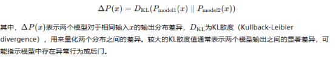

模型集成技术也是差异性测试的一个重要手段。通过集成多个独立训练的模型，能够有效地降低单一模型中后门的影响。例如，通过使用投票机制或加权平均的方式将多个模型的输出结合起来，可以使得单个模型中的异常行为不容易主导最终决策，从而增强模型对后门攻击的鲁棒性。在集成模型中，各个子模型的输出可以通过以下方式进行融合：

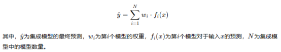

对于已部署的模型，可以通过A/B测试（即对照实验）比较不同版本的模型在相同输入下的输出差异，特别关注那些导致显著行为变化的输入。例如，可以分别部署原始模型和更新后的模型，并使用相同的数据进行评估，比较两者在输出分布上的差异。通过A/B测试，可以帮助检测由于模型更新而可能引入的新后门或异常行为。

​

在技术实现方面，自动化差异分析工具的开发尤为重要。这些工具可以通过计算模型响应的统计差异，量化评估模型行为的变化。例如，使用JS散度（Jensen-Shannon divergence）或KL散度来度量不同版本模型在输出分布上的差异，进一步分析模型行为的变动。这些工具能够高效地识别出微小的变化，从而帮助检测潜在的后门或投毒攻击。

差异性测试应当成为模型更新流程中的标准环节。每次模型更新都可能引入新的后门风险，因此，定期进行差异性测试，确保更新后的模型未引入新的异常行为，是保障模型安全的有效手段。通过系统化的差异分析，可以帮助发现隐藏在模型中的异常行为模式，为后门防御提供重要的线索，进一步提升模型的安全性和可靠性。

​

# 模型参数污染与梯度操控（Gradient Manipulation & Weight Tampering）

在分布式训练或多方协同训练（如联邦学习）中，攻击者可能通过提交恶意梯度更新污染全局模型参数，导致模型性能下降或引入隐性偏差。

## 安全聚合机制

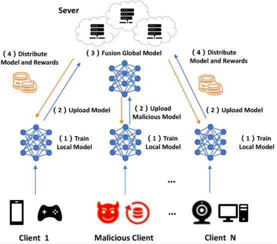

安全聚合机制是防范恶意梯度攻击的重要手段，尤其在联邦学习等分布式训练环境中，模型聚合环节通常是攻击者的目标。恶意梯度攻击通过向模型提交错误的梯度信息，试图影响全局模型的更新。因此，确保聚合过程的安全性对保护训练过程至关重要。

在众多安全聚合策略中，Krum算法是一种较为有效的方法。其基本思想是通过计算每个客户端提交的梯度与其他客户端梯度的欧氏距离，从而选择距离总和最小的梯度进行聚合，理论上可以有效地过滤离群点。具体来说，给定每个客户端的梯度向量 g i，Krum算法计算每个梯度与其他所有梯度的欧氏距离：

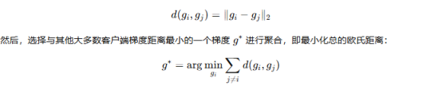

通过这种方式，Krum算法能够有效地抑制异常梯度的影响，选择最具代表性的梯度更新模型。

另一个常见的聚合方法是Trimmed Mean，它通过对每个参数位置的梯度进行排序，去除极端值（即最小和最大的一定比例），然后取剩余值的平均。这一过程的公式可以表示为：

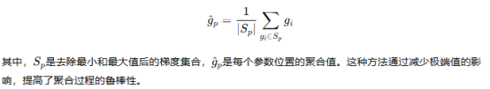

Median聚合则是最为简单而且稳健的方案，它直接选择每个参数位置的所有梯度的中位数作为聚合结果。由于中位数天然具有对异常值的抗干扰能力，因此在面对恶意梯度攻击时，Median聚合能够保持较高的稳定性。其计算过程如下：

这种方法的优势在于无需对梯度进行排序或计算距离，且对恶意样本不敏感，能够自动滤除极端值。

在实际应用中，选择适当的聚合策略通常依赖于攻击者的比例以及模型的特性。对于较小规模的攻击者或较为简单的模型，Median聚合可能足够有效；而对于具有较高攻击性或复杂模型的场景，Krum或Trimmed Mean可能更为合适。此外，动态组合多种聚合方法也是一种有效的策略。通过动态调整聚合方法，系统可以根据当前训练过程的实际情况选择最合适的聚合策略，增强模型的安全性。

## 同态加密与安全多方计算

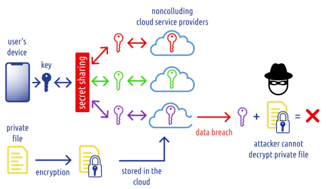

同态加密和安全多方计算（MPC）是为分布式训练提供密码学保障的两种核心技术，它们通过确保数据隐私和计算安全，解决了多方协作中的信息泄露和信任问题。

同态加密是一种特殊的加密技术，它允许在加密数据上直接执行计算，而无需解密中间结果。这样，梯度信息在训练过程中的传输和聚合可以保持加密状态，从而保护数据的机密性。特别地，部分同态加密（PHE）是一类常用的同态加密方案，它允许在加密数据上执行特定类型的运算。例如，Paillier加密是一种支持加法操作的同态加密方法，其加密和解密过程如下：

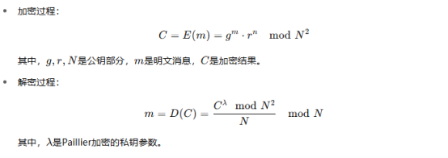

通过使用Paillier加密，能够在加密状态下进行加法运算。具体到分布式训练中的梯度聚合，可以使用Paillier加密来加密各个客户端提交的梯度，服务器对加密后的梯度进行加法操作，得到最终的加密结果，从而保证每个参与者的梯度信息始终保持私密。

安全多方计算（MPC）是一种基于密码学协议的技术，使多个参与方能够在不泄露彼此私有数据的前提下共同计算一个函数的结果。在联邦学习等分布式学习场景中，MPC协议特别有用，因为它允许将梯度信息通过秘密分享（Secret Sharing）技术进行分散存储。具体而言，MPC通过将每个数据片段分散到多个服务器或参与方中，仅在一定数量的参与方协作时才能恢复原始数据或结果。例如，基于Shamir秘密分享的协议可将一个秘密数据分成多个部分，并将这些部分分别发送给多个服务器：

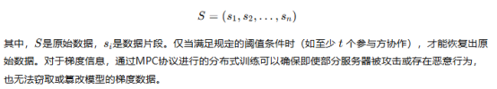

虽然同态加密和MPC技术能够有效保护数据隐私，但它们通常会带来较大的计算和通信开销。加密计算往往比明文计算更加耗时，MPC协议也要求多方进行协调与交互，增加了训练过程中的延迟。然而，随着专用硬件加速（如基于FPGA的加速器）和优化算法（如高效的加密运算和共享协议）的发展，这些技术的性能瓶颈正在逐步得到缓解。

在高敏感场景（如医疗和金融领域），密码学保护已成为分布式AI训练的标准配置。通过同态加密和MPC技术，能够在防范外部攻击的同时，有效解决多方协作中的互信问题。例如在医疗数据共享中，医院可以在不暴露病人隐私的情况下与研究机构合作训练AI模型，确保数据的机密性和安全性。

​

​

## 贡献度评估机制

贡献度评估机制是用于识别恶意参与方和优化资源分配的系统化方法，特别适用于多方协作训练场景。在这种分布式学习环境中，不同参与方的数据质量和行为诚信度存在显著差异，因此动态评估每个参与方的贡献不仅有助于剔除恶意节点，还能提升训练过程的效率和最终模型的性能。

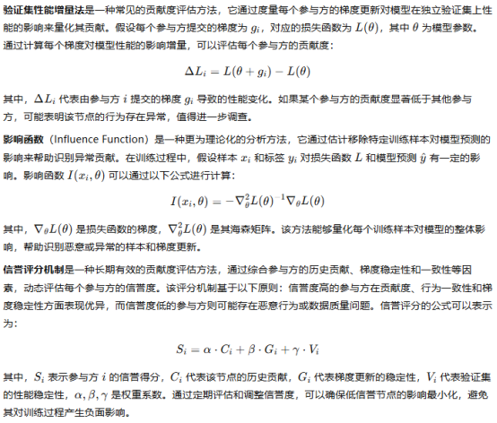

贡献度评估机制不仅能够有效防范恶意攻击，还能通过优化资源分配和提高参与方的积极性，提升整体训练效率和模型性能。通过动态评估、信誉评分和激励机制的结合，可以在多方协作的训练过程中确保数据和行为的可信度，从而保障模型训练的安全性和高效性

​

​

# 模型训练过程中的资源劫持与恶意代码注入

训练过程通常涉及大量计算资源（如GPU/TPU集群），若训练环境未隔离或存在配置漏洞，攻击者可能实施资源劫持、恶意代码注入或横向移动，影响训练完整性甚至外泄模型参数。

## 容器隔离与最小权限原则

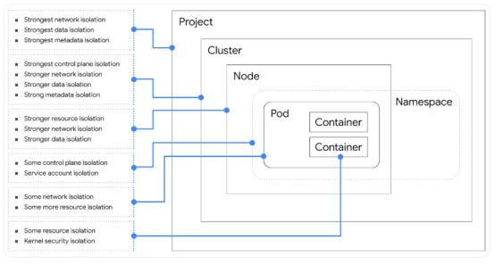

容器隔离是构建安全训练环境的重要基础。在大模型训练平台中，应充分利用容器化技术，如 Docker 或 Kubernetes，为每个训练任务提供一个独立、受控的运行空间，从而实现资源隔离和精细化的访问控制。

在资源配置方面，每个容器应设定明确的 CPU、内存和 GPU 使用上限，防止个别任务异常消耗系统资源，影响整体平台运行。在权限管理上，应严格遵循最小权限原则，仅赋予容器完成任务所需的基本权限，限制其对网络、文件系统挂载点以及系统调用的访问范围。

针对对安全性要求较高的任务，可以选用更强隔离能力的容器技术，如 gVisor 或 Kata Containers，进一步强化执行环境与宿主系统之间的隔离边界。对于支持多用户并发训练的平台，还需引入租户级别的隔离机制，确保不同用户的任务彼此独立，互不干扰，防止数据和权限交叉渗透。容器镜像应在部署前进行严格的安全扫描，配合签名验证机制，防止未经授权或含有恶意代码的镜像被加载进平台。

通过构建由资源限制、权限约束、镜像安全与租户隔离组成的多层防护体系，可以有效防止资源抢占、权限提升和横向攻击等风险，为大模型训练提供一个安全、稳定、可控的基础运行环境。

​

## 代码完整性校验与环境哈希追踪

保障代码完整性，是防止训练过程中出现恶意注入的关键一环。训练平台应具备完善的代码签名与验证机制，确保实际运行的训练脚本与事先审核通过的版本完全一致，从源头上杜绝篡改和替换的风险。

在实际操作中，可以通过加密哈希算法（如 SHA-256）对训练代码、依赖项和配置文件生成唯一指纹，并结合内部公钥基础设施（PKI）或可信第三方签名机制，对这些指纹进行数字签名。每次训练启动前，系统会自动验证签名是否匹配，若发现任何未经授权的改动，立即阻止其执行。还可以引入环境哈希追踪机制，通过定期扫描运行环境并记录其状态指纹，监测是否存在异常变更。这一手段可以有效识别在训练过程中被动态注入的恶意代码或非预期的环境修改。

在分布式训练场景下，还需进一步强化一致性校验，确保所有节点运行的是统一版本的代码与环境，避免某些节点被单独篡改而引发安全漏洞。

在代码部署过程中应贯彻“不可变基础设施”理念：一旦训练正式启动，环境应保持冻结状态，禁止任何动态修改，任何版本更新都必须经过重新签名、验证和部署流程。

​

通过这一系列严格的完整性控制措施，可以大大降低训练平台在执行过程中遭遇恶意篡改或注入攻击的风险，为模型安全打下坚实基础。

​

# 模型参数与中间状态的泄露风险

在训练过程中，模型参数、梯度、中间激活值等信息如果未被妥善保护，可能被利用进行模型反演攻击或训练数据恢复攻击，造成训练数据或模型知识的泄露。

## 参数传输加密处理

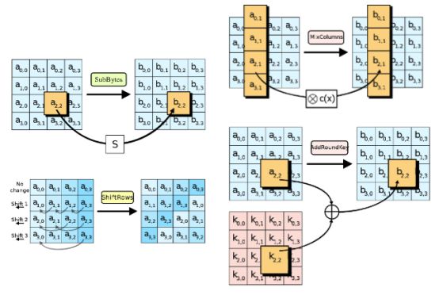

在保障模型训练过程安全的众多手段中，参数传输加密是防止网络监听和中间人攻击的第一道防线。尤其是在分布式训练中，模型的参数和梯度信息需要在多个计算节点之间频繁流动，如果这些信息以明文形式传输，就可能被攻击者在网络中截获，带来严重的隐私和安全风险。

因此在实际部署中，应构建多层次的加密机制。最基础的是使用传输层安全协议（如TLS），为通信通道提供端到端的加密保障，防止数据在传输过程中被篡改或泄露。对于更敏感的应用场景，还可以在此基础上增加一层应用层加密，例如使用AES-256等高强度对称加密算法对参数内容进行额外加密，进一步提高防护等级。

与此同时，密钥管理的安全性同样至关重要。应确保密钥的生成、分发和定期更换都有规范流程，避免长期使用固定密钥所带来的风险。在高安全要求场合，可以引入硬件安全模块（HSM）来存储和管理密钥，实现物理隔离，增强整体防护能力。

在涉及多方参与、跨组织协作的训练任务中，还需借助非对称加密机制来完成密钥交换，确保各方在通信开始前能安全共享密钥，不暴露在潜在风险中。

只有构建起完整且稳固的参数传输加密体系，才能从根本上遏制网络层面的窃取行为，为分布式训练过程提供坚实的安全保障。

​

## 差分隐私机制

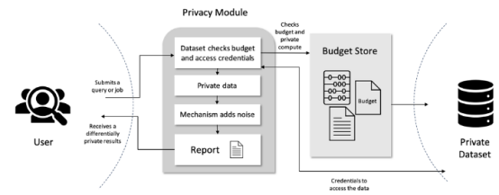

差分隐私用于防止模型受到反演攻击和成员推断攻击。简单来说，它的核心思想是在不改变数据的整体统计特性的前提下，给数据添加一些精心设计的随机噪声，从而限制模型对某一个特定样本的过度依赖。这样，即使攻击者获取了模型的输出，也难以准确地推断出训练数据中的某个样本信息。

在实际应用中，差分隐私通常通过两种技术来实现：梯度裁剪和噪声添加。首先，梯度裁剪是对每个样本计算的梯度进行控制，确保单个样本对最终模型训练的影响不会过大。具体做法是限制每个样本的梯度范数，使得它不会超出一个预定的最大值。然后，噪声添加是向聚合后的梯度上加入符合某种分布（比如高斯分布或拉普拉斯分布）的随机噪声。这些噪声使得模型在训练过程中对单一数据点的依赖变得不那么强烈，从而提高隐私性。

差分隐私提供了一个量化的隐私保障方法，其中的隐私预算（ε值）用于控制隐私保护的强度和模型效果之间的平衡。较小的ε值意味着更强的隐私保护，但也可能导致模型性能的损失。因此，如何设置合适的ε值是一个重要的选择。

对于大型语言模型（如聊天机器人），一种常见的做法是采用用户级差分隐私，即将同一用户的多条数据视为一个整体进行保护，而不是单条数据。这种方法更加贴合实际应用中的隐私需求。

在具体实施差分隐私时，我们还需要根据数据的敏感性和应用场景来调整隐私参数。比如，对于医疗记录等高敏感度的数据，需要更严格的隐私保护。虽然差分隐私可能会对模型性能产生一定影响，但随着算法的不断优化和训练规模的扩大，这一影响正在逐渐减小。因此，差分隐私有望成为在敏感场景下进行模型训练的标准配置。

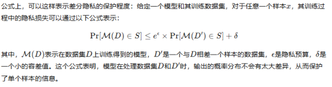

## 模型压缩与知识蒸馏

​

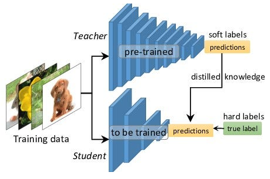

模型压缩和知识蒸馏能帮助我们减少模型对训练数据的“记忆能力”，从而降低敏感信息被泄露的风险。大型模型由于参数非常多，往往会在不经意间记住一些训练数据的细节，尤其是在处理包含隐私的内容（比如医疗记录或用户聊天数据）时，这种风险尤为突出。

模型压缩的目标是让模型更轻量化，它包括几种常见方法：

1）量化（Quantization）：把原本用高精度（比如32位浮点数）表示的参数，压缩成低精度（比如8位整数），从而减少模型对具体数值的依赖。

2）剪枝（Pruning）：删除模型中不重要的参数或神经连接，保留核心结构。

3）低秩分解（Low-rank decomposition）：把大型参数矩阵拆解成若干小矩阵乘积，从而降低表示能力。

这些压缩技术不仅能加快模型运行速度、降低内存使用，还能一定程度上抹去模型对训练样本的精确记忆能力，从而减少隐私泄露。

相比直接压缩模型参数，知识蒸馏提供了一种更巧妙的方法。它的核心思路是：不让小模型直接学习训练数据，而是让它模仿一个已经训练好的大模型（称为“教师模型”）的行为。这个小模型就是“学生模型”。

在这个过程中，学生模型并不关心训练数据的具体内容，而是学习教师模型如何对不同输入做出判断。换句话说，学生模型学的是决策规则和泛化能力，而不是具体的样本细节。

我们通常会用一个带有“软标签”的损失函数来训练学生模型，比如：

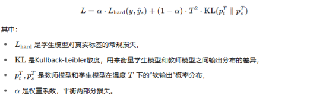

通过这样的设计，学生模型学到的是“决策趋势”而不是“训练数据细节”，天然就降低了对具体敏感信息的记忆。

​

​

​

# 参考

1. <https://www.lakera.ai/blog/training-data-poisoning>

2. <https://www.datacamp.com/tutorial/k-means-clustering-python>

3. <https://datascientest.com/en/adversarial-training-what-you-didnt-know-yet>

4. <https://www.researchgate.net/figure/Operation-of-the-pruning-aware-attack_fig6_325483856>

5. <https://www.researchgate.net/figure/Federated-learning-setup-illustration_fig1_350542822>

6. <https://onlinelibrary.wiley.com/doi/10.1155/2021/8261663>

7. <https://www.mdpi.com/2227-7390/12/19/3068>

8. <https://www.mdpi.com/2079-9292/11/17/2758>

9. <https://www.themoonlight.io/zh/review/correcting-large-language-model-behavior-via-influence-function>

10. <https://cloud.google.com/blog/products/gcp/exploring-container-security-isolation-at-different-layers-of-the-kubernetes-stack>

11. <https://opensource.microsoft.com/blog/2020/05/19/new-differential-privacy-platform-microsoft-harvard-opendp/>

12. <https://towardsdatascience.com/knowledge-distillation-simplified-dd4973dbc764/>

13. <https://help.coolwallet.io/zh-TW/support/solutions/articles/151000024212-%E4%BB%80%E9%BA%BC%E6%98%AF%E9%80%B2%E9%9A%8E%E5%8A%A0%E5%AF%86%E6%A8%99%E6%BA%96-aes256-%E5%8A%A0%E5%AF%86%E6%8A%80%E8%A1%93->

​

​
