# AI半自动化代码审计-某IP网络对讲广播系统-先知社区

> **来源**: https://xz.aliyun.com/news/18911  
> **文章ID**: 18911

---

## 前言

有幸拿到了该系统的安装包，简单看了下，漏洞都比较简单，在AI逐渐普及的情况下，能否通过AI审计出这些漏洞呢，师母以待

安装完成后目录如下：  
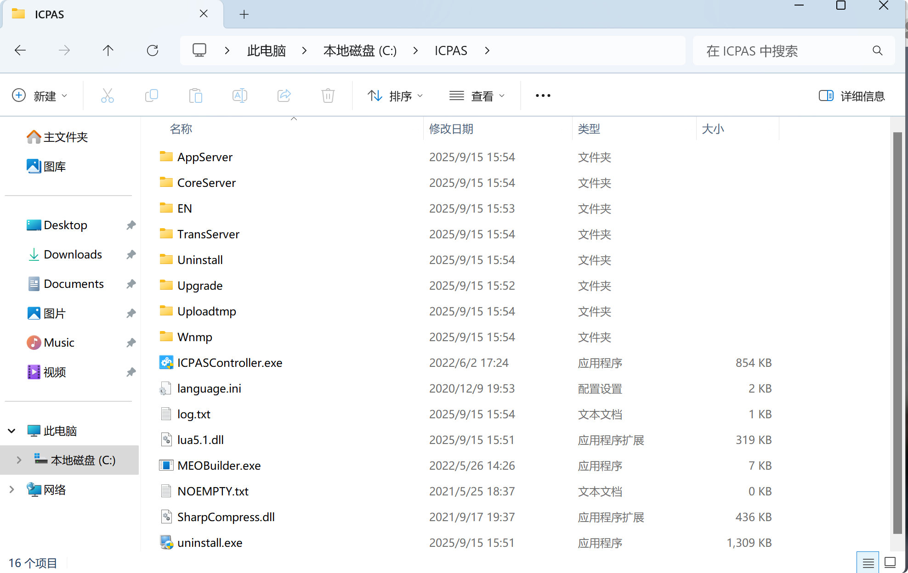

默认安装路径为：`C:\ICPAS`

端口情况如下：  
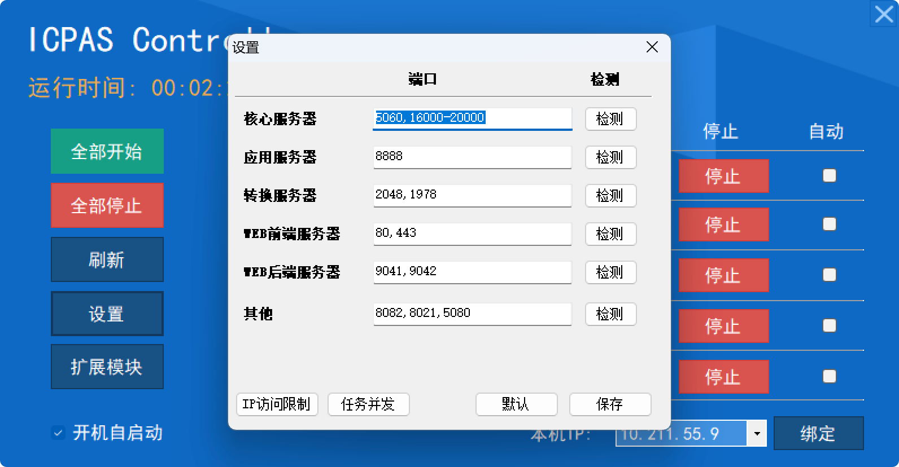

## 破解

在访问的时候，会跳转出一个授权界面，我们需要授权才能进行登录等后续操作  
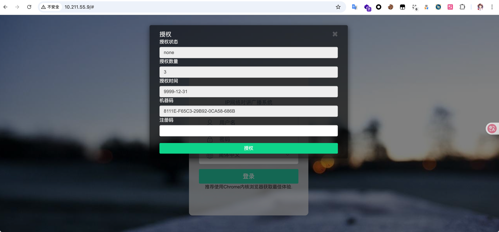

这可难不倒我们

### php代码

看一下源码，index.html看不出什么东西，所以看到index.js  
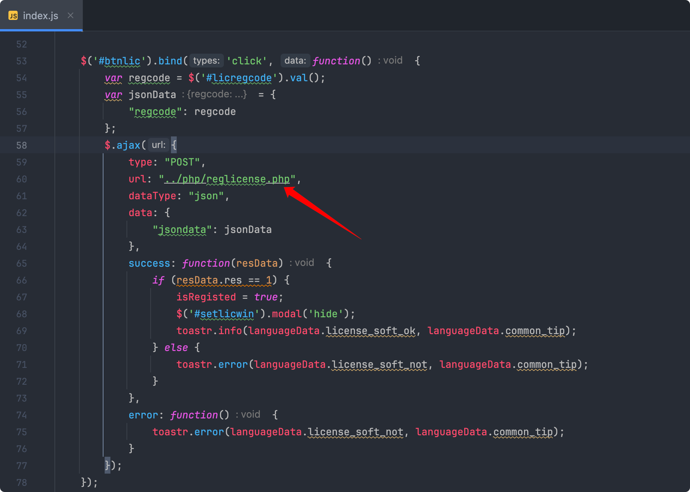

正好是注册许可证的功能，看一下源码

php/reglicense.php  
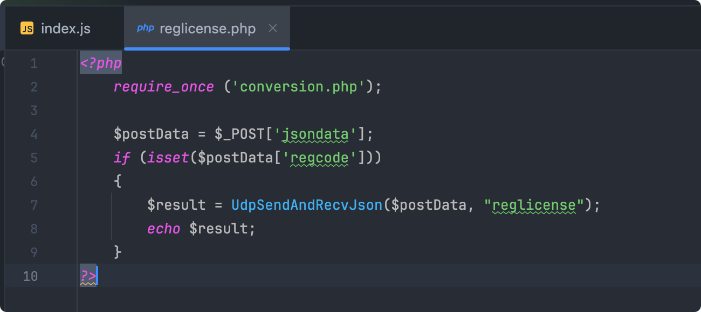

php/conversion.php  
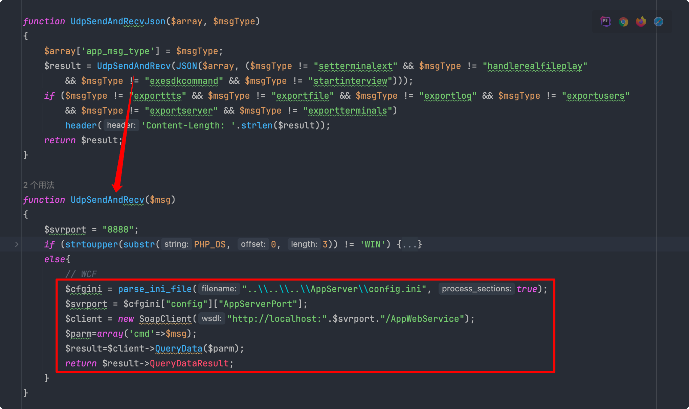

走到了8888端口的AppWebService，访问发现是一个SOAP的接口  
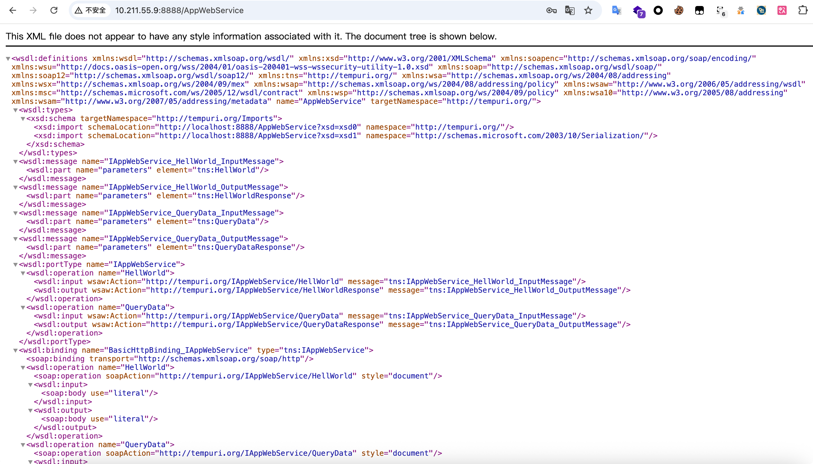

这里是8888端口应用服务器，所以不是php的服务，看到目录AppServer  
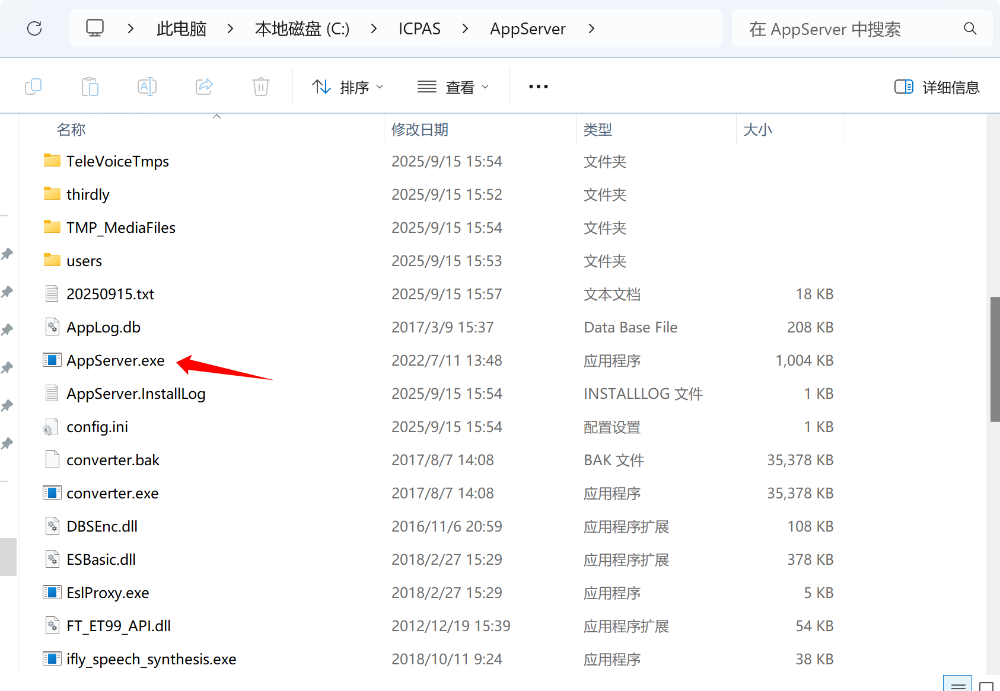

猜测就是这个了，准备反编译

### .NET代码

下载dnSpy，搜索关键字QueryData  
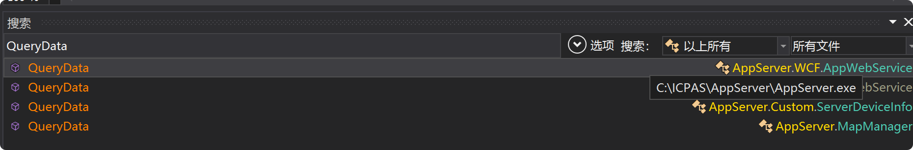

很明显是WCF这，看一下  
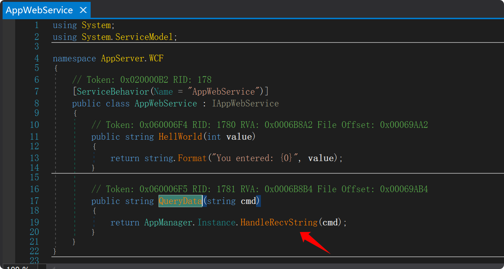

跟进  
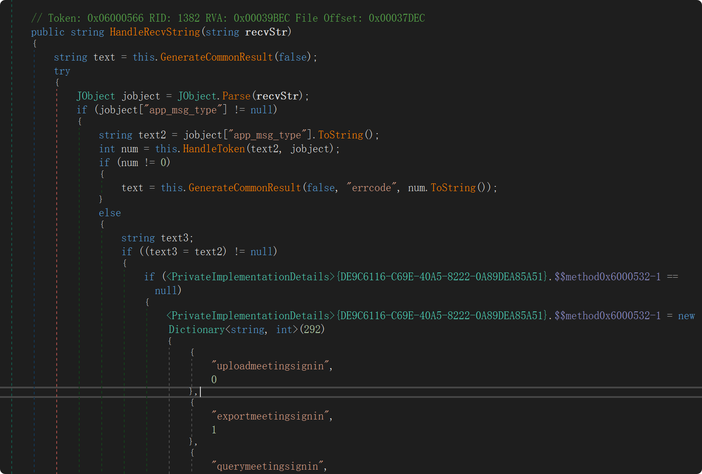

这里我们传的是reglicense，并且未注册，`LicenseManager.Instance.IsRegisted()`为false

```
        private int HandleToken(string msg_type, JObject jobj)
        {
            int num = 0;
            if (!LicenseManager.Instance.IsRegisted())
            {
                if (msg_type != "getlicense" && msg_type != "reglicense" && msg_type != "getfactoryconf" && msg_type != "setfactoryconf" && msg_type != "judgeterminalpin" && msg_type != "addmediadata" && msg_type != "updatefirmware" && msg_type != "upgrade" && msg_type != "exporttts" && msg_type != "exportfile" && msg_type != "exportlog" && msg_type != "exportserver" && msg_type != "spbctgetconf" && msg_type != "spbctsetconf")
                {
                    num = -99;
                }
            }
            else
            {
                bool flag;
                int num2;
                ServerManager.Instance.GetHttpParams(out flag, out num2);
                if (flag && msg_type != "login_spon" && msg_type != "login_ohedu" && msg_type != "login" && msg_type != "getlicense" && msg_type != "reglicense" && msg_type != "getfactoryconf" && msg_type != "setfactoryconf" && msg_type != "judgeterminalpin" && msg_type != "addmediadata" && msg_type != "updatefirmware" && msg_type != "upgrade" && msg_type != "exporttts" && msg_type != "exportfile" && msg_type != "exportlog" && msg_type != "exportserver" && msg_type != "spbctgetconf" && msg_type != "spbctsetconf" && msg_type != "sphandlerealfileplay" && msg_type != "startinterview" && msg_type != "bindinterviewwindow" && msg_type != "getinterviewwindow" && msg_type != "getinterviewtime")
                {
                    if (jobj["token"] == null)
                    {
                        num = -1;
                    }
                    else
                    {
                        string text = jobj["token"].ToString();
                        if (string.IsNullOrEmpty(text))
                        {
                            num = -1;
                        }
                        else
                        {
                            num = UserManager.Instance.GetTokenState(text);
                            if (num == 0 && msg_type != "getupdatetime")
                            {
                                UserManager.Instance.UpdateTokenTime(text);
                            }
                        }
                    }
                }
            }
            return num;
        }
```

num为0，走到else这，reglicense对应的数字为5  
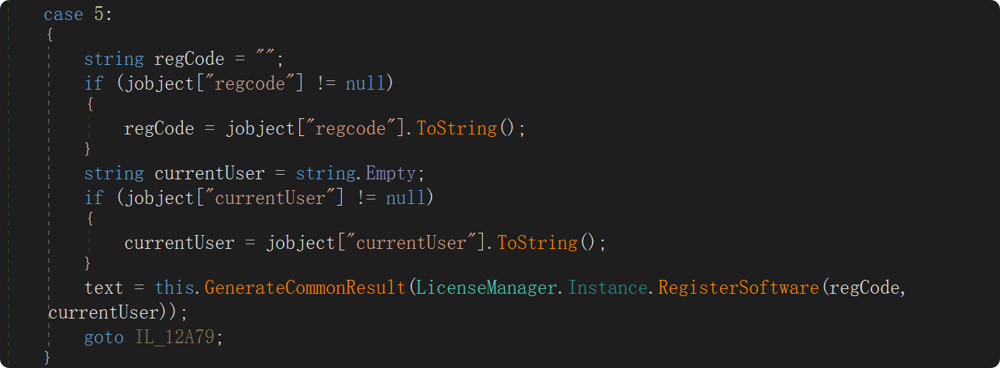

到注册功能了

```
        public bool RegisterSoftware(string regCode, string currentUser)
        {
            bool result = false;
            if (this.isRegistered == RegisterState.HardwareRegister && this.machineCode.Equals("SPON-XC-NET-ETDOG"))
            {
                return result;
            }
            if (MutexManager.Instance.EnterLicenseMutex())
            {
                string value = IniProcessor.IniReadValue("config", "regcode", this.real_licenseDLL);
                if (!regCode.Equals(value))
                {
                    byte[] bytes = Encoding.UTF8.GetBytes(regCode);
                    byte[] bytes2 = Encoding.UTF8.GetBytes(this.machineCode);
                    if (VTRegister.Register(bytes2, bytes))
                    {
                        IniProcessor.IniWriteValue("config", "regcode", regCode, this.real_licenseDLL);
                        IniProcessor.IniWriteValue("config", "maxtime", Utils.Encryption(((long)DateTime.Now.AddMonths(2).Subtract(LicenseManager.DEFAULT_START_TIME).TotalSeconds).ToString()), this.real_licenseDLL);
                        IniProcessor.IniWriteValue("config", "lastusetime", Utils.Encryption(((long)DateTime.Now.Subtract(LicenseManager.DEFAULT_START_TIME).TotalSeconds).ToString()), this.real_licenseDLL);
                        IniProcessor.IniWriteValue("config", "isencrytion", "1", this.real_licenseDLL);
                        result = true;
                    }
                    else
                    {
                        string text = this.demoEncoder.Decrypto(regCode);
                        if (text.StartsWith(this.machineCode))
                        {
                            try
                            {
                                bool flag = false;
                                string path = "/proc/version";
                                if (File.Exists(path))
                                {
                                    string text2 = File.ReadAllText(path);
                                    Program.OutputInfo("[License]:CheckLicense------" + text2);
                                    if (text2.ToLower().Contains("kylin"))
                                    {
                                        flag = true;
                                    }
                                }
                                if (text.Equals(this.machineCode + "800823") || flag)
                                {
                                    long num = (long)DateTime.Now.AddYears(10).Subtract(LicenseManager.DEFAULT_START_TIME).TotalSeconds;
                                    IniProcessor.IniWriteValue("config", "regcode", regCode, this.real_licenseDLL);
                                    IniProcessor.IniWriteValue("config", "maxtime", Utils.Encryption(Convert.ToString(num)), this.real_licenseDLL);
                                    IniProcessor.IniWriteValue("config", "lastusetime", Utils.Encryption(((long)DateTime.Now.Subtract(LicenseManager.DEFAULT_START_TIME).TotalSeconds).ToString()), this.real_licenseDLL);
                                    IniProcessor.IniWriteValue("config", "isencrytion", "1", this.real_licenseDLL);
                                    DateTime t = this.ConvertSecondsToDt(num);
                                    result = !(DateTime.Now > t);
                                }
                                else
                                {
                                    string[] array = text.Substring(this.machineCode.Length).Split(new char[]
                                    {
                                        '-'
                                    }, StringSplitOptions.RemoveEmptyEntries);
                                    if (array.Length >= 1)
                                    {
                                        long val = Convert.ToInt64(array[0]);
                                        long val2 = (long)DateTime.Now.AddMonths(2).Subtract(LicenseManager.DEFAULT_START_TIME).TotalSeconds;
                                        long num2 = Math.Min(val, val2);
                                        IniProcessor.IniWriteValue("config", "regcode", regCode, this.real_licenseDLL);
                                        IniProcessor.IniWriteValue("config", "maxtime", Utils.Encryption(Convert.ToString(num2)), this.real_licenseDLL);
                                        IniProcessor.IniWriteValue("config", "isencrytion", "1", this.real_licenseDLL);
                                        IniProcessor.IniWriteValue("config", "lastusetime", Utils.Encryption(((long)DateTime.Now.Subtract(LicenseManager.DEFAULT_START_TIME).TotalSeconds).ToString()), this.real_licenseDLL);
                                        DateTime t2 = this.ConvertSecondsToDt(num2);
                                        result = !(DateTime.Now > t2);
                                    }
                                }
                            }
                            catch (Exception ex)
                            {
                                result = false;
                                Program.OutputInfo("RegisterSoftware: " + ex.Message);
                            }
                        }
                    }
                }
                MutexManager.Instance.ExitLicenseMutex();
            }
            LogManager.Instance.InsertLog(LogType.Operation, SubType.SoftRegister, currentUser, regCode, string.Empty);
            this.CheckLicense();
            return result;
        }
```

这里正常会走到`string text = this.demoEncoder.Decrypto(regCode);`进行解密  
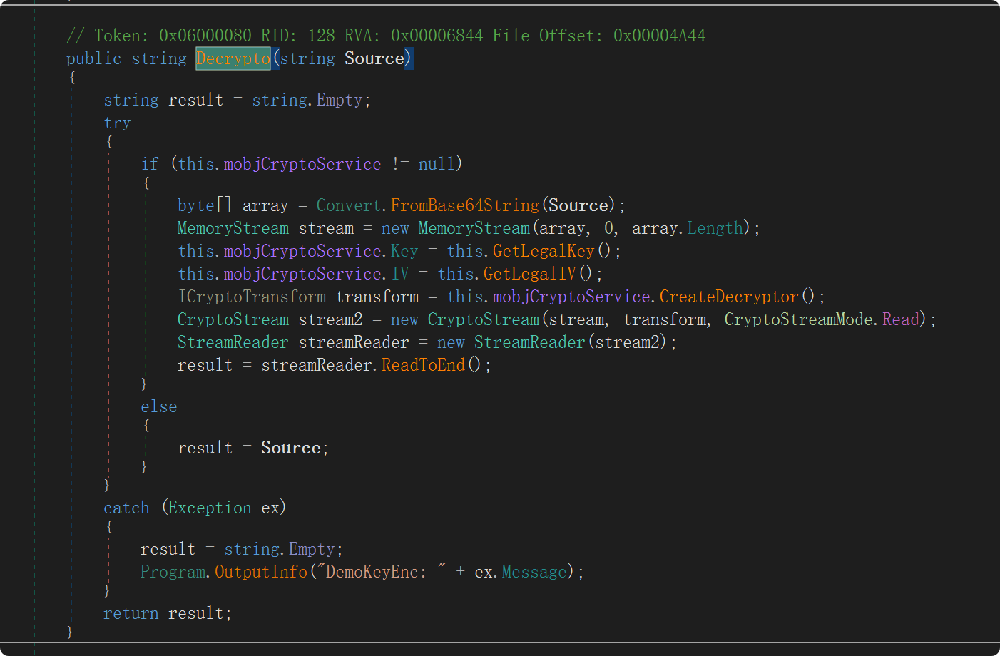

其实就是很普通的一个AES

这里key和iv都是硬编码  
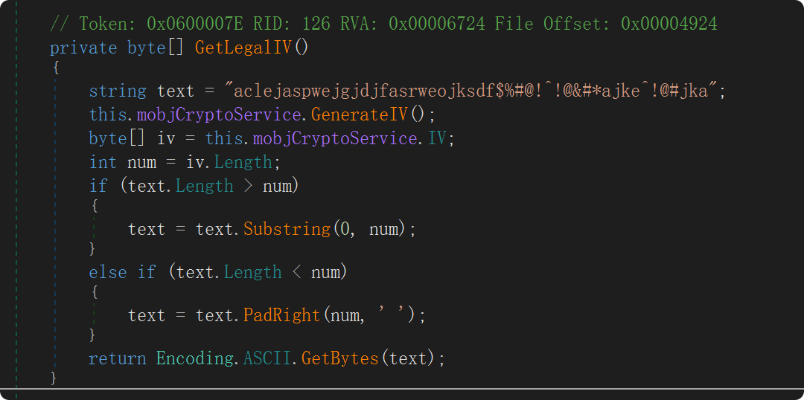

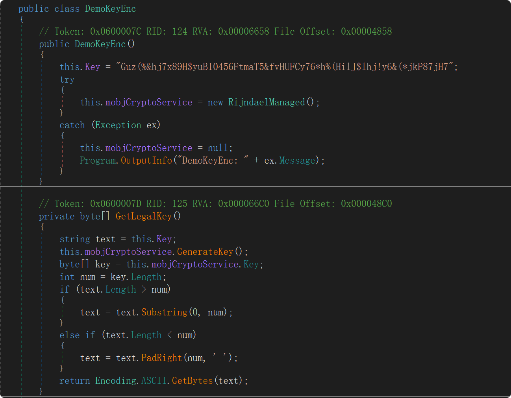

```
KEY：Guz(%&hj7x89H$yuBI0456FtmaT5&fvH
IV：aclejaspwejgjdjf
```

在解密完成后，如果`if (text.StartsWith(this.machineCode))`，那么就会往后进行

这里我们要让result为true，有几种选择：  
1：`/proc/version`路径存在并且内容包含kylin，我们是windows很明显不可能  
2：`(text.Equals(this.machineCode + "800823")`，这个就很好实现了

直接  
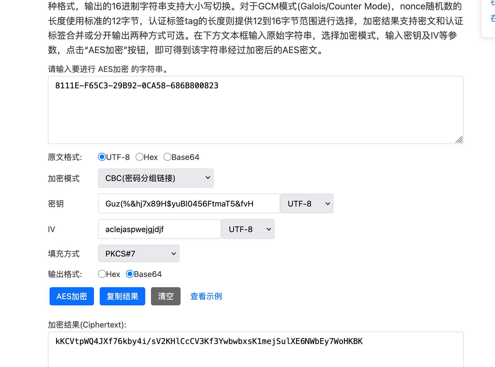

将生成的结果填入注册码中  
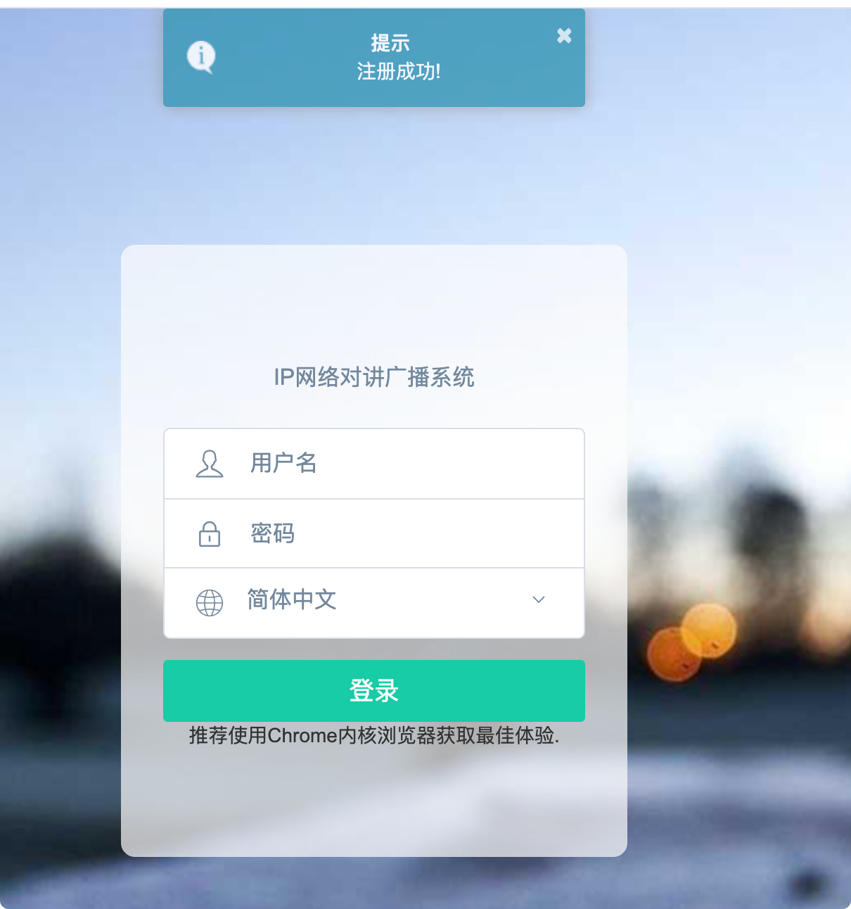

成功注册！默认密码为`admin/admin`，并且还存在一个后门用户`administrator/800823`

## 代码审计

### Seay+Cursor

先把拿到的代码放到Seay源代码审计系统自动审计一遍（正则匹配关键字）  
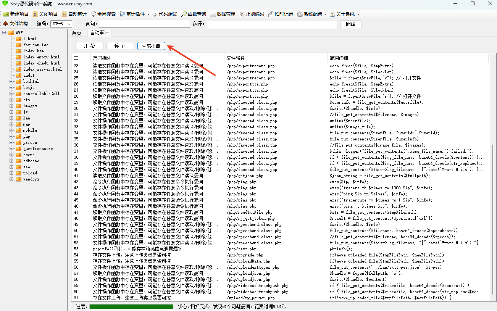

生成报告，接着通过Cursor分析一遍，我这里使用的是gpt-5-high

Prompt：

> 假设你是一位代码安全审计专家，web路径就是该项目路径，php版本为7.4，根据1.html给出的结果，分析漏洞是否存在，如果存在则给出poc验证脚本，不存在则说明原因，最后生成md文档

不仅给出了漏洞说明，并且还给出了验证的POC  
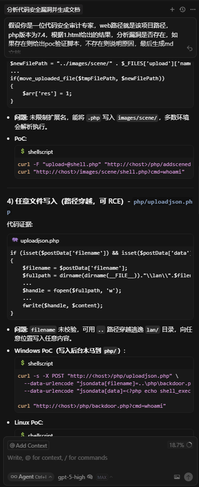

不存在漏洞的说明  
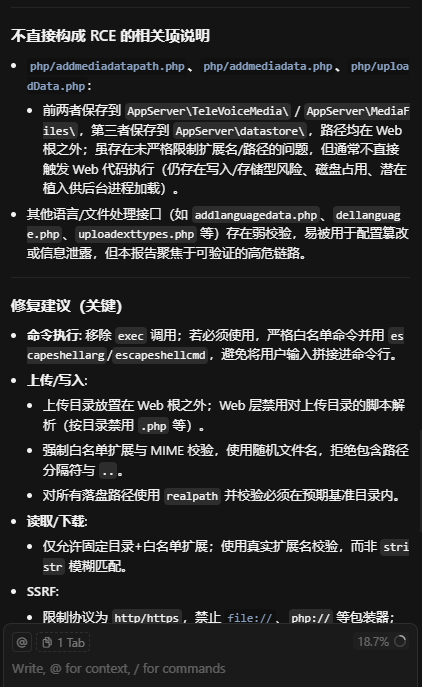

最后生成一个总结

|  |  |  |  |  |  |  |
| --- | --- | --- | --- | --- | --- | --- |
| 编号 | 漏洞类型 | 受影响端点 | 风险等级 | 关键问题 | 最小化 PoC | 修复要点 |
| 1 | 命令执行（RCE） | `php/ping.php` | 高 | `exec` 拼接用户输入 | `POST jsondata[type]=2&jsondata[ip]=whoami` | 移除/白名单命令并转义 |
| 2 | 任意上传（可执行） | `upload/my_parser.php` | 高 | 未限扩展与路径 | 表单上传 `shell.php` 至 `upload/files/` | Web 根外存储 + 扩展白名单 + 禁解析 |
| 3 | 任意上传（可执行） | `php/addscenedata.php` | 高 | 未限扩展 | 表单上传 `shell.php` 至 `images/scene/` | 同上 |
| 4 | 任意写入（路径穿越） | `php/uploadjson.php` | 高 | `filename` 可含 `..` 写任意文件 | `jsondata[filename]=..\\php\\backdoor.php` | 归一化路径+基准目录校验 |
| 5 | 任意读取（路径穿越） | `php/getjson.php` | 中/高 | `filename` 可含 `..` 读任意文件 | `jsondata[filename]=..\\php\ est.php` | 固定目录+扩展白名单 |
| 6 | SSRF / 本地文件读取 | `php/rj_get_token.php` | 高 | 任意 URL 直传至 `file_get_contents` | `url=file:///c:/windows/win.ini` | 限协议与内网网段，域名白名单 |
| 7 | 任意下载（后缀弱校验） | `php/exportrecord.php` | 中 | 仅模糊包含后缀 | `downname=php/phplog.txt` | 严格扩展校验+固定目录 |
| 8 | 路径穿越写入 | `php/busyscreenshotpush.php` | 高 | `imagename` 允许 `../` | `imagename=a_.._../../upload/files/poc.php` | 过滤分隔符与 `..`，基准目录校验 |
| 9 | 路径穿越写入 | `php/videobacktrackpush.php` | 高 | `videoname` 允许 `../` | 同上 | 同上 |
| 10 | 信息泄露 | `php/test.php` | 低/中 | `phpinfo()` 暴露环境 | 直接访问页面 | 移除或仅限后台管理员 |
| 11 | 其他上传（默认不直执） | `php/addmediadatapath.php`, `php/addmediadata.php`, `php/uploadData.php` | 中 | Web 根外落盘但弱校验 | 表单上传媒体文件 | 扩展/MIME 白名单+鉴权 |

### AICodeScan

> ​ 该工具基于Zjackky/CodeScan开发，通过对大多数不完整的代码以及依赖快速进行Sink点匹配，并且由AI进行审计精准定位，来帮助红队完成快速代码审计，目前工具支持的语言有PHP，Java，并且全平台通用。

最近在网上看到了这个项目：<https://github.com/Zacarx/AICodeScan>  
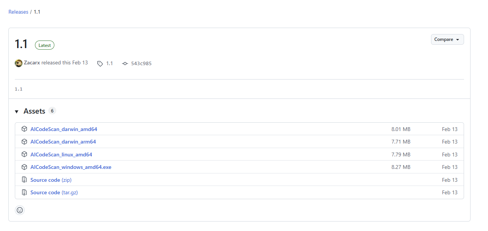

下载后在程序当前目录增加config.yaml

内容：  
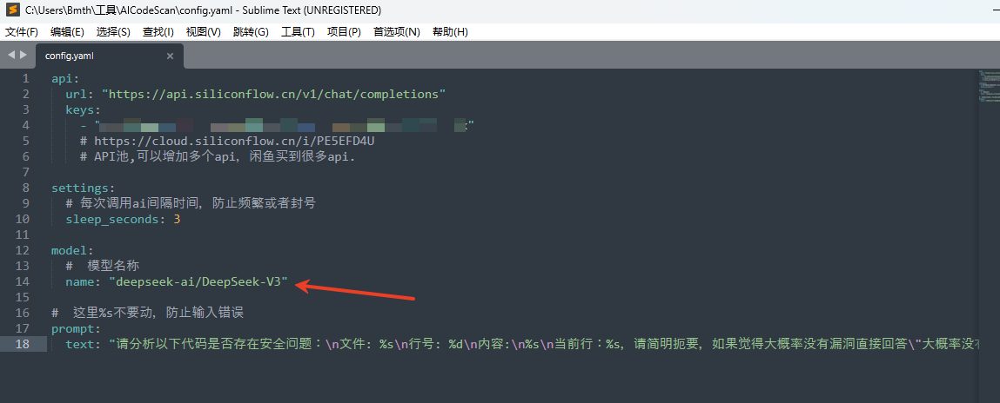

这里我使用的模型是DeepSeek-V3  
其中硅基：<https://cloud.siliconflow.cn/me/models> 通过注册，可以免费获得14块额度

执行`.\AICodeScan_windows_amd64.exe -L php -d ./WWW`  
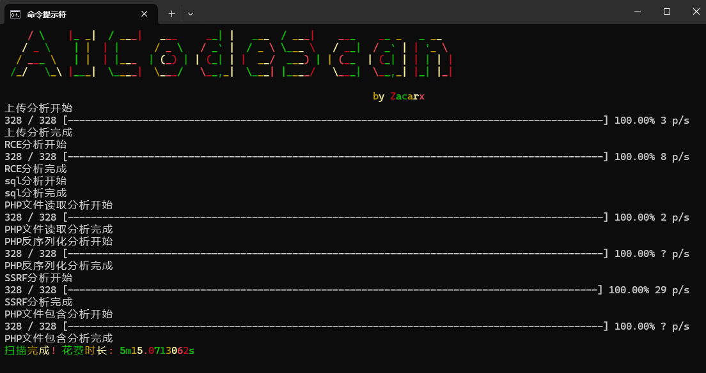

速度还是很快的  
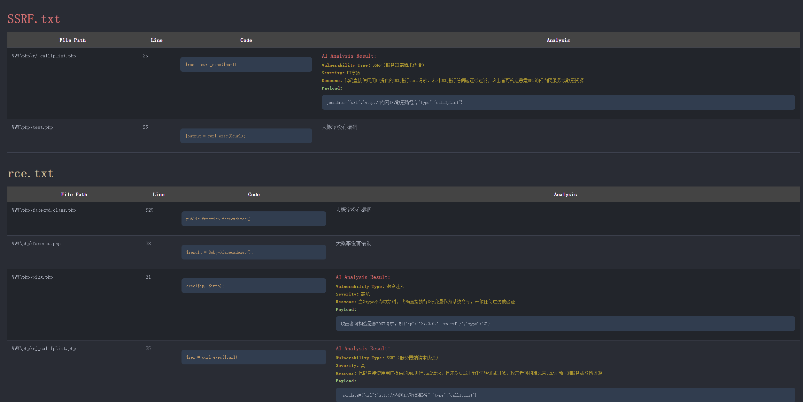

虽然有一些误报，但速度很快，还是能参考一下的

后续可以自行在`CommonVul/Rule`添加一些新的匹配规则

### Mirror-Flowers

> 基于 AI 的代码安全审计工具，支持多种编程语言的代码分析，可以帮助开发者快速发现代码中的潜在安全漏洞。支持DeepSeek-R1，ChatGPT-4o等多种大模型。

项目地址：<https://github.com/Ky0toFu/Mirror-Flowers>

直接在Releases中下载这个文件，不要直接git clone！，会有问题  
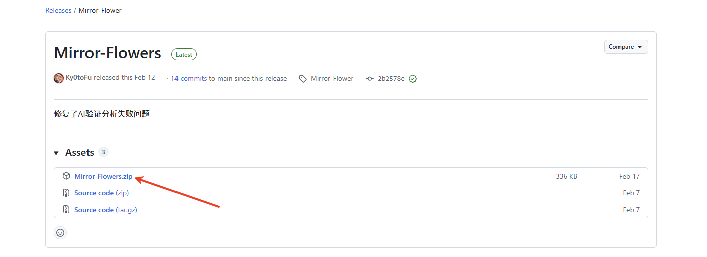

然后下载安装nodejs、python等环境

`config/api_config.json`编辑配置文件  
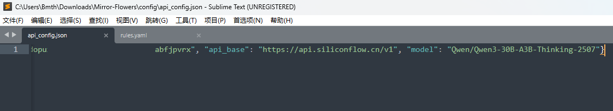

同样可以使用硅基的接口，这里我使用的是大模型是`Qwen/Qwen3-30B-A3B-Thinking-2507`

```
pip install -r requirements.txt
uvicorn backend.app:app --reload
```

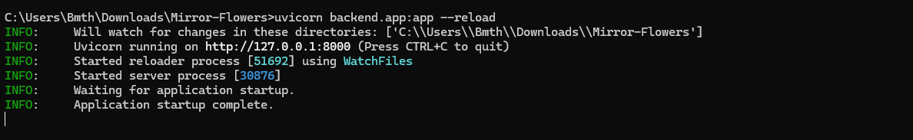

启动成功后访问：<http://127.0.0.1:8000/ui>，把代码上传上去就可以了

发现如果是项目文件夹审计的话，默认只检测exec有关的漏洞。。。  
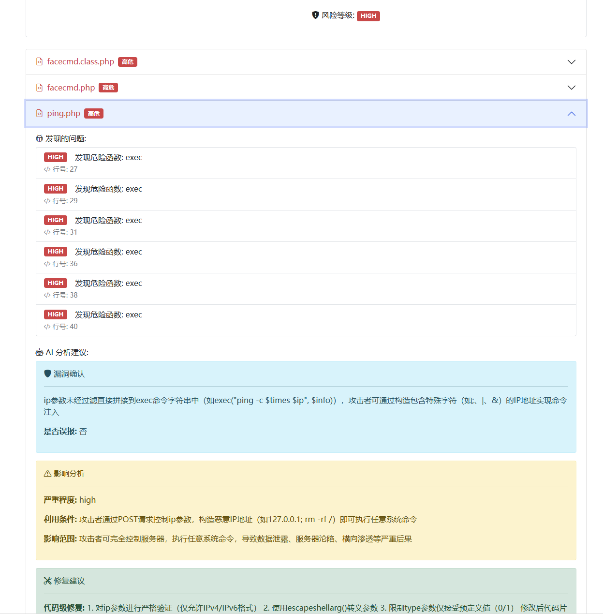

判断出来其他文件都是误报

​

主要判断代码是在：<https://github.com/Ky0toFu/Mirror-Flowers/blob/main/core/analyzers/core_analyzer.py#L1097>  
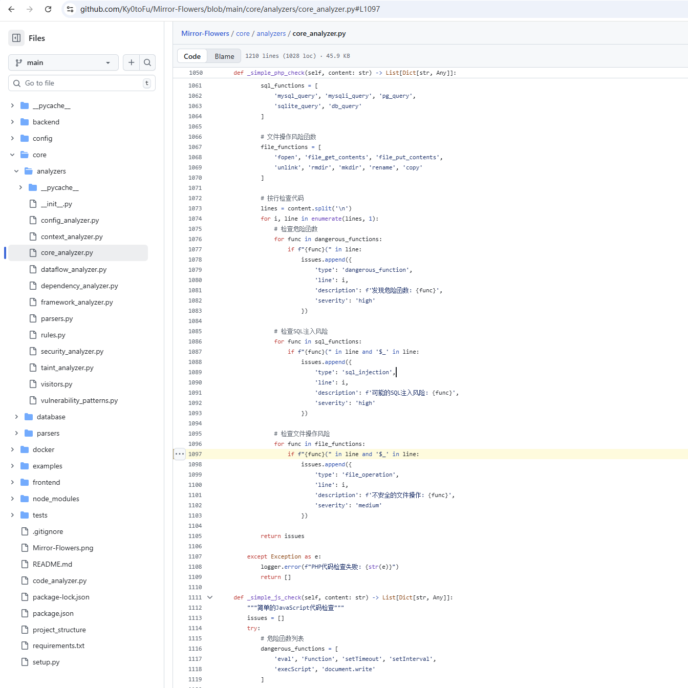

检测的逻辑是`$_`和危险函数在一行的话判断为存在风险，很明显逻辑有问题，哪有人会这样写代码啊，一般都是通过变量代替

```
include("xxxxxx".$_POST["file"]);
include("xxxxxx".$file);
```

过于片面了，我们简单优化一下，再次执行  
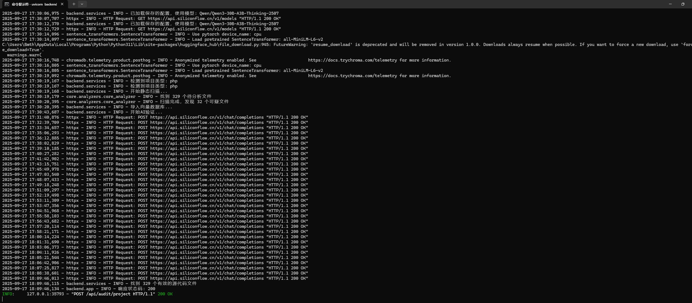

由于是单线程，所以耗时有点长  
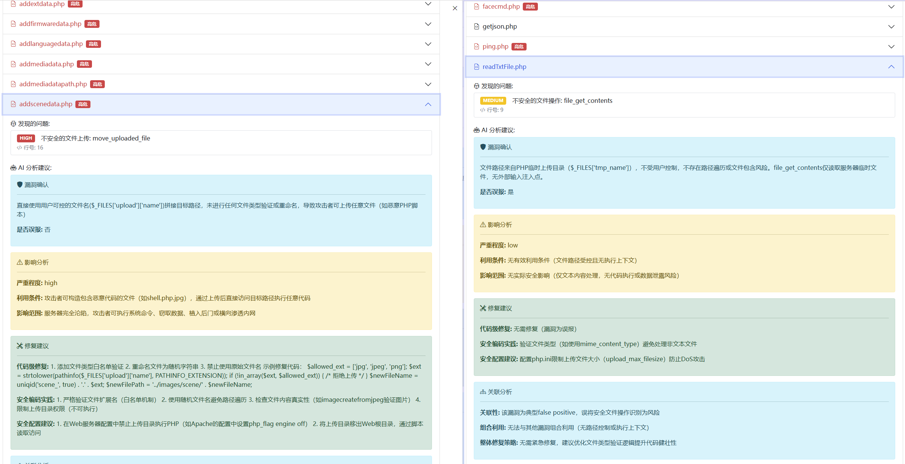

这样结果就比较全面了，并且能够判断是否误报

## 总结

通过AI进行代码审计，能快速的发现定位漏洞，但是会存在一定的误报、漏报，这取决于许多因素，如训练数据的质量、数量，大模型选择等

在实际应用中，还是建议将AI与传统的SAST工具相结合使用，以充分发挥它们各自的优势
