# 安卓逆向-从刷机到frida的入门与实践-先知社区

> **来源**: https://xz.aliyun.com/news/18925  
> **文章ID**: 18925

---

起初我只是想练习github上frida系列,遇到报错要求Android 版本 ≥ 9.0，奈何手上的真机测试机版本都是8.1.0，于是从刷机开始。本篇文章会记录刷机，root到frida的入门与实践。

刷机nexus 6p android 8.1.0->android 10

官方提供的最高版本是8.1

### 准备：

刷机工具

[Download TWRP for angler](https://dl.twrp.me/angler/)

要装的刷机包

[[ROM][UNOFFICIAL] LineageOS 17.1 for Nexus 6P (angler) | XDA Forums](https://xdaforums.com/t/rom-unofficial-lineageos-17-1-for-nexus-6p-angler.4012099/)

面具Magisk 为了root

[发布 ·topjohnwu/Magisk](https://github.com/topjohnwu/Magisk/releases)

boot.img （记住这个文件 后面root需要）

如下图，因为在我操作的过程中，windows上这个谷歌驱动比较麻烦，最后是在虚拟机上刷机的，虚拟机不需要额外安装驱动。所以接下来的操作是虚拟机，我是新安装的ubuntu24的镜像

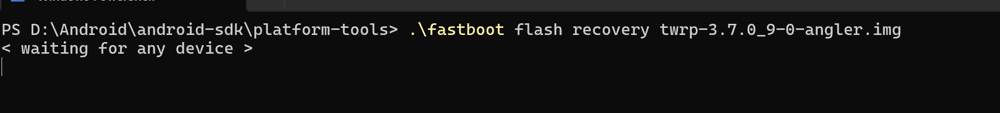

ubuntu(64bit 24.??)

[Download Ubuntu Desktop | Ubuntu](https://ubuntu.com/download/desktop)

platform-tools (64bit linux )

frida16.4.2

安装好ubuntu系统后，因为是全新的，还不能复制粘贴，和文件共享，输入下面命令可解决复制粘贴

sudo apt-get install open-vm-tools-desktop

共享文件 如图选择加入一个主机的文件用来作为共享文件夹

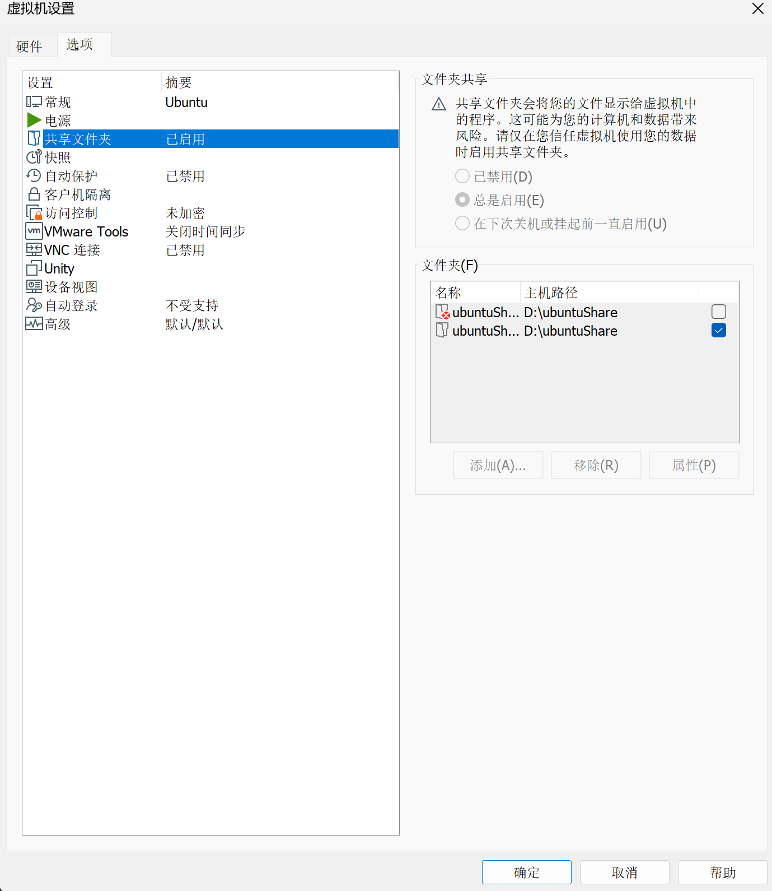

此时你应该准备好了,如下


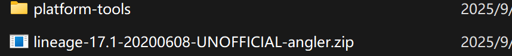

### 刷入twrp

将.img文件放入platform-tools中，都放入共享文件夹中。 大多数在这个路径下

/mnt/hgfs/<你的共享文件夹>

ubuntu中用命令行下载好adb

adb devices

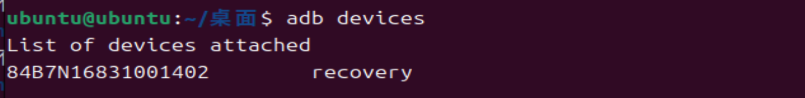

这里大家还不是recovery,这是刷入twrp后的设备状态，大家只要连接上即可。如果显示未授权，可能是连接到了主机

这里改一下即可

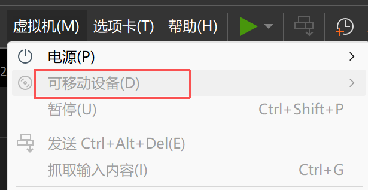

将手机关机，长按开机键 + 音量下键进入 fastboot 模式，与电脑连接。

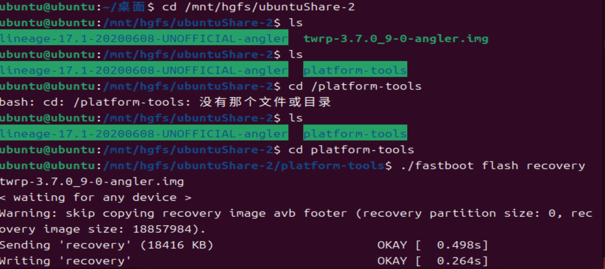

此时已经刷入了twrp

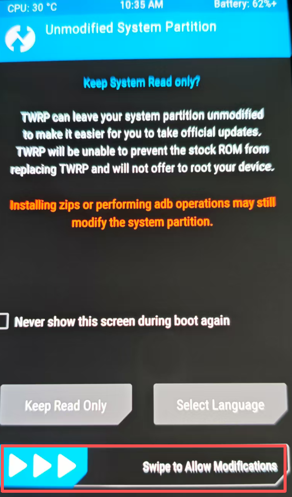

滑过 之后回到电脑

Magisk

刷入 Magisk 移除启动验证

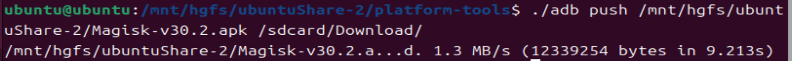

TWRP 界面上点击“install”，找到Magisk 安装包，点击文件名，滑动按钮刷入；

Magisk 刷入完成，点击“重启系统”，重启手机也不会丢失 TWRP 安装；

### 刷机包

将手机关机，长按开机键 + 音量下键进入 fastboot 模式，与电脑连接。音量键选择进入recovery模式，已经刷入了twrp

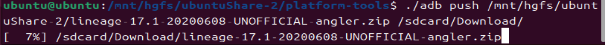

漫长的等待之后终于可以了

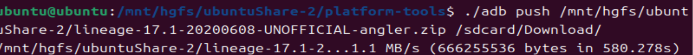

借助twrp的install 和 安装右边的选项进行双清 先双清后选择之前下载的LineageOS的zip包安装 滑动刷入，重启即可。

重启

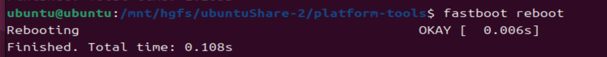

### magisk root

windows上将magisk apk通过adb install进去

打开面具-安装-修补一个文件，选择手机中的boot.img

如果没有boot.img 就去当时你的刷机包里面找

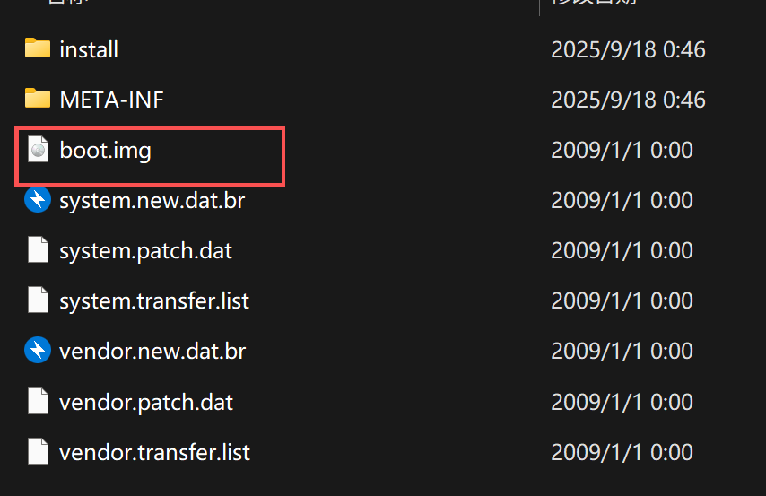

boot.img 拷贝到手机存储中

打开magisk软件，选择安装，修补一个文件，选择手机中的boot.img

修补完成后会生成一个新的类似 magisk\_patched-24300\_pmcKO.img 的文件，把这个文件拷贝到电脑共享文件夹

打开电脑，运行以下命令 adb reboot bootloader

等待手机重启到刷机模式

虚拟机中运行

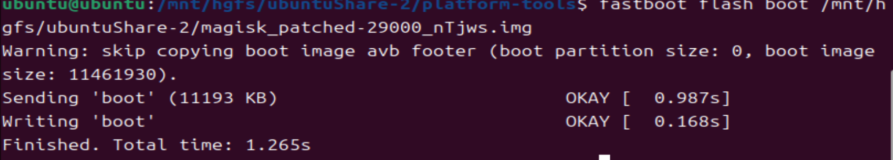

等待手机会重启

打开magisk软件，选择安装，直接安装

重启手机

### frida

frida是一个动态注入插桩的工具，相比xposed比较便捷，可随时修改代码逻辑，跨平台支持，支持java层和so层的hook操作

使用frida hook会用到两个工具，frida-server（服务端程序），frida（客户端程序）

pip install frida -i <https://pypi.tuna.tsinghua.edu.cn/simple>

pip install frida-tools -i <https://pypi.tuna.tsinghua.edu.cn/simple>

server

frida-server去[官方github](https://github.com/frida/frida/releases/)上下载，选择需要的平台版本，注意server和client版本要一致

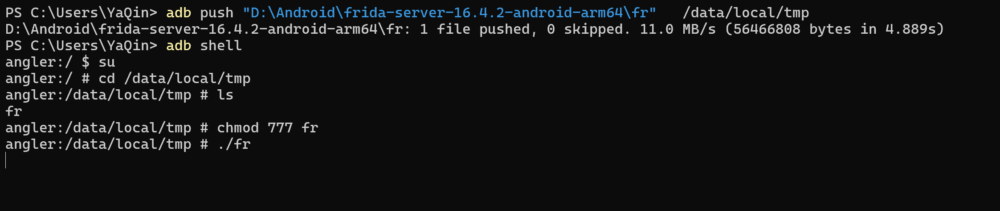

启动了frida

查看进程

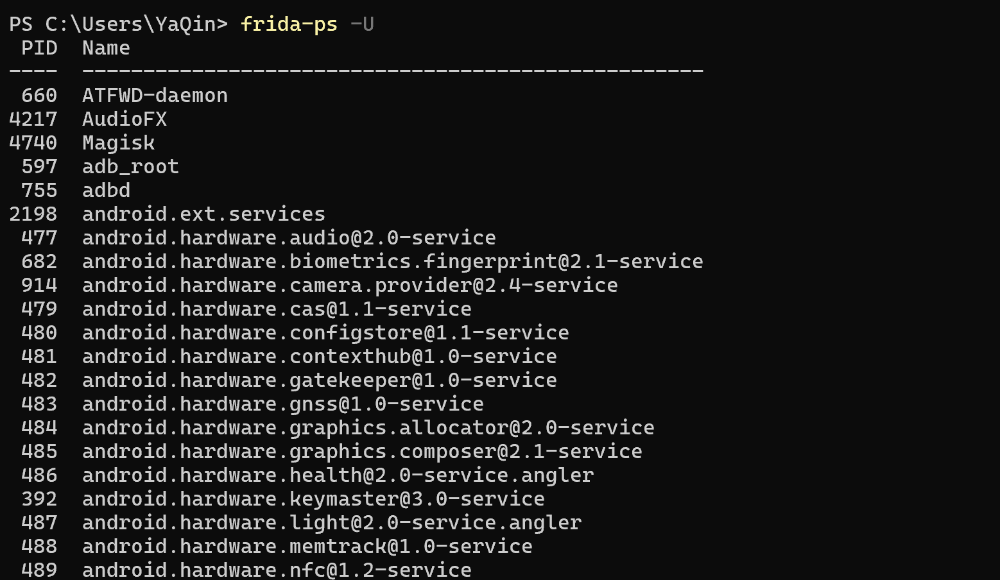

### hook框架模板

```
//定义一个名为hook的函数
function hook(){
        //获取一个名为"类名"的Java类，并将其实例赋值给JavaScript变量utils
    var utils = Java.use("包名.类名");
    //修改"类名"的"method"方法的实现。这个新的实现会接收两个参数（a和b）
    utils.method.implementation = function(a, b){
            //将参数a和b的值改为123和456。
        a = 123;
        b = 456;
        //调用修改过的"method"方法，并将返回值存储在`retval`变量中
        var retval = this.method(a, b);
        //在控制台上打印参数a，b的值以及"method"方法的返回值
        console.log(a, b, retval);
        //返回"method"方法的返回值
        return retval;
    }
}
function main(){
    Java.perform(function(){
        hook();
    });
}
setImmediate(main);
```

### 对基础hook框架的理解

* Java.perform() 的作用是 “进入 Java 环境执行代码”，而实际要执行的逻辑（比如 Hook 某个类、修改某个方法）都需要写在这个匿名函数里。
* () 是函数的参数列表，这里 Java.perform() 的参数就是后面的匿名函数 function() { ... }。
* {} 是函数体，用于包裹函数要执行的代码。
* 由于 Frida 是在原生层（Native Layer）工作的，而要操作 Java 类、方法等，需要通过 Java.perform() 进入 Java 环境，否则无法访问 Java 层的类和方法。
* .perform()它是 Frida 提供的 Java 桥接 API 的一部分，用于确保传入的函数在 Java 环境上下文（如 Dalvik/ART 虚拟机）中执行。

```
function main(){
    Java.perform(function(){
        hook();
    });
}
setImmediate(main);
```

setImmediate(main)Frida 脚本运行时，系统正在忙着 “启动、准备环境”（比如连接目标进程、初始化 Java 交互环境）。（当前脚本的加载、初始化工作）先干完，一有空就立刻去执行main这件事。

```
frida -U -f com.example.targetapp -l your_script.js
```

启动脚本时的命令，这里的参数就是 “连接进程” 的关键：

* -U：指定连接 USB 设备
* -f com.example.targetapp：指定要 Hook 的目标进程包名（即要连接的进程）
* -l your\_script.js：指定要加载的脚本（就是你写的这段代码）  
  连接进程是通过启动 Frida 时的命令参数指定的，脚本本身只负责 “被加载到已连接的进程中执行”。  
  hook()函数

```
function hook(){
       
// Java.use("类名") 是 Frida 提供的 API，作用是获取目标进程中指定的 Java 类的 “引用”（可以理解为拿到这个类的 “控制权”）。
// 这里的 utils 就是一个JavaScript 变量，用来存储这个类的引用。之后通过 utils 就可以操作这个 Java 类了（比如调用它的方法、修改它的实现等）
    var utils = Java.use("com.ad2001.frida0x1.MainActivity");
    //修改"类名"的"method"方法的实现。这个新的实现会接收两个参数（a和b）
// function(a, b)这是一个自定义的匿名函数，用来作为被 Hook 方法的 “新实现”。
// 其中 a 和 b 是被 Hook 方法的参数。Frida 会自动将原始方法被调用时传入的参数传递给这个函数。
    utils.check.implementation = function(a, b){
            //将参数a和b的值改为123和456。
        a = 2;
       b = 8;
        //调用修改过的"method"方法，并将返回值存储在`retval`变量中
        var retval = this.check(a, b);
        //用 this.check(a, b) 调用了原始方法（只是用了修改后的参数）。
        //想彻底改变逻辑，你可以不调用 this.check(a, b)，直接在新函数里写自己的逻辑并返回结果
        //在控制台上打印参数a，b的值以及"method"方法的返回值
        console.log(2, b, retval);
        //返回"method"方法的返回值
        //在控制台打印信息
        return retval;
    }
}
```

```
.implementation = function(...) { ... }
```

“覆盖原始方法逻辑” 通过重新赋值implementation，用自定义的函数替换了原始方法的实现。完成对原始方法的 Hook 和逻辑覆盖。

匿名函数是指没有名字的函数，通常通过 function() 这样的形式定义，而不是 function 函数名()。

Frida 中处理方法重载（overload）

.overload('int', 'int')？

在 Java 中，一个类可以有多个同名方法，只要它们的参数类型或参数数量不同，这就是 “方法重载”。

确定你要 Hook 哪个重载版本，所以需要用 .overload(参数类型列表) 来精确指定。

overload('int', 'int') 就表示：“我要 Hook 的是 check 方法中参数为两个 int 类型的那个版本”。

### 应用与学习

#### Frida 0x1

通过这三处，可以确定hook check方法，修改传入满足(i \* 2) + 4 == i2的参数

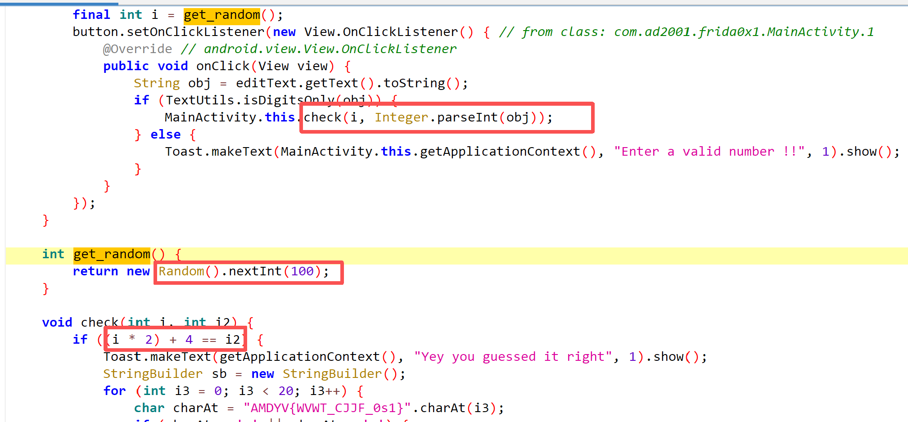

```
function hook(){
       
// Java.use("类名") 是 Frida 提供的 API，作用是获取目标进程中指定的 Java 类的 “引用”（可以理解为拿到这个类的 “控制权”）。
// 这里的 utils 就是一个JavaScript 变量，用来存储这个类的引用。之后通过 utils 就可以操作这个 Java 类了（比如调用它的方法、修改它的实现等）
    var utils = Java.use("com.ad2001.frida0x1.MainActivity");
    //修改"类名"的"method"方法的实现。这个新的实现会接收两个参数（a和b）
// function(a, b)这是一个自定义的匿名函数，用来作为被 Hook 方法的 “新实现”。
// 其中 a 和 b 是被 Hook 方法的参数。Frida 会自动将原始方法被调用时传入的参数传递给这个函数。
    utils.check.implementation = function(a, b){
            //将参数a和b的值改为123和456。
        a = 2;
       b = 8;
        //调用修改过的"method"方法，并将返回值存储在`retval`变量中
        var retval = this.check(a, b);
        //用 this.check(a, b) 调用了原始方法（只是用了修改后的参数）。
        //想彻底改变逻辑，你可以不调用 this.check(a, b)，直接在新函数里写自己的逻辑并返回结果
        //在控制台上打印参数a，b的值以及"method"方法的返回值
        console.log(2, b, retval);
        //返回"method"方法的返回值
        //在控制台打印信息
        return retval;
    }
}
function main(){
    Java.perform(function(){
        hook();
    });
}
setImmediate(main);
```

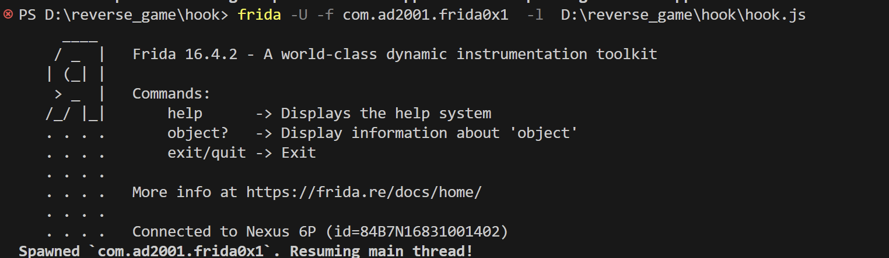

查看手机


#### 总结

hook普通方法 传参

#### Frida 0x2

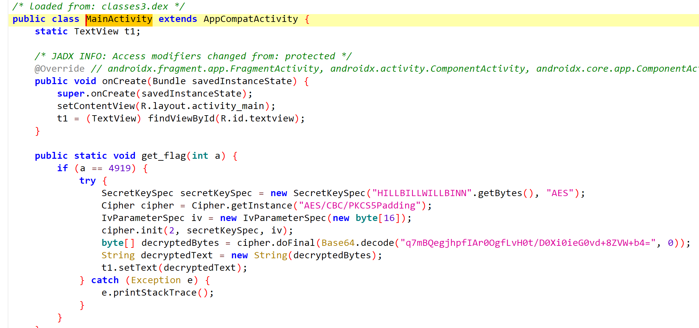

需要主动调用get\_flag静态方法 ，并传入参数4919

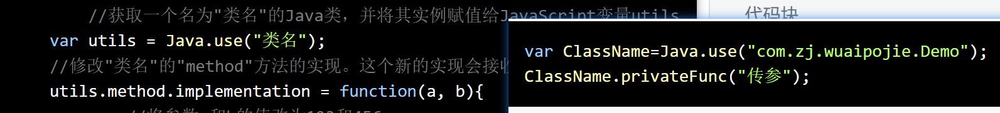

* 左图：

* 先通过 Java.use("类名") 获取类的引用并赋值给 utils。
* 再通过 utils.method.implementation = function(...) {...} Hook（替换）方法的实现，属于 “修改方法逻辑” 的场景。

* 右图：

* 通过 Java.use("com.zj.wuaipojie.Demo") 获取类的引用并赋值给 ClassName。
* 直接调用类的方法 ClassName.privateFunc("传参")，属于 “主动触发方法执行” 的场景。

* Hook 方法（左图）：用于监控或篡改应用原本的方法逻辑（比如修改登录校验的返回值，让验证永远通过）。
* 主动调用方法（右图）：用于主动触发某个逻辑（比如直接调用解密方法，获取加密内容的明文）。

这里由于Cipher cipher = Cipher.getInstance("AES/CBC/PKCS5Padding"); PKCS5填充，厨子是出不来的。

```
function hook(){
        var ClassName=Java.use("com.ad2001.frida0x2.MainActivity"); 
        ClassName.get_flag(4919);
    
}
function main(){


    Java.perform(function(){
        hook();
        console.log("已调用静态方法 get_flag(4919)");
    });
}
setImmediate(main);
```

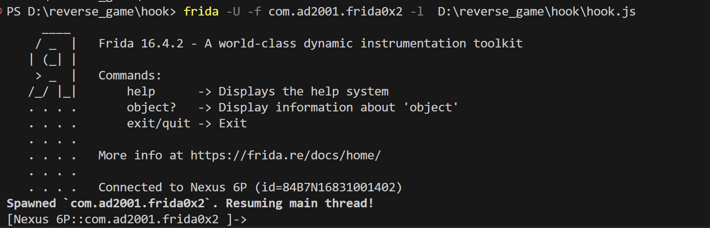


查看手机


#### 总结

主动调用静态方法

#### Frida 0x3

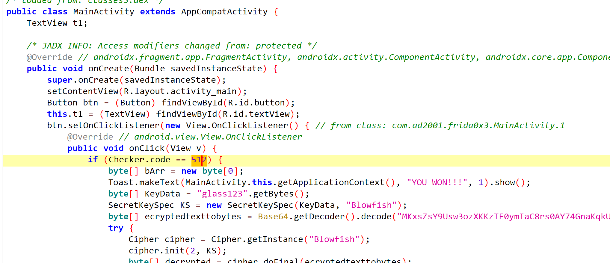

满足Checker.code == 512 才会得到flag ,继续分析

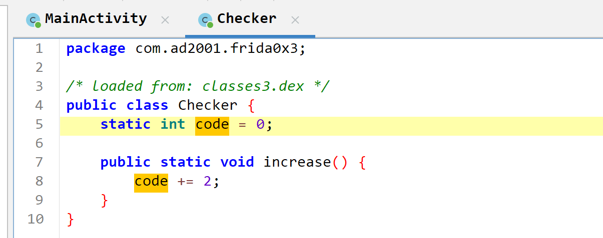

修改checker类中静态方法increase的变量值code 512

```
function hook(){
      //静态字段的修改
        var utils = Java.use("com.ad2001.frida0x3.Checker");
        //修改类的静态字段"flag"的值
        utils.code.value = 512;
        console.log(utils.code.value);
 }


function main(){


    Java.perform(function(){
        hook();
        console.log("已调用");
    });
}
setImmediate(main);
```

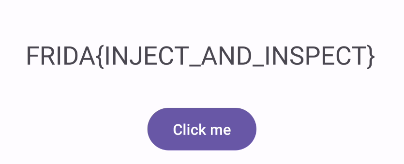

#### 总结

静态方法字段的修改

#### Frida 0x4

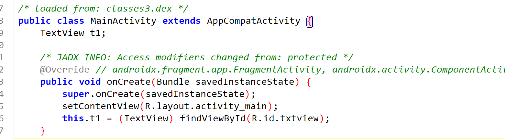

入口什么都没有，找找类

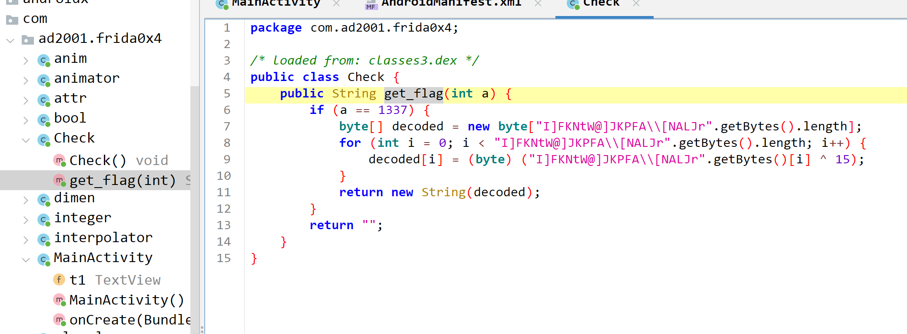

非静态方法get\_flag，且在主函数没有实例化这个类。程序只是定义了类

hook这个类，先创建实例，再调用。

```
function hook() {
  var utils=Java.use("com.ad2001.frida0x4.Check"); 
  var utils1  = utils.$new();
  //utils.$new() 等价于 Java 中的 new Check()
  var res = utils1.get_flag(1337); // Calling the method
  console.log("FLAG " + res);
}


function main() {
    Java.perform(function () {
        console.log("开始执行Hook逻辑...");
        hook();
        
        console.log("2111");
    });
}


// 立即执行主函数
setImmediate(main);

```

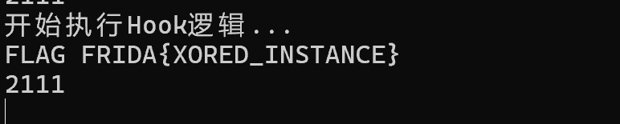

#### 总结

主动调用非静态方法，实例不存在，先创建一个实例

#### Frida 0x5

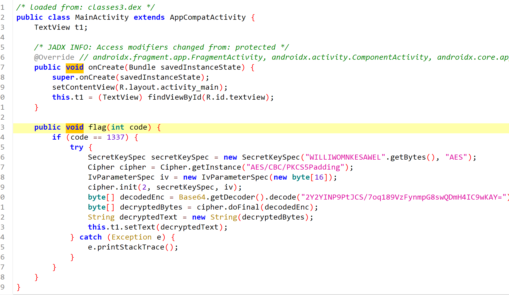

非静态方法flag，返回值void。类MainActivity以实例化，所以只需查找实例化类再hooK，无需new一个类实例

```
function hook() {
    Java.perform(function () {
        try {
          //Java.choose("类名", {...})查找当前运行的 Java 进程中，指定类的所有实例。
            Java.choose("com.ad2001.frida0x5.MainActivity", { 
              //onMatch: function (instance) { ... }当 Java.choose 找到一个 MainActivity 类的实例时，就会触发这个 onMatch 回调函数。
              //回调函数的参数 instance，代表找到的 MainActivity 类的实例对象。有了这个实例，就可以调用该实例的方法或者访问实例的属性。
                onMatch: function(instance) {
                    console.log("找到 MainActivity 实例");
                    try {
                        // 尝试调用 flag 方法，捕获错误
                      //instance.flag(1337); 这行代码，是通过找到的 MainActivity 实例 instance，调用该实例的 flag 方法，并且传递参数 1337。
                        var ret = instance.flag(1337); 
                        console.log("调用 flag 方法返回值: " + ret);
                        // 这里也可以直接打印结果，不依赖外部 ret 变量
                        console.log("result in onMatch: " + ret);
                    } catch (e) {
                        console.log("调用 flag 方法出错: " + e);
                    }
                },
                onComplete: function() {
                  //当 Java.choose 完成对 MainActivity 类所有实例的查找（也就是找不到更多该类的实例了），就会触发这个 onComplete 回调函数。
                  //可以在这个回调里做一些查找完成后的操作，比如打印查找完成的日志等。
                    console.log("MainActivity 实例查找完成");
                }
            });
        } catch (e) {
            console.log("Java.choose 出错: " + e);
        }
    });
}


function main() {
    Java.perform(function() {
        console.log("开始执行 Hook 逻辑...");
        hook();
        console.log("2111");
    });
}


setImmediate(main);
```

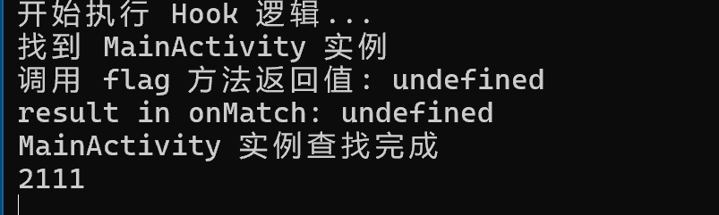


#### 总结

主动调用非静态方法，实例已存在，查找实例 ，无需new

#### Frida 0x6

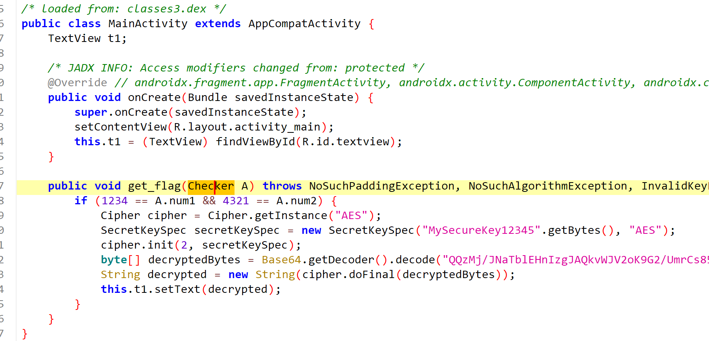

看到这里我已经不会了，已经放松...

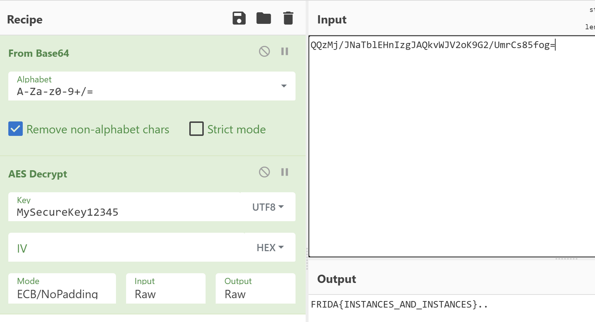

但是还是要练习frida的

get\_flag方法 传参是类，

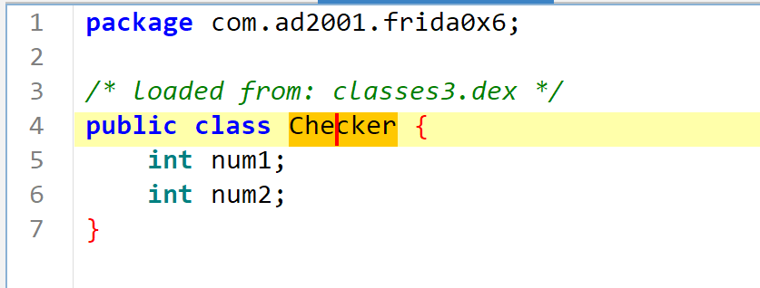

先创建一个Checker类实例。改非静态字段。1234 == A.num1 && 4321 == A.num2

再查找非静态方法get\_flag的类MainActivity，然后回调方法，传参类instance

```
function hook() {


  var utils=Java.use("com.ad2001.frida0x6.Checker"); 
  var instance  = utils.$new();


  instance.num1.value = 1234;
  instance.num2.value = 4321;
  console.log(instance.num1.value);
  console.log(instance.num2.value);


   var ret = null;
   Java.choose("com.ad2001.frida0x6.MainActivity",{    //要hook的类
            onMatch:function(obj){
                ret=obj.get_flag(instance); //要hook的方法
                console.log("hook get_flag !!!" );


            },
            onComplete:function(){
                    console.log("result:~ " + ret);
            }
   });
   
}


function main() {


        Java.perform(function () {
        console.log("开始执行Hook...");
        hook()
    })
}
 setImmediate(main);
```

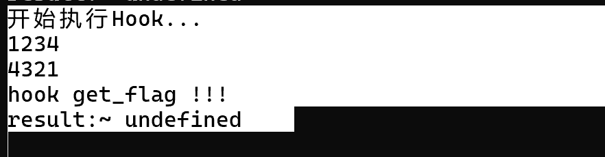

​


#### 总结

创建类实例，调用非静态方法，传入参数为类。
