# 基于异常处理的逻辑跳转逆向-先知社区

> **来源**: https://xz.aliyun.com/news/18927  
> **文章ID**: 18927

---

# 基于异常处理的逻辑跳转逆向

‍

## 1、引言

在逆向工程领域，异常处理机制常常是软件保护的重要环节，而 本篇文章程序中 ，除 0 异常触发与 catch 块跟踪的组合，更是给逆向分析带来了不小的挑战。本文将结合 IDA 反汇编工具的使用难点、汇编代码的深度解读以及 Z3 约束求解器的实战应用，完整还原该程序异常处理逻辑的分析过程

从异常块设置，到除 0 异常的触发条件，再到 catch 块的执行逻辑，最终通过z3约束求解获取程序所需的正确序列号。

总结：设置异常块->除0异常触发->跟踪catch块（下断点分析）

## 2、过程

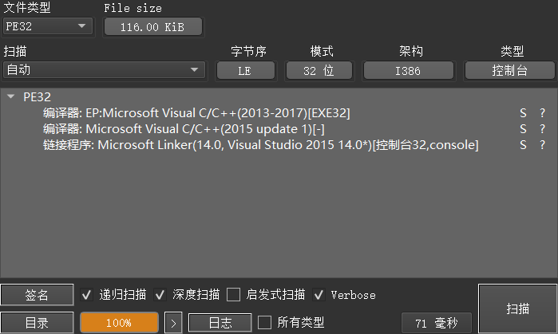

从初始逆向环境来看，程序在 IDA 中呈现出明显的 “不兼容” 特征。首先是中文显示问题，在.rdata 段中，虽然能看到存储中文提示的内存地址（如 asc\_41C6F8 对应 “请输入序列号:”），但由于编码格式未正确设置，IDA 默认无法正常解析中文，需手动配置 GBK 编码才能查看，这给理解程序交互逻辑带来了初始障碍。

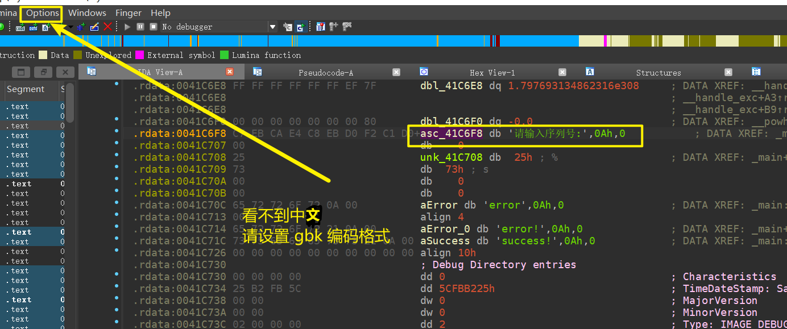

IDA也不支持try....catch

隐藏了代码

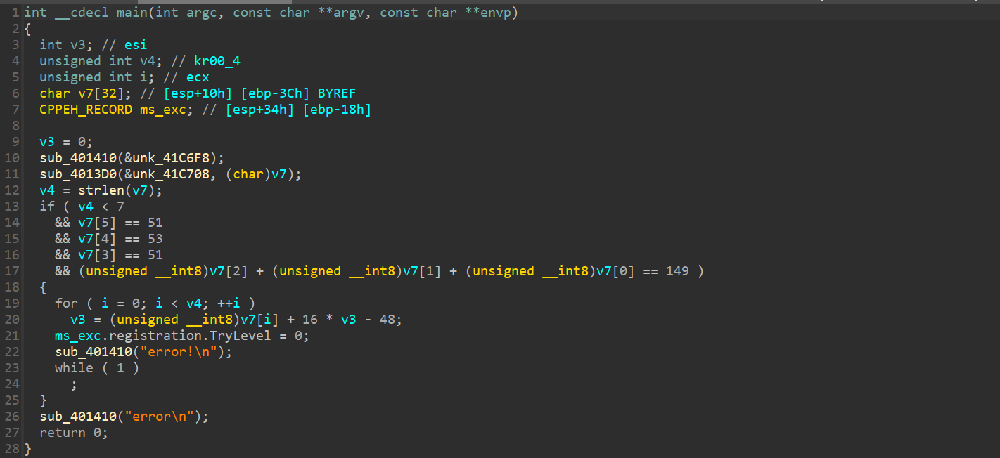

‍

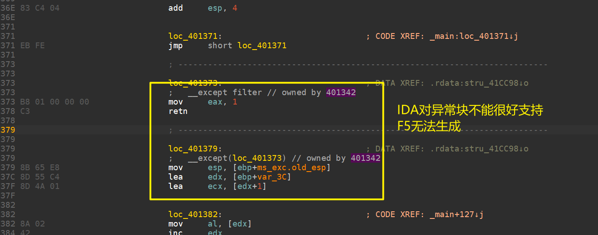

在.text 段的 loc\_401342 处，程序标记了 try 块的起始位置，对应的汇编指令明确了 try 块的核心功能 —— 初始化异常登记结构，并通过条件判断决定是否触发除 0 异常。

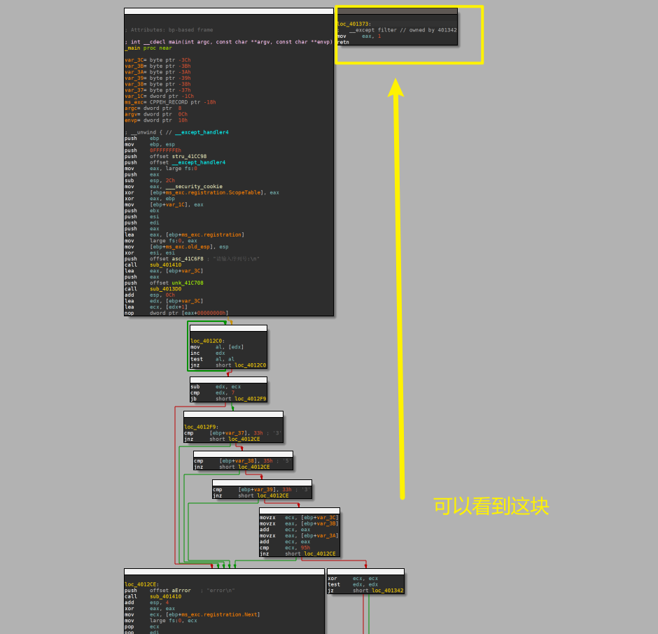

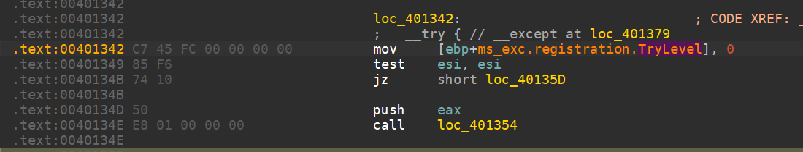

1. **try 块初始化**：指令 “mov [ebp+msexc.registration.TryLevel],0” 用于初始化异常登记结构中的 TryLevel 字段，将其设置为 0，这是 Windows 异常处理机制中标记 try 块开始的标准操作，表明程序从该位置进入异常保护区域。
2. **esi 寄存器的关键作用** ：紧接着的 “test esi, esi” 指令用于检查 esi 寄存器的值是否为 0。该指令与后续的 “jz short loc40135D” 构成条件分支 —— 若 esi 为 0，则跳转到 loc40135D，不执行后续可能触发异常的代码；若 esi 不为 0，则执行 “push eax” 和 “call loc401354”，调用 loc401354 处的子函数，而该子函数正是除 0 异常的触发源。
3. **除 0 异常触发子函数解析**：loc401354 处的子函数汇编代码虽短，但逻辑关键。指令 “pop eax” 用于平衡栈结构，获取调用前压入栈中的 eax 值；“sub eax,0” 看似无实际运算意义，实则可能是程序开发者为混淆逆向逻辑添加的冗余指令；“sub esi,eax” 将 esi 与 eax 的值相减，更新 esi 的数值；最终的 “div esi” 指令是异常触发的核心 ——div 指令用于执行无符号除法，若除数 esi 为 0，将直接触发整数除 0 异常（对应异常代码 c0000094，在后续调试中也验证了这一异常代码的出现）。

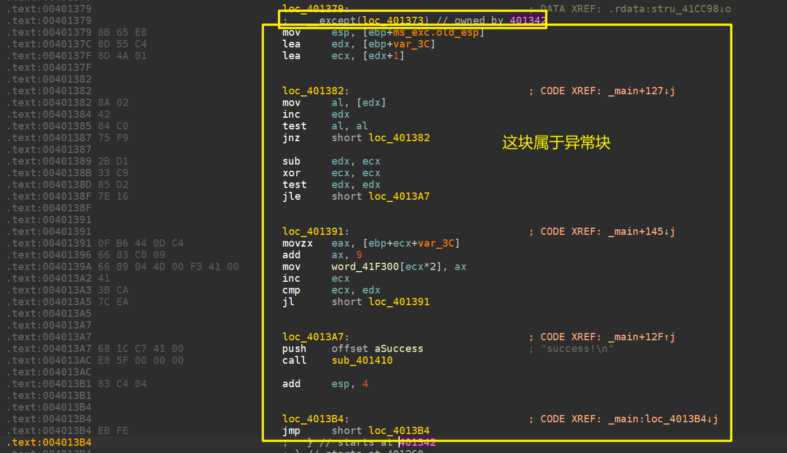

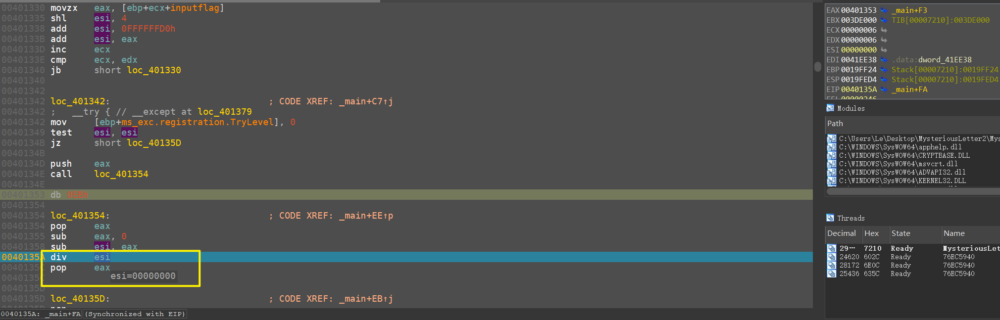

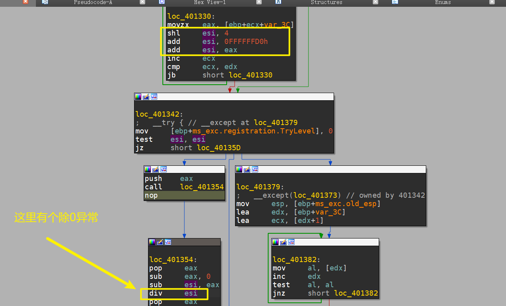

当除 0 异常触发后，程序会进入 except 块（对应 loc\_401379 处），该块的核心功能是对输入数据进行处理，并最终判断序列号是否正确。

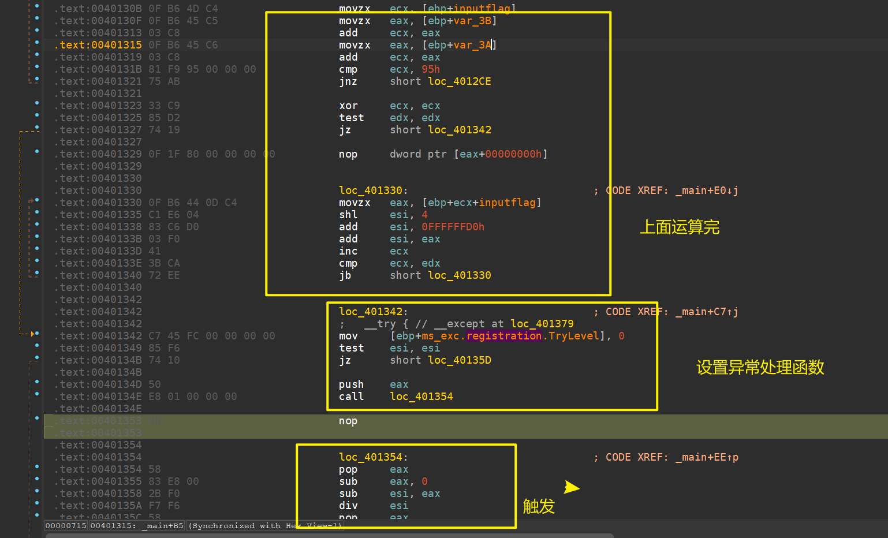

1. **栈结构恢复**：except 块起始的 “mov esp, [ebp+msexc.oldesp]” 指令是异常处理中的关键操作，用于恢复栈指针 esp 到异常触发前的状态（通过 msexc 结构中的 oldesp 字段），确保后续数据访问的正确性，避免因异常导致的栈紊乱。
2. **输入数据长度计算**：指令 “lea edx, [ebp+var3C]” 和 “lea ecx, [edx+1]” 分别获取输入数据的起始地址（var3C 为输入数据在栈中的偏移）和起始地址 + 1 的位置，随后通过 loc401382 处的循环逻辑计算输入数据的长度。循环中，“mov al, [edx]” 读取当前地址的字节数据，“inc edx” 将地址向后偏移 1，“test al, al” 检查当前字节是否为字符串结束符（0x00），“jnz short loc401382” 若未遇到结束符则继续循环。当循环结束后，“sub edx, ecx” 通过地址差值计算出输入数据的长度（不包含结束符）。
3. **输入数据加密处理**：在获取输入数据长度后，程序通过 loc401391 处的循环对输入数据进行逐字节处理。“movzx eax, [ebp+ecx+var3C]” 读取输入数据中索引为 ecx 的字节（movzx 指令确保无符号扩展，避免符号位影响后续计算）；“add ax,9” 将该字节的数值加 9，这是一种简单的加法加密操作；“mov word41F300 [ecx*2], ax” 将处理后的数据存储到 word\_41F300 地址处（ecx*2 表明存储的是 16 位数据，与 ax 寄存器的位数匹配）。循环通过 “inc ecx” 和 “cmp ecx, edx” 控制迭代，直到处理完所有输入字节。
4. **结果提示输出**：当数据处理完成后，程序会执行 “push offset aSuccess” 和 “call sub401410”，将 “success!” 字符串的地址压栈，并调用 sub401410 函数（结合字符串操作特征可判断该函数为输出函数），输出成功提示。若序列号验证失败，则会跳转到其他分支输出 “error” 或 “error!” 提示，这与.rdata 段中的字符串提示逻辑完全对应。

‍

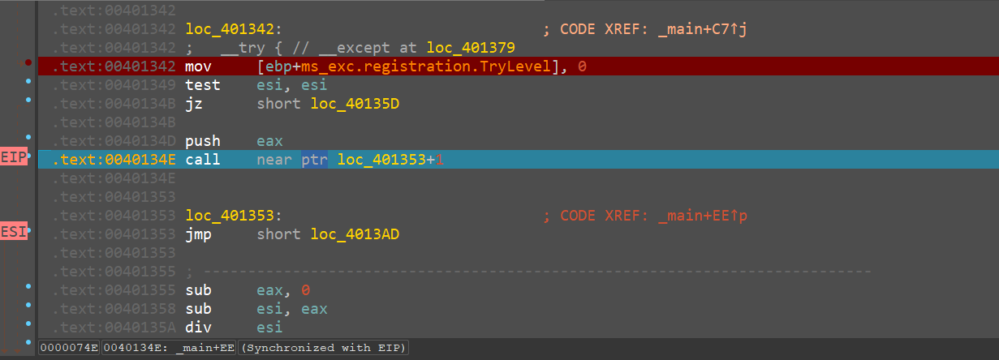

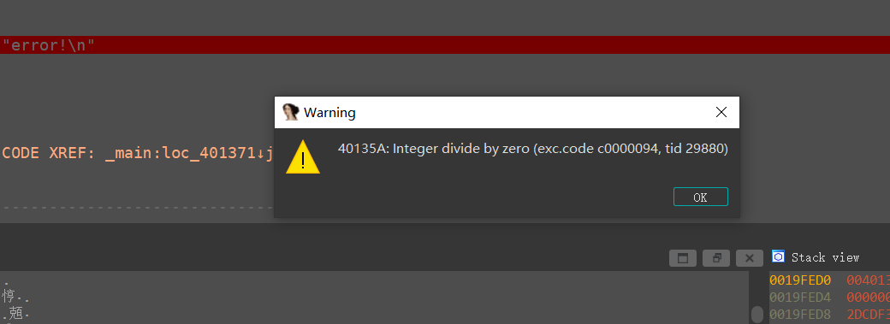

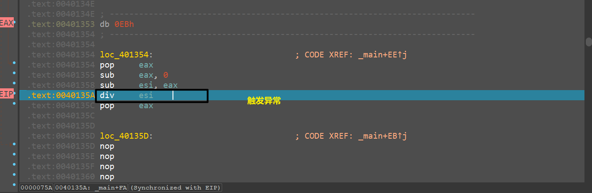

发现跟踪失败，怎么做？在异常处理块下断点即可，触发异常交给程序，他会自动跳到这个except块，就不用卡死了

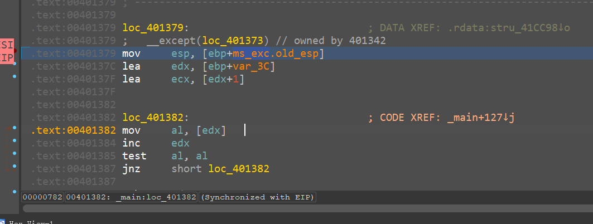

这个就是核心逻辑了

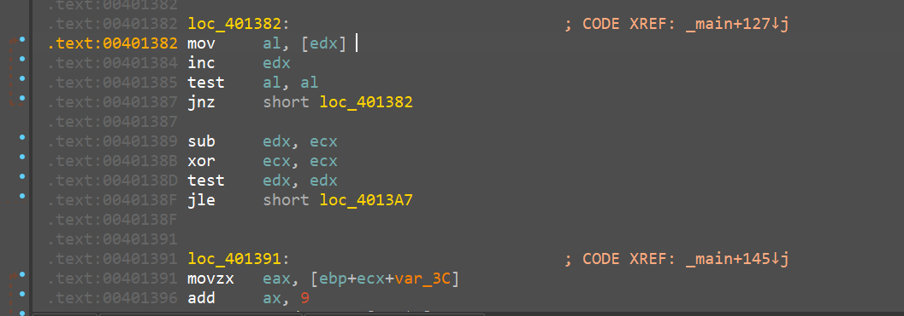

把算法提取出来，使用z3即可解决

‍

## 3、解决

```
from z3 import *

v1 = Int('m1')
v2 = Int('m2')
v3 = Int('m3')
v4 = 0x33
v5 = 0x35
v6 = 0x33

s = Solver()

s.add(And(v1+v2+v3==0x95,
    v6 + 0x10*(v5 + 0x10*(v4 + 0x10*(v3 + 0x10*(v2 + 0x10*(v1 + 0x10*0 - 0x30 ) - 0x30) -0x30) -0x30) -0x30) -0x30 == 0x401353),
    v1 >= 33,
    v2 >= 33,
    v3 >= 33
    )

while s.check() == sat:
    t = []
    print("compute result: ")
    m = s.model()
    t.append(str(m[v1]))
    t.append(str(m[v2]))
    t.append(str(m[v3]))
    t.append(str(v4))
    t.append(str(v5))
    t.append(str(v6))
    t = map(int, t)
    t = map(chr, t)
    print("".join(t))
    s.add(Or(v1 != s.model()[v1], v2 != s.model()[v2], v3 != s.model()[v3]))

```

解密得到

```
compute result: 
401353
compute result: 
3A!353
```
