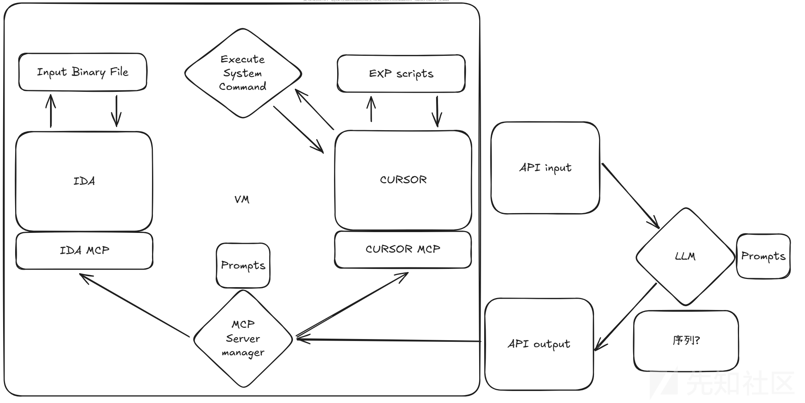
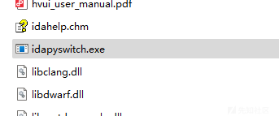
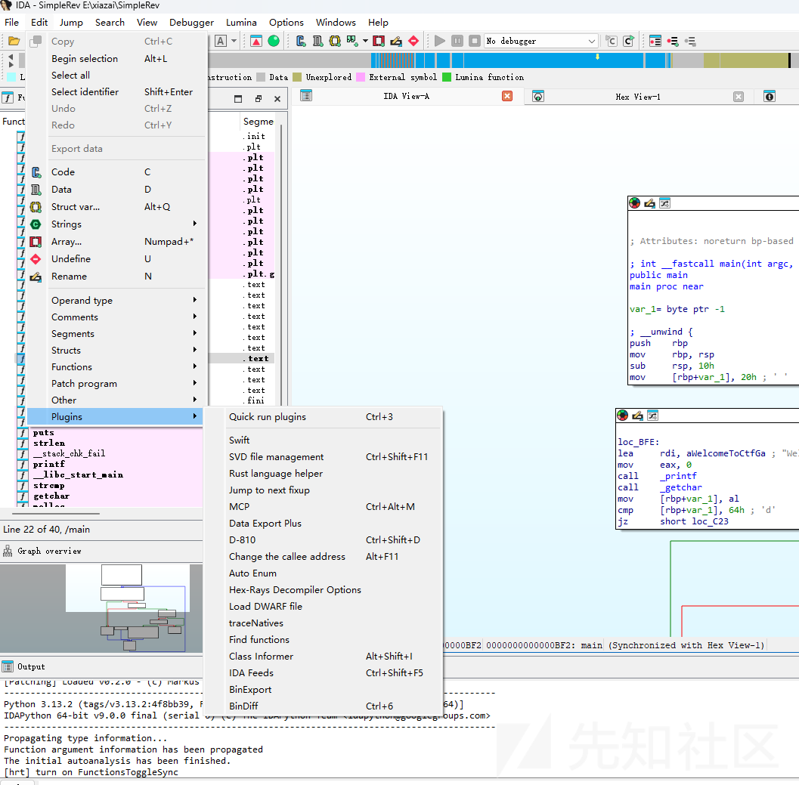
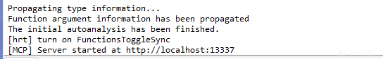
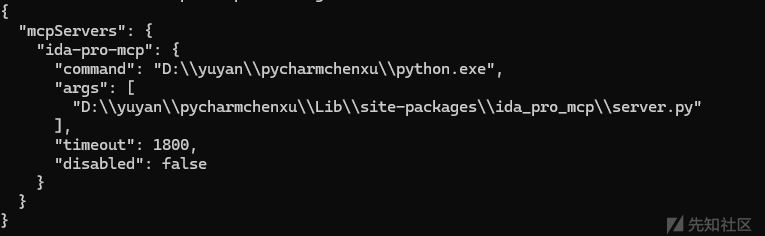
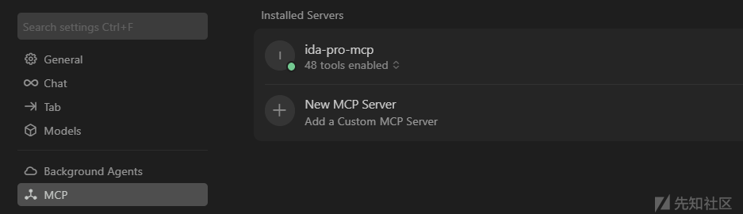
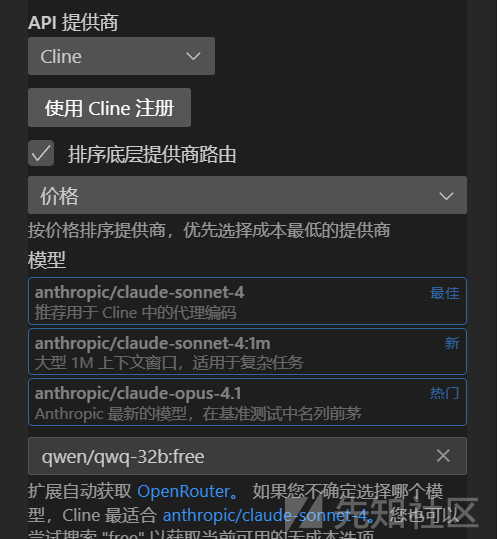
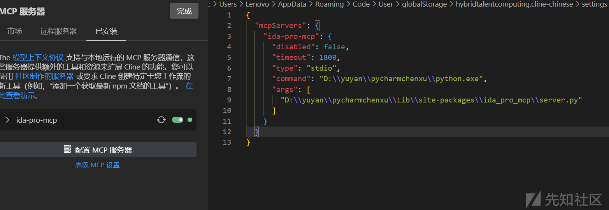
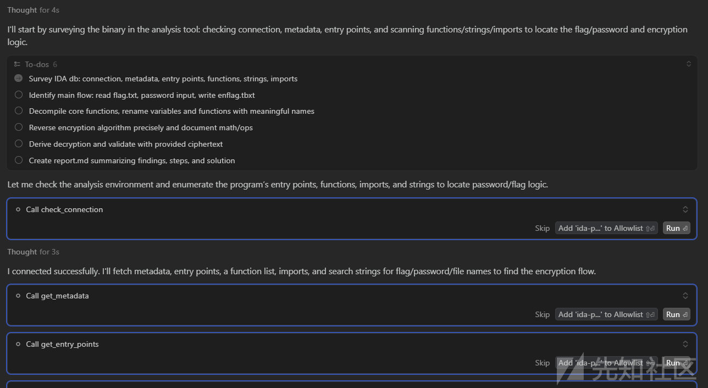
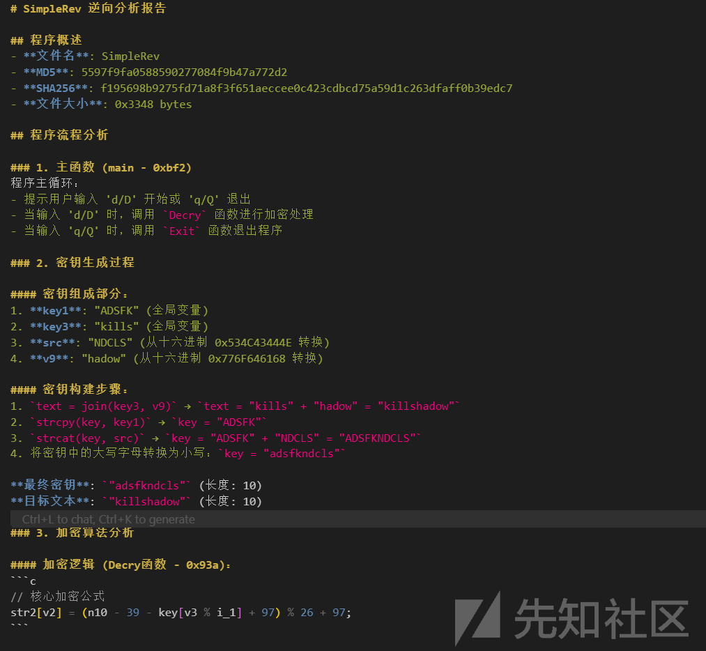

# ida + mcp,配置vs code和cursor实现AI自动化逆向-先知社区

> **来源**: https://xz.aliyun.com/news/18929  
> **文章ID**: 18929

---

# **ida+mcp来实现AI自动化完成逆向**

### 环境准备

1. IDA\_Pro(最好使用9以上的版本 , 这里我使用的是9.1的版本)

链接:<https://www.52pojie.cn/thread-1999866-1-1.html>

2. mcp客户端(可以使用vs code+插件Cline , 这里使用的cursor)
3. MCP服务端(链接<https://github.com/mrexodia/ida-pro-mcp>)
4. python版本要在 3.11 以上

### 架构与模块

* **IDA MCP** → 把反汇编/函数信息输出为 JSON；
* **MCP Server** → 把 JSON + Prompt 一起发给 LLM；
* **LLM** → 返回 JSON（含漏洞描述 / PoC 模板）；
* **CURSOR MCP** → 解析 JSON，把 PoC 写入代码编辑器，供人工审查或执行。

### 配置MCP服务端

配置详情:<https://github.com/mrexodia/ida-pro-mcp>

**要先有 IDA 的新版本(9以上)**

1. **安装 IDA Pro MCP包与 配置MCP服务器**

pip install --upgrade git+https://github.com/mrexodia/ida-pro-mcp

ida-pro-mcp --install

### **使用:**

1. **在IDA\_Pro9的目录中,选择idapyswitch.exe选择python版本(在3.11以上)**

2. **打开目标程序 , 插件中打开mcp**

3. 连接MCP

4. 使用ida-pro-mcp --config

**cursor配置**

创建一个新的mcp , 把刚才的config添加到 json文件

**vs code配置**

配置cline这个插件

添加MCP服务器连接

最后要重启一下vs code

到这里就配置好了 , 可以用cursor和vs code进行逆向分析了

​

### cursor运行大概

提示词  
目标程序流程：读取 flag.txt，要求输入密码，执行加密并输出 enflag.txt。  
我已拿到 enflag.txt 的十六进制字节序列：C3 82 A3 25 F6 4C 36 3B 59 CC C4 E9 F1 B5 32 18 B1 96 AE BF 08 35  
请在 IDA Pro / MCP 中对程序进行静态逆向分析，找出加密算法和恢复 flag.txt 的方法（无需暴力破解）。

在 MCP 中请遵循以下工作流程与约束：

1. 首先运行反编译器（Hex-Rays）并通读主要函数（主入口、文件读写、加密/解密函数、密钥派生函数）。
2. 在反编译结果上添加注释，说明每一步的目的与数据流（输入、输出、临时缓冲区）。
3. 将变量、函数重命名为语义化名称（例如 input\_file, output\_file, derive\_key, encrypt\_block）。
4. 必要时更改变量/参数类型（指针、数组、整型宽度）以便可读性。
5. 若反编译代码不清晰，切换到反汇编并对关键代码段逐行注释。
6. **绝不使用暴力破解**。仅通过静态分析与小型脚本（Python）推导出明文。
7. 始终使用 MCP 的 `convert_number` 工具来做数制/进制转换，**不要手动转换**。
8. 如果遇到常见密码学构建（例如：S-box、线性变换、XOR流、简单置换、分组密码轮函数、LFSR、PRNG），请：

标明是否为可逆操作；

写出逆变换（如果存在）；

给出对明文恢复所需的具体步骤或方程。

9. 当在 IDA 中识别出加密/解密函数后，写一个简洁的 Python 脚本（在 report.md 中附上）来对给定 enflag 字节序列做逆向运算并输出 flag.txt。
10. 输出成果物：

一个 `report.md`，包含发现、推导过程、关键代码注释、恢复步骤、Python 解密脚本、以及最终得到的 flag（若成功）。

在 MCP 注释/函数重命名的快照或导出（如果工具支持导出，请一并附上）。

当你找到可能的密码/flag 时，用该密码向我请求确认（不要自动假定成功，先把结果写入 report.md 并告知我进行验证）。

保持操作记录的可复现性：所有对数据的操作（如字节顺序、位移、掩码、表格）都要在 report 中说明并给出示例计算。

注意：任务优先级是准确可复现地推导出解密过程与最终 flag，而不是穷举。谢谢！

输入（供参考）：  
enflag hex: C3 82 A3 25 F6 4C 36 3B 59 CC C4 E9 F1 B5 32 18 B1 96 AE BF 08 35

最后会生成一个report.md

