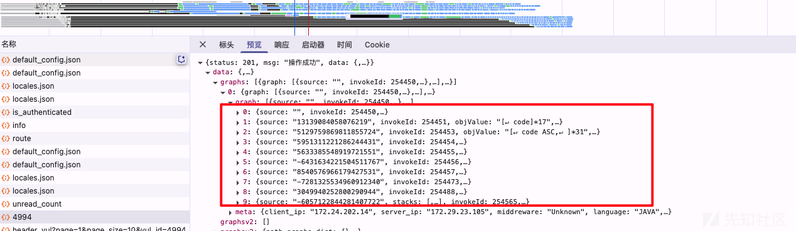
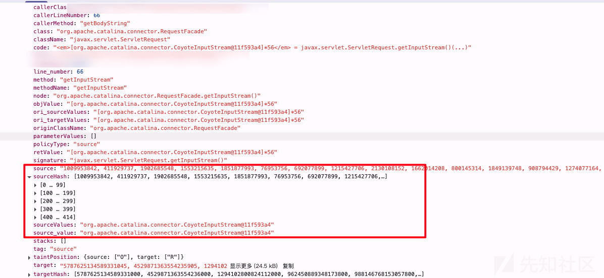

# dongtai java agent 中误报的问题-先知社区

> **来源**: https://xz.aliyun.com/news/18930  
> **文章ID**: 18930

---

之前记录了下关于洞态IAST agent 的相关内容讲解：<https://xz.aliyun.com/news/17854>，后面说是要讲解一些实际案例，主要担心还是不同企业采用相关开发的框架实践可能不一样，但是后来想想还是拿出来做下分析也好；因此在此记录下个人认为算是常见的几种情况吧；

# 调试分析

这里主要还是java相关的内容，也不能出现误报或者什么情况都要厂商来解决是吧，毕竟大部分还是业务的代码。这里主要还是说明一点吧，调试如果能稳定复现的话尽量直接开启远程debug调试。因为本地和远程会出现很多意料不到的问题。下面一个就是遇到的这种情况；

## **debug调试**

本地下载对应agent

1、IDEA项目启动“虚拟机选项”命令添加：

```
-javaagent:/user/dongtai-agent.jar -Ddongtai.app.name=sec-mircro-001 -Diast.engine.delay.time=30
```

2、解压jar包文件复制到项目中，之后点击相关文件jar右键添加为库；


## **远程debug调试**

远程调试：

<https://doc.dongtai.io/docs/development/dongtai-java-agent-doc/agent-debug/>

```
服务端配置：
java -agentlib:jdwp=transport=dt_socket,server=y,suspend=n,address=5005 -javaagent:/path/to/dongtai-agent.jar -jar app.jar
```

客户端配置：


之后启动调试在相关位置端点即可（远程调试这里可以看出并不需要具备源码或者启动命令，指需要jar或者能定位即可。iast的agent就是一个jar）；

下面讲解的主要是一个sql注入的案例，可以做下适当了解。

like注入类型

* 漏洞语句：

* `String sql = "select * from students where username like '%" + username + "%'";`
* java.sql.Statement#executeQuery

* 正常语句：

* `String sql = "select * from students where username like concat(?, '%')";`
* java.sql.PreparedStatement#executeQuery
* sink点hook：`java.sql.Connection.prepareStatement(java.lang.String)`

# sql注入的误报

之前文章讲过iast agent关于java的相关处理，dongtai系统上其实可以看到某个漏洞的所有污点调用链路，如下图，其实就可以对照着去看下污点传播的情况，具体是出在什么地方导致了误报；（当然熟悉了后一般看下第一个source点就大概能判断出来了，后面可以说下原因）



source节点：

```
caller : "org.springframework.boot.actuate.web.trace.servlet.TraceableHttpServletRequest.extractHeaders()" //调用该节点的方法，比较关键
callerClass : "org.springframework.boot.actuate.web.trace.servlet.TraceableHttpServletRequest"//调用该节点的类
callerLineNumber : 88//行位置
callerMethod : "extractHeaders"//方法
class : "javax.servlet.http.HttpServletRequestWrapper"
className : "javax.servlet.http.HttpServletRequest"
code : "<em>[org.apache.tomcat.util.http.ValuesEnumerator@d5995ae]*52</em> = javax.servlet.http.HttpServletRequest.getHeaders(java.lang.String)(...)"
file : "org.springframework.boot.actuate.web.trace.servlet.TraceableHttpServletRequest"
invokeId : 377351
line_number : 88
method : "getHeaders"
methodName : "getHeaders"
node : "javax.servlet.http.HttpServletRequestWrapper.getHeaders()"
objValue : "[com.ceshi.hello.world.infrastructure.fliter.RequestReaderHttpServletRequestWrapper@3ac9ac53]86"
ori_sourceValues : "[appkey]*6"
ori_targetValues : "[org.apache.tomcat.util.http.ValuesEnumerator@d5995ae]*52"
originClassName : "javax.servlet.http.HttpServletRequestWrapper"
parameterValues: [{index: "P1", value: "[appkey]*6"}]
policyType : "source"
retValue : "[org.apache.tomcat.util.http.ValuesEnumerator@d5995ae]*52"//节点方法返回对象
signature : "javax.servlet.http.HttpServletRequest.getHeaders(java.lang.String)"
source : ""
sourceHash : []
sourceValues : "appkey"
source_value : "appkey"
stacks: []
tag : "source"
taintPosition: {source: ["P1"], target: ["R"]}
target : "961964570201134510"
targetHash: [961964570201134500]
targetRange: [{hash: 961964570201134500,…}]
targetValues : "<em style="color:red;"><em style="color:red;">org.apache.tomcat.util.http.ValuesEnumerator@d5995ae</em></em>"
target_value : "<em style="color:red;"><em style="color:red;">org.apache.tomcat.util.http.ValuesEnumerator@d5995ae</em></em>"
type : "污点来源方法"
```

上面的参数

* invokeId：标识id
* tag/policyType： 节点类型（source源节点、sink危险节点、propagator传播节点）
* callerClass：当前节点的调用方法
* callerLineNumber：当前节点定位的具体行位置
* source\_value或sourceValues：当前节点source的位置参数
* targetValues或target\_value：当前节点target的位置参数
* methodName：节点的方法
* signature：节点的方法签名
* className：节点的对象
* objValue：节点方法的对象数值内容
* retValue：节点方法的返回数值内容
* parameterValues：节点方法的参数数值内容

只是看的话可能还是不是很理解，最好去找个漏洞跟踪看下；

## 污点传播的复习

首先还是要明确dongtai iast系统的漏洞分析流程，关键点还是在于污点处理逻辑。前文可知主要是基于TAINT\_HASH\_CODES、TAINT\_RANGES\_POOL相关的处理进行判断；因此在于不同的处理阶段中（source、Propagato、sink）对于污点的标记；其主要是利用hashcode。大部分情况可能也是因为某些方法处理导致某些内容被识别为污点（污点选取范围过大），之后在下文Propagato传播或者sink点判断中hash一致导致了误报。

<https://mp.weixin.qq.com/s/fq2m59L_2Piqyeufl6eZFQ>

可参考上文中的例子：

```
@ResponseBody
@RequestMapping("/iast17")
public String iast17(@RequestParam("name") String name) {
    ArrayList<String> a = new ArrayList<>();
    a.add("123");
    a.add(name); // a对象会被标记成污点

    Iterator<String> b = a.iterator();
    System.out.println(b.next());
    System.out.println(b.next()); // "123"会被标记成污点

    File f = new File("123");   
    return f.getName(); // 返回值"123"被认为是可控的,会产生误报
}
```

上面代码其实就是name入参之后污染了对象a，在传播中把“123”的hash入到了污点池。最终在sink点检测则触发了漏洞上报；其实大部分的误报也都是这种原因导致；

> 这里不知道大家明不明白，实际情况上来说就是一般我们首先会把source的入参当作污点，这个入参可能有各种类型（souce的选取依靠iast的自身hook逻辑，可能是javax.servlet.ServletRequest.getParameter(String name)这种。）简单的string等内容还行，但是更多的可能是数组集合、还有可能是对象Object，这种时候dongtai的逻辑就可能把涉及变量参数都转换为污点，一个对象里面可能有各种东西，比如“，”“+”“'”等内容。
>
> 在后面的业务代码逻辑中，如果刚好执行到这样的代码 string.append(",")，（刚好dongtai支持append的污点传播hook）。这时候其实这里的‘,’逗号并不是入参过来的污点，但是却因为污点的hash一样，因此string最后也会被标记为污点，再之后这个string被执行到了一个sql的执行逻辑里面那么这个误报就形成了；

可以看下下面一例关于SQL注入的误报实际案例：

controller入口：

```
    /**
     * 根据时间同步批次
     */
    @PostMapping("/api/query/batchByDate")
    public GeneralResult<Object> syncBatchByDate(HttpServletRequest request, int schoolId, String date) {
        GeneralResult<Date> checkResult = orderSyncParamsVerify.checkParams(schoolId, date, request);
        if (!checkResult.isSuccess()) {
            return GeneralResult.error(checkResult.getMessage());
        }
        int count = orderSyncService.syncBatchInfoByLastModifyDate(schoolId, checkResult.getData());
        return GeneralResult.success("同步完成" + count + "条");
    }
```

DB层处理(省略了中间服务层不关键步骤)：

```
    /**
     * 查询订单批次
     *
     * @param connection
     * @param codeSet
     * @return
     */
    @SysAccessLog(source = DefaultDataEnums.Source.DB, action = DefaultDataEnums.Action.QUERY, requestExcludeParamsName = {"connection"})
    public GeneralResult<List<OrderSalesOrderBatch>> queryBatchInfoByOrderCode(
        Connection connection, Set<String> codeSet, int schoolId) {

        List<OrderSalesOrderBatch> list = new ArrayList<>();
        PreparedStatement ps = null;
        ResultSet rs = null;
        List<String> codeList = codeSet.stream().collect(Collectors.toList());
        StringBuilder sb = new StringBuilder(TIDBConstants.QUERY_BATCH_BY_ORDER_CODE_SQL);
        sb.append(" ( ");
        int size = codeList.size();
        for (int i = 0; i < size; i++) {
            if (i > 0) {
            //根据相关链路分析可以知道其实是“,”这个变量hash 189857661108碰撞命中之前的某个污点；
            //如果是sb.append方法有问题下面的也会命中，但是链路中会发现只有这个点触发了污点跟踪逻辑。
            //因为分析中会发现其实是前文某个source获取过程或者Propagator处理过程中将“,”放到了污点池中进而在这里触发了误报；
                sb.append(",");
            }
            sb.append(" ?");
        }
        sb.append(" ) ");
        sb.append(" and nSchoolId = ? ");
        try {
        //sink点触发，但是根据上文可以知道sb整个过程没有任何外部输入源，因此肯定是在sb处理的某个过程中和某个污点碰撞导致了命中污染了整个链路；
            ps = connection.prepareStatement(sb.toString());
            for (int i = 0; i < size; i++) {
                ps.setString(i + 1, codeList.get(i));
            }
            ps.setInt(size + 1, schoolId);
            rs = ps.executeQuery();
            while (rs.next()) {
                list.add(TIDBOrderSyncMapping.queryBatchInfoByOrderCodeResultMapping(rs));
            }
        } catch (SQLException e) {
            Map<String, Object> request = new HashMap<>();
            request.put("schoolId", schoolId);
            request.put("codeSet", codeSet);
            Log.sysErrorLogger("OrderTidbRepository#queryBatchInfoByOrderCode",
                Source.DB.getStatus(), ExceptionUtils.getStackTrace(e),
                StateCode.REMOTE_DB_SQL_ERROR.getCode().toString(), Action.QUERY.getStatus(),
                request, null, null, null, null);
            return GeneralResult.error(StateCode.REMOTE_DB_SQL_ERROR.getMessage());
        } finally {
            close(ps, rs);
        }
        return GeneralResult.success(list);
    }
```

漏洞的部分链路：


针对sql注入的误报，最大来源可能是字符串拼接，当字符串拼接的时候即使是采用了预编译（#符号），但是因为字符串会直接转变为hash污点，进而污染了调用链；

## ServletRequest的过滤

上文可知大量的误报都是由于ServletRequest这个类作为了污点source处理导致了污点的扩大，之前文章中有污点和传播的节点处理，但是跟踪agent后你就会发现其实dongtai是做了处理。

针对resolveArgument这种Spring MVC 的参数解析器处理ServletRequest的是否过多污点来源的处理

```
            if ("resolveArgument".equals(event.getMethodName())) {
                try {
                    Class<?> aClass = Class.forName("javax.servlet.ServletRequest");
                    Object parameterInstance = event.parameterInstances[0];
                    Method getParameterType = parameterInstance.getClass().getMethod("getParameterType");
                    getParameterType.setAccessible(true);
                    Class<?> invoke = (Class)getParameterType.invoke(parameterInstance);
                    boolean assignableFrom = aClass.isAssignableFrom(invoke);
                    if (assignableFrom) {
                        return;
                    }
```

当spring框架在处理输入源时存在HttpServletRequest的情况会导致输入源很多不相关内容都计入污点池，导致如果存在某个特殊字符刚好命中污点池则会出现误报情况：

```
    @RequestMapping(value = "/one")
    public List<Student> one(@RequestParam(value = "username") String username, HttpServletRequest request) {
        if (request.getRequestURI().isEmpty()) {
            return indexLogic.getStudent("demo7799");
        }
        return indexLogic.getStudent(username);
    }
```

但是上面的处理其实存在一定问题，这也就是在本地复现会一直复现不成功，但是线上远程debug调试的话稳定复现。因此这里教会我们针对这种agent找问题最好就是直接远程debug调试；

* **类加载器的隔离**，这个在远程调试和本地调试结果还不一致，困扰了很久。

涉及 Spring Boot/Fat Jar 启动机制下的类加载器差异。下面AI详细解释：

1. Application ClassLoader（AppClassLoader）

* 这是标准 Java 应用启动时的主类加载器，负责加载 classpath 下的所有类。
* 类名通常为 `sun.misc.Launcher$AppClassLoader`（JDK8）或 `jdk.internal.loader.ClassLoaders$AppClassLoader`（JDK9+）。
* 本地开发环境（如直接用 `java -cp` 或 IDE 运行）时，业务类一般都由它加载。

2. LaunchedURLClassLoader

* 这是 Spring Boot 的自定义类加载器，专门用于加载 fat jar（可执行 jar）中的类和资源。
* 类名为 `org.springframework.boot.loader.LaunchedURLClassLoader`。
* 当你用 `java -jar xxx.jar` 启动 Spring Boot 应用时，Spring Boot 的启动器会创建这个类加载器来加载你的业务代码和依赖。
* 这样做的目的是支持 fat jar 的解包和隔离，避免和系统 classpath 冲突。

3. 你遇到的现象和原因

* **本地环境**：直接用 IDE 或 `java -cp` 启动，业务类由 `AppClassLoader` 加载，agent 的 parent loader 也是 `AppClassLoader`，所以能找到业务类。
* **远程环境（Spring Boot fat jar）**：用 `java -jar` 启动，业务类由 `LaunchedURLClassLoader` 加载，而 agent 还是挂在 `AppClassLoader` 下。此时 agent 默认的类加载器（或 parent）无法访问到 `LaunchedURLClassLoader` 加载的类，所以 `Class.forName("com.example.MyClass")` 找不到。

4. 解决方案

**推荐做法：始终用线程上下文类加载器加载业务类**

```
ClassLoader contextClassLoader = Thread.currentThread().getContextClassLoader();
Class<?> clazz = Class.forName("com.example.MyClass", true, contextClassLoader);
```

* 在 Spring Boot fat jar 场景下，线程上下文类加载器通常就是 `LaunchedURLClassLoader`，这样就能找到业务类。
* 在普通 Java 应用下，线程上下文类加载器就是 `AppClassLoader`，同样能找到业务类。

5. 总结

* `AppClassLoader` 是标准 Java 应用的主类加载器。
* `LaunchedURLClassLoader` 是 Spring Boot fat jar 的专用加载器。
* 两者加载范围不同，导致 agent 代码用默认加载器找不到业务类。
* 用线程上下文类加载器（`Thread.currentThread().getContextClassLoader()`）可以兼容所有场景。

**一句话总结：**

Spring Boot fat jar 场景下，业务类由 `LaunchedURLClassLoader` 加载，agent 默认加载器无法访问，需用线程上下文类加载器解决。因此就是那个逻辑其实一直没有生效，并且也没有支持高版本的servlet；

## 各种filter/aop逻辑

在进入filter/aop等情况下可能存在使用HttpServletRequest进行各种获取操作，这时候就会命中source的hook，就会出现类似上面的情况，但是这个问题当前类似无解（看当前的调用栈疑似因为性能原因无法处理）

### filter

这里遇到最多的污点source是javax.servlet.ServletRequest.getInputStream()方法；

# 总结

回答上面的一个问题，为什么大部分误报直接看下source点就可以了，通过上面的案例可以看出来，若误报不是sink点选取的逻辑，或者针对特殊漏洞的优化处理（SSRF漏洞等）这些非常规情况，因为dongtai这个框架的误报场景主要集中在source点的所在位置的问题。这种大部分是在filter/aop这里业务处理的位置。这里面常见的可能就是javax.servlet.ServletRequest.getInputStream()直接导致source点的污点巨多，如下图。

IAST系统作为AST中的一个算是中要的工具吧，实际使用中个人感觉还是在处理三方包漏洞以及特殊的漏洞类型中会很有效果。最近也研究了下codeql的规则逻辑，我发现codeql中的规则选取已经做的十分完善了，就像这里的request问题在codeql中其实已经做了处理。后面看时间可以简单看看。
