# 基于dexdump+Objection+Frida的Android动态密文分析实战-先知社区

> **来源**: https://xz.aliyun.com/news/18933  
> **文章ID**: 18933

---

# dexdump+Objection+frida实战使用

‍

与平常大家看到的密文不一样，静态分析密文就可以找到，但是这道题目动态运行的时候才会把密文显示出来。

类似Windows的SMC解密一样，在Android平台，我们可以利用objection这款强大的工具，直接查看内存即可！

然后本题用到的算法是RC4的魔改和AES

用到的工具：frida、Objection、cyberchef、python、frida-dexdump

‍

## 1、fridadex-dump脱壳

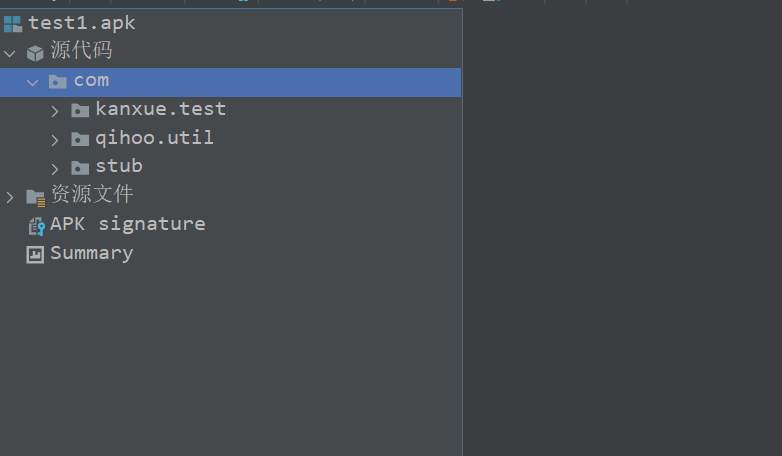

```
frida-dexdump -FU
```

是一次正常脱壳

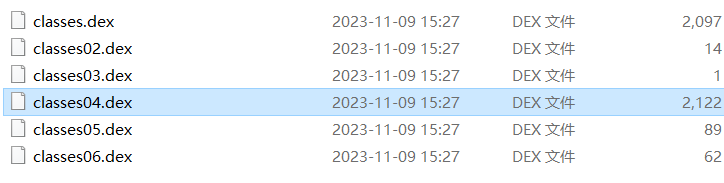

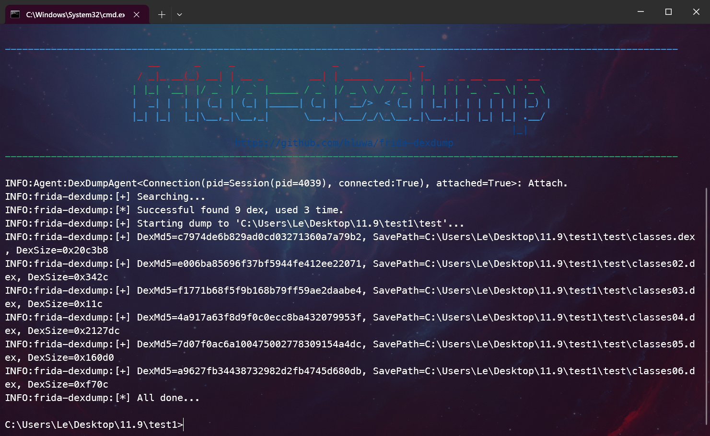

拖入IDA报错：

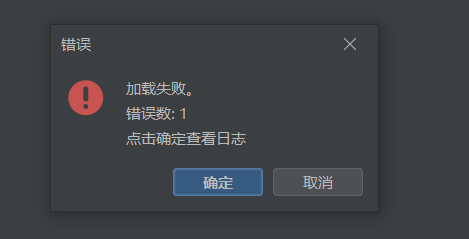

解决：

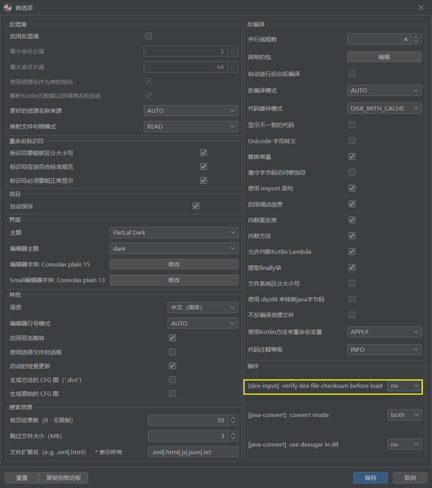

选择no，不校验

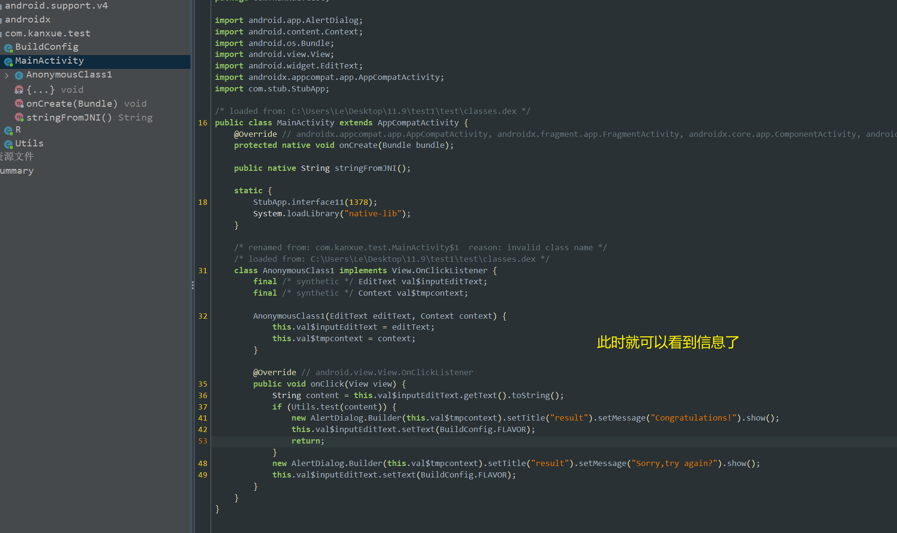

‍

## 2、分析和解题

‍

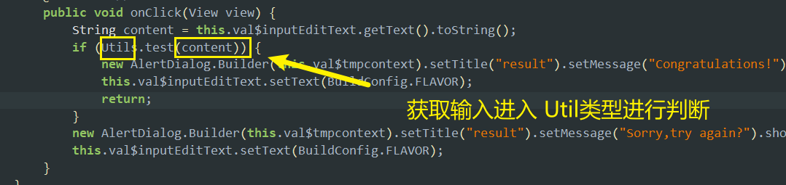

贴出该类完整代码

```
package com.kanxue.test;

import android.util.Base64;
import javax.crypto.Cipher;
import javax.crypto.spec.SecretKeySpec;

/* loaded from: C:\Users\Le\Desktop\11.9\test1\test\classes.dex */
public class Utils {
    public static String cipher = "sGpdX0nDoRPWnonSt0SQQXOk/0wID0jvtAqb2QxJoW4=";

    static String bbbbb(String keys, String encrypt) {
        char[] keyBytes = new char[256];
        char[] cypherBytes = new char[256];
        for (int i = 0; i < 256; i++) {
            keyBytes[i] = keys.charAt(i % keys.length());
            cypherBytes[i] = (char) i;
        }
        int jump = 0;
        for (int i2 = 0; i2 < 256; i2++) {
            jump = (cypherBytes[i2] + jump + keyBytes[i2]) & 255;
            char tmp = cypherBytes[i2];
            cypherBytes[i2] = cypherBytes[jump];
            cypherBytes[jump] = tmp;
        }
        int i3 = 0;
        int jump2 = 0;
        String Result = BuildConfig.FLAVOR;
        for (int x = 0; x < encrypt.length(); x++) {
            i3 = (i3 + 1) & 255;
            char tmp2 = cypherBytes[i3];
            jump2 = (jump2 + tmp2) & 255;
            char t = (char) ((cypherBytes[jump2] + tmp2) & 255);
            cypherBytes[i3] = cypherBytes[jump2];
            cypherBytes[jump2] = tmp2;
            try {
                Result = Result + new String(new char[]{(char) (encrypt.charAt(x) ^ cypherBytes[t])});
            } catch (Exception e) {
                e.printStackTrace();
            }
        }
        return Result;
    }

    public static String aaaaa(String sSrc, String sKey) throws Exception {
        if (sKey == null || sKey.length() != 16) {
            return null;
        }
        byte[] raw = sKey.getBytes("utf-8");
        SecretKeySpec skeySpec = new SecretKeySpec(raw, "AES");
        Cipher cipher2 = Cipher.getInstance("AES/ECB/PKCS5Padding");
        cipher2.init(1, skeySpec);
        byte[] encrypted = cipher2.doFinal(sSrc.getBytes("utf-8"));
        String result = new String(Base64.encode(encrypted, 0));
        return result;
    }

    public static boolean test(String content) {
        new Utils();
        String rc4dipher = bbbbb("kanxue", content);
        try {
            String tmp = aaaaa(rc4dipher, "0123456789abcdef");
            if (!tmp.replace("
", BuildConfig.FLAVOR).equals(cipher)) {
                return false;
            }
            return true;
        } catch (Exception e) {
            e.printStackTrace();
            return false;
        }
    }
}
```

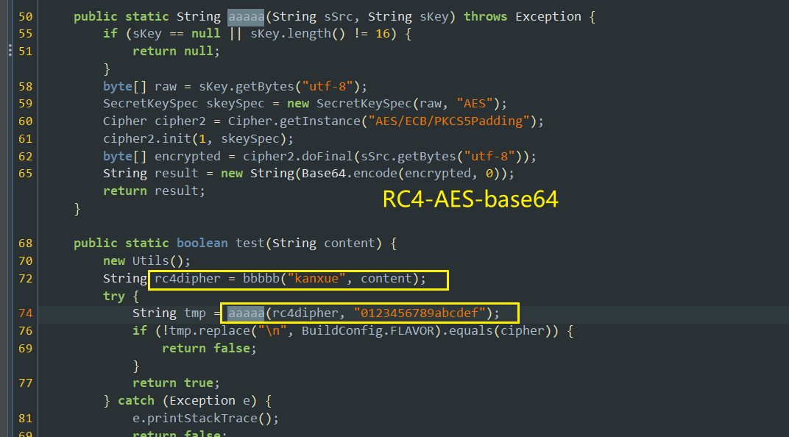

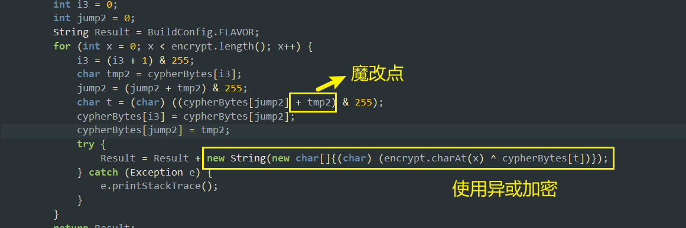

RC4发生了魔改

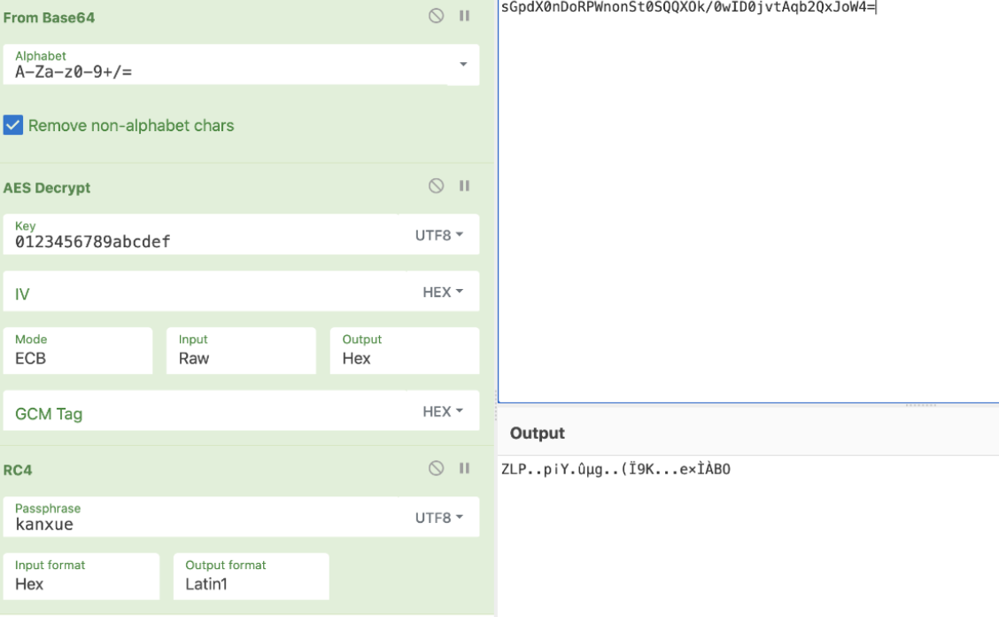

尝试使用Objection获得密文，因为好像密文不正常

```
objection->android heap print fields 0x2492 
0x2492 是类 test.Utils 的句柄handle 
```

这里使用frida脚本来做

```
function myhook() {
    Java.perform(function () {
        //找到基地址
        let Utils = Java.use("com.kanxue.test.Utils");


        Utils["test"].implementation = function (content) {
        //找到该字段
            console.log("the cipher : ", Utils.cipher.value);
            console.log(`Utils.test is called: content=${content}`);
            let result = this["test"](content);
            console.log(`Utils.test result=${result}`);
            return result;
        };
    });
}
setImmediate(myhook);
//frida -U -f com.kanxue.test -l android1.js
```

the cipher : MD97pPa8Dd3cAlJSdCHkPTwmtVL64przZk3HFpU5JaiVrD6dMEhq3BKLXuk6iT4F

有了密文，之后先用AES解密

得到结果

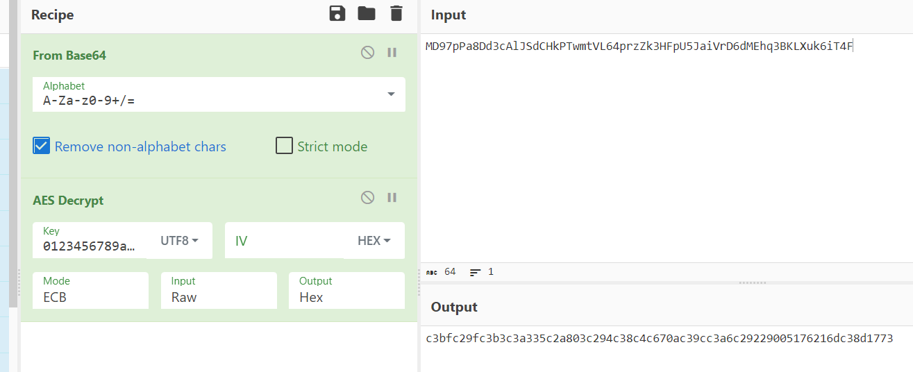

```
c3bfc29fc3b3c3a335c2a803c294c38c4c670ac39cc3a6c29229005176216dc38d1773
```

然后再调用apk内置的rc4进行解密即可

```
function myhook() {

    Java.perform(function () {

        //hex2string类型
        function hexToBytes(hex) {
            for (var bytes = [], c = 0; c < hex.length; c += 2)
                bytes.push(parseInt(hex.substr(c, 2), 16));
            return bytes;
        }
        var string=Java.use("java.lang.String");
        var jsBytes = hexToBytes("c3bfc29fc3b3c3a335c2a803c294c38c4c670ac39cc3a6c29229005176216dc38d1773");
        var buffer = Java.array('byte', jsBytes);
        var inputStr = string.$new(buffer);//bbbb函数的第二个参数位 String 类型

  
        //找到基地址
        let Utils = Java.use("com.kanxue.test.Utils");


        Utils["test"].implementation = function (content) {
            var test = Utils.bbbbb("kanxue", inputStr);
            console.log("Src ->", test);

            let result = this["test"](content);
            return result;
        };
    });
}
setImmediate(myhook);
//frida -U -f com.kanxue.test -l android1.js

```

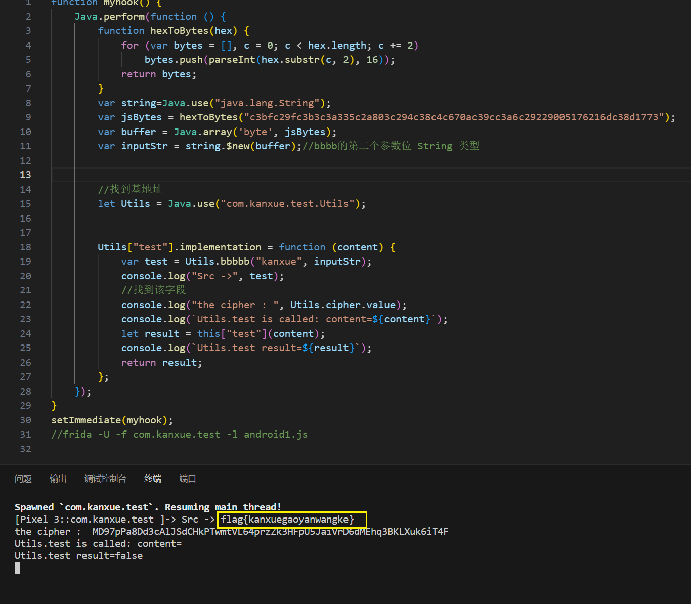

得到flag：

```
flag{kanxuegaoyanwangke}
```

‍
