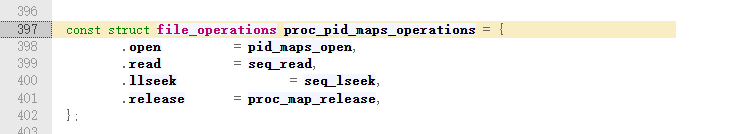
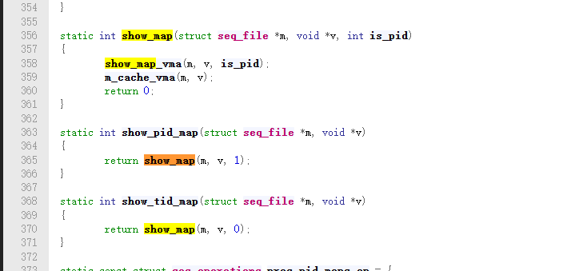
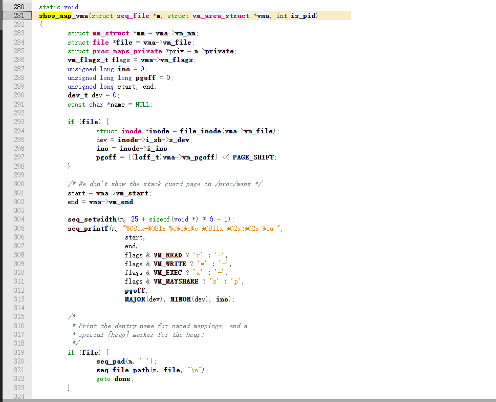
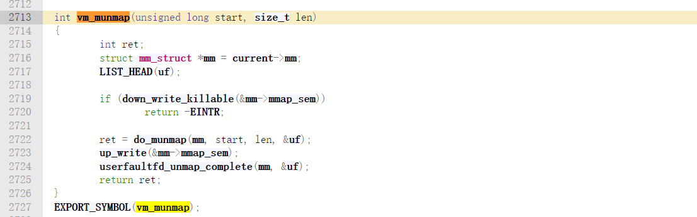

# Linux 内核中/proc/self/maps 的实现与匿名空间释放机制探究-先知社区

> **来源**: https://xz.aliyun.com/news/18939  
> **文章ID**: 18939

---

## 引言

近日，在研究某大厂APP的时候发现了对maps文件匿名空间检测危险so的技术。我之前对maps文件一知半解，对其形成也没有自己的看法，特此花时间，阅读源码，学习了大量文章，从而有了这篇文章。

现在的攻防对抗逐渐不在应用层了，大量的工具均基于Linux内核开发，比如：ebpf沙箱和Apatch-KPM模块，对APP而言也更难检测到。笔者目前是做移动安全风控，对此深有体会。

基于Linux内核 4.9

这里有几个问题：

maps文件如何形成的？

匿名空间会不会显示在maps文件中？

匿名空间的原理是什么？

隐藏so注入技术怎么通过匿名空间实现的？

## 一、核心结论

在 Linux 内核中，匿名空间被释放后**不会**出现在`/proc/self/maps`文件中。这是因为当使用`munmap`系统调用释放匿名空间时，内核会将对应的虚拟内存区域从进程的虚拟内存区域链表（`vm_area_struct`链表）中删除。而`/proc/self/maps`文件的内容是根据进程的虚拟内存区域链表**动态生成**的，所以释放后的匿名空间不再会显示在`maps`文件中。

`/proc/self/maps`的相关内核代码主要位于`fs/proc/task_mmu.c`文件中的`show_map_vma`函数，该函数负责遍历进程的虚拟内存区域链表，并将每个虚拟内存区域的信息格式化为字符串，写入`/proc/self/maps`文件。

## 二、/proc/self/maps 的内核实现

### 2.1 内核文件系统中的实现位置

`/proc/self/maps`的实现主要集中在 Linux 内核源码的`fs/proc/task_mmu.c`文件中。具体来说，`/proc`文件系统的实现主要集中在 Linux 内核源码的`fs/proc/`目录下。对应的代码位于`fs/proc/root.c`中，但`/proc/self/maps`的具体生成逻辑在`task_mmu.c`中。

### 2.2 关键函数 showmapvma 的作用

`show_map_vma`函数是生成`/proc/self/maps`内容的核心函数。该函数的作用是遍历进程的虚拟内存区域链表（`vm_area_struct`链表），并将每个虚拟内存区域的信息格式化为字符串，写入`/proc/self/maps`文件。

在`fs/proc/task_mmu.c`中，`show_map_vma`函数的关键作用包括：

1. 遍历进程的虚拟内存区域链表
2. 为每个虚拟内存区域生成一行描述信息
3. 确定虚拟内存区域的类型（如堆、栈、匿名映射等）

这是完整的内核代码,重点的成员是：struct vm\_area\_struct \*vma

```
static void
show_map_vma(struct seq_file *m, struct vm_area_struct *vma, int is_pid)
{
    struct mm_struct *mm = vma->vm_mm;
    struct file *file = vma->vm_file;
    struct proc_maps_private *priv = m->private;
    vm_flags_t flags = vma->vm_flags;
    unsigned long ino = 0;
    unsigned long long pgoff = 0;
    unsigned long start, end;
    dev_t dev = 0;
    const char *name = NULL;

    if (file) {
        struct inode *inode = file_inode(vma->vm_file);
        dev = inode->i_sb->s_dev;
        ino = inode->i_ino;
        pgoff = ((loff_t)vma->vm_pgoff) << PAGE_SHIFT;
    }

    /* We don't show the stack guard page in /proc/maps */
    start = vma->vm_start;
    end = vma->vm_end;

    seq_setwidth(m, 25 + sizeof(void *) * 6 - 1);
    seq_printf(m, "%08lx-%08lx %c%c%c%c %08llx %02x:%02x %lu ",
            start,
            end,
            flags & VM_READ ? 'r' : '-',
            flags & VM_WRITE ? 'w' : '-',
            flags & VM_EXEC ? 'x' : '-',
            flags & VM_MAYSHARE ? 's' : 'p',
            pgoff,
            MAJOR(dev), MINOR(dev), ino);

    /*
     * Print the dentry name for named mappings, and a
     * special [heap] marker for the heap:
     */
    if (file) {
        seq_pad(m, ' ');
        seq_file_path(m, file, "
");
        goto done;
    }

    if (vma->vm_ops && vma->vm_ops->name) {
        name = vma->vm_ops->name(vma);
        if (name)
            goto done;
    }

    name = arch_vma_name(vma);
    if (!name) {
        if (!mm) {
            name = "[vdso]";
            goto done;
        }

        if (vma->vm_start <= mm->brk && //例如，在`show_map_vma`函数中有如下代码判断一个虚拟内存区域是否为堆：
            vma->vm_end >= mm->start_brk) {
            name = "[heap]";
            goto done;
        }

        if (is_stack(priv, vma))
            name = "[stack]";
    }

done:
    if (name) {
        seq_pad(m, ' ');
        seq_puts(m, name);
    }
    seq_putc(m, '
');
}
```

这段代码检查虚拟内存区域的起始地址是否小于等于进程的`brk`指针，结束地址是否大于等于进程的`start_brk`，如果是，则将其标记为堆。

```
//例如，在`show_map_vma`函数中有如下代码判断一个虚拟内存区域是否为堆：
        if (vma->vm_start <= mm->brk && 
            vma->vm_end >= mm->start_brk) {
            name = "[heap]";
            goto done;
        }
```

### 2.3 /proc/self/maps 的生成流程

当用户执行`cat /proc/self/maps`命令时，内核会调用一系列函数来生成该文件的内容。整个流程大致如下：

1. 用户空间程序调用`open`系统调用打开`/proc/self/maps`文件。
2. 内核中的`proc_pid_maps_operations.open`函数被调用。 
3. 用户空间程序调用`read`系统调用读取文件内容。
4. 内核中的`seq_read`函数被调用，该函数会调用`show_map`函数。 
5. `show_map`函数内部调用`show_map_vma`函数来生成具体的内容。



`show_map`函数会调用`show_map_vma`来生成当前虚拟内存区域的内容

## 三、匿名空间的申请与释放机制

### 3.1 匿名空间的申请过程

在 Linux 系统中，匿名空间通常是通过`mmap`系统调用分配的。当使用`mmap`申请匿名空间时，内核会执行以下关键步骤：

对应的调用

```
// 用户空间 mmap 原型（C标准库）
void *mmap(void *addr, size_t length, int prot, int flags, int fd, off_t offset);

SYSCALL_DEFINE6(mmap_pgoff, unsigned long, addr, unsigned long, len,
        unsigned long, prot, unsigned long, flags,
        unsigned long, fd, unsigned long, pgoff)

```

#### mmap\_pgoff函数

```
SYSCALL_DEFINE6(mmap_pgoff, unsigned long, addr, unsigned long, len,
        unsigned long, prot, unsigned long, flags,
        unsigned long, fd, unsigned long, pgoff)
{
    struct file *file = NULL;       // 用于关联映射的文件（匿名映射文件映射时有效）
    unsigned long retval;           // 返回值（虚拟地址或错误码）

    // 分支1：处理文件映射（非匿名映射，无MAP_ANONYMOUS标志）
    if (!(flags & MAP_ANONYMOUS)) {
        audit_mmap_fd(fd, flags);  // /... 审计相关（非核心）
        file = fget(fd);           // 通过fd获取文件结构体（核心：绑定文件资源）
        if (!file)                 // 若fd无效，返回错误
            return -EBADF;
        // 若文件是大页文件，长度按大页大小对齐
        if (is_file_hugepages(file))
            len = ALIGN(len, huge_page_size(hstate_file(file)));
        // 校验：MAP_HUGETLB标志仅能用于大页文件
        if (unlikely(flags & MAP_HUGETLB && !is_file_hugepages(file)))
            goto out_fput;  // 释放文件资源并返回错误
    }
    // 分支2：处理匿名大页映射（有MAP_ANONYMOUS和MAP_HUGETLB标志）
    else if (flags & MAP_HUGETLB) {
        // /... 定义用户结构体和大页状态结构体（局部变量）
        struct user_struct *user = NULL;
        struct hstate *hs;

        // 解析大页大小配置
        hs = hstate_sizelog((flags >> MAP_HUGE_SHIFT) & SHM_HUGE_MASK);
        if (!hs) return -EINVAL;  // 不支持的大页大小

        len = ALIGN(len, huge_page_size(hs));  // 长度按大页对齐
        // 创建匿名大页的虚拟文件（内核管理大页的兼容层）
        file = hugetlb_file_setup(/* /... 传递大页参数 */);
        if (IS_ERR(file)) return PTR_ERR(file);  // 创建失败
    }

    // 清理无效标志（MAP_EXECUTABLE和MAP_DENYWRITE已废弃）
    flags &= ~(MAP_EXECUTABLE | MAP_DENYWRITE);

    // 核心调用：创建VMA并建立映射（真正执行映射的函数）
    retval = vm_mmap_pgoff(file, addr, len, prot, flags, pgoff);

out_fput:
    if (file) fput(file);  // 释放文件资源（减少引用计数）
    return retval;         // 返回映射结果
}
```

#### vm\_mmap\_pgoff函数

调用`do_mmap_pgoff`函数，该函数位于`mm/mmap.c`中。

```
unsigned long vm_mmap_pgoff(struct file *file, unsigned long addr,
    unsigned long len, unsigned long prot,
    unsigned long flag, unsigned long pgoff)
{
    unsigned long ret;
    struct mm_struct *mm = current->mm;  // 当前进程的内存管理结构体
    unsigned long populate;  // 记录需要预分配物理页的范围

    // 1. 安全检查：验证权限/映射合法性（如SELinux/AppArmor规则）
    ret = security_mmap_file(file, prot, flag);
    if (!ret) {  // 安全检查通过
        // 2. 获取进程内存锁（写锁），确保映射操作互斥
        if (down_write_killable(&mm->mmap_sem))
            return -EINTR;  // 获取锁失败（如进程被信号中断）

        // 3. 核心调用：执行实际的映射逻辑（创建VMA、分配地址等）
        ret = do_mmap_pgoff(file, addr, len, prot, flag, pgoff, &populate);

        // 4. 释放内存锁
        up_write(&mm->mmap_sem);

        // 5. 若需要预分配物理页（如MAP_POPULATE标志），提前分配
        if (populate)
            mm_populate(ret, populate);
    }
    return ret;  // 返回映射结果（虚拟地址或错误码）
}
```

#### do\_mmap\_pgoff函数

```
static inline unsigned long
do_mmap_pgoff(struct file *file, unsigned long addr,
    unsigned long len, unsigned long prot, unsigned long flags,
    unsigned long pgoff, unsigned long *populate)
{
    return do_mmap(file, addr, len, prot, flags, 0, pgoff, populate);
}
```

#### do\_mmap函数

```
unsigned long do_mmap(struct file *file, unsigned long addr,
            unsigned long len, unsigned long prot,
            unsigned long flags, vm_flags_t vm_flags,
            unsigned long pgoff, unsigned long *populate)
{
    struct mm_struct *mm = current->mm;  // 当前进程的内存管理结构体
    int pkey = 0;  // 执行权限相关的保护键（可选）

    *populate = 0;  // 初始化预分配物理页标记（默认不预分配）

    // 1. 基础校验：长度无效直接返回
    if (!len) return -EINVAL;

    // /... 可选逻辑：处理READ_IMPLIES_EXEC（读暗示执行）的兼容场景

    // 2. 地址与长度预处理
    if (!(flags & MAP_FIXED))  // 非固定地址映射，优化地址提示
        addr = round_hint_to_min(addr);
    len = PAGE_ALIGN(len);     // 长度按页对齐（内核内存管理最小单位）
    if (!len) return -ENOMEM;  // 对齐后长度为0（超出地址空间）

    // /... 溢出校验：pgoff+页数溢出、映射数超上限（mm->map_count>sysctl_max_map_count）

    // 3. 核心：获取空闲虚拟地址（无冲突的映射起始地址）
    addr = get_unmapped_area(file, addr, len, pgoff, flags);
    if (offset_in_page(addr)) return addr;  // 获取失败（返回错误码）

    // /... 可选：处理执行权限保护键（pkey）

    // 4. 计算VMA的标志位（整合权限、映射类型、进程默认配置）
    vm_flags |= calc_vm_prot_bits(prot, pkey) | calc_vm_flag_bits(flags) |
            mm->def_flags | VM_MAYREAD | VM_MAYWRITE | VM_MAYEXEC;

    // /... 可选：处理MAP_LOCKED（锁定内存）的权限校验

    // 5. 按映射类型（有文件/无文件）细化校验与配置
    if (file) {  // 有文件：文件映射（如映射磁盘文件）
        struct inode *inode = file_inode(file);
        // /... 文件映射合法性校验（如偏移+长度超文件大小）

        switch (flags & MAP_TYPE) {  // 区分共享/私有映射
        case MAP_SHARED:  // 共享映射：修改同步到文件
            // /... 权限校验（如文件可写、非追加模式）
            vm_flags |= VM_SHARED | VM_MAYSHARE;
            break;
        case MAP_PRIVATE:  // 私有映射：修改不同步（写时复制）
            // /... 权限校验（如文件可读、支持mmap操作）
            break;
        default: return -EINVAL;
        }
    } else {  // 无文件：匿名映射（如malloc底层）
        switch (flags & MAP_TYPE) {
        case MAP_SHARED:  // 匿名共享映射
            pgoff = 0;  // 匿名映射忽略pgoff
            vm_flags |= VM_SHARED | VM_MAYSHARE;
            break;
        case MAP_PRIVATE:  // 匿名私有映射
            pgoff = addr >> PAGE_SHIFT;  // 用地址计算pgoff（anon_vma管理用）
            break;
        default: return -EINVAL;
        }
    }

    // /... 可选：处理MAP_NORESERVE（不预留内存配额）的配置

    // 6. 核心调用：创建VMA并建立映射（最终执行映射逻辑）
    addr = mmap_region(file, addr, len, vm_flags, pgoff);

    // /... 可选：若需预分配物理页（如MAP_POPULATE），设置populate标记

    return addr;  // 返回映射的虚拟地址（或错误码）
}
```

#### mmap\_region函数

```
unsigned long mmap_region(struct file *file, unsigned long addr,
        unsigned long len, vm_flags_t vm_flags, unsigned long pgoff)
{
    struct mm_struct *mm = current->mm;  // 当前进程内存管理结构体
    struct vm_area_struct *vma, *prev;   // VMA结构体（待创建/合并）
    unsigned long charged = 0;           // 需记账的内存页数（VM_ACCOUNT用）

    // 1. 校验进程地址空间是否能容纳新映射（内存配额检查）
    if (!may_expand_vm(mm, vm_flags, len >> PAGE_SHIFT)) {
        // /... 兼容MAP_FIXED：计算待删除旧映射页数，重新校验配额
        if (!may_expand_vm(mm, vm_flags, (len >> PAGE_SHIFT) - 旧映射页数))
            return -ENOMEM;
    }

    // 2. 清除冲突旧映射：若新映射地址与旧VMA重叠，先删除旧VMA
    while (find_vma_links(mm, addr, addr + len, &prev, &rb_link, &rb_parent)) {
        if (do_munmap(mm, addr, len)) return -ENOMEM;
    }

    // 3. 私有可写映射：校验内存可用性并标记记账
    if (accountable_mapping(file, vm_flags)) {
        charged = len >> PAGE_SHIFT;
        if (security_vm_enough_memory_mm(mm, charged)) return -ENOMEM;
        vm_flags |= VM_ACCOUNT;
    }

    // 4. 尝试合并VMA：若相邻VMA属性兼容，直接扩展（避免创建新VMA）
    vma = vma_merge(mm, prev, addr, addr + len, vm_flags, NULL, file, pgoff, ...);
    if (vma) goto out;  // 合并成功，直接跳转到收尾逻辑

    // 5. 分配新VMA结构体（从slab缓存vm_area_cachep分配）
    vma = kmem_cache_zalloc(vm_area_cachep, GFP_KERNEL);
    if (!vma) { error = -ENOMEM; goto unacct_error; }

    // 6. 初始化VMA基础属性
    vma->vm_mm = mm;        // 关联进程内存管理结构体
    vma->vm_start = addr;   // 映射起始地址
    vma->vm_end = addr + len;// 映射结束地址
    vma->vm_flags = vm_flags;// VMA标志（权限/类型等）
    vma->vm_page_prot = vm_get_page_prot(vm_flags);  // 页保护属性
    vma->vm_pgoff = pgoff;  // 页偏移（文件映射/匿名映射用）
    INIT_LIST_HEAD(&vma->anon_vma_chain);  // 初始化匿名VMA链表

    // 7. 按映射类型（有文件/无文件）初始化VMA
    if (file) {  // 文件映射：关联文件并调用文件系统mmap回调
        // /... 处理VM_DENYWRITE（禁止文件写入）、VM_SHARED（共享映射）权限
        vma->vm_file = get_file(file);  // 增加文件引用计数
        // 调用文件的mmap回调（如ext4_file_mmap），建立文件与VMA的映射关系
        error = file->f_op->mmap(file, vma);
        if (error) goto unmap_and_free_vma;  // 回调失败，清理资源
    } else if (vm_flags & VM_SHARED) {  // 匿名共享映射：初始化shmem
        error = shmem_zero_setup(vma);
        if (error) goto free_vma;
    }

    // 8. 将新VMA加入进程地址空间（链表+红黑树）
    vma_link(mm, vma, prev, rb_link, rb_parent);

    // /... 清理临时权限（如恢复文件写入权限）

out:
    // 9. 收尾：更新进程内存统计、设置软脏标记等
    vm_stat_account(mm, vm_flags, len >> PAGE_SHIFT);  // 更新进程VMA统计
    vma->vm_flags |= VM_SOFTDIRTY;  // 标记VMA为软脏（跟踪内存修改）
    vma_set_page_prot(vma);         // 应用页保护属性

    return addr;  // 返回成功映射的虚拟地址

    // /... 错误处理分支：释放VMA、取消内存记账、返回错误码（unmap_and_free_vma等）
unmap_and_free_vma: /* 清理文件映射资源 */
free_vma: kmem_cache_free(vm_area_cachep, vma);  // 释放VMA结构体
unacct_error: if (charged) vm_unacct_memory(charged);  // 取消内存记账
    return error;
}
```

### 3.2 匿名空间的释放过程

当使用`munmap`释放匿名空间时，内核会执行以下关键步骤：

#### `vm_munmap`函数

该函数会调用`do_munmap`函数。



#### `do_munmap`函数

`do_munmap` 函数的核心功能是删除进程地址空间中指定的虚拟内存区域，关键步骤集中在**查找目标区域**、**拆分重叠区域**和**移除映射**。

```
int do_munmap(struct mm_struct *mm, unsigned long start, size_t len)
{
    unsigned long end;
    struct vm_area_struct *vma, *prev;

    // 1. 参数合法性检查（地址对齐、范围有效性等）
    if ((offset_in_page(start)) || start > TASK_SIZE || len > TASK_SIZE - start)
        return -EINVAL;
    len = PAGE_ALIGN(len);  // 按页对齐长度
    if (len == 0)
        return -EINVAL;

    // 2. 查找首个与目标区域重叠的虚拟内存区域（VMA）
    vma = find_vma(mm, start);  // 核心：通过地址查找VMA
    if (!vma) return 0;  // 无重叠区域，直接返回
    prev = vma->vm_prev;
    end = start + len;

    // 3. 若VMA与目标区域无重叠，直接返回
    if (vma->vm_start >= end)
        return 0;

    // 4. 拆分VMA（若目标区域部分覆盖现有VMA）
    if (start > vma->vm_start) {  // 目标区域起始地址在VMA内部
        if (__split_vma(mm, vma, start, 0))  // 拆分VMA为两部分
            return -ENOMEM;
        prev = vma;
    }
    // 处理目标区域结束地址在VMA内部的情况
    if (find_vma(mm, end)->vm_start < end) {
        if (__split_vma(mm, find_vma(mm, end), end, 1))
            return -ENOMEM;
    }

    // 5. 解锁已锁定的内存页（若有）
    if (mm->locked_vm) {
        struct vm_area_struct *tmp = vma;
        while (tmp && tmp->vm_start < end) {
            if (tmp->vm_flags & VM_LOCKED) {
                mm->locked_vm -= vma_pages(tmp);
                munlock_vma_pages_all(tmp);
            }
            tmp = tmp->vm_next;
        }
    }

    // 6. 核心：移除VMA并解除内存映射
    detach_vmas_to_be_unmapped(mm, vma, prev, end);  // 标记待移除的VMA
    unmap_region(mm, vma, prev, start, end);         // 解除物理内存映射
    remove_vma_list(mm, vma);                        // 从进程地址空间中删除VMA

    return 0;
}
```

调用`detach_vmas_to_be_unmapped`函数，将需要删除的虚拟内存区域从进程的虚拟内存区域链表和红黑树中删除。

调用`unmap_region`函数，在进程的页表中删除映射，并从处理器的页表缓存中删除映射。

调用`remove_vma_list`函数，删除所有目标虚拟内存区域。

重点分析这三个函数

#### `detach_vmas_to_be_unmapped`函数

`detach_vmas_to_be_unmapped` 是 Linux 内存管理中 **“分离待删除虚拟内存区域（VMA）”** 的核心函数，作用是将进程地址空间中需要被 `munmap` 删除的 VMA 从链表和红黑树中移除，切断其与进程地址空间的关联

```
static void
detach_vmas_to_be_unmapped(struct mm_struct *mm, struct vm_area_struct *vma,
                           struct vm_area_struct *prev, unsigned long end)
{
    struct vm_area_struct **insertion_point;  // 新的链表连接点
    struct vm_area_struct *tail_vma = NULL;   // 待删除VMA链的最后一个节点

    // 1. 确定待删除VMA的“前驱节点后续指针”（链表连接点）
    insertion_point = prev ? &prev->vm_next : &mm->mmap;

    // 2. 标记待删除VMA的前驱为空，开始遍历删除
    vma->vm_prev = NULL;
    do {
        // 从红黑树（mm->mm_rb）中删除当前VMA（加速地址查找的索引结构）
        vma_rb_erase(vma, &mm->mm_rb);
        // 减少进程的VMA计数（每删除一个VMA，计数-1）
        mm->map_count--;
        // 记录当前遍历到的VMA（最终指向待删除链的最后一个节点）
        tail_vma = vma;
        // 遍历下一个VMA（直到VMA为空，或VMA起始地址超出待删除范围end）
        vma = vma->vm_next;
    } while (vma && vma->vm_start < end);

    // 3. 重新连接链表：将“前驱节点”与“待删除链之后的VMA”直接关联
    *insertion_point = vma;
    if (vma) {  // 若待删除链后还有VMA，修复其前驱指针
        vma->vm_prev = prev;
        vma_gap_update(vma);  // 更新VMA间的地址间隙（用于优化内存分配）
    } else {    // 若待删除链是最后一个VMA，更新进程最高VMA结束地址
        mm->highest_vm_end = prev ? vm_end_gap(prev) : 0;
    }

    // 4. 切断待删除链的尾部：确保待删除VMA不再关联后续节点
    tail_vma->vm_next = NULL;

    // 5.  invalidate VMA缓存：避免缓存中残留已删除的VMA信息
    vmacache_invalidate(mm);
}
```

这个函数将需要删除的虚拟内存区域从进程的虚拟内存区域链表和红黑树中删除，使得这些虚拟内存区域不再属于进程的虚拟内存空间。

#### unmap\_region函数

`unmap_region` 是 Linux 内存管理中 **“解除虚拟内存映射并回收页表”** 的核心函数，承接 `detach_vmas_to_be_unmapped` 的 “逻辑层解绑”，完成 **物理层的映射清理**（包括虚拟地址与物理页的解绑、页表项回收等）

```
static void unmap_region(struct mm_struct *mm,
                         struct vm_area_struct *vma, struct vm_area_struct *prev,
                         unsigned long start, unsigned long end)
{
    struct vm_area_struct *next = prev ? prev->vm_next : mm->mmap;  // 待删除VMA的后驱节点
    struct mmu_gather tlb;  // MMU（内存管理单元）收集器，用于批量处理页表更新

    // 1. 排空LRU页链表：确保待回收的页已从活跃/非活跃链表中移除
    lru_add_drain();

    // 2. 初始化TLB收集器：指定要处理的进程（mm）和地址范围（start~end）
    tlb_gather_mmu(&tlb, mm, start, end);

    // 3. 更新进程的最大RSS（常驻内存大小）统计
    update_hiwater_rss(mm);

    // 4. 核心1：解除虚拟地址与物理页的映射，清空TLB（避免CPU缓存旧页表项）
    unmap_vmas(&tlb, vma, start, end);

    // 5. 核心2：回收不再使用的页表（页目录项PTE、页中间目录项PMD等）
    free_pgtables(&tlb, vma, 
                  prev ? prev->vm_end : FIRST_USER_ADDRESS,  // 前驱VMA的结束地址（页表范围左边界）
                  next ? next->vm_start : USER_PGTABLES_CEILING);  // 后驱VMA的起始地址（页表范围右边界）

    // 6. 完成TLB处理：提交页表更新，释放收集器资源
    tlb_finish_mmu(&tlb, start, end);
}
```

#### remove\_vma\_list函数

完成 VMA 生命周期的最后一步：**释放 VMA 结构体本身的内存，并修正进程的内存统计信息**

```
static void remove_vma_list(struct mm_struct *mm, struct vm_area_struct *vma)
{
    unsigned long nr_accounted = 0;  // 记录需注销的“已记账内存页”数量

    // 1. 更新进程的“最高虚拟内存使用量”（高水位线）
    update_hiwater_vm(mm);

    // 2. 循环回收所有待删除的VMA（批量处理）
    do {
        long nrpages = vma_pages(vma);  // 计算当前VMA占用的虚拟页数（按页对齐）

        // 若VMA标记了“内存记账”（VM_ACCOUNT），累计待注销的页数
        if (vma->vm_flags & VM_ACCOUNT)
            nr_accounted += nrpages;

        // 更新进程的内存统计（减去当前VMA的页数）
        vm_stat_account(mm, vma->vm_flags, -nrpages);

        // 核心：回收单个VMA结构体（释放其占用的内核内存）
        vma = remove_vma(vma);

    } while (vma);  // 遍历所有待删除的VMA，直到链表结束

    // 3. 注销“已记账”的内存（释放内核内存配额）
    vm_unacct_memory(nr_accounted);

    // 4. （调试/校验）验证进程地址空间的完整性（可选，视内核配置）
    validate_mm(mm);
}
```

## 四、/proc/self/maps 与匿名空间释放的关系

### 4.1 释放后的匿名空间是否还在 maps 文件中

**当申请的匿名空间被释放后，它不会再出现在**`/proc/self/maps`**文件中**。这是因为：

1. `/proc/self/maps`文件的内容是根据进程的虚拟**内存区域链表**动态生成的。
2. 当使用`munmap`释放匿名空间时，内核会将对应的虚拟内存区域从进程的虚拟内存区域链表中删除。
3. 因此，下次访问`/proc/self/maps`文件时，释放后的匿名空间不再会显示在文件中。

### 4.2 内核如何处理释放后的匿名空间

当匿名空间被释放时，内核会执行以下关键操作：

1. 找到需要删除的虚拟内存区域。
2. 将该虚拟内存区域从进程的虚拟内存区域链表和红黑树中删除。
3. 更新进程的页表，删除对应的映射。
4. 更新进程的虚拟内存区域统计信息。

这些操作确保了释放后的匿名空间不再属于进程的虚拟内存空间，因此不会在`/proc/self/maps`文件中显示。

### 4.3 验证方法

为了验证释放后的匿名空间是否还在`/proc/self/maps`文件中，可以编写一个简单的测试程序：

1. 使用`mmap`系统调用分配一个匿名空间。
2. 检查`/proc/self/maps`文件，确认该匿名空间已被列出。
3. 使用`munmap`系统调用释放该匿名空间。
4. 再次检查`/proc/self/maps`文件，确认该匿名空间不再被列出。

例如，可以编写如下 C 程序：

```
#include <stdio.h>
#include <stdlib.h>
#include <sys/mman.h>

int main() {
    // 分配一个匿名空间
    void *addr = mmap(NULL, 4096, PROT_READ | PROT_WRITE, MAP_ANONYMOUS | MAP_PRIVATE, -1, 0);
    if (addr == MAP_FAILED) {
        perror("mmap failed");
        return 1;
    }

    printf("Allocated anonymous space at %p
", addr);
    printf("Check /proc/self/maps for the allocated region.
");
    printf("Press Enter to release the space...");
    getchar();

    // 释放匿名空间
    int ret = munmap(addr, 4096);
    if (ret != 0) {
        perror("munmap failed");
        return 1;
    }

    printf("Space released.
");
    printf("Check /proc/self/maps again. The region should no longer be present.
");

    return 0;
}
```

运行该程序，在分配和释放匿名空间前后查看`/proc/self/maps`文件，可以观察到匿名空间在释放后不再出现在文件中。

## 五、结论 & 问题解答

通过对 Linux 内核中`/proc/self/maps`的实现以及匿名空间释放机制的研究，可以得出以下结论：

1. `/proc/self/maps`**文件的内容是基于进程的虚拟内存区域链表动态生成的**。该文件的相关内核代码主要位于`fs/proc/task_mmu.c`文件中的`show_map_vma`函数。
2. **当申请的匿名空间被释放后，它不会再出现在**`/proc/self/maps`**文件中**。这是因为`munmap`系统调用会将对应的虚拟内存区域从进程的虚拟内存区域链表中删除，而`/proc/self/maps`文件的内容是根据当前的虚拟内存区域链表生成的。

**maps 文件如何形成的？**

/proc/self/maps 是 动态生成的虚拟文件，其内容源于进程的虚拟内存区域（vm\_area\_struct）链表，形成过程需经过 “用户触发 - 内核遍历 - 信息格式化 - 数据返回” 四步，核心依赖内核 fs/proc/task\_mmu.c 中的逻辑

**匿名空间会不会显示在 maps 文件中？**

会显示，但仅在 “未被释放” 且 “属于进程虚拟内存区域” 时，释放后会从 maps 中消失，核心取决于匿名空间对应的 vmareastruct 是否存在于进程的内存链表中

匿名空间（匿名映射）是指 无关联物理文件的虚拟内存区域（通过 mmap(MAP\_ANONYMOUS | MAP\_PRIVATE, ...) 创建），其核心特征是 vm\_area\_struct 的 vm\_file 字段为 NULL（无文件关联），在 maps 文件中表现为 “关联文件” 字段为空，且设备号、inode 号均为 0。但是仍然会显示在maps文件中。

**匿名空间的原理是什么？**

匿名空间（匿名映射）是 Linux 内核为进程提供的 “无文件关联的虚拟内存” 机制，核心原理围绕 “虚拟地址分配 - 物理内存延迟映射 - 内存回收” 展开，依赖 mmap 系统调用。

## 参考资料

linux-kernel-module-cheat/pagemap.h at master · cirosantilli/linux-kernel-module-cheat · GitHub

<https://github.com/cirosantilli/linux-kernel-module-cheat/blob/master/lkmc/pagemap.h>

Appendix�I��High Memory Mangement<https://www.kernel.org/doc/gorman/html/understand/understand026.html>

kernel/pub/scm/linux/kernel/git/aegl/ras-tools/refs/heads/master/./vtop.c<https://kernel.googlesource.com/pub/scm/linux/kernel/git/aegl/ras-tools/+/refs/heads/master/vtop.c>

Memory Management<https://www.kernel.org/doc/html/next/arch/s390/mm.html>

Frida detection and bypass (Android)<https://qweraqq.github.io/security/2024/04/06/android-frida-detection-and-bypass.html>

Bug in /proc/pid/maps ?<https://linux-arm-kernel.infradead.narkive.com/rocLdFFY/bug-in-proc-pid-maps>
