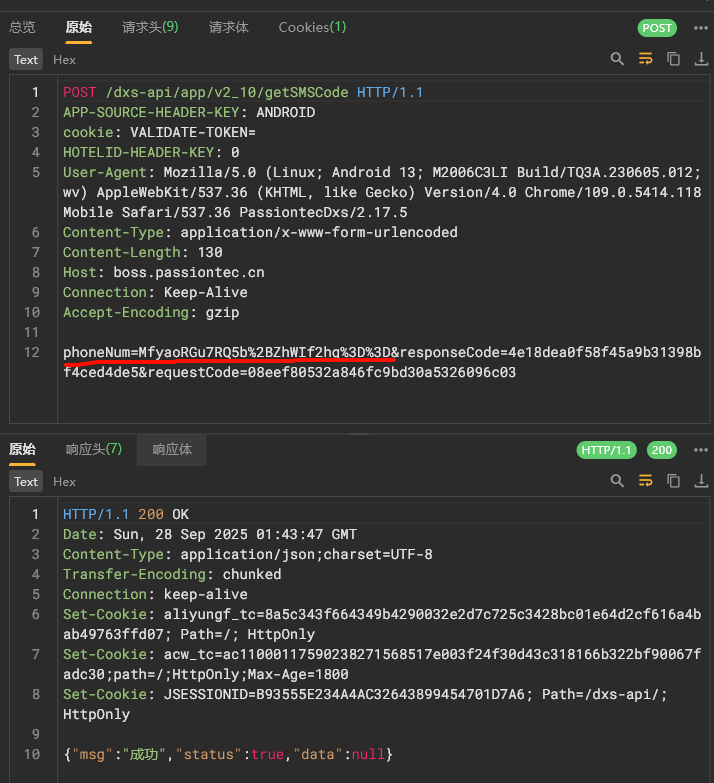
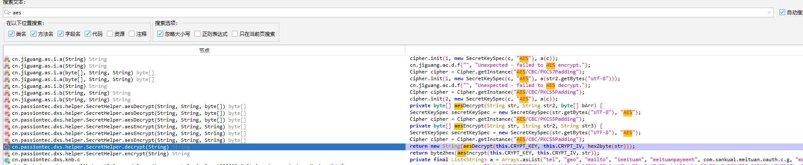
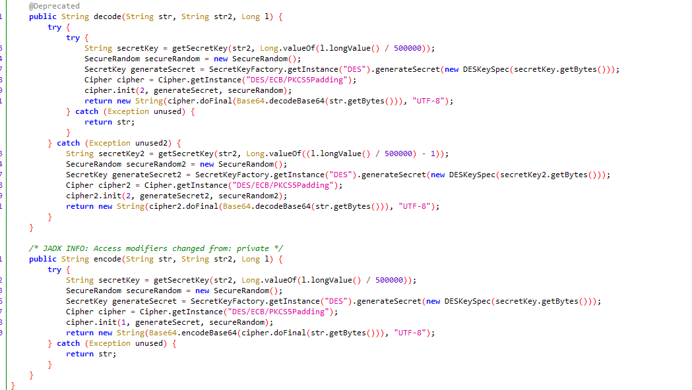
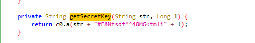
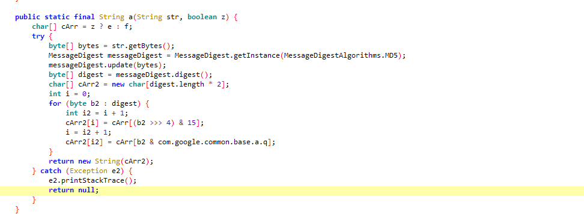
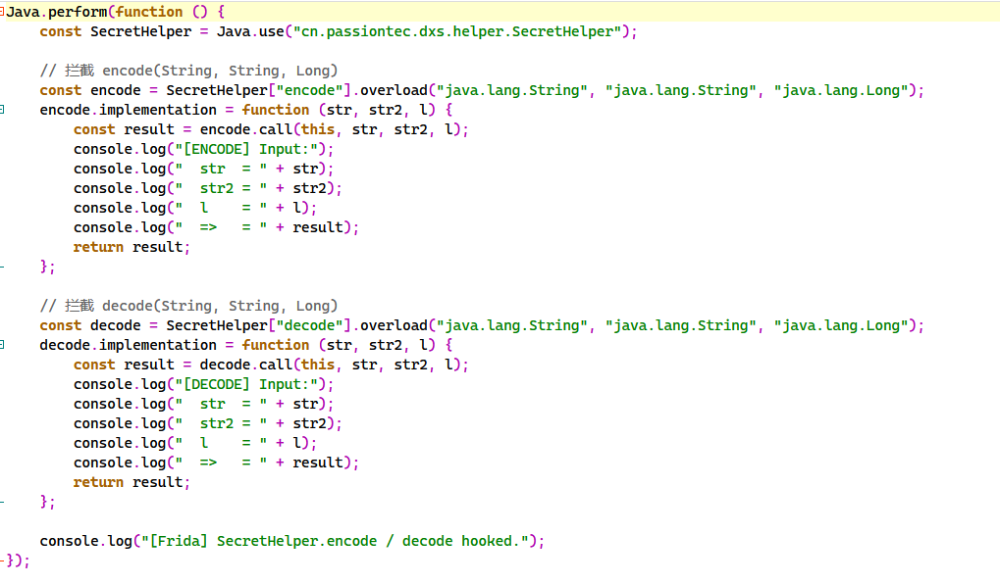
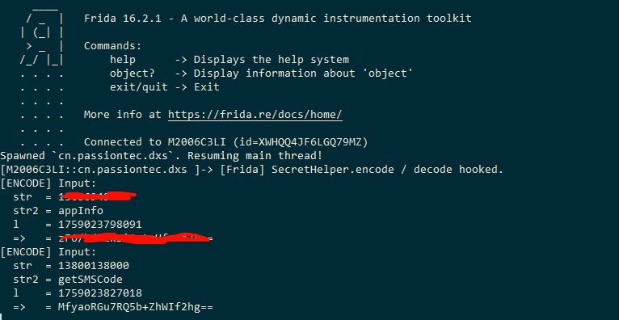
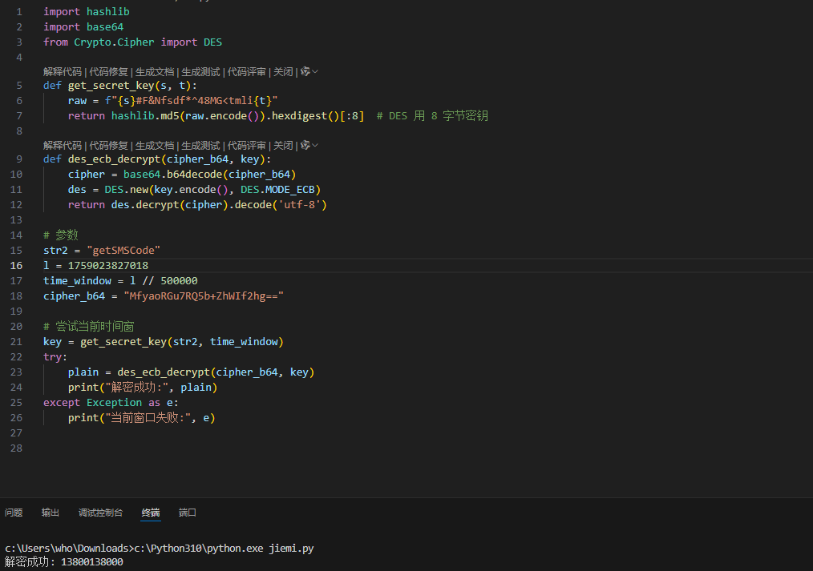

# 某app加密算法逆向分析-先知社区

> **来源**: https://xz.aliyun.com/news/19061  
> **文章ID**: 19061

---

**一：抓包**

挖掘某src碰到了，资产不在范围，遂分享一下。抓包发现phoneNum被加密了，无法进行深入分析

**二：逆向算法**

mt发现未加固，直接jadx分析，尝试搜索aes，encrypt，decrypt等，在搜索aes处，找到包的加密类SecretHelper

关键加解密函数：

在加密函数encode可以看到调用了getSecretKey，而getSecretKey又调用了c0.a，找到c0.a，是生成md5，到此关键函数都清楚了

**三、加密流程分析**

1. 开始 → 触发加密（输入参数：明文 str、业务标识 str2）
2. 获取时间戳
3. 算时间窗（t = l/500000）
4. 生成 DES 密钥
5. DES 加密
6. 结果处理（Base64→UTF-8→返回）

**四、frida hook测试**

frida -U -f "包名" -l C:\Users\who\Downloads\1.js，如图可以成功hook到，对比抓包的phoneNum，加密结果一致

frida脚本：

**五、解密**

整个加解密流程比较清晰，根据decode写出python脚本，代入加密结果及参数str2、l进行验证，可以成功解密

**六、总结**

整个加解密过程并不复杂，一步步分析即可
