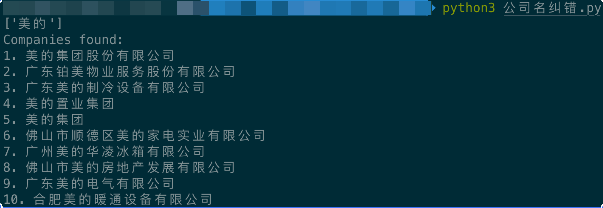
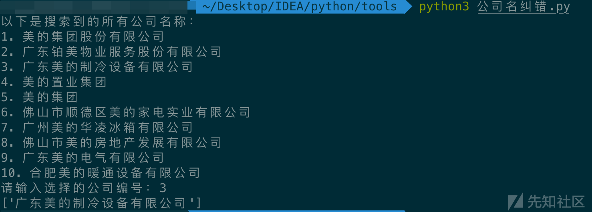
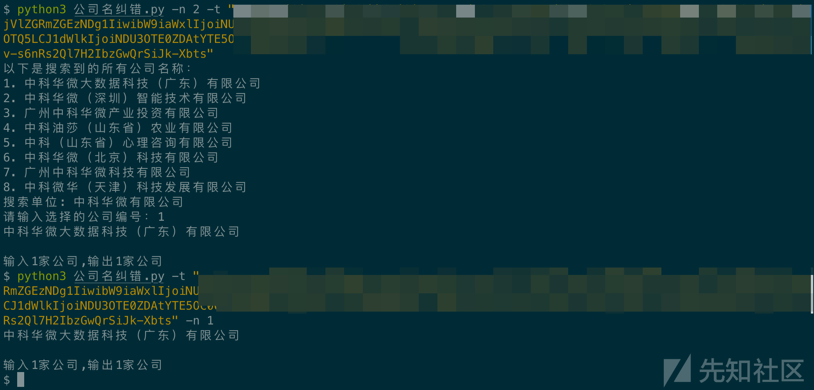
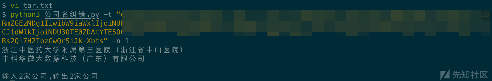

# 攻防演练目标资产名称纠正-先知社区

> **来源**: https://xz.aliyun.com/news/19064  
> **文章ID**: 19064

---

在参与攻防演练时候,经常会出现目标单位出错的情况,导致在搜集资产时候发现查无此家.(例如浙江某医院第六院,直接给出简称浙江中医六院,亦或是某单位该了公司名但是备案信息等等并未发生变化等等).手动纠错费时费力,在拼手速的攻防演练前期阶段非常之吃亏,为此想要写一个脚本来实现大规模的目标名称纠错.

我的大致思路是找一个类似于爱企查的网站,抓包后进行参数替换实现批量请求.发现,爱企查,天眼查等等网站参数校验极为严格,很难实现这个功能.最终在<https://riskbird.com/>这个网站上实现了此办法.

```
def req_riskbird(company_name, token):

    url = "https://riskbird.com/riskbird-api/newSearch"
    
    headers = {
        "Host": "riskbird.com",
        "User-Agent": "Mozilla/5.0 (Macintosh; Intel Mac OS X 10_15_7) AppleWebKit/537.36 (KHTML, like Gecko) Chrome/140.0.0.0 Safari/537.36",
        "Accept": "application/json",
        "App-Device": "WEB",
        "Content-Type": "application/json",
        "Origin": "https://riskbird.com",
        "Referer": "https://riskbird.com/search/company",
        "Accept-Language": "zh-CN,zh;q=0.9",
        "Cookie": f"token={token}; app-device=WEB;"
    }
    
    payload = {
        "queryType": "1",
        "searchKey": company_name,
        "pageNo": 1,
        "range": 10,
        "selectConditionData": "{"status":"","sort_field":""}"
    }
    
    try:
        response = requests.post(url, headers=headers, json=payload)
        response.raise_for_status()  # Raise an exception for HTTP errors
        
        data = response.json()
        
        if data.get("code") == 20000 and data.get("success"):
            # Extract company names from the response
            company_names = []
            for company in data.get("data", {}).get("list", []):
                if "entName" in company:
                    company_names.append(company["entName"])
            return company_names
        else:
            print(f"Error: {data.get('msg', 'Unknown error')}")
            return []
            
    except requests.exceptions.RequestException as e:
        print(f"Request failed: {e}")
        return []
    except json.JSONDecodeError:
        print("Failed to parse response as JSON")
        return []
```

指定关检测"美的"进行测试,功能正常



接下来我们要实现自动化纠错.我的思路是两种模式,num参数为1时代表默认选择名字匹配率最高的公司，2 代表手动选择公司

```
def compare_company(company_name, num, token):
    
    # 调用 req_riskbird 函数获取公司名称列表
    company_names = req_riskbird(company_name, token)
    
    if not company_names:
        # 如果没有返回任何公司名，则返回空列表
        print("未找到相关公司:",company_name)
        return []
    
    if num == 1:
        # 如果选择 1，返回第一个结果
        return [company_names[0]]
    elif num == 2:
        # 如果选择 2，返回所有结果并允许用户手动选择
        print("以下是搜索到的所有公司名称：")
        for i, name in enumerate(company_names, 1):
            print(f"{i}. {name}")
        
        # 用户选择公司
        try:
            print("搜索单位:",company_name)
            selected = int(input("请输入选择的公司编号："))
            if 1 <= selected <= len(company_names):
                return [company_names[selected - 1]]
            else:
                print("无效的选择")
                return []
        except ValueError:
            print("无效的输入")
            return []
    else:
        print("无效的 num 参数")
        return []
```



直接指定参数2进行输入,功能正常.目标自然是从文件中进行读取

```
def read_file():
    """
    读取同目录下的tar.txt文件，将每行内容（公司名称）存入列表并返回
    
    参数：
        无
    
    返回值：
        list: 包含所有公司名称的列表
    
    异常：
        如果文件读取失败，将抛出相应的异常
    """
    company_list = []
    
    try:
        with open('tar.txt', 'r', encoding='utf-8') as file:
            for line in file:
                # 去除每行的空格和换行符
                company_name = line.strip()
                if company_name:  # 确保不添加空行
                    company_list.append(company_name)
        return company_list
    
    except FileNotFoundError:
        raise FileNotFoundError("错误：tar.txt 文件不存在")
    except IOError:
        raise IOError("错误：无法读取 tar.txt 文件")
    except Exception as e:
        raise Exception(f"读取文件时发生错误: {str(e)}")
```

最终效果


比如这次这家单位使用了简称,在工具的帮助下成功纠错使得能够正常搜集信息,实现突破



浙江省中山医院,全称叫浙江中医药大学附属第三医院（浙江省中山医院）



最终脚本

```
import requests
import json
import argparse

def read_file():
    """
    读取同目录下的tar.txt文件，将每行内容（公司名称）存入列表并返回
    
    参数：
        无
    
    返回值：
        list: 包含所有公司名称的列表
    
    异常：
        如果文件读取失败，将抛出相应的异常
    """
    company_list = []
    
    try:
        with open('tar.txt', 'r', encoding='utf-8') as file:
            for line in file:
                # 去除每行的空格和换行符
                company_name = line.strip()
                if company_name:  # 确保不添加空行
                    company_list.append(company_name)
        return company_list
    
    except FileNotFoundError:
        raise FileNotFoundError("错误：tar.txt 文件不存在")
    except IOError:
        raise IOError("错误：无法读取 tar.txt 文件")
    except Exception as e:
        raise Exception(f"读取文件时发生错误: {str(e)}")

def req_riskbird(company_name, token):

    url = "https://riskbird.com/riskbird-api/newSearch"
    
    headers = {
        "Host": "riskbird.com",
        "User-Agent": "Mozilla/5.0 (Macintosh; Intel Mac OS X 10_15_7) AppleWebKit/537.36 (KHTML, like Gecko) Chrome/140.0.0.0 Safari/537.36",
        "Accept": "application/json",
        "App-Device": "WEB",
        "Content-Type": "application/json",
        "Origin": "https://riskbird.com",
        "Referer": "https://riskbird.com/search/company",
        "Accept-Language": "zh-CN,zh;q=0.9",
        "Cookie": f"token={token}; app-device=WEB;"
    }
    
    payload = {
        "queryType": "1",
        "searchKey": company_name,
        "pageNo": 1,
        "range": 10,
        "selectConditionData": "{"status":"","sort_field":""}"
    }
    
    try:
        response = requests.post(url, headers=headers, json=payload)
        response.raise_for_status()  # Raise an exception for HTTP errors
        
        data = response.json()
        
        if data.get("code") == 20000 and data.get("success"):
            # Extract company names from the response
            company_names = []
            for company in data.get("data", {}).get("list", []):
                if "entName" in company:
                    company_names.append(company["entName"])
            return company_names
        else:
            print(f"Error: {data.get('msg', 'Unknown error')}")
            return []
            
    except requests.exceptions.RequestException as e:
        print(f"Request failed: {e}")
        return []
    except json.JSONDecodeError:
        print("Failed to parse response as JSON")
        return []

def compare_company(company_name, num, token):
    """
    该函数通过调用 req_riskbird 函数，获取与公司名称相关的搜索结果，
    根据 num 的值来返回用户选择的企业名称。
    
    参数：
        company_name (str): 需要查询的目标公司名称
        num (int): 选择显示结果的方式，1表示选择第一个结果，2表示输出所有结果并手动选择
        token (str): 用户登录后获取的授权令牌，用于API鉴权
    
    返回值：
        list: 包含用户选择的公司名称的列表，若查询失败或没有结果，则返回空列表。
    
    异常：
        若调用 req_riskbird 发生异常，将返回空列表。
    """
    
    # 调用 req_riskbird 函数获取公司名称列表
    company_names = req_riskbird(company_name, token)
    
    if not company_names:
        # 如果没有返回任何公司名，则返回空列表
        print("未找到相关公司:",company_name)
        return []
    
    if num == 1:
        # 如果选择 1，返回第一个结果
        return [company_names[0]]
    elif num == 2:
        # 如果选择 2，返回所有结果并允许用户手动选择
        print("以下是搜索到的所有公司名称：")
        for i, name in enumerate(company_names, 1):
            print(f"{i}. {name}")
        
        # 用户选择公司
        try:
            print("搜索单位:",company_name)
            selected = int(input("请输入选择的公司编号："))
            if 1 <= selected <= len(company_names):
                return [company_names[selected - 1]]
            else:
                print("无效的选择")
                return []
        except ValueError:
            print("无效的输入")
            return []
    else:
        print("无效的 num 参数")
        return []


# Example usage
if __name__ == "__main__":
    parser = argparse.ArgumentParser(description="主程序功能：根据输入查询公司信息。")
    parser.add_argument("-n", "--num", type=int, choices=[1, 2], default=1, 
                        help="选择查询方式：1 - 默认选择匹配度最高的公司；2 - 手动选择公司")
    parser.add_argument("-f", "--file", type=str, default="tar.txt", 
                        help="存放公司名称的文件路径，默认为当前目录下的 'tar.txt'")
    parser.add_argument("-t", "--token", type=str, required=True, 
                        help="风鸟网站的认证令牌，用于 API 鉴权")
    
    args = parser.parse_args()

    company_list=read_file()

    res = []
    for i in company_list:
        res.extend(compare_company(i,args.num, args.token))
    for j in res:
        print(j)
    print(f"
输入{len(company_list)}家公司,输出{len(res)}家公司")
   
```
