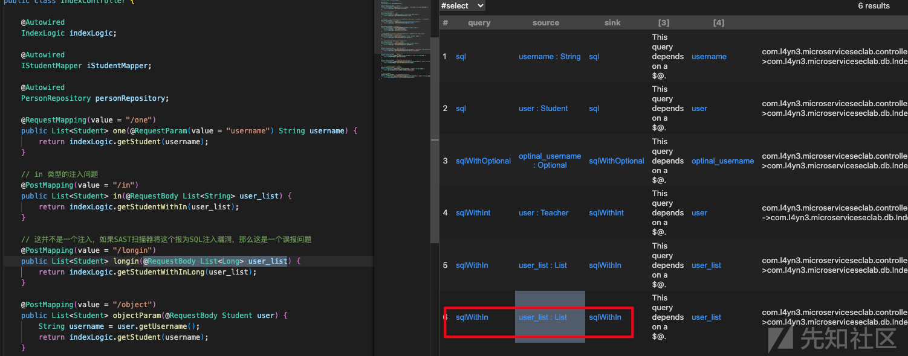
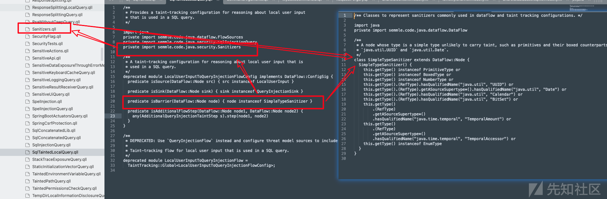
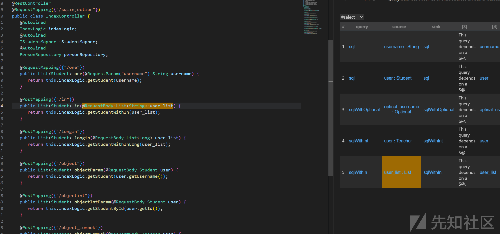
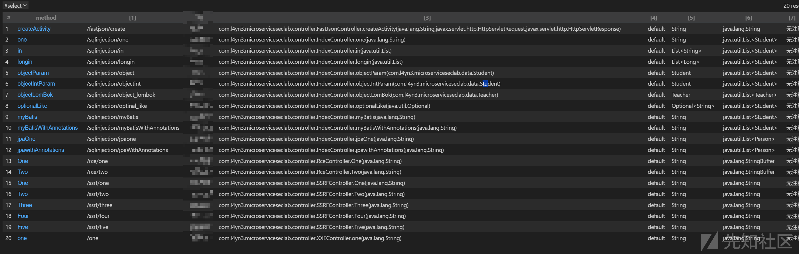

# CodeQL中Java污点分析的净化流优化与API安全检测实践-先知社区

> **来源**: https://xz.aliyun.com/news/19067  
> **文章ID**: 19067

---

# 前言

codeql中java相关的source和传播的相关规则基本都算差不多了，剩余的可能只有一个sink点的问题，不过这个我也是看不太懂。codeql针对不同漏洞类型都进行了不同的相关检测sink的定义，每种漏洞类型可能都有其特殊的检测逻辑。这里我就不做过多说明了，不过针对净化流isBarrier这里发现一些东西，可以做下相关补充说明。之后额外补充下使用codeql进行api的梳理，这个可能在api安全或者其他方面有相关作用。

# isBarrier

在codeql官方中isBarrier是我们的净化流，就是如果相关传播链路走到这了这里定义的规则节点，则后续会直接中断，这里通过一个案例来做下说明；

## sql注入误报

还是使用<https://github.com/l4yn3/micro_service_seclab>这个项目做测试，其中关于sql注入会有个误报的问题，具体接口如下所示：

```
    // 这并不是一个注入，如果SAST扫描器将这个报为SQL注入漏洞，那么这是一个误报问题
    @PostMapping(value = "/longin")
    public List<Student> longin(@RequestBody List<Long> user_list) {
        return indexLogic.getStudentWithInLong(user_list);
    }
```

使用官方的cwe-089中sql注入规则进行检测：



很容易就能看出入参的List<Long>这个数据类型在sql注入中不可能成为污点，针对这个误报我们其实很容易就能找到问题点，之前就做过说明source点官方的规则选取的范围其实过大，对于一些在实际场景中可能不存在风险的点也会标记为source，这里的这个List<Long>就是例子。

那么如何处理这个误报，去优化source，关于isTaintedInput的相关处理做优化?其实官方的方式是使用isBarrier，也就是设置净化点，从source到sink整个过程中污点如果进入相关净化点处理则表示为污点中断。既然有isBarrier，那就说明官方的codeql规则是存在相关处理的。

我们可以对sql注入这个官方规则进行下跟踪处理；

## codeql官方的Sanitizer

在对应具体的检测规则可以看到isBarrier中其实定义了Sanitizer，这是一些简单的常见的基础数据类型做了相关净化处理。但是对于泛型List<Long>这个问题，没有进行相关判断；

从这里其实可以看出codeql官方肯定是对sql注入这个问题了解的，不然也不会添加这个Sanitizer，但是吊诡的这里的判断过于简单，也可能是官方比较懒，或者是想在这里留给后续升级扩展实现？实际情况来看这个泛型的净化过滤问题应该存在好长时间。看了眼[micro\_service\_seclab](https://github.com/l4yn3/micro_service_seclab)这个项目已经四年前了；



单就上面的误报其实很简单解决，如下所示：

```
class SimpleType extends Type {
  SimpleType() {
    this.getType() instanceof PrimitiveType or
    this.getType() instanceof BoxedType or
    this.getType() instanceof NumberType or
    this.getType().(RefType).hasQualifiedName("java.util", "UUID") or
    this.getType().(RefType).getASourceSupertype*().hasQualifiedName("java.util", "Date") or
    this.getType().(RefType).hasQualifiedName("java.util", "Calendar") or
    this.getType().(RefType).hasQualifiedName("java.util", "BitSet") or
    this.getType()
        .(RefType)
        .getASourceSupertype*()
        .hasQualifiedName("java.time.temporal", "TemporalAmount") or
    this.getType()
        .(RefType)
        .getASourceSupertype*()
        .hasQualifiedName("java.time.temporal", "TemporalAccessor") or
    this.getType() instanceof EnumType
  }
}

predicate isBarrier(DataFlow::Node node) { 
  node.getType() instanceof SimpleType or
  node.getType().(ParameterizedType).getATypeArgument() instanceof SimpleType 
}
```

使用上面的净化流重新再次进行检测：



当然，按照正常的应用安全水平建设来看，这个可以加上自定义的相关安全检测的方法节点，一般来说会是security相关的方法等，如果有些你认为绝对安全，不会产生安全问题，也可以定义到里面，这其实就会减少大量误报的产生；

# spring的url映射提取

这个主要还是参考<https://www.yuque.com/loulan-b47wt/rc30f7/rysphc> loulan师傅的文章，依托之前codeql官方中SpringController的实现重新做了设计。

## 注释

```
private class MethodDescAnnotation extends Annotation {
  MethodDescAnnotation() {
    this.getType().hasQualifiedName("io.swagger.annotations", "ApiOperation")
  }
}

private string getMethodAnnoDesc(Method m){
        exists(Annotation anno |
            m.getAnAnnotation() = anno and anno  instanceof MethodDescAnnotation 
            |
            result = anno.getValue("value").toString()
        )
}


// 获取Javadoc中的第一行描述更安全的文档获取
string getMethodDescriptionSafe(Method m) {
  // 直接处理可能的情况
  if exists(m.getDoc()) and exists(m.getDoc().getJavadoc())
  then (
    exists(string fullDoc |
      fullDoc = m.getDoc().getJavadoc().toString() and
      result = formatComment(fullDoc)
    )
  )
  else result = "无注释"
}

bindingset[comment]
private string formatComment(string comment){
    //result = comment.regexpReplaceAll("^/\*\*\s*([^\
\r]*)", "$1").trim()
    result = comment.regexpReplaceAll("/\*\*\s*(.*)\s*\*", "$1").trim()
}

string getDescription(Method m){
    result = getMethodAnnoDesc(m)
    or
    (not exists(getMethodAnnoDesc(m)) and result = getMethodDescriptionSafe(m))
}
```

这里只说明下，楼兰师傅那里针对接口的注释提取写的很完善了，包含使用Javadoc官方的谓词去提取默认注释内容，还有针对swagger的ApiOperation配置文档的提取。这里说明的是formatComment谓词，这里没法处理多行代码注释。需要的话自己去实现吧。

## 路径标准化

```
// 更简洁的路径标准化
bindingset[path]
string normalizePath(string path) {
  if path = "" or path = "/"
  then result = ""
  else 
    exists(string cleaned |
      // 去除前导斜杠
      (if path.matches("/%") then cleaned = path.substring(1, path.length()) else cleaned = path) and
      // 去除末尾斜杠并添加前导斜杠
      (if cleaned.matches("%/") 
       then result = "/" + cleaned.substring(0, cleaned.length() - 1)
       else result = "/" + cleaned)
    )
}

class MySpringMethod extends SpringRequestMappingMethod {
  MySpringMethod() {
    this.getDeclaringType() instanceof SpringController
  }
    // 获取Controller方法的URL路径
    string getControllerUrl() {
      // 获取类级别的RequestMapping注解值
      exists(string classMapping, string methodMapping |
        (
          if exists(this.getDeclaringType().getAnAnnotation().getAStringArrayValue("value"))
          then classMapping = this.getDeclaringType().getAnAnnotation().getAStringArrayValue("value")
          else classMapping = ""
        ) and
        (
          if exists(this.getAnAnnotation().getAStringArrayValue("value"))
          then methodMapping = this.getAnAnnotation().getAStringArrayValue("value")
          else methodMapping = ""
        ) and
        result = normalizePath(classMapping) + normalizePath(methodMapping)
      )
    }
}
```

这里直接使用了SpringRequestMappingMethod的相关ql，首先判断对应Class是否有相关路径直接，之后判断method，最后将两者合并。合并这里其实也会有些问题，因为一些情况下代码里的路径什么都有，如foo/，method是/bar，拼接后便是foo//bar，这里统一做了处理只保留前导斜杠。

剩余的就是一些其他方面的接口内容，有的是选择官方的codeql里面的谓词。比如`getMyProduces`返回对应produces属性，这个有时候需要去判断请求body类型，当然大部分可能代码里不会有。还有个更关键的可能是请求参数对象和返回参数对象。这个可能在处理敏感信息检测的时候可能会有作用。但是实际业务我看大部分都是使用一个封装的response去返回，这个具体怎么处理我看loulan师傅也做过介绍<https://www.yuque.com/loulan-b47wt/rc30f7/ybex7l#ZFmz9>。我这里就不继续了。

## 其他

汇总的一个总的ql规则用来检测api。

```
import semmle.code.java.frameworks.spring.SpringController


// 更简洁的路径标准化
bindingset[path]
string normalizePath(string path) {
  if path = "" or path = "/"
  then result = ""
  else 
    exists(string cleaned |
      // 去除前导斜杠
      (if path.matches("/%") then cleaned = path.substring(1, path.length()) else cleaned = path) and
      // 去除末尾斜杠并添加前导斜杠
      (if cleaned.matches("%/") 
       then result = "/" + cleaned.substring(0, cleaned.length() - 1)
       else result = "/" + cleaned)
    )
}


private class MethodDescAnnotation extends Annotation {
  MethodDescAnnotation() {
    this.getType().hasQualifiedName("io.swagger.annotations", "ApiOperation")
  }
}

private string getMethodAnnoDesc(Method m){
        exists(Annotation anno |
            m.getAnAnnotation() = anno and anno  instanceof MethodDescAnnotation 
            |
            result = anno.getValue("value").toString()
        )
}


// 获取Javadoc中的第一行描述更安全的文档获取
string getMethodDescriptionSafe(Method m) {
  // 直接处理可能的情况
  if exists(m.getDoc()) and exists(m.getDoc().getJavadoc())
  then (
    exists(string fullDoc |
      fullDoc = m.getDoc().getJavadoc().toString() and
      result = formatComment(fullDoc)
    )
  )
  else result = "无注释"
}

bindingset[comment]
private string formatComment(string comment){
    //result = comment.regexpReplaceAll("^/\*\*\s*([^\
\r]*)", "$1").trim()
    result = comment.regexpReplaceAll("/\*\*\s*(.*)\s*\*", "$1").trim()
}

string getDescription(Method m){
    result = getMethodAnnoDesc(m)
    or
    (not exists(getMethodAnnoDesc(m)) and result = getMethodDescriptionSafe(m))
}


class MySpringMethod extends SpringRequestMappingMethod {
  MySpringMethod() {
    this.getDeclaringType() instanceof SpringController
  }


    // 获取方法签名，包含类名、方法名及参数类型
    string getMySignature(){
        result = this.getDeclaringType().(RefType).getQualifiedName() + "." + this.getSignature()
    }

    // 获取方法参数类型列表，若无参数则返回"无参数"
    string getMyParameters(){
    //if exists(Parameter p | p = this.getARequestParameter() and p.isTaintedInput() |  )
            if not exists(SpringRequestMappingParameter p | 
            p = this.getARequestParameter() and p.isTaintedInput())
            then result = "无参数"
            else result = concat(SpringRequestMappingParameter p, int i |
                p = this.getParameter(i) and p.isTaintedInput() |
                p.getType().toString(), " | " order by i)
    }


    // 获取方法返回值类型的字符串表示
    string getResponseBody(){
        // 处理RefType
        if exists(this.getReturnType().(RefType))
        then result = this.getReturnType().(RefType).getQualifiedName()
        // 处理基本类型
        else if this.getReturnType() instanceof PrimitiveType
        then result = this.getReturnType().(PrimitiveType).getName()
        // 处理void类型
        else if this.getReturnType() instanceof VoidType
        then result = "void"
        // 处理数组类型
        else if this.getReturnType() instanceof Array
        then result = this.getReturnType().(Array).getElementType().toString() + "[]"
        // 其他情况
        else result = this.getReturnType().toString()
    }
    

    // 判断方法是否有@ResponseBody注解
    string getisresponseBody() {
            if this.isResponseBody() 
            then result = "是" 
            else result = "否"
        }


    // 获取方法的produces属性，若无则返回"default"
    string getMyProduces() {
      if exists(this.getProduces())
      then result = this.getProduces()
      else result = "default"
    }

    // 获取Controller方法的URL路径
    string getControllerUrl() {
      // 获取类级别的RequestMapping注解值
      exists(string classMapping, string methodMapping |
        (
          if exists(this.getDeclaringType().getAnAnnotation().getAStringArrayValue("value"))
          then classMapping = this.getDeclaringType().getAnAnnotation().getAStringArrayValue("value")
          else classMapping = ""
        ) and
        (
          if exists(this.getAnAnnotation().getAStringArrayValue("value"))
          then methodMapping = this.getAnAnnotation().getAStringArrayValue("value")
          else methodMapping = ""
        ) and
        result = normalizePath(classMapping) + normalizePath(methodMapping)
      )
    }


    // 获取当前方法的注解
    string getFullDescriptionString() {
      result = getDescription(this)
    }
    
}

```

上面的各个谓词就不做过多介绍了直接看下相关使用

```
from
    MySpringMethod method
where
    method.getDeclaringType() instanceof SpringController
select
    method,
    method.getControllerUrl(),
    method.getMySignature(),
    method.getMyProduces(),
    method.getMyParameters(),
    method.getResponseBody(),
    method.getFullDescriptionString()
```

具体检测结果



# 总结

上面算是对最近遇到的一些点做了下记录，希望能对相关问题解决有帮助。当然codeql想要满足使用还是要结合下业务的具体实践，这里我说下可能是通用性的问题，一个就是三方包的问题，当前大型微服务都是各种引用，这时候很多问题代码是在一个基础包里面，但是因为是跨包，sink点就没办法深入去匹配上了。不过其实可以通过jar包反编译去重构数据库再进行分析，不过这个操作对于源码的构建完整性质量感觉可能不是很好（也可能我太菜了）。还有一个问题是也是微服务架构常见的，内部接口调用，当前可能很多都是rpc接口或者其他自定义接口，这种对于当前source点其实还是需要重新进行去自定义实现了。
