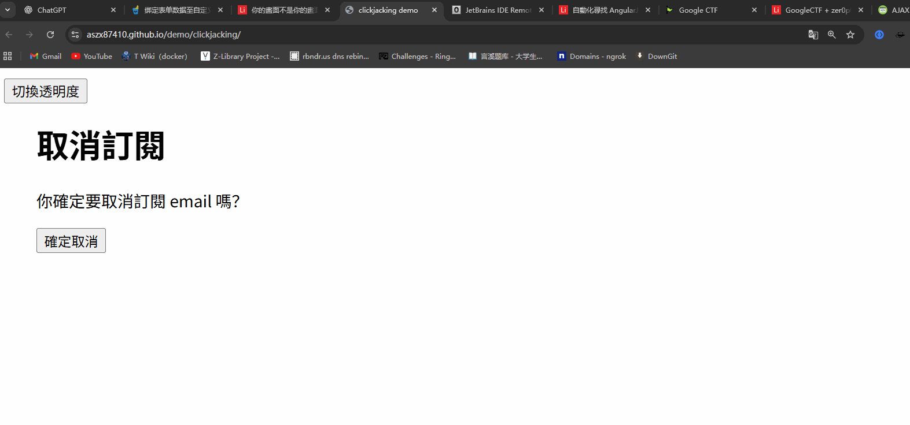
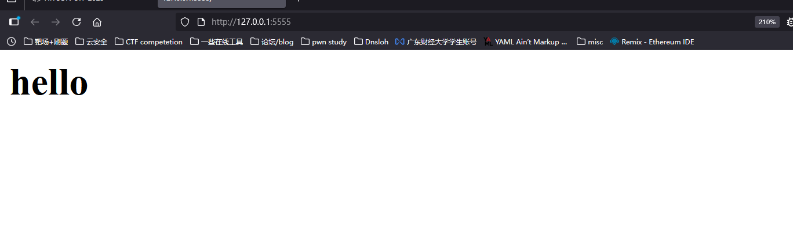
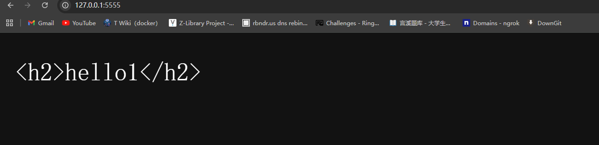
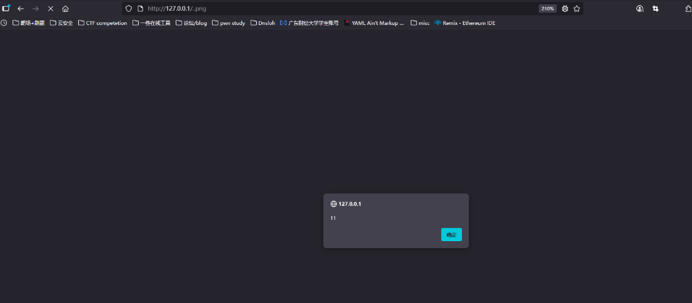
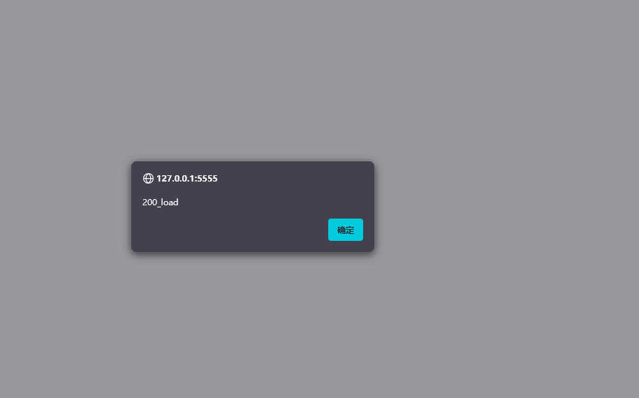
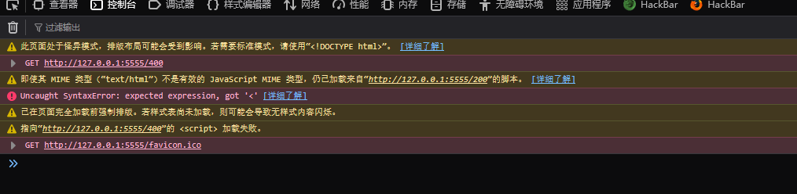

# 前端安全-ClickJacing+sniffing+XSLeaks-先知社区

> **来源**: https://xz.aliyun.com/news/19069  
> **文章ID**: 19069

---

# ClickJacking

ClikeJacking的原理其实很简单，透过css嵌套一个页面进一个主页面，例如在A中放一个B页面，可以利用iframe等方法，然后利用css将其的透明度设置为0.001,这个时候如果用户A点击某个按钮，就会点到B页面的按钮，例如这样子[clickjacking 范例](https://aszx87410.github.io/demo/clickjacking/)  
  
攻击手法：

1. 把目标网页嵌入恶意网页之中（透过iframe 或其他类似标签）
2. 在恶意网页上用CSS 把目标网页盖住，让使用者看不见
3. 诱导使用者前往恶意网页并且做出操作（输入或点击等等）
4. 触发目标网页行为，达成攻击  
   三种防御方式  
   如果你不想被iframe载入  
   X-Frame-Options

```
X-Frame-Options: DENY
Content-Security-Policy: frame-ancestors 'none'
```

如果只允许same-origin载入

```
X-Frame-Options: SAMEORIGIN
Content-Security-Policy: frame-ancestors 'self'
```

如果要用allow list 指定允许的来源

```
X-Frame-Options: ALLOW-FROM https://example.com/
Content-Security-Policy: frame-ancestors https://example.com/
```

# MIME sniffing

这个考点似乎之前遇到过,当时记得是让其浏览器自己解析为js，然后写一个js的页面，就可以把flag外带出来，但是主播确实想不起来是哪道题了。  
这个漏洞其实就是，在response包中，会包含Content-Type，如果这个不存在，浏览器就会自动识别然后将其改为对应类型，有的时候就算带了这个hearder也会自动识别

## 从一个demo开始

```
const express = require('express');
const app = express();

app.get('/', (req, res) => {
  res.write('<h1>hello</h1>')
  res.end()
});

app.listen(5555, () => {
  console.log('Server is running on port 5555');
});
```

  
可以看到浏览器自动解析了，但是我们如果换成h2呢？  
  
在火狐里面是会正常显示的，而在google里面就不会，这个是因为每个浏览器对这个的处理是不一样的，我们可以看一下google是怎么处理的

```
// Our HTML sniffer differs slightly from Mozilla.  For example, Mozilla will
// decide that a document that begins "<!DOCTYPE SOAP-ENV:Envelope PUBLIC " is
// HTML, but we will not.

#define MAGIC_HTML_TAG(tag) \
  MAGIC_STRING("text/html", "<" tag)

static const MagicNumber kSniffableTags[] = {
  // XML processing directive.  Although this is not an HTML mime type, we sniff
  // for this in the HTML phase because text/xml is just as powerful as HTML and
  // we want to leverage our white space skipping technology.
  MAGIC_NUMBER("text/xml", "<?xml"),  // Mozilla
  // DOCTYPEs
  MAGIC_HTML_TAG("!DOCTYPE html"),  // HTML5 spec
  // Sniffable tags, ordered by how often they occur in sniffable documents.
  MAGIC_HTML_TAG("script"),  // HTML5 spec, Mozilla
  MAGIC_HTML_TAG("html"),  // HTML5 spec, Mozilla
  MAGIC_HTML_TAG("!--"),
  MAGIC_HTML_TAG("head"),  // HTML5 spec, Mozilla
  MAGIC_HTML_TAG("iframe"),  // Mozilla
  MAGIC_HTML_TAG("h1"),  // Mozilla
  MAGIC_HTML_TAG("div"),  // Mozilla
  MAGIC_HTML_TAG("font"),  // Mozilla
  MAGIC_HTML_TAG("table"),  // Mozilla
  MAGIC_HTML_TAG("a"),  // Mozilla
  MAGIC_HTML_TAG("style"),  // Mozilla
  MAGIC_HTML_TAG("title"),  // Mozilla
  MAGIC_HTML_TAG("b"),  // Mozilla
  MAGIC_HTML_TAG("body"),  // Mozilla
  MAGIC_HTML_TAG("br"),
  MAGIC_HTML_TAG("p"),  // Mozilla
};

// ...

// Returns true and sets result if the content appears to be HTML.
// Clears have_enough_content if more data could possibly change the result.
static bool SniffForHTML(base::StringPiece content,
                         bool* have_enough_content,
                         std::string* result) {
  // For HTML, we are willing to consider up to 512 bytes. This may be overly
  // conservative as IE only considers 256.
  *have_enough_content &= TruncateStringPiece(512, &content);

  // We adopt a strategy similar to that used by Mozilla to sniff HTML tags,
  // but with some modifications to better match the HTML5 spec.
  base::StringPiece trimmed =
      base::TrimWhitespaceASCII(content, base::TRIM_LEADING);

  // |trimmed| now starts at first non-whitespace character (or is empty).
  return CheckForMagicNumbers(trimmed, kSniffableTags, result);
}
```

会检查response 移除空白以后开头的字串是不是符合上面列出的那些HTML 的模式，可以看到一般常见的网页开头`<!DOCTYPE html`跟`<html`都有在上面。这也解释了为什么我们前面试过的两个范例中，只有`<h1>hello</h1>`这个范例最后是呈现为HTML

## 利用MIME sniffing攻击

这个手法主要是结合某些中间件的特性一起使用，这里用的是Apache2.4，然后在最新版本似乎修了(bao爷说的我不知道)，就是当你上传`..png`的文件的时候apahce就不会带上response，这个时候你如果写入一个script就可以实现xss等漏洞  


## 可以当Script 载入的content-Type

想一下

```
<script src="URL"></script>
```

当URL为什么类型的时候，才会被认为是script载入呢？  
具体可以看到这里

```
//  Support every script type mentioned in the spec, as it notes that "User
//  agents must recognize all JavaScript MIME types." See
//  https://html.spec.whatwg.org/#javascript-mime-type.
const char* const kSupportedJavascriptTypes[] = {
    "application/ecmascript",
    "application/javascript",
    "application/x-ecmascript",
    "application/x-javascript",
    "text/ecmascript",
    "text/javascript",
    "text/javascript1.0",
    "text/javascript1.1",
    "text/javascript1.2",
    "text/javascript1.3",
    "text/javascript1.4",
    "text/javascript1.5",
    "text/jscript",
    "text/livescript",
    "text/x-ecmascript",
    "text/x-javascript",
};
```

可以看到允许很多type进行载入script，这里不多说啦，但是如果设置了

```
X-Content-Type-Options: nosniff 
```

的时候，以上就无效了

# XSLeaks

XSLeaks全称Cross-site leaks，学习下来其实就是侧信道，利用一些其他的信息进行leak，也对侧信道的概念清晰了一点，举一个例子,有两个房间中间隔着一个门，一边有三个灯泡A,B,C，另外一边是A.B.C的开关，你只有一次机会，打开开关然后去对面查看结果后得到哪个开关是控制哪一个灯泡的，如果按旁路攻击的思路就是，开A灯开1h，然后关闭A等，打开B灯然后进去看，摸一下灯泡看哪个是热的，就可以判断出来了，这个就是侧信道。

## XSLeaks demo1

大家可以用浏览器开启这个网页：<https://browserleaks.com/social>  
就可以检查你是否登录了某个页面，这个的原理就是用到了XSLeaks

首先，可以通过onerror和onload来判断你是否载入了一张图片

```

```

并且大部分网站都有一个特性，就是登录完后会进行自动的跳转，所以我们可以改成这样子

```

```

如果使用者有登入的话，就会跳转到网站的logo 网址，因为这真的是张图片所以会执行到`onload`，反之，则会被导到登入页面，而这不是图片所以会到`onerror`，所以根据这个方法就可判断你是否登录了

## 利用状态码的XSLeaks

``在载入内容时，除了会检查状态码以外，也会检查response 是不是一张图片，因此只能拿来判断「最后载入的是不是图片」。而另外一个标签`<script>`就不同了，如果response 的状态码是200，那就算内容不是JavaScript，也不会触发`onerror`事件。

```
const express = require('express');
const app = express();

app.get('/200', (req, res) => {
  res.writeHead(200, { 'Content-Type': 'text/html'})
  res.write('<h1>hello</h1>')
  res.end()
});

app.get('/400', (req, res) => {
  res.writeHead(400)
  res.end()
});

app.get('/', (req, res) => {
  res.writeHead(200, { 'Content-Type': 'text/html' })
  res.write('<script src="/200" onerror=alert("200_error") onload=alert("200_load")></script>')
  res.write('<script src="/400" onerror=alert("400_error") onload=alert("400_load")></script>')
  res.end()
});

app.listen(5555, () => {
  console.log('Server is running on port 5555');
});
```

  
虽然正常弹窗了但是我们看到控制台  
  
依然可以看到报错。  
而huli师傅举了一个例子就是Twitter的一个漏洞[Twitter ID exposure via error-based side-channel attack](https://hackerone.com/reports/505424)  
具体就不讲了，挺好玩的。

## 其他可以leak的东西

这里举得例子就是frames

```
var win = window.open('http://localhost:5555')
// 等 window 載入完成
setTimeout(() => {
  alert(win.frames.length)
}, 1000)
```

如果开启的页面有一个iframe，长度就是1，什么都没有的话就是0。如果一个网站会根据行为的不同，而有不同的iframe 数量的话，我们就可以用这招来侦测。  
具体看这里：[Patched Facebook Vulnerability Could Have Exposed Private Information About You and Your Friends](https://www.imperva.com/blog/facebook-privacy-bug/)

## Cache probing

Cache基本上到处都可见，我认为就是让用户的体验感更好，以request来说，比如你已经加载过这个页面了，下次再打开的时候不变的地方就会从Cache中取，这样子加载页面会快很多，而这个手法就是利用缓存来进行攻击，和CPU漏洞Spectre与Meltdown就和Cache有关，举个例子：  
假设一个网站如果有登入的话，就会显示欢迎页面，上面有着一张welcome.png，没登入的话就看不到，会导回到登入页面。而这张图片显示以后，就会存在浏览器的Cache中，我们只需要判断这图片的载入时间就可以知道用户有没有登录，这里有一个实际例子：  
[Leaking COVID risk group via XS-Leaks](https://www.youtube.com/watch?v=Cknka1pN268&ab_channel=Securitum)  
这里提一下一个地方，就是当你已经加载过所有的资源后，可以使用4xx和5xx让浏览器去删除cache从而可以继续使用这个手法，而利用的时候有时候可以利用waf的报错来进行清除，这个就是大概这个手法的利用方式和场景

### 加上error event

这个主要是因为我们在利用Cache Probing的时候，是靠加载资源的时间来判断的，但是如果本身的网络就很快，加载资源和Cache的时间差不多的时候，我们就可以利用img标签和error event来攻击

假设有一个`https://app.huli.tw/search?q=abc`的页面，会根据搜索结果呈现不同画面，如果有搜索到东西，就会出现`https://app.huli.tw/found.png`，没搜索到的话就不会有这张图片。  
攻击步骤（这里都以huli师傅给出的思路一样，所以看我的和huli师傅的一样）：  
首先第一步就是要去除Cahce：

```
// 程式碼改寫自 https://github.com/xsleaks/xsleaks/wiki/Browser-Side-Channels#cache-and-error-events
let url = 'https://app.huli.tw/found.png';

// 這行可以在 URL 後面加上一堆逗號，送出去的 request 的 referrer 就會太大
history.replaceState(1,1,Array(16e3));

// 發出 request
await fetch(url, {cache: 'reload', mode: 'no-cors'});
```

第二步就是去载入目标网站，将found.png写入到cache中  
最后一步就是把网址弄的很长再载入图片

```
// 程式碼改寫自 https://github.com/xsleaks/xsleaks/wiki/Browser-Side-Channels#cache-and-error-events
let url = 'https://app.huli.tw/found.png';

history.replaceState(1,1,Array(16e3));
let img = new Image();
img.src = url;
try {
  await new Promise((r, e)=>{img.onerror=e;img.onload=r;});
  alert('Resource was cached'); // Otherwise it would have errored out
} catch(e) {
  alert('Resource was not cached'); // Otherwise it would have loaded
}
```

如果图片没有在快取中，那浏览器就会发request 去拿，这时候就会碰到跟第一步一样的状况，因为header 太长所以伺服器回传错误，触发`onerror`事件。

反之，如果在快取中的话，浏览器就会直接用快取中的图片，根本不会发request，载入快取中的图片后就会触发`onload`事件。

## Cache Partitioning

以上的所有攻击方式都是基于，Cache是共用的，这个时候Chrome新出了一个机制：cache partitioning，快速分区，Cache分区启用之后，快取的key 变得不一样了，从一个URL 变成一个tuple:

1. top-level site
2. current-frame site
3. resource URL  
   假设在`https://app.huli.tw/search?q=abc`载入图片`https://app.huli.tw/found.png`，快取的key 就是：
4. [https://huli.tw](https://huli.tw/)
5. [https://huli.tw](https://huli.tw/)
6. <https://app.huli.tw/found.png>

而若是从另外一个`https://localhost:5555/exploit.html`的页面载入图片`https://app.huli.tw/found.png`，快取的key 就是：

1. <http://localhost:5555>
2. <http://localhost:5555>
3. <https://app.huli.tw/found.png>

要三块key都一样才会存取到一起，不然就会分开，但是我们注意到Cache主要还是看site而不是origin，所以如果我们不是从`http://localhost:5555`发起攻击，而是从`https://test.huli.tw`发起攻击呢？

1. [https://huli.tw](https://huli.tw/)
2. [https://huli.tw](https://huli.tw/)
3. <https://app.huli.tw/found.png>

跟从`https://app.huli.tw/search?q=abc`载入图片是一样的，所以还是可以执行刚刚的cache probing 攻击。

## 防御方式之一

最简单的就是same-site cookie，透过把cookie 设置成`SameSite=Lax`这样子无论是什么标签，都不会带上cookie，除了这个之外还有几种方式可以防御。  
第一种是`Cross-Origin-Resource-Policy`的header，可以控制资源的加载，例如`Cross-Origin-Resource-Policy: same-origin`  
第二种是一个叫做Fetch Metadata 的新机制，它是当网页发出request 时，浏览器会自动加上的header，有以下几个:

1. `Sec-Fetch-Site`，发出请求的网站跟目标网站的关系
2. `Sec-Fetch-Mode`，发出请求的模式
3. `Sec-Fetch-Dest`，请求的目的地

`Sec-Fetch-Site`的值主要有以下几种：

1. same-origin
2. same-site
3. cross-site
4. none（无法归类在上面的，例如说浏览器从书签点开网站）

`Sec-Fetch-Mode`有这几种：

1. same-origin
2. no-cors
3. cors
4. navigate

第三种的话就是把成功跟失败的状态码都改成200，就无法根据状态码的差别侦测出差异了

# 最后

这个是huli师傅写的最后一章了，对于CORS和same-site，csrf的部分我没有写是因为我认为确实触发条件太过于苛刻而且实战中也很难利用，接下来就是开始复现time了，会开一个专栏吧，遇到一个复现一个，积少成多呜呜呜  
最后，致敬huli师傅

References:  
[Leaks Wiki](https://xsleaks.dev/)  
[huli's blog](https://aszx87410.github.io/beyond-xss/)
