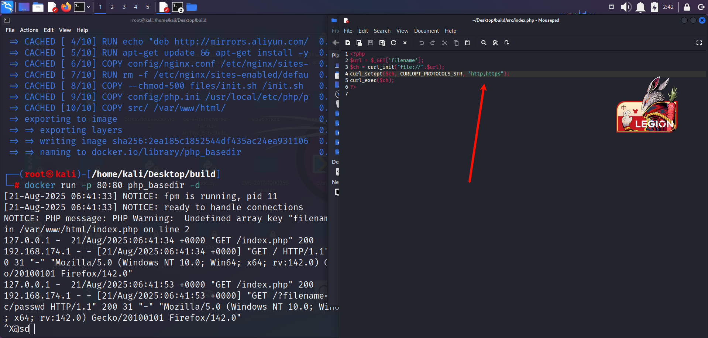
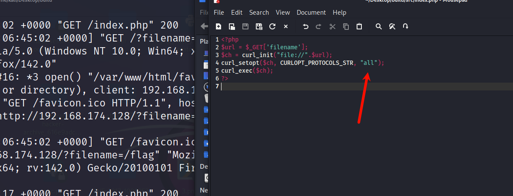
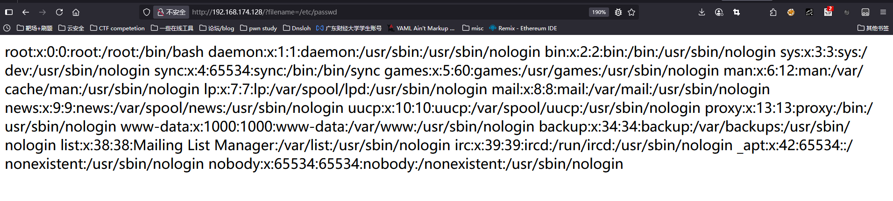

# 高版本下PHP cURL 扩展绕过open_basedir的trick分析-先知社区

> **来源**: https://xz.aliyun.com/news/19075  
> **文章ID**: 19075

---

# 前言

之前写过一篇简单的open\_basedir绕过，其实没有想到在高版本下的php也会存在这个漏洞，于是再来看看有什么好玩的地方

# 简介

`open_basedir` 是 PHP 中常用的一项安全配置，用于限制 PHP 脚本只能访问指定目录下的文件，从而防止任意文件读取（Local File Read, LFR）。理论上，开启该选项后，应用无法通过 PHP 的文件相关函数（如 `fopen`、`file_get_contents`、`include` 等）访问不在允许目录中的文件，具体的配置我就不写了，因为上一篇是有提到的

然而，PHP 并不仅仅依赖内建的文件 API 访问本地文件。在实际应用中，cURL 扩展（基于 libcurl）被广泛使用，用于 HTTP/HTTPS 请求、文件传输和 API 调用。由于 cURL 同样支持 `file://` 协议，如果限制不严，就可能绕过 `open_basedir`，带来严重的安全风险。

# 复现+分析

## 触发条件

* PHP 配置启用了 `open_basedir`；
* PHP 使用了 libcurl ≥ 7.85.0；
* 应用调用 `CURLOPT_PROTOCOLS_STR` 或 `CURLOPT_REDIR_PROTOCOLS_STR` 并设置为 `"all"`；

## 分析

在 PHP cURL 拓展接口中，当设置 `CURLOPT_PROTOCOLS_STR` 或 `CURLOPT_REDIR_PROTOCOLS_STR` 时，如果检测到 `open_basedir` 已启用，代码会检查用户输入字符串中是否包含 `"file"`：

```
if ((option == CURLOPT_PROTOCOLS_STR || option == CURLOPT_REDIR_PROTOCOLS_STR) &&
    (PG(open_basedir) && *PG(open_basedir)) &&
    php_memnistr(ZSTR_VAL(str), "file", sizeof("file") - 1, ZSTR_VAL(str) + ZSTR_LEN(str)) != NULL) {
        php_error_docref(NULL, E_WARNING, "The FILE protocol cannot be activated when an open_basedir is set");
        return FAILURE;
}
```

详情可见：[github-CURL](https://github.com/php/php-src/blob/3b115e6e9b13cb1872cc7547aba11bf06793f5fc/ext/curl/interface.c#L1939)  
所以在高版本下的php中，如果你打开了open\_basedir的话，是没办法使用curl到`file://`协议读取到本地的文件的。  
但是我们可以看到在libcurl中，libcurl 内部通过 `protocol2num` 解析协议字符串：

```
if(curl_strequal(str, "all")) {
    *val = ~(curl_prot_t)0;  // 打开所有协议位
    return CURLE_OK;
}
```

因此，传入 `"all"` 会开启所有协议，包括 `file://`。  
所以当我们开启了open\_basedir的时候，如果使用了curl extension，并且将`CURLOPT_PROTOCOLS_STR`设置为'all'的时候，他还是可以读取到文件。

## 复现

举个例子（PHP8.3.0）:

```
<?php
$url = $_GET['filename'];
$ch = curl_init("file://".$url);
curl_setopt($ch, CURLOPT_PROTOCOLS_STR, "http,https");
curl_exec($ch);
?>

```

  
可以看到当STR设置为http的时候是读不到根目录的文件的  
  
但是如果当你的`CURLOPT_PROTOCOLS_STR`设置为all的时候  
  
  
可以看到能读到根目录下的文件了，绕过了open\_basedir的限制

# 总结

本文分析了 PHP cURL 扩展在处理协议白名单时的一个逻辑缺陷：PHP 通过字符串匹配来禁止 `file` 协议，却忽略了 libcurl 中 `"all"` 的特殊语义，从而导致攻击者能够绕过 `open_basedir` 的保护。

这一漏洞的本质在于 **安全机制和底层库语义不一致**。它提醒我们，安全措施必须基于精确的语义理解，而不能依赖字符串匹配或黑名单过滤。
